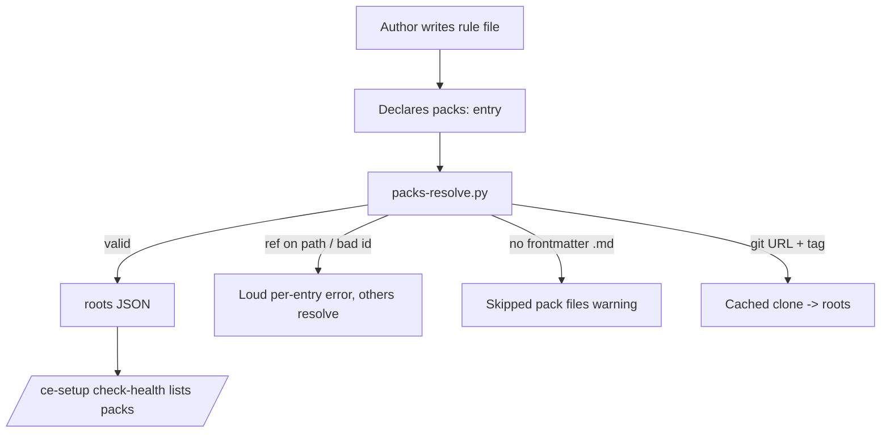
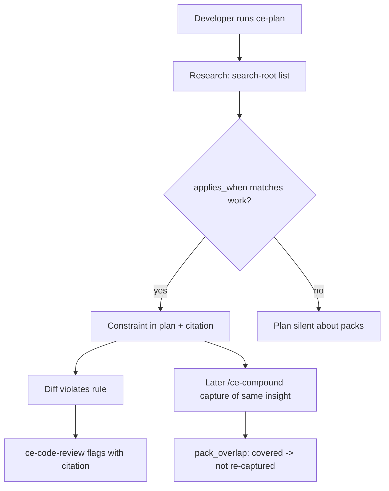

# Dogfood Report — feat/ce-packs-v0

> Diff-scoped QA of `feat/ce-packs-v0` vs `origin/main`. Generated by `/ce-dogfood` on 2026-08-26.
> **Adaptation note:** this branch ships no web surface — its users drive a terminal and an agent. The matrix is executed through the product's real UX (the resolver CLI, the shipped skill prose exercised by fresh agents, `check-health`, and the docs walkthrough in a clean repo) instead of `agent-browser`.

## Diff Summary

- Compound Packs: a `packs:` config list (repo/`~` paths, ref-pinned git URLs, tree-URL sugar, `path:`/`pack:`/`id:` fields) resolved by a new bundled `packs-resolve.py` (6 byte-identical copies, parity-gated)
- Planning grounds in matching pack rules (`ce-brainstorm` scout, `ce-plan` research) with `(pack: <id>, <path within the pack>)` citations
- Review enforces them (`ce-code-review` learnings pass, `ce-doc-review` `{pack_constraints}` slot)
- Capture recognizes them (`ce-compound` `pack_overlap` + writable-pack destination routing)
- `ce-setup` health check gains a Compound Packs section with a branch-drift note
- Docs: `skills/guides/packs.md` guide, configuration reference, glossary, plan artifact

## Personas

Source: `STRATEGY.md` § Users.

- **Agent-first multi-harness developer** — wants session knowledge landing in the repo, one workflow traveling across hosts/models; cares that packs work identically everywhere and never demand ceremony
- **Pack author / org knowledge steward** (inferred specialization) — writes the rules once, needs authoring to be a 2-minute job with loud, specific errors when config is wrong

## Flows Tested

## Test Matrix & Results

| # | Flow | Journey / Scenario | Status | Issue | Fix | Commit |
|---|------|--------------------|--------|-------|-----|--------|
| 1 | Author | Guide's 2-minute walkthrough verbatim in a clean repo -> resolver returns the pack | Pass | - | - | - |
| 2 | Author | In-pack `resources/` invisible to discovery, no warnings | Pass | - | - | - |
| 3 | Author | git-sourced pack (file:// + tag + `pack:` selection) resolves in clean repo | Pass | - | - | - |
| 4 | Author | Frontmatter-less `.md` in pack -> one skip warning naming the file | Fixed | Resolver emitted no warning; skip-report lived only in researcher prose, so authors validating with check-health never saw it | Resolver warns per skipped file; check-health surfaces it | 1a18a67d |
| 5 | Author | `ref:` on a path source -> loud error naming entry; sibling entry still resolves | Pass | - | - | - |
| 6 | Operator | `check-health` in clean repo lists both packs (git one with ref), surfaces skip warning + config error as issue | Pass | - | - | - |
| 7 | Planning | Fresh researcher matches rule via `applies_when`, emits exact citation | Pass | - | - | - |
| 8 | Planning | Brainstorm scout: git-cached pack quoted with `pack:security` + file:line, gist line present, non-matching pack silent, resolver warnings surfaced once | Pass | - | - | - |
| 9 | Review | Violating diff (`/api/orders` for a page's own data) flagged with exact citation | Pass | - | - | - |
| 10 | Compound | `pack_overlap: covered` verdict + non-interactive `Documentation skipped — covered by pack rule (…)` signal verbatim | Pass | - | - | - |
| 11 | Docs | Guide's internal links and anchors resolve | Pass | - | - | - |
| 12 | Suite | Full automated suite green on the branch | Pass | - | 3,690 pass / 0 fail | 26ad850f |

## What Was Fixed

### Frontmatter-less pack files skipped silently at resolve time — `1a18a67d`
- **Symptom:** `notes.md` without frontmatter inside a pack produced no warning from the resolver or `check-health`; the skip-report existed only in researcher prose, so a pack author validating their setup never learned the file was inert (R8: "reported once per run").
- **Root cause:** enumeration counted valid files but never reported invalid ones; the reporting duty lived one layer too high.
- **Fix:** `packs-resolve.py` (all six copies) warns per skipped top-level `.md` in each installed pack (`skipped pack file \`<id>/<name>\` (missing title/applies_when frontmatter)`); `check-health` surfaces it for free.
- **Regression test:** `tests/skills/ce-packs-resolver.test.ts` — "a frontmatter-less .md inside an installed pack warns at resolve time" (red before, green after).

## Paper Cuts (by persona)

- **Pack author** — resolver silent on frontmatter-less files — sharp — fixed `1a18a67d` (now warns; check-health surfaces it)
- **Pack author** — "every markdown file" ambiguous about subdirectories/assets; a stray `.md` under `resources/` could read as a rule — sharp — fixed (prose pinned to top-level; assets never listed as skipped)
- **Agent-first developer** — scout `file:line` pointers unpinned for git-cache packs (opaque paths) — mild — fixed (pack-relative pinned)
- **Agent-first developer** — `pack_overlap` rule id undefined — mild — fixed (filename stem pinned)
- **Agent-first developer** — ce-plan researcher's Invocation Contract names only planning invocations; the generic steps carry review-style calls fine, and production review uses ce-code-review's own copy — mild — deferred (note only)

## Console Errors

N/A — no browser surface; resolver stderr/warnings tracked per scenario instead.

## Verdict

**Ready.** 12/12 scenarios closed (11 Pass, 1 Fixed with regression test, `1a18a67d`); all four agent-driven legs passed in a clean repo built verbatim from the guide; 4 of 5 paper cuts fixed in-run. Automated suite on the final tree: 3,691 pass / 0 fail; `release:validate` and `plugin:validate` green; PR #1549 CI green (`test`, `windows-native`, `pr-title`, security review).
