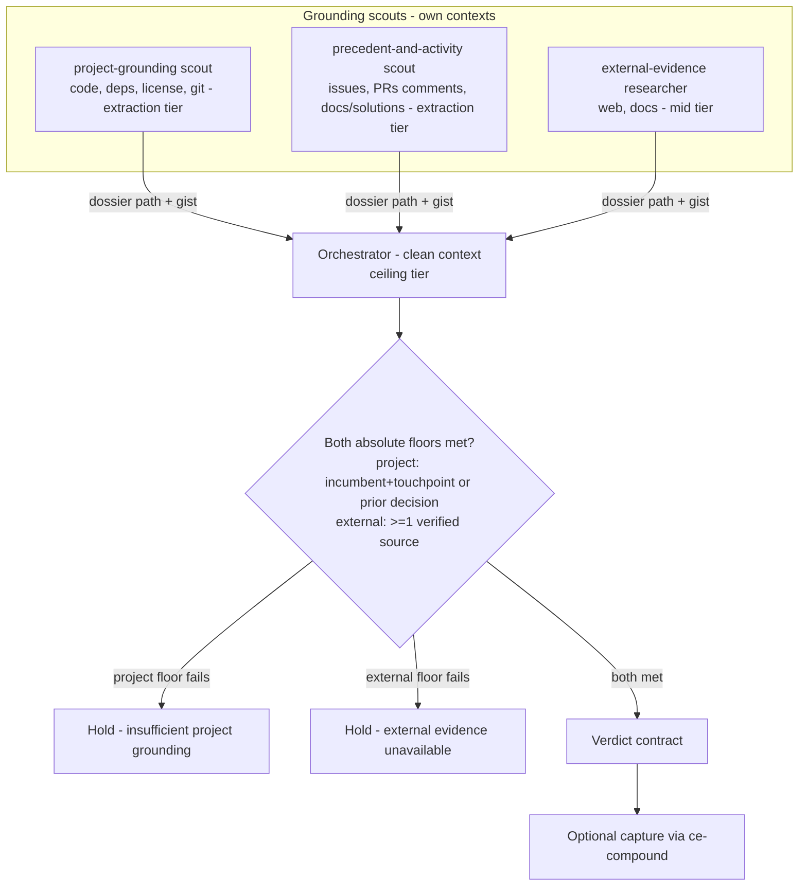

# ce-pov Skill - Plan

## Goal Capsule

- **Objective:** Ship a v1 `ce-pov` skill that returns a decisive, project-grounded verdict on an external input — invoked at the start of a session or dropped into the middle of one.
- **Product authority:** Owner-directed. Design converged through a 5-frame ideation pass and four rounds of cross-model review (Claude + Codex + Cursor). Source proposal: `docs/ideation/2026-06-28-ce-pov-skill-proposal.html`.
- **Execution profile:** Skill authoring — Markdown `SKILL.md` plus `references/`. Behavioral correctness is validated with the `skill-creator` eval workflow (skill prose is not unit-testable); only the registration count is covered by `bun test`.
- **Stop conditions:** Surface a blocker rather than guess when a change would alter the Product Contract (the WHAT), not just the HOW.
- **Tail ownership:** Implementer runs `bun test` and `bun run release:validate`, then a `skill-creator` behavioral eval before declaring done.
- **Product Contract preservation:** R18 clarified from a relative ("thinner than the external leg") to an absolute project-grounding floor to match AE1, with a symmetric external floor added; R12's Hold subtypes and R15's warm-adversarial clause made explicit; R24–R26 added (intake framing gate, reasoned tier-gated follow-up, optional shareable write-up) and KTD3 revised so an opt-in report is allowed on request. Deferred-to-planning questions resolved in the Planning Contract (KTD1–KTD7).

---

## Product Contract

### Summary

`ce-pov` forms a decisive, graded point of view on an external input — "should we adopt framework X?", "what should we use for auth?", "does this CVE affect us?", "is our current approach still right?", or a mid-session "weigh in on this direction." It grounds the verdict in the project's own context and verified external research, and is distinct from generic web research, which explains a topic rather than judging it for *this* project.

### Problem Frame

A developer who reads about an external framework, pattern, CVE, or claim and wants to know whether it fits *their* project has no right tool today. `ce-ideate` generates options, `ce-brainstorm` scopes a chosen idea, `ce-plan` implements, `ce-debug` diagnoses broken behavior — none renders an evaluation verdict on a fixed external input. Generic web research already exists, so the gap is not "research the web." The gap is judgment grounded in the actual project: a bare agent prompted "what's your POV on X?" answers in the abstract, agrees with the framing, stops at the first source, and lets the answer evaporate. The value `ce-pov` adds is an opinionated method that a casual prompt will not self-enforce.

### Key Decisions

- **Dual-grounding is the moat, enforced as an invalidation rule.** No verdict issues without both a verified-external leg and a concrete-project leg. This separates `ce-pov` from generic web research; everything else serves it.
- **Project-grounded, not git-required.** Grounding reaches across the project's available context — code, git, issue tracker, PRs, local docs, and any other reachable tool/MCP — and works for a non-code project folder as well as a code repo. Only the no-local-material case (true universal mode) is out of v1.
- **One method with a cold/warm invocation modifier, not two workflows.** Warm draws only the *question and claims-to-verify* from the conversation, never grounding.
- **Persistence is opt-in and reuses `ce-compound`.** Verdicts are chat-only by default; on capture, `ce-pov` hands `ce-compound` the structured verdict for storage with no schema change. The precedent-check is best-effort search, not a guaranteed index.
- **Name is `ce-pov`; v1 is project-first.** Universal mode and a dedicated verdict index are deferred.

### Requirements

**Purpose and differentiation**

- R1. `ce-pov` takes an external input and returns a decisive, project-grounded verdict; it does not explain a topic neutrally, generate options (`ce-ideate`), scope a chosen idea (`ce-brainstorm`), implement (`ce-plan`), or diagnose a failure (`ce-debug`).
- R2. The skill accepts a discoverable-field *selection* question ("what should we use for auth?") when the candidate field is bounded and the decision criteria are knowable; otherwise R20 applies.

**The method**

- R3. **Frame** — pin the actual question, the incumbent, the time horizon, and success criteria before researching.
- R4. **Precedent** — search the project's available context for an existing stance (prior decisions, closed issues, abandoned PRs, local docs) before researching; precedent-aware, not rigidly first, since a CVE's urgency can lead.
- R5. **Verify** — produce both legs: active external research and concrete project grounding (per the Grounding requirements).
- R6. **Verdict** — emit the verdict contract (R12, R13).
- R7. The skeptic stance (seek disconfirming evidence; "no" and "not our problem" are first-class) and reversibility-tiered effort are properties of every step, not separate phases.

**Grounding**

- R8. Grounding reaches across the project's available context: the named high-value surfaces — code and dependencies, git history, the issue tracker (including comments), PRs/MRs (including comments), and project docs — plus any other reachable source (other tools or MCPs) the agent reasons is relevant to the question.
- R9. Grounding is tool-agnostic, capability-gated, and never required; it is targeted to the question and never exhaustive. It reads descriptions and comments for rationale and precedent, and never reads PR diffs.
- R10. Project grounding works for a non-code project folder (docs, decks, markdown, data) as well as a code repo; only the no-local-material case is out of v1 scope.
- R11. An artifact's existence is project evidence and a valid concrete touchpoint; an artifact's claims are reported signal that must be corroborated before being treated as fact.

**Verdict contract**

- R12. The grade is one of: Adopt, Trial, Hold, Reject, Not-our-problem. Hold is a complete and valid outcome (a decision to wait); "Hold — insufficient project grounding" and "Hold — external evidence unavailable" are subtypes (R18), not the only meanings.
- R13. Every verdict carries a fixed schema: Grade, Incumbent, Verified facts (project + external), Conversation hypotheses (unverified — warm only), Conditions ("yes, if ..."), Handoff, and a Reversal trigger on Tier 2/3 calls only.

**Invocation contexts**

- R14. Cold invocation (session start): the user states the question; the full method runs at the warranted tier.
- R15. Warm invocation (mid-session): the conversation supplies the question and claims-to-verify only, never grounding; the skill outputs a verdict block, does not reframe the session, hands control back, and is more adversarial than cold — operationalized as an explicit disconfirming-evidence pass on each conversation claim, and never upgrading a grade on conversation momentum alone.
- R16. When warm-invoked with no explicit question or a materially ambiguous one, the skill infers the question, presents that synthesis, and confirms before answering; it skips the confirm-gate when the user named the question.

**Grounding provenance (warm-mode safeguard)**

- R17. Inputs are labeled by provenance: observed-project-facts and verified-external-facts count as grounding; conversation-claims and unconfirmed-assumptions do not, serving as frame and hypotheses until corroborated. The invalidation rule has no warm exemption, and the verdict schema keeps "verified facts" and "conversation hypotheses" as separate fields.

**Guardrails**

- R18. **Anti-theater (Invalid-Verdict Rule):** the verdict must clear two *absolute* floors, each independent of the other's strength — strong external evidence never compensates for a thin project leg, and vice versa. **Project floor:** a concrete verified project fact relevant to the decision — a named incumbent + a touchpoint (replace/migrate), the verified absence of an incumbent + a concrete integration/fit point (net-new adoption), or a prior decision. **External floor:** at least one verified external source. Failing the project floor forbids Adopt/Reject and returns "Hold — insufficient project grounding" with a numbered list of what to inspect next; failing the external floor (e.g. no research tools reachable) returns "Hold — external evidence unavailable" rather than grading at lowered confidence.
- R19. **Anti-ritual (Reversibility-Tiered Effort):** effort and output scale to the door type. Tier 1 (reversible) is one screen with 1-2 external and 1-2 project facts and no reversal trigger; Tier 2 (moderate) adds fuller alternatives; Tier 3 (one-way / security / legal) does deep research, a precedent search, and offers a durable record.

**Boundaries and routing**

- R20. **Selection escape hatch:** when the candidate field cannot be bounded without invention or the criteria are unclear, the skill Holds and routes to `ce-ideate` (to enumerate) or `ce-brainstorm` (to surface criteria), then re-runs.
- R21. Boundaries hold against generic research/explainers (we require project grounding and a graded verdict), `ce-ideate` (invented vs. discovered option space), `ce-brainstorm` (decide *whether* vs. scope *what*), `ce-plan` (verdict accepted then hand off, no task breakdown), `ce-debug` (assess exposure and priority vs. investigate an observed failure), and `ce-strategy` (a specific external input vs. company direction).

**Persistence**

- R22. Verdicts are chat-only by default; the skill offers to capture one. On capture it hands `ce-compound` the structured verdict block, which `ce-compound` stores via its existing `tooling_decision` / `architecture_pattern` knowledge-track type with no frontmatter or schema change.
- R23. The precedent-check (R4) is a best-effort search over whatever surfaces are reachable, not a guaranteed index.

**Intake and follow-up**

- R24. **Frame before grounding.** Before dispatching scouts, establish the frame: orient on the provided input (fetch a bare link lightly to learn what it is; recognize a bare topic), then settle the subject and the POV intent (adopt / migrate / compare / exposure / explainer). If both are clear, state the inferred frame in one line and proceed; if the intent is ambiguous, propose the concrete candidate framings the input suggests and confirm before grounding. Never guess the intent. An explainer intent is handled as a general research question, not turned into a verdict.
- R25. **Reasoned, tier-gated follow-up.** The chat TL;DR is the default deliverable. The next-step offer is reasoned from the verdict (grade + Handoff), not assumed: Tier 1 / Reject / Not-our-problem get a one-line prose offer; a Tier 2/3 actionable grade gets a short blocking menu whose first option is the computed next step (dynamically labeled). `ce-compound` capture is a passive affordance ("say 'compound it'"), never the first thing offered.
- R26. **Optional full write-up.** On request, `ce-pov` produces an expanded, shareable write-up (HTML by default) — opened locally or published via Proof or an available HTML tool — as the depth the TL;DR omits; it doubles as the seed when taking the verdict into `ce-brainstorm`/`ce-plan`. The write-up is opt-in; the default stays chat-only.

### Key Flows

- F1. **Cold verdict**
  - **Trigger:** User invokes `ce-pov` with an external question at session start.
  - **Steps:** Frame the decision and tier; dispatch grounding scouts (precedent + project + external); apply the Invalid-Verdict gate against the returned dossiers; emit the verdict contract; offer optional capture.
  - **Outcome:** A graded, dual-grounded verdict with conditions and a handoff.
  - **Covered by:** R3, R4, R5, R6, R12, R13, R18, R22.

- F2. **Warm second opinion**
  - **Trigger:** User invokes `ce-pov` mid-session for a second opinion.
  - **Steps:** Take the question (or infer and confirm it) and the claims-to-verify from the conversation; dispatch scouts to verify those claims and ground independently; apply the gate with no warm exemption; emit a verdict block only and hand control back.
  - **Outcome:** An adversarial, dual-grounded verdict that does not reframe the host session.
  - **Covered by:** R15, R16, R17, R18.

### Acceptance Examples

- AE1. **Covers R18.** External research is strong but the only project signal is one conversation claim. The skill returns "Hold — insufficient project grounding" with a list of what to inspect, not Adopt or Reject.
- AE2. **Covers R2, R20.** Asked "what observability stack should we use?" with a field that cannot be bounded to a few real candidates without invention, the skill Holds and routes to `ce-ideate`, then offers to re-run.
- AE3. **Covers R16.** Warm-invoked bare ("`ce-pov`") mid-brainstorm, the skill states the decision it believes is being asked and waits for confirmation before rendering a verdict.
- AE4. **Covers R11, R17.** The conversation has assumed for many turns "we have 40 call-sites on library X." The skill treats this as an unverified hypothesis and does not let it satisfy the project leg until the project-grounding scout corroborates it.
- AE5. **Covers R12.** Asked whether a CVE applies and finding the vulnerable path is not reachable in the project, the skill returns Not-our-problem rather than forcing an Adopt/Reject.
- AE6. **Covers R19.** Asked about adding a small, reversible dependency, the skill returns a one-screen Tier 1 verdict with 1-2 external and 1-2 project facts and no reversal trigger.

### Scope Boundaries

**Deferred for later**

- Universal mode (no local material at all — a pure user-described situation grounded only in supplied context).
- A dedicated `docs/decisions/` verdict store with a reliable precedent index, and the typed `pov_verdict` frontmatter that would accompany it (touching `ce-compound`'s `references/schema.yaml`, its `scripts/validate-frontmatter.py`, and `ce-compound-refresh`'s schema together).
- Scheduled re-evaluation or automation that fires on a verdict's reversal trigger.
- **Grounding cache** — in-session project-profile reuse plus a cross-session profile cache (see KTD8). A follow-up after v1 ships; the v1 units (U1–U8) always derive grounding fresh.
- A shared cross-skill evidence/verdict output contract (the dossier shape) that would let `ce-pov`, `ce-ideate`, and `ce-plan` stop duplicating research personas (the `web-researcher.md` copies have already drifted) — see KTD2.

**Outside this v1's scope**

- PoC scaffolding, weighted-scoring spreadsheets/matrices, exhaustive issue/PR analysis or clustering (that is `ce-ideate`'s issue-intelligence), a mandatory durable-record commit, deep git archaeology beyond a targeted search, required multi-agent research fan-out beyond the three grounding scouts, and reading PR diffs.

### Dependencies / Assumptions

- Opt-in persistence depends on `ce-compound` and reuses its existing knowledge-track types unchanged.
- External research, tracker, and PR access are capability-gated; the skill degrades gracefully and labels the verdict's confidence when a surface is unavailable.
- The plugin's self-contained-skill constraint means no runtime skill-to-skill calls and no cross-skill file imports; cross-skill reuse is via duplicated assets, not imports.

### Sources / Research

- `docs/ideation/2026-06-28-ce-pov-skill-proposal.html` — converged design proposal (5-frame ideation, four rounds of cross-model review).
- `skills/ce-compound/references/schema.yaml` — knowledge-track `problem_type` enum (`tooling_decision`, `architecture_pattern`) that v1 verdict capture reuses.
- `skills/ce-ideate/references/agents/web-researcher.md` and `skills/ce-plan/references/agents/web-researcher.md` — the drifted duplicate motivating the deferred shared-output-contract.
- `docs/solutions/skill-design/pass-paths-not-content-to-subagents.md` — the dossier/gist pattern KTD1 follows.
- `skills/ce-ideate/references/agents/issue-intelligence-analyst.md` — the clustering boundary `ce-pov` must not cross.

---

## Planning Contract

### Key Technical Decisions

- KTD1. **Grounding runs through scout sub-agents, not inline.** A 3-scout fleet — project-grounding scout, precedent-&-activity scout, external-evidence researcher — each searches its surfaces in its own context and returns a compact evidence dossier (a `/tmp/compound-engineering/ce-pov/<run-id>/` path plus a 3-5 line gist). The orchestrator reads dossiers on demand and reasons over the verdict on a clean context. Inline grounding would flood the orchestrator with raw issue/PR/code-search output and crowd out the verdict reasoning; the dossier/gist pattern (`docs/solutions/skill-design/pass-paths-not-content-to-subagents.md`, `ce-ideate` evidence scouts, `ce-plan` research analysts) isolates that noise. "Targeted, never exhaustive" is enforced by each scout's read budget. **Grounding cost scales with the reversibility tier (KTD4):** a Tier 1 (reversible) call runs a single combined grounding pass (the two project-side scouts merge, or run inline) to honor the anti-ritual one-screen budget (R19); the full three-scout fan-out is reserved for Tier 2/3. Three scouts is the Tier 2/3 shape, not a fixed floor.
- KTD2. **Personas are duplicated into `skills/ce-pov/references/agents/`, no YAML frontmatter.** The self-contained-skill constraint forbids importing another skill's persona. v1 accepts the duplication (and its drift risk); a shared evidence/verdict output contract is deferred (Scope Boundaries). Model tiering lives in `SKILL.md`, not the persona files: scouts on the extraction tier, the external-evidence researcher on the mid/generation tier, and the verdict reasoning on the inherited ceiling tier.
- KTD3. **`ce-pov` writes no artifact by default.** The verdict is a compact chat block (output economy). Two artifacts are available *on request only*: an opt-in full write-up (`references/report.md`, HTML by default — the shareable / handoff form) and a `ce-compound` capture (the durable precedent record). The skill carries no automatic output-format resolution — the report's format is chosen at request time, defaulting to HTML — so the common path stays chat-only and lean.
- KTD4. **Reversibility tier is auto-classified and overridable.** The skill infers Tier 1/2/3 from project signals (a dependency or lint rule reads as two-way; a data store, auth provider, public API, migration, or security/legal surface reads as one-way), states the tier in the verdict, and lets the user override — no blocking question by default (anti-ritual, R19).
- KTD5. **Two-level capability gating.** The orchestrator skips only a scout (or scout-portion) with no reachable surface — file-read passes (project grounding, and the precedent scout's local-doc pass over `docs/solutions/`/ADRs/design docs) always run; tracker/PR reads and the external researcher are tool-gated and degrade. A scout that loses a tool mid-run reports "unavailable" and returns what it has. Neither blocks; a missing surface lowers the verdict's stated confidence (R9).
- KTD6. **The selection-field bound is a soft heuristic.** "Roughly five or fewer real candidates" is prose guidance for the R20 escape hatch, not a hard count the skill enforces.
- KTD7. **Warm mode still dispatches scouts.** The conversation supplies only the question and the claims-to-verify; the project and precedent scouts independently corroborate those claims before they can satisfy the dual-grounding gate (R11, R17). The orchestrator never treats conversation text as grounding.
- KTD8. **Grounding cache (planned follow-up — not in U1–U8).** Re-deriving the question-agnostic *project profile* (stack, deps/lockfile, license, conventions, structure) every run is wasteful when the repo hasn't changed. Cache **only** that stable profile; the question-specific grounding (incumbent, call-sites) and the prior-decision search **always run fresh**, so anything candidate-relevant is never missed — the cardinal guardrail, since a stale verdict costs far more than the tokens saved. Two scopes share one primitive: **in-session reuse** (reuse this session's profile) and a **cross-session cache** persisted to `/tmp/compound-engineering/ce-pov/profile/<root-sha>/<head-sha>.json`.
  - **Keying — built-in git SHAs, no content hash.** `<root-sha>` = `git rev-list --max-parents=0 HEAD` (the repo's identity — unique even for same-named repos, stable, shared across all worktrees/clones); `<head-sha>` = `git rev-parse HEAD` (the working state). Two worktrees at the same commit share the same entry. Lookup is git metadata only — no input-file content reads, then one read of the cache entry.
  - **Freshness — delta-aware, not clean-tree-only.** Reuse on a `HEAD` match when `git status --porcelain` shows no *profile-input* path dirty (a dirty `docs/plans/*` or WIP source does **not** invalidate; a dirty manifest/lockfile/license/instruction file does). `HEAD`-keying re-derives on every commit; a content-addressed key (hashing the inputs' git blob SHAs) would invalidate less often but is **deferred as a measured optimization**, not a v1 default.
  - **Safety.** Graceful degradation (no git, no `/tmp` write, unreadable → re-derive); TTL eviction; the cache is never a correctness dependency. Non-git project folders are session-scoped only (no SHA).
  - **Storage rationale.** `/tmp`, not `.context/`/`.compound-engineering/` — no repo pollution or accidental-commit risk, the plugin's documented scratch home, and ephemerality doubles as cache eviction. Design reconciled with a Codex second opinion (clean-tree dirty-stamp bug fixed; in-session reuse confirmed; cross-session kept thin).

### High-Level Technical Design

Grounding scouts isolate search noise from the verdict reasoning:

The four-step method (Frame, Precedent, Verify, Verdict) runs on top of this: Precedent and Verify consume the scout dossiers; the gate and the verdict reasoning stay in the orchestrator's clean context.

### Assumptions

- `skills/ce-ideate/` is the structural template (SKILL.md + `references/` + `references/agents/`); `ce-debug`'s leaner reference set is the comparison for a single-mode skill.
- Skills are auto-discovered from `skills/*/SKILL.md`; no platform manifest needs editing.

### Sequencing

U1 scaffolds the skill; U2 and U3 build grounding (dispatch logic and the three personas) and method/verdict on top of U1; U4 and U5 add the invocation and routing behavior; U6 wires persistence; U7 registers the skill; U8 validates behavior. U7 and U8 come last because they assert against the finished skill.

---

## Implementation Units

### U1. Skill scaffold and SKILL.md spine

- **Goal:** Create `skills/ce-pov/` with a `SKILL.md` carrying the frontmatter, the standard boilerplate, and the phase skeleton — no output-format machinery (KTD3).
- **Requirements:** R1, R21.
- **Dependencies:** none.
- **Files:** `skills/ce-pov/SKILL.md`.
- **Approach:** Frontmatter `name: ce-pov`, a `description` in the house style (verb + "Use when ..." trigger list + the not-an-explainer contrast, ~150-180 chars), and `argument-hint`. Include the "current year is 2026" note, the repo-root pre-resolution line, and the shared interaction-method (blocking question tool) boilerplate copied from an existing skill. Lay out phases: Phase 0 (resolve invocation context cold/warm, frame, tier), Phase 1 (grounding dispatch), Phase 2 (verify + invalid-verdict gate), Phase 3 (verdict), Phase 4 (optional capture + routing). Omit the `OUTPUT_FORMAT` resolution block.
- **Patterns to follow:** `skills/ce-ideate/SKILL.md` Phase 0 boilerplate; `skills/ce-debug/SKILL.md` for a leaner single-mode shape.
- **Test scenarios:** `Test expectation: none -- scaffold; behavior is covered by U8's eval.`
- **Verification:** `SKILL.md` parses with valid frontmatter; phases are present and reference the files later units add.

### U2. Grounding dispatch and the three scout personas

- **Goal:** Implement Phase 1 grounding — dispatch the grounding scouts (two extraction-tier, the external-evidence researcher mid-tier; tier-sensitive count per KTD1), collect dossier paths + gists, and populate the provenance buckets (KTD1, KTD2, KTD5).
- **Requirements:** R4, R5, R8, R9, R10, R11, R17, R23.
- **Dependencies:** U1.
- **Files:** `skills/ce-pov/SKILL.md` (Phase 1 dispatch), `skills/ce-pov/references/agents/project-grounding-scout.md`, `skills/ce-pov/references/agents/precedent-activity-scout.md`, `skills/ce-pov/references/agents/external-evidence-researcher.md`.
- **Approach:** SKILL.md creates the scratch dir (`/tmp/compound-engineering/ce-pov/<run-id>/`), dispatches each scout by reading its persona file and seeding a generic subagent, and applies two-level capability gating (skip when tools are absent; scout self-reports on mid-run failure). Each persona (no frontmatter) carries an evaluation-flavored invocation contract, a bounded read budget, the "existence is evidence, claims are reported signal" rule (R11), the "descriptions and comments, never PR diffs" rule (R9), and an output contract: write a dossier to the scratch path, return only a 3-5 line gist plus the path. The precedent-&-activity scout is capability-gated on tracker/PR tools and tool-agnostic across them.
- **Patterns to follow:** `skills/ce-ideate/references/agents/web-researcher.md` (persona shape, precondition self-check); `skills/ce-ideate/SKILL.md` Phase 1.5 evidence-scout dispatch and dossier handling; `docs/solutions/skill-design/pass-paths-not-content-to-subagents.md`.
- **Test scenarios:**
  - Covers R9. Eval: a PR-heavy topic — confirm the scout reads PR descriptions/comments and returns a gist, and that the orchestrator context does not fill with raw PR/issue dumps.
  - Covers R5, R8. Eval: a topic with a real codebase footprint — both project and external dossiers come back and feed the verdict.
  - Covers R11, R17. Eval: a conversation-asserted "fact" — it lands as a hypothesis, not a verified project fact, until the scout corroborates it.
  - Covers R9 (capability gating). Eval: no tracker tool present — the precedent scout is skipped or self-reports unavailable, and the run proceeds.
- **Verification:** Each scout returns a path + gist, not inline bulk; provenance buckets are populated from dossiers; a missing surface lowers stated confidence rather than blocking.

### U3. Method and verdict-contract reference

- **Goal:** Capture the 4-step method, reversibility tiering, skeptic stance, the Invalid-Verdict gate, and the verdict contract (vocabulary + schema + provenance) as a loaded-on-demand reference (KTD4, KTD7).
- **Requirements:** R3, R6, R7, R12, R13, R18, R19.
- **Dependencies:** U1. (The gate's behavioral verification exercises U2's dossier output, so the U8 evals for this unit run after U2 exists.)
- **Files:** `skills/ce-pov/references/method.md`, `skills/ce-pov/SKILL.md` (Phase 2/3 wiring).
- **Approach:** `method.md` defines the four steps with skeptic stance and reversibility tier as cross-cutting properties; the auto-classify-and-override tier rule (KTD4); the Invalid-Verdict gate (R18) as two absolute floors — a project floor failing → "Hold — insufficient project grounding" + inspect list, an external floor failing → "Hold — external evidence unavailable" — neither a relative comparison of leg sizes; and the verdict contract — the five-grade vocabulary (Hold as a complete outcome, R12) and the fixed field schema (R13) that keeps verified facts separate from conversation hypotheses. The two-floor rule is stated as a checklist the U8 eval can assert pass/fail. SKILL.md loads `method.md` at Phase 2, before applying the gate.
- **Patterns to follow:** `skills/ce-ideate/references/divergent-ideation.md` (a phase-specific reference loaded before the work it governs).
- **Test scenarios:**
  - Covers R18 (project floor). Eval: thin project leg → "Hold — insufficient project grounding" with an inspect list, never Adopt/Reject, even when external evidence is strong.
  - Covers R18 (external floor). Eval: no research tools reachable → "Hold — external evidence unavailable", not a graded verdict at lowered confidence.
  - Covers R12. Eval: a CVE not on a reachable path → Not-our-problem.
  - Covers R19. Eval: a reversible dependency → one-screen Tier 1, no reversal trigger; a one-way migration → Tier 3 depth.
  - Covers R13. Eval: every emitted verdict carries all schema fields, with conversation hypotheses in their own field.
- **Verification:** Verdicts always use the vocabulary and schema; the gate fires whenever the project leg is thin.

### U4. Intake framing gate and cold/warm invocation

- **Goal:** Establish the frame before grounding (orient → infer or propose → confirm; never guess), and implement the one-method / two-context modifier (cold/warm).
- **Requirements:** R14, R15, R16, R24.
- **Dependencies:** U3.
- **Files:** `skills/ce-pov/references/intake.md`, `skills/ce-pov/references/invocation.md`, `skills/ce-pov/SKILL.md` (Phase 0).
- **Approach:** `intake.md` defines the frame gate — orient cheaply on the input (fetch a bare link lightly to learn what it is; recognize a topic; read a paste), classify the POV intent (adopt / migrate / compare / exposure / explainer), then state a one-line frame when subject+intent are clear, or propose the concrete candidate framings the input suggests via the blocking tool when the intent is ambiguous; an explainer intent is handled as general research, not a verdict. `invocation.md` defines cold/warm detection, the warm rule that the conversation supplies only the question and claims-to-verify (never grounding), the guest output contract, the operationalized adversarial delta (disconfirming pass; no momentum upgrade), and points the warm-absent case at the frame gate (no duplication). SKILL.md runs the frame gate at Phase 0 before any scout dispatch, without branching into two workflows.
- **Patterns to follow:** `skills/ce-ideate/SKILL.md` Phase 0.2 subject-identification gate (orient/propose/confirm shape); the interaction-method blocking-question boilerplate from U1.
- **Test scenarios:**
  - Covers R24. Eval: a bare link with no stated intent → the skill orients (names the thing) and proposes adopt/migrate/compare/something-else, never a guessed verdict.
  - Covers R24. Eval: a clearly-stated question ("should we replace Jest with Vitest?") → one-line inferred frame, no clarifying question.
  - Covers R24 (explainer). Eval: "what is X?" with no project angle → handled as general research, not a verdict.
  - Covers R16. Eval: bare warm invocation → frame gate infers+confirms; named warm question → no gate.
  - Covers R15 (adversarial delta). Eval: a claim the conversation favors → disconfirming pass, no momentum upgrade.
  - Covers R17 (no warm exemption). Eval: warm verdict still requires a corroborated project leg.
- **Verification:** no scout dispatch occurs until the frame is settled; an ambiguous intent always proposes rather than proceeds; cold and warm share the same method.

### U5. Boundaries, routing, and the selection escape hatch

- **Goal:** Encode the discriminator and neighbor boundaries, and the R20 escape hatch (KTD6).
- **Requirements:** R2, R20, R21.
- **Dependencies:** U3.
- **Files:** `skills/ce-pov/references/boundaries.md`, `skills/ce-pov/SKILL.md` (description-level triggers and Phase 0 frame check).
- **Approach:** `boundaries.md` states the external-input-judged-against-the-project discriminator and the line against generic research/explainers, `ce-ideate`, `ce-brainstorm`, `ce-plan`, `ce-debug`, `ce-strategy` (R21). The Frame step (U3) applies the escape hatch: when the candidate field cannot be bounded without invention or criteria are unclear (soft "~5" heuristic), Hold and route to `ce-ideate`/`ce-brainstorm`, then offer a re-run. The skill `description` (U1) encodes the triggers so routing accuracy holds.
- **Patterns to follow:** existing skill `description` strings for trigger phrasing.
- **Test scenarios:**
  - Covers R2, R20. Eval: a bounded field ("auth providers") → selection verdict; an unbounded field ("observability stack") → Hold → route to `ce-ideate`.
  - Covers R21. Eval: a "tell me about X" request with no project angle → handled as general research, not a verdict.
- **Verification:** Selection vs. route-out splits on whether the field is discoverable-and-bounded.

### U6. Follow-up: dynamic next step, optional report, and opt-in capture

- **Goal:** Implement the reasoned, tier-gated follow-up — compute the next step from the verdict, gate the offer by tier, generate the optional report, and route opt-in `ce-compound` capture as a passive affordance.
- **Requirements:** R22, R23, R25, R26.
- **Dependencies:** U3.
- **Files:** `skills/ce-pov/references/report.md`, `skills/ce-pov/SKILL.md` (Phase 4).
- **Approach:** SKILL.md Phase 4 computes the next step from grade + Handoff (Adopt → `ce-plan`, or `ce-brainstorm` when scope is fuzzy; Trial → a `ce-work` spike; Hold/Reject/Not-our-problem → none) and tier-gates the offer (Tier 1 / Reject / Not-our-problem → one prose line; Tier 2/3 actionable → a blocking menu whose first option is the computed next step, full write-up second, done). `ce-compound` is a one-line prose nudge, never a menu slot. On "take it forward", seed the next skill with verdict substance. `report.md` defines the opt-in write-up — HTML by default, leading with the verdict, evidence cited from the dossiers (not pasted), alternatives, reversal trigger, provenance — and the share path (`ce-proof` is markdown-only, so an HTML report renders a throwaway md copy as the Proof source; otherwise an available HTML tool, else the local file). On "compound it", invoke `ce-compound` with `mode:headless` seeded with the structured verdict; its existing `tooling_decision`/`architecture_pattern` enum accepts it with no schema change, and the verdict's distinctive fields flatten into prose (acceptable — the precedent-check is best-effort text search).
- **Patterns to follow:** `skills/ce-ideate/references/post-ideation-workflow.md` §5.2 (seeding a downstream skill with substance, not a pointer) and its Phase 5 menu / Proof handling; `skills/ce-plan/references/plan-handoff.md` (dynamic post-generation menu shape).
- **Test scenarios:**
  - Covers R25. Eval: a Tier 1 Adopt → one-line prose offer, no menu; a Tier 3 Adopt with clear scope → menu whose first option is "Plan the adoption (`ce-plan`)".
  - Covers R25 (dynamic). Eval: a Reject → prose end, no next-step pushed; an Adopt with fuzzy scope → the next step proposes `ce-brainstorm`, not `ce-plan`.
  - Covers R25 (compound demoted). Eval: `ce-compound` is never the first prompted option — only a prose nudge.
  - Covers R26. Eval: user asks for the full write-up → an HTML report leading with the verdict, citing evidence (not pasting dossiers), with open-local / publish options.
  - Covers R22. Eval: "compound it" → `ce-compound` invoked `mode:headless` with the structured verdict, no schema change.
- **Verification:** the follow-up never assumes `ce-plan`; the next step is reasoned from the verdict; report and capture are opt-in; capture reaches `ce-compound` with no `schema.yaml` edit.

### U7. Registration and validation

- **Goal:** Register the new skill so discovery, docs, and the count test agree.
- **Requirements:** R1.
- **Dependencies:** U1–U6.
- **Files:** `README.md` (skill inventory table), `tests/release-metadata.test.ts` (count assertion).
- **Approach:** Add a `| `/ce-pov` | <description> |` row to the README skill inventory. Update the hardcoded skill count in `tests/release-metadata.test.ts` from 26 to 27. No platform manifest, no legacy-cleanup registry, and no `plugin.json`/`marketplace.json` edit — skills auto-discover from `skills/*/SKILL.md`.
- **Patterns to follow:** existing README inventory rows; the existing `counts` assertion in `tests/release-metadata.test.ts`.
- **Test scenarios:**
  - Covers R1. `bun test` — the release-metadata count assertion passes at 27.
  - `bun run release:validate` reports the new skill and no cross-surface drift.
- **Verification:** `bun test` green; `bun run release:validate` clean.

### U8. Behavioral eval via skill-creator

- **Goal:** Validate the skill's prose behavior end to end, since prose is not unit-testable.
- **Requirements:** R3–R26 (behavioral coverage).
- **Dependencies:** U1–U7.
- **Files:** none committed beyond the skill; this unit runs the `skill-creator` eval workflow.
- **Approach:** Use `skill-creator`'s eval workflow (it injects the skill content into a fresh subagent at dispatch, reading current source from disk) to exercise: **intake** — a bare link with no stated intent proposes framings (no guess), a clearly-stated question infers the frame in one line, an explainer is handled as general research, not a verdict; **gate/verdict** — the project-floor and external-floor Holds, consensus-laundering resisted, the warm confirm-gate and adversarial delta, the selection escape hatch, a Not-our-problem CVE, and a cold adoption verdict; **follow-up** — a Tier 1 Adopt gets a prose offer (no menu), a Tier 3 Adopt with clear scope proposes `ce-plan`, an Adopt with fuzzy scope proposes `ce-brainstorm`, a Reject ends without pushing a next step, `ce-compound` is never the first prompted option, and an asked-for write-up is an HTML report that cites rather than pastes. Confirm grounding flows through scouts (orchestrator context stays clean) and a Tier 1 reversible call uses the combined single-pass grounding (KTD1).
- **Patterns to follow:** AGENTS.md "Validating Agent and Skill Changes" (use `skill-creator`, not in-session dispatch).
- **Test scenarios:** the eval scenarios above, each asserting the expected grade/route and that both grounding floors held.
- **Verification:** Each scenario produces the expected verdict or route; no scenario yields an ungrounded Adopt/Reject.

---

## Verification Contract

| Gate | Command / method | Applies to |
|---|---|---|
| Skill count + metadata | `bun test` (`tests/release-metadata.test.ts`) | U7 |
| Cross-surface consistency | `bun run release:validate` | U7 |
| Behavioral correctness | `skill-creator` eval workflow (six scenarios in U8) | U1–U6, U8 |
| Grounding isolation | U8 eval confirms scouts return dossiers/gists; orchestrator context stays clean | U2 |

Skill prose behavior is validated only through `skill-creator` — do not rely on `bun test` for it (it covers the registration count only).

---

## Definition of Done

- `skills/ce-pov/SKILL.md` and its `references/` (intake, method, invocation, boundaries, report, and three `agents/` personas) exist and cohere; no *automatic* output-format machinery is present — the report's format is chosen on request (KTD3).
- The frame gate runs before any scout dispatch: a clear input yields a one-line frame, an ambiguous one proposes candidate framings and confirms; nothing is guessed (R24).
- Grounding runs through the scouts returning dossiers + gists; the orchestrator reasons over the verdict on a clean context (KTD1).
- Every verdict uses the five-grade vocabulary and the fixed schema; the two-floor Invalid-Verdict gate and reversibility tiers behave per U3/U8; the chat verdict obeys output economy.
- Cold and warm both work; warm grounds only via scouts and never from the conversation; the confirm-gate fires only when needed.
- The follow-up is reasoned from the verdict and tier-gated; the optional write-up and `ce-compound` capture are opt-in, capture demoted to a passive nudge and requiring no schema change.
- `bun test` and `bun run release:validate` pass; the `skill-creator` eval scenarios (intake, gate/verdict, follow-up) pass.
- Abandoned-attempt scaffolding is removed from the final diff.

---

## Open Questions

- **Deferred:** Whether to introduce the shared cross-skill evidence/verdict output contract (the dossier shape) now or after a second consumer needs it — deferred to a follow-up, since v1 ships with duplicated personas (KTD2).
- **Deferred to implementation:** Exact persona read-budget numbers per scout, and the precise wording of the skill `description` trigger list — tune during U2/U5 against `skill-creator` eval results.
