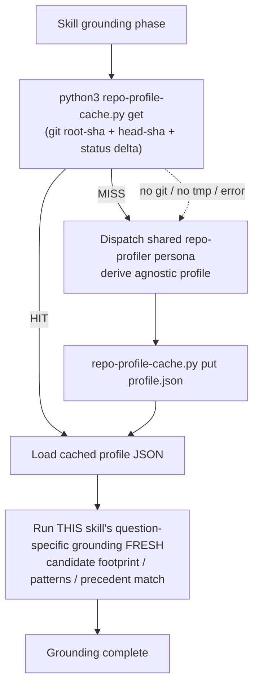

# Shared Repo-Grounding Profile Cache - Plan

> Stacked on PR #1020 (branch `tmchow/ce-pov`); this work is on `tmchow/repo-grounding-cache`.

## Goal Capsule

- **Objective:** Extract the question-agnostic "project profile" that repo-grounding skills each re-derive into a single shared, git-keyed cache. With `HEAD`-SHA keying, the reuse this delivers is **within-session and cross-session on an unchanged commit, across skills** — the common "evaluate/plan several things at one HEAD" case. It does *not* reuse across commits (a new commit re-derives); maximizing that axis is the deferred content-addressed key. The win is cutting redundant re-derivation, not caching forever.
- **Authority:** Owner-directed follow-up to the `ce-pov` plan (KTD8) and its deferred "shared cross-skill evidence/output contract". Design reviewed with Codex.
- **Execution profile:** Skill prose + a bundled Python helper + tests. Skill behavior is validated via `skill-creator`; the helper script and the parity check are unit-tested with `bun test`.
- **Stop conditions:** The cache is an optimization. If any change would let a stale profile alter a skill's output, stop and re-scope — correctness outranks the savings.
- **Cardinal rule:** Cache only the question-agnostic profile; every consumer's question-specific grounding always runs fresh.

---

## Product Contract

### Summary

A shared, git-keyed **project-profile cache**: the question-agnostic repo orientation (stack and versions, dependency surface, topology, conventions and instruction files, vocabulary, docs/solutions index) is derived once by a shared profiler, cached under `/tmp/compound-engineering/repo-profile/`, and reused by every repo-grounding skill. Each consumer keeps deriving only its question-specific slice fresh on top of the cached profile.

### Problem Frame

Repo grounding is re-derived from scratch on nearly every skill run. At least six mechanisms across eight skills (six primary — ce-plan, ce-optimize, ce-pov, ce-ideate, ce-brainstorm, ce-code-review — plus two secondary, ce-compound and ce-debug) independently re-read the same manifests, instruction files, structure, and docs index: `repo-research-analyst` (ce-plan, ce-optimize), `ce-pov`'s project-grounding scout, `ce-ideate`'s codebase scan, `ce-brainstorm`'s constraint check and topic scan, `learnings-researcher`'s `docs/solutions` index, and `ce-code-review`'s standards read. The `repo-research-analyst` contract makes the waste explicit: even when `technology` is out of scope it still runs a baseline root-level discovery, so every invocation re-pays the agnostic baseline. This work is slow and token-heavy, and the redundancy compounds across a session and across skills. There is no shared cache today.

### Key Decisions

- **Cache only the agnostic profile; question-specific grounding always fresh.** The split is real and already latent in `repo-research-analyst`'s `Scope:` contract (`technology`/`architecture`/`conventions` are agnostic; `patterns`/`issues`/`templates` are per-question). A stale profile must never change a skill's output.
- **Share by duplication + a parity test, never by import.** The plugin's self-contained-skill rule (the converter copies each skill dir in isolation) forbids cross-skill file references. The sanctioned pattern — already used for `validate-frontmatter.py` and the rendering refs — is byte-duplicating the shared asset into each skill and asserting identity in `tests/`.
- **Deterministic cache I/O in a bundled script; derivation in a persona.** A small Python helper does the git keying, validity check, read, and write (testable, deterministic). The LLM profiler persona does the judgment-heavy derivation only on a miss.
- **Keying by built-in git SHAs.** `<root-sha>` (`git rev-list --max-parents=0 HEAD`) = repo identity, shared across worktrees/clones; `<head-sha>` (`git rev-parse HEAD`) = state. Lookup is git metadata only; the cache JSON is the only file read on a hit.

### Requirements

**The shared profile and cache**

- R1. A documented **project-profile schema** (carrying a `profile_schema_version`) defines the cached fields: stack and versions; dependency surface (manifests/lockfile paths, top-level dependencies, project + dependency licenses); topology (monorepo/workspace map, deployment model, API styles, data stores, module layout); conventions and instruction files (paths + digests of *root* `AGENTS.md`/`CLAUDE.md`/`GEMINI.md`/`ARCHITECTURE.md`/`README.md`/`CONTRIBUTING.md`/`STRATEGY.md`); and vocabulary (`CONCEPTS.md` terms). The `docs/solutions/` enumeration and any subdirectory-scoped instruction files are **not** cached — they are re-globbed fresh per run (R5), so newly written learnings (even uncommitted) and area-scoped conventions are always current.
- R2. The cache lives at `/tmp/compound-engineering/repo-profile/<root-sha>/<head-sha>.json` — a shared cross-skill prefix, keyed by `git rev-list --max-parents=0 HEAD` (repo identity; if the repo has multiple root commits, use the lexicographically-first for a deterministic key) and `git rev-parse HEAD` (state). Two worktrees/clones at the same commit share the entry. An entry is valid only when its stored `profile_schema_version` matches the reader's — a mismatch is a MISS (a newer schema never reuses an older entry). Lookup uses git metadata only; on a hit, only the cache file is read.
- R3. **Delta-aware freshness via a schema-derived superset glob.** A cached profile at the current `HEAD` is reused unless `git status --porcelain` (which also lists untracked `??` and newly-added files) shows any path matching the **profile-input glob** modified or added. That glob is derived mechanically from the schema's source files — *every* file any cached field reads, as a conservative **superset**: dependency manifests + lockfiles, license, root instruction files (`AGENTS.md`/`CLAUDE.md`/`GEMINI.md`/`.cursor/rules`), `CONCEPTS.md`, `STRATEGY.md`, `ARCHITECTURE.md`/`README.md`/`CONTRIBUTING.md`, and topology sources that determine deployment model/data stores (`Dockerfile`, CI config, infra/config files). A dirty source file, `docs/plans/*`, or other non-input path does not invalidate. An incomplete input set violates the cardinal rule — completeness beats economy; anything not provably covered is re-globbed fresh, not cached (R5).
- R4. **Graceful degradation.** No git, no `/tmp` write access, an unreadable or malformed cache, or any helper error → derive fresh (cache miss), never block. Non-git project folders are session-scoped only (no SHA key). The cache is never a correctness dependency.
- R5. Only the **agnostic profile** is cached. Always run fresh: a candidate's call-sites/footprint, incumbent-pain scans, prior-decision matches, `patterns`/`issues`/`templates` scopes, git history of touched files, tracker/PR activity, all external research — and the **`docs/solutions/` enumeration** and **subdirectory-scoped instruction files**, re-globbed each run so newly written learnings (even uncommitted) and area-scoped conventions are never stale. Re-globbing these is deliberate, not an omission: a directory listing is ~free (no LLM) and the matching logic reads the files fresh anyway, so caching the enumeration would save nothing while risking a stale match — and the alternative (invalidate the whole profile whenever `docs/solutions/` changes) would defeat the cache inside the compounding loop, where ce-compound writes learnings most.

**Sharing and drift control**

- R6. The three shared assets — the profile-schema/cache-protocol reference, the helper script, and the shared profiler persona — are **byte-duplicated** into each consuming skill (no cross-skill imports) and invoked via the `SKILL_DIR` anchor (not the legacy `${CLAUDE_SKILL_DIR}` guard). The per-skill wiring units (U6–U11) perform this duplication and anchored invocation.
- R7. A `tests/` byte-identity check fails when any of the three duplicated cache assets (protocol reference, helper script, profiler persona) diverges across the consuming skills, mirroring `tests/compound-support-files.test.ts`.

**Consumer adoption (all repo-grounding skills)**

- R8. Every repo-grounding skill resolves the agnostic profile through the cache (hit → load; miss → dispatch the shared profiler, then write), then runs only its question-specific grounding fresh. Primary consumers: `ce-pov`, `ce-plan`, `ce-optimize`, `ce-ideate`, `ce-brainstorm`, `ce-code-review`. Secondary (lighter — instruction-file/docs-index reads): `ce-compound`, `ce-debug`.
- R9. Each consumer's existing grounding persona/scan is reduced to its question-specific slice; the agnostic slice it used to derive now comes from the cached profile. No consumer loses coverage — anything candidate-relevant stays fresh.

### Scope Boundaries

**In scope**

- The shared profile schema, the `/tmp` cache helper + keying, the shared profiler persona, the parity + behavior tests, the AGENTS.md convention, and wiring all primary repo-grounding consumers; lighter wiring of the two secondary consumers.

**Deferred to Follow-Up Work**

- A **content-addressed key** (hashing the profile inputs' git blob SHAs) that would re-derive less often than per-commit `HEAD`-keying — a measured optimization once `HEAD`-keying is proven.
- A **`ce-compound` writeup** of the cross-skill-cache pattern (net-new; no existing learning covers it).
- Cross-reboot durability (an in-project cache location) — `/tmp` ephemerality is accepted as eviction.

**Outside this work's scope**

- Any change to what the personas *judge* (the question-specific grounding logic), external-research personas, and Windows-native paths.

### Sources / Research

- `docs/plans/2026-06-28-001-feat-ce-pov-skill-plan.md` (KTD8) — the converged cache design this generalizes.
- `skills/ce-ideate/references/web-research-cache.md` — the V15 cache: file shape, reuse/append, graceful degradation (template for R2–R4).
- `skills/ce-plan/references/agents/repo-research-analyst.md` — its `Scope:` contract partitions agnostic vs. question-specific; the agnostic scopes are the profiler's core.
- `tests/compound-support-files.test.ts` — the byte-identity parity pattern (R7).
- `tests/frontmatter-validator.test.ts`, `skills/ce-compound/scripts/validate-frontmatter.py` — the duplicated-bundled-script + subprocess-test precedent.
- `AGENTS.md` "File References in Skills", "Scratch Space", "Platform-Specific Variables" (the `SKILL_DIR` anchor) — the binding constraints.
- `docs/solutions/skill-design/script-first-skill-architecture.md`, `docs/solutions/best-practices/prefer-python-over-bash-for-pipeline-scripts.md` — script-vs-model and language choice.

---

## Planning Contract

### Key Technical Decisions

- KTD1. **Script owns cache I/O; persona owns derivation.** `scripts/repo-profile-cache.py` is pure, deterministic, testable: `get` computes the git key, applies the delta-aware validity check (HEAD match + no profile-input dirty + `profile_schema_version` match), and prints `HIT` + the profile JSON, `MISS` + the path to write, or `NO-CACHE` (non-git / no `/tmp` — the caller derives fresh and skips the write); `put <file>` writes the derived profile and its stamp (`profile_schema_version`, `root_sha`, `head_sha`, `built_at`) via an atomic temp-file + `os.rename` so concurrent writers never tear the JSON. The shared `repo-profiler` persona (LLM) derives the profile only when `get` is not a HIT. This keeps the non-deterministic work out of the unit tests and the deterministic work out of the prose.
- KTD2. **Duplication is the sharing mechanism; a parity test is the guard.** The protocol reference, the helper script, and the profiler persona are byte-identical copies in each consuming skill (`AGENTS.md` rule). `tests/repo-profile-cache-parity.test.ts` asserts identity across the consuming-skill list, exactly like `tests/compound-support-files.test.ts`. Adding a consumer = adding its name to that list + dropping in the copies.
- KTD3. **Python helper, `SKILL_DIR`-anchored.** Per `prefer-python-over-bash` and the `validate-frontmatter.py` precedent. Skills invoke it by setting `SKILL_DIR` inline in the same Bash call and running `python3 "$SKILL_DIR/scripts/repo-profile-cache.py" …`. Do not use the legacy `${CLAUDE_SKILL_DIR}` guard (a documented off-Claude footgun).
- KTD4. **HEAD-SHA keying with delta-aware dirty; content-key deferred.** Per-commit `HEAD` keying re-derives after each commit, so the reuse it delivers is **within-session and cross-session at an unchanged commit, across skills** — not across commits. That is the dominant "evaluate/plan several things at one HEAD" pattern; the blob-SHA content key that would also reuse across input-unchanged commits is a deferred, measured optimization gated on observed hit rates. The keying is metadata-cheap and simple, and the `git status --porcelain` profile-input check (R3) makes mid-work reuse safe.
- KTD5. **The profiler subsumes the agnostic scopes; consumers shrink.** `repo-profiler` derives what `repo-research-analyst`'s `technology`/`architecture`/`conventions` scopes plus the `CONCEPTS`/`STRATEGY`/`AGENTS`/docs-index reads produce. Each consumer's grounding step calls the cache then runs only its question-specific work — `repo-research-analyst` keeps `patterns`/`issues`/`templates`, ce-pov keeps the candidate footprint, etc.

### High-Level Technical Design

The profile (agnostic, cached) and the question-specific grounding (always fresh) are layered, never merged in the cache.

### Assumptions

- The consuming skills' grounding phases can be edited to insert a cache-check step without disrupting their downstream logic (the dossier/gist handoff stays intact).
- `bun test` spawns `python3`; the test host has Python 3 (already assumed by `frontmatter-validator.test.ts`).

### Sequencing

Foundation first (U1–U5: schema, helper, profiler, tests, docs). Then wire consumers (U6–U11), each independent across skill directories so they can land in any order; ce-pov (U6) and `repo-research-analyst` (U7, serving ce-plan + ce-optimize) are highest-value and go first. A quick hit-rate/token sanity check after U6–U7 should confirm the savings premise before the remaining wiring (U8–U11); the units are independent enough to split into a fast-follow if that check disappoints. The parity test's consumer list (U4) grows as each wiring unit lands.

---

## Implementation Units

### U1. Project-profile schema + cache-protocol reference

- **Goal:** Author the canonical `references/repo-profile-cache.md` — the profile JSON schema (R1) and the cache protocol (key, delta-aware freshness, paths, reuse/write, degradation), modeled on `web-research-cache.md`.
- **Requirements:** R1, R2, R3, R4, R5.
- **Dependencies:** none.
- **Files:** `skills/ce-pov/references/repo-profile-cache.md` (canonical copy; duplicated to other skills in U6–U11).
- **Approach:** Document the profile field set from the research synthesis (with a `profile_schema_version`); the `/tmp/compound-engineering/repo-profile/<root-sha>/<head-sha>.json` path and key derivation; the `git status --porcelain` profile-input check for freshness; the always-fresh exclusion list (R5); and the graceful-degradation rules. State the profile-input set as a **schema-derived superset** (per R3): every file any cached field reads — manifests, lockfiles, license, root instruction files, `CONCEPTS.md`, `STRATEGY.md`, `ARCHITECTURE`/`README`/`CONTRIBUTING`, and topology sources — matched against `git status --porcelain` so untracked/new inputs (`??`) also invalidate. Anything the profile does not provably cover (the `docs/solutions/` enumeration, subdirectory instruction files) is re-globbed fresh by consumers, never cached. Completeness is the cardinal-rule safety requirement.
- **Patterns to follow:** `skills/ce-ideate/references/web-research-cache.md`.
- **Test scenarios:** `Test expectation: none -- reference prose; the protocol it specifies is exercised by U4's helper tests.`
- **Verification:** The schema enumerates every field the U6–U11 consumers need; the exclusion list covers each consumer's question-specific slice.

### U2. Cache helper script

- **Goal:** Implement `scripts/repo-profile-cache.py` — deterministic `get`/`put` with git keying, delta-aware validity, graceful degradation (KTD1, KTD3).
- **Requirements:** R2, R3, R4.
- **Dependencies:** U1.
- **Files:** `skills/ce-pov/scripts/repo-profile-cache.py` (canonical; duplicated in U6–U11).
- **Approach:** `get` resolves `root-sha` (lexicographically-first when `git rev-list --max-parents=0 HEAD` returns multiple roots) and `head-sha`, builds the path, and if a cache file exists checks `HEAD` match + `profile_schema_version` match + runs `git status --porcelain` to see whether any path matching the schema-derived profile-input glob is modified **or untracked/new (`??`)**; prints `HIT\n<json>`, `MISS\n<write-path>`, or `NO-CACHE`. `put <file>` writes the profile plus stamp (`profile_schema_version`, `root_sha`, `head_sha`, `built_at`) **atomically** (temp file in the same dir + `os.rename`). Any failure (not a git repo, no writable `/tmp`, unreadable/malformed JSON) prints `NO-CACHE`/`MISS` and exits 0 — never raises. No third-party deps; stdlib + `subprocess` git calls only.
- **Patterns to follow:** `skills/ce-compound/scripts/validate-frontmatter.py` (stdlib Python, CLI args, subprocess-testable); `BASH_SOURCE`/self-location not needed (the orchestrator passes paths).
- **Test scenarios:**
  - Happy path. Covers R2. A git repo with no cache file → `MISS` + the `<root-sha>/<head-sha>` path; after `put`, a second `get` at the same HEAD (clean) → `HIT` + the stored JSON.
  - Covers R3. With a cached profile present: dirtying a non-input file (`docs/plans/x.md`) → still `HIT`; modifying a manifest/lockfile → `MISS`; **adding a new *untracked* manifest or `AGENTS.md` (`??`) → `MISS`** (the cardinal-rule untracked-input guard).
  - Covers R2 (schema version). A cache entry stamped with an older `profile_schema_version` than the reader's → `MISS`.
  - Covers R2 (sharing) + multi-root. Two checkouts at the same `root-sha`/`head-sha` resolve the same path; a multi-root repo yields a deterministic single `root-sha`.
  - Covers R4 (degradation). Outside a git repo → `NO-CACHE`, exit 0; unreadable/malformed cache file → `MISS`, exit 0; concurrent `put`s never yield a torn read; no error raised.
- **Verification:** `get`/`put` round-trips; freshness is delta-aware and catches untracked inputs and schema-version bumps; writes are atomic; every failure mode degrades to `NO-CACHE`/`MISS` with exit 0.

### U3. Shared repo-profiler persona

- **Goal:** Author `references/agents/repo-profiler.md` — derives the agnostic profile (R1 fields) on a cache miss (KTD5). No frontmatter.
- **Requirements:** R1, R5, R8.
- **Dependencies:** U1.
- **Files:** `skills/ce-pov/references/agents/repo-profiler.md` (canonical; duplicated in U6–U11).
- **Approach:** Instruct the agent to derive exactly the profile schema fields — subsuming `repo-research-analyst`'s `technology`/`architecture`/`conventions` work plus the `CONCEPTS`/`STRATEGY`/`AGENTS`/docs-index reads — and emit the profile JSON for `put`. Bound the read budget. Explicitly forbid question-specific work (call-site counts, candidate footprint, patterns-for-a-feature) so the cached artifact stays reusable.
- **Patterns to follow:** `skills/ce-plan/references/agents/repo-research-analyst.md` Phase 0 (`technology` scope) for the agnostic derivation; ce-pov scout personas for the no-frontmatter + bounded-read shape.
- **Test scenarios:** `Test expectation: none -- persona prose; behavior covered by U6–U11 skill-creator evals (profile populated, no question-specific leakage).`
- **Verification:** The persona's output maps 1:1 onto the U1 schema and contains no question-specific content.

### U4. Parity + behavior tests

- **Goal:** A byte-identity parity test across duplicated cache assets (R7) and a subprocess behavior test for the helper (U2).
- **Requirements:** R7, R2, R3, R4.
- **Dependencies:** U1, U2 (and grows as U6–U11 add copies).
- **Files:** `tests/repo-profile-cache-parity.test.ts`, `tests/repo-profile-cache.test.ts`, `tests/fixtures/repo-profile-cache/` (fixture repos/dirs).
- **Approach:** Parity test declares the shared asset filenames (`references/repo-profile-cache.md`, `scripts/repo-profile-cache.py`, `references/agents/repo-profiler.md`) × the consuming-skill list and asserts each copy equals the first — mirroring `tests/compound-support-files.test.ts`. Behavior test spawns `python3 scripts/repo-profile-cache.py …` against fixtures (a temp git repo for HIT/MISS/dirty cases; a non-git dir for degradation), asserting stdout markers and exit 0.
- **Patterns to follow:** `tests/compound-support-files.test.ts` (byte identity), `tests/frontmatter-validator.test.ts` / `tests/session-history-scripts.test.ts` (subprocess against fixtures).
- **Test scenarios:** the parity assertions above, plus the U2 behavior scenarios driven through the real script. `Covers R7`, `Covers R2/R3/R4`.
- **Verification:** `bun test` fails if any copy diverges or the helper misbehaves; passes when all consumers are in sync.

### U5. AGENTS.md convention + docs

- **Goal:** Document the shared-cache convention so future skills adopt it correctly (R6) and the parity rule is discoverable.
- **Requirements:** R6, R7.
- **Dependencies:** U1–U4.
- **Files:** `AGENTS.md` (Plugin Maintenance / a new "Shared repo-grounding cache" note).
- **Approach:** Add guidance: a repo-grounding skill resolves the agnostic profile via the duplicated `repo-profile-cache` assets (reference + script + profiler), invoked through the `SKILL_DIR` anchor; the copies are byte-identical and guarded by `tests/repo-profile-cache-parity.test.ts`; adding a consumer means adding its name to that test and dropping in the copies. Note the always-fresh exclusion rule.
- **Patterns to follow:** the existing `AGENTS.md` "When adding a user-facing skill" bullet style.
- **Test scenarios:** `Test expectation: none -- documentation.`
- **Verification:** A reader can adopt the cache in a new skill from the AGENTS.md note alone.

### U6. Wire ce-pov

- **Goal:** Make ce-pov resolve its agnostic project orientation from the cache; keep the candidate footprint fresh (the KTD8 origin).
- **Requirements:** R6, R8, R9.
- **Dependencies:** U1–U4.
- **Files:** `skills/ce-pov/SKILL.md` (Phase 1 grounding), and the canonical assets already in `skills/ce-pov/` from U1–U3.
- **Approach:** In Phase 1, call `repo-profile-cache.py get`; on HIT load the profile, on MISS dispatch `repo-profiler` then `put`. Reduce the project-grounding scout to the candidate-specific slice (incumbent for this candidate, call-sites, incumbent-pain, license check against the cached dependency-license set); the precedent scout re-globs `docs/solutions/` fresh (never cached, R5, so newly written decisions are seen) and runs the candidate-specific precedent match fresh.
- **Patterns to follow:** ce-pov KTD8; the `SKILL_DIR` anchor.
- **Test scenarios:** skill-creator eval — a second ce-pov run in-session at the same HEAD reuses the profile (no re-derive); the candidate footprint and precedent match still run fresh; a dirtied manifest forces a re-derive.
- **Verification:** Agnostic orientation comes from the cache; question-specific grounding unchanged in coverage.

### U7. Wire repo-research-analyst (ce-plan + ce-optimize)

- **Goal:** Refactor `repo-research-analyst` so its agnostic scopes read the cached profile; `patterns`/`issues`/`templates` stay question-specific. Serves both ce-plan and ce-optimize.
- **Requirements:** R6, R8, R9.
- **Dependencies:** U1–U4.
- **Files:** `skills/ce-plan/SKILL.md` (Phase 1.1), `skills/ce-plan/references/agents/repo-research-analyst.md`, `skills/ce-optimize/SKILL.md` (deep-scan step), `skills/ce-optimize/references/agents/repo-research-analyst.md`, plus the duplicated cache assets into both skills.
- **Approach:** Add the cache-check before dispatch; the analyst's `technology`/`architecture`/`conventions` output is taken from the cached profile, leaving only `patterns`/`issues`/`templates` to run. Drop the per-invocation Phase 0.1 baseline re-pay when the profile is cached. Note: `repo-research-analyst.md` already exists as **two byte-divergent copies** (ce-plan vs ce-optimize) and is **not** a parity-guarded asset — apply the identical cache-check edit to both by hand, and the skill-creator eval must confirm both perform the same lookup.
- **Patterns to follow:** the analyst's existing `Scope:` partition.
- **Test scenarios:** skill-creator eval — ce-plan grounding uses the cached profile for stack/architecture/conventions and only runs feature-specific pattern search; ce-optimize deep scan reuses the same cache entry as ce-plan at the same HEAD.
- **Verification:** Both skills share one cache entry; only the question-specific scopes re-run.

### U8. Wire ce-ideate

- **Goal:** ce-ideate's Phase 1 codebase scan takes the agnostic layout/stack/conventions from the cache; topic-specific scanning stays fresh.
- **Requirements:** R6, R8, R9.
- **Dependencies:** U1–U4.
- **Files:** `skills/ce-ideate/SKILL.md` (Phase 1), plus duplicated cache assets.
- **Approach:** Replace the agnostic part of the codebase scan (top-level layout, AGENTS.md read, stack) with the cached profile; keep the per-topic pattern/pain/leverage sampling fresh (including surprise-me's recent-activity sampling).
- **Patterns to follow:** U6/U7 cache-check shape.
- **Test scenarios:** skill-creator eval — ideation grounding pulls project shape from the cache; topic-specific exploration unchanged.
- **Verification:** Agnostic shape cached; topic exploration fresh.

### U9. Wire ce-brainstorm

- **Goal:** ce-brainstorm's Constraint Check (STRATEGY/CONCEPTS) and the agnostic part of the Topic Scan come from the cache.
- **Requirements:** R6, R8, R9.
- **Dependencies:** U1–U4.
- **Files:** `skills/ce-brainstorm/SKILL.md` (Phase 1), plus duplicated cache assets.
- **Approach:** Source STRATEGY/CONCEPTS/conventions from the cached profile; the topic-footprint dossier stays a fresh per-question scan.
- **Patterns to follow:** U6–U8.
- **Test scenarios:** skill-creator eval — constraint/vocabulary grounding from cache; topic dossier fresh.
- **Verification:** Constraint/vocabulary cached; topic dossier fresh.

### U10. Wire ce-code-review

- **Goal:** The project-standards reviewer reads conventions/instruction-file digests from the cache; `learnings-researcher` keeps its per-question match.
- **Requirements:** R6, R8, R9.
- **Dependencies:** U1–U4.
- **Files:** `skills/ce-code-review/SKILL.md` (standards/grounding step), plus duplicated cache assets.
- **Approach:** The standards reviewer pulls only **root-level** conventions/instruction-file digests from the cache; **subdirectory-scoped** `CLAUDE.md`/`AGENTS.md` it must enumerate stay a fresh glob (R5, not cached — area-scoped edits are never stale). The learnings match re-globs `docs/solutions/` fresh per question.
- **Patterns to follow:** U6–U9.
- **Test scenarios:** skill-creator eval — standards grounding from cache; learnings match fresh.
- **Verification:** Conventions cached; learnings match fresh.

### U11. Wire secondary consumers (ce-compound, ce-debug)

- **Goal:** Lighter wiring — ce-compound's docs-index/CONCEPTS reads and ce-debug's instruction-file (testing-convention) reads come from the cache where they currently re-derive.
- **Requirements:** R6, R8, R9.
- **Dependencies:** U1–U4.
- **Files:** `skills/ce-compound/SKILL.md` (Context Analyzer / Related Docs Finder), `skills/ce-debug/SKILL.md` (convention reads), plus duplicated cache assets.
- **Approach:** Use the cached CONCEPTS/instruction-file digests for ce-compound's context step and ce-debug's testing-convention read; the `docs/solutions/` enumeration is re-globbed fresh (R5) — critical for ce-compound, which *writes* new solutions. All defect/learning logic stays question-specific. Keep this minimal — these consume only small slices, and on a cold cache each pays a one-time full-profile derivation (amortized; see System-Wide Impact).
- **Test scenarios:** skill-creator eval — the index/convention reads come from the cache; downstream behavior unchanged.
- **Verification:** Secondary reads cached; no behavior change.

---

## Verification Contract

| Gate | Command / method | Applies to |
|---|---|---|
| Cache helper behavior | `bun test tests/repo-profile-cache.test.ts` (subprocess against fixtures) | U2, U4 |
| Asset parity (no drift) | `bun test tests/repo-profile-cache-parity.test.ts` (byte identity across consumers) | U4, U6–U11 |
| Full suite + metadata | `bun test` | all |
| Cross-surface consistency | `bun run release:validate` | all |
| Skill behavior (required per consumer) | `skill-creator` eval per wired skill: agnostic profile served from cache **and** question-specific grounding still fresh; dirty/untracked-input re-derive | U6–U11 |

The parity test guards **file** drift (byte-identical copies of the three shared assets) but not **integration** drift — each consumer's hand-written agnostic-vs-question-specific split lives in its SKILL.md and can diverge while the files stay identical. The per-consumer `skill-creator` eval above is therefore a **required** gate per wiring unit, not advisory.

---

## System-Wide Impact

- **Recurring duplication/edit tax (deliberate bet).** This codifies an AGENTS.md rule that every future repo-grounding skill carries three more byte-identical files plus a wiring step, and every schema/protocol change must be edited in N places (8 at launch). The parity test guards drift but does not reduce the edit cost. The bet: the per-run derivation saved across 8 skills outweighs the maintenance surface — revisit if a cross-skill shared-file mechanism ever lands (the AGENTS.md March-2026 note).
- **Cold-cache cost.** On the first run at a new HEAD the cache misses, so even a light consumer (ce-debug, ce-compound) pays one full profiler derivation — a one-time latency/token increase, amortized across the session's later same-HEAD runs. Not a regression; the savings are warm-cache.

---

## Definition of Done

- The shared profile schema, `repo-profile-cache.py`, and `repo-profiler` persona exist and are byte-identical across every consuming skill (parity test green).
- The helper keys by `root-sha`/`head-sha`, is delta-aware on profile inputs, shares across worktrees, and degrades to a miss on any failure (behavior test green).
- All primary consumers (ce-pov, ce-plan, ce-optimize, ce-ideate, ce-brainstorm, ce-code-review) and the two secondary consumers resolve their agnostic profile from the cache and run only question-specific grounding fresh — no coverage lost.
- `AGENTS.md` documents the convention and the parity rule.
- `bun test` and `bun run release:validate` pass; the per-skill `skill-creator` evals pass.
- Abandoned-attempt scaffolding removed from the final diff.

---

## Open Questions

- **Deferred to implementation:** the exact helper `get`/`put` stdout protocol (markers, JSON-on-stdout vs. a path), and the precise profile-input glob set per ecosystem — tune in U2 against fixtures.
- **Deferred to follow-up:** whether the content-addressed (blob-SHA) key is worth adding after measuring `HEAD`-keying hit rates in practice (KTD4).
