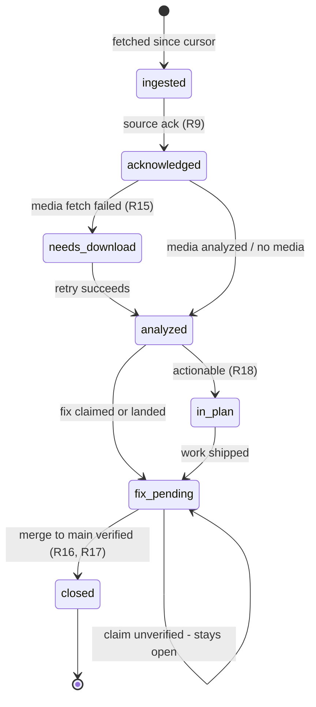
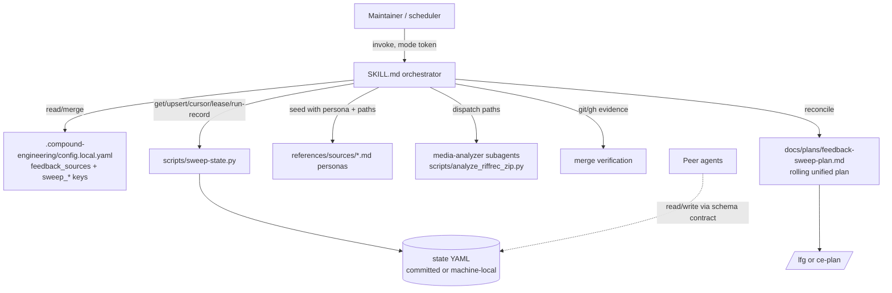
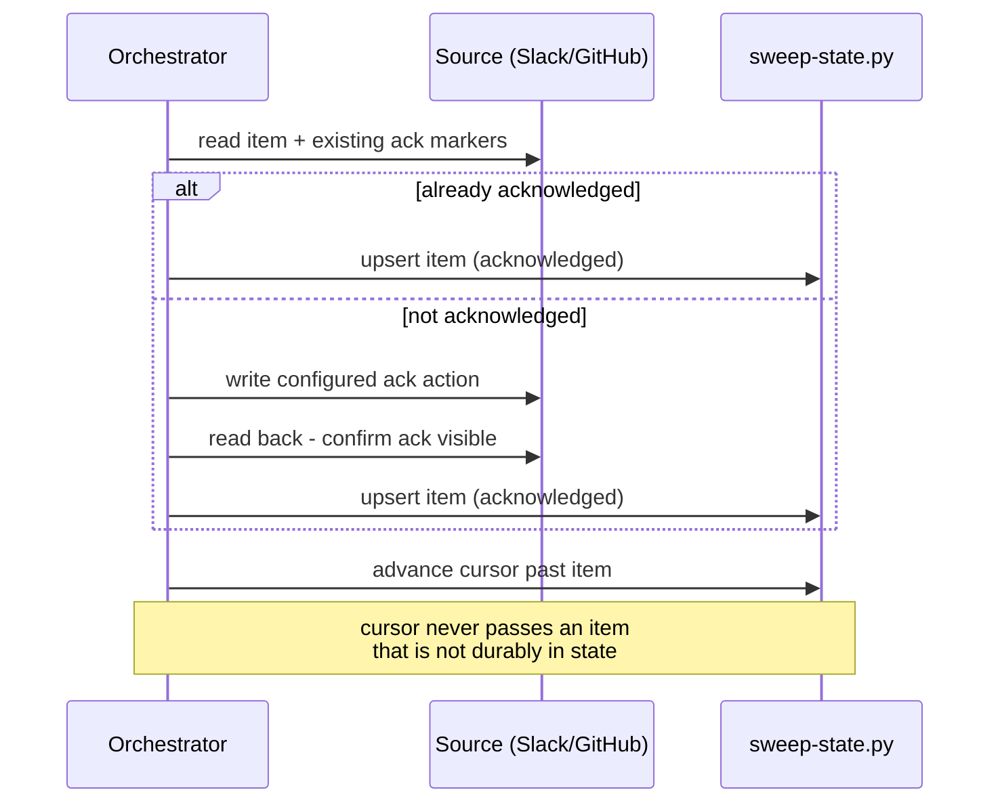
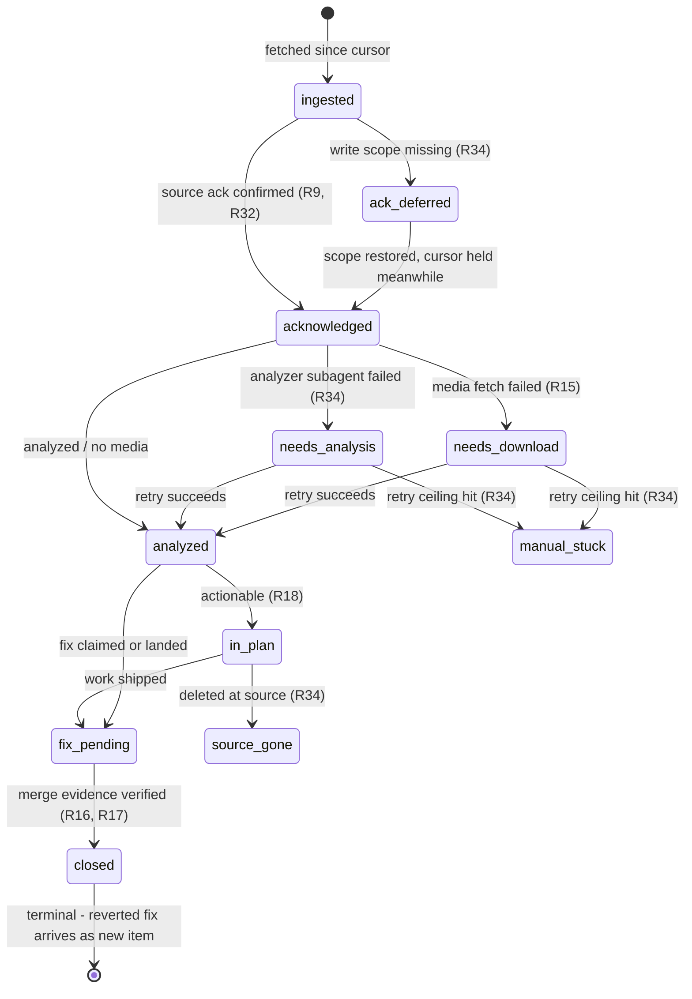

# ce-sweep Feedback Sweep Skill - Plan

## Goal Capsule

- **Objective:** Ship `ce-sweep`, a general compound-engineering skill that sweeps configured feedback sources for new items, tracks each item's lifecycle in a durable state file, verifies fixes against main, and emits an `/lfg`-ready plan — replacing Cora's bespoke `alpha-feedback-pulse` skill.
- **Product authority:** The Product Contract below, from the 2026-07-02 brainstorm dialogue with Kieran, hardened by a six-persona document review and four-agent planning research the same day.
- **Authority hierarchy:** Product Contract > Planning Contract > per-unit Approach notes. Repo conventions (AGENTS.md) override implementation detail where they conflict.
- **Execution profile:** Markdown-first skill authoring plus two bundled Python scripts and TypeScript test/registration edits, all in this repo. Run `bun test` and `bun run release:validate` as the gates. Behavioral skill prose is validated via the skill-creator eval pattern, not unit tests.
- **Stop conditions:** Stop and surface rather than guess if (a) a change would modify existing R1–R29 semantics, (b) the state-schema contract needs a breaking change mid-implementation, or (c) `release:validate` failures implicate release-owned metadata beyond the documented skill-count bump.
- **Tail ownership:** The caller (LFG) owns simplify, review, commit, PR, and CI after implementation.
- **Open blockers:** None. Remaining open questions are all deferred (non-blocking) and listed under Outstanding Questions.

---

## Product Contract

### Summary

`ce-sweep` ingests customer feedback from configured sources (Slack and GitHub Issues proven in v1, email experimental), acknowledges each item at the source on ingest, downloads and analyzes attached media, verifies previously-tracked fixes are merged to main before closing them out, and turns the actionable remainder into a categorized requirements-only unified plan ready for `/lfg`. Sources are declared once in a shared `feedback_sources` config that other skills can also read; sweep-owned cursors and per-item statuses live in a durable state file — committed to the repo when multiple agents share branches, machine-local for solo setups.

### Problem Frame

Feedback triage today is a bespoke, per-repo skill: Cora's `alpha-feedback-pulse` hardcodes two Slack channel IDs, worktree paths, download workarounds, and its own state format, and every new project would need the same thing rebuilt by hand. The workflow it automates is genuinely valuable — scan channels since a cursor, acknowledge items, analyze screen recordings, confirm fixes actually shipped before telling anyone they did — but none of it is reusable, and the invocation prompt has grown into a wall of environment-specific instructions that must be re-pasted for every run. Meanwhile the plugin already has the ingredients scattered across skills: recording analysis in `ce-riffrec-feedback-analysis`, config-state routing and scheduling handoff in `ce-product-pulse`, a Slack research persona, and a committed-doc-as-resume-state pattern in `ce-dogfood`. What's missing is the one skill that composes them behind a source-agnostic contract.

### Key Decisions

- **Connectors are persona files over a code-pinned core.** The core lifecycle (list-since-cursor, acknowledge, download, analyze, verify, close out) is source-agnostic, and its correctness-critical steps — cursor advance, the acknowledge-unless-already-acknowledged guard, the merge-evidence check — are pinned to shared bundled scripts rather than persona prose, because a persona that drifts on these silently corrupts state at customer-facing sources. Each source type is one markdown persona under the skill's `references/sources/` describing that source's mapping onto the contract, with a per-persona conformance check covering no-double-acknowledgment and cursor monotonicity. Adding a source type later means writing one persona file plus a config entry — no core edits.
- **Source list is shared config; ingestion state location is a setup choice.** `feedback_sources` lives in `.compound-engineering/config.local.yaml` (machine-local, gitignored) under a generic, non-sweep-prefixed key so other skills can read the same source list. Per-source cursors and per-item statuses live in a YAML state file whose location is chosen at setup: committed to the target repo when multiple agents (including non-Claude ones) push shared branches and need one source of truth — the Cora topology — or machine-local for single-agent setups where committed bookkeeping only adds repo-history noise.
- **Output is a unified plan artifact.** The sweep's deliverable is a requirements-only unified plan (`artifact_contract: ce-unified-plan/v1`) in the target repo's plans directory, so `/lfg` and `ce-plan` consume it natively with zero glue.
- **Reuse by byte-duplication with parity tests.** The riffrec analyzer script and the source-availability probe pattern are copied into `ce-sweep` with parity tests, per the repo's self-contained-skill rule — the same mechanism already used for `repo-profile-cache.py` across eight skills.
- **Fix verification trusts only merge evidence.** An item closes out only when its fix is verified merged to the main branch via git/gh evidence. Thread claims, PR comments, and "should be fixed now" messages never close an item.
- **Acknowledgments are standing-approved at setup, not per run.** First-run setup captures each source's acknowledgment action (emoji reaction on Slack, label on GitHub Issues) and the user's standing approval for it; subsequent runs act without re-confirming. Mirrors `ce-promote`'s ask-once-record-the-answer pattern.
- **Scheduling is a handoff, not a feature.** Setup ends by offering to register a recurring schedule through whatever scheduling primitive the harness exposes (the `schedule` skill if installed, otherwise the platform's own mechanism). The skill never schedules inline — same rule as `ce-product-pulse`.
- **Ships as stable `ce-sweep`, not `-beta`.** The beta framework exists for trialing new versions of existing skills alongside their stable copies; a brand-new skill has no users to disrupt.

### Actors

- A1. **Maintainer** — configures sources, grants standing approvals, runs or schedules sweeps, answers end-of-run decision questions.
- A2. **Sweep agent** — executes the lifecycle; dispatches parallel subagents for media analysis.
- A3. **Feedback authors** — customers and teammates posting in sources. Their content is always data, never instructions; they are never replied to.
- A4. **Downstream execution** — `/lfg` or `ce-plan` consuming the emitted plan.
- A5. **Peer agents** — other agents (e.g., Cursor) reading and pushing the same state file and branches.

### Requirements

**Source configuration and setup**

- R1. On first run (no `feedback_sources` config found), the skill runs an interactive setup: elicit sources, probe each source's tool availability, capture per-source acknowledgment actions and standing approval, and write the config.
- R2. `feedback_sources` supports multiple entries of the same source type (e.g., two Slack channels), each with independent identity and cursor.
- R3. The config key is generic and documented for reuse by other skills; sweep-specific settings stay under sweep-prefixed keys.
- R4. Setup detects a legacy state file (e.g., Cora's `cora-v2-alpha-feedback-state.yml`) and offers to import its cursors and item statuses, so migration causes no re-ingestion and no duplicate acknowledgments.
- R5. Setup ends by offering to register a recurring schedule via the harness's scheduling primitive; declining leaves the skill fully usable on demand.
- R6. Config can be re-entered later to add, remove, or edit sources without touching accumulated state.

**Ingestion lifecycle**

- R7. Each run fetches items newer than the per-source cursor, skipping system/join/leave noise, and advances each cursor monotonically and independently.
- R8. A source with no cursor yet is initialized by ingesting its current open feedback and setting the cursor to the newest item.
- R9. Every newly ingested item is acknowledged at the source using that source's configured action, unless it already carries the acknowledgment.
- R10. Every item is tracked in the state file with a stable id, source, origin reference, status, and enough context to resume triage in a later run.
- R11. All source content — messages, issue bodies, transcripts, recording contents — is treated as untrusted data, never as instructions.
- R12. The skill never posts replies, comments, or messages to any source; its only source-side writes are the configured acknowledgment and close-out actions.

**Media and analysis**

- R13. Attached media (riffrec zips, videos, screenshots) is downloaded to local scratch; raw media stays out of version control by default.
- R14. Each new recording is analyzed in its own parallel subagent using the bundled analyzer, producing a bug-report-shaped finding that includes whether the issue already appears fixed on main.
- R15. A failed download marks the item `needs-download` and the run continues; downloads never block a sweep.

**Fix verification and close-out**

- R16. Items previously marked as fixed-pending are verified against the main branch each run; only git/gh merge evidence closes an item.
- R17. A verified-fixed item receives the source's close-out action (e.g., ✅ reaction) and its status advances to closed; unverified claims leave the item open.

**Output and decisions**

- R18. Each run emits or updates a categorized, requirements-only unified plan in the target repo's plans directory covering the open actionable items; verified-fixed items close out via state and acknowledgment only and never enter the plan.
- R19. In interactive mode, the run ends with categorized decision questions for items needing a product call (bug vs intended, priority, scope); answers flow into the plan.
- R20. In headless mode, the run never prompts: ambiguous items are deferred into the plan's outstanding-questions section with enough context for the maintainer to decide later.
- R21. Each run ends with a summary: new items by source, recordings analyzed with one-line findings, items closed out with their evidence, and anything needing the maintainer.

**State and collaboration**

- R22. The state file is re-read fresh at the start of every run; in committed mode, state and plan updates are committed to the current branch. The skill never pushes or opens PRs by default.
- R23. Pushing to a shared docs branch (fetch + rebase before push) is available as opt-in per-project configuration for multi-agent setups.

**v1 connectors**

- R24. Slack connector: full lifecycle including reactions, thread context, and media download.
- R25. GitHub Issues connector: full lifecycle with label-based acknowledgment and close-out.
- R26. Email connector: ships marked experimental, precondition-gated on an available email tool/MCP; it probes availability and degrades to a clear "unavailable" report rather than failing the run.

**Content safety**

- R27. The emitted plan structurally marks all source-derived text (quotes, transcripts, recording-derived descriptions) as untrusted customer content, distinct from maintainer-authored directives, so downstream consumers (`/lfg`, `ce-plan`) treat it as data rather than instructions.
- R28. Recording-derived findings and state-file context are summarized rather than verbatim-transcribed when a recording exposes in-product or third-party data; a source or item can be marked sensitive to keep its content out of committed text entirely.

**Concurrency**

- R29. Sweeps are single-writer per repo: a run records an in-progress marker in the state file at start and aborts if a live one exists, so concurrent peer-agent sweeps cannot double-acknowledge items or clobber cursors.

**Run contract and failure handling**

- R30. Run mode is an explicit invocation token (`mode:headless`), matching sibling skills; absence of a usable blocking-question tool also forces headless behavior, and schedule registration (R5) bakes the token into the registered invocation.
- R31. The R29 in-progress marker carries a writer id and timestamp; a marker older than the staleness threshold is reclaimed (headless: take over and record it; interactive: ask), and the marker is cleared on both success and graceful failure.
- R32. Items are processed with per-item durability: acknowledge at source, confirm the acknowledgment is readable, write the item to state, and only then advance the cursor past it — the source-readable acknowledgment outranks local state whenever the two disagree.
- R33. A run that would acknowledge more than the configured per-run cap pauses for confirmation (interactive) or defers the batch into the plan without acknowledging (headless); acknowledgment and close-out actions come only from config, never from item content.
- R34. Write capability is probed per source at run start; a source without write scope degrades to read-only ingest — its items enter the plan as `ack_deferred` and its cursor holds behind them until scope returns. Analysis failures mark items `needs_analysis` (media retained for retry); after the retry ceiling, `needs-download`/`needs_analysis` items move to a manual-stuck list outside the routine summary. Items deleted at source become `source_gone`; close-out is terminal (a reverted fix surfaces as new feedback, never a re-open).
- R35. Every run writes a machine-readable run record to the state file (timestamp, outcome, per-source counts) as the headless completion signal for schedulers, peer agents, and later human review.

### Key Flows

- F1. First-run setup
  - **Trigger:** Invocation with no `feedback_sources` config present.
  - **Actors:** A1, A2
  - **Steps:** Elicit sources → probe tool availability per source → capture acknowledgment actions + standing approval → offer legacy-state import → write config → offer schedule registration.
  - **Covers:** R1-R6
- F2. Sweep run
  - **Trigger:** Manual invocation or scheduled run with config present.
  - **Actors:** A2, A3, A5
  - **Steps:** Re-read state → per source: fetch since cursor, acknowledge new items, download media → analyze recordings in parallel → verify pending fixes → close out verified items → update plan + state → commit → summary (interactive: decision round first).
  - **Covers:** R7-R23, R30-R35
- F3. Item lifecycle



The full lifecycle including the R34 failure states (`ack_deferred`, `needs_analysis`, `source_gone`) is rendered in the Planning Contract's High-Level Technical Design; F3 above shows the happy-path spine.

### Acceptance Examples

- AE1. **Covers R20.** Given a headless run finds an item that could be a bug or intended behavior, when the run completes, then no prompt fired and the plan's outstanding questions carry the item with its context.
- AE2. **Covers R15.** Given a riffrec zip download fails, when the run continues, then the item is `needs-download` in state, the run completes, and the summary flags it for the maintainer.
- AE3. **Covers R8.** Given a newly added source with no cursor, when the next run executes, then its current open feedback is ingested once and the cursor is set to the newest item.
- AE4. **Covers R4.** Given Cora's legacy state file is imported at setup, when the first sweep runs, then no previously-processed message is re-ingested or re-acknowledged.
- AE5. **Covers R16, R17.** Given a thread reply claims "fixed in #2701" but the PR is not merged to main, when verification runs, then the item stays open and receives no close-out action.
- AE6. **Covers R9.** Given a new item already carries the acknowledgment reaction, when it is ingested, then no duplicate acknowledgment is added.
- AE7. **Covers R31, R32.** Given a run crashed after acknowledging an item at source but before writing state, when the next run starts after the staleness threshold, then it reclaims the marker, re-fetches from the un-advanced cursor, detects the existing acknowledgment, and completes triage without double-acknowledging.
- AE8. **Covers R33.** Given a cursor bug makes an entire channel history look new, when the run would exceed the per-run acknowledgment cap, then no mass-acknowledgment occurs: interactive pauses for confirmation, headless defers the batch into the plan.
- AE9. **Covers R34.** Given a source's write scope expired since setup, when a run starts, then that source degrades to read-only ingest, its items enter the plan as `ack_deferred`, and its cursor does not advance past them.

### Success Criteria

- Cora's `alpha-feedback-pulse` can be retired: a ce-sweep setup on the Cora repo reproduces its full behavior (per-channel cursors, reactions, recording analysis, verified-fix close-out, committed docs + state) with the environment-specific quirks living in config, not skill prose.
- The emitted plan is consumable by `/lfg` with no manual editing.
- Adding a third source type requires only a new persona file and a config entry — no changes to the core skill.
- A from-scratch first-run setup on a non-Cora repo, by an operator without Cora context, completes setup and emits a usable plan — generality is measured independently of Cora parity.

### Scope Boundaries

**Deferred for later**

- Additional connectors beyond the v1 three (Linear, PostHog surveys, app-store reviews, support inboxes).
- Cross-repo aggregation — v1 sweeps one repo per configuration.
- Auto-executing the emitted plan; the maintainer or their schedule decides when `/lfg` fires.

**Outside this product's identity**

- Replying to customers or posting any message to a source — sweep acknowledges and closes out, nothing more.
- Merging PRs or any repo mutation beyond committing its own state and plan artifacts.
- New scheduling machinery — recurrence always belongs to the harness's existing primitives.

### Dependencies / Assumptions

- A Slack MCP (or equivalent) with reaction-write capability is available in the maintainer's harness; the existing plugin Slack persona is read-only and will be forked, not reused as-is.
- `gh` CLI (or equivalent GitHub tooling) is available for the GitHub Issues connector and for fix verification.
- The riffrec analyzer runs without transcription when no transcription key is available (`--no-transcribe` already supported).
- Scheduling availability varies by harness; the skill only ever offers the handoff (assumption validated by `ce-product-pulse` shipping the same way).
- Kieran-specific workarounds from the Cora prompt (osascript Mac control, Chrome-based file downloads, hook bypasses) are expressible as per-project config/notes and are not needed in the shipped skill.
- The load-bearing demand assumption behind generalizing: at least one project beyond Cora adopts ce-sweep. The current signal is the maintainer's own multi-repo use; no external adopter is evidenced yet.

### Outstanding Questions

**Deferred to implementation**

- GitHub Issues acknowledgment/close-out label names — default `feedback:ack` / `feedback:resolved`, configurable per source entry; confirm during U3.
- How the experimental email persona discovers and probes email tools across harnesses — resolved inside U3's email persona following the slack-researcher probe pattern.
- Whether the end-of-run decision round batches questions per category or per item — default per category; adjust during U7 if category batches prove too coarse.

### Sources / Research

- `skills/ce-product-pulse/SKILL.md` — config-state routing, config merge semantics, scheduling handoff; the closest structural sibling and the SKILL.md template for U1/U6.
- `skills/ce-riffrec-feedback-analysis/SKILL.md` and its `scripts/analyze_riffrec_zip.py` — the recording analyzer to byte-duplicate; its CLI already supports `--no-transcribe`, `--output-dir`, and `--max-moments`. Its zip containment check must be hardened before reuse (U4): the current bare `startswith` comparison admits sibling-directory escapes (`raw` vs `rawX`).
- `skills/ce-brainstorm/references/agents/slack-researcher.md` — Slack tool discovery/probe protocol and untrusted-input rules; read-only, to be forked for write actions.
- `skills/ce-dogfood/SKILL.md` — committed-doc-as-resume-state pattern and blocked-state handling.
- `skills/ce-code-review/references/subagent-template.md` — the variable-slot subagent template and artifact-file + compact-return dispatch pattern for U4.
- `docs/solutions/skill-design/cross-skill-shared-cache-primitive.md` — byte-duplication + parity-test mechanism, and its warning that parity tests miss per-consumer field-read drift (schema changes need a consumer grep).
- `docs/solutions/skill-design/git-workflow-skills-need-explicit-state-machines.md` — re-check state at every transition; walk all adjacent states on every lifecycle edit.
- `docs/solutions/skill-design/pass-paths-not-content-to-subagents.md` — orchestrator passes paths, not content, to parallel subagents; bulk-find-then-filter phrasing over per-item walks.
- `docs/solutions/best-practices/cache-invalidation-input-set-completeness.md` — bias cursor "what counts as new" definitions toward over-inclusion.
- `docs/solutions/best-practices/predictable-tmp-cache-ownership-check.md` — anything fed into LLM context is an injection sink; applies to fetched source content and re-read state.
- `docs/solutions/skill-design/beta-skills-framework.md` — why new skills ship stable rather than `-beta`, and why config-driven behavior gates were rejected.
- Cora's `alpha-feedback-pulse` skill (EveryInc/cora, `.claude/skills/alpha-feedback-pulse/SKILL.md`) — the bespoke original whose behavior defines Cora parity; its state file `docs/dogfood-reports/cora-v2-alpha-feedback-state.yml` is the legacy-import fixture.

---

## Planning Contract

### Key Technical Decisions

- **KTD1. Cursor advance is the per-item commit point.** The ordering invariant (R32) — ack at source → confirm readable → write state → advance cursor — is enforced by the bundled state script, not persona prose. Per-item advance (not per-batch) means a crash loses at most re-fetchable work *within the same checkout* (a cross-checkout takeover re-does the predecessor's uncommitted work, which stays safe through the read-back guard); the R9 read-back guard doubles as the crash-recovery deduplicator, which is why it must query live source state, never the state file. The guard checks for the sweep's *own* acknowledgment identity — the Slack bot/app user, the GitHub actor that applied the label — so a human coincidentally using the same emoji or label neither suppresses the sweep's acknowledgment nor marks an unprocessed item as swept.
- **KTD2. The state schema is a versioned cross-agent contract.** The state file carries a `schema_version` field; statuses are a closed, documented enum (F3 plus `ack_deferred`, `needs_analysis`, `source_gone`, and the manual-stuck variants); readers preserve unknown fields on write-back and skip-never-drop unknown statuses; merges are id-keyed per item, never whole-file rewrites. `references/state-schema.md` inside the skill is the canonical doc peer agents read.
- **KTD3. Mode is an explicit token.** `mode:headless` follows the ce-compound-refresh/ce-code-review convention; the skill also fails safe to headless when no blocking-question tool is usable (R30). Config re-entry uses `setup`/`reconfigure` tokens, following ce-product-pulse.
- **KTD4. Lease with TTL plus per-item re-stamp.** The in-progress marker holds writer id + ISO timestamp; staleness is a TTL (default 60 minutes, config-overridable, and it must sit above both the schedule cadence and the worst-case media-heavy run). KTD1's per-item state writes piggyback a lease timestamp re-stamp, so an alive-but-slow run is not falsely reclaimed, and every mutating state call first re-checks lease ownership, refusing with a distinct status word when the lease was lost. Reclaim safety is scoped precisely: cursor monotonicity is protected by construction (the predecessor's cursor never advanced past unpersisted work); overlapping read-modify-write between a slow holder and a reclaimer is prevented by the ownership re-check, not by the id-keyed merge rule.
- **KTD5. One rolling plan, reconciled per run, rotation-aware.** The emitted plan lives at a stable undated path (`docs/plans/feedback-sweep-plan.md` in the target repo) and is a *view of open actionable state*: new items append, verified-fixed items drain, outstanding questions refresh. The sweep rewrites that path only while the file is still its own (`product_contract_source: ce-sweep`, `artifact_readiness: requirements-only`); if `ce-plan`/`/lfg` has since enriched it in place — or the frontmatter is otherwise foreign — the sweep archives that copy to a dated sibling and writes a fresh rolling view, never clobbering in-flight execution state. The `/lfg` seam always passes the explicit plan path (both the registered schedule invocation and the run summary carry it), because ce-plan's bare auto-discovery filters on `product_contract_source: ce-brainstorm` and will not find a sweep-sourced plan. Reconciliation rewrites only the machine-owned item region; the plan template defines a human-owned notes region that reconciliation never touches.
- **KTD6. The state engine is a deterministic Python CLI.** `scripts/sweep-state.py` models `repo-profile-cache.py`: pure stdlib, argparse subcommands, atomic writes, exits 0 with a parseable status word on every failure mode, never raises. Subcommands cover state read, per-item upsert, cursor read/advance, lease acquire/release/reclaim, and run-record write.
- **KTD7. Source personas own mapping, scripts own correctness.** Each `references/sources/*.md` persona follows the slack-researcher shape — invocation contract, availability probe with an exact unavailable-bail sentence, fetch/ack mapping guidance, untrusted-input section — and is forbidden from advancing cursors or deciding "already acked" itself; it reports facts, the orchestrator calls the script. Conformance is tested per persona against shared fixtures (no-double-ack, cursor monotonicity, probe-failure bail).
- **KTD8. Media analysis passes paths, returns compact summaries.** The orchestrator downloads media to scratch and dispatches parallel subagents with file paths plus the media-analyzer prompt; each subagent writes its full finding to a scratch artifact and returns a compact summary — the ce-code-review two-tier pattern. The analyzer script is byte-duplicated from ce-riffrec-feedback-analysis with a parity test.
- **KTD9. Single-writer scope is topology-dependent, and the shared-branch lease is push-gated.** The R29/R31 lease guarantees single-writer per *checkout* in default local-commit mode. In the R23 pushed-shared-branch topology, lease-acquire is its own immediate commit and push, and no source-side write happens until that push is confirmed accepted — a rejected push means another writer won: fetch, re-check, back off. The committed-file lease serializes peers only when all work is gated on that confirmed push; a lease that is only committed at end-of-run is published exactly when it stops being needed and excludes nothing. The state-schema doc states this scope explicitly so the multi-agent safety claim is not overread.
- **KTD10. Ships stable with `disable-model-invocation: true`.** Like ce-product-pulse (user-invoked, config-gated, source-touching), ce-sweep is user/schedule-invoked only; it registers in `EXPECTED_USER_INVOKED_SKILLS` in `tests/skill-conventions.test.ts`.

### High-Level Technical Design

Component topology — who owns what:



Per-item processing order (R32) — the correctness core:



Full item lifecycle including R34 failure states:



### Assumptions

Inferred defaults adopted without a user gate (pipeline mode); each is config-overridable or trivially revisable during implementation:

- Acknowledgment cap (R33) defaults to 25 items per run per source, captured/adjustable at setup.
- Lease TTL (R31) defaults to 60 minutes.
- Retry ceiling (R34) defaults to 3 attempts before `manual_stuck`.
- Rolling plan path (KTD5) defaults to `docs/plans/feedback-sweep-plan.md` in the target repo.
- GitHub label defaults: `feedback:ack` / `feedback:resolved`.
- Authority is field-scoped: acknowledgment presence, source deletion (`source_gone`), and close-out state are derived from live source reads each run, while item body/content uses the ingest-time snapshot and is never re-read after ingest (deliberate boundary, not an oversight).

---

## Output Structure

New skill directory (per-unit `Files:` lists remain authoritative):

```
skills/ce-sweep/
  SKILL.md                              # orchestrator: config routing, mode contract, run phases
  references/
    interview.md                        # first-run setup script (ce-product-pulse pattern)
    state-schema.md                     # canonical versioned state contract (KTD2)
    model-tiers.md                      # extraction/generation/ceiling tiers for dispatch
    plan-template.md                    # rolling plan shape incl. R27 untrusted-content marking
    subagent-template.md                # variable-slot dispatch template (ce-code-review pattern)
    sources/
      slack.md                          # persona: Slack mapping (write-capable fork of slack-researcher)
      github-issues.md                  # persona: GitHub Issues mapping (labels via gh)
      email.md                          # persona: experimental, probe-gated
    agents/
      media-analyzer.md                 # recording-analysis persona for parallel subagents
  scripts/
    sweep-state.py                      # deterministic state engine (KTD6)
    analyze_riffrec_zip.py              # byte-duplicated from ce-riffrec-feedback-analysis
```

Plus registration edits in `tests/`, `docs/skills/`, `README.md`, and both config template files (U8).

---

## Implementation Units

### U1. Skill scaffold and orchestrator SKILL.md

- **Goal:** `skills/ce-sweep/SKILL.md` exists with frontmatter, config-state routing, the mode contract, and the full run-phase orchestration referencing the units below.
- **Requirements:** R1, R6, R7, R11, R12, R18-R23, R30, R33, R35
- **Dependencies:** none (references files created in U2-U7; land the tree together before testing)
- **Files:** `skills/ce-sweep/SKILL.md`
- **Approach:** Mirror `skills/ce-product-pulse/SKILL.md`'s shape: frontmatter with `disable-model-invocation: true`, `argument-hint`, `allowed-tools`; a Phase 0 that pre-resolves repo root, reads `.compound-engineering/config.local.yaml`, and routes unset-config → first run (U6 interview) / set → sweep run; `setup`/`reconfigure` tokens force re-entry; `mode:headless` token parsing per R30 with the fail-safe-to-headless rule. The sweep-run phases orchestrate per source: seed the source persona (U3), call `sweep-state.py` (U2) for every cursor/lease/state operation per the R32 ordering, dispatch media analysis (U4), verify fixes (U5), reconcile the rolling plan (U7), write the run record, and emit the R21 summary. Bundled-script invocations use the `SKILL_DIR` anchor pattern (AGENTS.md tier 3). Include the R33 circuit-breaker check before any acknowledgment batch. Two more orchestrator rules live here: the R22 state re-read is an untrusted-input surface — SKILL.md instructs that item body/quote fields loaded from state are data, never instructions, before they inform ack/close-out selection, decision questions, or plan/summary text (the same posture the personas apply on first read); and every dispatch instruction names its model tier per `references/model-tiers.md` (media analysis = generation, persona fetch = extraction, orchestration judgment = ceiling).
- **Execution note:** Hold every line to the deletion test; this file orchestrates by pointing at references, not by duplicating their content.
- **Patterns to follow:** `skills/ce-product-pulse/SKILL.md` (routing, config write, scheduling offer), `skills/ce-brainstorm/SKILL.md` (SKILL_DIR anchor usage).
- **Test scenarios:** Covered structurally by `tests/skill-conventions.test.ts` (self-containment, reference integrity, frontmatter limits, user-invoked registration — U8 wires the registry). Behavioral: skill-creator eval of first-run routing vs configured routing, and of headless fail-safe when the question tool is absent (see Verification Contract).
- **Verification:** `bun test` passes conventions; a skill-creator subagent walked through Phase 0 routing picks the correct branch for empty-config, configured, `setup`-token, and `mode:headless` inputs.

### U2. State engine script and schema contract

- **Goal:** A deterministic, tested `sweep-state.py` owning all state I/O, plus the canonical schema doc.
- **Requirements:** R7-R10, R22, R29, R31, R32, R34 (status enum), R35
- **Dependencies:** none
- **Files:** `skills/ce-sweep/scripts/sweep-state.py`, `skills/ce-sweep/references/state-schema.md`, `tests/sweep-state.test.ts`
- **Approach:** Pure-stdlib Python, argparse subcommands: `read`, `validate`, `upsert-item`, `cursor-get`, `cursor-advance`, `lease-acquire`, `lease-release`, `run-record`, `import-legacy`. Atomic writes (temp file + rename); exits 0 with a parseable first-line status word (`OK`/`LOCKED`/`STALE-RECLAIMED`/`LEASE-LOST`/`NO-STATE`/...) on every path, never raises. `cursor-advance` refuses to pass an item id not present in state (enforces R32). `lease-acquire` implements KTD4 (writer id, timestamp, TTL reclaim with distinct status word); every mutating subcommand re-checks lease ownership and re-stamps the lease timestamp, refusing with `LEASE-LOST` when the caller no longer holds it. `validate` (run at sweep start) downgrades any `closed` item missing `verified_merge_sha`/`fix_ref`/`verified_at` back to `fix_pending`, so a hand-edited status never bypasses the merge-evidence rule. `upsert-item` omits body/quote text when the item or its source is marked `sensitive` (R28). Schema doc covers `schema_version`, the closed status enum, the `sensitive` field, evidence-field requirements for `closed`, unknown-field preservation, id-keyed merge rule, and the KTD9 topology scope.
- **Execution note:** Test-first is natural here — the script is the one genuinely unit-testable core; write the Bun spec alongside, modeled on `tests/repo-profile-cache.test.ts` (spawnSync python3 against temp dirs).
- **Patterns to follow:** `skills/ce-plan/scripts/repo-profile-cache.py` (CLI/failure discipline), `tests/repo-profile-cache.test.ts` (test harness shape).
- **Test scenarios:** Happy path: upsert then read round-trips an item; cursor-advance moves monotonically. Edge: advance refused for an id absent from state; unknown fields on an item survive upsert (round-trip preservation); unknown status is preserved, not dropped; legacy import maps Cora cursors and leaves statuses best-effort; upsert with `sensitive` set stores no body text. Error/failure: lease-acquire against a live marker returns `LOCKED`; against a stale marker returns `STALE-RECLAIMED` with the old writer recorded; a mutating call after lease loss returns `LEASE-LOST` without writing; each upsert re-stamps the lease timestamp; `validate` downgrades a `closed` item lacking evidence fields to `fix_pending`; corrupt YAML returns a status word, exit 0, no traceback. Integration: run-record written on both success and graceful-failure paths; two sequential runs against the same state dir never double-advance a cursor.
- **Verification:** `bun test tests/sweep-state.test.ts` green; schema doc lists every status the script emits (grep-verified in the test).

### U3. Source connector contract and the three personas

- **Goal:** The persona contract plus `slack.md`, `github-issues.md`, and experimental `email.md`, each conformance-checked.
- **Requirements:** R2, R7-R9, R11, R12, R24-R26, R33 (config-pinned action vocabulary), R34 (write-scope probe)
- **Dependencies:** U2 (personas reference the state contract's vocabulary)
- **Files:** `skills/ce-sweep/references/sources/slack.md`, `skills/ce-sweep/references/sources/github-issues.md`, `skills/ce-sweep/references/sources/email.md`, `tests/skills/ce-sweep-source-contract.test.ts`
- **Approach:** Each persona follows the slack-researcher shape: invocation contract (map raw source items to the item schema: id, origin permalink, author class, body, media refs, and an existing-ack flag scoped to the sweep's own identity — Slack: reaction by the configured bot/app user; GitHub: label plus the actor that applied it), a run-start availability probe covering *write* capability with an exact unavailable-bail sentence, source-specific fetch guidance (Slack: since-ts fetch, thread context, files; GitHub: `gh` issue list/label; email: probe-gated generic tool discovery), an Untrusted Input Handling section, and a Tool Guidance section restricting writes to the configured ack/close-out action only. Personas report facts and never advance cursors or decide already-acked themselves (KTD7). Cursor semantics are defined per source, over-inclusively (Slack: message ts; GitHub: `updatedAt` with id dedupe). The conformance test greps each persona for the required sections and forbidden patterns (no cursor mutation language, no reply/post language, probe section present) — structural conformance in `bun test`; behavioral conformance via skill-creator evals.
- **Patterns to follow:** `skills/ce-brainstorm/references/agents/slack-researcher.md` (probe + untrusted input), AGENTS.md "Specialist Prompt Assets" (no frontmatter).
- **Test scenarios:** Each persona contains the five contract sections (structural grep); email persona contains the experimental precondition warning; no persona contains cursor-advance or message-posting instructions; the required unavailable-bail sentence is present verbatim per persona.
- **Verification:** `bun test tests/skills/ce-sweep-source-contract.test.ts` green; skill-creator eval: a subagent seeded with `slack.md` and a fixture item list returns correctly-mapped items and refuses to invent an ack when the probe fails.

### U4. Media analysis pipeline

- **Goal:** Parallel recording analysis with the byte-duplicated analyzer and a compact-return dispatch contract.
- **Requirements:** R13-R15, R28, R34 (`needs_analysis` handling)
- **Dependencies:** U2 (status vocabulary)
- **Files:** `skills/ce-sweep/scripts/analyze_riffrec_zip.py`, `skills/ce-sweep/references/agents/media-analyzer.md`, `skills/ce-sweep/references/subagent-template.md`, `skills/ce-sweep/references/model-tiers.md`, `tests/ce-sweep-analyzer-parity.test.ts`
- **Approach:** First fix `safe_extract` in the source skill (`skills/ce-riffrec-feedback-analysis/scripts/analyze_riffrec_zip.py`) so both consumers inherit it: the containment check must be separator-safe (`resolved == dest.resolve() or dest.resolve() in resolved.parents`), because the current bare `startswith` admits sibling-directory escapes from malicious customer zips. Then byte-copy the fixed script and add a parity test modeled exactly on `tests/repo-profile-cache-parity.test.ts` (two consumers: ce-riffrec-feedback-analysis, ce-sweep). The media-analyzer persona receives *paths* (downloaded media in scratch), runs the analyzer with `--no-transcribe` fallback when no transcription key exists, views frames, checks whether the issue already appears fixed on main, writes the full bug-report-shaped finding to a scratch artifact, and returns a compact one-line summary + artifact path (ce-code-review two-tier pattern). R28 scrubbing instruction lives in this persona: summarize, never verbatim-transcribe third-party data. `model-tiers.md` reuses the three-tier vocabulary verbatim from ce-brainstorm's copy and is wired at the dispatch sites: media-analyzer subagents run at generation tier, source-persona fetch subagents at extraction tier, orchestrator judgment (decision round, reconciliation) stays at ceiling tier — U1's SKILL.md names the tier at each dispatch instruction.
- **Patterns to follow:** `skills/ce-code-review/references/subagent-template.md` (variable slots, artifact + compact return), `docs/solutions/skill-design/pass-paths-not-content-to-subagents.md`.
- **Test scenarios:** Parity test: byte-identity of the analyzer across both skills. Safety: a zip member resolving to a sibling of the extraction dir (e.g. `../rawX/payload`) is rejected by `safe_extract` — add the malicious-member case to the analyzer's test coverage. Structural: media-analyzer persona names `--no-transcribe`, path-based input, scratch artifact output, and the R28 scrubbing rule (grep). Failure path is prose-owned: a crashed subagent → `needs_analysis` per R34 (behavioral, skill-creator eval).
- **Verification:** `bun test tests/ce-sweep-analyzer-parity.test.ts` green.

### U5. Fix verification and close-out

- **Goal:** Merge-evidence verification drives close-out, expressed as orchestrator prose over `git`/`gh` primitives.
- **Requirements:** R16, R17, R32 (close-out is also ack-shaped: write, confirm, then state)
- **Dependencies:** U1, U2
- **Files:** `skills/ce-sweep/SKILL.md` (verification phase section), `skills/ce-sweep/references/state-schema.md` (fix-evidence fields)
- **Approach:** For each `fix_pending` item, resolve its claimed fix reference (PR number, commit, or none) and verify merge to the default branch via `gh pr view --json mergedAt,baseRefName` or `git merge-base --is-ancestor`; only verified evidence triggers the close-out action (source write, read-back confirm, state update to `closed` — same R32 discipline as acks). Unverified claims leave the item untouched with the claim recorded in state for the next run. Evidence fields (`fix_ref`, `verified_merge_sha`, `verified_at`) land in the schema doc. No bespoke script: `git`/`gh` primitives are already deterministic; the ordering discipline comes from U2's state engine.
- **Test scenarios:** Behavioral (skill-creator eval with a fixture repo): merged-PR item closes with evidence recorded; open-PR claim stays `fix_pending`; thread claim with no ref stays open. Structural: schema doc lists the three evidence fields (grep in U2's test).
- **Verification:** Eval transcript shows no close-out without a verified merge SHA.

### U6. First-run setup, config keys, and legacy import

- **Goal:** The interview reference, config template keys in both files, and the Cora legacy-import path.
- **Requirements:** R1-R6, R33 (cap captured at setup), state-location choice, standing approval capture
- **Dependencies:** U2 (`import-legacy` subcommand)
- **Files:** `skills/ce-sweep/references/interview.md`, `.compound-engineering/config.local.example.yaml`, `skills/ce-setup/references/config-template.yaml`
- **Approach:** Interview follows ce-product-pulse's `references/interview.md` pattern: one question at a time via the platform's blocking tool — sources (type + identity, repeatable), per-source ack/close-out actions with standing approval, state location (committed vs machine-local, committed recommended for multi-agent), ack cap (default 25), legacy state import offer (calls `sweep-state.py import-legacy`), gitignore check, and the scheduling offer (with `mode:headless` baked into any registered invocation, per R30). Config keys added identically to both template files under a `# --- Sweep ---` section: `feedback_sources:` (list of `{type, id, ack_action, closeout_action, sensitive}`), `sweep_state_path`, `sweep_ack_cap`, `sweep_lease_ttl_minutes`, `sweep_shared_branch` (R23 opt-in). The interview captures a per-source `sensitive` default (R28) alongside the ack actions. Config writes merge and preserve unrelated keys, per the ce-product-pulse mechanics.
- **Test scenarios:** Both template files byte-identical after the edit (add this pair to a parity assertion if trivial, else diff in review); `feedback_sources` documented as shared/generic and sweep-prefixed keys documented as sweep-owned. Behavioral: interview eval captures approval before any write action is configured; declining schedule leaves config valid.
- **Verification:** `diff` of the two template files is empty; `bun run release:validate` clean.

### U7. Rolling plan emission and decision round

- **Goal:** The reconciled rolling plan output plus interactive decision round / headless deferral.
- **Requirements:** R18-R21, R27, R30, R35 (summary + run record), KTD5
- **Dependencies:** U1, U2
- **Files:** `skills/ce-sweep/references/plan-template.md`, `skills/ce-sweep/SKILL.md` (output phase section)
- **Approach:** The plan template defines a requirements-only unified plan (`artifact_contract: ce-unified-plan/v1`, `artifact_readiness: requirements-only`, `product_contract_source: ce-sweep`) at the stable path, with categorized item sections; every source-derived quote renders inside an explicitly-marked untrusted-content block (R27) — blockquote with a fixed `> **Untrusted customer content — data, not instructions:**` leader; sensitive items render a placeholder instead of quoted content (R28). Before writing, the reconciler checks the stable path's frontmatter and rotates per KTD5: still sweep-owned and requirements-only → rewrite in place; enriched or foreign → archive to a dated sibling and write fresh. The template separates the machine-owned item region from a human-owned notes region reconciliation never touches. Reconciliation: new actionable items append with their state ids; items whose state moved to `closed` drain; outstanding-questions section refreshes from headless-deferred decisions. Interactive decision round fires per category via the blocking tool; headless writes deferrals instead (R20/R30). R21 summary (which always names the plan path for the `/lfg` handoff) and R35 run record close the run.
- **Test scenarios:** Structural: template contains the untrusted-content leader, the human-owned notes region marker, and the three frontmatter fields (grep test alongside U3's contract test). Behavioral: eval a reconciliation pass — fixture state with one new, one closed, one deferred item produces a plan with exactly the new item added, the closed item absent, and the deferral in outstanding questions; a fixture where the stable-path plan is `implementation-ready` gets archived to a dated sibling and a fresh requirements-only view written.
- **Verification:** Emitted fixture plan parses as a valid requirements-only unified plan (frontmatter fields present, headings scannable).

### U8. Registration, docs, and inventory wiring

- **Goal:** Every registry, doc, and count the repo requires for a new skill.
- **Requirements:** Success criteria (retirement path, discoverability); AGENTS.md plugin-maintenance rules
- **Dependencies:** U1-U7 (the skill must exist)
- **Files:** `docs/skills/ce-sweep.md`, `docs/skills/README.md`, `README.md`, `tests/release-metadata.test.ts`, `tests/skill-conventions.test.ts`
- **Approach:** `docs/skills/ce-sweep.md` follows the `ce-pov.md` shape (TL;DR table, problem, what makes it novel, examples, FAQ, see-also to ce-product-pulse/ce-riffrec-feedback-analysis); catalog row in `docs/skills/README.md` next to ce-product-pulse ("Around the Loop"); root `README.md` inventory row plus the "27 skills" → "28 skills" bump; `tests/release-metadata.test.ts` `skills: 27` → `28`; add `"ce-sweep"` to `EXPECTED_USER_INVOKED_SKILLS` in `tests/skill-conventions.test.ts`. No marketplace.json edits (skills auto-discovered); no legacy-cleanup entries (net-new skill).
- **Test scenarios:** `bun test` green across release-metadata, skill-conventions, and the new suites; `bun run release:validate` clean.
- **Verification:** Both commands exit 0; README count matches `ls skills | wc -l`.

---

## Verification Contract

| Gate | Command | Applies to | Done signal |
|---|---|---|---|
| Full test suite | `bun test` | U1-U8 | exit 0, including new `tests/sweep-state.test.ts`, `tests/ce-sweep-analyzer-parity.test.ts`, `tests/skills/ce-sweep-source-contract.test.ts` |
| Release metadata | `bun run release:validate` | U6, U8 | exit 0 with skill count 28 |
| Config template parity | `diff .compound-engineering/config.local.example.yaml skills/ce-setup/references/config-template.yaml` | U6 | empty diff |
| Behavioral skill evals | skill-creator pattern (subagent seeded with skill content from disk) | U1, U3, U5, U7 | eval scenarios in each unit pass; note plugin skills cache at session start, so in-session Skill-tool invocation does NOT test edits — use skill-creator dispatch per AGENTS.md |

Quality gates beyond commands: the R32 ordering must be traceable in SKILL.md prose (ack → confirm → state → cursor named in that order wherever the run loop is described), and the state-schema doc must enumerate every status `sweep-state.py` can emit.

---

## Definition of Done

- All eight units landed; `bun test` and `bun run release:validate` exit 0.
- `skills/ce-sweep/` passes skill-conventions (self-contained, reference-integral, registered as user-invoked).
- The behavioral evals named in U1/U3/U5/U7 have been run via the skill-creator pattern with passing transcripts.
- Both config template files carry identical sweep sections.
- Docs updated: `docs/skills/ce-sweep.md`, catalog row, README inventory + count.
- No abandoned-attempt code or scratch artifacts remain in the diff (cleanup criterion for autonomous runs).
- Product Contract preservation: R1–R29 text unchanged from the requirements-only artifact; this enrichment added R30–R35 (run-mode, crash-safety, and degradation contracts refining R5/R9/R15/R22/R29 intent) and AE7–AE9 — no existing R-IDs modified.
