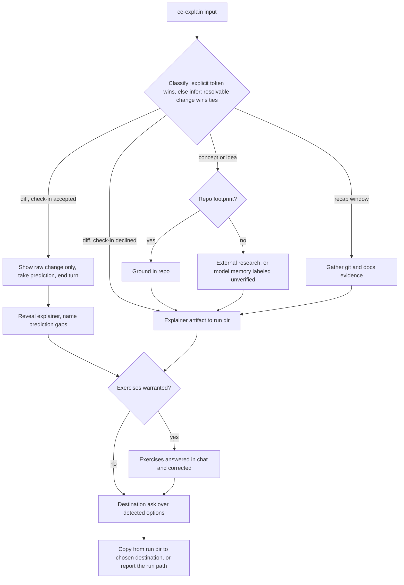

# ce-explain Skill - Plan

## Goal Capsule

- **Objective:** Ship a new `ce-explain` skill that turns a concept, diff, idea, or window of the user's own work into a dense, visual, personal learning artifact, with an optional in-session check-in that makes the material stick.
- **Product authority:** The Product Contract below. Product behavior, scope boundaries, and success signals were resolved in brainstorm dialogue; planning amendments are recorded in the Planning Contract's preservation note.
- **Execution profile:** Skill-prose work — markdown authoring under `skills/ce-explain/` plus registration touchpoints. Behavioral validation runs through `skill-creator` evals, not `bun test` alone.
- **Stop conditions:** Surface rather than guess if an eval shows the ce-polish handoff cannot receive seed observations (downgrade decision), or if any amendment below turns out to contradict a product decision rather than fill a gap.
- **Open blockers:** None. Remaining open questions are deferred to implementation and non-blocking.

---

## Product Contract

### Summary

A new `ce-explain` skill: point it at a concept (repo-grounded or external), a diff, an idea, or a window of recent work, and it produces a dense, visual explainer written for the user personally.
When the material warrants retention, the session continues with a check-in — predict-then-reveal for diffs, exercises answered in chat and corrected.
At the end, the skill asks where to publish the artifact, offering only destinations it detects.

### Problem Frame

Agent-driven development removed the learning that writing code by hand used to provide.
The user ships work through agents, rarely reads the code, and no longer accumulates the understanding that typing it themselves once forced.
The cost shows up twice: comprehension debt on their own projects — the concern in Geoffrey Litt's thread on why understanding agent-written code still matters — and recall gaps when a meeting requires speaking to what happened recently.
Existing plugin skills capture knowledge for the repo (`ce-compound`) or judge options (`ce-pov`); none teaches the human.

### Key Decisions

- **A lesson, not just a doc.** The chosen shape is an explainer plus an active check-in loop, over both a read-only artifact (reading alone doesn't stick) and a full learning library (deferred until real use shows the artifacts get re-read).
- **Always written for the user.** One voice: dense and technical, no audience adaptation. Meeting prep preps the user; it never produces the deck.
- **HTML-first, markdown fallback.** Show-n-tell — sketches, diagrams, annotated snippets — degrades badly in plain markdown, so HTML is the default and reuses the plugin's generic self-contained artifact invariants.
- **Check-in lives in the session; the artifact stays display-only.** The doing happens in chat where the skill can correct answers; the artifact carries no interactive widgets.
- **Idea mode treats the idea as a fixed given.** It explains the idea's implications, mechanics, and trade-offs for the user's understanding — it never scopes the idea (`ce-brainstorm`'s job) or generates and ranks alternatives (`ce-ideate`'s job).
- **Catalog-only integration.** No inbound menu edits in other skills for v1. The inspiration wiring runs outbound only: ce-explain's closing routes surfaced opportunities by type — new-capability ideas to `ce-ideate`, UI/UX polish to `ce-polish`, code-clarity findings to `ce-simplify-code`.
- **Destination is asked, not fixed.** The end-of-run ask offers only detected destinations; detection is by capability, never by assuming a specific CLI or tool exists. Bare `/ce-explain` with no input asks one blocking question: what to explain.

### Requirements

**Intake and modes**

- R1. One skill accepts four input shapes: a concept, a diff or change, an idea, and a window of recent work ("what happened / what did I do").
- R2. Concepts may be fully external with no repo footprint (e.g., interview prep on a language topic); repo grounding applies when the topic touches the repo and is skipped when it does not. When external research is unavailable, the skill may explain from model knowledge but must label that content as unverified in the artifact.
- R3. Work-recap mode draws from git activity and project docs (plans, brainstorms, solutions) over the requested window.

**Explainer artifact**

- R4. The explainer is dense and personal — written for the user, with no audience adaptation.
- R5. Show-n-tell by default: diagrams, sketches, annotated code snippets — whichever fits the material, chosen per topic.
- R6. HTML is the default output format, following the plugin's generic self-contained artifact invariants (single file, inline CSS/SVG, metadata visible as text); markdown is available as a fallback.
- R7. When the explanation surfaces improvement opportunities, the closing routes them by type: new-capability ideas seed `ce-ideate`, UI/UX polish opportunities seed `ce-polish`, code-clarity findings seed `ce-simplify-code`.

**Check-in (active learning)**

- R8. When the material warrants retention, the session continues after the artifact with a check-in: for diffs, predict-then-reveal (the user states what they think the change does before the explanation confirms or corrects); for concepts, ideas, and non-routine recaps, exercises answered in chat that the skill checks and corrects.
- R9. The check-in is skippable: the skill judges when material doesn't need one (e.g., a routine recap), and the user can always decline.
- R10. The artifact stays display-only — no embedded quizzes, forms, or widgets.
- R13. In diff mode with the check-in accepted, no interpretive content — explanation, annotation, diagram, or surfaced opportunity — is shown before the user's prediction turn ends; only the raw change reference may be shown pre-prediction. When no blocking-question tool exists, the skill stops and waits for a chat reply; it never prints the reveal in the same message as the prediction prompt.

**Publish and destination**

- R11. At the end of a run the skill asks where to put the artifact, offering only detected destinations: an artifact-publishing surface when the harness exposes one, a local file (always offered), and external destinations detected by capability (e.g., Proof, Thinkroom).
- R12. Ships as a standard plugin skill: registered in the README inventory, the docs/skills catalog and page, and the release-metadata skill count.
- R14. When no interaction is possible at the destination ask, the skill degrades to the local artifact it already wrote and reports that path — it never hangs and never discards the artifact.

### Key Flows



- F1. **Concept or idea lesson.**
  - **Trigger:** `/ce-explain <topic or idea>` where the input classifies as a concept or idea.
  - **Steps:** Ground in the repo when the topic touches it, otherwise research externally (labeling model-memory fallback per R2); produce the explainer into the run directory; offer the check-in when the material warrants; check exercise answers in chat and fill the gaps they expose; ask the destination.
  - **Outcome:** The user can restate the concept or the idea's implications and knows what their answers got wrong.
  - **Covers:** R1, R2, R5, R8, R9, R11.
- F2. **Diff comprehension with predict-then-reveal.**
  - **Trigger:** `/ce-explain` with a resolvable change reference.
  - **Steps:** Gather evidence from git and project docs; offer the check-in; when accepted, show only the raw change, take the user's prediction, and end the turn (R13); then produce the reveal explainer naming the gaps between prediction and reality; ask the destination.
  - **Outcome:** The user can say what changed and why without opening the code.
  - **Covers:** R1, R3, R8, R13, R11.
- F3. **Work recap.**
  - **Trigger:** `/ce-explain` with a recap request or `since:` window.
  - **Steps:** Gather git and docs evidence over the window; produce the recap explainer; skip the check-in for routine recaps (AE1), offer recall exercises for dense windows; ask the destination.
  - **Outcome:** The user can speak to what happened without opening the repo.
  - **Covers:** R1, R3, R8, R9, R11.

### Acceptance Examples

- AE1. **Covers R9.** Given a routine work-recap before a meeting, when the skill judges no retention work is needed, then it produces the explainer and goes straight to the destination ask without offering a check-in.
- AE2. **Covers R8, R13.** Given a diff input with the check-in accepted, when the user's prediction of the change's purpose is wrong, then the reveal names the gap between the prediction and what the change actually does — and no interpretive content appeared before the prediction turn ended.
- AE3. **Covers R2.** Given an external topic with no footprint in the current repo, when the skill grounds the explainer, then it uses external knowledge without forcing repo grounding into the output.
- AE4. **Covers R11, R14.** Given a harness with no artifact surface and no detected external destinations, when the run ends, then the skill offers only a local file save and reports the written path.
- AE5. **Covers Key Decisions (idea mode).** Given an idea as input, when the explainer is produced, then it explains implications and trade-offs of the idea as given — it does not restate the idea as options, rank alternatives, or open a scoping dialogue.
- AE6. **Covers R3.** Given a recap window with no git activity and no doc changes, when evidence gathering returns empty, then the skill says so, offers to widen the window, and writes no artifact.
- AE7. **Covers R11, R14.** Given the user declines every offered destination, when the run ends, then the skill reports the run-directory path where the artifact already exists and confirms nothing else was written.

### Success Criteria

- The user reports understanding work they didn't hand-write — learning comparable to the old write-it-yourself days.
- A meeting-prep recap is absorbable in minutes and lets the user speak to what happened without opening the repo.
- Artifact form visibly adapts to material: a diff lesson, a concept lesson, and a recap read differently.

### Scope Boundaries

**Deferred for later**

- A durable indexed learning library or journal with cross-links between explainers. The stable run-directory layout (KTD4) is the hook it will build on.
- Spaced repetition, retention tracking, or any stored progress state.
- Inbound suggestions from other skills' wrap-up menus (lfg/ce-work, ce-compound, ce-code-review) — revisit after real usage shows where the skill gets reached for.
- A `mode:agent` headless mode mirroring `ce-code-review`'s contract (skip check-in and destination ask, return `{status, artifact_path, summary}` JSON). Reserved, not implemented — activate when a real pipeline caller appears (a scheduled morning-recap loop is the obvious candidate).
- Session transcripts as recap-mode evidence. Git + docs is the portable v1 evidence base; transcripts are harness-specific.

**Outside this feature's identity**

- Audience-facing output: decks, presentations, or docs written for others.
- Interactive artifacts with embedded quizzes or widgets.
- Repo knowledge capture — that remains `ce-compound`'s job; ce-explain teaches the human, not the repo.
- A headless check-in. The check-in exists to exercise the human; automating the answers deletes the product.

### Dependencies and Assumptions

- Reuses the plugin's generic HTML artifact invariants (single self-contained file, inline CSS/SVG, visible metadata): `skills/ce-brainstorm/references/html-rendering.md` is the source to trim from, not to copy whole — its plan-navigation structure does not apply.
- Reusable intake and grounding patterns exist: `ce-code-review`'s token-table intake, the shared repo-profile cache consumer pattern guarded by `tests/repo-profile-cache-parity.test.ts`, and `ce-setup`'s probe-and-degrade capability detection.
- Assumption: success is qualitative and self-reported; v1 carries no metrics or instrumentation.
- Assumption: external destinations vary by machine; absence of a destination is a normal state, not an error. Thinkroom has no prior integration in this plugin — detection is a capability probe, and its absence hides the option silently.
- Assumption (planning): the recap window defaults to the last 7 days of the current repo when unspecified; the implementer may tune the default from eval feedback.
- Assumption (planning): `ce-polish` is user-invoked only (`disable-model-invocation: true`) and has no observation intake (its argument is a PR/branch), so the R7 polish handoff presents observations in chat for a user-run `/ce-polish`, relying on in-session context to carry them. U6's eval verifies the carryover; if observations demonstrably don't influence ce-polish, downgrade that half of R7 to a mention rather than editing ce-polish.

---

## Planning Contract

**Product Contract preservation:** changed — Key Flows mermaid corrected (the original showed the artifact rendering before the prediction, contradicting F2 and spoiling predict-then-reveal); R7 gained `ce-simplify-code` and type-based routing; R8 extended to name the exercise mechanic for ideas and non-routine recaps; R13, R14, AE5–AE7 added; idea mode pinned in Key Decisions. All are gap-fills from planning research aligned with the brainstormed intent — no scope reversals. The four "Deferred to Planning" questions from the requirements-only artifact are resolved into KTDs below and removed.

### Key Technical Decisions

- KTD1. **Structural template is `ce-pov`, not the multi-phase dialogue skills.** ce-explain shares its shape: single-shot artifact, optional deeper loop, tier-gated closing. Mirror the topical `references/` layout (`intake.md`, `check-in.md`, rendering references, `references/agents/*.md`) and ce-pov's inline three-tier model note with degradation rule.
- KTD2. **Intake is a token table with inference fallback, parsed harness-neutrally.** Explicit tokens (`diff:<ref-or-range>`, `since:<window|date|ref>`, `output:<md|html>`) beat inference; free text classifies as concept/idea/recap by shape; an input matching both a concept and a resolvable change resolves to diff mode. Phrase parsing as "reason over the user's prompt" — never rely on `$ARGUMENTS` substitution in body prose (Claude-only; see the arguments-token learning). Conflicting tokens error; unknown tokens pass through as topic text.
- KTD3. **Predict-then-reveal is enforced by turn structure.** The prediction is elicited with the platform's blocking-question tool (with the standard numbered-chat stop-and-wait fallback) and the turn ends; the explainer is composed only after the prediction lands. This makes R13 structural rather than behavioral discipline.
- KTD4. **The artifact is written to a stable run directory before the destination ask.** `/tmp/compound-engineering/ce-explain/<run-id>/` (the repo's documented cross-invocation scratch convention). The destination ask copies out of the run dir; declining everything leaves the artifact there, reported (AE7). The run dir plus the artifact's visible metadata (topic, date, input shape) is the hook the deferred library layers onto without rework.
- KTD5. **Destination detection probes the agent's own toolset, with a local-file floor.** An artifact-publishing tool present in the current session's tools enables the artifact-surface option; Proof is offered for markdown output unconditionally and degrades gracefully on failure (the ce-proof pattern); Thinkroom is offered only when a Thinkroom skill/CLI capability is detectable. Never shell-only binary checks as proof of absence; never a closed list. Per-option routing for the destination menu is **inlined in SKILL.md** (post-menu-routing learning); only elaborate per-destination sub-flows live in `references/destinations.md`. The artifact-surface sub-flow re-emits the explainer as body-only markup — no doctype/html/head/body of its own, all styles inline, no external font links — because artifact surfaces wrap published content in their own document skeleton and enforce a CSP that blocks external hosts; the run-dir file remains the complete standalone document for the local-file and open-in-browser paths.
- KTD6. **ce-explain becomes a full repo-profile cache consumer.** Byte-identical copies of the three cache assets, registered in `CONSUMER_SKILLS` in `tests/repo-profile-cache-parity.test.ts`. The cached profile grounds repo-touching modes only; external topics skip grounding entirely; the cache is never a correctness dependency.
- KTD7. **New trimmed rendering references, not copies of the plan-shaped ones.** `references/explainer-html.md` keeps only the generic invariants (single self-contained file, inline CSS/SVG, no hidden machine-readable metadata copy, ASCII identifiers/anchors, ~70ch prose measure, visible metadata header) plus explainer-specific guidance (show-n-tell selection per material, conditional visual-aids discipline). `references/explainer-markdown.md` is the fallback equivalent. Rendering references load at compose time, not at skill start.
- KTD8. **Executed scripts use the model-filled `SKILL_DIR` anchor.** Any bundled script (cache helper, optional recap evidence script) is invoked with `SKILL_DIR` set inline in the same Bash call. Never `${CLAUDE_SKILL_DIR}`.
- KTD9. **Recap evidence gathering is dispatchable and script-assisted.** A `references/agents/work-recap-scout.md` persona (extraction tier) gathers git + docs evidence over the window; the unit may add a small bundled script for `git log`/diff summarization if token cost warrants (script-first learning: 60–75% savings elsewhere). Behavior, not mechanism, is the contract.
- KTD10. **Blocking-question protocol is self-contained.** SKILL.md carries its own copy of the platform question-tool protocol (AskUserQuestion / request_user_input / ask_question / ask_user, numbered-chat fallback, never silently skip) — skills cannot reference other skills' copies.

### High-Level Technical Design

The corrected run shape is the mermaid in Key Flows. Structurally, SKILL.md orchestrates four phases — classify, ground, produce/check-in, publish — with conditional substance extracted: `intake.md` (token table + classification + tiebreak), `check-in.md` (prediction elicitation, exercise design, correction shape), the two rendering references (compose-time), `destinations.md` (per-destination sub-flows behind the inlined routing), and `references/agents/` personas for grounding scouts. The repo-profile cache assets are the standard byte-duplicated trio.

### Output Structure

```text
skills/ce-explain/
  SKILL.md
  references/
    intake.md
    check-in.md
    explainer-html.md
    explainer-markdown.md
    destinations.md
    repo-profile-cache.md          (byte-copy, shared cache asset)
    agents/
      repo-profiler.md             (byte-copy, shared cache asset)
      work-recap-scout.md
  scripts/
    repo-profile-cache.py          (byte-copy, shared cache asset)
docs/skills/ce-explain.md
tests/skills/ce-explain-routing.test.ts
```

The tree is a scope declaration; per-unit Files lists are authoritative.

---

## Implementation Units

### U1. Skill core: SKILL.md orchestration

- **Goal:** The complete `skills/ce-explain/SKILL.md` — frontmatter, intake, mode routing, check-in gating, run-dir write, and the inlined destination/handoff routing.
- **Requirements:** R1, R2 (routing half), R4, R7, R8, R9, R13, R14; Key Decisions (idea mode, bare invocation).
- **Dependencies:** None.
- **Files:** `skills/ce-explain/SKILL.md`, `skills/ce-explain/references/intake.md`, `skills/ce-explain/references/check-in.md`.
- **Approach:** Frontmatter `name: ce-explain`, description in the 100–300 char budget stating the four input shapes and the learning purpose (disambiguate from `ce-pov` verdicts and `ce-compound` repo learnings), `argument-hint`. Inline at top: intake classification trigger routing to `references/intake.md`; the blocking-question protocol copy (KTD10); the model-tier note (ce-pov style). Mode phases follow the Key Flows mermaid, with R13's turn-end enforcement written into the diff path (KTD3). Run-dir write precedes the destination ask (KTD4). Destination menu options and their per-option actions inline (KTD5). Outbound handoffs split by invocability: `ce-ideate` and `ce-simplify-code` use platform-explicit skill-invocation language ("invoke the `ce-ideate` skill via the platform's skill-invocation primitive... do not merely tell the user"); `ce-polish` is user-invoked only (`disable-model-invocation: true`, pinned in `EXPECTED_USER_INVOKED_SKILLS` in `tests/skill-conventions.test.ts`), so its route presents the surfaced polish observations in chat and tells the user to run `/ce-polish`, relying on in-session context to carry them. Bare invocation asks one blocking question. Empty-recap path per AE6.
- **Patterns to follow:** `skills/ce-pov/SKILL.md` (layout, tiering, tier-gated close); `skills/ce-code-review/SKILL.md` intake table and conflict rules; `skills/ce-brainstorm/references/handoff.md` "Open in browser" one-liner for the local-display option; `docs/solutions/skill-design/post-menu-routing-belongs-inline.md`; `docs/solutions/skill-design/arguments-token-is-claude-only-in-skill-bodies.md`.
- **Test scenarios:**
  - Covers AE2. Diff input, check-in accepted: prediction prompt shows only the raw change reference; the turn ends before any interpretive content; the reveal names the prediction gap.
  - Diff input, check-in declined: explainer produced directly, no prediction prompt.
  - Covers AE5. Idea input: explainer explains implications of the idea as given; no options, no ranking, no scoping dialogue.
  - Ambiguous input naming a repo topic with a resolvable recent change: resolves to diff mode.
  - Bare invocation: exactly one blocking question asking what to explain; no default artifact.
  - Covers AE6. Empty recap window: reports no activity, offers widening, writes nothing.
  - Covers AE7 + R14. All destinations declined / no interaction possible: run-dir path reported; nothing else written.
  - `output:md` token: markdown artifact via the fallback reference.
- **Verification:** skill-creator eval transcripts show each scenario's required turn structure; `bun test` unaffected.

### U2. Rendering references

- **Goal:** The explainer's HTML and markdown rendering contracts, trimmed to explainer shape.
- **Requirements:** R5, R6, R10; visible-metadata half of KTD4.
- **Dependencies:** U1 (loads them at compose time).
- **Files:** `skills/ce-explain/references/explainer-html.md`, `skills/ce-explain/references/explainer-markdown.md`.
- **Approach:** Start from `skills/ce-brainstorm/references/html-rendering.md`'s generic hard invariants; drop every plan-artifact structure (nav region, R/U-ID anchors, contract sections). Add explainer-specific rules: visible metadata header (topic, date, input shape — machine-greppable, no hidden copy), show-n-tell selection guidance keyed to material shape (diagram for structure, annotated snippet for code, timeline for recaps), the conditional visual-aids discipline (`docs/solutions/best-practices/conditional-visual-aids-in-generated-documents.md`), ~70ch measure, display-only constraint (R10). Markdown reference mirrors content rules with mermaid/code-fence equivalents.
- **Patterns to follow:** Generic invariants at `skills/ce-brainstorm/references/html-rendering.md:19-68`.
- **Test scenarios:** Test expectation: none — reference prose consumed by U6's evals (artifact conformance is asserted there: single file, no hidden metadata, visible header present).
- **Verification:** U6 eval artifacts conform; no companion asset files emitted.

### U3. Grounding: repo-profile cache consumership and recap scout

- **Goal:** Repo-grounded modes resolve the shared profile through the cache; recap mode has its evidence gatherer.
- **Requirements:** R2 (grounding half), R3.
- **Dependencies:** U1.
- **Files:** `skills/ce-explain/references/repo-profile-cache.md`, `skills/ce-explain/scripts/repo-profile-cache.py`, `skills/ce-explain/references/agents/repo-profiler.md` (all three byte-copied from a current consumer), `skills/ce-explain/references/agents/work-recap-scout.md`, `tests/repo-profile-cache-parity.test.ts` (add `ce-explain` to `CONSUMER_SKILLS`).
- **Approach:** Standard consumer wiring per the cache protocol (get → HIT/MISS/NO-CACHE; cache never correctness-dependency; external topics skip entirely). `work-recap-scout.md` is an extraction-tier persona: gather commits, merged PRs, and doc changes over the window with `file:line`/sha pointers, return an evidence summary; unprefixed filename (internal prompt asset). Optionally add a bundled evidence script later if eval shows token pressure (KTD9) — not required for done.
- **Patterns to follow:** `skills/ce-pov/` consumer wiring (commit `8443410a`); AGENTS.md "Shared Repo-Grounding Profile Cache" section; `docs/solutions/skill-design/cross-skill-shared-cache-primitive.md`.
- **Test scenarios:**
  - Parity test green with `ce-explain` registered (byte-identical assets).
  - Covers AE3. External topic: no cache call, no repo grounding in output.
  - Recap run on this repo: evidence cites real commits/docs from the window.
- **Verification:** `bun test tests/repo-profile-cache-parity.test.ts` passes; eval shows cache HIT path used on second repo-grounded run at the same commit.

### U4. Destination detection and routing test

- **Goal:** The destination ask offers exactly what the environment supports, and the inlined routing is regression-guarded.
- **Requirements:** R11, R14.
- **Dependencies:** U1.
- **Files:** `skills/ce-explain/references/destinations.md`, `tests/skills/ce-explain-routing.test.ts`.
- **Approach:** `destinations.md` carries per-destination sub-flows only (Proof publish shape from `ce-proof`; Thinkroom send via its skill/CLI when detected; artifact-surface publish as body-only re-emission per KTD5; local copy-out with the browser-open one-liner); the menu itself and one-action-per-option routing stay inline in SKILL.md (KTD5). Detection language describes capabilities, not tools; absence hides an option silently; local file always present. The test asserts the inline routing lines exist in SKILL.md (mirror `tests/skills/ce-plan-handoff-routing.test.ts`), so a future refactor can't silently extract them.
- **Patterns to follow:** `ce-setup` probe-and-degrade idiom; `ce-brainstorm` Slack-routing conditional notes; `skills/ce-proof/SKILL.md` publish flow.
- **Test scenarios:**
  - Routing test: SKILL.md contains the inline action language for each destination option; skill-invocation language for the ce-ideate and ce-simplify-code handoffs; and the chat-presentation-plus-user-run-`/ce-polish` language for the polish handoff (never skill-invocation for ce-polish — it is user-invoked only).
  - Covers AE4. Eval: bare environment (no artifact tool, no external destinations) → local-only offer, path reported.
- **Verification:** `bun test tests/skills/ce-explain-routing.test.ts` passes.

### U5. Registration and docs

- **Goal:** ce-explain is discoverable everywhere the plugin catalogs skills.
- **Requirements:** R12.
- **Dependencies:** U1 (final description text).
- **Files:** `README.md`, `docs/skills/README.md`, `docs/skills/ce-explain.md`, `tests/release-metadata.test.ts`.
- **Approach:** README inventory row linking `docs/skills/ce-explain.md`; bump the "ships 27 skills" sentence to 28; judgment call — also add to the curated "Additional skills" table (it fits the on-demand anchor shape alongside `/ce-pov`). Catalog row under **On-Demand** in `docs/skills/README.md`. Docs page follows `docs/skills/ce-pov.md`'s heading shape (TL;DR, Problem, Solution, Novel mechanics, Quick example, When to reach for it, Reference, See Also). Bump `skills: 27` → `28` at `tests/release-metadata.test.ts:150` (the count is derived from disk; the assertion is the only hand edit; the unmerged ce-sweep branch bumps the same lines, so whichever merges second resolves the trivial conflict to 29). No manifest edits — skills auto-discover. No legacy-cleanup entries (additions don't need them).
- **Patterns to follow:** `docs/skills/ce-pov.md`; row formats at `README.md:118` and the On-Demand rows in `docs/skills/README.md`.
- **Test scenarios:**
  - `bun test` release-metadata suite green at 28.
  - `bun run release:validate` passes.
- **Verification:** Both commands green; README count sentence, inventory row, catalog row, and docs page all present and consistent.

### U6. Behavioral evals

- **Goal:** The behaviors that make or break the product are proven through skill-creator evals against the real skill content.
- **Requirements:** R2, R7, R13, R14; AE1–AE7.
- **Dependencies:** U1, U2, U3, U4.
- **Files:** No repo files required beyond notes; eval transcripts are the evidence. If the ce-polish downgrade fires, edit `skills/ce-explain/SKILL.md` R7 routing accordingly.
- **Approach:** Run the skill-creator eval workflow (the repo's mandated path — plugin skill content caches at session start, so typed-skill invocation in the authoring session tests stale content). Required evals: (1) leak test — diff mode check-in surfaces nothing interpretive before the prediction turn ends; (2) AE1 routine-recap skip; (3) AE3 external topic; (4) AE4 bare environment; (5) no-blocking-tool fallback stops and waits; (6) handoff seed — ce-ideate receives the surfaced observations via skill invocation; the polish route presents observations in chat with a user-run `/ce-polish` suggestion (pass condition: the observation summary is present in-session at the point the user would invoke it), and downgrade that R7 half to a mention if the carryover demonstrably fails.
- **Patterns to follow:** AGENTS.md "Validating Agent and Skill Changes".
- **Test scenarios:** The six evals above are the scenarios; each names its pass condition.
- **Verification:** All evals pass or carry a documented downgrade decision; no eval relies on the cached-session invocation path.

---

## Verification Contract

| Gate | Command / method | Applies to |
|---|---|---|
| Unit and metadata tests | `bun test` | U3, U4, U5 |
| Cache parity | `bun test tests/repo-profile-cache-parity.test.ts` | U3 |
| Routing regression | `bun test tests/skills/ce-explain-routing.test.ts` | U4 |
| Release consistency | `bun run release:validate` | U5 |
| Behavioral evals | skill-creator eval workflow (fresh-content dispatch) | U1, U2, U6 |

Behavioral changes to skill prose are never validated by re-invoking the skill in the authoring session (cached content); use skill-creator dispatch.

---

## Definition of Done

- All six units complete; `bun test` and `bun run release:validate` green.
- The six U6 evals pass, or carry documented downgrade decisions (the ce-polish handoff is the known candidate).
- The leak test (R13) passes structurally: prediction turn ends before any interpretive content in the transcript.
- Registration surfaces are mutually consistent: README count sentence says 28, inventory row, On-Demand catalog row, and `docs/skills/ce-explain.md` all exist and agree with the SKILL.md description.
- The skill description is within the 100–300 character budget.
- No abandoned experiments or dead reference files remain in the diff.

---

## Sources

- Geoffrey Litt on why understanding agent-written code still matters: https://x.com/geoffreylitt/status/2072522251300409556 — the framing this skill answers.
- Structural template: `skills/ce-pov/SKILL.md` and its `references/` layout.
- Generic HTML invariants to trim from: `skills/ce-brainstorm/references/html-rendering.md`.
- Intake token pattern: `skills/ce-code-review/SKILL.md` (`base:<sha-or-ref>` table and conflict rules).
- Capability detection idiom: `skills/ce-setup/SKILL.md`; Slack routing notes in `skills/ce-brainstorm/SKILL.md`.
- Load-bearing learnings: `docs/solutions/skill-design/post-menu-routing-belongs-inline.md`, `docs/solutions/skill-design/arguments-token-is-claude-only-in-skill-bodies.md`, `docs/solutions/skill-design/bundled-script-path-resolution-across-harnesses.md`, `docs/solutions/skill-design/cross-skill-shared-cache-primitive.md`, `docs/solutions/skill-design/script-first-skill-architecture.md`, `docs/solutions/best-practices/conditional-visual-aids-in-generated-documents.md`.
- Registration touchpoints: `README.md:110` (count sentence), `docs/skills/README.md` catalog, `tests/release-metadata.test.ts:150`.
