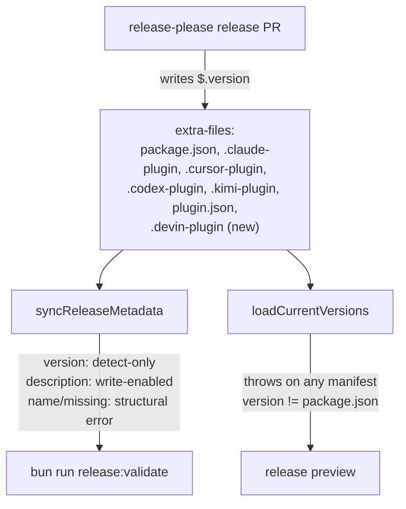

# Native Devin CLI Plugin Support - Plan

## Goal Capsule

- **Objective:** Ship native Devin CLI plugin support for Compound Engineering as a single upstream PR, following the Kimi Code CLI native-manifest pattern: committed manifest, release-automation parity, tests, README install docs, and a `docs/specs/devin.md` target spec.
- **Authority:** This plan, then the repo's active instructions and conventions (feature-branch PRs, conventional PR titles, release-owned versions never hand-bumped), then implementer judgment on details the plan leaves open.
- **Stop conditions:** Stop and surface if `bun test` or `bun run release:validate` fail for reasons unrelated to this work, or if implementation reveals Devin rejects the committed manifest shape.
- **Execution profile:** One branch, one PR. Test-first for the release-plumbing unit.

---

## Product Contract

### Summary

Devin CLI installs plugins natively from a GitHub repo, a git URL, or a local directory when the source contains a manifest at `.devin-plugin/plugin.json`; skills are consumed from the root `skills/` directory in the same layout this repo already ships. Devin therefore needs no Converter or Writer — it is a Native plugin surface, like Kimi Code CLI. The work is platform metadata, release validation, and docs.

### Problem Frame

Devin CLI users cannot install Compound Engineering today: `devin plugins install EveryInc/compound-engineering-plugin` fails because the repo ships no `.devin-plugin/plugin.json`. Everything else Devin needs is already in place — it loads `skills/<name>/SKILL.md` natively and parses the skills' Claude-style frontmatter (verified empirically against Devin CLI 3000.1.23, including `disable-model-invocation`). A manifest plus the repo's standard platform-parity plumbing closes the gap. The demand signal is concrete: a Devin CLI user requested the install and verified it end-to-end against a local checkout on 2026-07-05.

### Requirements

**Install surface**

- R1. `devin plugins install EveryInc/compound-engineering-plugin` (GitHub) and `devin plugins install <local-checkout>` succeed, registering every skill as a `/compound-engineering:<skill>` slash command.
- R2. The committed manifest carries only Devin-documented fields — the metadata subset (`name`, `version`, `description`, `author`, `homepage`, `repository`, `license`, `keywords`) of Devin's 11-field schema, omitting the unused dependency/governance lists — with `name: compound-engineering` and metadata matching the Claude manifest.
- R3. Skill content is unchanged — no `skills/` file is touched.

**Release automation parity**

- R4. Release automation owns the manifest's `version` via a release-please extra-files entry; no other writer bumps it.
- R5. `bun run release:validate` reports a structural error when the Devin manifest is missing or its `name` is wrong and reports version drift without auto-correcting; the underlying metadata sync (`bun run release:sync-metadata --write`) corrects `description` from the Claude manifest when run in write mode.
- R6. Release preview refuses to compute versions when the Devin manifest version drifts from `package.json` (same gate as the Kimi and Antigravity manifests).
- R7. Changes to `.devin-plugin/plugin.json` map to the `compound-engineering` release component (file-level mapping, matching the Kimi precedent).

**Documentation**

- R8. README gains a Devin CLI install section and a Local Development entry, including the session-start loading semantics (skills appear in the next Devin session, not mid-session).
- R9. `docs/specs/devin.md` documents the empirically verified format: manifest schema and location, skills consumption, skill-frontmatter compatibility (including the `allowed-tools` name mapping), dependency/governance fields, absence of a marketplace catalog, and open questions.

**Delivery**

- R10. The work lands as one upstream PR with a conventional title, green `bun test`, and green `bun run release:validate`.

### Scope Boundaries

- No `--to devin` converter target. Devin consumes the repo layout natively; there is nothing to convert and no user-owned install directory to write into. Revisit only if Devin documents a generated output format that native install cannot represent.
- No Devin marketplace catalog file. Devin has no marketplace concept; there is no catalog schema to ship or validate.
- No skill frontmatter changes for Devin (e.g., adding Devin tool names to `allowed-tools`). Unmapped tool names degrade gracefully in Devin (permission prompt instead of auto-approval), so this is not worth a cross-platform edit.

#### Deferred to Follow-Up Work

- Distinguishing malformed-JSON manifest errors from missing-manifest errors in `syncReleaseMetadata` — a cross-cutting change affecting all platform manifests equally, not Devin-specific.
- A `docs/solutions/` decision record for the Devin integration, captured after the work lands.
- Asking the Devin CLI team to map `Bash` -> `exec` in skill `allowed-tools` compatibility handling.

---

## Planning Contract

### Key Technical Decisions

- **Native plugin surface, not a converter target.** Devin installs the repo's existing layout directly, so user-facing support belongs in platform metadata, release validation, and docs — the same call recorded for Kimi in `docs/solutions/integrations/kimi-native-plugin-manifest-support.md`. A converter target would add ~17 files that convert nothing.
- **Manifest carries Devin-documented fields only.** Devin parses the manifest as a fixed field set (`name`, `version`, `description`, `author`, `homepage`, `repository`, `license`, `keywords`, `requiredPlugins`, `optionalPlugins`, `forbiddenPlugins`); tolerance of unknown fields is unverified. Unlike the Kimi and Codex manifests, there is no `skills` path field — Devin loads root `skills/` by convention — so the sync code performs no declared-skills-path validation for Devin.
- **Version detect-only, description write-enabled.** The sync block mirrors Kimi: version drift is reported but never written (release-please owns the write via extra-files — one write authority per field, per the version-drift recovery learning), while `description` syncs from the Claude manifest on write.
- **Missing manifest is a structural parity error**, phrased like the existing ones: names the missing path and the Claude manifest it must accompany.
- **Malformed JSON stays a hard throw**, matching every existing manifest read; special-casing Devin would diverge from the repo-wide pattern.

### High-Level Technical Design

Version authority and validation flow after the change — the Devin manifest joins the existing extra-files set:

### Assumptions

- Behavior is as verified against Devin CLI 3000.1.23 on macOS (2026-07-05): install requires `.devin-plugin/plugin.json`; skills load from root `skills/` at session start; `disable-model-invocation` and `user-invocable` frontmatter are honored; `allowed-tools` maps `Read`/`Grep`/`Glob`/`Edit` case-insensitively and silently drops unrecognized names, which then require permission prompts rather than being blocked. `devin plugins install`, `list`, and `info` were exercised live; `devin plugins update` semantics come from the CLI documentation.
- The root `plugin.json` (Antigravity manifest) does not conflict — Devin reads only `.devin-plugin/plugin.json`.

---

## Implementation Units

### U1. Commit the Devin manifest

- **Goal:** A `.devin-plugin/plugin.json` that makes the repo installable by Devin CLI from GitHub or a local checkout.
- **Requirements:** R1, R2, R3
- **Dependencies:** none
- **Files:** `.devin-plugin/plugin.json`
- **Approach:** Mirror `.claude-plugin/plugin.json` metadata restricted to Devin-documented fields: `name: compound-engineering`, `version` equal to the current release-owned version in `package.json`, canonical `description`, `author` (name only), `homepage`, `repository`, `license`, `keywords`. No `skills` field, no `$schema`, no dependency/governance fields.
- **Patterns to follow:** `.kimi-plugin/plugin.json` (metadata parity with the Claude manifest); `.codex-plugin/plugin.json`.
- **Test scenarios:** Test expectation: none — static platform metadata; correctness is enforced by U2's sync checks and U3's tests, plus the install smoke in Verification.
- **Execution note:** Packaging unit; prefer an install smoke check (`devin plugins install` against the checkout, then `devin plugins info compound-engineering`) over unit coverage where a Devin CLI is available.

### U2. Release plumbing for the Devin manifest

- **Goal:** Release automation and validation treat the Devin manifest exactly like the other root-component platform manifests.
- **Requirements:** R4, R5, R6, R7
- **Dependencies:** U1
- **Files:** `src/release/metadata.ts`, `src/release/components.ts`, `.github/release-please-config.json`
- **Approach:**
  - `metadata.ts`: add a `DevinPluginManifest` type (`name`, `version`, `description?`) and a sync block after the Kimi block — missing-manifest structural error naming the Claude manifest, `name` check against `compound-engineering`, detect-only version drift, write-enabled description sync. No skills-path validation, no marketplace checks.
  - `components.ts`: add `.devin-plugin/plugin.json` to the `compound-engineering` prefixes in the file-component map; read the Devin manifest in `loadCurrentVersions` and throw on version mismatch with `package.json`.
  - `release-please-config.json`: add a `{ "type": "json", "path": ".devin-plugin/plugin.json", "jsonpath": "$.version" }` entry to the root component's extra-files.
- **Patterns to follow:** The Kimi handling in `src/release/metadata.ts` (types, sync block, error phrasing) and `src/release/components.ts` (prefix entry, parity throw); existing extra-files entries in `.github/release-please-config.json`.
- **Test scenarios:** covered by U3 (written test-first against this unit).
- **Execution note:** Implement test-first with U3 — red on the new assertions, then green.

### U3. Parity tests

- **Goal:** The Devin manifest has the same regression coverage as the Kimi manifest, minus the marketplace and skills-field checks Devin's schema does not have.
- **Requirements:** R5, R6, R7
- **Dependencies:** U1 (fixture shape); pairs with U2
- **Files:** `tests/release-metadata.test.ts`, `tests/release-components.test.ts`, `tests/release-preview.test.ts`
- **Approach:** Extend `makeFixtureRoot()` with a `.devin-plugin/plugin.json` fixture; update the happy-path error filter to include `.devin-plugin`.
- **Test scenarios:**
  - `release-metadata`: Devin manifest version drifted from Claude -> drift reported and, with write enabled, the version value on disk stays unchanged (detect-only). Devin manifest deleted -> structural error containing `.devin-plugin/plugin.json is missing`. Devin manifest `name` set to another value -> structural error naming the expected `compound-engineering`. Devin `description` drifted -> corrected on write. Happy path fixture -> no `.devin-plugin` errors.
  - `release-components`: a change to `.devin-plugin/plugin.json` maps to the `compound-engineering` component and leaves the marketplace components empty.
  - `release-preview`: fixture with Devin manifest version out of step with `package.json` -> `loadCurrentVersions` rejects with an error naming `.devin-plugin/plugin.json` and the drifted version.
- **Patterns to follow:** The seven Kimi tests in `tests/release-metadata.test.ts`; for the name-mismatch and description-drift scenarios, which have no Kimi analogue, mirror the Codex name-mismatch and description-rewrite tests in the same file. The Kimi mapping test in `tests/release-components.test.ts` and the Kimi drift-rejection test in `tests/release-preview.test.ts`.

### U4. README install and local-development docs

- **Goal:** Devin CLI users can find install, verify, update, and local-development instructions in the README.
- **Requirements:** R8
- **Dependencies:** U1
- **Files:** `README.md`
- **Approach:** Add a `### Devin CLI` section after `### Kimi Code CLI` in Install: install from GitHub (`devin plugins install EveryInc/compound-engineering-plugin`), verify (`devin plugins list`, `devin plugins info compound-engineering`), update (`devin plugins update compound-engineering`), and the session-start note (skills load in the next Devin session). Note that a few skills declare Claude-style `allowed-tools` names Devin does not map, so some of their actions prompt for permission instead of auto-running (details in the spec). Add a `**Devin CLI**` entry to Local Development after the Kimi entry: local installs are linked to the checkout, so edits apply on the next session without reinstalling.
- **Patterns to follow:** The Kimi Code CLI README section and Local Development entry (native-manifest phrasing, code-fenced commands).
- **Test scenarios:** Test expectation: none — documentation.

### U5. Devin target spec

- **Goal:** A `docs/specs/devin.md` that lets future contributors extend Devin support without re-deriving the format.
- **Requirements:** R9
- **Dependencies:** none
- **Files:** `docs/specs/devin.md`
- **Approach:** Mirror `docs/specs/kimi.md` structure with a "Last verified" line (Devin CLI 3000.1.23, macOS, 2026-07-05, verified empirically against the binary and a live install). Sections: primary sources (CLI-shipped docs); plugin manifest (required location `.devin-plugin/plugin.json`, fixed 11-field schema including the unused `requiredPlugins`/`optionalPlugins`/`forbiddenPlugins` governance fields, no `skills` path field); skills consumption (root `skills/` by convention, `/compound-engineering:<skill>` namespacing, session-start loading); skill-frontmatter compatibility (`disable-model-invocation` and `user-invocable` honored; `allowed-tools` name mapping — `Read`/`Grep`/`Glob`/`Edit` map, `Bash`/`Write`/`Task`/`WebFetch`/`AskUserQuestion` and `Bash(...)` patterns drop; dropped names degrade to permission prompts, not hard restriction); install commands; no-marketplace note; instruction files (Devin reads the repo's `AGENTS.md`; no `DEVIN.md` shim); open questions (unknown-manifest-field tolerance, future `Bash` -> `exec` mapping).
- **Patterns to follow:** `docs/specs/kimi.md` (structure, field table, install-commands section); `docs/specs/antigravity.md` (empirical-verification framing, open-questions section).
- **Test scenarios:** Test expectation: none — documentation.

### U6. Upstream delivery

- **Goal:** The change lands as one reviewable upstream PR.
- **Requirements:** R10
- **Dependencies:** U1, U2, U3, U4, U5
- **Files:** none beyond the units above
- **Approach:** Single feature branch, one PR against `EveryInc/compound-engineering-plugin` `main` from the contributor's fork, conventional title of the `feat:` class. The PR body summarizes the native-manifest decision, links `docs/specs/devin.md`, and notes what was verified empirically. CI must pass the semantic PR-title check and the `test` status check.
- **Test scenarios:** Test expectation: none — delivery process; verified by CI gates.

---

## Verification Contract

| Gate | Command | Proves |
| --- | --- | --- |
| Full test suite | `bun test` | U2/U3 plumbing and all existing behavior |
| Release metadata parity | `bun run release:validate` | Devin manifest present, name correct, description in sync, version parity across all manifests |
| Install smoke (manual, needs Devin CLI) | `devin plugins install <checkout>` then `devin plugins info compound-engineering` | R1 — manifest accepted, all skills registered |
| CI on the PR | repo GitHub Actions | Conventional title, `test` status check |

The install smoke is environment-dependent; when no Devin CLI is available to the implementer, note that in the PR body and rely on the manifest-shape parity with the already-verified local install.

---

## Definition of Done

- R1-R10 satisfied; all six units complete.
- `bun test` and `bun run release:validate` pass locally.
- No file under `skills/` modified; no release-owned version hand-bumped (the new manifest's version equals the current `package.json` version at commit time).
- PR open against upstream `main` with a `feat:`-class title and CI green.
- No leftover experimental or abandoned-attempt code in the diff.

---

## Sources & Research

- `docs/solutions/integrations/kimi-native-plugin-manifest-support.md` — the decision precedent this plan mirrors.
- `docs/solutions/integrations/native-plugin-install-strategy.md` — native install preferred over converter targets.
- `docs/solutions/workflow/release-please-version-drift-recovery.md` — why version sync is detect-only and drift is expensive.
- `docs/solutions/conventions/antigravity-target-empirical-format-verification.md` — verify against the CLI binary, not docs; satisfied for Devin on 2026-07-05: install fails without `.devin-plugin/plugin.json` and succeeds with it (all skills registered); the manifest is parsed as a fixed 11-field set; skill frontmatter fields `disable-model-invocation`/`user-invocable`/`allowed-tools` observed in the binary's frontmatter schema and probed live.
- `docs/specs/kimi.md` — structural template for `docs/specs/devin.md`.
- Devin CLI plugin and skills documentation shipped with the CLI (plugins overview: install sources, manifest fields, governance lists; skills reference: frontmatter fields, dynamic content).
