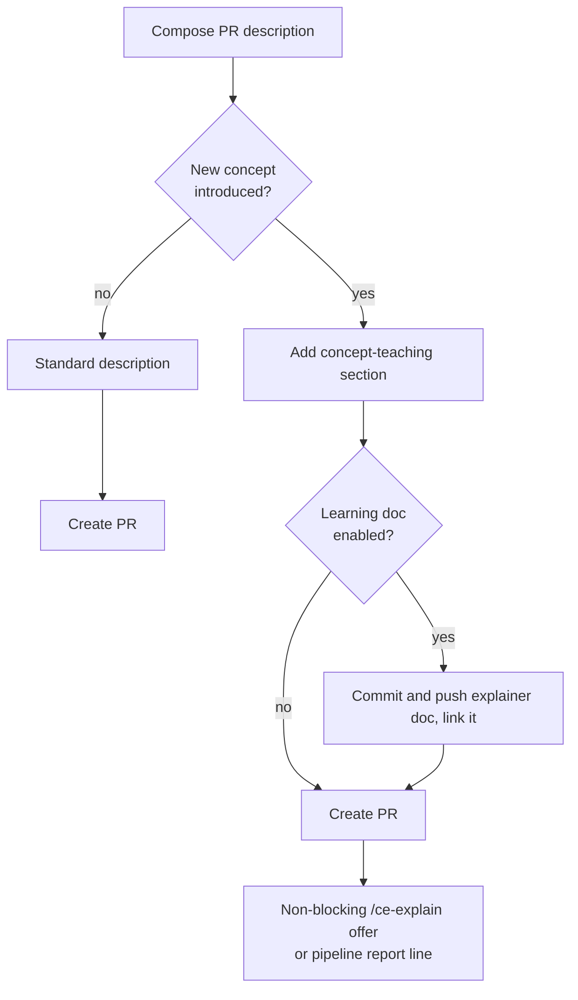
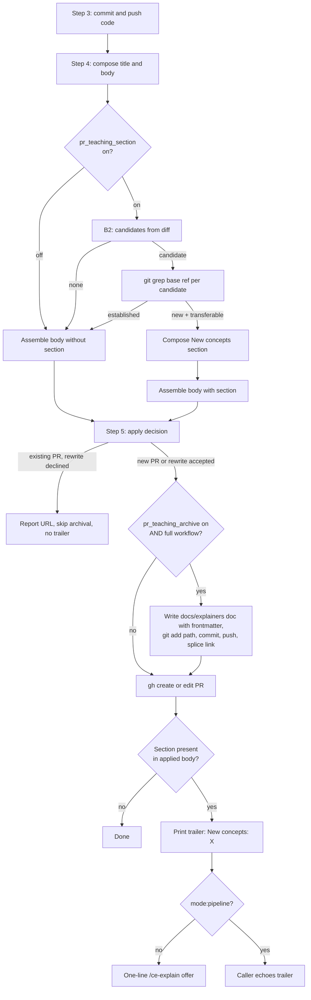
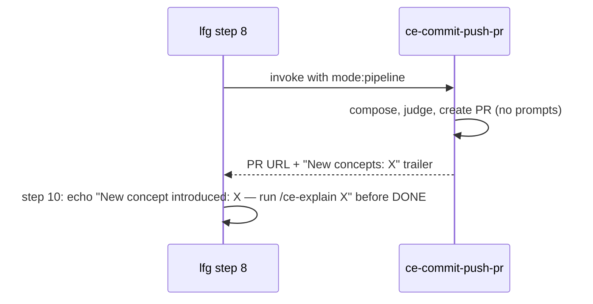

# PR Concept Teaching - Plan

## Goal Capsule

- **Objective:** Generated PR descriptions teach any concept the change newly introduces, so the author and other readers can understand and re-explain the PR without reading the diff.
- **Product authority:** The Product Contract below. The Planning Contract and Implementation Units define how it is built; the Product Contract wins on conflict.
- **Stop conditions:** Surface a blocker instead of guessing if implementation contradicts a pinned contract-test string, requires changing ce-explain, or forces a product-scope change beyond the preservation note below.
- **Execution profile:** Skill-prose work in this repo (markdown skill content + tests + docs). No runtime application code.
- **Open blockers:** None. All formerly open questions are resolved in the Planning Contract.

**Product Contract preservation:** changed — R9 gained a single-gate clarification sentence; the Dependencies bullet on the pipeline report contract now points at the defined contract (KTD-4); Outstanding Questions were resolved into Planning Contract decisions and the section removed. R1-R8, Actors, F1, and AE1-AE4 are unchanged.

---

## Product Contract

### Summary

When a PR introduces a concept new to the codebase — a pattern, technique, library, or domain idea — the generated PR description gains a "New concepts" section that teaches it: what the concept is, why it was chosen here, and a concrete example from this PR. After the PR ships, the flow offers `/ce-explain` on the concept for interactive learning, and a config-gated option archives the explainer as a durable doc in the repo.

### Problem Frame

Agent-driven development removed the learning that writing code by hand used to provide. Today's PR descriptions narrate what changed, and conditional visual aids illustrate complex changes, but nothing teaches the transferable concept a change leans on: when a PR brings infinite scroll, optimistic locking, or a state machine into a codebase that never had one, the author ships code they cannot confidently explain and readers either open the diff or stay ignorant. The cost lands on the human who wants to keep learning while agents write the code — they fall behind their own codebase and cannot pass the concept on to teammates.

### Key Decisions

- **Agent judgment decides when the section fires.** No fixed novelty rule; the composing agent weighs whether a reader of this repo would genuinely benefit from teaching. Chosen over a strict "new to codebase" rule (misses reader-relevant concepts) and explicit flagging (relies on remembering). The judgment criteria in the composing skill are the feature's main quality lever.
- **Detection happens at description time, not via pipeline-carried markers.** One skill owns the behavior, and PRs created outside the pipeline benefit equally. Concept markers recorded during planning/implementation were rejected as coupling not yet earned; revisit only if description-time judgment demonstrably misses concepts.
- **The teaching lands as a dedicated section, departing from the visual-aids inline precedent.** Visual aids sit inline at the point of relevance; teaching material reads as a standalone unit a reader seeks out or skips whole.
- **The post-ship `/ce-explain` offer is new, non-blocking surface.** No closing menu exists after PR creation today. Standalone runs get a one-line offer after the PR URL; autonomous pipeline runs get a line in the final report instead of an interactive prompt.
- **The durable learning doc is opt-in via config and gets its own browsable home.** Off by default; enabled during setup or per run. Explainer docs form a teaching library distinct from `docs/solutions/` (problem-to-fix records) and `CONCEPTS.md` (one-line glossary). Location resolved in KTD-6.
- **ce-explain machinery is borrowed, not shared.** The section adapts ce-explain's material-to-format guidance by duplication, since skills are self-contained units. The interactive parts (predict-then-reveal, exercises) stay in ce-explain, reached through the post-ship offer.

### Actors

- A1. PR author (primary) — ships agent-written changes and wants to understand and re-explain them without reading the diff.
- A2. PR readers — reviewers, teammates, and future maintainers who read the description instead of the code.
- A3. Composing agent — judges concept novelty while writing the PR description and produces the teaching content.

### Requirements

**Teaching section**

- R1. When composing a PR description, the agent judges whether the change introduces at least one concept — pattern, technique, library, or domain idea — that a reader of this repo would plausibly not know; only then does it add the concept-teaching section. The section is omitted unless the concept is both new to this codebase in this PR and transferable beyond it; routine use of already-established repo patterns, ordinary refactors, and dependency bumps never qualify.
- R2. The section teaches each concept well enough that a reader who never opens the diff can understand it and explain it to someone else: what the concept is, why it was chosen here over the obvious alternative, and at least one concrete example drawn from this PR's behavior.
- R3. The section carries only what the diff cannot show, and its depth scales with the concept's difficulty, consistent with the existing size-scaled description philosophy.
- R4. PRs that introduce no new concept get no section and no placeholder; absence is the common case.
- R5. The behavior lives in the single skill that composes PR descriptions, so the autonomous pipeline and standalone PR creation inherit it identically.

**Post-ship learning offer**

- R6. After the PR is created, the flow offers to run `/ce-explain` on the newly introduced concept(s). In autonomous pipeline runs the offer must not block: it appears as a line in the final report rather than an interactive prompt.

**Durable learning doc (config-gated)**

- R7. When the learning-doc option is enabled, the concept explainer is also written as a standalone doc in the repo's teaching library and linked from the PR description, so concepts accumulate and stay browsable. The explainer doc is committed and pushed within the same shipping flow before the PR link is applied, and R7 applies only to full-workflow runs — description-only and description-update runs never write repo files.
- R8. The learning-doc option is off by default; users can enable it during setup or override it per run.

**Configuration**

- R9. The concept-teaching section itself can be disabled per repo via the same config file, default on, so a team whose norms reject teaching prose can turn it off without losing the rest of the generated description. The section toggle is the single gate: turning it off also disables novelty judgment, the post-ship offer, and learning-doc archival.

### Key Flows

- F1. Shipping a PR that introduces a new concept
  - **Trigger:** PR description composition begins, in the pipeline or standalone.
  - **Actors:** A1, A3.
  - **Steps:** The agent reviews the full commit range; judges concept novelty (R1); writes the teaching section (R2, R3); if the learning doc is enabled, writes, commits, and pushes the explainer doc and links it (R7); creates the PR; because a concept section was added, fires the non-blocking `/ce-explain` offer or report line (R6).
  - **Outcome:** A reader understands the concept from the description alone (A2), and the author can re-explain it (A1).

### Acceptance Examples

- AE1. **Covers R1, R2.** Given a PR that introduces infinite scroll to an app that previously paginated, when the description is composed, then it contains a section teaching infinite scroll: what it is, why it fits here over pagination, and an example of how this PR's feed now behaves.
- AE2. **Covers R4.** Given a PR that renames a function and updates its call sites, when the description is composed, then no concept section appears.
- AE3. **Covers R6.** Given an autonomous pipeline run whose PR introduced a new concept, when the pipeline finishes, then the final report names the concept and points to `/ce-explain` without pausing the run.
- AE4. **Covers R7, R8.** Given the learning-doc option is at its default (disabled), when a concept section is written, then no explainer file is created; given the option is enabled, then the explainer doc is created and the PR description links to it.

### Scope Boundaries

- Commit messages stay unchanged — no teaching prose and no concept breadcrumbs in commits.
- No pipeline-carried concept markers from planning or implementation steps.
- No interactive teaching inside the PR description itself — predict-then-reveal and exercises remain ce-explain's job.
- No changes to ce-explain.

### Dependencies / Assumptions

- PR descriptions are composed in one place — `skills/ce-commit-push-pr` — and the `lfg` pipeline delegates to it, so a single change covers both surfaces (verified 2026-07-07).
- Satisfying R1 requires the composing skill to gather repo-state evidence beyond the commit range — the current composition steps read only the commit log and diff over the PR range — so it can check whether a candidate concept already appears in the codebase before this PR.
- No post-PR closing menu exists today; the `/ce-explain` offer and report line are new surface, not additions to an existing menu (verified).
- R6's pipeline variant is not covered by the single-composition-point change: `lfg` ends with a bare completion promise today, so the pipeline contract is defined by KTD-4 (`mode:pipeline` token, `New concepts:` trailer, pre-DONE echo) and includes a small `skills/lfg` touch.
- Per-repo config lives at `.compound-engineering/config.local.yaml`; setup scaffolds the file from a template and each skill owns its keys. The teaching toggles follow that pattern.
- The config file is gitignored and per-checkout, so learning-doc accumulation is best-effort per enabled checkout (fresh worktrees do not inherit it) rather than a team-level guarantee; accepted for v1.
- Assumption: the author-side learning need generalizes beyond the requesting user, grounded in ce-explain's premise that agent-driven development removed hands-on learning.

---

## Planning Contract

### Key Technical Decisions

- KTD-1. **The composer is a new Step B2 in `skills/ce-commit-push-pr/references/pr-description-writing.md`**, between B1 (related references) and C (body assembly), mirroring B1's proven shape: gather candidates, classify, strict negative constraints, Bad/Good example pair. The rendered section uses the heading `## New concepts` and slots into Step C's assembly-order sentence after the test plan and before the evidence block/badge — teaching is supplementary reading, so it sits late. The load-bearing trigger (judge novelty, config gate, load the reference) stays inline in SKILL.md Step 4; composition detail stays in the reference (per `docs/solutions/skill-design/post-menu-routing-belongs-inline.md`).
- KTD-2. **Novelty is checked against the base ref, never the working tree.** Candidate concepts come from the diff first (zero extra tool calls when none surface — R4's common case); each candidate is then checked with `git grep` against `<base-remote>/<base>` (Pre-A already resolves that ref). Grepping the working tree would find the PR's own code and silently conclude every concept is established. In the `gh`-fallback path (fork, no local base refs), judge from diff context alone and lean conservative — do not fire unless the concept is clearly new.
- KTD-3. **The section is additive to the sized base description.** It is exempt from Step A's small-PR rows (a 30-line PR can carry a heavy concept), capped at roughly 10-25 lines per concept, and teaches at most 2 concepts per PR — when more qualify, pick the most load-bearing and name the rest in one sentence.
- KTD-4. **The pipeline seam is a `mode:pipeline` token plus a machine-readable trailer.** `ce-commit-push-pr` gains `mode:pipeline` (following the `ce-test-browser`/`ce-code-review` token convention): it suppresses every blocking ask in the skill — Step 5's existing-PR rewrite question defaults to not rewriting, and every other suppressed ask takes its conservative documented default (keep the current branch; on an unresolvable base, stop and report rather than guess). Whenever a concept section is present in the created or updated PR description, Step 5 prints a trailer line after the PR URL in both modes: `New concepts: <name>[, <name>]` — no trailer when the rewrite was declined or no PR exists. Interactive runs follow it with the one-line offer ("run /ce-explain <name> to go deeper"); `lfg` passes `mode:pipeline` at its step 8 callsite and echoes the trailer as a pre-DONE report line. Both sides are pinned by contract tests (per `docs/solutions/skill-design/beta-promotion-orchestration-contract.md`: hardcode the mode at the callsite, enforce with a test).
- KTD-5. **Config keys are `pr_teaching_section` (default `true`) and `pr_teaching_archive` (default `false`)** in `.compound-engineering/config.local.yaml`, documented as commented examples in `skills/ce-setup/references/config-template.yaml` under a `# --- PR concept teaching (ce-commit-push-pr) ---` header. Resolution copies the established prose pattern (resolve repo root, native file read, **active non-commented key only** — commented template examples must not match, a documented past bug class). A per-run override token `archive:on|off` follows the `confirm:auto` precedent, grounded in R8's explicit per-run grant; the section toggle is per-repo config only, per R9. The per-checkout limitation (worktrees don't inherit gitignored config) is named in the template comment.
- KTD-6. **The teaching library is `docs/explainers/YYYY-MM-DD-<concept-slug>.md`** — named for the `CONCEPTS.md` "Explainer" term and defined as the repo's single shared explainer home, which ce-explain's reserved future-library hook adopts later. This resolves the review's two-divergent-generators concern by deciding the library location once, in one place. The doc is markdown-only and carries ce-explain's stable explainer frontmatter (`title`, `date`, `input_shape: concept`, `subject`) so the shared library stays indexable by both generators. It is committed with an explicit `git add <path>` (never `git add -A`), message `docs(explainer): teach <concept>`, and pushed inside Step 5's apply path — after the apply decision is confirmed (new-PR create, or existing-PR rewrite accepted) and immediately before the `gh` call — so the PR-body link resolves and a declined rewrite skips archival entirely, leaving no stray unlinked commit. The link is a head-branch blob URL (post-merge the doc lives in the default branch; a stale blob link is accepted). If the target path is gitignored in the user's repo, skip archival with a one-line warning rather than forcing `git add -f`.
- KTD-7. **The teaching-format guidance is a ~20-line block duplicated inline into Step B2** from `skills/ce-explain/references/explainer-markdown.md` (the material-to-format rows: concept/architecture → mermaid, behavior → code-with-why, comparison → table + verdict; plus the shaping rules: lead with the point, dense not long, diagrams complement prose, no ASCII art). The source is 31 lines — too small for a reference file, and cross-skill references are forbidden. Single copy, so no parity test; drift from ce-explain's copy is accepted and revisited only if that guidance changes materially.
- KTD-8. **Description-update runs preserve, never re-judge.** An existing `## New concepts` section and any explainer-doc link are preserved verbatim on rewrite (same rule as `## Demo`/`## Screenshots`), unless the user's stated focus asks to refresh the concepts. Description-only and description-update modes never write repo files and never fire the offer.

### High-Level Technical Design

Composition and archival transitions inside ce-commit-push-pr (additions in the two decision diamonds and the archival branch):

The lfg seam:

### Assumptions

- R7/R8 remain in scope per the user's explicit dialogue decision; the doc-review recommendation to cut them is answered by KTD-6's shared-library reconciliation rather than a scope cut.
- `lfg` has no report surface today; the pre-DONE echo line creates one, minimal by design.
- Judgment quality (R1/R4) is validated through skill-creator evals, not runtime tests — plugin skill definitions cache at session start, so in-session invocation tests pre-edit content.

### System-Wide Impact

- Other callers of ce-commit-push-pr (`ce-debug`'s ship path, `ce-work`'s shipping tail) inherit the section and the one-line trailer/offer automatically. The offer is a single line, so stacking with ce-debug's own post-PR learning-capture offer is acceptable; neither blocks.
- `tests/commit-push-pr-contract.test.ts` pins existing Step B1 and SKILL.md strings — new content must not disturb them.
- No new skill is added: `tests/release-metadata.test.ts` skill count and marketplace metadata are unchanged; `bun run release:validate` still applies because skill content changes.

---

## Implementation Units

### U1. Concept judgment and section composition (Step B2)

- **Goal:** `references/pr-description-writing.md` gains Step B2 "New concepts" and Step C places the section in the assembly order.
- **Requirements:** R1, R2, R3, R4; AE1, AE2; KTD-1, KTD-2, KTD-3, KTD-7, KTD-8.
- **Dependencies:** none.
- **Files:** `skills/ce-commit-push-pr/references/pr-description-writing.md`.
- **Approach:** Mirror B1's shape: gather candidate concepts from the diff → per-candidate `git grep` against `<base-remote>/<base>` (never the working tree; name the self-detection trap explicitly) → negative constraints (established repo patterns, ordinary refactors, dependency bumps never qualify; when in doubt, omit — absence is the common case) → one Bad/Good example pair → teaching shape (what it is, why chosen here over the obvious alternative, one concrete example from this PR, when it does not apply) → the KTD-7 condensed format block → per-concept ~10-25 line cap, max 2 concepts → `gh`-fallback rule (diff-context-only, conservative) → update-mode preservation rule (KTD-8). Add "New concepts section when Step B2 produced one" to Step C's ordering sentence after the test plan. Do not touch the B1 strings pinned by `tests/commit-push-pr-contract.test.ts`.
- **Test scenarios:** Pinned-string assertions land in U6. Behavioral: skill-creator eval cases — AE2 rename-only PR (no section), dependency-bump PR (no section), PR reusing an established repo pattern (no section), AE1 infinite-scroll PR (section with what/why/example). Test expectation for this unit alone: none — prose content, validated via U6 pins plus the Verification Contract eval.
- **Verification:** `bun test` green; Step B2 heading and base-ref grep rule present; Step C ordering sentence updated.

### U2. SKILL.md wiring: config gate, mode:pipeline, offer and trailer

- **Goal:** `SKILL.md` resolves the two config keys, carries the inline judgment trigger, defines `mode:pipeline`, and emits the offer/trailer in Step 5.
- **Requirements:** R5, R6, R8, R9; KTD-4, KTD-5.
- **Dependencies:** U1.
- **Files:** `skills/ce-commit-push-pr/SKILL.md`.
- **Approach:** Step 4 gains the config resolution (copy the established active-non-commented-key prose; defaults: section on, archive off; per-run token `archive:on|off` consumed like `mode:`) and the inline trigger: when the section toggle is on, judge novelty per Step B2 of the reference — R9's single gate means toggle-off skips judgment, section, offer, and archival. New "Mode" prose defines `mode:pipeline`: suppress every blocking ask (Step 5's existing-PR rewrite question defaults to not rewriting; other asks take their conservative documented defaults), never prompt. Step 5: after reporting the URL, when a section is present in the applied body print `New concepts: <name>[, <name>]`; in interactive mode follow with one line: `Run /ce-explain <name> to go deeper.` Add a frontmatter `argument-hint` (the skill has none today) listing the new tokens.
- **Test scenarios:** U6 pins the trailer format, mode token, and config key names. Test expectation for this unit alone: none — prose content, validated via U6 pins.
- **Verification:** `bun test` green; `bun run release:validate` green (frontmatter changed).

### U3. Explainer archival transition

- **Goal:** When `pr_teaching_archive` is on in a full-workflow run with a composed section, the explainer doc lands in `docs/explainers/` inside Step 5's apply path, linked from the section.
- **Requirements:** R7, R8; AE4; KTD-5, KTD-6.
- **Dependencies:** U1, U2.
- **Files:** `skills/ce-commit-push-pr/SKILL.md`, `skills/ce-commit-push-pr/references/pr-description-writing.md`.
- **Approach:** Explicit state-machine transitions (per `docs/solutions/skill-design/git-workflow-skills-need-explicit-state-machines.md`), executed only after Step 5's apply decision is confirmed (new-PR create, or existing-PR rewrite accepted) and immediately before the `gh` call — a declined rewrite skips archival entirely: toggle on → write `docs/explainers/YYYY-MM-DD-<concept-slug>.md` (mkdir as needed) carrying ce-explain's explainer frontmatter (`title`, `date`, `input_shape: concept`, `subject`) → `git add <path>` (never `-A`; if the path is gitignored, print a one-line warning and skip archival) → commit `docs(explainer): teach <concept>` → push → splice the head-branch blob URL into the section body before applying. Each transition branches on its command result; a failed doc write must not strand the flow between commit and PR — on failure, warn and continue to PR creation without the link. Description-only/update runs never enter this transition.
- **Execution note:** Write each transition as command-then-branch, not broad prose; this skill has a regression history from prose-described git flow.
- **Test scenarios:** U6 pins the `docs/explainers/` path convention and the gitignored-path guard sentence. Behavioral eval: AE4 both arms (default off → no file; on → file + link).
- **Verification:** `bun test` green; archival prose present with all three guards (toggle, mode, gitignore).

### U4. lfg pipeline seam

- **Goal:** `lfg` invokes ce-commit-push-pr non-interactively and surfaces the concept line in its completion output.
- **Requirements:** R6; AE3; KTD-4.
- **Dependencies:** U2.
- **Files:** `skills/lfg/SKILL.md`.
- **Approach:** Step 8 invocation becomes "Invoke the `ce-commit-push-pr` skill with `mode:pipeline`." Step 10 gains one sentence: when ce-commit-push-pr printed a `New concepts:` trailer, echo `New concept introduced: <name> — run /ce-explain <name> to go deeper.` before the DONE promise.
- **Test scenarios:** U6 pins both strings (callsite token, echo rule).
- **Verification:** `bun test` green.

### U5. Config template entries

- **Goal:** `config-template.yaml` documents both keys so ce-setup scaffolds them.
- **Requirements:** R8, R9; KTD-5.
- **Dependencies:** none.
- **Files:** `skills/ce-setup/references/config-template.yaml`.
- **Approach:** New `# --- PR concept teaching (ce-commit-push-pr) ---` section with commented examples `# pr_teaching_section: false   # true | false (default: true)` and `# pr_teaching_archive: true    # true | false (default: false; full-workflow runs only)`, plus a comment noting per-checkout scope (worktrees don't inherit gitignored config).
- **Test scenarios:** Test expectation: none — commented template content; key names pinned in U6.
- **Verification:** Template parses as YAML (`cat ... | python3 -c "import yaml,sys; yaml.safe_load(sys.stdin)"` or equivalent); `bun run release:validate` green.

### U6. Contract tests

- **Goal:** The cross-skill seam and new contracts are pinned so drift breaks the build.
- **Requirements:** R5, R6; KTD-4, KTD-5, KTD-6.
- **Dependencies:** U1, U2, U3, U4, U5.
- **Files:** `tests/commit-push-pr-contract.test.ts`, `tests/pipeline-review-contract.test.ts`.
- **Approach:** Extend `commit-push-pr-contract.test.ts` with a new describe block pinning: SKILL.md contains `mode:pipeline` and the trailer format `New concepts:`; the reference contains Step B2, the base-ref grep rule, the `docs/explainers/` path convention, and the archived-explainer frontmatter invariant (`input_shape`); `config-template.yaml` contains both key names. Add an lfg-seam parity block (modeled on the ce-work seam at `tests/pipeline-review-contract.test.ts:183-249`) asserting lfg's step 8 passes `mode:pipeline` and lfg contains the trailer-echo rule.
- **Test scenarios:** Happy path — all assertions pass on the new content. Drift path — each assertion fails when its pinned string is removed (self-evident from the assertion style).
- **Verification:** `bun test` green; new assertions fail if U1-U5 strings are reverted (spot-check one by inspection).

### U7. Docs

- **Goal:** User-facing docs reflect the new behavior.
- **Requirements:** R1-R9 (documentation of).
- **Dependencies:** U1, U2, U3, U4.
- **Files:** `docs/skills/ce-commit-push-pr.md`, `README.md`.
- **Approach:** ce-commit-push-pr page: add a Solution bullet and a "What Makes It Novel" subsection for the concept-teaching section, extend the argument/reference table with `mode:pipeline` and the `archive:` token, add an FAQ entry (why no section on my PR — the negative constraint), and list `lfg` under "Use as Part of the Workflow". README: adjust the ce-commit-push-pr inventory row phrase to mention concept teaching.
- **Test scenarios:** Test expectation: none — documentation.
- **Verification:** Docs mention the two config keys, the mode token, and `docs/explainers/`.

---

## Verification Contract

| Gate | Command / method | Applies to |
|---|---|---|
| Full test suite | `bun test` | U1-U6 |
| Release consistency | `bun run release:validate` | U2, U5 (frontmatter/template changes) |
| Template YAML validity | parse `skills/ce-setup/references/config-template.yaml` | U5 |
| Behavioral judgment eval | skill-creator eval of Step B2 on four cases: AE2 rename, dependency bump, established-pattern reuse, AE1 true positive; plus AE4 both arms | U1, U3 |

The behavioral eval is required because plugin skill prose caches at session start — in-session invocation tests pre-edit content. When executed inside an automated pipeline, run the eval via a fresh generic subagent seeded with the edited reference content, and record the four verdicts as verification evidence.

---

## Definition of Done

- U1-U7 landed; `bun test` and `bun run release:validate` green.
- Behavioral eval evidence recorded: the four judgment cases produce section/no-section as AE1/AE2 and the negative constraint dictate; AE4 both arms verified.
- AE3 traceable: the lfg seam strings are pinned by U6.
- Docs (U7) updated; no other README/marketplace surfaces claim behavior that changed.
- No abandoned experimental edits remain in the diff; the Product Contract preservation note at the top is accurate.

---

## Sources / Research

- `skills/ce-commit-push-pr/SKILL.md` — Step 4 evidence-decision precedent for a pre-composition judgment gate (lines ~90-98); Step 5 report path; mode dispatch prose at lines ~10-14.
- `skills/ce-commit-push-pr/references/pr-description-writing.md` — steps Pre-A/A/B/B1/C/D; Step C assembly-order sentence (~line 119); the visual-aids conditional paragraph (~line 125) as condition-style calibration; B1 as the structural template for B2.
- `skills/lfg/SKILL.md` — step 8 delegation (~lines 70-72), step 10 DONE promise (~line 125); mode-token conventions at lines 18, 30, 68.
- `skills/ce-brainstorm/SKILL.md` (~lines 62-73) — the config resolution prose to copy, including the active-non-commented-key warning.
- `skills/ce-setup/references/config-template.yaml` — commented-example style, section headers, per-key comment grammar.
- `skills/ce-explain/references/explainer-markdown.md` (31 lines) — the material-to-format mapping and shaping rules KTD-7 condenses.
- `tests/commit-push-pr-contract.test.ts` — existing pinned strings to preserve; natural home for new pins. `tests/pipeline-review-contract.test.ts:183-249` — the lfg seam parity model.
- `docs/solutions/best-practices/conditional-visual-aids-in-generated-documents.md` — content-pattern triggers + explicit skip criteria; the litigated precedent for conditional PR-description sections.
- `docs/solutions/skill-design/git-workflow-skills-need-explicit-state-machines.md` — command-then-branch transitions for U3. `docs/solutions/skill-design/post-menu-routing-belongs-inline.md` — offer inline in SKILL.md, detail in the reference. `docs/solutions/skill-design/beta-promotion-orchestration-contract.md` — hardcode the mode at the callsite + contract test.
- `docs/plans/2026-03-29-003-feat-pr-description-visual-aids-plan.md` — precedent for conditional PR-description enrichment; its inline-placement rule is deliberately departed from here.

---

## Deferred / Open Questions

### From 2026-07-07 review

- **Teaching library preempts ce-explain's deferred library decision** — Key Decisions / Requirements R7-R8 (P2, product-lens, confidence 75). Resolved during planning: R7/R8 stay per the user's explicit scope decision, and KTD-6 answers the divergence concern by making `docs/explainers/` the repo's single shared explainer home — the same location ce-explain's reserved library hook adopts later, so the library question is decided once, in one place.
