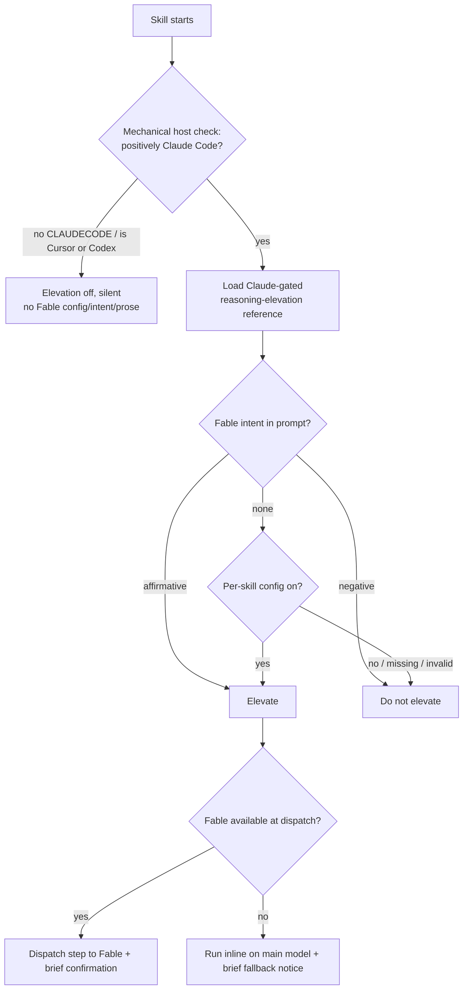
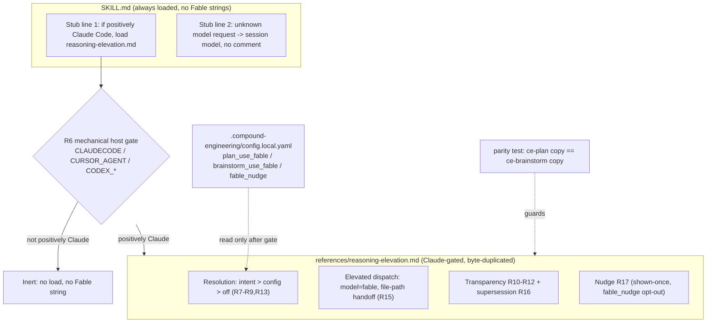

# Claude Code Fable Elevation - Plan

## Goal Capsule

- **Objective:** Let `ce-plan` and `ce-brainstorm` get Fable-quality reasoning on their highest-judgment steps even when the user's Claude Code session runs a different main model — by dispatching those steps to Fable subagents rather than requiring the user to switch their whole session.
- **Product authority:** Trevin (repo owner).
- **Open blockers:** None. Scope and activation are resolved; remaining items are implementation details deferred to planning.

---

## Product Contract

### Summary

Add a Claude-Code-only capability that elevates the interpretation-and-authoring steps of `ce-plan` and `ce-brainstorm` to Fable via subagent dispatch, so a user on a cheaper main model still gets a high-reasoning plan or set of approaches. It activates from natural prompt intent ("use fable") or a per-skill config default, gates on a mechanical harness check, and falls back to the main model when Fable isn't available — silently on non-Claude-Code harnesses (R10), with a brief notice inside Claude Code (R12). A one-time discoverability tip points unaware users to the option (R17). **v1 covers ce-plan authoring (R1/R2) and ce-brainstorm approach generation (R3); the integration-check consult (R4) is deferred to a later increment.**

### Problem Frame

Fable's high-reasoning output is most valuable in the upfront stages — planning and brainstorming — where the quality of interpretation and authoring compounds through everything downstream. But not every user keeps Fable as their main Claude Code model, and the value is lost the moment they're on something cheaper.

This is a Claude-Code-specific problem. On Codex the latest model is included in billing, so most users already sit on the top model and need nothing. On Claude Code, the main model is a deliberate per-session choice a user often keeps cheaper for cost or speed — and switching the whole session to Fable just to plan is friction they won't reliably take.

The Anthropic advisor-tool pattern points at the fix: a main agent can consult a stronger model as a tool for a bounded, high-leverage sub-problem, then continue. The catch is that a brainstorm's value lives partly in turn-by-turn conversational judgment, which can't be dispatched without crippling latency. So the reachable win is the *batch reasoning bursts* — interpreting research, authoring the plan, generating approaches, checking integration — not the live dialogue.

### Key Decisions

- **Gather cheap, reason expensive.** The research/gathering subagents (repo-research-analyst, learnings-researcher, web-researcher) stay on their current low tiers — the model-gap on "quote the relevant code" is small. Elevation targets only the steps where the weak-vs-strong reasoning gap is large: interpretation and authoring.
- **Elevation is Claude-Code-only and gated mechanically, not by prose.** The first ordered step is a mechanical host check (the `ce-code-review` env-var pattern: positively identify `CLAUDECODE`; treat `CURSOR_AGENT` / Codex signals as a hard stop). Only on positive Claude identification does any Fable config read, intent parse, or dispatch instruction become active, and all Fable/elevation prose lives in a Claude-gated `references/reasoning-elevation.md` loaded only on the Claude branch — so it never rides in a Codex/Cursor context. There is **no cross-harness "elevate tier"**: on every other harness elevation does not exist and the ceiling/inline rules apply unchanged. (This reverses an earlier "elevate tier named per harness" framing. Per-harness naming preserved the no-hardcoded-model convention, but the cross-harness peer review — Codex and Cursor independently — showed it invites a non-Claude agent to resolve "elevate" to *its own* top model instead of doing nothing. The no-op has to be an enforced gate, not an obedience-to-prose promise.)
- **The dispatch reproduces full context, not a lossy summary.** The elevated subagent receives the main agent's working context — accumulated dialogue/decisions plus the grounding dossier — not a compressed brief. The core bet only holds if Fable reasons on the same information the inline main model would have; a serialized summary that drops nuance can make a stronger model on a thin brief lose to a weaker model with full context.
- **The live dialogue stays on the main model.** Turn-by-turn question generation can't be dispatched to a subagent without per-turn latency that destroys the conversation. Elevation covers batch bursts only; a user who wants Fable driving the actual back-and-forth must run Fable as their session model.
- **Activate on prompt intent, not keyword match.** The agent reasons over intent ("use fable", "get fable help", "have fable plan this"), so natural phrasing works and a passing mention of the word "fable" as subject matter does not misfire.
- **Per-skill opt-in config, default off.** Plan and brainstorm are independently toggled — a user may want Fable authoring their plans but not their brainstorms. Fable is slower and costs more, so the default is off; the user opts in.
- **Transparency is asymmetric.** Elevation is surfaced where the signal is actionable and silent where it would be noise (full contract in Requirements R10–R12).
- **A one-time nudge closes the default-off discoverability paradox.** The users who benefit most — those who don't think about model choice — would never find a default-off config key or know to type "use fable." So in Claude Code, when a run completes without elevation active, surface a one-line tip that the option exists: shown at most once (persisted), suppressible via config, never in pipeline runs, and never when the session is already on Fable. The tip lives in the Claude-gated reference, so it never reaches Codex/Cursor. It complements the feature rather than replacing it — the dispatch keeps the gather-cheap/reason-expensive advantage a session switch can't give.
- **No auto-propagation across the ce-brainstorm → ce-plan handoff.** Each skill re-resolves its own activation (config + this run's prompt), matching how output-format already behaves across that handoff. A brainstorm run with Fable does not silently force the downstream plan onto Fable.

### Requirements

**Elevated reasoning steps**

- R1. In `ce-plan`, authoring the plan (sequencing, risks, verification design, trade-offs) is dispatched to Fable when elevation is active for plan.
- R2. In `ce-plan`, interpreting research findings into a chosen direction is folded into the same Fable dispatch as R1 — one interpret-then-author call with full context, not two round-trips.
- R3. In `ce-brainstorm`, approach generation (Phase 2) is dispatched to Fable when elevation is active for brainstorm.
- R4. *(Deferred past v1.)* In `ce-brainstorm`, the Phase 1.3 integration check runs as a Fable advisor consult when elevation is active for brainstorm — the main agent hands Fable the accumulated decisions and asks for non-obvious combination consequences, then probes the user with what returns. Deferred because it is a mid-dialogue blocking consult with an unresolved interactive-latency question (Outstanding Questions); it ships only after the AE7 delta clears for the brainstorm side.
- R5. Research and gathering subagents are not elevated; they remain on their current tiers regardless of elevation state.
- R15. The elevated dispatch (R1–R4) reproduces the main agent's full working context by passing **file paths the Fable subagent reads itself** — the grounding dossier path, and a checkpointed decisions/transcript file — not a main-model re-narration. Re-narration is forbidden: the main model's default tendency is to compress, so a prose "brief" is the lossy-summary failure the quality bet cannot absorb. Mechanize the handoff the same way the harness no-op is mechanized, rather than trusting prose the weakest actor executes.

**Activation and precedence**

- R6. Elevation is gated by a mechanical host check as the **first ordered step**: positively identify Claude Code (e.g. `CLAUDECODE`) and treat known non-Claude signals (`CURSOR_AGENT`, Codex markers) as a hard stop. Only on positive Claude identification does the skill read Fable config keys, parse Fable intent, load elevation instructions, or emit any Fable string. On anything else, elevation is false and fully inert — no Fable config read, no intent parse, no Fable text.
- R14. All Fable/elevation instructions live in a Claude-gated reference (`references/reasoning-elevation.md` in each consuming skill), loaded only after R6's positive-Claude check. The always-loaded `SKILL.md` stub carries two harness-neutral, model-name-free lines: (1) "If positively Claude Code, load `references/reasoning-elevation.md`"; (2) "If the prompt requests a specific model this skill does not recognize on this harness, proceed on the session model without further comment." Line (2) exists because R6 gates the skill's own behavior but cannot gate the agent from its own prompt — a "use fable" mention on Codex/Cursor has already been read, so the stub gives the off-Claude agent explicit harmless guidance instead of leaving it to guess (which risks resolving "fable" to its own top model — the residual leak R6 alone cannot close). No Fable *instructions* ship in a non-Claude context; the two neutral stub lines name no model.
- R7. Activation resolves by precedence: in-prompt intent for this run > per-skill config default > off (evaluated only after R6 passes).
- R8. Prompt activation is by reasoned intent, not literal keyword match. Affirmative intent ("use fable", "get fable help") activates; negative intent ("don't use fable", "no fable") deactivates even when the config default is on. Because "fable" is a common English word, a misfire acceptance example (AE6) guards the dictionary-word collision case.
- R9. Config exposes two independent per-skill keys, one for plan and one for brainstorm, so either can be enabled without the other. Missing, commented, or invalid values fall through to off — the same tolerant resolution the existing output-format keys use.
- R13. In pipeline / `disable-model-invocation` runs (e.g. LFG) there is no prompt, so activation comes from the per-skill config alone; if that config is on, elevation fires — but strictly subordinate to R6's mechanical gate, so a config file copied to a non-Claude harness never fires it.
- R16. The Claude-gated `reasoning-elevation.md` states explicitly that, when elevation is active, it supersedes `model-tiers.md`'s ceiling-tier "nothing is dispatched" rule for the elevated steps. Without this, the elevated Claude agent holds two contradictory active instructions about whether Phase 2 / synthesis / plan authoring may be dispatched.

**Transparency and degradation**

- R10. On a non-Claude-Code harness, **config-driven** elevation is a structurally silent no-op — the R6 gate stops before any Fable config read or prose load, guaranteed by mechanism, not by the agent choosing silence (R6, R14). A Fable mention in the user's *own prompt* cannot be structurally suppressed (the agent already read it); the R14 stub line (2) makes the off-Claude agent proceed on the session model without resolving or dispatching Fable and without error noise. So the guarantee is exact for config activation and best-effort-but-model-name-free for prompt mentions — AE4 tests both honestly.
- R11. In Claude Code, when elevation fires, the agent surfaces a brief confirmation that Fable is handling that step, so the user knows the boost happened.
- R12. In Claude Code, when Fable is requested but unavailable (a plan without Fable access, or a failed dispatch), the step runs inline on the main model and the agent surfaces a brief fallback notice. Elevation is never a correctness dependency and never blocks the workflow.
- R17. In Claude Code, when a `ce-plan` or `ce-brainstorm` run completes with elevation NOT active (no prompt intent, per-skill config off) and the session is not already on Fable, the skill surfaces a one-line tip that Fable elevation is available. Shown at most once per user (persisted "seen" marker) and silenced by a `fable_nudge: false` config opt-out; never shown when elevation was active (redundant), in pipeline / `disable-model-invocation` runs (no reader), or on a non-Claude harness (the tip text lives only in the Claude-gated reference). Canonical copy — `ce-plan`: `💡 Tip: add "use fable" to your prompt and Fable will author your plan with deeper reasoning — your session model stays as-is. Set plan_use_fable: true to make it the default.` `ce-brainstorm`: `💡 Tip: say "use fable" and Fable will generate sharper approaches — no session switch needed. Set brainstorm_use_fable: true to default it on.`

### Key Flows

- F1. Activation resolution (per skill, per run)
  - **Trigger:** `ce-plan` or `ce-brainstorm` starts.
  - **Steps:** Mechanical host check first → if not positively Claude Code, elevation off, silent, and no Fable config/intent/prose is touched (R6, R10, R14). If positively Claude Code: load the Claude-gated reference, then read this run's prompt for affirmative/negative Fable intent; if present, it wins (R8). Otherwise read the per-skill config key; if on, elevate; missing/invalid/off → off (R7, R9). In pipeline / `disable-model-invocation` runs there is no prompt, so resolution goes straight from the gate to the per-skill config (R13).
  - **Outcome:** A per-skill boolean "elevate this step to Fable" that governs R1–R4.
  - **Covered by:** R6, R7, R8, R9, R10, R13, R14.

Diagram shows the end-to-end path: F1 activation resolution (host check → intent/config) plus F2 dispatch and the R12 fallback branch.

- F2. Elevated dispatch
  - **Trigger:** Activation resolved to elevate for a given step.
  - **Steps:** Main agent passes **file paths** to the full working context — the grounding dossier path, plus for ce-plan the research findings and any user Q&A/call-outs, and for ce-brainstorm a dialogue/decisions checkpoint — which the Fable subagent reads directly (no main-model re-narration, per R15) → dispatches a Fable subagent for R1/R2, R3, or R4 → relays/uses the result → surfaces the R11 confirmation.
  - **Outcome:** Fable-authored output presented through the main agent, which stays the orchestrator.
  - **Covered by:** R1, R2, R3, R4, R11, R15.

### Acceptance Examples

- AE1. Prompt intent activates without config.
  - **Given** a Claude Code user on a non-Fable main model with no config keys set, **when** they run `/ce-plan use fable to plan out the migration`, **then** the plan-authoring step (R1/R2) is dispatched to Fable and a brief confirmation is shown.
- AE2. Config default with no prompt.
  - **Given** `brainstorm` elevation is on in config and the prompt says nothing about a model, **when** the user runs `/ce-brainstorm <idea>`, **then** approach generation (R3) is elevated to Fable. (The integration check R4 is deferred past v1.)
- AE3. Negative intent overrides config.
  - **Given** `plan` elevation is on in config, **when** the user runs `/ce-plan <idea> — don't use fable`, **then** the step runs on the main model, no Fable dispatch.
- AE4. Non-Claude-Code harness is inert.
  - **Given** a config file with `plan_use_fable: true` on Codex or Cursor and no Fable prompt, **when** either skill runs, **then** the host gate stops before any Fable config read — no dispatch, no Fable string, normal artifact on the session model (R6, R10, R14).
  - **Given** a "use fable" prompt on Codex or Cursor, **when** the skill runs, **then** it loads no elevation instructions, performs no Fable dispatch and no model resolution, and at most proceeds normally on the session model per the R14 stub line — it does not error on an unknown model or silently substitute its own top model. Covered by a cross-harness `skill-creator` eval on both Codex and Cursor.
- AE5. Fable requested but unavailable.
  - **Given** a Claude Code user whose plan has no Fable access asks for Fable, **when** the elevated step would dispatch, **then** it runs inline on the main model with a brief fallback notice (R12).
- AE6. Dictionary-word misfire is suppressed.
  - **Given** a Claude Code user runs `/ce-plan design a fable-generator feature`, **when** activation resolves, **then** intent parsing does NOT activate elevation — "fable" is subject matter, not a request to use the model — and no Fable dispatch occurs (R8).
- AE7. Quality delta gates the ship.
  - **Given** the elevated path and the inline path run on the same inputs across **multiple runs** (single-run plan-quality deltas are noise-dominated), **when** their outputs are scored by a **cross-model or human judge** (never same-family self-grading, which favors its own output), **then** the feature ships only on a positive quality delta over inline large enough to justify Fable's added cost and latency; a null or negative delta blocks it. Planning names the judge, the run count, and the margin-vs-cost threshold before the gate is meaningful (validates R1–R3, R15).
- AE8. Nudge fires once for the unaware user, and only for them.
  - **Given** a Claude Code user on a non-Fable model runs `/ce-plan <idea>` with no Fable prompt, `plan_use_fable` unset, and `fable_nudge` not disabled, **when** the plan completes, **then** the one-line tip appears; on their next such run it is suppressed (seen-once).
  - **Given** the same user runs `/ce-plan use fable ...` or has already switched their session to Fable, **then** the tip does not appear (elevation active / already on Fable).
  - **Given** a Codex or Cursor user in the same state, **then** no tip appears (Claude-gated text).

### Success Criteria

- Elevated output beats the inline baseline on a `skill-creator` eval by a positive margin that justifies Fable's added cost and latency; a null or negative delta blocks ship (AE7). The core quality bet is measured, not assumed.
- On Codex and Cursor, elevation is provably inert: the cross-harness eval shows the mechanical gate stops early, with no Fable strings, no extra dispatch, and a normal artifact (AE4).

### Scope Boundaries

**Deferred for later:**
- The `ce-brainstorm` integration-check consult (R4) — deferred out of v1 pending resolution of its interactive-latency question and an AE7 delta on the brainstorm side. v1 is R1/R2 (ce-plan authoring) + R3 (brainstorm approaches).
- Other reasoning-heavy skills (`ce-ideate`, `ce-pov`, `ce-strategy`, `ce-doc-review`) — each would get its own Claude-gated elevation reference by the same pattern, but not in this version.
- The moderate-gap steps: Phase 2.5 scoping synthesis and Phase 1.2 pressure-test gap-finding — a mid model handles them acceptably, and 2.5 overlaps the integration check.

**Outside this capability's identity:**
- Elevating the live interactive dialogue itself — structurally can't be dispatched turn-by-turn; the answer for that remains "run Fable as your session model."
- Non-Claude-Code harnesses — Codex's top model is billed-included, so the whole problem is absent there.
- The shared `model-tiers.md` files are **not** modified. No "elevate tier" is added to `ce-brainstorm`'s or `ce-sweep`'s copy; `ce-sweep` is not a consumer and must not inherit Fable prose. Elevation is a Claude-gated per-skill reference, not a change to the cross-harness tier vocabulary.

### Dependencies / Assumptions

- The Claude Code subagent primitive exposes a per-agent model override that includes Fable — **verified available** (the Task/Agent dispatch model set includes `fable`). A build-time spike should still confirm the generic-subagent-with-injected-persona dispatch path this repo uses accepts a per-call model override before the activation apparatus is built; if an install lacks it, elevation degrades to inline per R12.
- Harness identification uses **mechanical env-var signals** (R6), not prose judgment — `ce-code-review`'s cross-model gate is the reference implementation (`CLAUDECODE`, `CURSOR_AGENT`, Codex markers).
- Fable resolves to a concrete model id at a single Claude-gated resolution point, so a future rename touches one place rather than scattered prose.

### Outstanding Questions

**Deferred to planning:**
- Exact config key names — proposed `plan_use_fable` / `brainstorm_use_fable` plus the nudge opt-out `fable_nudge`, consistent with the flat `plan_output` / `brainstorm_output` convention; confirm during planning. Document them in `config.local.example.yaml` as "Claude Code only; ignored elsewhere."
- Where the R17 nudge "seen once" marker persists (per-user state), and whether the seen-once scope is per-skill or global across ce-plan/ce-brainstorm.
- The exact concrete model id Fable resolves to at the single Claude-gated resolution point.
- Whether R4's integration-check consult (one blocking Fable call at a phase boundary) is acceptable interactive latency given per-turn dispatch was rejected — state the batch-vs-dialogue boundary explicitly during planning, or defer R4 to a later increment.

### Sources / Research

- `skills/ce-brainstorm/references/model-tiers.md` — current tier definitions (extraction / generation / ceiling) and the "ceiling runs in the main conversation, nothing dispatched" rule this inverts. `skills/ce-sweep/references/model-tiers.md` is a structurally parallel but domain-specific copy (different sub-agents), NOT byte-identical — do not treat the two as a byte-duplicated pair to keep in sync.
- `skills/ce-code-review/references/cross-model-review.md` — the mechanical, env-var-based host self-identification gate (`CLAUDECODE`, `CURSOR_AGENT`, Codex signals) this feature should reuse rather than relying on prose-only detection.
- `docs/solutions/integrations/native-plugin-install-strategy.md` — native Codex/Cursor installs ship the skills tree verbatim (no converter prose filtering), so any Fable/elevation prose in `SKILL.md` is always in-context on those harnesses unless extracted to a Claude-gated reference.
- `skills/ce-plan/SKILL.md` (~line 284) — ce-plan's inline model tiering; high-judgment planning currently uses the inherited model. Confirms ce-plan has no `model-tiers.md` file of its own.
- `skills/ce-simplify-code/SKILL.md` (~line 31) — "In Claude Code this is the Sonnet class"; the precedent that per-harness model naming is convention-compliant.
- `skills/ce-code-review/references/cross-model-review.md` and `skills/ce-compound/SKILL.md` — runtime harness self-identification precedent (Claude / Codex / Cursor).
- `.compound-engineering/config.local.example.yaml` — flat per-skill key convention (`plan_output`, `brainstorm_output`, `plan_skip_scoping_confirm`) and tolerant-resolution pattern for invalid/commented values.
- Anthropic advisor-tool guidance (https://platform.claude.com/docs/en/agents-and-tools/tool-use/advisor-tool) — the consult-a-stronger-model-as-a-tool pattern this capability applies.

---

## Planning Contract

**Product Contract preservation:** Product Contract unchanged. This enrichment adds only the HOW (Planning Contract, Implementation Units, Verification, Definition of Done); all R/AE IDs and scope decisions from the brainstorm are carried verbatim.

### Key Technical Decisions

- KTD1. **Reuse the `ce-code-review` env-var host gate verbatim — do not invent detection.** R6's mechanical gate is the exact union from `skills/ce-code-review/references/cross-model-review.md` Step 1: `CLAUDECODE=1` → Claude; `CURSOR_AGENT`/`CURSOR_CONVERSATION_ID` → Cursor; `CODEX_SANDBOX`/`CODEX_SESSION_ID`/… → Codex; else `unknown`. Only a positive Claude identification proceeds; every other result (including `unknown`) is inert. That reference already documents why the union is needed (no single Codex marker across surfaces; IDE inheritance can strip vars) — inherit its reasoning rather than re-deriving.
- KTD2. **The activation engine is one canonical `references/reasoning-elevation.md`, byte-duplicated into each consuming skill, guarded by a parity test.** The plugin has no cross-skill import (AGENTS.md "File References in Skills"), so the file is duplicated into `ce-plan` and `ce-brainstorm` and a parity test asserts byte-equality — the same mechanism the repo already uses for the repo-profile-cache assets (`tests/repo-profile-cache-parity.test.ts`). Rejected alternative: a shared file outside either skill — breaks skill self-containment and converter portability.
- KTD3. **The always-loaded `SKILL.md` stub is two model-name-free lines (R14); every Fable string lives only in the gated reference.** This is what makes AE4 hold *structurally* rather than by obedience: a Codex/Cursor agent never loads a Fable instruction because the gate fails before the reference loads, and the stub itself names no model.
- KTD4. **Elevated dispatch uses the `Agent`/`Task` `model: fable` override and passes file paths, not re-narrated prose (R15/F2).** `ce-brainstorm` already writes a grounding dossier to a scratch path; reuse it. For the decisions/transcript, the skill checkpoints a scratch file and passes its path so the Fable subagent reads full context itself.
- KTD5. **Config reuses the existing Phase 0.0 tolerant-resolution machinery.** Three flat keys — `plan_use_fable`, `brainstorm_use_fable`, `fable_nudge` — read the same way as `plan_output`/`brainstorm_output`; commented/invalid/missing fall through to off.
- KTD6. **v1 excludes R4** (brainstorm integration-check consult) — not wired. R3 (approach generation) is the only brainstorm elevation in v1.
- KTD7. **Validation is eval-based, not in-session.** Per AGENTS.md, plugin skill behavior caches at session start, so in-session dispatch cannot validate these changes; `skill-creator` evals are the verification surface. AE7 (quality gate) and AE4/AE6/AE8 (inertness/misfire/nudge) run through `skill-creator`. AE7 and the skill-creator behavioral validation are **human/eval-gated Definition-of-Done items an autonomous run cannot clear** — see Definition of Done.

### High-Level Technical Design

The architecture is a gated-reference layering shared across the two skills. The always-loaded stub is tiny and model-name-free; the gate decides whether the Fable-bearing reference loads at all.

### Assumptions

- The `Agent`/`Task` dispatch primitive accepts a per-call `model: fable` override — verified (the model set includes `fable`). A build-time spike confirms the generic-subagent-with-injected-persona path accepts it before U2/U3 wire dispatch.
- `CLAUDECODE=1` is reliably present in Claude Code sessions — the `cross-model-review` gate already depends on it in production.
- Each skill's existing scratch conventions can hold the decisions/transcript checkpoint that R15's file-path handoff passes.

### Sequencing

U1 (engine + parity test) lands first; U2/U3 wire the two skills against it; U4 (config) can land in parallel with U1; U5/U6 (evals) follow the wiring; U7 (docs + validation) lands last. U6's AE7 quality gate and the skill-creator behavioral validation are merge-blocking human gates, not build steps.

---

## Implementation Units

### U1. Author the Claude-gated activation engine (both copies + parity test)

- **Goal:** Create the canonical `reasoning-elevation.md` reference that carries the entire elevation engine, and byte-duplicate it into both consuming skills under a parity guard.
- **Requirements:** R6, R7, R8, R9, R10, R11, R12, R13, R14 (reference target), R15, R16, R17.
- **Dependencies:** none.
- **Files:**
  - `skills/ce-plan/references/reasoning-elevation.md` (create)
  - `skills/ce-brainstorm/references/reasoning-elevation.md` (create, byte-identical)
  - `tests/reasoning-elevation-parity.test.ts` (create)
- **Approach:** The reference opens with the R6 host-gate bash snippet copied from `cross-model-review.md` Step 1 (positive-Claude-only). Then the R7–R9/R13 resolution (intent > config > off; pipeline → config-only). Then the R15 file-path handoff contract (dossier path + decisions/transcript checkpoint, no re-narration). Then R10–R12 transparency, the R16 supersession statement ("when elevation is active this overrides model-tiers.md's ceiling 'nothing is dispatched' rule for the elevated steps"), and the R17 nudge with the two canonical copy strings. The parity test globs both copies and asserts byte-equality, and registers both skills in a `CONSUMER_SKILLS` list mirroring `tests/repo-profile-cache-parity.test.ts`.
- **Patterns to follow:** `skills/ce-code-review/references/cross-model-review.md` (gate snippet, non-blocking degradation prose); `tests/repo-profile-cache-parity.test.ts` (byte-parity assertion shape).
- **Test scenarios:**
  - Parity: the two `reasoning-elevation.md` copies are byte-identical; editing one without the other fails the test. `Covers AE4` (structural guarantee that the same gated text ships to both skills).
  - Parity test lists exactly the two consumer skills; adding a third copy without registering it fails.
- **Verification:** `bun test tests/reasoning-elevation-parity.test.ts` passes; the reference contains no activation logic in any always-loaded file.

### U2. Wire ce-plan (R1/R2 authoring dispatch)

- **Goal:** Add the two-line stub, activation-resolution call, and elevated authoring dispatch to `ce-plan`.
- **Requirements:** R1, R2, R14 (stub), R15, R11, R12.
- **Dependencies:** U1.
- **Files:** `skills/ce-plan/SKILL.md` (modify — add stub near load-time; add resolution + dispatch at the plan-authoring/consolidation phase, Phase 5.2 / Phase 1.4 consolidation).
- **Approach:** Add the model-name-free stub lines (R14) where SKILL.md is always loaded. At the point the plan is authored, resolve elevation via the gated reference; when active, dispatch the interpret-then-author step (R1+R2 folded) with `model: fable`, passing the research-findings and decisions/transcript file paths (R15). Relay Fable's output through the main agent; surface the R11 confirmation or R12 fallback.
- **Patterns to follow:** existing Phase 1 subagent dispatch in `skills/ce-plan/SKILL.md` (generic subagent seeded with a reference; model tiering lives in the caller).
- **Test scenarios:**
  - `Covers AE1.` Claude, `use fable` prompt, no config → authoring dispatched to Fable, confirmation shown.
  - `Covers AE3.` Claude, config on, `don't use fable` → no dispatch, inline authoring.
  - `Covers AE5.` Claude, Fable unavailable → inline authoring + fallback notice.
- **Verification:** `skill-creator` eval of the ce-plan elevation path (AE1/AE3/AE5) passes; no Fable string appears in `ce-plan/SKILL.md` outside the stub.

### U3. Wire ce-brainstorm (R3 approach-generation dispatch)

- **Goal:** Add the stub, activation resolution, and elevated approach-generation dispatch to `ce-brainstorm`. R4 is not wired.
- **Requirements:** R3, R14 (stub), R15, R11, R12.
- **Dependencies:** U1.
- **Files:** `skills/ce-brainstorm/SKILL.md` (modify — stub at load-time; resolution + dispatch at Phase 2 approach generation).
- **Approach:** Same shape as U2 but at Phase 2. Reuse the existing grounding dossier scratch path for the R15 handoff; checkpoint the dialogue/decisions to a scratch file and pass its path. Do NOT wire the Phase 1.3 integration check (R4 deferred).
- **Patterns to follow:** `skills/ce-brainstorm/SKILL.md` Phase 1.1 dossier scratch-path convention; Phase 2 approach generation.
- **Test scenarios:**
  - `Covers AE2.` Claude, `brainstorm_use_fable` on, no prompt → approach generation elevated; integration check NOT elevated (R4 out of v1).
  - `Covers AE6.` Claude, `/ce-brainstorm design a fable-generator feature` → no elevation (dictionary-word subject matter).
- **Verification:** `skill-creator` eval of the ce-brainstorm elevation path (AE2/AE6) passes; R4 path unchanged from current behavior.

### U4. Config surface

- **Goal:** Document the three Claude-Code-only keys in the config example and the ce-setup template.
- **Requirements:** R9, R17 (opt-out key).
- **Dependencies:** none (can land in parallel with U1).
- **Files:**
  - `.compound-engineering/config.local.example.yaml` (modify — add a `# --- Fable elevation (Claude Code only) ---` section)
  - `skills/ce-setup/references/config-template.yaml` (modify — same keys)
- **Approach:** Add commented example keys `plan_use_fable`, `brainstorm_use_fable`, `fable_nudge`, each annotated "Claude Code only; ignored on other harnesses," mirroring the existing `# --- Output format ---` section's documentation style.
- **Patterns to follow:** the `plan_output` / `brainstorm_output` block in the same file.
- **Test scenarios:** `Test expectation: none -- documentation-only config keys; resolution behavior is covered by U2/U3 evals.`
- **Verification:** keys present and commented; `bun run release:validate` still green.

### U5. Cross-harness inertness, misfire, and nudge evals

- **Goal:** Prove the no-op and nudge behaviors via `skill-creator` evals on the actual off-Claude harnesses.
- **Requirements:** R6, R10, R14, R17; AE4, AE6, AE8.
- **Dependencies:** U1, U2, U3, U4.
- **Files:** eval definitions under `skills/ce-plan/` / `skills/ce-brainstorm/` eval assets (or a `docs/evals/` location per skill-creator convention).
- **Approach:** Author `skill-creator` evals that run ce-plan/ce-brainstorm with a config carrying `plan_use_fable: true` and a "use fable" prompt under simulated Codex and Cursor host env, asserting: no Fable dispatch, no Fable string in output, normal artifact (AE4); dictionary-word prompt does not activate (AE6); nudge fires once for an unaware Claude user and not for opted-in/already-Fable/off-Claude users (AE8).
- **Patterns to follow:** `skill-creator` eval workflow (AGENTS.md "Validating Agent and Skill Changes").
- **Test scenarios:** AE4 (Codex + Cursor inertness), AE6 (misfire suppressed), AE8 (nudge once, only for the unaware).
- **Verification:** all three evals pass on both simulated off-Claude hosts.

### U6. Quality ship-gate eval (AE7) — human/eval-gated

- **Goal:** Measure whether elevated authoring/approaches beat the inline baseline enough to justify Fable's cost.
- **Requirements:** R1, R2, R3, R15; AE7.
- **Dependencies:** U2, U3.
- **Files:** `skill-creator` eval + a short `docs/` results note.
- **Approach:** Run elevated vs inline on the same inputs across multiple runs; score with a cross-model or human judge (never same-family self-grading); record the delta and the cost/latency it must clear. This is the ship gate.
- **Test scenarios:** `Covers AE7.` positive delta over inline across N runs by the named judge → pass; null/negative → the feature does not ship.
- **Verification:** **Human/eval-gated. An autonomous pipeline cannot clear this** — it requires a judge and multiple runs. LFG builds the mechanism and opens the PR; this gate is settled by a human before merge.

### U7. Docs and release validation

- **Goal:** Update skill docs and run repo validation.
- **Requirements:** none (housekeeping per AGENTS.md).
- **Dependencies:** U1–U4.
- **Files:** `docs/skills/ce-plan.md`, `docs/skills/ce-brainstorm.md` (modify — note the Claude-Code-only Fable elevation capability).
- **Approach:** Add a short capability note to each skill's doc page. Run `bun run release:validate` and `bun test`. No skill added/removed, so no skill-count bump and no cleanup-registry changes.
- **Test scenarios:** `Test expectation: none -- docs + validation.`
- **Verification:** `bun run release:validate` and `bun test` green.

---

## Verification Contract

| Gate | Command / method | Applies to | Done signal |
|---|---|---|---|
| Parity | `bun test tests/reasoning-elevation-parity.test.ts` | U1 | Both `reasoning-elevation.md` copies byte-identical |
| Full suite | `bun test` | U1, U7 | Green |
| Release validate | `bun run release:validate` | U4, U7 | Green |
| ce-plan elevation | `skill-creator` eval (AE1/AE3/AE5) | U2 | Pass |
| ce-brainstorm elevation | `skill-creator` eval (AE2/AE6) | U3 | Pass |
| Off-Claude inertness | `skill-creator` eval (AE4) on Codex + Cursor | U5 | No Fable dispatch/string; normal artifact |
| Nudge | `skill-creator` eval (AE8) | U5 | Once for unaware; never for opted-in/off-Claude |
| Quality gate | `skill-creator` eval (AE7), multi-run, cross-model/human judge | U6 | **Positive delta — human-gated, blocks merge** |

No Fable string appears in any always-loaded `SKILL.md` (grep check): only the two model-name-free stub lines are permitted.

---

## Definition of Done

- U1–U5, U7 implemented; `bun test` and `bun run release:validate` green.
- Both `reasoning-elevation.md` copies byte-identical under the parity test; no Fable string outside the gated references except the two stub lines.
- AE1/AE2/AE3/AE5/AE6 skill-creator evals pass; AE4 inertness passes on both simulated off-Claude hosts; AE8 nudge behaves.
- Config keys documented as Claude-Code-only; skill docs updated.
- **Merge-blocking human gates (an autonomous run cannot clear these — surface them in the PR as unchecked):**
  - AE7 quality-gate eval run with a cross-model/human judge across multiple runs shows a positive delta justifying Fable's cost; a null/negative delta blocks the feature (U6).
  - `skill-creator` behavioral validation of the ce-plan/ce-brainstorm changes, because per AGENTS.md in-session dispatch cannot validate plugin skill behavior.
