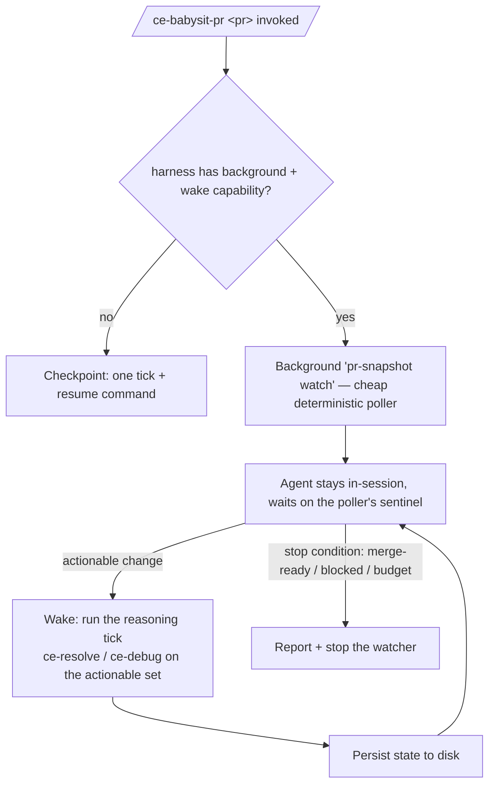

# feat: ce-babysit-pr self-sustaining in-session watch loop + delegation-contract fix

## Summary

`ce-babysit-pr`'s purpose is a continuous autonomous loop, but today a direct invocation runs **one tick and hands the user a resume command** — it never sustains the watch. We validated (two live cross-harness experiments this session — see Sources) that the simplest, most robust fix is **not** for the skill to meticulously call a per-harness scheduler. It is to **declare the watch intent and let the agent build the loop itself, in-session**: agents on Claude Code, Codex, Grok, and Cursor all *spontaneously* built a sustained background watcher + in-session wait from generic intent alone, caught an external change that landed minutes later, and reacted correctly — no mechanism named, no scripts.

So babysit self-sustains as an **in-session watcher**: it backgrounds a cheap deterministic `pr-snapshot` poller (the change-detector — no agent tokens between changes), stays in-session (**retaining the conversation's decisions**), and when the poller signals an actionable change or a stop condition, the agent **wakes and runs the reasoning tick** (delegating to `ce-resolve-pr-feedback` / `ce-debug`), then resumes watching. This also fixes three `babysit ↔ ce-resolve` delegation bugs (below) that a real loop depends on — including a **never-settle bug**.

**Product Contract:** `ce-plan-bootstrap`; scope confirmed interactively. Architecture confirmed by live experiment, not assumption.

---

## Problem Frame

**What's broken (user-visible):** running `/ce-babysit-pr <pr>` (or shipping via `ce-commit-push-pr`'s default-on handoff) does one tick and stops with "re-run to continue." That defeats the skill.

**Why the old direction was wrong:** we started down a path of detecting each harness's scheduler tool (`scheduler_create`, `/loop`, `ScheduleWakeup`) and calling it, with a bundled driver script, a sentinel nesting-guard, and a tier matrix. Two experiments showed that's over-built: (a) a skill *can't* invoke a user-typed slash command, but (b) the **agent** readily builds its own sustained watcher from a plain description of the goal. Meticulously wiring mechanisms fights the grain; declaring intent works with it.

**Why the contract fixes are in scope:** verified live on PR #1102 — babysit drives `ce-resolve` programmatically and three seams break: (a) it passes a PR *URL* but `ce-resolve` treats URLs as *targeted* mode; (b) `ce-resolve`'s `export GH_HOST` sits in one bash block while its reply/resolve calls are separate Bash invocations, so the host never propagates; (c) non-actionable non-thread feedback is dropped by `ce-resolve` but never marked by babysit, so it stays in `actionable.comments` forever and the merge-ready gate never clears. A self-sustaining loop makes (c) fatal (infinite spin), so all three land here.

---

## Requirements

- **R1** — On a fresh invocation, babysit **self-sustains the watch** without the user re-running it: it establishes a background change-detector and keeps watching in-session until a stop condition. It does not hand back a resume command as the primary outcome.
- **R2** — The watch runs **in-session** (the agent stays alive, woken on change), so it retains the conversation's decisions; the reasoning tick (`ce-resolve` / `ce-debug`) runs on wake.
- **R3** — Change detection is **cheap and deterministic**: a `pr-snapshot` poller (no agent tokens between changes) signals only when there's an actionable change or a stop condition; the agent wakes only then, not on a fixed expensive cadence.
- **R4** — The background-watch + wake mechanism is **capability-described, not a named tool**: the agent uses whatever its harness provides (a background process + a notification/wait-on-output). Where none exists, it degrades to **checkpoint** (one tick + resume command) — stated plainly, not faked.
- **R5** — **Durability is honest.** The in-session watcher is session-bound; state is disk-resumable so a re-invocation continues cleanly, and the plan documents the optional escalation to a durable headless scheduler for beyond-session watches (with a caveat that headless loses conversation context).
- **R6** — `ce-resolve-pr-feedback` full mode accepts a PR **URL** (parsing host/owner/repo/number).
- **R7** — `ce-resolve`'s bundled `gh api graphql` calls target the right host on GHE across *all* its separate Bash invocations.
- **R8** — Non-actionable non-thread feedback stops persisting: after a resolve pass babysit marks passed comments so `counts.comments` can reach 0 and the loop settles.
- **R9** — Cross-skill contracts stay drift-guarded (parity tests fail under one-sided change).

---

## Key Technical Decisions

- **KTD1 — Declare the intent; let the agent build the loop (empirically validated, not assumed).** Two live experiments this session: given *only* a description of the goal (no mechanism named), agents on all four harnesses built a sustained watch loop — first a trivial cadence task, then a realistic *watch-an-external-page-for-a-later-change-and-react* task; all four caught the change unattended with the exact unguessable token. The skill therefore describes **what** to sustain and **why it's agent-reasoning**, and does *not* enumerate or call per-harness schedulers. This deletes the driver script, the mechanism tier matrix, and the sentinel nesting-guard from the earlier draft.

- **KTD2 — In-session watcher (wake-on-change), not headless re-exec.** The agent stays in the same session and is woken when the background detector signals — so the loop **keeps the conversation's decisions** (the reviewer judged systematically wrong, the user's mid-run steering, the nits already declined) and never re-litigates. A fresh headless session per tick (`<cli> exec …`) is context-blind and reconstructs from disk; it is the durability fallback (KTD4), not the default. In-session's two "costs" are non-issues for a watcher: session-bound is fine while you're watching, and cache-locked is fine because the skill isn't edited mid-watch.

- **KTD3 — `pr-snapshot` is the change-detector; the agent reasons only on wake.** The experiments showed agents naturally build "cheap background poller + parent waits, woken on a sentinel." `pr-snapshot` already computes the actionable diff deterministically in Python (no agent tokens), so a `pr-snapshot watch` mode is the perfect detector: poll on an interval, print a sentinel line when the actionable set is non-empty or a stop condition holds. The agent backgrounds it, waits on the sentinel via its harness's notification/wait capability, wakes, runs the reasoning tick, and resumes. This is efficient (reasoning spent only on real change) and responsive.

- **KTD4 — Durability = in-session default + disk-resume + optional durable escalation.** The in-session watcher dies when the session closes. Default recovery is disk-resume: state is fully persisted, so re-invoking continues. For a genuinely long unattended watch (days), the honest escalation is a durable headless scheduler (Grok `scheduler_create --durable`, or cron re-running `<cli> exec "/ce-babysit-pr <pr>"`), accepting that headless loses conversational context — so consequential decisions (parks, declines, user steering) are persisted to disk to blunt that loss. This is documented, not the primary path.

- **KTD5 — Contract fixes: parse-in-one-place + mark-all-passed.** (a) PR-ref: teach `ce-resolve` full mode to accept a PR URL and own host/owner/repo/number parsing in one place. (b) Host: set `GH_HOST` inline in each Bash block that calls a bundled script (shell state does not persist between Bash tool calls). (c) Bookkeeping: babysit marks **each comment it passed** as `dispatched` after a resolve pass, except those `ce-resolve` returned as `needs-human` (those → `needs-human`).

- **KTD6 — Behavioral changes are eval-verified out of band.** The self-sustain and contract prose are LLM-interpreted behavior that plugin caching prevents validating in-session; verification is a `skill-creator` cross-host eval (Claude + Codex) as a follow-up. In-repo tests cover the mechanical pieces (`pr-snapshot watch`, `mark --comment`, drift-parity).

---

## High-Level Technical Design

The named harness tools (`notify_on_output`, background `Shell`, `get_command_or_subagent_output`, `ScheduleWakeup`) are *examples* of the background+wake capability, not a required list — the agent picks whatever its harness exposes. Prose governs on any disagreement.

---

## Implementation Units

### U1. `pr-snapshot watch` — deterministic background change-detector

**Goal:** A cheap, tested poller the agent backgrounds; emits a sentinel only on an actionable change or stop condition.
**Requirements:** R1, R3.
**Dependencies:** none.
**Files:** `skills/ce-babysit-pr/scripts/pr-snapshot`, `tests/ce-babysit-pr-snapshot.test.ts`.
**Approach:** Add a `watch` subcommand: `pr-snapshot watch --pr N --repo O/R --state-dir DIR [--interval S] [--max-runtime S]`. Loop: run the existing snapshot/diff each interval; when the diff's actionable set becomes non-empty, or a terminal/merge-ready/blocked/budget stop condition holds, print a single sentinel line (e.g. `BABYSIT_WAKE {reason,url}`) to stdout and exit (so the harness's wait-on-output fires). Reuse the existing fetch/diff/state engine entirely — this only adds the poll-and-signal wrapper. No agent involvement; pure Python. Honors `--max-runtime` and an interrupt/stop-signal file. Between fires it makes only `gh` calls, no agent tokens.
**Patterns to follow:** existing `cmd_snapshot`/`diff` in `pr-snapshot`; `--fetch-file` for testability.
**Test scenarios:** `Covers R3.` With `--fetch-file` fixtures cycled by a fake gh: emits the sentinel when the actionable set first becomes non-empty; emits a stop sentinel on `MERGED`/merge-ready/`blocked_external`; honors `--max-runtime`; stays silent while nothing is actionable. Real test in `tests/ce-babysit-pr-snapshot.test.ts`.
**Verification:** A watch over changing fixtures prints exactly one wake sentinel at the first actionable change and one stop sentinel at a terminal state.

### U2. Self-sustaining in-session watch in `SKILL.md` + `watch-loop.md`

**Goal:** babysit declares the watch intent and sustains it in-session, replacing the "one tick + resume" default.
**Requirements:** R1, R2, R4, R5.
**Dependencies:** U1.
**Files:** `skills/ce-babysit-pr/SKILL.md`, `skills/ce-babysit-pr/references/watch-loop.md`.
**Approach:** Rewrite the mode-selection + scheduling sections. New default: on a fresh invocation, **establish the in-session watch** — background `pr-snapshot watch` (U1), stay in-session, wait on its sentinel using the harness's background+wake capability (**describe the capability**: "a way to run a background process and be woken when it emits a line, without ending your turn"; name `notify_on_output` / background `Shell` / `get_command_or_subagent_output` / `ScheduleWakeup` only as examples). On wake: run the existing ordering-invariant tick (feedback before CI, delegate to `ce-resolve`/`ce-debug`), persist, resume watching. Keep the pre-authorization / bounded-scope / live-redirection / review-signal-guard blocks. Degrade to **checkpoint** (one tick + resume command) only when the harness genuinely offers no background+wake capability (R4). Add the durability note (R5, KTD4). Delete the old tier matrix, driver-script references, and sentinel guard.
**Patterns to follow:** the capability-first framing already in this skill's "Asking the user" / "Invoking another skill" blocks; the existing Step 2 ordering invariant (unchanged).
**Test scenarios:** Test expectation: none — LLM-interpreted; covered by KTD6 eval + U7 doc-presence checks.
**Verification:** The prose instructs establishing an in-session background watch + wake-on-change + reasoning tick, describes the capability (not a fixed tool list), and defines the checkpoint degradation and durability limit.

### U3. `ce-commit-push-pr` handoff sustains a real watch

**Goal:** The default-on handoff yields a self-sustaining watch, not a one-tick checkpoint.
**Requirements:** R1.
**Dependencies:** U2.
**Files:** `skills/ce-commit-push-pr/SKILL.md`.
**Approach:** Confirm the handoff invokes `/ce-babysit-pr <pr>` so babysit's new self-sustain default (U2) engages; adjust only wording if it implies a one-shot. `babysit:off` still hard-skips; `babysit:continuous|checkpoint` still force a mode. No loop logic in this skill.
**Test scenarios:** Covered by `tests/commit-push-pr-contract.test.ts` — handoff invokes babysit without a once/one-tick token; `babysit:off|continuous|checkpoint` documented.
**Verification:** Handoff wording matches self-sustaining behavior; contract test green.

### U4. `ce-resolve` full mode accepts a PR URL

**Goal:** A PR URL routes to full mode with correct host/owner/repo/number (fixes fork-PR mis-resolution).
**Requirements:** R6.
**Dependencies:** none.
**Files:** `skills/ce-resolve-pr-feedback/SKILL.md` (Mode Detection), `skills/ce-resolve-pr-feedback/references/full-mode.md`.
**Approach:** Distinguish a **PR URL** (`…/pull/<N>`) from a **comment/thread URL** (`#discussion_r…`/`#pullrequestreview-…`). PR URL → full mode, parsing host/owner/repo/number; comment/thread URL → targeted (unchanged). Feed owner/repo to `get-pr-comments` and host to the GH_HOST derivation (U5). Bare number and no-arg unchanged.
**Test scenarios:** `Covers R6.` A `/pull/123` URL → full; a `#discussion_r…` URL → targeted; `owner/repo#123` → full with right owner/repo; bare `123` unchanged. (Mode-detection prose parity in U7 + a small parser test if extracted.)
**Verification:** A PR URL fetches all unresolved threads (full mode), not one.

### U5. Per-call `GH_HOST` in `ce-resolve` (GHE fix)

**Goal:** Every bundled `gh api graphql` call targets the right host on GHE across separate Bash invocations.
**Requirements:** R7.
**Dependencies:** U4 (shares the URL host parse).
**Files:** `skills/ce-resolve-pr-feedback/references/full-mode.md`, `skills/ce-resolve-pr-feedback/SKILL.md`.
**Approach:** Set `GH_HOST` inline in **each** bash block that runs a bundled script (fetch, thread-verify, reply, resolve, verify) — a single `export` is insufficient since shell state doesn't persist between Bash calls. Prefer `GH_HOST=<derived> bash "$SCRIPT_DIR/…"` per call.
**Test scenarios:** Test expectation: none — reference prose; U7 doc-presence check that each bundled-script block carries a host selector; KTD6 eval on a GHE fixture.
**Verification:** Reply/resolve blocks each carry a host selector; none relies on a prior block's `export`.

### U6. babysit marks passed comments (never-settle fix)

**Goal:** Non-actionable non-thread feedback stops persisting so the loop can settle.
**Requirements:** R8.
**Dependencies:** none.
**Files:** `skills/ce-babysit-pr/SKILL.md` (Step 2 step 3), `skills/ce-babysit-pr/references/watch-loop.md`.
**Approach:** After a resolve pass, mark **each comment babysit passed** as `dispatched`, except those `ce-resolve` returned as `needs-human` (→ `needs-human`). The engine already supports `mark --comment`; no engine change.
**Test scenarios:** `Covers R8.` After a pass that passed 3 comments and returned 0 needs-human, a re-snapshot shows `counts.comments == 0`; a returned needs-human comment shows in `open_needs_human` and the others clear. Real test via `--fetch-file` + `mark --comment`.
**Verification:** A snapshot with only wrapper review-bodies settles to `counts.comments == 0` after one marked pass.

### U7. Drift-sensitive parity + behavioral doc-presence tests

**Goal:** Lock the new contract/behavioral invariants against one-sided drift.
**Requirements:** R9.
**Dependencies:** U1, U2, U4, U5, U6.
**Files:** `tests/ce-babysit-pr-contract.test.ts`, `tests/ce-babysit-pr-snapshot.test.ts`.
**Approach:** Assert: `SKILL.md`/`watch-loop.md` describe the in-session background-watch + wake-on-change capability (and do **not** re-introduce a named-tool tier list as the mechanism); `ce-resolve` Mode Detection distinguishes PR-URL (full) from comment/thread-URL (targeted); each `full-mode.md` bundled-script block carries a host selector; babysit's Step 3 marks passed comments. Add the U1 `watch` test and the U6 snapshot test. Keep the existing enum/trajectory/exclusion parity.
**Test scenarios:** each new assertion fails when its counterpart is removed/renamed.
**Verification:** `bun test` green; each new assertion fails under injected one-sided drift.

### U8. Docs + follow-up markers

**Goal:** Keep skill docs and the eval follow-up honest.
**Requirements:** R1, KTD6.
**Dependencies:** U2.
**Files:** `docs/skills/ce-babysit-pr.md`, `README.md` (inventory row if the summary changed), `skills/ce-babysit-pr/SKILL.md` (argument-hint).
**Approach:** Update the skill page + argument-hint to describe the self-sustaining in-session watch and `babysit:off|continuous|checkpoint`. Record the cross-host `skill-creator` eval as required post-merge verification. Run `bun run release:validate` if a release-owned description/count changed.
**Test scenarios:** Test expectation: none — docs. `release:validate` in sync.
**Verification:** Skill page + argument-hint reflect the new default; release:validate green.

---

## Scope Boundaries

**In scope:** the self-sustaining in-session watch (`pr-snapshot watch` + declarative in-session wake-on-change); the three `ce-resolve` contract fixes; parity/behavioral tests; docs.

### Deferred to Follow-Up Work
- **Running the cross-host `skill-creator` eval** (Claude + Codex) — required verification per KTD6, run after these edits land (plugin cache prevents in-session validation).
- **A durable beyond-session watcher** (Grok `scheduler_create --durable` or a cron running `<cli> exec`) — documented as the escalation (KTD4) but not implemented here; default is in-session + disk-resume.
- **A `/ce-compound` learning** capturing the "declare intent, agent self-organizes the watch; verify assumptions with live cross-harness agents" pattern (being captured this session).

---

## Risks & Dependencies

- **Reliability of "declare intent" (medium):** the KTD6 eval must confirm agents reliably *sustain* the watch (not one tick) and correctly treat the tick as agent-reasoning-on-wake — the two live experiments are strong evidence, but the eval is the gate.
- **Skill-cache invisibility:** none of the behavioral changes are testable in-session; the real proof is the deferred eval. Flag in the PR so a green `bun test` isn't mistaken for behavioral verification.
- **Contract fixes interdependent:** U4 (URL parse) feeds U5 (host) — land U4 first. `ce-resolve` is shared (also `lfg`, standalone) — U4/U5 must not regress bare-number / no-arg / same-repo paths (U7 covers this).
- **`pr-snapshot watch` polling load:** the interval must respect gh rate limits (reuse the existing cadence: ~2-3 min active, ~5-10 min quiet).

---

## Open Questions (execution-time)

- Exact sentinel format for `pr-snapshot watch` and how each harness's wait-on-output matches it — resolve while wiring U1/U2 (a distinctive single-line prefix the agent greps).
- Whether to background `pr-snapshot watch` as a single long-running process vs. re-run per interval — decide per the harness's background model during U2; the deterministic detector supports either.

---

## Sources & Research

- **Live cross-harness experiments (this session, via Orca orchestration) — the load-bearing evidence:**
  - *Experiment 1 (self-sustain):* given intent-only ("repeat this on a cadence, sustain it yourself, don't ask me"), Claude/Codex/Grok/Cursor each autonomously built a self-sustaining loop (background bash loop, ~35s cadence, proof files fired). None used its native scheduler.
  - *Experiment 2 (watch-and-react):* given generic intent to watch a public ht-ml.app page for a later change, all four sustained a background `curl`-poll + in-session wait for ~3 minutes, caught a mid-experiment token flip, and wrote the exact unguessable value (`PLATYPUS-4F2K9`) — proving watch-external-change-and-react from intent alone.
  - *Mechanism verification:* Grok `scheduler_create` is agent-callable + `durable:true` but agents didn't reach for it; Cursor `/loop` is user-typed (not skill-invocable); Codex CLI has no scheduler tool and a detached `nohup` is reaped — background exec must use the runtime handle. These informed KTD2/KTD4 (in-session default; headless as durability fallback).
- Existing engine + mechanics: `skills/ce-babysit-pr/scripts/pr-snapshot`, `skills/ce-babysit-pr/references/watch-loop.md`.
- Related learning: `docs/solutions/skill-design/watch-loops-need-a-blocked-external-terminal-state.md`.
- Authoring constraints: repo `AGENTS.md` (cross-harness authoring, capability-over-tool, `SKILL_DIR` anchor, parity discipline) and the "portable agent skill authoring" field guide (capability description, graceful degradation, migrate-both-ends).

---

## Definition of Done

- U1–U8 landed; `bun test` green (including the U1 `watch` test, U6 snapshot test, U7 parity); `bun run release:validate` in sync.
- A fresh `/ce-babysit-pr <pr>` on a capable harness establishes an in-session background watch and reasons a tick on the first actionable change (not a one-tick-then-resume); on a harness with no background+wake capability it degrades to checkpoint honestly.
- The three contract fixes verified against bare-number / URL / GHE / wrapper-comment paths (U4–U7).
- Cross-host `skill-creator` eval (Claude + Codex) queued as required behavioral verification (deferred), covering "sustains the watch" and "wakes-to-reason on change."
