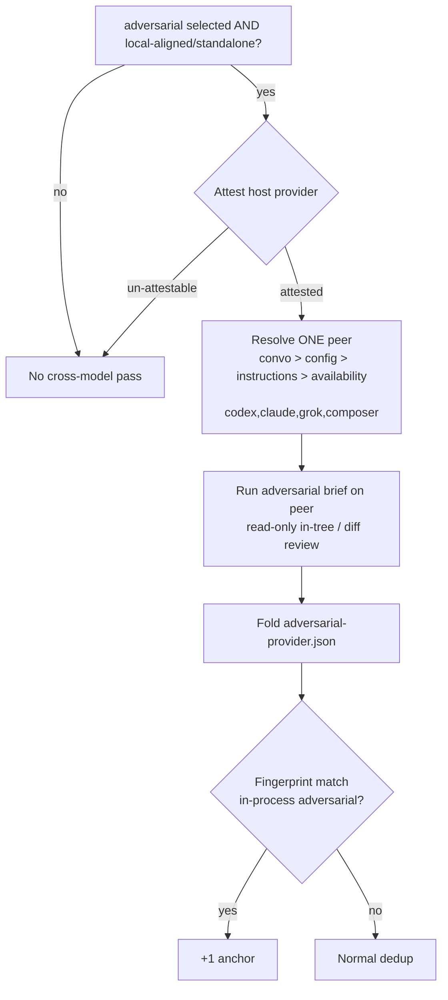

# feat: Port doc-review cross-model provider mechanics to ce-code-review adversarial pass

## Goal Capsule

- **Objective:** Upgrade `ce-code-review`'s existing adversarial cross-model pass so it uses the same host-attestation, multi-provider selection, route adapters, and non-blocking fold-in mechanics as `ce-doc-review` — while remaining **adversarial-only** (no extra twin lenses, no whole-diff peer).
- **Authority:** Maintainer direction from design session (2026-07-13): improve same-model self-review independence for code; keep lens scope unchanged; port mechanics, not the doc-review trio/whole-doc product.
- **Execution profile:** Skill-local script + reference + SKILL wiring + CI route/selection tests; optional skill-creator eval for orchestration prose. No converter/parser changes.
- **Stop conditions:** Stop if the change would add security/correctness twins, a whole-diff peer, `ce-simplify-code` work, a shared runtime package that skills import, or empty-scratch tool-less isolation that prevents in-tree diff review.

---

## Product Contract

### Summary

Replace code-review's fixed host→peer map (`cursor`/`claude`→`codex`, `codex`→`claude`) with doc-review's attested-provider exclusion + one different-provider peer resolution (conversation → config → project instructions → availability order `codex → claude → grok → composer`), including grok/composer routes via `cursor-agent`, high-reasoning model mapping, `--emit-adapter` route-safety surface, and fold-in as `adversarial-<provider>`. The pass still runs only when `adversarial-reviewer` is selected and scope is `local-aligned`/standalone. Peer reviews the current work tree against `git diff <base>` under read-only posture (in-tree, not empty-scratch doc embed).

### Problem Frame

`ce-code-review` already runs a cross-model adversarial pass, but the mechanics are the earlier generation: only `codex`↔`claude`, no host-attestation fail-closed path for Cursor's active serving provider, no preference override, no grok/composer, weaker route-safety test surface. `ce-doc-review` later evolved a more robust independence system for the same underlying goal — a different model family reviewing work the host model (or sibling) produced. Code-review should inherit that system without inheriting doc-review's multi-lens / whole-doc product shape: on code diffs, adversarial is the right single peer carrier (security is valuable in-process but does not earn a second peer beside adversarial; correctness is always-on and would tax every full review).

### Requirements

**Scope (unchanged product lens)**

- R1. Cross-model coverage remains **adversarial-only**. No security, correctness, or other persona twins. No whole-diff / generalist peer sweep.
- R2. The pass runs only when Stage 3 selected `adversarial-reviewer` **and** scope is `local-aligned` or standalone. Skip in `pr-remote` / `branch-remote` (peer would review the wrong tree). No new activation triggers.

**Provider selection (ported from doc-review)**

- R3. Independence is by **provider**, not CLI brand. Providers/routes: OpenAI→`codex` CLI; Anthropic→`claude` CLI; xAI→`grok` CLI else `cursor-agent --model grok-4.5-high`; Cursor/composer→`cursor-agent --model composer-2.5-fast`. Never use `cursor-agent` for OpenAI/Anthropic.
- R4. Skill attests host provider and passes it explicitly; script excludes it. Un-attestable host → skip (zero peers), never guess a same-provider peer. Cursor attests its *active serving* provider.
- R5. Resolve **one** peer by precedence: (1) conversation preference, (2) `cross_model_peer:` in `.compound-engineering/config.local.yaml`, (3) preference already in active project instructions (from context, never by reading a named instruction file), (4) first available ≠ host in order `codex → claude → grok → composer`. Second peer only via `CROSS_MODEL_MAX_PEERS=2` (default 1, clamp 0..2).
- R6. `CROSS_MODEL_PEERS` when set is an allowlist after host exclusion; unset means default eligibility order.

**Peer execution**

- R7. One model per provider at high reasoning (same tier principle / current ID map as doc-review: codex `gpt-5.6-sol`, claude `opus`, grok `grok-4.5` / `grok-4.5-high`, composer `composer-2.5-fast`). Concrete IDs live in one in-script mapping; the reference must not restate them.
- R8. Peer is non-blocking and self-bounding (idle/hard timeouts, process-group reap). Any failure → log + exit 0 + no fold-in file; never fails the review.
- R9. Peer runs read-only / no-prompt / no-write. **Code-review isolation differs from doc-review by design:** peer may review the **current work tree** (read files + `git diff <base>`). Do **not** require empty-scratch tool-less deny-Read. Per-route floor:
  - **codex:** `-s read-only` with `-C` at repo root (or equivalent read-only sandbox over the reviewed tree).
  - **claude:** deny mutators / Bash / Task / `mcp__*` (Read allowed for context); prefer hardening toward doc-review's `--bare` only if Read for context remains available — never strip the ability to inspect surrounding code.
  - **grok / cursor-agent:** ask/dontAsk + deny write/force/yolo; allow read of the reviewed tree.
  - NEVER: codex without read-only; grok `--always-approve` / `bypassPermissions`; cursor-agent `-f` / `--force` / `--yolo`.
- R10. Diff delivery stays code-shaped: codex may fetch `git diff <base>` inside the sandbox; routes that cannot run shell get the diff embedded (or equivalent) and may Read for context. Subject is the reviewed checkout, not an embedded planning document.

**Fold-in and UX**

- R11. Fold-in reviewer name is `adversarial-<provider>` (`codex`|`claude`|`grok`|`composer`). Force the field on normalize; never fold a bare `adversarial`. Soft-array backfill uses code-review schema (`findings`, `residual_risks`, `testing_gaps`). Peer findings never carry apply authority (remap any `safe_auto` → `gated_auto` if present). Cap cross-model agreement bonus at one anchor step.
- R12. Interactive default mode: prominent announce naming concrete model + reasoning (and cursor-agent route when used), framed as independent cross-model adversarial review; reconcile actual provider/route after collection if fallback changed egress. `mode:agent`: no user prose; stderr audit log still records peer egress. Missing peer → quiet skip line on interactive hosts, never an error.
- R13. Launch the peer CLI in the same Stage 4 wave as persona reviewers (does not consume subagent concurrency); await exit before Stage 5.

### Scope Boundaries

**In scope**

- Upgrade `skills/ce-code-review/scripts/cross-model-adversarial-review.sh`
- Rewrite `skills/ce-code-review/references/cross-model-review.md` orchestration contract
- SKILL.md Stage 3/4/5 wiring deltas (attestation, candidates, naming, announce)
- Docs: `docs/skills/ce-code-review.md` (+ README inventory line only if it claims peer capabilities)
- CI tests mirroring doc-review's route-safety / selection / skip / normalize suite
- Cross-skill **invariant** parity (model IDs, NEVER flags, provider keys) — not a shared importable module

**Deferred**

- Security / correctness / other twin lenses
- Whole-diff generalist peer
- `ce-simplify-code` cross-model
- Extracting a byte-identical shared invocation file used by both skills (revisit only if the two scripts' adapter kernels drift painfully; until then invariant parity tests are the contract)
- Changing adversarial activation heuristics

**Outside this product**

- Converter/CLI/marketplace version bumps
- Changing Stage 5c apply policy or persona briefs' review content (except naming references to `<provider>` if needed)

### Success Criteria

- On adversarial-selected local reviews, a different-provider peer can run via codex, claude, grok, or composer depending on host + availability + preference — not only the old fixed pair.
- Un-attestable host or no reachable different provider → clean skip; review completes as today.
- CI proves route NEVER-flags, selection/exclusion, skip paths, and normalize (`adversarial-<provider>`, soft arrays) without live model calls.
- Cost profile unchanged vs today's adversarial gate: zero peers when adversarial is not selected; at most one peer by default when it is.

### Dependencies / Assumptions

- Doc-review's script/tests (`skills/ce-doc-review/scripts/cross-model-doc-review.sh`, `tests/skills/ce-doc-review-cross-model-routes.test.ts`) are the proven reference implementation for selection + adapters.
- Code-review findings schema remains `{reviewer, findings, residual_risks, testing_gaps}` (not doc-review's `deferred_questions`).
- Users accept peer egress of reviewed code to the selected provider (same trust posture as today's codex/claude peer; expanded provider set).
- `.agy/skills` is a symlink to `skills/` — edit the canonical tree only.

### Sources / Research

- Design session conclusion (2026-07-13): adversarial-only; port mechanics; in-tree review OK; duplicate + parity rather than docs-only pattern sharing
- `docs/plans/2026-07-09-003-feat-doc-review-cross-model-plan.md` — R14–R19 provider model (adapted; drop trio/whole-doc/R20)
- `skills/ce-doc-review/scripts/cross-model-doc-review.sh` + `references/cross-model-review.md`
- `skills/ce-code-review/scripts/cross-model-adversarial-review.sh` + `references/cross-model-review.md` (baseline to replace mechanically)
- `tests/skills/ce-doc-review-cross-model-routes.test.ts` — template for code-review CI coverage
- `docs/solutions/skill-design/portable-agent-skill-authoring.md` — skill self-containment; no cross-skill imports

---

## Planning Contract

### Key Technical Decisions

- **KTD1. Mechanics port, product scope freeze.** Copy doc-review's provider attestation, candidate walking, adapters, normalize/publish, and announce/egress discipline. Do not copy trio activation, whole-doc sweep, document embedding, or empty-scratch deny-Read as requirements.
- **KTD2. Skill-local script, not a shared runtime.** Keep `cross-model-adversarial-review.sh` under `ce-code-review`. Skills cannot import siblings. Enforce sameness of the *portable kernel* (provider keys, model ID map, NEVER flags, preference order semantics) via CI invariant assertions against both scripts' `--emit-adapter` output / shared constants — not via a cross-skill file read at runtime.
- **KTD3. In-tree read-only residual is intentional.** Doc-review's tool-less empty scratch fits self-contained docs. Code-review peers must see the diff and surrounding code. Accept read residual on all code-review routes; document it; keep write/network/subagent denials.
- **KTD4. Signature becomes host+candidates, not fixed peer.** Change from `script <peer> <base-ref> <run-dir>` to `script <host-provider> <candidates> <base-ref> <run-dir>` (adversarial persona implied — not a free reviewer-name arg). Skill resolves preference into candidates; script owns availability, host exclusion, fallback, and writing `adversarial-<provider>.json`.
- **KTD5. Preserve watchdog / RAW publish discipline.** Port doc-review hardening that code-review lacks or only partially has: `trap '' HUP`, write `*.raw.json` then publish fold-in only after normalize, idle+hard reap for streaming routes, stdout recovery for codex `-o` miss. Keep code-review's `testing_gaps` normalize contract.
- **KTD6. Naming: `adversarial-<provider>`.** Replace informal `adversarial-<peer>` language with provider keys so `adversarial-grok` / `adversarial-composer` are first-class. Stage 5 already treats `adversarial-<peer>` as an independent reviewer — update prose to provider vocabulary; fingerprint/promotion behavior unchanged.

### Assumptions

- Existing Stage 5 merge already promotes on cross-reviewer agreement including the adversarial peer return; no new synthesis algorithm beyond naming/docs clarity.
- Lite roster / `depth:` tokens unchanged; they only affect whether adversarial is selected, which already gates the pass.
- Live peer CLIs remain untestable in CI; stubbed PATH sandboxes + `--emit-adapter` + `CROSS_MODEL_DRY_RUN`-style selection (as in doc-review tests) are sufficient mechanical proof.

---

## Implementation Units

### U1. Orchestrator reference rewrite

- **Goal:** Replace code-review's fixed peer map reference with the attestation + preference + fold-in contract, adversarial-only and in-tree-specific.
- **Requirements:** R1–R6, R11–R13.
- **Dependencies:** none.
- **Files:** `skills/ce-code-review/references/cross-model-review.md`
- **Approach:** Mirror doc-review reference structure (gate → attest → resolve candidates → announce → invoke with `SKILL_DIR` → fold-in), but: single lens; `<base-ref>` + run-dir; no document_type/origin; announce names adversarial cross-model review and that reviewed code/diff may egress to the peer provider; point at in-script model map (no restated IDs); document in-tree read residual vs doc-review tool-less posture.
- **Patterns to follow:** `skills/ce-doc-review/references/cross-model-review.md` (selection/announce/await); keep code-review's scope gate language.
- **Test scenarios:** `none — prose; behavioral wiring via U5 eval if authored.`
- **Verification:** A reader can determine when the pass runs, how host/peer are chosen, and how `adversarial-<provider>.json` merges — without opening the script.

### U2. Script: provider adapters + selection + normalize

- **Goal:** Upgrade the adversarial script to the multi-provider mechanics while keeping adversarial-only + diff/work-tree delivery.
- **Requirements:** R3–R11; KTD3–KTD5.
- **Dependencies:** U1 defines the invocation contract.
- **Files:** `skills/ce-code-review/scripts/cross-model-adversarial-review.sh`
- **Approach:**
  - New usage: `cross-model-adversarial-review.sh <host-provider> <candidates> <base-ref> <run-dir>` plus `--emit-adapter <route>` introspection.
  - Port from doc-review: `M_*` constants, `adapter_argv`, host exclusion, candidate walk, `CROSS_MODEL_PEERS` / `CROSS_MODEL_MAX_PEERS`, grok→cursor-agent classified fallback, HUP trap, RAW_OUT→normalize publish, soft-array backfill, force `reviewer=adversarial-<provider>`, demote peer `safe_auto`.
  - Keep/adapt code-review: persona `references/personas/adversarial-reviewer.md`, schema with `testing_gaps`, `git diff` delivery split, `-C`/`--cwd`/`--workspace` aimed at **repo root** (not empty scratch), Read allowed on claude/grok/cursor-agent as needed for context.
  - Non-blocking skip on bad host, empty candidates after exclusion, missing CLI, timeout, unparseable JSON.
- **Patterns to follow:** doc-review script for selection/adapters/normalize; existing code-review script for diff delivery + watchdog.
- **Test scenarios:** Covered by U4 (CI). Live peers deferred.
- **Verification:** `--emit-adapter` works for all five routes; invalid host skips cleanly; fixture JSON normalizes to `adversarial-<provider>` with `testing_gaps` backfilled.

### U3. SKILL.md wiring

- **Goal:** Stage 3/4/5 prose matches the new script contract.
- **Requirements:** R2, R4, R5, R12, R13.
- **Dependencies:** U1, U2.
- **Files:** `skills/ce-code-review/SKILL.md` (announce ~Stage 3, launch ~Stage 4, fold-in ~Stage 5)
- **Approach:** Replace fixed `XPEER=codex|claude` self-id with attest-host + build candidates (preference front-load) + pass both to the script. Keep adversarial+scope gate. Update fold-in filename language to `adversarial-<provider>.json`. Announce per R12. Do not inline model IDs or adapter flags (defer to reference/script).
- **Test scenarios:** `none — orchestration prose; U5 eval optional.`
- **Verification:** SKILL instructs attestation, candidate construction, `SKILL_DIR` invoke, await-before-synthesis, and provider-named fold-in — no leftover fixed-pair-only logic.

### U4. CI route-safety and selection tests

- **Goal:** Mechanical CI coverage equivalent to doc-review's cross-model suite, plus cross-skill invariant parity.
- **Requirements:** R3, R5–R9, R11; KTD2.
- **Dependencies:** U2.
- **Files:** `tests/skills/ce-code-review-cross-model-routes.test.ts` (new); optionally a small shared assertion helper under `tests/skills/` for NEVER flags / model-ID parity against both scripts' `--emit-adapter` output.
- **Approach:** Clone the doc-review test patterns: sandbox PATH stubs, `--emit-adapter` NEVER-flag + required read-only/ask flags, selection tables per host, allowlist/`MAX_PEERS`, skip paths, normalize fixtures. Add assertions that code-review adapters target repo-oriented cwd/workspace (not claiming deny-Read equivalence with doc-review). Add invariant parity: both skills' emitted adapters share the same `M_*` model IDs and NEVER-flag exclusions.
- **Patterns to follow:** `tests/skills/ce-doc-review-cross-model-routes.test.ts`
- **Test scenarios:**
  - Each route emits required safety flags and none of the NEVER flags.
  - Host `claude` + default candidates → prefers `codex` when stubbed available.
  - Host `unknown` → skip, no file.
  - `CROSS_MODEL_PEERS` / `MAX_PEERS` behave as allowlist / second-peer opt-in.
  - Normalize forces `adversarial-<provider>` and backfills `testing_gaps`.
  - Model ID constants match doc-review's `--emit-adapter` mapping.
- **Verification:** `bun test tests/skills/ce-code-review-cross-model-routes.test.ts` green in CI without network/model calls.

### U5. Docs + optional skill-creator eval

- **Goal:** User-facing docs match behavior; optional behavioral eval for orchestration.
- **Requirements:** R1, R12; success criteria.
- **Dependencies:** U1–U4.
- **Files:** `docs/skills/ce-code-review.md`; README inventory row only if needed; skill-creator eval artifact if authored.
- **Approach:** Update the cross-model section: still adversarial-only; now multi-provider with attestation/preference/fallback; in-tree read-only; egress disclosure; link config knobs. FAQ vs doc-review: same independence *system*, different lens policy (adversarial-only vs trio+whole-doc). Optional skill-creator eval: gate fires only when adversarial+local; announce rules; fold-in naming — not a release blocker if U4 is solid, but recommended for SKILL prose.
- **Test scenarios:** docs — none; eval — activation/skip/announce/fold-in if authored.
- **Verification:** Docs do not claim security twins or fixed codex-only peer; describe provider auto-selection.

---

## Verification Contract

| Gate | Command | Applies to | Done signal |
|---|---|---|---|
| Route/selection/normalize CI | `bun test tests/skills/ce-code-review-cross-model-routes.test.ts` | U2, U4 | Green |
| Full suite | `bun test` | U1–U5 | Green |
| Metadata | `bun run release:validate` | docs/skill inventory if touched | Pass |
| Script skip paths | bash script with `unknown` host / empty peers | U2 | Exit 0, no fold-in file |
| Cross-skill model/NEVER parity | assertions in U4 | U2, U4 | Doc-review and code-review adapters agree on IDs + forbidden flags |
| Behavioral wiring (optional) | skill-creator eval | U1, U3 | Pass fires only on adversarial+local; fold-in name correct |

---

## Definition of Done

- [x] Adversarial cross-model pass supports codex, claude, grok, and composer peers via attested host exclusion + preference/availability resolution
- [x] Scope remains adversarial-only; no new twin lenses or whole-diff peer
- [x] In-tree / diff review preserved; write/force/yolo routes impossible per `--emit-adapter` tests
- [x] Fold-in is `adversarial-<provider>.json` with forced reviewer name and code-review soft arrays
- [x] Non-blocking skip on un-attestable host / unreachable peer
- [x] CI tests land; `bun test` + `release:validate` pass
- [x] `docs/skills/ce-code-review.md` updated
- [x] No `ce-simplify-code` or shared runtime package in this change

---

## Follow-Up Work (explicitly out of this plan)

- Evaluate whether a **security** twin earns its place with post-ship evidence (adversarial peer miss rate on security-class bugs)
- Optional correctness peer behind `depth:full` / explicit flag
- `ce-simplify-code` light cross-model (quality lens only) after this plumbing proves stable
- Byte-duplicated shared provider-contract reference + `CONSUMER_SKILLS` parity if script drift becomes costly
