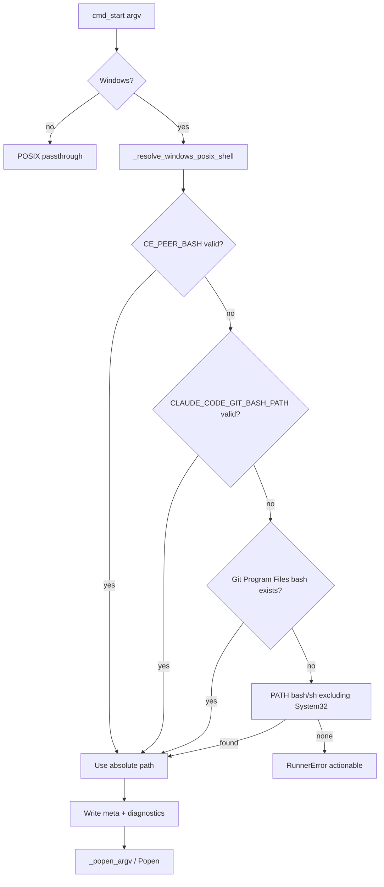

# fix: Prefer Git Bash over WSL on native Windows - Plan

## Goal Capsule

- **Objective:** On native Windows, cross-model peer workers run under Git for Windows Bash (not WSL System32 `bash`), so `jq` and the Windows Claude CLI remain visible and independent review does not skip.
- **Product authority:** Issue #1268 + session brainstorm (own only #1268; fail closed; rewrite bare `bash`/`sh`). Related Windows issues (#1251, #944, #1258, closed #1243/#1184/#1247) are context only.
- **Open blockers:** None.
- **Stop conditions:** Stop if preferring Git Bash requires weakening `authorize-dispatch` argv contracts or forcing peer-job-runner off native Windows Python.

---

## Product Contract

### Summary

Native Windows cross-model review already works when workers are launched through an explicit Git Bash path. Bare `bash` still resolves to WSL (`C:\Windows\System32\bash.exe`), which lacks Windows `jq`/`claude`, so the worker skips. Prefer Git Bash via configured path, `CLAUDE_CODE_GIT_BASH_PATH`, and standard install detection; rewrite bare `bash`/`sh` argv0; reject System32 WSL bash with an actionable error; keep the runner on native Windows Python; record the selected shell in diagnostics.

Product Contract preservation: authored in this enrichment from the confirmed brainstorm (no prior requirements-only file on disk).

### Problem Frame

After #1243/#1248, `peer-job-runner.py` detaches correctly on native Windows Python. Shell selection still uses `shutil.which("bash")`, which prefers System32 WSL. Review skills launch as `bash script.sh`; `cmd_start` resolves that bare name before spawn, so WSL is baked into argv. Explicit `C:\Program Files\Git\bin\bash.exe` succeeds end-to-end.

### Requirements

- R1. On native Windows, resolve a POSIX shell for peer workers in this order: `CE_PEER_BASH` (if set and valid), then `CLAUDE_CODE_GIT_BASH_PATH` (if set and valid), then well-known Git for Windows paths (`Git\bin\bash.exe`, `Git\usr\bin\bash.exe` under Program Files), then non-System32 `bash`/`sh` on PATH.
- R2. Never select `C:\Windows\System32\bash.exe` (or equivalent System32 WSL launcher) for native-Windows peer workers.
- R3. When only System32 bash is available (or no usable Git Bash), fail closed at `start` with an actionable error naming install Git Bash or set `CE_PEER_BASH` / `CLAUDE_CODE_GIT_BASH_PATH` — do not detach into WSL and skip.
- R4. Rewrite bare `bash` / `bash.exe` / `sh` / `sh.exe` argv0 to the preferred absolute path at start and at spawn wrap time (covers review-skill `bash script.sh` and bare `.sh` wrapping).
- R5. Keep `peer-job-runner.py` on native Windows Python; do not move detach into Git Bash or WSL.
- R6. Record the selected Bash absolute path in job diagnostics (meta and/or start/error messages) so operators can see which shell ran.
- R7. Prefer Git Bash so tools visible in that environment (`jq`, Windows Claude CLI) are what the worker's existing `command -v` checks see inside that shell; the runner does not add a separate tool probe beyond shell selection and diagnostics.
- R8. All six byte-identical `peer-job-runner.py` copies stay in lockstep after the change.

### Key Decisions

- KD1. Fail closed — no WSL fallback or opt-in. `(session-settled: user-directed — chosen over WSL opt-in or last-resort System32: silent WSL skips are the bug)` Governs R2, R3.
- KD2. Rewrite bare `bash`/`sh` argv0 to preferred absolute path. `(session-settled: user-directed — chosen over wrap-bare-.sh-only: review skills already launch as bash script.sh)` Governs R4.
- KD3. Own only #1268. `(session-settled: user-directed — chosen over including #1251/#944/#1258: coherent shell-selection slice)` Governs scope.
- KD4. Resolve shell inside the runner, not by rewriting every skill's launch prose. Governs R1, R4, R8.

### Scope Boundaries

**In scope**

- Windows shell selection in `peer-job-runner.py` (`_popen_argv`, `cmd_start` preflight/resolution)
- Env overrides `CE_PEER_BASH` and `CLAUDE_CODE_GIT_BASH_PATH`
- Unit/fixture regression with System32-before-Git-Bash PATH ordering; Windows smoke updates as needed
- Parity across the six runner copies

**Out of scope**

- CRLF packaging / #1251 residual path translation / #944 invocation audit / #1258 encoding
- Installing tools inside WSL; treating WSL as a supported native-Windows host
- Changing peer worker `.sh` review logic beyond shell selection and diagnostics
- Weakening `authorize-dispatch` contracts

### Deferred to Follow-Up Work

- Closing or residual-doc work on #1251 / #944 after shell selection lands
- Optional compound-config YAML key mirroring `CE_PEER_BASH` if product later wants non-env config

### Acceptance Examples

- AE1. Covers R1, R4, R7. Given System32 `bash.exe` precedes Git Bash on PATH, when `start` launches `bash cross-model-….sh …`, then the worker process argv0 is Git Bash and the run does not WSL-skip for missing `jq` solely due to shell choice.
- AE2. Covers R2, R3. Given only System32 bash on PATH and no env override / Git install, when `start` is invoked with a `.sh` worker or bare `bash` prefix, then start fails closed with an actionable message (no detach).
- AE3. Covers R1. Given `CLAUDE_CODE_GIT_BASH_PATH` or `CE_PEER_BASH` pointing at a valid Git Bash, when PATH would otherwise prefer System32, then that configured path is selected and named in diagnostics.
- AE4. Covers R5, R8. Given the fix, when parity and Windows unit/smoke gates run, then all runner copies match and native Windows Python detach path remains unchanged.

---

## Planning Contract

### Assumptions

- "Configured Bash path" for this repo is `CE_PEER_BASH` (new, peer-runner-local) plus Claude Code's existing `CLAUDE_CODE_GIT_BASH_PATH`; no compound YAML key in this slice.
- Valid override paths must exist as files; invalid overrides fall through to the next candidate rather than silently using System32.
- `authorize-dispatch` for ce-work stores bare adapter `.sh` in meta (no bash prefix); spawn-time wrap stays invisible to that contract. Review skills may store rewritten absolute bash in `worker_argv` after start resolution — acceptable.
- Thorough testing means unit/fixture PATH-order cases are mandatory; live Windows smoke extends only where it can assert selection without requiring a fake System32 binary on CI.

### Key Technical Decisions

- KTD1. Centralize Windows POSIX-shell resolution in one helper used by `cmd_start` and `_popen_argv`. Reject normalized paths under `%SystemRoot%\System32\` (case-insensitive) for bash/sh. Precedence per R1.
- KTD2. In `cmd_start`, when argv0 basename is bash/sh (or which/abspath lands on System32 bash), replace with the preferred absolute path before writing `meta.json` and before detach — so CreateProcess never inherits WSL from PATH.
- KTD3. In `_popen_argv`, when wrapping bare `.sh` or when head is bare bash/sh, use the same helper; do not trust raw `shutil.which("bash")`.
- KTD4. Edit canonical `skills/ce-doc-review/scripts/peer-job-runner.py`, then copy byte-identical to the other five consumers; parity test remains the gate.
- KTD5. Extend `tests/fixtures/peer-job-runner-unit.py` with mocked PATH/which ordering (System32 before Git Bash); keep smoke on real Win32 without depending on installing a fake System32 bash.

### High-Level Technical Design

Resolution order (directional):

1. `CE_PEER_BASH` if set and is an existing file
2. `CLAUDE_CODE_GIT_BASH_PATH` if set and is an existing file
3. Well-known Git Bash locations
4. `which`/`PATH` candidates whose resolved path is not System32 WSL launcher
5. Else fail closed

### System-Wide Impact

- **End users (native Windows Codex/PowerShell):** cross-model independent pass can run when Git Bash is installed.
- **Implementers:** must keep six runner copies identical.
- **CI:** `windows-native` job already runs unit + smoke + parity; extend unit fixture assertions.

### Risks & Dependencies

- Risk: absolute bash in meta changes observability for review skills — mitigate by documenting diagnostics field.
- Risk: well-known path list misses portable Git installs — mitigate with env overrides first.
- Dependency: Git for Windows installed for happy path; fail-closed otherwise (KD1).

---

## Implementation Units

### U1. Windows POSIX shell resolver + start/spawn wiring

**Goal:** Prefer Git Bash, reject System32 WSL bash, rewrite bare bash/sh, fail closed with diagnostics.

**Requirements:** R1–R7

**Dependencies:** None

**Files:**

- Modify: `skills/ce-doc-review/scripts/peer-job-runner.py` (canonical)
- Modify: `skills/ce-code-review/scripts/peer-job-runner.py`
- Modify: `skills/ce-pov/scripts/peer-job-runner.py`
- Modify: `skills/ce-work/scripts/peer-job-runner.py`
- Modify: `skills/ce-plan/scripts/peer-job-runner.py`
- Modify: `skills/ce-brainstorm/scripts/peer-job-runner.py`
- Test: `tests/fixtures/peer-job-runner-unit.py`
- Test: `tests/skills/peer-job-runner.test.ts` (only if the driver needs new case names)

**Approach:**

1. Add a single Windows-only resolver helper implementing KTD1 / R1 order; classify System32 bash as unusable (R2).
2. Wire `cmd_start` preflight and argv0 rewrite per KTD2 (R3, R4, R6).
3. Wire `_popen_argv` wrap/prefix rewrite per KTD3 (R4).
4. Document `CE_PEER_BASH` and `CLAUDE_CODE_GIT_BASH_PATH` in the runner module docstring env list.
5. Copy the canonical file to all consumers (KTD4 / R8).

**Execution note:** Implement resolver behavior test-first in the unit fixture (failing cases for System32-first PATH and bare `bash` rewrite) before changing production code.

**Patterns to follow:**

- `tests/scratch-root-preamble-executes.test.ts` `posixShell()` candidate list for Git path fallbacks
- Existing `_popen_argv` / `PopenArgvBranch` tests
- `docs/solutions/architecture-patterns/posix-process-supervision-on-native-windows.md` (keep native Windows Python)
- `docs/solutions/workflow/reviewing-byte-duplicated-shared-assets.md` (parity)

**Test scenarios:**

- Happy path: mocked which returns System32 bash first and Git Bash second; resolver returns Git Bash path.
- Happy path: `CE_PEER_BASH` set to a fake Git Bash path that exists; selected over PATH System32.
- Happy path: `CLAUDE_CODE_GIT_BASH_PATH` set when `CE_PEER_BASH` unset; selected over PATH System32.
- Happy path: `_popen_argv` bare `.sh` wraps with preferred Git Bash, not System32.
- Happy path: `_popen_argv` / `cmd_start` rewrite `["bash", "script.sh", …]` so argv0 is preferred absolute Git Bash.
- Edge: override path set but missing file — fall through to next candidate, never System32.
- Edge: non-Windows — resolver unused; argv passthrough unchanged.
- Error: only System32 bash available — `RunnerError` with actionable text mentioning Git Bash / `CE_PEER_BASH` / `CLAUDE_CODE_GIT_BASH_PATH`.
- Integration: `cmd_start` preflight fails closed before detach when no usable shell (no job left running).
- Covers AE3: diagnostics/meta include selected bash absolute path when resolution succeeds.

**Verification:** Unit fixture cases above green; module docstring lists the new env knobs; six files still byte-identical after copy.

---

### U2. Thorough regression harness + Windows smoke alignment

**Goal:** Lock the System32-before-Git-Bash regression and keep CI Windows gates honest.

**Requirements:** R2, R3, R4, R8; AE1, AE2, AE4

**Dependencies:** U1

**Files:**

- Modify: `tests/fixtures/peer-job-runner-unit.py`
- Modify: `tests/fixtures/peer-job-runner-windows-smoke.py` (only if current `which("bash")` assumptions break or a safe selection assertion can be added)
- Test: `tests/peer-job-runner-parity.test.ts` (must remain green; no logic change expected)
- Reference: `.github/workflows/ci.yml` `windows-native` job (no change unless a new test file must be invoked)

**Approach:**

1. Expand unit fixture with dedicated tests for precedence, System32 rejection, bare-prefix rewrite, and fail-closed messaging (complete any gaps left from U1).
2. Update Windows smoke bare-`.sh` wrap assertion to tolerate/prefer Git Bash absolute path without requiring WSL.
3. Confirm parity test still asserts byte-identity across consumers.

**Execution note:** Prefer deterministic mocks in the unit fixture for PATH ordering; do not require CI to plant a fake System32 `bash.exe`.

**Patterns to follow:** Existing `PopenArgvBranch` mock style; CI `windows-native` steps.

**Test scenarios:**

- Covers AE1: System32 appears before Git Bash in mocked which order; wrap/rewrite selects Git Bash.
- Covers AE2: only System32 candidate; start/`_popen_argv` raises actionable `RunnerError`.
- Covers AE4: after copying U1, `bun test tests/peer-job-runner-parity.test.ts` passes.
- Smoke (when bash present on windows-latest): bare `.sh` worker still starts successfully through resolved Git Bash (or skip only if no Git Bash — should be rare on `windows-latest`).
- Edge: explicit absolute non-System32 bash prefix left as-is (already preferred).
- Error: empty `CE_PEER_BASH` / whitespace treated as unset.

**Verification:** Local/CI unit fixture + parity green; Windows smoke green on `windows-native`.

---

## Verification Contract

- Unit: `python tests/fixtures/peer-job-runner-unit.py` (use `python`, not `python3`, on Windows).
- Parity: `bun test tests/peer-job-runner-parity.test.ts`
- Skills driver (if touched): `bun test tests/skills/peer-job-runner.test.ts`
- Windows CI job `windows-native`: unit fixture + Windows smoke + parity (existing workflow).

## Definition of Done

- [ ] R1–R8 satisfied; KD1–KD4 honored
- [ ] U1–U2 complete with listed test scenarios
- [ ] Six `peer-job-runner.py` copies byte-identical
- [ ] No WSL System32 bash selected on native Windows; fail closed when Git Bash unavailable
- [ ] AE1–AE4 demonstrable via unit/parity (and smoke where applicable)
- [ ] Issue #1268 addressable by the PR description

## Sources & Research

- Origin: https://github.com/EveryInc/compound-engineering-plugin/issues/1268
- Context (not in scope): #1251 (LF pin #1263), #944, #1258; closed #1243/#1248, #1184, #1247; #1285 Git Bash scratch-root
- Prior plan: `docs/plans/2026-07-23-001-feat-peer-job-runner-windows-native-plan.md`
- Learnings: `docs/solutions/architecture-patterns/posix-process-supervision-on-native-windows.md`, `docs/solutions/conventions/resolve-python-interpreter-not-python3.md`, `docs/solutions/conventions/shell-primitives-must-be-executed-not-shape-checked.md`, `docs/solutions/workflow/reviewing-byte-duplicated-shared-assets.md`
- Precedent: `tests/scratch-root-preamble-executes.test.ts` Git Bash candidate fallback
