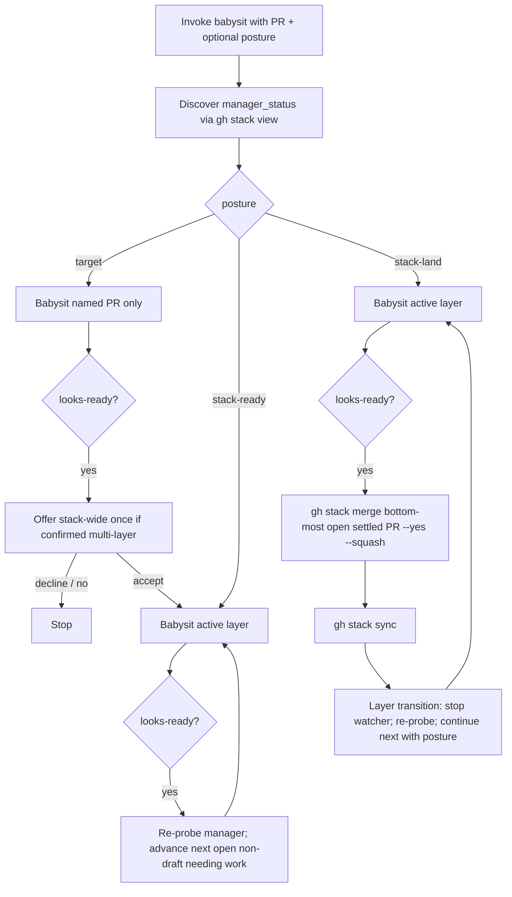
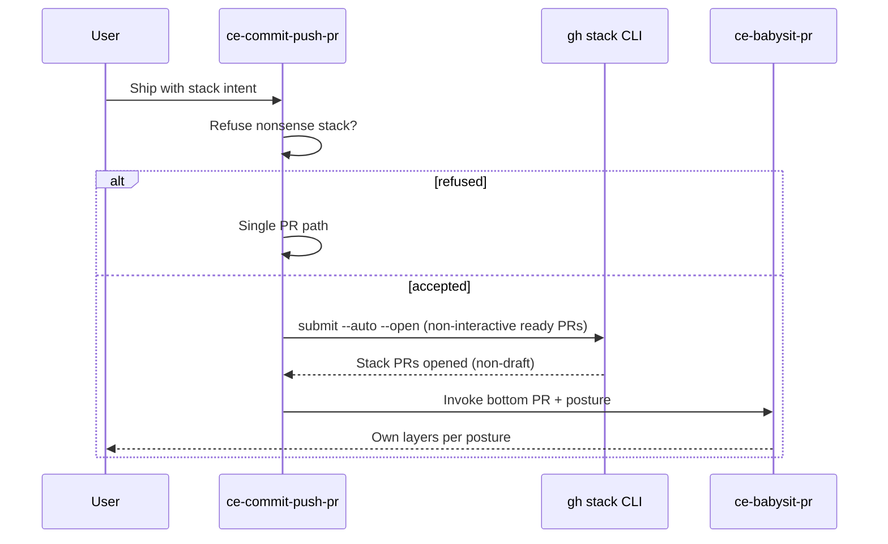

# feat: Stack posture in ce-babysit-pr + opt-in stack mode in ce-commit-push-pr

## Goal Capsule

- **Objective:** Agents can own a managed GitHub PR stack with far less human scheduling by adding explicit babysit stack postures and an opt-in stack ship path on the existing commit-push-pr entry point — slim skill wording and command recipes, not a new orchestrator or FSM.
- **Authority:** Session-settled KD1–KD7 (handoff labeled them D1–D7); friction themes Fr1–Fr4, Fr12 as v1 drivers; existing babysit never-merge / confirmed-manager contracts remain unless `posture:stack-land` is selected (that selection is land authorization).
- **Stop when:** Posture enum is load-bearing in babysit; commit-push-pr can submit a stack and hand off with posture; mechanical contract tests pin greppable invariants; skill docs reflect the behavior; AE1–AE6 skill-eval scenarios exist with recorded critical-path eval evidence; phase-2 bot-noise/reliability items stay deferred.
- **Out of scope for this run:** New `ce-stack-own` skill; hard plugin dependency on the external gh-stack skill package; proactive stack suggestions; auto-merge by default; nugget product code; Fr5/Fr8/Fr9/Fr15 reliability work.

---

## Product Contract

### Summary

Plan and implement v1 skill-prose changes so agents can own managed GitHub PR stacks: postures `target` / `stack-ready` / `stack-land` in `ce-babysit-pr`, and intent-gated stack mode on `ce-commit-push-pr` that submits via `gh stack` and hands off babysit with the right posture.

### Problem Frame

Capability already exists in pieces — babysit detects confirmed managed stacks, maintains upstack after push, and can continue stack-wide after an offer — but defaults and narrative keep agents target-local. Shipping a stack via raw `gh stack submit` skips the commit-push-pr babysit handoff (Fr1). Users become the scheduler between layers (Fr2). Merge uses `gh stack merge` not `gh pr merge` (Fr3). Settled layers are merge-ready while still open; merge is only for landing (Fr12 / KD4 clarification). Product stack #1988 on nugget proved the workflow; the gap is skill contracts, not application code.

### Requirements

- R1. `ce-babysit-pr` holds one posture for the invocation/run: `target` | `stack-ready` | `stack-land`, carried in a distinct argument carrier that does not collide with `watch` / `checkpoint` / `mode:pipeline`.
- R2. `target` babysits only the named PR; stops at looks-ready; may offer stack-wide once when a confirmed multi-layer managed stack needs work; does not auto-advance. That one-time offer expands semantic babysit scope on an already confirmed managed stack — it is not a proactive suggestion to create or adopt PR stacks (forbidden on commit-push-pr per R9/KD2).
- R3. `stack-ready` after the active layer settles (looks merge-ready while still open) automatically continues to the next open non-draft upstack layer that needs work; never merges; persists posture for the run without re-asking each layer (re-state posture on every `--continue-invocation` layer transition).
- R4. Selecting or handing off `posture:stack-land` **is** the run-level land authorization for that invocation. After settle, merge the **bottom-most open settled** PR via `gh stack merge <that-PR> --yes --squash` (CLI merges the full stack prefix through that PR atomically — never merge an upstack active PR while downstack PRs remain open when single-prefix landing is intended), then `gh stack sync`, then continue to the next open non-draft needing work. One land authorization covers successive prefix landings until stop, revoke, or demotion out of `stack-land`.
- R5. Settled ≠ merged: agents must not require merge to babysit the next layer.
- R6. `target` and `stack-ready` retain the never-merge boundary; ready summaries for managed stacks print the exact `gh stack merge` command when not auto-merging. Under `stack-land`, do not print-and-wait — execute the authorized prefix merge.
- R7. Posture selection uses agent judgment on user intent (and standing preference when present): named one PR / no stack language → default `target`, but if confirmed multi-layer managed stack ask once (target vs whole stack to ready); intent to own/finish the stack → `stack-ready`; intent to land/merge when green → `stack-land` (that selection authorizes landing). Prefer intent over keyword regex.
- R8. Managed-stack discovery (`manager_status == "confirmed"`) and manager-owned upstack maintenance after push remain; posture governs semantic advance and merge authorization, not whether discovery runs.
- R9. `ce-commit-push-pr` gains opt-in stack mode only when user intent or standing preference wants a stack; refuse stacks that don’t make sense (one logical change, artificial slices); do not proactively suggest stacks.
- R10. Stack mode orchestrates `gh stack` CLI (non-interactive recipes) and babysit handoff with posture; reuse existing PR description guidance for titles/bodies — do not invent stack-specific auto-title quality (Fr11 stays deferred). It does not reimplement the babysit watch loop.
- R11. Soft-depend on `gh stack` CLI availability; degrade with a clear error/residual if missing or stacks unavailable (e.g. exit code 9); no hard dependency on the external gh-stack skill package. Stack intent is **required** when the user explicitly demanded a multi-PR stack or standing preference forces stacks (hard-stop on missing CLI); otherwise stack mode is **soft** (single-PR fallback after residual).
- R12. After successful stack submit with ready (non-draft) PRs, auto-start `ce-babysit-pr` on the bottom open non-draft PR with the posture implied by ship intent (`stack-ready` by default; `stack-land` when land intent is explicit), unless `babysit:off` / existing skip rules apply. Draft-only submit outcomes are a hard residual / reopen step before babysit when babysit is on — never treat drafts as successful stack-ship completion.
- R13. Slim field-guide style: short decision contract + command card + agent judgment; stack CLI recipes live in per-skill `references/` behind a load stub; always-on posture routing stays inline in SKILL.md.
- R14. User-facing skill docs for both skills (and catalog blurbs if purpose text changes) stay in sync with the new behavior.

### Actors

- A1. Coding agent running CE skills (primary operator).
- A2. Human author who authorizes stack intent, posture, and landing.
- A3. GitHub Stacks manager (`gh stack`) as external CLI adapter.

### Key Flows

- Flow1. Target-only babysit on a managed-stack member → settle → optional one-time stack-wide offer → stop if declined.
- Flow2. Stack-ready ownership → settle layer N → checkout/continue layer N+1 without user re-prompt → never merge.
- Flow3. Continue-without-merge → bottom open PR looks ready; agent babysits upstack while bottom remains OPEN.
- Flow4. Ship with stack intent → refuse or submit (ready/non-draft) → babysit bottom with posture.
- Flow5. `stack-land` → after settle, merge bottom-most open settled PR (prefix through that PR) via `gh stack merge` + sync → continue.

### Acceptance Examples

- AE1. When user babysits one PR with no stack language on a multi-layer confirmed stack, posture is `target` (or one ask), and the run does not auto-advance after looks-ready if declined.
- AE2. When user says own/babysit the whole stack, after layer 1 looks-ready the agent continues layer 2 without merge and without re-asking posture.
- AE3. When two stack PRs are open and the bottom looks ready, `stack-ready` babysits the top while the bottom remains OPEN.
- AE4. When commit-push-pr runs with clear stack intent, it uses non-interactive `gh stack submit --auto --open` (or equivalent ready path) and hands off babysit on the bottom with `stack-ready` (or `stack-land` if land intent).
- AE5. When user asks for a stack on a one-line fix, the agent refuses and uses a single PR.
- AE6. When posture is `stack-ready`, the agent never calls `gh stack merge` unless the user later selects `stack-land` (or otherwise explicitly authorizes landing).

### Scope Boundaries

#### In scope (v1)

- Posture contract + routing in `ce-babysit-pr`
- Opt-in stack mode + babysit handoff in `ce-commit-push-pr`
- Slim stack command cards under each skill’s `references/`
- Mechanical contract-test pins
- Skill catalog / docs pages for the two skills
- Documented skill-eval scenarios for AE1–AE6

#### Deferred to Follow-Up Work

- Bot status silent-drop / batch mark (Fr5)
- Dedupe identical review threads on long-lived upstack PRs (Fr15)
- Watch network retry (Fr8)
- Cancel orphan watches when PR MERGED (Fr9/B13)
- Fix upstream tracking after `gh pr checkout` (B10)
- Upstack push timeout/retry helper (B11)
- Auto-title quality on stack submit (Fr11)
- Standing config key for stack preference (intent-only for v1 unless an existing preference surface already exists)

#### Outside this product’s identity

- Replacing or wrapping `gh stack` with a CE-owned stack manager
- Auto-merge by default inside babysit
- Proactive “you should use a PR stack” suggestions
- Implementing skill work in nugget (or any app) product PRs

### Key Decisions

- KD1. Extend `ce-commit-push-pr` for ship; do not create `ce-stack-own`. (session-settled: user-directed — chosen over a separate orchestrator skill: discovery cost)
- KD2. Stacks are opt-in by intent/preference; refuse nonsense stacks. (session-settled: user-directed — chosen over proactive suggestion)
- KD3. Soft-depend on `gh stack` CLI only. (session-settled: user-directed — chosen over hard plugin dep on the gh-stack skill package)
- KD4. Three postures; settled ≠ merged; `stack-land` is the only merge-authorized babysit posture. (session-settled: user-approved — chosen over merge-to-advance or a full FSM)
- KD5. Merge stays high-impact and explicit. (session-settled: user-directed — chosen over auto-merge in the loop)
- KD6. Slim field-guide + references command card. (session-settled: user-approved — chosen over large transition tables)
- KD7. Phase bot-noise/reliability to later. (session-settled: user-approved — chosen over bundling Fr5/Fr8/Fr9/Fr15 into v1)

### Sources

- Handoff brief (machine-local capture; decisions D1–D7 → plan KD1–KD7)
- Friction log themes Fr1–Fr4, Fr12 (v1); Fr5/Fr8/Fr9/Fr15 deferred
- Living contracts: `skills/ce-babysit-pr/SKILL.md`, `skills/ce-babysit-pr/references/watch-loop.md`, `skills/ce-commit-push-pr/SKILL.md`
- `docs/solutions/skill-design/portable-agent-skill-authoring.md`
- `docs/solutions/skill-design/git-workflow-skills-need-explicit-state-machines.md`
- `docs/solutions/skill-design/context-absent-skill-handoff-needs-pinned-invocation.md`
- `docs/solutions/skill-design/post-menu-routing-belongs-inline.md`
- `docs/solutions/skill-design/validate-skill-prose-behavior-with-cross-host-evals.md`
- `docs/solutions/workflow/stale-local-base-contamination.md`

---

## Planning Contract

### Key Technical Decisions

- KTD1. Use a distinct posture carrier (`posture:target|stack-ready|stack-land`) on **babysit’s** argument surface so it cannot be parsed as `watch` / `checkpoint` / duration / `mode:pipeline`. commit-push-pr does **not** add `posture:` to its argument-hint; it derives posture from ship/land intent and passes it only on the `ce-babysit-pr` handoff invocation. (Governs R1)
- KTD2. Keep manager discovery and Step 7 upstack maintenance as today; posture only selects semantic continuation and whether merge is in the mutation envelope. Opt-in-by-intent does **not** disable confirmed-manager detection. (Governs R8; resolves research tension with R9)
- KTD3. Carve `stack-land` as the sole exception to babysit’s never-merge boundary: selecting `posture:stack-land` is run-level land authorization. `target`/`stack-ready` never merge. Under `stack-land`, after settle merge the **bottom-most open settled** PR via `gh stack merge` + `gh stack sync` (CLI prefix semantics), then treat the just-merged PR’s MERGED state as a **managed-stack layer transition** (stop watcher, re-probe, `--continue-invocation` onto the next open non-draft needing work with posture restated) — not a run-level Terminal stop. Distinguish that from externally observed MERGED/CLOSED on a layer this run did not just land. Widen contract tests accordingly rather than deleting never-merge pins. (Governs R4, R6; session-settled KD4/KD5)
- KTD4. Field-guide form with **explicit state re-probes at each layer transition** (fresh `gh stack view --json` / manager_status, draft boundary, needs-human stop) — not a narrative FSM table, and not prose that skips re-checks after transitions (`git-workflow-skills-need-explicit-state-machines.md`). (Governs R13; session-settled KD6)
- KTD5. Extract CLI recipes to per-skill `references/stack-*.md` (duplicate across skills — no cross-skill imports); keep posture decision table, merge authorization, and handoff ownership inline with a 1–3 line load stub. Forbidden on managed members: `gh pr merge`. (Governs R10, R13)
- KTD6. commit-push-pr stack mode wraps an existing user-directed / confirmed local `gh stack` topology — it does not invent commit-splitting. Probe `gh stack`; on success use `gh stack submit --auto --open` (ready/non-draft); draft-only outcomes are a hard residual before babysit. On missing CLI: soft intent → residual + single-PR fallback; required stack intent → hard-stop. Any explicit new upstack branch the user already directed bases from `origin/<parent>` after fetch. (Governs R9–R12)
- KTD7. Babysit handoff from stack submit passes PR URL **plus** posture (and stack-wide scope for `mode:pipeline`). Completion gate unchanged: success = `ce-babysit-pr` started. Default stack-ship posture is `stack-ready`; mint `stack-land` only when land intent is explicit. (Governs R12; session-settled KD1)
- KTD8. Verification split: greppable mechanical contracts in existing test files; AE1–AE6 as skill-creator / skill-eval scenarios (required for prose behavior; not faked as whole-skill string snapshots). Update `docs/skills/ce-babysit-pr.md` and `docs/skills/ce-commit-push-pr.md` (+ catalog blurbs if inventory text changes). No skill-count bump. (Governs R14; unanswered synthesis call-outs defaulted on confirm)

### Assumptions

- User confirmation of scope without answering the two call-outs defaults docs-in-scope and mechanical+eval verification (recorded here).
- No new `.compound-engineering` config key for stack preference in v1; standing preference means project instructions or existing auto_babysit-style surfaces only if already present.
- `pr-snapshot` script already soft-deps `gh stack view`; v1 does not require script changes unless a greppable posture field must be emitted (defer unless implementation discovers a hard need).

### High-Level Technical Design

Posture as scope over the existing single-watcher lifecycle:

Ship handoff:

### Patterns to Follow

- Existing babysit Step 1 stack routing and Step 7 upstack rebase/push
- commit-push-pr babysit completion gate (`tests/commit-push-pr-contract.test.ts`)
- Reference extraction: `watch-loop.md` load stub; `ce-test-browser` command-card style
- Soft CLI probe degrade pattern (agent-browser / missing capability residuals)
- Mechanical pin style: smallest falsifiable tokens in `tests/ce-babysit-pr-contract.test.ts`

### Risks & Dependencies

| Risk | Mitigation |
| --- | --- |
| `stack-land` name implies silent auto-merge | Envelope + AE6 + contract pins; `stack-land` is explicit land auth; print merge command only under target/stack-ready |
| Posture token collides with watch/checkpoint | KTD1 babysit-only `posture:` carrier; ship derives posture for handoff |
| `gh stack merge` lands a prefix, not one isolated upstack PR | Always merge bottom-most open settled PR; never merge active upstack while downstack open |
| Just-merged PR trips Terminal MERGED stop | Same-transition advance after land; do not re-enter watch on merged target |
| Opt-in misread as “disable discovery” | KTD2; discovery stays for safety |
| Handoff omits posture → silent target-local | KTD7; pipeline must pass scope args |
| Missing `gh stack` mid stack-land | Hard residual; never invent managed membership from topology |
| SKILL.md bloat undoes slim goal | KTD5 extract recipes; keep decision table short |

---

## Implementation Units

### U1. Babysit posture contract and routing

**Goal:** Make `target` / `stack-ready` / `stack-land` impossible to miss in `ce-babysit-pr`, including continue-without-merge and the `stack-land` merge carve-out.

**Requirements:** R1–R8, R13

**Dependencies:** None

**Files:**
- Modify: `skills/ce-babysit-pr/SKILL.md`
- Modify: `skills/ce-babysit-pr/references/watch-loop.md` (layer-transition / continuation seams only as needed)
- Create: `skills/ce-babysit-pr/references/stack-commands.md` (or equivalent slim command card)

**Approach:**
1. Extend babysit `argument-hint` with `posture:target|stack-ready|stack-land`.
2. Add a short inline posture decision table near Outcome / Step 1; keep selection judgment and “settled ≠ merged” there.
3. Wire stop / transition prose: `stack-ready` auto-advances after settle; `target` offers once (babysit-scope only, not create-stack suggestion); `stack-land` after settle merges bottom-most open settled PR then syncs then continues.
4. Update mutation envelope / non-negotiables so never-merge applies to `target` and `stack-ready`; `stack-land` may merge via `gh stack merge` + sync with prefix-endpoint rule.
5. After an authorized land, treat MERGED on the just-landed PR as a layer transition (stop watcher, re-probe, continue) — not Terminal run stop.
6. Add load stub to the command card; card holds rebase/push/view/merge/sync recipes and forbids `gh pr merge` on managed members.
7. On every managed-stack layer transition, re-state posture alongside existing `--continue-invocation` / budget / dead-time flags (do not invent new wrapper scripts).

**Patterns to follow:** Existing Step 1 stack-wide continuation; `post-menu-routing-belongs-inline.md`; confirmed-manager only.

**Test scenarios:** Covered mechanically in U3; behavioral AE1–AE3, AE6 in U5.

**Verification:** SKILL.md states all three postures, continue-without-merge, prefix merge rule, land→transition (not Terminal), and posture restated on continue; command card loads only behind the stub; watch/checkpoint/`mode:pipeline` semantics unchanged.

### U2. commit-push-pr opt-in stack mode and babysit handoff

**Goal:** One ship entry point can create/submit a stack when intent wants it, then hand off babysit with posture.

**Requirements:** R9–R13

**Dependencies:** U1 (posture vocabulary must exist for handoff)

**Files:**
- Modify: `skills/ce-commit-push-pr/SKILL.md`
- Create: `skills/ce-commit-push-pr/references/stack-submit.md` (or equivalent)
- Modify: `skills/ce-commit-push-pr/references/branch-creation.md` only if stack-on-parent base rules need a pointer

**Approach:**
1. Document intent gate + refuse-nonsense rule; no proactive stack suggestions; no `posture:` on this skill’s argument-hint.
2. Soft-probe `gh stack`; degrade per KTD6 soft-vs-required criteria.
3. Wrap existing local stack topology only — do not invent commit-splitting; hard-stop/refuse when topology absent or nonsense.
4. Non-interactive submit via `gh stack submit --auto --open`; reuse existing PR description guidance (Fr11 deferred); draft-only submit → residual before babysit.
5. After ready submit, hand off `ce-babysit-pr` on bottom open non-draft with derived posture args; honor `babysit:off` and existing skip rules.
6. Load stub to stack-submit command card; duplicate CLI recipes as needed (no import from babysit skill).

**Patterns to follow:** Existing Step 5 babysit completion gate; `context-absent-skill-handoff-needs-pinned-invocation.md`; `origin/<parent>` base creation for user-directed new upstack branches only.

**Test scenarios:** Covered mechanically in U3; behavioral AE4–AE5 in U5.

**Verification:** Stack path cannot finish by reporting PR URLs alone when babysit is on; posture is present on the handoff invocation; refuse path stays single-PR; draft submit cannot count as success with babysit on.

### U3. Mechanical contract tests

**Goal:** Pin greppable posture, never-merge carve-out, handoff, and forbid-`gh pr merge` invariants so regressions fail in CI.

**Requirements:** R1, R6, R12

**Dependencies:** U1, U2

**Files:**
- Modify: `tests/ce-babysit-pr-contract.test.ts`
- Modify: `tests/commit-push-pr-contract.test.ts`
- Modify: `tests/pipeline-review-contract.test.ts` only if handoff/`mode:pipeline` stack-scope strings change
- Modify: `tests/skills/user-facing-skill-invocation-rendering.test.ts` only if rendered invocation examples gain posture

**Approach:**
1. Widen existing describes with smallest tokens: posture enum strings, `stack-ready` never merges, `stack-land` + bottom-most settled `gh stack merge` + sync + continue-transition, handoff passes posture, soft vs required missing-CLI paths, `--auto --open`, refuse-stack intent language as needed.
2. Do not snapshot whole skill bodies.

**Execution note:** Prefer extending existing contract files over new suites.

**Test scenarios:**
- Happy: babysit SKILL contains `posture:target`, `stack-ready`, `stack-land` and continue-without-merge clarification.
- Happy: `stack-ready` path still asserts never-merge; `stack-land` asserts `gh stack merge` + sync language.
- Happy: commit-push-pr documents stack intent gate and babysit handoff with posture.
- Edge: managed-member forbid `gh pr merge` appears in command card or SKILL.
- Integration: pipeline seam still names `ce-babysit-pr` / `mode:pipeline` correctly if touched.

**Verification:** Targeted contract files green; full `bun run test` green after skill edits.

### U4. Skill docs and catalog blurbs

**Goal:** User-facing docs match the new postures and ship stack mode.

**Requirements:** R14

**Dependencies:** U1, U2

**Files:**
- Modify: `docs/skills/ce-babysit-pr.md`
- Modify: `docs/skills/ce-commit-push-pr.md`
- Modify: `docs/skills/README.md` and/or root `README.md` inventory rows only if purpose text changes

**Approach:** Update purpose / when-to-use / novel mechanics for postures and opt-in stack ship; keep merge-stays-user’s-call framing accurate for `stack-land` (authorized land vs default never-merge). No skill-count bump.

**Test expectation:** none -- documentation-only; release metadata count unchanged.

**Verification:** Docs describe postures and opt-in stack mode; inventory rows not stale.

### U5. Skill-eval scenarios for acceptance examples

**Goal:** Behavioral coverage for AE1–AE6 that mechanical greps cannot prove.

**Requirements:** AE1–AE6; R5, R7, R9

**Dependencies:** U1, U2

**Files:**
- Prefer: skill-creator scenario pack / PR-body scenario list for AE1–AE6
- Do not create a new eval harness, fake-CLI stack, or durable fixture layout in this run

**Approach:** Author concise skill-creator scenarios for AE1–AE6 (target offer, stack-ready advance without merge, continue-without-merge, ship stack handoff with `--auto --open`, refuse nonsense stack, stack-ready never merges). Run via skill-creator; treat failures as prose fixes at the owning layer. If no in-repo fixture path fits, list scenarios in the PR body and record eval evidence there.

**Execution note:** Behavioral eval is required evidence for prose changes; do not claim v1 done on greps alone.

**Test scenarios:**
- Covers AE1–AE6 as named agent scenarios with expected posture/merge/handoff outcomes.
- Edge: missing `gh stack` under stack intent → clear residual, no invented manager.

**Verification:** Scenario pack exists and at least one host eval pass is recorded for the critical paths (stack-ready continue-without-merge; refuse stack; no merge under stack-ready).

---

## Verification Contract

- Mechanical: `bun test tests/ce-babysit-pr-contract.test.ts`, `bun test tests/commit-push-pr-contract.test.ts`, and any touched pipeline/invocation tests; then `bun run test` before merge.
- If agents/skills/docs inventory text changed: `bun run release:validate`.
- Behavioral: skill-creator / skill-eval for AE1–AE6 (U5); green `bun test` alone is not sufficient for multi-step stack protocol prose.
- Manual smoke (optional): dry-reason the six acceptance scenarios against the edited SKILL.md before eval.

## Definition of Done

- All units U1–U5 complete or explicitly waived by the user.
- R1–R14 satisfied in skill prose and docs.
- Contract tests pin posture + merge carve-out + handoff.
- AE1–AE6 have eval scenarios; critical paths have recorded eval evidence.
- Deferred Fr5/Fr8/Fr9/Fr15 items remain out of the diff.
- Abandoned experiment prose removed; no new orchestrator skill; no FSM transition-table skill body.
- Abandoned-attempt code/prose from rejected approaches (separate stack-own skill, keyword-only intent, auto-merge default) not left in the tree.

---

## Appendix

### Friction → requirement map (v1)

| Friction | Requirement |
| --- | --- |
| Fr1 submit without babysit | R12 |
| Fr2 human scheduler | R3, R7 |
| Fr3 wrong merge primitive | R6, command card |
| Fr4 upstack maintain | R8 (preserve) |
| Fr12 merge authorization | R4, R5, R6 |

### Failed approaches (do not retry)

1. New peer skill `ce-stack-own` as primary UX
2. Hard plugin dependency on gh-stack skill package
3. Proactive stack suggestions
4. Auto-merge by default inside babysit
5. Full FSM / transition diagram as the skill body
6. Implementing only in nugget app code
7. Keyword regex as sufficient stack intent
8. `gh pr merge` on managed stack members
