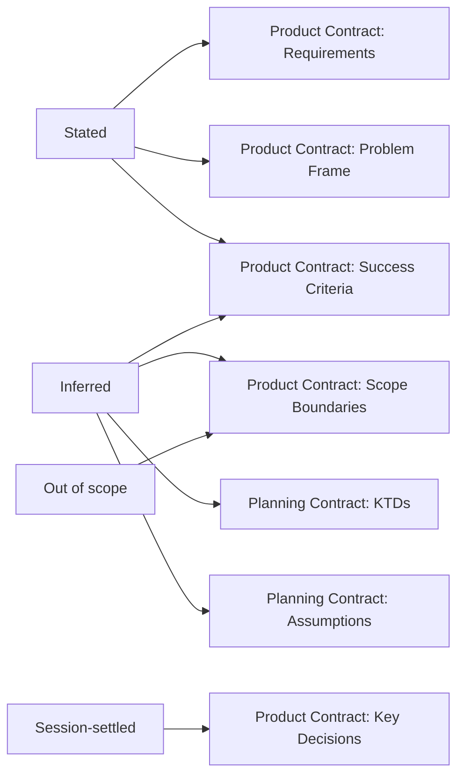

# Product Contract Section Catalog - Plan

## Goal Capsule

- **Objective:** Give `ce-plan` both halves of what makes `ce-brainstorm` produce complete Product Contracts — an include-when-material catalog for its product sections, and a bootstrap exit condition that will not proceed until that content is known or recorded as assumptions.
- **Product authority:** This plan governs `ce-plan`'s Product Contract section catalog, its Phase 0.4 bootstrap exit condition, and the scoping-synthesis routing destinations in `ce-plan` and `ce-brainstorm`. It does not change what the scoping synthesis gathers, the call-out keep test, or the Product Contract hard floor.
- **Execution profile:** Skill-prose change across two skills' reference files and `ce-plan/SKILL.md`, plus mechanical guards in the existing test suites and one behavioral eval. No CLI or converter code.
- **Open blockers:** None.
- **Tail ownership:** Implementation owns the reference edits, the test additions, the cross-host behavioral eval, and `bun run test`.

---

## Product Contract

### Summary

`ce-plan` gains include-when-material catalog entries for the Product Contract sections it currently has none for — Problem Frame, Key Decisions, Success Criteria, Actors, and Key Flows — each with a firing test, and with a skip test where one is warranted. Secondarily, the scoping-synthesis routing statements in both skills gain a Success Criteria destination, and the headless routing list gains a Problem Frame destination, so the routing layer stops contradicting the catalog.

### Problem Frame

`ce-plan`'s include-when-material catalog (`skills/ce-plan/references/plan-sections.md:207-258`) contains eight entries: High-Level Technical Design, Scope Boundaries, Open Questions, System-Wide Impact, Risks & Dependencies, Acceptance Examples, Documentation / Operational Notes, Sources / Research. Four of those are Product Contract subsections (Scope Boundaries, Open Questions, Acceptance Examples, Sources / Research), but none of the eight covers a product-*shape* section — the ones that state what is being built and why. `ce-brainstorm`'s catalog carries all of them — Problem Frame, Key Decisions, Actors, Key Flows, Success Criteria. Each states a firing test; Actors (`:254`), Key Flows (`:259`), and Success Criteria (`:304`) also state a skip test, while Problem Frame (`:205`) and Key Decisions (`:209`) state none.

`ce-plan` therefore specifies the Planning Contract half of its own artifact and delegates the Product Contract half to a skill the solo path never consults. The Product Contract is named in one enumerating sentence at `:171-175`, with no rule for when each section applies.

Section presence across the 34 pre-existing `ce-unified-plan/v1` artifacts in `docs/plans/`, measured 2026-08-12. This plan is excluded from its own denominator:

| Section | Catalog entry | Other reinforcement | Present |
|---|---|---|---|
| Summary | no | hard floor, routing destination, Summary-vs-Problem-Frame discipline | 34/34 |
| Requirements | no | hard floor, routing destination | 34/34 |
| Scope Boundaries | yes | routing destination | 32/34 |
| Problem Frame | no | hard floor, conditional routing, discipline block | 30/34 |
| Key Decisions | no | routing destination for session-settled entries only | 19/34 |
| Success Criteria | no | hard-floor mention (`:173`), bootstrap directive (`SKILL.md:250`), solo-synthesis breadth (`:11`), Inferred bucket (`:23`) | 8/34 |

Success Criteria is named in four places and still appears in 24% of artifacts, because none of those four states *when* the section applies. That is the gap this plan closes: `ce-plan` has no firing or skip rule for its product-shape sections.

A catalog entry alone does not drive presence, and the within-skill control shows it. Across the same 34 artifacts, the eight sections that already carry a `ce-plan` catalog entry span a 12%-to-94% range:

| Section (has a catalog entry) | Present |
|---|---|
| Scope Boundaries | 32/34 |
| Sources / Research | 30/34 |
| High-Level Technical Design | 22/34 |
| Acceptance Examples | 17/34 |
| Risks & Dependencies | 11/34 |
| Open Questions | 9/34 |
| System-Wide Impact | 6/34 |
| Documentation / Operational Notes | 4/34 |

Documentation / Operational Notes has a complete firing-and-skip entry and appears in 12% of plans. With reinforcement held constant, how often a section is genuinely material dominates presence. The document-type confound is also not what it looked like: the population is 19 `feat`, 9 `fix`, 1 `refactor`, 1 `test`, 1 `docs`, so feature plans are the majority and only 7 of the 19 carry a Success Criteria heading.

The claim this plan rests on is therefore narrower than a presence prediction: **`ce-plan` is missing a rule it should have.** Whether supplying it moves presence is what U7 measures, not something the evidence already shows.

`ce-brainstorm` carries the section in 23 of 29 artifacts, but that gap is not attributable to its catalog entry alone: `ce-brainstorm/SKILL.md:273` instructs the agent to ask about success criteria, and `:281` blocks Phase 1.3 exit until they are "known or recorded as assumptions." `ce-plan`'s solo bootstrap lists success criteria as something to establish (`SKILL.md:250`) with no equivalent gate. This plan ports the rule, not the elicitation, so brainstorm-parity presence is not its predicted outcome.

The routing layer is weaker still. `ce-brainstorm`'s routing table (`skills/ce-brainstorm/references/synthesis-summary.md:269-274`) has no Success Criteria row at all. The routing statements are still internally inconsistent and worth repairing: `ce-plan`'s interactive table (`:394-407`), headless list (`:371-375`), and prose restatement (`:7`) each omit Success Criteria while `:23` files "success criteria extrapolated from intent" into the Inferred bucket, and the headless list drops the Problem Frame clause the interactive table carries.

The motivating artifacts are external to this repository — one produced through `ce-plan-bootstrap` in a separate product repo, one read through a share link — so their exact shape is not reproducible here and this plan does not rest on them. The in-repo measurements above are the evidence.

### Key Decisions

- **Repair the section contract; do not add a section for human readers.** (session-settled: user-directed — chosen over a one-page executive summary: the Product Contract's own Summary and Problem Frame serve that reader once they are present.) Governs R1-R9.
- **Product Contract content carries no derivation provenance.** (session-settled: user-directed — chosen over marking agent-inferred entries: the contract is a statement the reader corrects, and brainstorm-derived content is not annotated either.) Governs R10.
- **The Goal Capsule gains no reader-facing fields.** (session-settled: user-approved — chosen over expanding it: `ce-work` copies the capsule into every subagent unit packet, so each line is charged per worker.) Governs R11.
- **The plan template stays non-customizable.** (session-settled: user-directed — chosen over per-user sections: `ce-work`, `ce-doc-review`, and `ce-code-review` wayfind by stable heading.) Governs R11.
- **Behavioral evals drive `ce-plan` through the skip-confirmation setting.** (session-settled: user-directed — chosen over hand-run evals: `confirm:auto` makes a solo run non-blocking, so it produces an artifact with no synchronous user.) Governs R14-R15.

### Requirements

R-IDs are stable. R4 was withdrawn during review when the evidence for a missing headless `### Summary` did not hold; the gap is intentional and is not renumbered.

**Section catalog (primary fix)**

- R7. `ce-plan` carries a `Success Criteria` include-when-material entry with both a firing test and a skip test.
- R17. `ce-plan` carries include-when-material entries for `Problem Frame`, `Key Decisions`, `Actors`, and `Key Flows`. `Key Decisions`, `Actors`, and `Key Flows` each carry a firing test and a skip test; `Problem Frame` carries a firing test only, because the hard floor contains it unconditionally.
- R18. The `Key Decisions` skip test is authored for the plan context, since `ce-brainstorm` states none for it.

**Elicitation gate**

- R19. `ce-plan`'s Phase 0.4 bootstrap has an exit condition it cannot pass until the problem frame, scope boundaries, and success criteria are each known or explicitly recorded as assumptions.
- R20. The gate is satisfiable without a synchronous user: on headless and skip-confirmation paths, recording an item as an assumption satisfies its clause.
- R21. An explicit user instruction to proceed satisfies the gate, and a session-settled decision counts as already-established for every clause it covers.
- R8. Those entries use the phrasing already established on the brainstorm side rather than a second idiom.
- R16. `ce-plan` states once how `Success Metrics` (the Phase 4.1b deep-plan extension) relates to the Product Contract's `Success Criteria` subsection, introducing no third name.

**Routing consistency (secondary)**

- R1. Every Product Contract section the scoping synthesis drafts has a named destination in every routing statement that governs a production path.
- R2. `### Success Criteria` has a destination on the interactive path.
- R3. `### Success Criteria` has a destination on the headless and skip-confirmation paths.
- R5. `### Problem Frame` has a destination on the headless and skip-confirmation paths.
- R6. Named product-level Inferred items are exempt from the not-fork-material dissolve rule that currently drops them silently on the normal interactive path.
- R9. `ce-brainstorm`'s routing statement gains the same Success Criteria destination as `ce-plan`'s, as a consistency cleanup rather than a behavior repair.

**Preserved behavior**

- R10. No Product Contract entry gains a provenance marker, label, or annotation describing how it was derived.
- R11. The Goal Capsule field set, the plan section registry, and the set of top-level sections are unchanged.
- R12. `### Assumptions` keeps its existing meaning and placement under Planning Contract, covering agent-inferred bets on unconfirmed paths.
- R13. A section whose skip test fires is still omitted; no change forces a section to appear when it has no content.

R10 and R11 are whole-diff invariants verified by the Global Definition of Done rather than advanced by any single unit.

**Verification**

- R14. Mechanical guards pin the five product-section catalog entries, the routing destinations, and the frontmatter field rules that currently have no check.
- R15. A behavioral eval demonstrates that an agent emits Success Criteria when the material exists and omits it when it does not, against a pre-registered pass threshold.

### Success Criteria

- A solo `ce-plan` run over a prompt containing explicit success measures produces an artifact whose `### Success Criteria` section contains those measures.
- A solo `ce-plan` run over a prompt with no success measures produces an artifact with no `### Success Criteria` section and no placeholder prose.
- A solo `ce-plan` run over a prompt where the agent chose between real alternatives produces an artifact carrying those choices under `### Key Decisions`.
- A solo `ce-plan` run cannot reach Phase 1 with success criteria neither established nor recorded as an assumption.
- The behavioral eval's Scenario A and Scenario C pass rates improve or tie on both harnesses against the pre-change bytes, and Scenario B does not regress.
- The eval's outcome is recorded against its pre-registered threshold, including the case where the result disconfirms the catalog-entry hypothesis.

### Scope Boundaries

- Changing what the scoping synthesis gathers is excluded; the buckets and their definitions stay as they are.
- Changing the call-out keep test, the shape budgets, or the confirmation templates is excluded.
- Adding an executive summary, a reader index, or Goal Capsule reader fields is excluded.
- Making the plan template user-customizable is excluded.
- Retrofitting existing artifacts in `docs/plans/` is excluded.
- A `product-success-criteria` Section ID Registry row is excluded: the registry enumerates one Product Contract subsection today (`### Requirements`), and adding a row inflates a contract other skills must honor with no consumer asking for it.
- Adding elicitation gates beyond the Phase 0.4 bootstrap — to Phase 2's planning questions, or to the brainstorm-sourced Phase 5.1.5 path — is excluded. U8 gates the solo bootstrap only.
- Repairing artifacts that carry flat `##` headings without a `## Product Contract` wrapper is excluded. It is a real defect observed in-repo, but it is a nesting failure no section catalog or routing destination addresses; it needs its own diagnosis.

### Dependencies and Assumptions

- Measured 2026-08-12 in this repository: 9 of 35 `artifact_contract: ce-unified-plan/v1` artifacts under `docs/plans/` carry a Success Criteria heading; 23 of 29 artifacts under `docs/brainstorms/` do. `ce-brainstorm`'s routing table (`skills/ce-brainstorm/references/synthesis-summary.md:269-274`) has four rows and no Success Criteria row.
- The two `synthesis-summary.md` copies are deliberately different documents, not mirrors. Verified: `ce-plan` is `9deedd6b…`, `ce-brainstorm` is `0793f59f…`, 418 lines against 282. No parity test covers them, and none should be added by this work.
- `references/plan-sections.md` exists only in `ce-plan`. `references/markdown-rendering.md` and `references/html-rendering.md` are byte-identical across three skills and are guarded by `tests/compound-support-files.test.ts:33-59`; this work does not touch them.
- `skills/ce-plan/references/synthesis-summary.md:361` tells the headless path to "route the internal draft directly into the plan body via the doc-shape table below," so the headless bullet list at `:371-375` is a partial restatement of the interactive table rather than an independent enumeration. U2 keeps both consistent rather than relying on the delegation.

### Sources and Research

- `skills/ce-plan/references/plan-sections.md:171-175,207-258` — the hard-floor enumeration naming Success Criteria and the catalog that omits it.
- `skills/ce-brainstorm/references/brainstorm-sections.md:304-309` — the established Success Criteria entry with firing and skip tests.
- `skills/ce-plan/references/synthesis-summary.md:7,11,23,361,371-375,377,394-407` — the three ce-plan routing statements and the Inferred-bucket definition naming success criteria.
- `skills/ce-brainstorm/references/synthesis-summary.md:7,265-280` — the parallel routing statement using legacy top-level heading names.
- `skills/ce-plan/SKILL.md:627` — `Success Metrics` under Phase 4.1b Optional Deep Plan Extensions.
- `tests/skills/ce-plan-output-mode.test.ts:239-274` — the existing metadata-field test that the frontmatter guard extends.
- `tests/settled-decisions-parity.test.ts` — the content-pin pattern to mirror for a contract assertion.
- `docs/solutions/best-practices/conditional-visual-aids-in-generated-documents.md` — gate on content patterns, never size or depth; every include rule needs a matching skip rule.
- `docs/solutions/skill-design/paired-old-vs-new-injection-skill-evals.md` — blind paired arms from real pre-change bytes; add restraint negatives; seal the injection.
- `docs/solutions/skill-design/strong-models-mask-defensive-skill-fixes.md` — expect a strong model to pass the old arm; a tie is defensive value, not proof of nothing.

---

## Planning Contract

### Key Technical Decisions

- KTD9. **Port the elicitation gate, not just the rule.** `ce-brainstorm`'s Phase 1.3 exit condition (`SKILL.md:281`) blocks progress until success criteria are "known or recorded as assumptions"; `ce-plan`'s bootstrap lists the same items with no gate, so it can sail past them. The within-skill control shows a catalog entry alone does not raise presence, and the gate is the mechanism that distinguishes the two skills. Mirror its structure — clause list, OR-escape for explicit user intent, session-settled decisions counting as established — rather than authoring a second idiom. Covers R19-R21.
- KTD1. **Supply the missing rule; do not claim it will move presence.** `ce-plan` has no firing or skip rule for its product-shape sections, which is a contract gap worth closing on its own terms. It is not established that closing it raises presence — the within-skill control shows catalogued sections spanning 12% to 94%, and Documentation / Operational Notes sits at 12% with a complete entry. U1 supplies the rule; U7 measures whether it changes behavior; a null result is a real outcome, not a failure to ship. Covers R7, R17, R1-R3, R9.
- KTD8. **Port the whole product half of the catalog, not only the worst case.** Success Criteria is the most-missing section, but Key Decisions is absent from 43% of artifacts and carries the rejected alternatives a reader needs. Fixing one entry leaves the same structural gap for the rest. Covers R17.
- KTD2. **Fix all five routing statements, not the table alone.** The rule is stated at `synthesis-summary.md:7` (prose restatement), `:371-375` (headless list), and `:394-407` (interactive table) in `ce-plan`, plus `:7` and `:265-280` in `ce-brainstorm`. Editing one leaves the others as stale sources of truth. Covers R1-R3, R5, R9.
- KTD3. **Treat `Success Metrics` as a layering question, not a rename.** `SKILL.md:627` lists it under Optional Deep Plan Extensions; `plan-sections.md` lists `Success Criteria` as a Product Contract subsection. These are different catalogs at different layers. State the relationship rather than renaming and folding, which would collapse a deep-plan extension into a product section. Covers R16.
- KTD4. **Mirror the brainstorm phrasing verbatim in structure.** `brainstorm-sections.md:304-309` is the house idiom for a material-gated section. A second idiom in `ce-plan` would drift. Covers R8.
- KTD5. **Define product-level Inferred content by enumeration, not by adjective.** The three-bucket draft has no product-versus-planning axis, and `:23` files success criteria under Inferred alongside technical assumptions. Naming the specific bucket items that route to Product Contract sections makes U3 implementable and gradeable. Covers R6.
- KTD6. **Put the frontmatter guard inside the existing metadata test.** `tests/skills/ce-plan-output-mode.test.ts:239-274` already loops over required and optional field names against `plan-sections.md`. Per the right-size rule, extend it rather than adding a suite. Covers R14.
- KTD7. **Guard the contract text, not `docs/plans/` artifacts.** Nothing parses plan frontmatter today, and a doc-scanning validator would fail on legacy artifacts this plan explicitly does not retrofit. Covers R14.

### High-Level Technical Design

Two layers decide whether a Product Contract section gets written. The catalog says *when* a section applies; the routing statement says *where* drafted content lands. Only the catalog is load-bearing today.

| Product Contract section | `ce-plan` catalog entry | Interactive routing (`:394-407`) | Headless routing (`:371-375`) | After this plan |
|---|---|---|---|---|
| `### Summary` | hard floor | stage-2 summary | delegates to table | unchanged |
| `### Problem Frame` | **none** | Stated, "where relevant" | **none** | catalog entry + destination, both paths |
| `### Requirements` | hard floor | Stated | Stated | unchanged |
| `### Key Decisions` | **none** | **none** — no session-settled row | session-settled | catalog entry + interactive destination |
| `### Success Criteria` | **none** | **none** | **none** | catalog entry + destination, both paths |
| `### Actors` / `### Key Flows` | **none** | n/a — no bucket drafts them | n/a | catalog entry only |
| `### Scope Boundaries` | yes (`:221`) | Out of scope | Out of scope | unchanged |

Bucket-to-destination flow after the change:

`### Assumptions` keeps its current role: it fires on paths that proceed without confirming Inferred bets, and it holds planning-level bets. The named product-level inferences in KTD5 reach their product sections directly.

### Implementation Constraints

- Skill prose admission rules apply: each added line must state a falsifiable constraint. Do not append rationale to a directive that stands alone.
- Do not inline a summary complete enough to suppress loading the authoritative reference.
- The two `synthesis-summary.md` copies must not be made byte-identical. Edit each in its own vocabulary — `ce-plan` uses nested `###` headings under contract sections; `ce-brainstorm` uses legacy top-level `##` names.
- Behavioral changes under `skills/` cannot be validated by in-session plugin dispatch; plugin definitions cache at session start. Use `skill-creator`.
- Every line citation in this plan is pinned to current bytes. Units edit those same files, so re-locate by content, not by line number, once an earlier unit has landed.

### Sequencing

U1 and U8 are the two behavior changes and can land in parallel. U2 and U4 are independent of each other and follow. U3 and U5 follow U2 — U3 for edit locality in the same file, U5 so the destination wording is settled first. U6 and U7 verify the rest and land last. U7 requires a pre-change SHA captured before U1 lands.

### System-Wide Impact

- `ce-work`, `ce-doc-review`, and `ce-code-review` read the plan artifact by stable heading. This plan adds one optional subsection under an existing section and changes no heading they scan for.
- `lfg` runs `ce-plan` in pipeline mode, which forces the headless path. U2's headless Problem Frame destination is the change `lfg` output depends on.
- Artifacts written before this change keep their current shape; nothing migrates.

### Risks and Mitigations

- **The catalog entry may not move presence at all.** The within-skill control already shows catalogued sections ranging from 12% to 94%, so materiality dominates. U7's pre-registered threshold is what converts the claim into a tested one; a null result means the contract is now correct and the behavior lever lies elsewhere — most likely elicitation.
- **Five routing statements drift again.** U6 pins the destination tokens in each statement, so a future edit that removes one fails the suite.
- **A forced section produces placeholder prose.** The catalog entry carries an explicit skip test, and U7's Scenario B fails if the section appears with nothing to say.
- **A strong model already emits the section, making the fix look inert.** Expected. Record a tie against the pre-registered threshold; a tie is defensive value for weaker harnesses, not evidence of improvement.
- **The eval baseline is contaminated by staged landings.** U7 pins a pre-change SHA captured before U1, not `HEAD~1`.

---

## Implementation Units

### U1. Give ce-plan a Product Contract section catalog

- **Requirements:** R7, R17, R18, R8, R13.
- **Dependencies:** None. This is the primary fix.
- **Files:** `skills/ce-plan/references/plan-sections.md`
- **Approach:**
  1. Add entries to the `## Include when material` catalog (`:207-258`) for `Problem Frame`, `Key Decisions`, `Success Criteria`, `Actors`, and `Key Flows` — the five product-shape sections the catalog currently omits. Insert them immediately before the High-Level Technical Design entry. Do not reorder the existing eight; four of them are already Product Contract subsections, so a wholesale product-then-planning regrouping is a larger edit than this unit authorizes.
  2. Mirror the corresponding `ce-brainstorm` entries for structure and phrasing: Problem Frame (`brainstorm-sections.md:205`), Key Decisions (`:209`), Actors (`:254`), Key Flows (`:259`), Success Criteria (`:304-309`).
  3. Carry over the skip tests that exist — Actors, Key Flows, and Success Criteria state one — adapting each to the plan context rather than copying verbatim, since an implementation plan legitimately skips Actors and Key Flows more often than a brainstorm does. Key Decisions states none on the brainstorm side; author one in the same idiom as the Actors entry. Problem Frame gets **no** skip test: the hard floor contains it unconditionally, so its entry governs depth only.
  4. Leave the hard-floor enumeration at `:171-175` byte-unchanged. It names Problem Frame unconditionally, names Actors, Flows, and Success Criteria under "any material", and does not name Key Decisions at all. That asymmetry is out of scope here: the catalog is the operative mechanism, so a catalog entry is sufficient for Key Decisions without a floor mention.
- **Patterns to follow:** the five cited `brainstorm-sections.md` entries for phrasing; the surrounding `plan-sections.md` catalog entries for entry shape.
- **Test scenarios:**
  - The catalog contains entries for Problem Frame, Key Decisions, Success Criteria, Actors, and Key Flows.
  - Each new entry states a firing condition; the four conditional entries also state a skip condition.
  - No new entry introduces a second idiom for a rule `ce-brainstorm` already phrases.
  - The Key Decisions entry carries an authored skip test, and the Problem Frame entry carries none.
  - `:171-175` is byte-unchanged.
- **Verification:** `plan-sections.md`'s catalog covers the Product Contract sections as well as the Planning Contract ones, and the hard-floor enumeration is unchanged.

### U2. Give Product Contract sections destinations in ce-plan's routing statements

- **Requirements:** R1, R2, R3, R5, R17.
- **Dependencies:** None.
- **Files:** `skills/ce-plan/references/synthesis-summary.md`
- **Approach:**
  1. In the interactive table (`:394-407`), add a Success Criteria destination fed by Stated and Inferred content.
  2. In the interactive table, add a Session-settled row routing settled product decisions to Product Contract `### Key Decisions` with their `Governs R…` links. The headless list already carries this clause at `:375`; the interactive table has four rows and no session-settled row, so the most-used path has no destination for a section U1 now catalogues.
  3. In the headless list (`:371-375`), add Success Criteria and Problem Frame destinations.
  4. Reconcile the prose restatement at `:7` so it enumerates the same destinations as the table.
  5. Do not change the interactive `### Summary` row; the stage-2 summary remains its source. Leave `:377` to U3.
- **Execution note:** Read all three statements before editing any of them; two are easy to miss.
- **Test scenarios:**
  - The interactive table names Success Criteria as a destination.
  - The interactive table names Key Decisions as the destination for session-settled product decisions.
  - The headless list names Success Criteria and Problem Frame.
  - The `:7` restatement enumerates the same set as the table.
  - The interactive Summary row is unchanged.
- **Verification:** All three ce-plan routing statements name the same Product Contract destinations.

### U3. Exempt named product-level inferences from the silent-dissolve rule

- **Requirements:** R6, R12.
- **Dependencies:** U2.
- **Files:** `skills/ce-plan/references/synthesis-summary.md`
- **Approach:** Narrow the clause at `:377` — currently "were judged not-fork material by the keep test and dissolved into Implementation Units silently" — so it applies to Inferred items other than the named product-level ones. Define those by enumeration, using the bucket's own vocabulary at `:23`: success criteria extrapolated from intent, and scope boundaries the user never explicitly named. Every other Inferred item keeps the existing dissolve behavior. Do not introduce a product-versus-planning adjective the three-bucket draft does not define.
- **Test scenarios:**
  - The dissolve clause names which Inferred items are exempt.
  - The exemption list uses the bucket vocabulary at `:23`, not a new axis.
  - The `### Assumptions` firewall paragraph still describes the same trigger conditions and placement.
- **Verification:** An implementer can decide from the text alone whether a given Inferred item is exempt.

### U4. Resolve the Success Metrics / Success Criteria layering

- **Requirements:** R16.
- **Dependencies:** None.
- **Files:** `skills/ce-plan/SKILL.md`
- **Approach:** At `:627`, state in one line how `Success Metrics` (a Phase 4.1b deep-plan extension) relates to the Product Contract's `Success Criteria` subsection — either as the same concept at a different layer, or as a distinct artifact. Pick one and say it. Do not rename without deciding, and do not fold a deep-plan extension into a product section.
- **Test scenarios:**
  - `SKILL.md` states the relationship between the two names.
  - No third name is introduced.
- **Verification:** Reading `SKILL.md:627` and `plan-sections.md` together leaves no ambiguity about which name applies at which layer.

### U5. Mirror the routing destination in ce-brainstorm

- **Requirements:** R9.
- **Dependencies:** U2.
- **Files:** `skills/ce-brainstorm/references/synthesis-summary.md`
- **Approach:** This is consistency cleanup, not a behavior repair — `ce-brainstorm` already produces the section in 79% of artifacts without it.
  1. Add a Success Criteria destination to the routing table at `:265-280`, using that file's legacy top-level heading vocabulary (`## Success Criteria`), not ce-plan's nested `###` form.
  2. Reconcile the prose restatement at `:7`.
  3. Do not copy ce-plan's file or any block of it. The two documents are intentionally different and no parity test binds them.
- **Execution note:** Confirm the two files still differ after the edit; byte-convergence here would be a regression.
- **Test scenarios:**
  - The brainstorm routing table names a Success Criteria destination.
  - The `:7` restatement matches the table.
  - The file remains distinct from ce-plan's copy.
- **Verification:** `ce-brainstorm`'s routing statement gives Success Criteria a destination in its own vocabulary.

### U6. Add mechanical guards

- **Requirements:** R14.
- **Dependencies:** U1, U2, U3, U4, U5.
- **Files:** `tests/skills/ce-plan-output-mode.test.ts`, `tests/skills/unified-plan-artifact-contract.test.ts`
- **Approach:**
  1. Extend the existing metadata test at `ce-plan-output-mode.test.ts:239-274` with the frontmatter rules that currently have no guard: `date` is the field name and `created` is named as the breaking rename, the ` - Plan` title suffix, and the prohibition on a conventional-commit prefix in `title`. Assert against the contract text in `plan-sections.md`, not against artifacts in `docs/plans/`.
  2. In `unified-plan-artifact-contract.test.ts`, add one assertion per routing statement — five in total — that each names a Success Criteria destination, plus an assertion that `ce-plan`'s interactive table names a Key Decisions destination for session-settled content. Pin the location rather than a single token that could migrate between files.
  3. Add a content-pin that `plan-sections.md`'s catalog contains an entry for each of Problem Frame, Key Decisions, Success Criteria, Actors, and Key Flows; the four conditional ones must carry a skip condition and Problem Frame must not, mirroring the second test in `tests/settled-decisions-parity.test.ts`.
  4. Add a pin that the dissolve clause at `:377` names its exemption list, so U3 cannot silently revert.
- **Patterns to follow:** `ce-plan-output-mode.test.ts` uses the boolean-regex-with-message style throughout; `unified-plan-artifact-contract.test.ts` mixes that with `toContain` and `toMatch(/…/s)` and has the `sliceSection` helper at `:9-15`. Match whichever suite the assertion lands in.
- **Test scenarios:**
  - Removing the Success Criteria destination from any one of the five routing statements fails the suite.
  - Removing the session-settled Key Decisions row from the interactive table fails the suite.
  - Removing any of the five product-section catalog entries fails the suite.
  - Removing the skip test from any of the four conditional entries fails the suite.
  - Removing the exemption list from the dissolve clause fails the suite.
  - Renaming `date` to `created` in the contract text fails the suite.
  - Dropping the ` - Plan` suffix rule fails the suite.
- **Verification:** `bun test tests/skills/ce-plan-output-mode.test.ts tests/skills/unified-plan-artifact-contract.test.ts` passes, and each new assertion fails when its target line is reverted.

### U8. Add a bootstrap exit condition to ce-plan

- **Requirements:** R19, R20, R21.
- **Dependencies:** None. Independent of U1-U5.
- **Files:** `skills/ce-plan/SKILL.md`
- **Approach:**
  1. After the Phase 0.4 bootstrap's establish-list (`:246-251`), add an exit condition mirroring `ce-brainstorm/SKILL.md:281` in structure: exit when each clause holds OR the user explicitly wants to proceed. Clauses: the problem frame is stated; the in-scope and out-of-scope boundaries that matter are known; success criteria or acceptance signals are known or recorded as assumptions.
  2. Carry over the two escapes verbatim in intent: an explicit user instruction to proceed exits the gate, and a session-settled decision counts as already-established for every clause it covers — never re-ask it.
  3. State that recording an item as an assumption satisfies its clause, so the gate is passable on headless and `SKIP_SCOPING_CONFIRM` paths where no synchronous user exists. Those assumptions route to `### Assumptions` under the existing Phase 5.2 behavior.
  4. Do not gate Phase 2 planning questions or the brainstorm-sourced Phase 5.1.5 path.
- **Execution note:** The gate must not become a blocking question in headless mode. Verify the assumption-recording escape reads unambiguously before considering the unit done.
- **Patterns to follow:** `ce-brainstorm/SKILL.md:281` for clause structure and escape wording.
- **Test scenarios:**
  - The bootstrap states an exit condition covering problem frame, scope boundaries, and success criteria.
  - The condition offers an explicit-user-proceed escape.
  - The condition states that recording an assumption satisfies a clause.
  - Session-settled decisions are named as already-established.
  - No gate is added to Phase 2 or Phase 5.1.5.
- **Verification:** A solo run cannot reach Phase 1 with success criteria neither established nor recorded as an assumption, and a headless run passes the gate by recording assumptions.

### U7. Behavioral eval via skill-creator

- **Requirements:** R15, R13, R19.
- **Dependencies:** U1, U2, U3, U5, U8.
- **Files:** none in the repo; eval artifacts are scratch.
- **Approach:**
  1. **Pre-register before running:** fix the trial count, and state the minimum Scenario A pass-rate delta that counts as evidence the catalog entry changed behavior. Record that a delta at or below that threshold means the catalog-entry hypothesis was not confirmed on this harness.
  2. Capture a pre-change SHA before U1 lands (`git merge-base HEAD main` or an explicit recorded SHA). Do not use `HEAD~1` — units land in groups, so `HEAD~1` is a partially-fixed tree and both arms would differ by only the last commit.
  3. Build a paired old-vs-new injection from those bytes. Keep both arms blind and seal the injection so no arm reads the installed skill from disk. Confirm the old arm contains none of the U1/U2/U3/U5 edits before grading.
  4. Drive `ce-plan` solo with `confirm:auto` so the run is non-blocking and produces an artifact with no synchronous user.
  5. Scenario A (discriminating): a prompt where quality, metric, or handoff signals are material but are **not** stated verbatim — the inference case the new firing test gates. Grade whether `### Success Criteria` appears and names them. A prompt carrying explicit measures belongs in a separate control arm; both arms already pass it, so it discriminates nothing.
  6. Scenario B (restraint negative): a prompt whose requirements are their own success criteria, and which needs no Actors or Key Flows. Grade whether those sections are correctly omitted.
  7. Scenario C: a prompt where the agent must choose between real alternatives. Grade whether `### Key Decisions` appears carrying the chosen option and what it was chosen over.
  8. Scenario D (gate): a prompt with no success signal of any kind. Grade whether the run either elicits one or records an explicit assumption, rather than proceeding silently.
  8. Run cross-host on Claude and Codex, the pre-registered number of trials each, and read the pass rate rather than a single result.
- **Execution note:** Expect a strong model to pass Scenario A on the old arm. A tie is defensive value for weaker harnesses; record it against the pre-registered threshold rather than reporting it as improvement.
- **Test scenarios:** Scenarios A, B, C, and D, each run on both arms and both hosts, graded against the pre-registered threshold.
- **Verification:** Scenarios A and C improve or tie on both hosts, Scenario B does not regress, and the outcome is recorded against the pre-registered threshold — including a disconfirming result.

---

## Verification Contract

| Gate | Command | Applies to |
|---|---|---|
| Full mechanical suite | `bun run test` | All units |
| Single-suite iteration | `bun test tests/skills/unified-plan-artifact-contract.test.ts` | U6 |
| Plugin and marketplace schema | `bun run plugin:validate` | Any skill-file change |
| Release metadata consistency | `bun run release:validate` | Any skill-file change |
| Behavioral eval | `skill-creator` paired injection, cross-host, pre-registered threshold | U7 |

### Behavioral eval result (recorded 2026-08-12)

Pre-registered before running: 3 trials per scenario per arm; Scenario C confirms
only on a delta of >=2 of 3. Old arm built from `071b08ea` bytes, new arm from the
working tree; both blind and sealed (no arm could read `skills/`, verified after
the fact). 24 runs, graded from the written artifacts rather than self-reports.

| Section | Old arm | New arm | Verdict |
|---|---|---|---|
| Key Decisions | 0/13 | 6/13 | **Confirmed** |
| Success Criteria, scenarios where it should fire | 9/9 | 9/9 | Tie — not confirmed |
| Success Criteria, mechanical rename (should skip) | fired 1/3 | fired 0/3 | Restraint improved |
| Problem Frame, mechanical rename | fired 3/3 | fired 0/3 | **Mis-graded — see below** |

**Correction (PR review, Codex P2).** The Problem Frame row was scored backwards.
The hard floor at `:171-175` contains Problem Frame unconditionally, so the new
arm omitting it 3/3 was a contract violation, not improved restraint — caused by
a skip test this change should never have given a hard-floor section. The skip
test is removed, the guard now asserts Problem Frame carries none, and the row
above stands as a record of the mis-grade rather than a result. Restraint
evidence now rests on Success Criteria alone (old over-fired 1/3 on the rename;
new 0/3).

The new arm's 6/13 on Key Decisions is perfect discrimination, not partial
success: it fired 6/6 on the two scenarios carrying a product-level choice and
0/7 on the two that carry none. The old arm never fired it, in any scenario.

This is the reinforcement model reproduced under control. Success Criteria was
already named in the old hard floor, so a capable model emits it either way and
the catalog entry adds nothing at this tier. Key Decisions appeared nowhere in the
old `plan-sections.md`, and adding its entry moved it from never to always-when-
material. The measured effect sits exactly where the base rates predicted the gap.

Limits, stated rather than implied: single harness (Claude), no Codex arm, so
U7's cross-host clause is unsatisfied. An earlier Scenario C using a caching
prompt produced a false null — its choices were how-level (KTD territory), not
product-level — and was replaced; that null stays on the record. The eval also
surfaced a defect in U1's own catalog preamble, since fixed.

- Run `bun run test`, not bare `bun test` — the package script carries `--parallel`.
- Each new assertion in U6 must be shown to fail when its target line is reverted. An assertion that passes against both the fixed and unfixed text is not a guard.
- The behavioral eval is evidence, not a CI job. Do not add it to the workflow.

---

## Definition of Done

### Global

- `ce-plan`'s catalog carries entries for Problem Frame, Key Decisions, Success Criteria, Actors, and Key Flows. All five state a firing test; the four conditional ones also state a skip test, and Problem Frame states none because the hard floor contains it unconditionally. The hard-floor enumeration is unchanged.
- `ce-plan`'s Phase 0.4 bootstrap carries an exit condition covering problem frame, scope boundaries, and success criteria, passable by recording assumptions.
- All five routing statements name the same Product Contract destinations, including Success Criteria.
- `### Problem Frame` has a destination on the headless path.
- The dissolve clause names its exemption list in the bucket's own vocabulary.
- The `Success Metrics` / `Success Criteria` relationship is stated once.
- The two `synthesis-summary.md` copies remain non-identical.
- No Product Contract entry gained a provenance marker; the Goal Capsule and the section registry are unchanged.
- `bun run test`, `bun run plugin:validate`, and `bun run release:validate` pass.
- The behavioral eval ran cross-host against its pre-registered threshold, with the outcome recorded — including a disconfirming result, which reopens the diagnosis rather than shipping quietly.
- Abandoned experimental edits are removed from the diff.

### Per unit

| Unit | Done when |
|---|---|
| U1 | Five product-section catalog entries exist with both tests; `:171-175` unchanged |
| U2 | Three ce-plan routing statements agree on destinations, including a session-settled Key Decisions row; interactive Summary row unchanged |
| U3 | The dissolve clause names its exemption list by bucket vocabulary |
| U4 | `SKILL.md:627` states the layering relationship |
| U5 | Brainstorm routing table names Success Criteria; files still differ |
| U6 | Each new assertion fails on reverted text and passes on fixed text |
| U8 | Bootstrap exit condition exists with both escapes; no gate added to Phase 2 or 5.1.5 |
| U7 | Scenarios A-D run on two arms and two hosts; outcome recorded against the pre-registered threshold |
