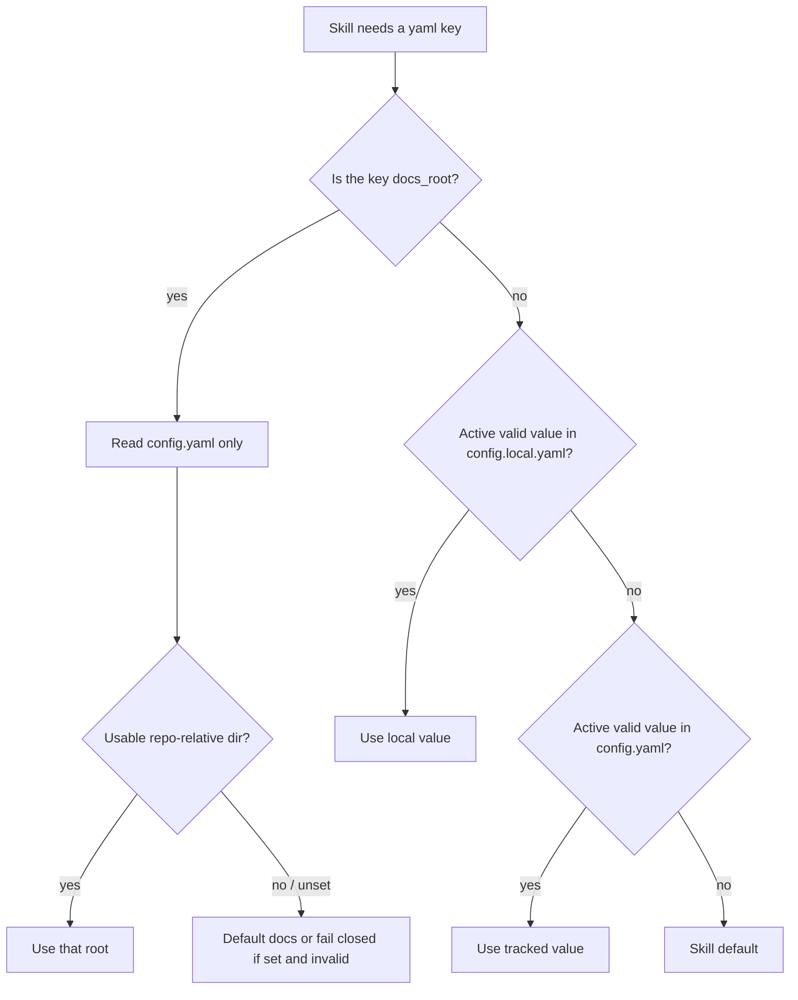
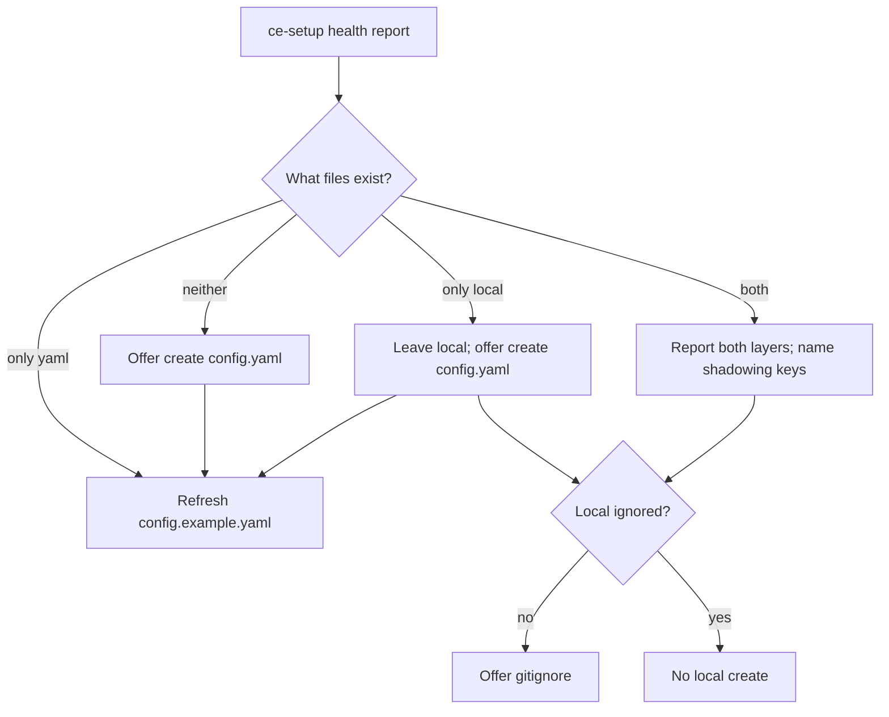

# Repo Config Cascade - Plan

## Goal Capsule

- **Objective:** Make ordinary Compound Engineering yaml keys resolve from the two repo files in a fixed order, read `docs_root` only from the repo file, and make `/ce-setup` create that repo file rather than a personal override.
- **Product authority:** This plan governs config read order, setup file creation, and the committed example name. It does not add a user-home config file, rename existing `config.local.yaml`, or move interview writes onto the team file.
- **Execution profile:** Skill prose, setup/health script, docs, and mechanical tests. No converter/CLI library. Agents follow the stated file list and rules; tests pin the contract, they are not the implementation.
- **Open blockers:** None.
- **Tail ownership:** Implementation owns the edits, `bun run test`, and `bun run release:validate` when skill/docs counts or config surfaces change.

---

## Product Contract

### Summary

Ordinary keys read `<repo>/.compound-engineering/config.local.yaml` then `config.yaml`. `docs_root` is repo layout and is read only from `config.yaml`. `/ce-setup` creates `config.yaml` and refreshes `config.example.yaml`. It does not create `config.local.yaml`.

### Problem Frame

The intended two-file model already exists for `docs_root` as local-then-tracked. Every other key still opens only `config.local.yaml`. `/ce-setup` then creates that override file and gitignores it, so onboarding never produces a commitable repo config. A team can commit `config.yaml` today and most skills ignore it. A local `docs_root` override is a separate footgun: it splits one project's artifacts across two trees.

### Key Decisions

- **Repo files only.** (session-settled: user-directed — chosen over `~/.compound-engineering/config.yaml`: home-dir config was sketched in March 2026 and never shipped.) Governs R1.
- **Most keys are team-default and locally overrideable.** (session-settled: user-directed — chosen over a broad team-vs-personal catalog: the same key may live in either file.) Governs R2, R3, R4.
- **`docs_root` is repo layout, not an override.** (session-settled: user-directed — chosen over leaving `docs_root` on the full cascade: a local value splits artifact trees.) Governs R5.
- **Setup creates repo `config.yaml`, not the override.** (session-settled: user-directed — chosen over creating `config.local.yaml` at setup: setup is repo onboarding.) Governs R6, R7.
- **Example file is `config.example.yaml`.** (session-settled: user-directed — chosen over keeping `config.local.example.yaml`: the example documents the repo config.) Governs R8.
- **Keep the override filename `config.local.yaml`.** (session-settled: user-directed — chosen over renaming existing local files: current checkouts already use that name.) Governs R9.
- **Interview and opt-out writes stay on `config.local.yaml`.** (session-settled: user-approved — chosen over writing those into `config.yaml`: setup is the team file; pulse/sweep/promote persist personal or checkout state.) Governs R10.

### Requirements

**Read cascade**

- R1. No skill or setup script reads `~/.compound-engineering/config.yaml` or any other user-home CE config.
- R2. For every ordinary CE yaml key (all keys except `docs_root`), resolve `<repo-root>` then read `config.local.yaml`, then `config.yaml`. The first active (non-commented) value wins. Missing files are skipped. For scalars, empty string is unset. For lists and maps, a present key — including an empty list or map — is set and wins that layer.
- R3. Either file alone is a complete config for ordinary keys. Both files together apply R2. Gitignore status does not change resolution.
- R4. Structured ordinary keys (`work_engine_preferences`, `feedback_sources`, and any other list or map) replace the whole key when local sets them. Do not deep-merge.
- R5. `docs_root` is read only from `config.yaml`. Do not read it from `config.local.yaml`. Validation stays fail-closed. An existing local `docs_root` is ignored; setup tells the operator to move it into `config.yaml` if they still want it.

**Setup and example**

- R6. `/ce-setup` creates `.compound-engineering/config.yaml` from the bundled template when that file is missing. It does not create `config.local.yaml`. The create offer runs after every health report, including when health is otherwise green.
- R7. Setup never overwrites an existing `config.yaml` or `config.local.yaml`.
- R8. Setup refreshes `.compound-engineering/config.example.yaml` from `skills/ce-setup/references/config-template.yaml` and treats leftover `config.local.example.yaml` as stale.
- R9. Existing `config.local.yaml` files stay valid as the override layer. Setup may offer gitignore only when that file already exists and is not ignored. When both files exist, setup names ordinary local keys that would shadow the team file.
- R10. Pulse, sweep, and promote keep writing their persisted keys to `config.local.yaml`. Their *reads* follow R2, so first-run detection is “key unset in both layers,” not “local file missing.”

**Health and docs**

- R11. `check-health` reports both layers, validates ordinary keys across the same cascade as R2 (each key independently), reads `docs_root` only from `config.yaml`, and treats missing `config.yaml` as a reported absence, not a project issue, unless the operator asked to create it this run.
- R12. `docs/skills/configuration.md`, `docs/skills/ce-setup.md`, the template header, AGENTS.md’s config-maintenance rule, and consumer skill docs describe the two-file model and the `docs_root` exception. They no longer call `config.local.yaml` the only config file.

### Actors

- A1. Repo operator running `/ce-setup` to add CE config to a project.
- A2. Agent running a CE skill that reads a yaml key.
- A3. Teammate cloning a repo that already committed `config.yaml`.

### Key Flows

- F1. New repo, no CE config
  - **Trigger:** A1 runs `/ce-setup`.
  - **Steps:** Setup creates `config.yaml` from the template (commented keys) and refreshes `config.example.yaml`. It does not create `config.local.yaml`.
  - **Outcome:** A3 cloning the repo sees team defaults once keys are uncommented and committed.
- F2. Ordinary-key read with both files
  - **Trigger:** A2 needs `plan_output` (or any ordinary key).
  - **Steps:** Read local, then tracked. Local set → use it. Local unset or invalid → use tracked. Both unset → skill default.
  - **Outcome:** Team default in `config.yaml` applies unless this checkout overrode it with a valid local value.
- F3. Existing checkout that already has only `config.local.yaml`
  - **Trigger:** A1 re-runs setup.
  - **Steps:** Leave local in place. Offer to create `config.yaml` even when health is otherwise green. If the operator accepts, name ordinary local keys that will still win over the new team file. Tell them a local `docs_root` is ignored until moved into `config.yaml`.
  - **Outcome:** No forced migration. Adding `config.yaml` does not change behavior for ordinary keys that are already set locally.

### Acceptance Examples

- AE1. Tracked-only ordinary default. Covers R2, R3, F2.
  - **Given:** `config.yaml` has `plan_output: html` and no `config.local.yaml`.
  - **When:** `ce-plan` resolves output mode.
  - **Then:** It uses HTML. It does not fall through to markdown because the local file is absent.
- AE2. Local ordinary override. Covers R2, F2.
  - **Given:** `config.yaml` has `plan_output: html` and `config.local.yaml` has `plan_output: md`.
  - **When:** `ce-plan` resolves output mode.
  - **Then:** It uses markdown.
- AE3. Setup does not invent an override. Covers R6, R7, F1.
  - **Given:** Neither config file exists.
  - **When:** The operator accepts setup’s create offer.
  - **Then:** `config.yaml` exists and `config.local.yaml` does not.
- AE4. Pulse first-run uses the cascade. Covers R10.
  - **Given:** `config.yaml` has `pulse_product_name` set and no local file.
  - **When:** `ce-product-pulse` starts.
  - **Then:** It skips the interview. It does not treat “no local file” as unconfigured.
- AE5. `docs_root` ignores local. Covers R5.
  - **Given:** `config.yaml` has `docs_root: docs` and `config.local.yaml` has `docs_root: .ce-artifacts`.
  - **When:** Any skill resolves the artifact root.
  - **Then:** The root is `docs`. Setup reports that the local `docs_root` is ignored.
- AE6. Invalid local ordinary key yields to tracked. Covers R2, F2.
  - **Given:** `config.yaml` has `plan_output: html` and `config.local.yaml` has `plan_output: html5`.
  - **When:** `ce-plan` resolves output mode.
  - **Then:** It uses HTML from the team file, not the markdown skill default.
- AE7. Empty local list replaces the team list. Covers R2, R4.
  - **Given:** `config.yaml` has a non-empty `work_engine_preferences` list and `config.local.yaml` has `work_engine_preferences: []`.
  - **When:** `ce-work` or `check-health` resolves that key.
  - **Then:** The winning value is the empty list, not the team list.

### Success Criteria

- An ordinary key set only in `config.yaml` is honored by every consumer of that key.
- An ordinary key set in `config.local.yaml` overrides the same key in `config.yaml`.
- `docs_root` in `config.local.yaml` is ignored.
- A fresh `/ce-setup` on an empty `.compound-engineering/` directory produces `config.yaml` and `config.example.yaml`, not `config.local.yaml`.
- Existing local-only checkouts keep working without a rename.

### Scope Boundaries

- In scope: read cascade for ordinary keys; `docs_root` tracked-only; setup create/refresh/health; example rename; docs and mechanical tests.
- Out of scope: user-home config; deep-merge of lists; moving `project_tracker` into yaml; a shared runtime library under `src/` or a cross-skill import; a harness eval matrix for “did the model open both files.”
- Deferred: an explicit “write this setting to the team file” prompt inside pulse/sweep interviews.

### Sources

- `docs/skills/configuration.md` — current local-only framing and the `docs_root`-only tracked-layer sentence this work retires.
- `docs/plans/2026-07-22-001-feat-configurable-docs-root-plan.md` — KTD1–KTD3: inline delimited block, no shared library.
- `tests/fixtures/docs-root-rule.md` and `tests/docs-root-rule-parity.test.ts` — the pattern to copy for the ordinary-key rule, and the block that U2 must change to tracked-only.
- `skills/ce-setup/scripts/check-health` — `resolve_docs_root` must stop reading local.

---

## Planning Contract

### Key Technical Decisions

- KTD1. **Two prose rules, not one.** Ordinary keys get a new delimited block (`<!-- ce-config-layers -->`). `docs_root` keeps `<!-- ce-docs-root -->` but its Read clause becomes `config.yaml` only. Do not merge the blocks. Canonical texts live in fixtures; parity tests paste them into every independent reader. (see origin: `docs/plans/2026-07-22-001-feat-configurable-docs-root-plan.md` KTD1, KTD3)
- KTD2. **No shared runtime resolver.** Skills cannot import siblings. `src/utils/` never runs at skill time. `check-health` may keep a local bash helper. Structured keys stay on native file-read plus the prose rule. Tell agents which files to open and the resolution rule; do not implement the cascade as a grep exercise.
- KTD3. **One commented template seeds both `config.yaml` and `config.example.yaml`.** Do not split templates. The header documents both files, the ordinary-key override rule, and that `docs_root` belongs only in `config.yaml`.
- KTD4. **Setup is a file-state machine that always runs after the health report.** Neither file → offer create `config.yaml`. Only local → leave it; offer create `config.yaml`; offer gitignore; disclose shadowing keys. Only tracked → refresh example; do not invent local. Both → report layers; disclose shadowing ordinary keys; gitignore local only if needed. Always refresh `config.example.yaml`. Stale `config.local.example.yaml` → stop comparing the old name and remove it after the new example exists.
- KTD5. **Invalid ordinary local values continue to tracked.** Missing, commented, empty scalar, or invalid scalar in local → read `config.yaml`. A present structured key, including `[]`, wins. `docs_root` is not in this cascade.
- KTD6. **Tests pin the contract, they do not stand in for agent judgment.** Pin filenames, the two verbatim rule blocks, first-run wording (“key unset,” not “file missing”), and `check-health` layer output. Do not add a harness eval matrix. Do not treat greps as the implementation of the cascade.

### High-Level Technical Design

Read path and setup path stay separate. Writers (pulse, sweep, promote) still append to `config.local.yaml`. They become consumers of the ordinary-key diagram first.

### Assumptions

None. Scope was confirmed in-session.

### Implementation Constraints

- Cross-skill file references are forbidden. Duplicate each rule block; do not `@`-include it.
- `config-template.yaml` and the committed example stay byte-identical.
- Gitignore rule stays `.compound-engineering/*.local.yaml`. Do not ignore `config.yaml` or `config.example.yaml`.
- Preserve user content on every setup path (create, example refresh, leftover-example cleanup, gitignore offer, source-layer repair).

### Sequencing

U1 (contract + rename) first so later units have the new filenames. U2 (read rules + consumers) and U3 (setup/health) can proceed in parallel after U1. U4 (tests) lands with those units and is checked last as a sweep.

---

## Implementation Units

### U1. Publish the two-file contract and rename the example

**Goal:** The documented and templated surface matches the product: repo `config.yaml` is the default file; `config.local.yaml` is the optional override for ordinary keys; `docs_root` is documented as `config.yaml` only; the committed example is `config.example.yaml`.

**Requirements:** R1, R5, R6, R8, R12

**Dependencies:** none

**Files:**
- `skills/ce-setup/references/config-template.yaml`
- `.compound-engineering/config.local.example.yaml` (remove after the new example exists)
- `.compound-engineering/config.example.yaml` (create; byte-identical to the template)
- `docs/skills/configuration.md`
- `docs/skills/ce-setup.md`
- `docs/skills/ce-plan.md`, `docs/skills/ce-brainstorm.md`, `docs/skills/ce-ideate.md`, `docs/skills/ce-work.md`, `docs/skills/ce-doc-review.md`, `docs/skills/ce-commit-push-pr.md`, `docs/skills/ce-product-pulse.md`
- `AGENTS.md` plugin-maintenance bullet
- `CONCEPTS.md` Feedback source entry (it currently says “shared local config”)

**Approach:**
1. Rewrite the template header: copy target is `config.yaml`; `config.local.yaml` is the optional override for ordinary keys; `docs_root` belongs only in `config.yaml`; gitignore is not part of resolution.
2. Replace `configuration.md`’s local-only opening. State the ordinary-key cascade once and the `docs_root` exception once.
3. Update AGENTS.md: changing a key updates the template, `config.example.yaml`, `configuration.md`, and consumer docs.
4. Sweep consumer docs that name `config.local.yaml` as the only file.
5. Update the CONCEPTS.md Feedback source entry so it names `config.yaml` plus optional `config.local.yaml` override, not “shared local config.”

**Patterns to follow:** Existing AGENTS.md four-file maintenance rule; template/example byte-identity.

**Test scenarios:**
- Template and `config.example.yaml` are byte-identical after the rename.
- `configuration.md` names both files, the ordinary-key override rule, and `docs_root` as yaml-only.
- No remaining “today `docs_root` is its only consumer” sentence.
- `commit-push-pr-contract` path list points at `config.example.yaml`.

**Verification:** `diff` of template vs new example is empty. Shipping docs no longer cite `config.local.example.yaml`.

---

### U2. Read rules at every independent consumer

**Goal:** Independent readers follow R2 for ordinary keys and R5 for `docs_root`.

**Requirements:** R2, R3, R4, R5, R10

**Dependencies:** U1

**Files:**
- `tests/fixtures/docs-root-rule.md` (Read clause becomes `config.yaml` only)
- `tests/fixtures/ce-config-layers-rule.md` (new)
- `tests/docs-root-rule-parity.test.ts` (keep; fixture text changes)
- `tests/config-layers-rule-parity.test.ts` (new)
- `skills/ce-plan/SKILL.md` Phase 0.0
- `skills/ce-brainstorm/SKILL.md` Phase 0.0
- `skills/ce-ideate/SKILL.md`
- `skills/ce-plan/references/reasoning-elevation.md`
- `skills/ce-brainstorm/references/reasoning-elevation.md`
- `skills/ce-commit-push-pr/SKILL.md`
- `skills/ce-work/SKILL.md`
- `skills/ce-work/references/execution-engines.md`
- `skills/ce-code-review/references/cross-model-review.md`
- `skills/ce-doc-review/references/cross-model-review.md`
- `skills/ce-product-pulse/SKILL.md`
- `skills/ce-product-pulse/references/interview.md`
- `skills/ce-sweep/SKILL.md`
- `skills/ce-sweep/references/interview.md`
- `skills/ce-promote/references/spiral-cli.md`
- `skills/ce-ideate/references/post-ideation-workflow.md`
- every `SKILL.md` that carries `<!-- ce-docs-root -->` (the 18 current consumers)

**Approach:**
1. Change the `docs_root` fixture so the Read clause is `config.yaml` only. Paste the updated block into every current consumer. Do not merge it with the ordinary-key block.
2. Author a short ordinary-key block (`<!-- ce-config-layers:start -->`) that states R2–R4, invalid-local-continues-to-tracked, and “gitignore does not affect resolution.”
3. Put that block at every site that reads ordinary keys on its own. Path-only mentions do not get the block.
4. Rewrite “if the local file does not exist, fall through to defaults” so the agent opens both files (or `config.yaml` only for `docs_root`) and then applies the rule. Agents are the runtime.
5. Change pulse/sweep first-run from “local file missing” to “required key unset after cascade.”

**Patterns to follow:** Existing delimited-block + parity fixture pattern. The rule in the skill is the implementation.

**Test scenarios:**
- Every `docs_root` consumer contains the updated yaml-only block.
- Every independent ordinary-key reader contains the new cascade block.
- Pulse/sweep first-run condition is key-unset, not file-missing.
- Cross-model references no longer say local is the only file.

**Verification:** Both parity tests pass. Phase 0.0 and sibling readers instruct opening both files before any default.

---

### U3. Setup creates repo config; health follows the rules

**Goal:** `/ce-setup` and `check-health` onboard `config.yaml` and resolve keys the same way skills do.

**Requirements:** R5, R6, R7, R8, R9, R11

**Dependencies:** U1

**Files:**
- `skills/ce-setup/SKILL.md`
- `skills/ce-setup/scripts/check-health`
- `docs/skills/ce-setup.md`

**Approach:**
1. Run KTD4 after every health report, including when `project_issues` is 0. Create offer copies the template to `config.yaml`. Delete the “Set up a local config file?” create path.
2. Always refresh `config.example.yaml`. If `config.local.example.yaml` remains, remove it after the new example is in place (generated example, not user config).
3. Gitignore offer stays gated on an existing `config.local.yaml`.
4. When local and tracked both exist, name ordinary local keys that shadow the team file. If local still has `docs_root`, say it is ignored and offer to move it into `config.yaml`.
5. Extend `check-health`:
   - Example path is `config.example.yaml`.
   - Report `config.yaml` present/absent without making absence a project issue.
   - `docs_root` is resolved from `config.yaml` only.
   - Resolve `work_engine_mode` and `work_engine_preferences` independently per R2/R4. An empty local list is set. Do not pick one file for the whole group.
   - Retired-key scan covers both files.
   - Keep “local exists and is not ignored” as a warning.
6. Work-engine repair (Step 6a) and `docs_root` repair edit the layer that supplied the failing value. If the bad ordinary key is only in `config.yaml`, edit that file after preview. Do not hide a broken team value behind a new local override.

**Patterns to follow:** Existing `docs_root` source-layer repair. Preserve-user-content on every branch.

**Test scenarios:**
- Health with only `config.yaml` `work_engine_mode: prefer` plus a valid preferences list reports that mode.
- Health with local mode and tracked preferences reports both, not “unavailable.”
- Health with neither file does not treat missing local as a project issue.
- Health with local `docs_root` and tracked `docs_root` reports the tracked root.
- SKILL.md offers create `config.yaml` on a healthy local-only checkout.

**Verification:** `tests/skills/ce-setup-check-health.test.ts` updated and green. SKILL.md no longer asks to create `config.local.yaml`.

---

### U4. Close mechanical contracts on the new filenames and rules

**Goal:** CI pins the new contract so the old local-only story, and local `docs_root` winning, cannot silently return.

**Requirements:** R5, R8, R11, R12

**Dependencies:** U1, U2, U3

**Files:**
- `tests/skills/ce-setup-check-health.test.ts`
- `tests/commit-push-pr-contract.test.ts`
- `tests/skills/ce-work-outcome-spine.test.ts`
- `tests/docs-root-rule-parity.test.ts`
- `tests/config-layers-rule-parity.test.ts` (from U2)

**Approach:**
1. Point every hardcoded `config.local.example.yaml` test path at `config.example.yaml`.
2. Invert the existing “local `docs_root` overrides tracked” health case: tracked wins; local `docs_root` is ignored.
3. Add tracked-only ordinary-key health cases (`work_engine_mode`).
4. Sweep `ce-work-outcome-spine` so the engine gate inspects both files.
5. Keep parity tests as the pin for the two rule blocks.

**Test scenarios:**
- Template/example identity uses the new path.
- Tracked-only work-engine health case passes.
- Local `docs_root` no longer wins over tracked.
- Ordinary-key parity test fails if a consumer drops the new block.

**Verification:** Targeted bun tests listed above, then `bun run test`.

---

## Verification Contract

| Gate | Command / check | Applies |
|---|---|---|
| Targeted | `bun test` on the files in U4 | After U4 |
| Full suite | `bun run test` | Before review / PR |
| Release metadata | `bun run release:validate` | If skill descriptions or config docs change counts/wording the validator watches |
| Behavioral eval | none | The skill prose is the runtime; tests pin filenames and the two rule blocks |

---

## Definition of Done

- Ordinary-key consumers resolve local then tracked.
- `docs_root` is read only from `config.yaml`.
- `/ce-setup` creates `config.yaml` and `config.example.yaml`, not `config.local.yaml`, including on healthy local-only checkouts.
- Existing `config.local.yaml` still overrides ordinary keys when present.
- Pulse/sweep first-run is key-unset, not file-missing.
- Template and `config.example.yaml` are byte-identical.
- `bun run test` passes.
- `.compound-engineering/config.local.example.yaml` is not left in the plugin repo diff.

### Per-unit

| Unit | Done when |
|---|---|
| U1 | New example path is the committed schema; docs state cascade plus `docs_root` exception |
| U2 | Both parity fixtures match every independent reader; first-run wording uses the cascade |
| U3 | Setup create offer is always-on; health matches R2/R5 |
| U4 | Filename and rule tests fail on a local-only or local-`docs_root` regression |

---

## System-Wide Impact

Agents are the readers of this config. They need both file paths and the two rules in the skill text they already load. No new tool or MCP surface. Worktrees share committed `config.yaml`. They do not share an uncommitted `config.local.yaml`. `docs_root` now follows the committed file, so worktrees of the same project write artifacts to the same repo-relative tree.

## Risks

- **Leftover `config.local.example.yaml`** in already-cloned repos will make health look broken until U3 cleans it. Mitigate in the same setup run that writes the new example.
- **Existing local `docs_root`** will stop taking effect. Setup must say so and offer to move the key. The old health test that expected local to win must change or CI will lie.
- **Pulse/sweep false first-run** if a reader still keys off file existence. Mitigate in U2 by rewriting that condition, not by adding a grep-only gate.
- **`check-health` nested keys.** Resolve `work_engine_mode` and `work_engine_preferences` independently. Detect list presence (including empty) then run the existing list reader on that key’s winning file.
