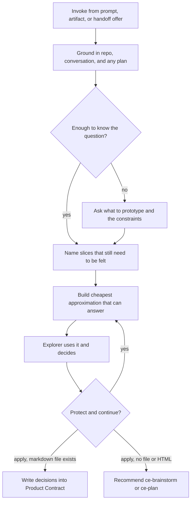
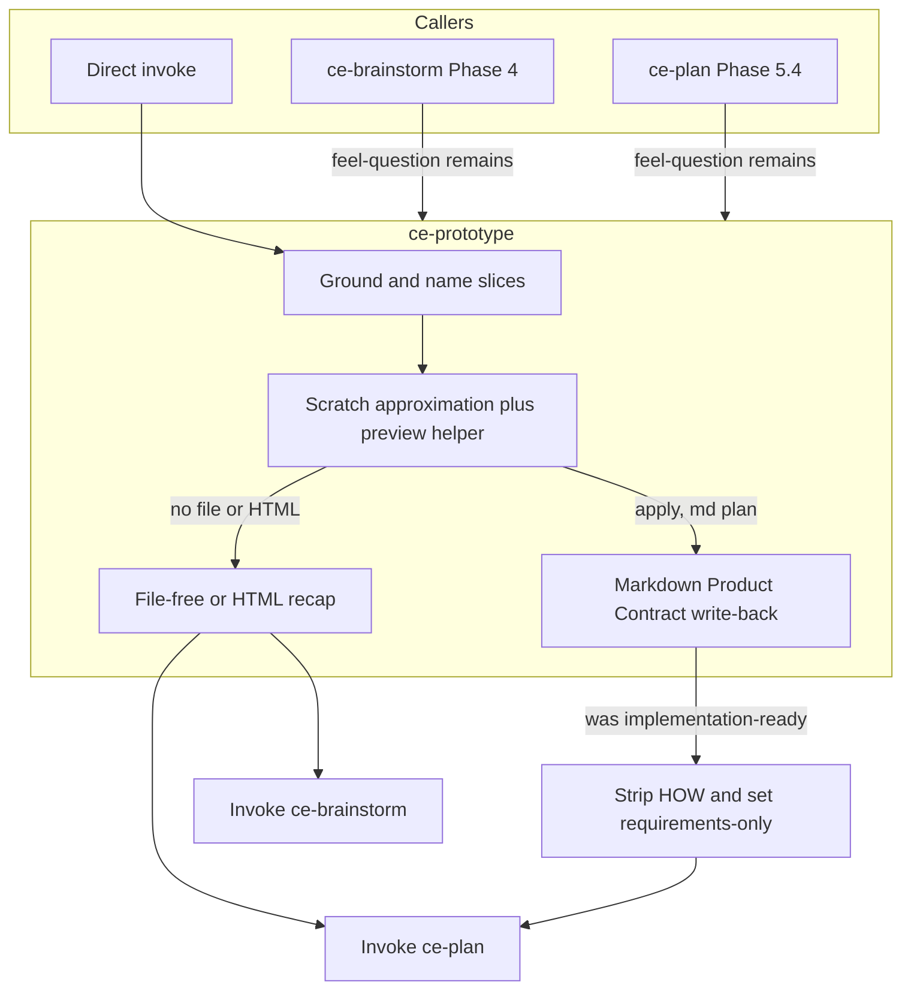

# CE-Prototype Skill - Plan

## Goal Capsule

- **Objective:** Ship an on-demand `ce-prototype` skill that lets someone feel remaining interaction questions on a cheap throwaway approximation of the product, then write those decisions into an existing brainstorm or plan, or continue into `ce-brainstorm` or `ce-plan`.
- **Product authority:** The Product Contract below. Product behavior, scope boundaries, and success signals were resolved in brainstorm dialogue.
- **Authority hierarchy:** Product behavior is owned by the Requirements. Implementation mechanism is owned by the Key Technical Decisions. A unit overrides neither.
- **Execution profile:** Greenfield skill plus two handoff-menu edits. Mechanical coverage in `bun test` / `release:validate`. Offer/skip and wait-for-human judgment are skill-creator evals, not CI.
- **Stop conditions:** Stop if write-back cannot edit a markdown Product Contract without touching Planning Contract headings, or if the four-option handoff composition cannot stay at four visible choices on the common path.
- **Tail ownership:** Standalone `ce-work` owns branch, commits, and PR. Behavioral eval evidence belongs on the PR body.
- **Open blockers:** None.

**Product Contract preservation:** changed R17, added R22 — handoff menus drop Share to Proof and add the prototype offer; `ce-proof` stays in the plugin. Confirmed in plan-scope synthesis.

---

## Product Contract

### Summary

Add `ce-prototype`: a skill you invoke with a prompt, a brainstorm, or a plan.
It grounds in the current repo and whatever conversation or artifact exists, names the slices that still need to be felt, builds the cheapest approximation that can answer, and layers decisions until the explorer applies them.
`ce-brainstorm` and `ce-plan` offer it when a remaining question requires use, not inspection.
Those menus no longer offer Share to Proof.

### Problem Frame

Requirements and plans can name an outcome.
They cannot name how an interaction should feel until someone uses it — a comma field versus pills, a reordered nav versus a hamburger with motion, the placement of a control.
People already get a lightweight prototype by asking the agent to make one, then rewrite the requirements and the plan once they have decided.
That rewrite is not a failure.
The missing pieces are slice-picking, a fidelity that matches the question, a place to offer the step so it is not tribal knowledge, and a write-back or handoff that existing skills can continue from.

`ce-brainstorm` already has display-only visual probes for one directional decision.
`ce-polish` already iterates on a feature that works.
Nothing in the pipeline sits between those: more real than a sketch, earlier than polish, and not a second brainstorm.

### Key Decisions

- **On-demand experience skill.** (session-settled: user-directed — chosen over no-new-skill and a campaign workspace: the missing piece is the protocol, not a reminder or a third source of truth.) Governs R1, R16, R17.
- **Write into the existing artifact.** (session-settled: user-directed — chosen over draft-then-confirm and recap-only: the next plan or work step must see the decisions.) Governs R13.
- **Standalone stays file-free.** (session-settled: user-directed — chosen over auto-minting a plan and a thin third note: existing `ce-brainstorm` or `ce-plan` continue the work.) Governs R14, R15.
- **Research in this plan names learnings, not competing skills or products.** (session-settled: user-directed — chosen over citing named external skills: the contract should travel without a catalog of other tools.) Governs R18.
- **Update the Product Contract; leave HOW for a re-plan.** Confirmed with the scoping synthesis. An implementation-ready plan's Planning Contract is not rewritten by the prototype run. Governs R13.
- **Comparing feels happens on one surface.** Confirmed with the scoping synthesis. Sequential layering starts after a winner is protected. Governs R8.
- **Lean skill, extra protocol only for CE jobs.** Author from the portable skill field guide: outcome first, then the smallest protocol that protects it. Agents can choose build shape from a short outcome. Extra always-loaded prose is only for jobs a lean reminder skill does not have — offers, write-back, slice picking, no re-probe. Do not copy wording from external prototype skills. Governs R20, R21.
- **Handoff menus drop Share to Proof.** (session-settled: user-directed — chosen over keeping Proof in the menu and overflowing the four-option tool: the `ce-proof` skill remains; people who want it invoke it.) Governs R22.

### Actors

- A1. Explorer — the person deciding how an interaction should feel, usually in a product repo.
- A2. `ce-prototype` — grounds, picks slices, builds approximations, layers, writes back or hands off.
- A3. `ce-brainstorm` / `ce-plan` — offer the skill at handoff when warranted; consume write-back or a session handoff.
- A4. Current product — the repo and running product the approximation is grounded in, unless the explorer says otherwise.

### Key Flows



- F1. **Standalone or artifact-grounded run.**
  - **Trigger:** Explorer invokes `ce-prototype` with a prompt, a brainstorm path, or a plan path.
  - **Actors:** A1, A2, A4.
  - **Steps:** Ground; ask only if the question or constraints are too thin; name slices; build; feel; layer; apply.
  - **Outcome:** Decisions made against something usable; an existing markdown artifact updated, or a handoff to `ce-brainstorm` / `ce-plan`.
  - **Covered by:** R1, R2, R3, R4, R5, R6, R7, R8, R9, R10, R11, R12, R13, R14, R15, R20.
- F2. **Handoff offer.**
  - **Trigger:** A brainstorm or plan finishes and a remaining question requires use, not inspection.
  - **Actors:** A1, A2, A3.
  - **Steps:** Offer the skill with a proposed slice; if accepted, propose options and accept a named question; do not rebuild a visual-probe question that already settled.
  - **Outcome:** Explorer enters F1 on a named remaining question, or skips to planning or work.
  - **Covered by:** R7, R16, R17, R22.
- F3. **Layered next slice.**
  - **Trigger:** Explorer protects a decision and still has something to feel.
  - **Actors:** A1, A2.
  - **Steps:** Keep the protected decision in the approximation; build the next cheapest slice.
  - **Outcome:** Later decisions sit on earlier ones.
  - **Covered by:** R9, R11.

### Requirements

**Invocation and grounding**

- R1. `ce-prototype` is a user-invocable plugin skill that accepts a prompt, a brainstorm artifact path, a plan artifact path, or an empty invoke that asks what to prototype.
- R2. A run in a repo is about that product unless the explorer says otherwise.
- R3. Grounding uses the current repo plus the conversation and any supplied brainstorm or plan before asking questions.
- R4. When grounding is too thin to know the question or the constraints, ask those before building.

**Slices and fidelity**

- R5. The skill names the parts that still need to be felt, or takes the explorer's named question, and prototypes only those.
- R6. Fidelity scales to the question: cheapest that can answer, richer when the question is motion, a control you must use, or a flow you must move through.
- R7. Do not rebuild a visual-probe question that already settled.
- R8. When the question is which feel wins, put the avenues on one surface so they can be judged together.

**Build and layer**

- R9. The default environment is a throwaway cheap approximation of the product, not the product and not a production-seed to ship.
- R10. The run may scale into the existing app when the question needs real chrome or density; that path stays throwaway and is not the shipped feature.
- R11. After a decision is protected, the next slice starts from that decision.
- R12. Subjective goals wait for the explorer to use the artifact; the skill does not mark a feel-question answered from its own judgment.
- R20. After each explorer-facing action or variant change, render the relevant state so they can see what changed.

**Write-back and continuation**

- R13. When the explorer applies decisions and a brainstorm or plan file exists, the skill writes those decisions into that file's Product Contract and does not rewrite an implementation-ready HOW.
- R14. When no brainstorm or plan file exists, the skill does not mint a new plan or a third note type.
- R15. After a file-free run, recommend `ce-brainstorm` when product-level questions remain, or `ce-plan` when the session is enough to plan, and pass the prototype session as the seed.

**Offers**

- R16. `ce-brainstorm` and `ce-plan` handoffs offer `ce-prototype` when a remaining question requires use, not inspection, including when someone skipped brainstorm and went to plan.
- R17. The offer proposes what might be prototyped; if accepted, the skill presents options and a way for the explorer to name the question.
- R22. Software `ce-brainstorm` and `ce-plan` handoff menus omit Share to Proof. Non-software wrap-up menus still offer it. The `ce-proof` skill remains in the plugin.

**Packaging and research posture**

- R18. User-facing docs and this skill's research citations describe learnings, not named competing skills or products.
- R19. The skill is registered like any other user-facing skill: inventory row, `docs/skills/` page and catalog, skill-count bump.
- R21. Skill prose follows `docs/solutions/skill-design/portable-agent-skill-authoring.md`: keep a line only when it is a falsifiable constraint, counters a known tendency, or changes a decision. Paraphrase any borrowed rule; do not retain recognizable wording from external prototype skills.

### Acceptance Examples

- AE1. **Covers R7, R16.** Given a brainstorm whose visual probe already settled menu hierarchy, when the handoff runs, then that hierarchy is not offered again, and a prototype is offered only if some other question still requires use.
- AE2. **Covers R6, R8.** Given the explorer is choosing a comma-separated field versus a pills control, when the first build runs, then both feels are on one surface at enough richness to use the control, not two sequential sketches.
- AE3. **Covers R13.** Given an implementation-ready plan and a protected decision to use pills, when the explorer applies, then the Product Contract gains that requirement and the Planning Contract is left for a later `ce-plan` pass.
- AE4. **Covers R14, R15.** Given a prompt-only run with no plan file, when the explorer is done, then no new plan file is written and the skill recommends `ce-brainstorm` or `ce-plan` from the session.
- AE5. **Covers R3, R4, R9, R10.** Given "prototype a vertical hamburger nav with animation instead of the current horizontal nav," when the run starts in that product repo, then the skill looks at the current nav and builds the lightest approximation that can be moved through, not the full app.
- AE6. **Covers R12, R11.** Given a feel-question, when the first build is up, then the skill waits for the explorer before recording a result, and a later slice keeps any decision they protected.
- AE7. **Covers R20.** Given two switchable feels, when the explorer changes variant or takes an action, then the relevant state is visible so they can see what changed without asking.
- AE8. **Covers R16, R22.** Given a markdown brainstorm handoff with a remaining feel-question, when the menu renders, then Share to Proof is absent, a prototype offer is present, and four options are visible.

### Success Criteria

- An explorer can decide a feel-question they could not decide from a requirements doc, then see that decision in the existing plan or in a `ce-brainstorm` / `ce-plan` continuation.
- Handoffs offer a prototype when something still needs to be used, and stay quiet when a visual probe already answered the only visual question.
- The approximation is cheap enough to throw away and honest enough that the decision survives contact with the real product.
- Share to Proof is gone from those two menus; `ce-proof` still exists as a skill.

### Scope Boundaries

#### Deferred for later

- Import from design tools.
- Multi-stakeholder review or sign-off of a prototype.
- Making visual probes themselves interactive.
- HTML Product Contract mutation.

#### Outside this product's identity

- Shipping production code — that stays `ce-plan` then `ce-work`.
- Late-stage polish on a working feature — that stays `ce-polish`.
- Display-only one-decision sketches during brainstorm — that stays visual probes.
- Assumption-validation spikes whose job is "does this API work," not "how does this feel."
- A PM-PRD machine: product-principles gate, bidirectional decision log, dual PRD, prototype as source of truth.
- Removing the `ce-proof` skill.

#### Deferred to Follow-Up Work

- Parity-testing the preview helper against brainstorm's copy if the two scripts start to drift.
- Offering prototype from `lfg` or other pipeline menus.

### Dependencies / Assumptions

- `ce-brainstorm` and `ce-plan` already emit and consume `ce-unified-plan/v1` artifacts, so write-back has a Product Contract to edit.
- A local preview of a throwaway web approximation is available in the same spirit as today's visual-probe helper.
- Skill authoring is governed by `docs/solutions/skill-design/portable-agent-skill-authoring.md`. Lean external prototype skills are evidence that agents can pick shape; they are not a template to quote.
- Skills cannot reference files outside their own directory, so any preview helper this skill needs lives inside `skills/ce-prototype/`.
- Some people skip `ce-brainstorm` and start at `ce-plan`; the offer must exist on both handoffs.
- `ce-work` refuses `artifact_readiness: requirements-only` and asks for `ce-plan`. That is the staleness gate after write-back.

### Outstanding Questions

None blocking. Planning questions from the requirements-only pass are resolved as KTD1–KTD6.

### Sources / Research

- `skills/ce-brainstorm/references/visual-probes.md` and `docs/skills/ce-brainstorm.md` — probes are display-only sketches, not prototypes.
- `docs/skills/ce-polish.md` — polish is after the feature already works.
- `skills/ce-brainstorm/references/handoff.md` and `skills/ce-plan/references/plan-handoff.md` — menus, overflow, Proof slot.
- `AGENTS.md` — a skill may only reference files in its own tree; new user-facing skills need a docs page, catalog row, inventory row, and skill-count bump.
- `docs/solutions/skill-design/portable-agent-skill-authoring.md` — outcome first, smallest protocol.
- `docs/solutions/skill-design/post-menu-routing-belongs-inline.md` — plan menu routing stays inline in `SKILL.md`.
- `docs/solutions/skill-design/bundled-script-path-resolution-across-harnesses.md` — `SKILL_DIR` for executed preview.
- Prior in-repo attempts (PR 505, PR 1072) — keep the lessons, not the identities: name the question before building; never fake the dimension you are testing; wait for a human on feel; do not absorb brainstorm into a PRD factory.
- External research, cited as learnings only: a prototype is throwaway work that answers a question, and the question decides richness; competing feels belong on one switchable surface; after each action or variant change, show the relevant state; keep it one step to run; persist only when persistence is the question; do not polish, test, or abstract past runnable; do not promote throwaway code into production; isolated vacuum pages hide density problems that a grounded approximation would show. A short skill can rely on the agent to choose shape — extra protocol here is only for pipeline offers, write-back, and slice gates.

---

## Planning Contract

### Key Technical Decisions

- KTD1. **Duplicate a preview helper inside `skills/ce-prototype/scripts/`.** Isolation forbids importing brainstorm's server. Copy the start/stop/status lifecycle, retitle chrome for a usable prototype, serve interactive HTML, keep feedback in chat. Scratch: `/tmp/compound-engineering-<uid>/ce-prototype/<run-id>/`. Invoke with the `SKILL_DIR` anchor. Cite R9, R20.
- KTD2. **Write-back edits markdown Product Contract only.** Add or update Key Decisions with `session-settled:` and `Governs R…`, allocate next R/AE IDs, resolve superseded text in place. Do not edit Planning Contract, units, KTDs, Verification, or DoD. HTML artifacts recap in chat and recommend `ce-plan`. Cite R13.
- KTD3. **After write-back on an implementation-ready markdown plan, set `artifact_readiness: requirements-only` and remove the HOW sections.** Delete Planning Contract, Implementation Units, Verification Contract, and Definition of Done. Do not leave empty headings. If a same-basename other-format sibling is implementation-ready, apply the same downgrade and strip. `ce-plan` re-adds HOW on re-enrichment. Cite R13. (session-settled: user-approved — chosen over recommend-re-plan-only and leftover HOW: work must not ship the old HOW.)
- KTD4. **Handoff composition stays at four visible options.** Drop Share to Proof from brainstorm Phase 4 and plan Phase 5.4. When a feel-question remains, show the prototype offer and omit pressure-test from that same menu. When no feel-question remains, keep pressure-test and omit prototype. HTML keeps Open in browser. Do not put the four-option rationale in skill prose. Cite R16, R22. (session-settled: user-directed — chosen over keeping Proof and overflowing: Proof stays a skill, not a menu item.)
- KTD5. **Default to a scratch approximation. Scale into the app only as a throwaway overlay.** Do not commit prototype code on the product branch. Scale up when the explorer asks or the question is density/chrome on an existing page. Cite R10.
- KTD6. **Keep the skill model-invocable.** Do not set `disable-model-invocation`. Pipeline and headless callers must not start a preview or invent feel-answers. Cite R1, R12.

### High-Level Technical Design



The skill owns protocol and mutation envelope.
The agent owns how the approximation is built.
Callers load the skill; they do not grow a hidden prototype loop.

### Output Structure

```text
skills/ce-prototype/
  SKILL.md
  references/
    write-back.md
    preview.md
  scripts/
    prototype-server.js
docs/skills/ce-prototype.md
```

Implementer may adjust names.
Per-unit Files lists stay authoritative.

### Assumptions

- Host skill invocation can load `ce-prototype` from a brainstorm or plan session the same way it loads `ce-doc-review`.
- Four-option composition in KTD4 is enough; we do not add a fifth overflow path for this offer.
- Byte-copy plus retitle of the preview helper is acceptable; a parity test is follow-up if the copies drift.

### Implementation Constraints

- No cross-skill file references.
- No named competing prototype skills in user-facing docs or skill prose.
- No hand-bumped plugin versions or CHANGELOG entries.
- No `${CLAUDE_SKILL_DIR}` on executed preview commands.

### Sequencing

U1 and U2 can start together.
U3 depends on U1.
U4 depends on U1.
U5 can run with U4.

---

## Implementation Units

### U1. Skill protocol

- **Goal:** Ship a lean, model-invocable `ce-prototype` that grounds, names slices, builds, waits, layers, and hands off.
- **Requirements:** R1, R2, R3, R4, R5, R6, R7, R8, R9, R10, R11, R12, R14, R15, R17, R20, R21. KTD5, KTD6.
- **Dependencies:** None.
- **Files:**
  - Create `skills/ce-prototype/SKILL.md`
  - Create `skills/ce-prototype/references/preview.md`
  - Test: `tests/skills/ce-prototype-protocol.test.ts` for greppable contracts only
- **Approach:**
  1. Outcome spine in `SKILL.md`: feel remaining questions, apply or hand off, done when the explorer applies or continues.
  2. Always-loaded protocol only for CE jobs: after a handoff accept, present options and accept a named question; no re-probe; write-back vs file-free; wait for the explorer; interactive-only.
  3. Extract `references/preview.md` as a late load. `references/write-back.md` is created in U3 and loaded from `SKILL.md` at apply time.
  4. Description names the job and adjacent negatives (visual probe, polish, implement). Keep it under 1024 characters.
- **Patterns to follow:** `skills/ce-handoff/SKILL.md` lean frontmatter. Field guide at `docs/solutions/skill-design/portable-agent-skill-authoring.md`.
- **Test scenarios:**
  - Happy path: frontmatter `name: ce-prototype`, no `disable-model-invocation`, description mentions probe/polish negatives.
  - Edge: no `../` sibling references; every `references/` and `scripts/` path exists in-skill.
  - Error: executed preview commands use `SKILL_DIR=…;` with the trailing semicolon, not `${CLAUDE_SKILL_DIR}`.
  - `Test expectation:` mechanical greps only. Offer/skip and wait-for-human are skill-creator evals, recorded on the PR.
- **Verification:** `bun test tests/skills/ce-prototype-protocol.test.ts` and `tests/skill-conventions.test.ts` pass. A cold read of `SKILL.md` can run a prompt-only session without a third document type.

### U2. Preview helper

- **Goal:** Serve the throwaway approximation from OS temp with start/stop/status.
- **Requirements:** R9, R20. KTD1.
- **Dependencies:** None.
- **Files:**
  - Create `skills/ce-prototype/scripts/prototype-server.js`
  - Test: `tests/skills/ce-prototype-server.test.ts`
- **Approach:**
  1. Duplicate brainstorm `visual-probe-server.js` lifecycle: `--root`, detached/`--foreground`, `/version` poll, newest `.html` in `screens/`.
  2. Change title/header so it is a usable prototype, not a display-only sketch.
  3. Allow interactive HTML. Do not add a browser-to-agent event bus.
  4. Scratch under `/tmp/compound-engineering-<uid>/ce-prototype/<run-id>/`.
- **Patterns to follow:** `skills/ce-brainstorm/scripts/visual-probe-server.js` and `tests/skills/ce-brainstorm-visual-probe-server.test.ts`. Do not copy “not a prototype” / “do not click” pins.
- **Test scenarios:**
  - Happy path: `start` writes display-info JSON and serves the newest screen; `status` and `stop` work.
  - Edge: two screens, newest wins; idle/owner-pid still reap.
  - Error: missing `--root` fails closed.
  - Covers AE7: served page can show relevant state after an action (fixture HTML, not a generated app).
- **Verification:** `bun test tests/skills/ce-prototype-server.test.ts` passes. A local `start` prints a URL that loads the fixture.

### U3. Product Contract write-back

- **Goal:** Apply feel-decisions to a markdown unified plan without rewriting HOW, and block stale execution.
- **Requirements:** R13, R14, R15. KTD2, KTD3.
- **Dependencies:** U1.
- **Files:**
  - Create `skills/ce-prototype/references/write-back.md`
  - Modify `skills/ce-prototype/SKILL.md` to load it at apply time
  - Test: `tests/skills/ce-prototype-write-back.test.ts`
- **Approach:**
  1. Scan headings. Edit `## Product Contract` only.
  2. Next unused R/AE. Key Decision with `session-settled:` and `Governs R…`.
  3. If the file was `implementation-ready`, set `artifact_readiness: requirements-only`, delete HOW sections, and apply the same to a same-basename other-format sibling if that sibling is implementation-ready.
  4. HTML or missing file: no write, recap, recommend `ce-brainstorm` or `ce-plan`.
- **Patterns to follow:** `skills/ce-brainstorm/references/brainstorm-sections.md` Key Decisions and ID rules. `skills/ce-work/SKILL.md` readiness stop.
- **Test scenarios:**
  - Covers AE3: fixture implementation-ready plan gains a Product Contract R and Key Decision; Planning Contract text is unchanged; readiness becomes `requirements-only`.
  - Covers AE4: no plan path writes nothing under `docs/plans/`.
  - Edge: HTML fixture is not mutated.
  - Error: missing `## Product Contract` heading fails closed and recaps instead of inventing a file.
- **Verification:** `bun test tests/skills/ce-prototype-write-back.test.ts` passes. A `ce-work` blank discovery on that fixture would stop for `ce-plan`.

### U4. Handoff menus

- **Goal:** Offer prototype from brainstorm and plan when a feel-question remains, drop Share to Proof, keep four visible options.
- **Requirements:** R7, R16, R17, R22. KTD4.
- **Dependencies:** U1.
- **Files:**
  - Modify `skills/ce-brainstorm/references/handoff.md`
  - Modify `skills/ce-brainstorm/SKILL.md` only if a load stub needs the new option name
  - Modify `skills/ce-plan/references/plan-handoff.md`
  - Modify `skills/ce-plan/SKILL.md` Phase 5.4 inline routing
  - Modify `tests/skills/ce-plan-handoff-routing.test.ts`
  - Modify `tests/skills/unified-plan-artifact-contract.test.ts`
  - Modify `tests/pipeline-review-contract.test.ts` if it pins Proof on those menus
  - Modify `tests/skills/ce-brainstorm-output-mode.test.ts`
  - Modify `tests/skills/ce-plan-output-mode.test.ts`
- **Approach:**
  1. Remove Share to Proof from software brainstorm Phase 4 and plan Phase 5.4. Keep it on non-software wrap-up menus. Keep Open in browser for HTML.
  2. Add a prototype option with a Shown-only predicate (remaining use-not-inspect question). A visual-probe question that already settled fails that predicate. Route by label. Invoke `ce-prototype` via the host skill mechanism and pass the artifact path. Post-accept options live in U1.
  3. When that option is visible, omit pressure-test from the same menu so four options remain. When it is hidden, keep pressure-test.
  4. Do not write the four-option rationale into skill prose.
  5. Put plan routing inline in `ce-plan/SKILL.md` per `docs/solutions/skill-design/post-menu-routing-belongs-inline.md`.
- **Patterns to follow:** existing visibility predicates and exclusive slots in those handoff files. `ce-pov` as an offered callee.
- **Test scenarios:**
  - Covers AE1: a settled visual-probe question is not offered again.
  - Covers AE8: brainstorm markdown menu greps include the prototype label, exclude Share to Proof on the software menu, and document the four-option composition.
  - Happy path: plan `SKILL.md` inline routing names `ce-prototype` and uses host-generic invocation.
  - Edge: HTML plan menu still has Open in browser and no Proof.
  - Error: callers do not instruct building a prototype without loading the skill.
- **Verification:** The listed handoff tests pass. A dry read of both menus on the common markdown path shows at most four options.

### U5. Registration and docs

- **Goal:** Make the skill discoverable and keep release metadata in sync.
- **Requirements:** R18, R19.
- **Dependencies:** U1.
- **Files:**
  - Create `docs/skills/ce-prototype.md`
  - Modify `docs/skills/README.md` On-Demand table
  - Modify `README.md` inventory and skill count 32 to 33
  - Modify `tests/release-metadata.test.ts` `skills: 32` to `33`
- **Approach:**
  1. Docs page follows `docs/skills/ce-handoff.md` shape: purpose, when to use, chain position.
  2. Catalog under On-Demand, not Frontend Design.
  3. No competing skill names. No version or CHANGELOG edits.
- **Patterns to follow:** `AGENTS.md` new-skill documentation checklist.
- **Test scenarios:**
  - Happy path: `bun run release:validate` and `tests/release-metadata.test.ts` see 33 skills.
  - Edge: `docs/skills/ce-prototype.md` and both inventory tables exist.
  - `Test expectation: none --` remaining checks are `release:validate` and the count pin.
- **Verification:** `bun run release:validate` passes. README count matches the `skills/*/SKILL.md` scan.

---

## Verification Contract

| Gate | Command / evidence | Applies |
|---|---|---|
| Mechanical suite | `bun run test` | Every unit |
| Release metadata | `bun run release:validate` | U5 |
| Plugin schema | `bun run plugin:validate` | After skill dir exists |
| Preview helper | `bun test tests/skills/ce-prototype-server.test.ts` | U2 |
| Write-back | `bun test tests/skills/ce-prototype-write-back.test.ts` | U3 |
| Handoff pins | existing ce-plan / brainstorm handoff tests plus new labels | U4 |
| Offer/skip and wait-for-human | skill-creator evals; evidence on the PR, not CI | U1, U4 |

---

## Definition of Done

- `ce-prototype` is invocable, self-contained, and registered at skill count 33.
- A markdown unified plan can receive Product Contract write-back; HOW is untouched; implementation-ready files become `requirements-only`.
- Brainstorm and plan menus offer prototype when a feel-question remains, omit Share to Proof, and stay at four visible options on the common path.
- `ce-proof` still exists and is undocumented as removed.
- Abandoned scratch and unused preview processes are not left running in tests.
- `bun run test`, `bun run release:validate`, and `bun run plugin:validate` pass.

### Per-unit done

- U1: protocol file exists and convention tests pass.
- U2: helper starts and stops in tests.
- U3: write-back fixture test passes including readiness downgrade.
- U4: handoff greps match KTD4.
- U5: count is 33 and the docs page exists.

---

## System-Wide Impact

- Brainstorm Phase 4 and plan Phase 5.4 menus change for every CE user.
- `ce-work` blank discovery will refuse a plan that just received prototype write-back until `ce-plan` re-enriches it.
- Skill inventory and converter skill count move from 32 to 33.
- Visual probes and polish stay separate surfaces.

---

## Risks & Dependencies

- Write-back that misses a heading can corrupt a plan. Fail closed and recap.
- If pressure-test is omitted whenever prototype is shown, some users lose a one-tap review. They can still invoke `ce-doc-review`.
- Duplicated preview helper will drift from brainstorm's copy. Accept for v1.
- In-app overlay (R10) can dirty a checkout if isolation is ignored. KTD5 forbids commits of prototype code.
