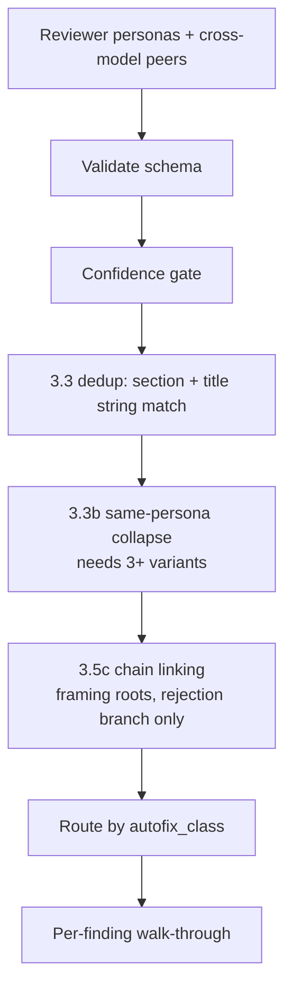
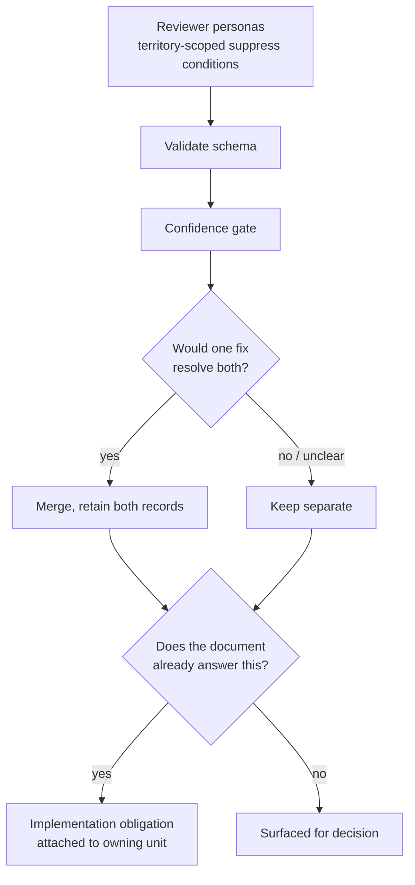
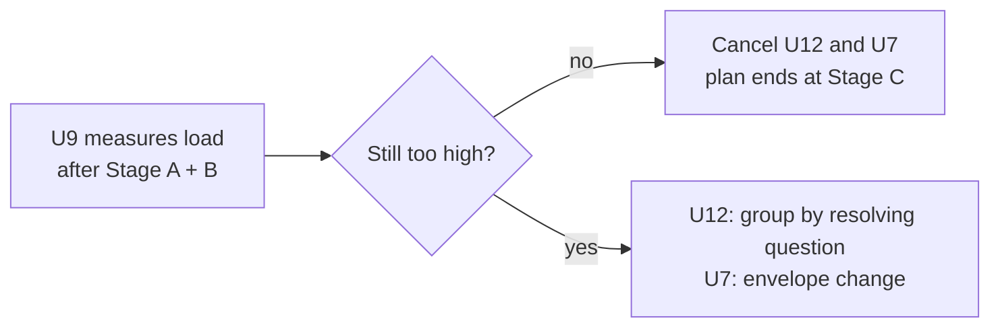

# fix: Cut ce-doc-review's decision load at the cheapest layer that works

## Goal Capsule

`ce-doc-review` returns more findings than a human can act on — 20+ on a complex feature, a dozen on a medium plan. Three mechanisms could reduce that load. They differ enormously in cost and risk, and the evidence now separates them clearly.

This plan ships them in evidence order, each independently measurable, and builds the expensive one only if the cheap ones fall short.

---

## Product Contract

### Summary

Replace the syntactic duplicate-matcher with agent reasoning over the finding set, tighten the persona territory boundaries that create duplicates at emission, and route entailed findings to their implementation unit instead of the decision queue. Measure after each stage. Build decision clustering only if the count is still too high.

### Problem Frame

The reviewer set returns findings; the user adjudicates them one at a time. On real work that means 20+ decisions on a complex feature and around a dozen on a medium plan — past what anyone reasons over well.

Three separate mechanisms inflate that number, and they are not equally supported.

**1. The duplicate matcher is a string comparison.** Synthesis step 3.3 fingerprints on `normalize(section) + normalize(title)` — lowercase, strip punctuation, collapse whitespace. Findings that describe the same problem in different words survive as separate items. Reasoning-based machinery does exist at 3.3b, but it is gated to a single persona and requires three or more variants, so the cross-persona path — where the observed duplicates actually live — is syntactic only.

Sampled evidence (U1):

- On a 1062-line plan, coherence and scope-guardian both raised the same contradiction, at the **same section** (`U11. Idle handler`), quoting the **same three evidence lines**. Only the titles differed. The fingerprint did not match.
- On a 94-line plan, adversarial and feasibility both raised the same currency problem at different sections. The fingerprint did not match.

Each finding carries `title`, `section`, `why_it_matters`, `evidence`, and `suggested_fix`. That is ample material for an agent to judge sameness. The information needed is present; the mechanism reading it is not.

**2. Personas emit into each other's territory.** Both sampled duplicates were one reviewer working in another's declared lens. The suppress mechanism that prevents this already exists and demonstrably works: on the same issue where adversarial emitted, coherence found it, suppressed it, and cited its own suppress list as the reason. So some duplication is preventable one layer earlier, in the persona briefs.

**3. Findings that need no decision sit in the decision queue.** In a 27-finding review, 8 of the 16 distinct issues were entailed corrections — contradictions the document answered elsewhere, a missing owner for behavior already required, a callsite implied by the document's own decision. None needed judgment. All were presented as decisions.

A fourth mechanism — grouping genuinely distinct findings by the question that resolves them — would cut further, but it is the least evidenced, the most expensive, and the only one whose failure is silent. It is deferred behind measurement rather than assumed.

### Key Decisions

1. **Fix at the cheapest layer that works, and measure between layers.** (session-settled: user-directed — chosen over building decision clustering first: sampled evidence showed the duplicates were defeated by string matching and persona territory bleed, both far cheaper to fix, so clustering would have been built before knowing whether it was needed.) Governs R1, R2, R3, R8.

2. **Duplicate detection is agent reasoning, not string matching.** (session-settled: user-directed — chosen over extending the fingerprint with more normalization rules: reviewers phrase the same problem differently by nature, so no normalization of titles closes the gap, and the findings already carry the content needed to judge sameness.) Governs R1.

3. **No numeric cap on findings or decisions.** (session-settled: user-approved — chosen over a fixed decision budget: a numeric cap was evaluated and rejected in this repo, and every production review system in external prior art controls volume with a precision bar rather than post-hoc truncation.) Governs R7.

4. **The cross-model pass keeps discovering, not only corroborating.** (session-settled: user-approved — chosen over gating peer findings on corroboration: blind-spot catching across model families was its purpose.) Governs R6.

5. **Decision clustering is conditional, not planned.** (session-settled: user-directed — chosen over shipping it as the centerpiece: it is the least evidenced mechanism and its failure mode is silent, so it is built only if measurement after the cheaper stages shows the decision load is still too high. This supersedes the earlier decision to make the decision the presentation unit, which was accepted before the sampling evidence existed.) Governs R4, R9.

6. **Behavioral evals gate each stage, on generated documents with a manifest this plan's author never sees.** (session-settled: user-directed — chosen over evaluating against hand-authored fixtures alone: measuring whether dedup wrongly merges distinct findings requires knowing which findings were genuinely distinct, which only a withheld manifest supplies.) Governs R10, R11.

### Requirements

- **R1** — Findings that describe the same problem are detected as duplicates by reasoning over their content, regardless of how each reviewer worded its title or which section it attached to.
- **R2** — A persona does not emit findings in another persona's declared territory.
- **R3** — A finding whose resolving question is already answered in the document under review is routed to the implementation unit that owns it, not to the decision queue.
- **R4** — Findings that remain distinct after R1-R3 are presented individually unless measurement shows the remaining load is still too high.
- **R5** — Deduplication is non-destructive. Every constituent finding is retained as a record with its own `section`, `title`, and `evidence` intact.
- **R6** — Cross-model peer findings continue to enter synthesis; they remain barred from silent apply without in-process corroboration.
- **R7** — No rule in the skill states a typical or maximum number of findings, decisions, roots, or clusters.
- **R8** — Each stage's effect is measured before the next stage is built.
- **R9** — The empty advisory tier is diagnosed to a specific cause before any calibration text changes.
- **R10** — Evaluation measures both whether real duplicates are merged and whether distinct findings are wrongly merged.
- **R11** — Behavioral evidence covers a strong and a weaker model, on both Claude and Codex, and no claim rests on a single run.
- **R12** — Deleting a rule also deletes the downstream prose, footnotes, and machinery that existed only to serve it.
- **R13** — Callers that parse the output envelope continue to work, or are updated in the same change.
- **R14** — The user is asked only where a realistic answer other than "yes" exists. A finding whose remedy the rubric itself says has no genuine alternative is applied and reported, not prompted.

### Success Criteria

- Both duplicate pairs recorded in U1 are merged by the new matcher, and the fingerprint's failure on them is reproduced as a regression case.
- On generated documents, distinct findings are not merged — measured against a manifest the plan's author did not write and does not read.
- Decision load drops by more than the measured per-cell variance after each stage.
- Every finding traces to exactly one destination: a surfaced finding, an obligation, an advisory observation, or a recorded merge into another finding.
- No caller of `ce-doc-review` breaks: `bun run test` and `bun run release:validate` pass.
- Net line count across `skills/ce-doc-review/` decreases.

### Scope Boundaries

In scope: the duplicate-detection step, persona suppress conditions, obligation routing, the fixture and generation harness, the affected guards, and the captured learnings this supersedes.

Out of scope:

- A numeric decision budget or finding cap, in any form.
- Reversing the additive cross-model design.
- Changing which personas activate, or the persona set itself.
- HTML-plan review mutation, which remains markdown-only.

#### Deferred to Follow-Up Work

- **Decision clustering and the decision-as-presentation-unit change** (U12). Conditional on U9's measurement after U4-U6. If the remaining load is acceptable, this is cancelled outright.
- **The `ce-plan` envelope coupling change** (U7). Only required if U12 runs; the earlier stages preserve the envelope shape.
- Porting `ce-code-review`'s per-finding validator to the bulk-apply path, if the authority changes prove insufficient.

### Dependencies and Assumptions

- `ce-plan` is the only caller coupled to the envelope's parsed counts. `ce-brainstorm` depends on the completion signal and residual severity counts. `lfg` reaches the skill through `ce-plan`.
- The pool of CE-authored plans available for sampling is 174 across two repos, plus 58 archived reviewer transcripts.
- Plans in `docs/plans/` are overwhelmingly already implemented, and many have already been through review. Reviewing them retrospectively understates both finding count and duplication (see U1).

### Sources and Research

- U1 sampling: 4 personas × 2 plans, 15 findings, 2 cross-persona duplicate pairs, both defeating the fingerprint.
- The 27-finding review of this plan's own first revision: 16 distinct issues, 8 of them entailed obligations.
- The 23-finding review recorded in an `omp` session store, with per-persona reviewer returns.
- `docs/solutions/skill-design/ce-doc-review-calibration-patterns.md`, `confidence-anchored-scoring.md`, `safe-auto-rubric-calibration.md`, `multi-surface-output-needs-a-shared-rendering-floor.md`, `paired-old-vs-new-injection-skill-evals.md`.
- `docs/solutions/best-practices/ce-pipeline-end-to-end-learnings.md` for the structural-intervention evidence bar.

---

## Planning Contract

### Key Technical Decisions

- **KTD1 — Deduplication is non-destructive.** Round-to-round memory keys on a single finding's `normalize(section) + normalize(title)` plus evidence overlap. A merged group has neither a single section nor a single evidence array, so a destructive collapse would break rejected-finding suppression, the fix-landed check, the decision primer, and the open-questions dedup key at once. Merging affects presentation and routing; the constituent records survive. Governs R5.

- **KTD2 — The reasoning matcher gets a falsifiable test, not an open similarity judgment.** The operative question is whether **one fix would resolve both findings**. That is checkable by a mid-tier model against the two findings' `suggested_fix` and `why_it_matters`, and it fails closed: when the answer is unclear, the findings stay separate. A vague "are these similar?" prompt would over-merge, and over-merging is the failure mode with no user-visible signal.

- **KTD3 — Persona territory is fixed in the suppress conditions, not in synthesis.** A duplicate prevented at emission costs nothing downstream. The mechanism already exists and works: coherence suppressed a feasibility-territory finding and cited its suppress list while doing so. U13 extends that pattern to the boundaries the sampling exposed.

- **KTD4 — Obligation routing is a classification, not a grouping.** The test is whether the document under review already answers the question the finding raises. That is a property of one finding against one document — it needs no comparison to other findings and is independent of R1 and R4.

- **KTD5 — The envelope shape is preserved through U4-U6.** Obligations route to the implementation unit inside the rendered output rather than becoming a new exported bucket, so `ce-plan`'s parsed counts keep their meaning and no caller changes. Only U12, if it runs, touches the envelope. Governs R13.

- **KTD6 — Prose must not state a typical count.** A phrase of the form "typically 0-2 roots surface" empirically anchored the synthesizer into under-elevating, and is documented as the same harm class as the numeric cap already rejected. Matching guidance describes the criterion, never the expected yield. Governs R7.

- **KTD7 — Route on decision entropy, not on the edit's blast radius.** The current axis is *does this fix touch document meaning* — a property of the edit. The question that matters is whether a competent author has a realistic choice. Those come apart: a factual test-file correction and a rewrite of the Definition of Done arrive as the same prompt today, while the rubric already distinguishes them. Governs R14.

### Assumptions and Constraints

- Skill prose is executed by models of differing capability across five harnesses. The matcher's test must be applicable by a mid-tier model, not only a frontier one.
- A strong model can mask a defensive fix, so eval design guards both failure directions rather than reading a pass-rate tie as no-change.
- The installed plugin copy differs from this working tree. Any eval that invokes the installed skill measures the wrong bytes.

### Sequencing

U3 has landed. U1 has returned its verdict. The remaining order is:

**Stage A (U13, U4, U6)** — prevent duplicates at emission, replace the matcher, delete the superseded grouping rules. **Stage B (U5)** — obligation routing. **Stage C (U8, U9)** — build the generation harness and measure Stages A and B. **Stage D (U14)** — stop prompting where the rubric says there is no choice. **Stage E (U15)** — one bounded check on Codex Sol, and record the weak-model floor. **Stage F (U10, U11)** — guards and captured learnings.

Stages A through C have landed. U9 cancelled U12 and U7, so the clustering stage is gone from the sequence.

**On the order that cancellation was reached.** U9 ran from a handoff written before U14 existed, so its record decides U12 on U9's own load number, whereas this plan routes that verdict through the re-measurement after U14. The conclusion is unaffected and holds *a fortiori*: U9 already bounded load at 5-8 choices on the reliable cells, and U14 only reduces it further, so nothing U14 does could revive the case for clustering. The trail is corrected here rather than the verdict.

U2 is independent and can run any time; U11 consumes its verdict.

### The corpus was the weak link (recorded 2026-08-13)

Everything measured in this plan was measured against a corpus authored for the purpose, and that corpus was not representative. It returned **100% merge recall**; the single organic duplicate pair, taken from a real review, returned **20-36%**. The matcher never changed between those two measurements.

The generated documents were built to *contain* duplicates a reasoning matcher should catch, so they contained the matcher's happy path. Every downstream conclusion inherited that — including U12's cancellation, which read a decision-load number off the same inputs.

The blind-manifest discipline this plan was careful about protects against a biased **scorer**. It does nothing about **easy inputs**. Four tuning rounds ran against a corpus that could not fail us, and the one time real material was used the numbers collapsed.

**The general form, which outlives this plan:** a corpus you author to test a mechanism will tend to contain that mechanism's happy path. Prefer captured real artifacts; when you must generate, have something other than the mechanism's author choose the difficulty, and validate the corpus against at least one real case before trusting anything measured on it.

### Risks and Mitigations

| Risk | Why it matters here | Mitigation |
|---|---|---|
| **The matcher merges distinct findings** | Silent. A duplicate the user sees is cheap; a real concern merged into an unrelated finding is invisible. | The one-fix test fails closed (KTD2). U9 measures wrong-merges against a manifest the author never sees — the only way to detect them. |
| **Dedup alone does not cut the load enough** | 27 findings collapsed to 16 distinct; a dozen is still hard. Dedup is necessary, possibly not sufficient. | Staged by design. U9 measures after Stage A and B; U12 exists precisely for this outcome and is not cancelled prematurely. |
| **Suppress conditions silence a legitimate finding** | If both personas have a real claim, assigning territory to one loses the other's angle. | U13 only assigns where one persona's lens plainly owns the issue. Where both have a legitimate claim, the matcher handles it downstream instead. |
| **Generated fixtures are cleaner than real duplicates** | A matcher that catches manufactured pairs but misses organic ones passes falsely. | The two real pairs from U1 enter the corpus as ground truth alongside the generated ones. |
| **Reviewer variance swamps the signal** | Measured spread ran 6 to 19 user decisions on one fixture with no change at all. | N>=3 with depth on noisy cells, variance reported per cell, a negative control with a pre-registered band, and traceability as the deterministic primary measure. |
| **Deletion leaves orphaned prose** | Removing the grouping rules strands chain-rendering rules, a sub-block, a footnote, and cascade machinery. | U6 enumerates every downstream artifact; U10 guards the exact deleted tokens. |

### Open Questions

**Resolved during planning**

- Whether to cap findings numerically — no (Key Decision 3).
- Whether clustering is the primary fix — no; conditional (Key Decision 5), on U1 evidence.
- How to avoid breaking the envelope — preserve it through Stage A and B (KTD5).

**Deferred to implementation**

- The exact wording of the one-fix test. U9's tuning cycles determine it; a first draft written here would be guessed.
- Whether cluster co-membership counts as independent corroboration for anchor promotion — only relevant if U12 runs.

**Open**

- If U9 shows Stage A and B cut the load enough, U12 and U7 are cancelled and this plan ends at Stage C. That is the expected good outcome, not a shortfall.

---

## High-Level Technical Design

Current path, with the syntactic matcher and the two narrow grouping rules:

Target path after Stage A and B. One step replaces three, and a classification diverts what needs no judgment:

The conditional stage, built only on measured need:

---

## Implementation Units

### U1. Sample real reviews and test the counterfactual — COMPLETE

**Goal:** Establish whether the finding collapse requires a synthesis stage or is fixable where findings are emitted.

**Requirements:** R8.

**Verdict (2026-08-13).** 4 personas × 2 plans, 15 findings, 13 distinct, 2 cross-persona duplicate pairs. **Both defeated the fingerprint** — one pair shared an identical section and differed only in title wording. **Both were persona territory bleed**, and on one of them a third persona found the same issue and correctly suppressed it, citing its suppress list. Conclusion: the collapse is substantially addressable at the emission and matching layers; a synthesis clustering stage is not established as necessary. Phase C as originally scoped is deferred to U12 behind measurement.

**Recorded limits.** Both sampled plans were already implemented and had already been through review, which depresses both finding count and duplication. Four personas were used, against five to seven in the motivating runs. The observed rate (~13%) is therefore a floor, not the real rate. The causal finding — that duplicates defeated the matcher and originated in territory bleed — is the load-bearing result and does not depend on the rate.

**Files:** none. The verdict lives in this section; U11 captures it as a durable learning alongside the eval results, rather than this unit writing a second artifact that would drift from it.

**Test scenarios:** Test expectation: none — analysis unit; the verdict above is the deliverable.

**Verification:** The verdict names the sample, the two duplicate pairs, the mechanism failure for each, and the limits above. Satisfied.

### U2. Diagnose the empty advisory tier

**Goal:** Determine why reviewers emit almost nothing at the advisory anchor, distinguishing two mechanisms that produce the same symptom and call for opposite fixes.

**Requirements:** R9.

**Dependencies:** none — `tests/fixtures/ce-doc-review/seeded-advisory-plan.md` already exists.

**Files:** `docs/solutions/skill-design/empty-advisory-tier-diagnosis.md`

**Approach:**

1. The two competing causes are *round-up* (advisory observations emitted above the advisory anchor) and *suppression* (discarded entirely under the false-positive catalog, which the template gives explicit precedence over the advisory rule).
2. The calibration mechanism is live — the anchor paragraph is present verbatim and every in-process persona carries an advisory band — so this is not a missing-mechanism defect.
3. The whole-document reviewer carries no per-persona advisory band, the configuration the calibration learning names as insufficient.
4. Run reviewers against the seeded-advisory fixture and record, per group, whether items are emitted above the advisory anchor, at it, or omitted. The fixture's sidecar fixes the reading in advance. **Inject the working tree's persona and template bytes into blind subagents; never invoke the installed skill** — the installed copy is a different checkout.
5. Report the verdict and the fix it implies. Do not edit calibration text here; U11 consumes it.

**Test scenarios:**
- A seeded advisory-shaped observation with no downstream consequence is emitted at the advisory anchor.
- A seeded false-positive-catalog match is omitted entirely, confirming the two paths are distinguishable.
- The whole-document reviewer's handling is recorded separately from the in-process personas.
- A run in which the actionable-floor group is also absent is discarded rather than read as over-suppression.

**Verification:** The diagnosis names one primary cause with per-reviewer counts and states whether calibration text should change.

### U3. Delete the multiplicative emission instructions — COMPLETE

Landed in `ddf0a46b`. The security persona's per-element rule, the adversarial persona's Quick cap, Standard proportionality, and Deep multi-pass instructions, and the synthesis claim that the routing menu handles volume are all removed. An unresolvable external threshold citation in the same paragraph was replaced with the actual reason.

### U4. Replace the syntactic matcher with agent reasoning

**Goal:** Detect that two findings describe the same problem, regardless of wording or attached section.

**Requirements:** R1, R5, R7.

**Dependencies:** U1 (complete).

**Files:** `skills/ce-doc-review/references/synthesis-and-presentation.md`

**Approach:**

1. Replace the `normalize(section) + normalize(title)` fingerprint in step 3.3 with a reasoning pass over the finding set. The matcher reads each finding's `title`, `section`, `why_it_matters`, `evidence`, and `suggested_fix`.
2. State the criterion as the falsifiable test from KTD2: **would one fix resolve both findings?** Not "are these similar." When the answer is unclear, keep them separate — the rule fails closed.
3. Apply across personas and across sections. Section agreement is evidence of sameness, never a requirement for it — the strongest observed duplicate shared a section and still failed the old matcher.
4. Preserve both records on merge (KTD1). Note every contributing reviewer.
5. Keep the existing cross-model twin rule and the corroboration bar: a merge does not by itself promote an anchor.
6. Write the criterion without stating an expected yield (KTD6).

**Test scenarios:**
- Two findings from different personas at different sections, resolved by the same fix, merge.
- Two findings at the **same** section with different titles, resolved by the same fix, merge — the case the fingerprint failed.
- Two findings at the same section needing different fixes do **not** merge.
- A borderline pair whose sameness is genuinely unclear does **not** merge.
- After merging, both constituent findings remain individually addressable with their original section, title, and evidence.
- The criterion prose states a decision rule, not a typical count.

**Verification:** Both U1 duplicate pairs merge, across three runs. The distinct-pair cases stay separate across the same runs.

### U5. Route entailed findings to their implementation unit

**Goal:** Keep findings that need no judgment out of the decision queue.

**Requirements:** R3, R5, R13.

**Dependencies:** U4.

**Files:** `skills/ce-doc-review/references/synthesis-and-presentation.md`, `skills/ce-doc-review/references/review-output-template.md`, `skills/ce-doc-review/references/rendering-floor.md`

**Approach:**

1. Define the obligation test (KTD4): a finding is an obligation when the question that resolves it is **already answered elsewhere in the document under review**. Entailed contradictions, missing owners for already-required behavior, and callsites implied by the document's own decisions qualify.
2. A finding that introduces a new user-visible state, limit, failure policy, retention rule, or operational commitment is **not** an obligation, however concrete its fix.
3. Render obligations grouped under the implementation unit that owns them, inside the existing output rather than as a new exported bucket (KTD5), so caller-parsed counts keep their meaning.
4. Add the obligation block to `references/rendering-floor.md` as the single source; each surface maps its layout onto it rather than authoring its own rules.

**Test scenarios:**
- A contradiction the document resolves elsewhere is rendered as an obligation on its owning unit, not in the decision queue.
- A finding introducing a new operational commitment is not classified as an obligation even with a concrete fix.
- The non-interactive envelope's bucket headers and exported counts are unchanged in shape.
- The rendering floor is the only file defining the obligation block's field order.

**Verification:** The envelope round-trips through the consuming skill's parser unchanged. On the 27-finding corpus entry, the 8 known obligations route out of the decision queue.

### U6. Delete the superseded grouping rules and their machinery

**Goal:** Remove the two narrow mechanisms the reasoning matcher supersedes, completely.

**Requirements:** R5, R12.

**Dependencies:** U4.

**Files:** `skills/ce-doc-review/references/synthesis-and-presentation.md`, `references/review-output-template.md`, `references/walkthrough.md`, `references/decision-primer.md`

**Approach:**

1. Delete the same-persona premise collapse step (3.3b) and the premise-dependency chain linking step (3.5c). Both are special cases of what U4's matcher now does generally, and 3.3b's three-variant floor is exactly the gate that let the observed duplicates through.
2. Delete everything downstream that served only them: the chain-rendering rules, the dependents sub-block in the envelope, the chains footnote in both modes, and the walk-through's cascade, root-first ordering, and orphaned-dependent handling.
3. Name the authoritative post-matching snapshot for both coverage counting and rendering, replacing the count-invariant anchor the chain step provided.
4. State that matching merges and never drops, so the deletion cannot be read as licensing suppression.
5. Reconcile the whole file. Leaving cascade prose behind is the most likely accretion defect in this plan.

**Test scenarios:**
- None of the exact deleted tokens survives anywhere under `skills/ce-doc-review/`: `3.3b`, `3.5c`, `depends_on`, `dependents:`, `Dependents (`, `Chains:`, `Cascade —`. The check is on those literal tokens in that directory only — not the words "cascade", "chain", or "dependent", which occur legitimately in surviving prose and across other skills.
- The walk-through's cascade-opt-out withdrawal rule is rewritten rather than deleted, since it is phrased in cascade terms but governs surviving behavior.
- Coverage count and rendered output derive from the same named snapshot.

**Verification:** Net line count across `skills/ce-doc-review/` decreases. A search for the deleted tokens returns nothing.

### U7. Update the consuming skill's envelope coupling — CANCELLED

**Goal:** Keep `ce-plan`'s handoff working if U12 changes the envelope.

**Requirements:** R13.

**Dependencies:** U12. Not required if U12 is cancelled — Stage A and B preserve the envelope by KTD5.

**Cancellation (2026-08-13):** U9 cancelled U12, so this consumer change is unnecessary. The existing envelope remains authoritative.

**Files:** `skills/ce-plan/references/plan-handoff.md`, `skills/ce-plan/SKILL.md`

**Approach:** Update the review-state summary line and the menu gate that reads exported counts. Verify the completion signal the brainstorm handoff depends on is unchanged.

**Test scenarios:**
- The plan handoff renders a correct review-state summary from the changed envelope.
- The open-items menu appears when actionable items remain and is hidden when only observations remain.
- The completion signal is emitted unchanged.

**Verification:** `bun run test` passes, including the pipeline review contract tests.

### U8. Build the evaluation corpus — COMPLETE

**Goal:** Documents rich enough to produce the phenomenon, with a ground truth the plan's author does not hold.

**Requirements:** R10, R11.

**Complete:** the three existing fixtures are repaired — 57 inline answer keys extracted to sidecars, provenance made explicit (`605a63d2`) — and a negative control plus an advisory-discrimination fixture are authored (`24818178`).

**Remaining — the generation harness:**

1. Have a **different harness** author the generated documents, and choose the defect mix and counts itself. This plan's author must not specify how many duplicates exist, or a matcher that merges aggressively scores perfectly.
2. Target **density of interlocking commitments**, not length. Sampling showed a 576-line plan with a dense requirement/unit/KTD lattice produced seven duplicate pairs while a 1062-line plan produced one. Specify: 8-12 units with real dependency edges, 15-25 requirements traced to units, 5-8 KTDs where some govern requirements, and a verification contract referencing them.
3. Plant defects across classes, and specifically **at jurisdictional seams** — a scope statement contradicted inside a unit, a currency problem stated in a design section — since both observed duplicates arose where two personas each had a claim.
4. Generate primarily against the repo where the phenomenon was observed, so persona activation is realistic and the domain is genuinely complex; generate one or two against this repo as a cross-domain check against overfitting.
5. **Ground the nouns, invent the design.** Real file paths and real subsystem names; the design need not be correct or implementable. Fabricated paths would flood every run with "this file does not exist" and drown the signal.
6. The manifest is written to a location this plan's author does not read, and scoring is performed by something other than the author.
7. Add the two real duplicate pairs from U1 to the corpus as organic ground truth, since generated duplicates may be cleaner than real ones.

**Test scenarios:**
- No generated document body reveals that it is a fixture or names an expected classification.
- At least one generated document contains zero planted duplicates, as a control.
- Every generated document carries provenance frontmatter, so persona activation is deliberate.
- Each generated document has a manifest held outside the author's reach.

**Verification:** Running the current skill against the corpus reproduces documented behavior, establishing the pre-change baseline.

**Completion (2026-08-13):** An independent harness authored three grounded plans (two Nugget, one compound-engineering), including one zero-duplicate control. Together with the two reconstructed U1 organic pairs, the frozen corpus contains 25 findings across five scenarios. Structural ranges, provenance, body-leak checks, manifest integrity, real-path grounding, and frozen-finding parity passed. Hidden manifests remain outside this repository.

### U9. Measure each stage — COMPLETE

**Goal:** Establish whether Stage A and B cut the load enough, and whether the matcher wrongly merges.

**Requirements:** R8, R10, R11. Gates U12.

**Dependencies:** U4, U5, U6, U8.

**Files:** `docs/solutions/skill-design/dedup-and-obligation-eval-results.md`

**Approach:**

1. Use the paired old-vs-new injection method. Extract baseline bytes from git and post-change bytes from the working tree, and inject each into blind subagents on identical scenarios. **Never invoke the installed skill.**
2. The injected unit is the synthesis excerpt driven by a **frozen per-fixture finding set**, captured once per document and reused across every trial and both arms. This makes matching measurable deterministically and removes reviewer variance from the measurement. Reserve full end-to-end runs for a small sample that exercises the presentation surfaces, at a stated lower trial count.
3. Take the baseline **after U3**, so both arms carry its deletions; U3 reduces emission by design and a pre-U3 baseline would fail the recall gate on correct runs. Report U3's own effect separately.
4. Measure two things, and report them separately:
   - **Merge recall** — are known duplicates merged?
   - **Merge precision** — are distinct findings left alone? This is measured against the withheld manifest and is the only detector for the silent failure.
5. Report decision load per document with variance. The staging decision for U12 reads this number: if the load after Stage A and B is acceptable, U12 and U7 are cancelled.
6. Run at N>=3, raising to 7+ on any cell whose variance is wide.
7. Include a weaker model alongside the frontier one, on both Claude and Codex, reported separately rather than pooled.
8. Judge the negative control against its pre-registered band, not as an equality.
9. Iterate: if precision fails, tune the one-fix test and re-run rather than accepting the result.

**Execution note:** Expect more than one tuning cycle. The eval is how the criterion's wording is found, not a rubber stamp on the first draft.

**Test scenarios:**
- Both U1 duplicate pairs merge in the post-change arm and survive separately in the baseline arm.
- No distinct pair in the manifest is merged.
- A control document with zero planted duplicates produces zero merges.
- Variance is reported per cell with trial counts stated.
- Both hosts are covered and reported separately.

**Verification:** A written record states per-cell trial counts, variance, merge recall and precision, decision load before and after, and an explicit cancel-or-build verdict for U12.

**Verdict (2026-08-13):** **Cancel U12 and U7.** The expanded blind run contains 52 immutable attempts (47 accepted, 5 baseline invariant failures). The new arm made zero wrong merges across 24 accepted attempts. Claude Opus/new and Codex Luna/new achieved 100% merge recall and precision with 5-8 remaining choices. No host/model's mean load reduction exceeded its maximum within-arm spread, so the load-reduction gate is not claimed as passed. Haiku/Sol instability is weaker-model routing and instruction-following work; decision clustering would not address it. See `docs/solutions/skill-design/dedup-and-obligation-eval-results.md`.

### U10. Update the mechanical guards

**Goal:** Pin the new invariants at the smallest falsifiable unit, tightening existing guards rather than adding suites.

**Requirements:** R7, R12, R13.

**Dependencies:** U4, U5, U6.

**Files:** `tests/skills/ce-doc-review-rendering-floor.test.ts`, `tests/pipeline-review-contract.test.ts`

**Approach:**

1. Extend the rendering-floor test's existing surfaces list, which already encodes "every presentation surface defers to one source" — the invariant U5 re-parameterizes.
2. Update the pipeline review contract test in place; it pins the option labels and bucket headers this change touches.
3. Add the token-scoped deletion guard from U6.
4. Add a guard that no matching prose states a typical or maximum count (R7).
5. Do not guard matching quality. That is model judgment and belongs in U9.

**Test scenarios:**
- The rendering-floor guard fails if a surface defines its own obligation-block field order.
- The contract test fails if the envelope's exported counts change shape.
- A guard fails if any deleted token reappears under `skills/ce-doc-review/`, and passes on an otherwise-untouched repo.
- A guard fails if matching prose states a typical count.

**Verification:** `bun run test`, `bun run release:validate`, and `bun run plugin:validate` pass.

### U11. Correct and capture the affected learnings — COMPLETE

**Outcome (2026-08-13).** Two new learnings, three corrections, one extension, and the user-facing page.

*New:* `authored-eval-corpora-contain-the-happy-path.md` — the corpus lesson, plus the retrospective-sampling confound from U1 folded in as its second failure mode, since both are "the inputs were easier than reality." `frozen-finding-sets-cannot-see-emission-changes.md` — why identifier glossing and the report/question grammar were unmeasurable, generalised to any harness that controls a variable and then tries to measure a change to it.

*Corrected:* `confidence-anchored-scoring.md` (the routing-menu-absorbs-volume claim, which is the assumption that produced the 34-finding review; the `>= 50` gate survives, its port criteria now require batching), `ce-doc-review-calibration-patterns.md` (3.5c documented as implementable when it no longer exists; kept the peer-versus-nested reasoning for anyone who revisits it), `paired-old-vs-new-injection-skill-evals.md` (the fixture answer-key leak is closed; gained the frozen-layer and easy-corpus leak classes).

*Extended:* `multi-surface-output-needs-a-shared-rendering-floor.md` gained the behaviour-rule case — its own thesis applied harder to routing than to presentation.

*Also, and not in the original file list:* `docs/skills/ce-doc-review.md` described three-tier routing, a per-finding decision model, and a worked example whose summary line called three proposed fixes "3 decisions." That is the same drift class the extension above documents, found by checking rather than by anything failing. Fixed in the same pass.

**Step 3 dropped.** It was conditional on U2's verdict, and U2 was not run.

**Goal:** Leave the knowledge base consistent with what shipped.

**Requirements:** R12.

**Dependencies:** U2, U9.

**Files:** `docs/solutions/skill-design/ce-doc-review-calibration-patterns.md`, `confidence-anchored-scoring.md`, `paired-old-vs-new-injection-skill-evals.md`, `docs/skills/ce-doc-review.md`

**Approach:**

1. Correct superseded reasoning: the claim that the routing menu handles volume, and the count-invariant rule's dependence on the deleted chain step.
2. Update `paired-old-vs-new-injection-skill-evals.md`, which cites the fixture answer-key leak as a live hazard — that leak is now closed.
3. **Act on U2's verdict.** If it names a calibration-text change, make it here.
4. Capture the U1 sampling result, including the retrospective-sampling confound, which is reusable knowledge for anyone evaluating a review skill against historical documents.
5. Preserve what remains valid: the rejection of numeric caps, the rationale for the loose confidence gate, and the variance warning.

**Test scenarios:** Test expectation: none — documentation unit.

**Verification:** No captured learning contradicts shipped behavior.

### U12. Decision clustering and the presentation unit — CANCELLED, BUT THE EVIDENCE IS SUSPECT

**Goal:** If load remains too high after Stage A and B, group distinct findings by the question that resolves them and make that group the unit the user acts on.

**Requirements:** R4.

**Dependencies:** U9's verdict. **Not built unless U9 shows the remaining load is still too high.**

**Cancellation (2026-08-13):** U9 did not establish excess residual decision load beyond variance. Reliable new-arm cells were fully precise and recall-complete with a bounded 5-8 choices; weaker cells exposed routing instability rather than a missing clustering layer. Do not build this unit.

The verdict was reached before U14 existed and did not read the post-U14 re-measurement this plan specifies. It stands anyway: U14 only reduces load further, so no result it could produce would revive the case for a clustering layer. The weaker-cell instability that remains is U15's, not this unit's — an instruction-following failure gains nothing from another presentation layer on top of it.

**Reopen this before treating the cancellation as settled (2026-08-13).** The verdict rested on decision load being "bounded at 5-8 choices" on the reliable cells — measured against the U8 generated corpus. That corpus is now known to be unrepresentative: it produced **100% merge recall**, while the one organic duplicate pair produced **20-36%**. If real duplicates survive merging at that rate, the true post-dedup decision count is well above 5-8, and the number this cancellation was read from does not describe real reviews.

Do not rebuild U12 on that basis alone. Rebuild the corpus first (see the Risks entry on corpus representativeness), re-measure merge recall and obligation routing against real reviews, and let that decide. Cancelled-and-reopenable, not cancelled-and-closed.

**Files:** `skills/ce-doc-review/references/synthesis-and-presentation.md`, `references/rendering-floor.md`, `references/walkthrough.md`, `references/bulk-preview.md`, `references/open-questions-defer.md`, `references/decision-primer.md`, `SKILL.md`

**Approach:** Group surviving findings by shared resolving question; present the group with its member findings; iterate the walk-through over groups while retaining per-finding addressability. Fan a group-level outcome out to one primer entry per member finding, or round two re-raises everything the user settled. Set a group's apply authority to the minimum of its members', so a peer-origin member without in-process corroboration keeps the whole group out of bulk apply.

**Test scenarios:**
- A group renders with its member findings and a single consequence line.
- A group-level Apply emits one primer entry per member, and round two suppresses each.
- A group containing one uncorroborated peer-origin member cannot be bulk-applied.
- A user acting on one member does not implicitly act on its siblings.

**Verification:** Traceability holds — every finding maps to exactly one group, obligation, or advisory observation — and decision load drops by more than the measured variance.

### U14. Stop prompting where the rubric says there is no choice — SHIPPED NARROWED, TARGET NOT MET

**Outcome (2026-08-13).** Four evaluation rounds. The 2/9 target was never reached, and the unit shipped in a materially narrower form than the approach below describes. Read this block before the approach; the approach records the original intent, not what landed.

What shipped: only `safe_auto` at anchor `100` applies unattended. Every other finding with a concrete fix goes to a **grouped confirmation** — one question over the batch, rendered in full — and `manual` findings are asked as which-remedy questions. Volume is addressed by batching rather than by skipping the confirmation.

What the rounds established:

- **Rounds 1-2 failed on reconciliation, not design.** The new routing table was added while seven downstream surfaces still described the old behaviour, so the skill carried two answers and models followed either one. The signature was *instability* (`6,6,6,6,10,10`) rather than uniform failure — read as noise the first time.
- **Round 3 showed a clean pendulum.** Gating Apply at anchor `100` gave zero false applies but reported only 2-4 of 9 corrections; opening it to anchor `75` reported 7-9 of 9 but applied a real product fork in most runs. Forks-asked plus false-applies equalled two in every trial, which says routing works and the *classification* does not.
- **Round 4 killed the escape hatch.** Routing the model's own uncertainty to the cheap bucket had **zero effect** — it never used that route. A model that is miscalibrated about its own certainty does not experience the uncertainty the rule addresses; it decides, and is sometimes wrong. "When unsure, do X" is not an available mechanism.

The two changes never measured: identifier glossing at emission, and the report-versus-question grammar. The frozen finding set predates both, so the harness could not see them. An emission-layer change is invisible to a frozen-set eval by construction — the freeze removes reviewer variance and reviewer behaviour together.

**Goal:** Ask the user only where a realistic answer other than "yes" exists.

**Requirements:** R14.

**Dependencies:** U5. Sequenced after U9 measures Stages A and B, because it changes what `autofix_class` *does* and would otherwise move the baseline mid-measurement.

**Files:**
- `skills/ce-doc-review/references/synthesis-and-presentation.md`
- `skills/ce-doc-review/references/subagent-template.md`
- `skills/ce-doc-review/references/walkthrough.md`
- `skills/ce-doc-review/references/rendering-floor.md`
- `skills/ce-doc-review/references/review-output-template.md`

**The evidence.** A real run on a plan in a sibling worktree returned 31 findings and reported, in its own summary line, **"No decisions requiring judgment"** — then surfaced 11 items for confirmation.

The user challenged the list. **The same agent, re-reading its own findings, answered: "9 of the 11 have no defensible 'no' — they're corrections, not choices. Two carry real product judgment."** It then applied all 11.

Two things follow, and they are the whole unit.

**The information was available at review time.** Nothing new was gathered between surfacing the 11 and concluding that 9 were not choices. The agent could already tell; the routing simply never asked it to. That is what makes this a routing defect rather than a judgment one.

**The same run failed in both directions.** It *asked* about 9 items that had no defensible refusal, and then, when pushed, *decided* the 2 that carried real product judgment — R15 (how a mixed decision travels, which changed an acceptance example) and R10 (collapsing two gates into one predicate, by its own account "more than either reviewer asked for alone"). It disclosed both rather than burying them, which is honest, but it made the calls. So the current routing interrupts where there is nothing to choose and commits where there is.

**Acceptance target:** that same document should surface **2 questions, not 11** — the two product forks, asked as which-remedy — with the other 9 applied and reported.

**The contradiction this unit removes.** The reviewer contract already carries a strawman rule: *"If the only alternatives to the primary fix are strawmen, the finding is `safe_auto` or `gated_auto`, **not** `manual`."* And `manual` is defined as *"genuinely multiple valid approaches."* So `gated_auto` **already means "no genuine alternative exists."** The pipeline then routes it into a per-item Apply / Defer / Skip prompt — asking the author to choose between options the rubric has just asserted do not exist. The confirmation carries no information, and eleven of them per review teach the author to accept without reading, which is what destroys the confirmations that do matter.

**Approach:**

1. Separate the two claims every finding carries: a **problem-claim** (this is wrong) and a **remedy-claim** (fix it this way). They have independent entropy, and today's routing scores neither — it scores the edit's blast radius.

2. Route on the pair:

   | Problem | Remedy | Action |
   |---|---|---|
   | Settled by the document | No genuine alternative | Apply and report in the change list. No prompt. |
   | Settled | Materially different options exist | Ask **which**, not **whether**. |
   | Genuinely arguable | — | A decision. Prompt, and expect it to be rare. |

3. Fix the misclassification the same rubric already forbids. A finding whose remedy has real alternatives belongs in `manual`, not `gated_auto`, however concrete its `suggested_fix`. In the observed run the P0 — a structural impossibility with at least two defensible resolutions — arrived as `gated_auto` because a concrete fix was attached. Tighten the emission rubric so the presence of a fix never outranks the presence of alternatives.

4. Add the **which-remedy** question shape to the walk-through. It does not exist today: Apply means "accept my problem framing *and* my remedy," Skip means "reject both," and there is no way to say "the problem is real, choose differently." That missing option is why an individually-legitimate list still reads as malformed.

5. The review surface for applied changes is the change list, not a prompt — the pattern `safe_auto` already uses. Keep every applied change individually revertable and named in the output.

6. **Separate the two speech acts in the rendering, not only in the routing.** Today "Proposed fixes" and "Decisions" render identically — both open with `Recommendation: <Apply | Defer | Skip>`, same fields, same order, distinguished only by a bucket header. A reader scanning the output cannot tell *"this is what I am doing"* from *"this is what I need from you"* without parsing which header they are under. The observed run's summary line states both at once — "11 proposed fixes remain" alongside "No decisions requiring judgment" — which is that ambiguity surfacing as a self-contradiction.

   Give each speech act its own grammar in `references/rendering-floor.md`, which is the single source all surfaces map onto:

   - **Reporting a change** — past or settled tense, no recommendation field, no action verbs offered. The reader's only job is to notice, and to revert if they disagree.
   - **Asking for a choice** — carries the options, and names what differs between them. A question with one option is a report wearing a question mark.

   The summary line follows the same split: count what changed and what is being asked separately, and never describe something as awaiting the user when nothing is.

**Execution note:** This widens what applies without a prompt, which is the direction issue #506 asked for and the opposite of what the original 34-finding diagnosis feared. Both are right about different classes: #506 about findings with no alternative, the diagnosis about findings that quietly commit to product behavior. Step 3 is what keeps them apart — get it wrong and this becomes the unauthorized-apply defect wearing better clothes.

**Test scenarios:**
- A finding whose remedy has no genuine alternative applies without a prompt and appears in the change list.
- A finding whose remedy has two defensible options produces a which-remedy question, not Apply / Defer / Skip.
- A finding whose problem-claim is arguable still produces a decision.
- A finding with a concrete `suggested_fix` **and** real alternatives classifies `manual`, not `gated_auto`.
- Every change applied without a prompt is individually revertable and named.
- A review reporting "no decisions requiring judgment" surfaces no confirmation prompts.
- Reported changes and open questions are distinguishable at a glance, without reading which header they sit under: reports carry no recommendation field and no offered actions; questions carry options and say what differs between them.
- The summary line counts changes made and choices requested separately, and never describes an item as awaiting the user when none is.
- No rendered question offers a single option.

**Verification:** Re-running the observed sibling-worktree plan surfaces the two product forks as which-remedy questions and applies the other nine as reported changes — matching the split the agent itself reached under challenge. No applied change commits to product behaviour the document had not already settled; in particular the two forks are asked, not decided and disclosed.

### U15. Check whether one weak cell is a route defect, and record the floor — RESCOPE PREDATES THE CORPUS FINDING

**Read with the corpus finding above.** This unit was scoped when the weak-cell numbers were believed to describe model capability. They were measured on the unrepresentative corpus, so "Haiku reaches 69.8% recall" may say as much about the inputs as about the model. Re-measure against real reviews before concluding anything about a capability floor. The Codex Sol check — whether a flat `0%` across seven runs is a route defect rather than a tier limit — is unaffected and still worth doing, since a flat zero is not a shape that easy inputs explain.

**Goal:** Determine whether Codex Sol's flat failure is a capability floor or a defect in how that route is driven. Record the weak-model floor as an accepted limitation rather than engineering around it.

**Requirements:** R11.

**Dependencies:** U9 (complete). Independent of U14.

**Files:**
- `docs/solutions/skill-design/dedup-and-obligation-eval-results.md` — amend with the finding
- `skills/ce-doc-review/SKILL.md` — only if the answer is a dispatch-tier note

**Scope decision: recall parity on weak models is explicitly not a goal.** (session-settled: user-directed — chosen over engineering the criterion down to the weakest reader: most users do not run this on a Haiku-class model, and the one-fix test works *because* it is a genuine judgment that fails closed. A formulation a weak model applies confidently would likely be more confidently wrong on every model, trading the property the eval actually proved — 100% precision on every cell — for one that barely matters.) Haiku's 69.8% recall against Opus's 100% is a real gap and the correct response is to run a capable model for a judgment task.

**The one thing worth checking.** Haiku degrades like a capability curve. **Codex Sol does not:** its old arm returned `0%` recall flat across all seven runs, and its new arm produced runs with zero decision load. A flat zero is not a weaker reader doing worse — it is the shape of something structurally wrong with that route: a truncated payload, a schema mismatch, an output contract silently unmet. If that is a defect in how the route is driven rather than a tier limit, it affects everyone on Codex at any tier, which is a different problem wearing the same numbers.

**Merge precision was 100% on every cell including the unstable ones, with zero wrong merges.** That is the fail-closed rule in KTD2 working: a model that cannot judge whether one fix resolves both findings declines to merge rather than guessing. Weak models under-perform; they do not corrupt. Nothing here blocks shipping.

**Approach:**

1. Run Sol against the same frozen finding set on a handful of trials and inspect its raw returns, not its scores. Distinguish "followed the instruction and judged badly" from "never produced a conforming return." The aggregate rate cannot tell those apart, which is why the flat zero went unexplained.
2. If it is a route defect, fix it as a route defect and re-measure that cell only. If it is a tier limit, stop — record it and move on.
3. Consider whether the answer is simply a dispatch note: this skill already selects models per persona at dispatch, so *"synthesis runs on a capable tier"* may be one line rather than a reliability workstream. Prefer that to changing the criterion.
4. Amend the eval learning with the weak-model floor and the numbers behind it, so the decision not to chase it is recorded rather than rediscovered.

**Standing constraint, wherever the matcher is touched:** no change may lower merge precision on any cell. Precision is the property the blind eval proved and the only defence against the silent failure.

**Execution note:** Bounded. If step 1 shows a tier limit, this unit is two runs and a paragraph. Do not let it become a weak-model reliability project.

**Test scenarios:**
- Sol's failure is attributed to either a non-conforming return or a poor judgment, with raw output cited — not reported as an aggregate rate.
- If a route defect is found and fixed, merge precision on every other cell is unchanged.
- The weak-model floor is recorded with its numbers and the decision not to close it.

**Verification:** The eval learning names Sol's cause, states the accepted weak-model floor, and confirms precision unchanged.

### U13. Scope persona territory in the suppress conditions

**Goal:** Prevent duplicates at emission where one persona's lens plainly owns the issue.

**Requirements:** R2.

**Dependencies:** U1 (complete).

**Files:** `skills/ce-doc-review/references/personas/adversarial-document-reviewer.md`, `scope-guardian-reviewer.md`, and the shared `references/subagent-template.md` if the boundary is cross-cutting

**Approach:**

1. The mechanism already exists and works — coherence suppressed a feasibility-territory finding and cited its suppress list. This unit extends the same pattern to the boundaries sampling exposed.
2. Add to adversarial's suppress conditions: whether the document's claims still match the current codebase is feasibility's territory.
3. Add to scope-guardian's suppress conditions: an internal contradiction between two sections of the document is coherence's territory, **even when the contradiction concerns scope**. Scope-guardian judges whether the scope is right, not whether the document is self-consistent about it.
4. **Only assign where one lens plainly owns the issue.** Where both personas have a legitimate claim, leave it to U4's matcher — a suppress rule there would silence a real angle.
5. Prefer editing the shared template when a boundary applies to several personas; prefer the persona brief when it is specific to one.

**Test scenarios:**
- On a document whose plan no longer matches the codebase, feasibility emits and adversarial does not.
- On a document with an internal contradiction about scope, coherence emits and scope-guardian does not.
- Scope-guardian still emits on a genuine scope-boundary problem that is not an internal contradiction.
- No persona's suppress list silences an issue no other persona covers.

**Verification:** Re-running the two U1 sampled plans produces the same issues with one emitter each rather than two.

---

## Verification Contract

Gates marked **(conditional)** apply only if U9 authorizes U12.

| Gate | How it is satisfied |
|---|---|
| Mechanical | `bun run test`, `bun run release:validate`, `bun run plugin:validate` all pass |
| Evidence gate | U1's verdict is written, with its sampling limits recorded |
| Diagnosis gate | U2 names a single primary cause, and U11 acts on it |
| No-count rule | No matching or grouping prose states a typical or maximum count (R7), guarded in U10 |
| Merge recall | Both U1 duplicate pairs, and the manifest's planted duplicates, are merged |
| Merge precision | No distinct pair in the manifest is merged; the zero-duplicate control produces zero merges |
| Traceability | Every finding maps to exactly one destination — surfaced, obligation, advisory, or a recorded merge |
| Load reduction | Decision load drops by more than the measured per-cell variance after Stage A and B |
| Recall | No finding surfaced by the post-U3 baseline arm is absent from the post-change arm |
| Variance | Every behavioral claim reports trial count and spread; none rests on one run |
| Negative control | Post-change mean falls inside the band recorded from its own pre-change spread |
| Cross-host | Results reported separately for Claude and Codex |
| Envelope stability | Caller-parsed counts unchanged through Stage A and B (KTD5) |
| Net reduction | Line count across `skills/ce-doc-review/` decreases |

## Definition of Done

**Stage A and B**

- The syntactic fingerprint is replaced by the one-fix reasoning test, and both U1 duplicate pairs merge.
- Persona suppress conditions cover the two boundaries sampling exposed, without silencing an uncovered issue.
- Entailed findings render as obligations on their owning unit, and the envelope's exported counts are unchanged.
- Steps 3.3b and 3.5c and all their downstream machinery are gone, with the authoritative snapshot named.
- Net line count across the skill directory has decreased.

**Stage C**

- The generation harness exists, its manifests are held outside the author's reach, and the corpus includes a zero-duplicate control and the two organic pairs from U1.
- U9 has run at N>=3 on both hosts, reporting merge recall, merge precision, and decision load before and after. Its load number sizes U14; the cancel-or-build verdict for U12 comes from the re-measurement after U14, not from U9.

**Stage D**

- A finding whose remedy has no genuine alternative applies without a prompt and is named in the change list; one with real alternatives asks which remedy; one with an arguable problem-claim is a decision.
- No change applied without a prompt commits to product behavior the document had not already settled.
- The decision load is re-measured after U14, and Stage E is decided on that number rather than U9's.

**Stage E**

- Codex Sol's flat failure is attributed to either a route defect or a tier limit, from its raw returns rather than its scores.
- The weak-model floor is recorded with its numbers and the explicit decision not to chase it. Recall parity on weak models is not a completion condition.
- Merge precision is unchanged on every cell.

**Clustering (U12) and its consumer change (U7) are cancelled.** They are recorded as cancelled with the measurement that justified it, not left pending.

**Stage F — regardless of whether Stage E ran**

- Mechanical guards are tightened in place and pass.
- Affected learnings are corrected, U2's verdict acted on, and the U1 sampling confound captured.
- If U12 and U7 are cancelled, they are recorded as cancelled with the measurement that justified it — not left pending.
