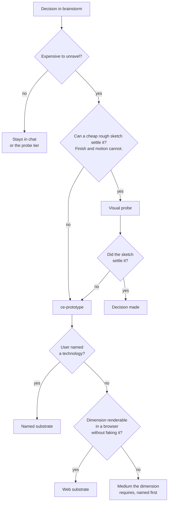
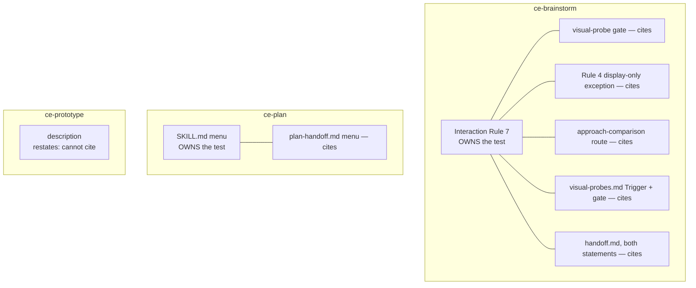

# Prototype Medium and Modality - Plan

## Goal Capsule

- **Objective:** Give `ce-prototype` one organizing rule — do not fake the dimension being tested — so modality, fidelity, and medium all derive from the dimension under test, and make every surface that states when the skill applies agree with it.
- **Product authority:** This plan owns `ce-prototype`'s boundary and medium selection, plus the routing predicate wherever it is stated in full — in `ce-brainstorm` and `ce-plan` alike. It does not own the preview helper's mechanics, `light-webserver.js`, `ce-polish`, or anything downstream of a prototype run.
- **Open blockers:** None.

---

## Product Contract

### Summary

`ce-prototype` gets a single organizing rule — the prototype must not fake the dimension being tested — and modality, fidelity, and medium each follow from that dimension, with "default to web unless the user names a technology" stated plainly beneath it as the concrete floor. That admits questions settled by seeing, lets fidelity differ per avenue inside one wide run, and reframes throwaway as unmaintained rather than discarded. The same predicate then replaces the drive-versus-look-at test at every site that states it, so the widened skill stays reachable from the menus people actually use.

### Problem Frame

`ce-prototype` separates size from finish correctly inside itself. `skills/ce-prototype/SKILL.md:47-49` says "Size the prototype to the uncertainty, not to 'small'", "Finishness is a different axis", a placement question "stays thin", and "do not pick one richness for the whole run". Nothing there biases toward over-rich prototypes.

The defect is at the skill's boundary, which collapses two independent axes — fidelity (rough to high) and modality (look at vs interact) — into one. `ce-prototype` is worded around interaction throughout: its description excludes "not just talk it through or look at a sketch", its result is "a prototype they could use", `SKILL.md:61` says "Wait for the user to use the artifact", and `SKILL.md:14` lists "a visual probe" as a non-goal. Meanwhile `skills/ce-brainstorm/references/visual-probes.md:55-58` caps the cheap tier hard, with an Avoid list that includes "polished branding" and "final colors or typography".

| | Rough | High fidelity |
|---|---|---|
| **Settled by seeing** | visual probe | uncovered |
| **Settled by using** | rare | `ce-prototype` |

A question in the uncovered cell — three logo directions, a typographic system, a dense layout at real density, a final color treatment — is refused by the cheap tier as too polished and by `ce-prototype` as look-at.

The repo already contradicts itself here. `visual-probes.md:15` escalates on fidelity: "a cheap one-decision sketch cannot settle it, that is Interaction Rule 7". Four lines later, `visual-probes.md:19` escalates on modality: "A decision the user has to drive rather than look at routes to Interaction Rule 7 (`ce-prototype`) instead, per the Trigger above". That trailing citation claims to restate the first test while stating a different one, so a look-at question needing high fidelity has two conflicting routes and a false pointer between them.

The modality test is not confined to that file. It appears at nine sites across three skills in four different wordings: four in `skills/ce-brainstorm/SKILL.md` alone — Interaction Rule 7, the always-loaded visual-probe gate, Interaction Rule 4's display-only exception, and the approach-comparison route — two in `skills/ce-brainstorm/references/handoff.md`, and one each in `references/visual-probes.md`, `skills/ce-plan/SKILL.md`, and `skills/ce-plan/references/plan-handoff.md`. The three handoff menus are the highest-traffic entry points into the skill, so a fix confined to one reference file would widen the skill while leaving it unreachable.

A second failure appears in repos whose product is not a web app. `SKILL.md` mentions "web" exactly once (`:51`); every browser, port, and screenshot assumption sits in `skills/ce-prototype/references/preview.md`. What the spine does say is that "a run in a repo is about that product", to "recreate what this question needs from the current product", and to "scale into the existing app". In a Swift or native repo those instructions argue for building in the product's own stack — the expensive path a prototype exists to avoid. `docs/plans/2026-08-12-003-feat-ce-prototype-skill-plan.md` never considered non-web surfaces or non-code domains, in scope or in either deferred list, and `skills/ce-prototype/` has no domain-classification gate and no `references/universal-*.md`, unlike `ce-brainstorm` and `ce-plan`.

There is also an ordering cost inside plain web work. `skills/ce-brainstorm/SKILL.md:193` lists "UI layout or navigation" as an inherently-visual signal, so the rough visual-probe tier is offered first for a question like "make the global nav more fun" — a question `SKILL.md:41` already names as the canonical wide example. Fun lives in finish and motion, which rough deliberately strips, so that offer is structurally unable to settle it.

### Key Decisions

- **Experience, not driving, is the load-bearing test.** Seeing settles a visual dimension; using settles a behavioral one. (session-settled: user-directed — chosen over keeping the drive gate: a prototype's job is to let someone experience the dimension, and some dimensions are experienced by looking.) Governs R2.
- **Web is the default substrate, decoupled from the product's stack.** (session-settled: user-directed — chosen over matching the product's implementation language: web is fast to build and iterate, and the dimension under test is almost never the stack itself.) Governs R5, R6.
- **One organizing rule instead of enumerated per-domain clauses.** The rule self-limits as new domains appear; the web default is the concrete floor beneath it. (session-settled: user-approved — chosen over adding a clause per case: enumeration needs editing every time someone prototypes in a new domain.) Governs R1, R3, R4.
- **Throwaway means unmaintained and unshipped, not discarded.** (session-settled: user-directed — chosen over strict discard: the artifact carries information the implementation can look at, alongside the decisions capsule.) Governs R11.
- **Sibling-parity domain gate rejected.** (session-settled: user-approved — chosen over a `0.1b`-style gate plus a `universal-prototyping.md` route: the organizing rule reaches non-code domains at a fraction of the prose.) The exclusion itself is recorded in Scope Boundaries.
- **The prototype's survival is best-effort, not guaranteed.** (session-settled: user-directed — chosen over adding a durability requirement: the scratch directory is technically not durable but in practice persists across the window that matters, and guaranteeing it would change behavior for existing code runs too.) Governs R11.
- **The visual-probe escalation is sharpened in the same change.** (session-settled: user-directed — chosen over leaving `visual-probes.md:15` alone: the rough tier structurally cannot settle a finish or motion question, so offering it first wastes a round.) Governs R10.

### Requirements

**Organizing rule**

- R1. `skills/ce-prototype/SKILL.md` states one organizing rule in its spine: the prototype must not fake the dimension being tested. Modality, fidelity, and medium each derive from that dimension.
- R2. A question settled by seeing is in scope on the same terms as one settled by using. The skill does not require the user to drive the artifact, and the user's own perception — not the agent's judgment — settles the question either way.
- R3. Fidelity rises to whatever the dimension under test requires, including visual finish when finish is the dimension. Throwaway constrains durability, not finish.
- R4. Within one wide run, fidelity may differ per avenue, and the avenues named may include purely visual ones alongside interaction mechanisms.

**Medium selection**

- R5. Web is the default prototype substrate regardless of the product's implementation language or platform.
- R6. The default yields in exactly two cases: the user names a technology, or the dimension under test cannot be rendered in a browser without faking it. When web would fake the dimension and no technology was named, the skill builds in the medium the dimension itself requires and names that choice before building. When the named technology also cannot render the dimension, the skill says so rather than yielding silently.
- R18. The artifact is whatever a browser can display and the agent can author — HTML, SVG, and CSS renderings among them — shown inside the page the existing preview helper already serves. Where the host offers image generation the run may use it; where it does not, the run says so and authors the candidates as markup rather than stopping. No new display mechanism is introduced, and the helper's stop-and-report rule when no local URL can be shown is unchanged.

**Reachability**

- R7. `ce-prototype`'s description admits questions settled by seeing, so the skill triggers on a purely visual decision. The description keeps naming the adjacent work that belongs elsewhere.
- R8. `ce-brainstorm`'s Interaction Rule 7 fires for a purely visual decision, not only for one encoding behavior or interaction.
- R9. Every site that states when `ce-prototype` applies uses one test: the decision is expensive to unravel and a cheap sketch cannot settle it. The rule is stated in full once per skill — a skill cannot cite another skill's file — and every further site inside that skill cites its own skill's owner. The drive-versus-look-at route is removed rather than qualified, and no site restates the rule while citing another as its source.
- R10. Finish and motion are named inside the sketch test as dimensions a rough sketch cannot settle, so a question turning on them skips the rough tier rather than being offered it first. The unravel-cost half of the test still applies: a decision that is cheap to reverse stays in chat or in the probe tier however visual it is.
- R14. The visual-probe gate keeps a non-firing branch: a decision routed straight to `ce-prototype` does not also get a sketch-versus-text offer.
- R15. Per-avenue classification applies only once the avenues have been named. An undecomposed decision is classified once, on its dominant dimension. When any named avenue routes to `ce-prototype`, the whole decision goes with it — the prototype run carries the sketchable avenues as thin variants rather than splitting one decision across two paths.
- R16. A decision that already went through the visual-probe offer can re-enter the prototype route — when the user chose text and the decision then turns on finish or motion, or when a rough sketch was built and failed to settle it.
- R17. The over-firing guard covers visual decisions: a visual choice that follows an existing token, type scale, or component-library pattern is routine and does not escalate, the same way routine UI does not.

**Run tail**

- R11. The prototype survives the run as a reference for the implementation that follows, alongside the decisions capsule. Survival is best-effort — the skill neither promises a lifetime nor relocates the artifact to guarantee one. A run that used the in-app overlay path is exempt, because those edits are undone when the try ends.
- R12. A run's output is a set of decisions; converging on one specific direction that resolves the ambiguity is the ideal outcome, not a precondition for the run being complete.
- R13. A run whose decisions have no Product Contract to write back to ends in a recap carrying the decisions and the prototype path. This is a legitimate terminal outcome, not a degraded one.

### Routing after the change

### Acceptance Examples

- AE1. Swift repo, navigation feel question.
  - **Covers R5.**
  - **Given** the repo's product is a native macOS app and the user has named no technology,
  - **When** the run picks a substrate,
  - **Then** it builds a web approximation rather than SwiftUI, and says so without being asked.
- AE2. User names the stack.
  - **Covers R6.**
  - **Given** the user says "prototype this in Swift",
  - **Then** the web default yields to the named technology.
- AE3. The dimension is the platform itself.
  - **Covers R1, R6.**
  - **Given** the question is whether real iOS momentum scrolling feels right,
  - **Then** web is rejected because it would fake the dimension under test, and the default yields without the user having to ask.
- AE4. Purely visual decision inside a brainstorm.
  - **Covers R8, R10, R14.**
  - **Given** the decision is which of three logo directions to commit to,
  - **When** the brainstorm reaches that decision,
  - **Then** the `ce-prototype` offer fires, the rough visual-probe tier is not offered first, and no sketch-versus-text question is asked.
- AE5. Wide question with mixed avenues.
  - **Covers R2, R3, R4, R15.**
  - **Given** the question is "make the global navigation more fun", already decomposed into a color-and-type avenue and a control-placement avenue,
  - **Then** the whole decision routes to prototype because the color-and-type avenue needs real finish, and the placement avenue rides along as a thin variant rather than being split off into a sketch.
- AE6. Non-code run with nothing to write back to.
  - **Covers R11, R13, R18.**
  - **Given** a logo run with no related brainstorm or plan,
  - **When** the user applies,
  - **Then** the candidate directions were shown in the served page — authored as markup when the host offers no image generation — the run recaps the decisions and points at the prototype, and it does not mint a plan or a third note.
- AE7. Re-entry after choosing text.
  - **Covers R16.**
  - **Given** the user was offered a sketch, chose text, and the decision then turns on how a transition feels,
  - **Then** the prototype route is available again for that same decision rather than closed by the do-not-re-offer rule.
- AE8. Routine visual choice.
  - **Covers R17.**
  - **Given** the decision is which existing color token to apply to a new badge,
  - **Then** it does not escalate to `ce-prototype`.
- AE9. Handoff menu after a plan.
  - **Covers R9.**
  - **Given** a plan whose only remaining open question is which of three visual treatments to commit to,
  - **When** the post-plan handoff menu renders,
  - **Then** the prototype option is shown rather than filtered out for not requiring use.

### Success Criteria

- The change adds no new reference file to `ce-prototype` and keeps net additions to always-loaded skill spines small — the organizing rule replaces wording rather than stacking on top of it.
- The routing rule is stated in full at most once per skill, and every further routing site inside that skill cites its own skill's owner. `ce-prototype`'s activation description restates the test because an activation contract cannot cite; it is not a routing site and does not count.
- A guard exists that would fail if any of the retired routing wordings is reintroduced in a routing-predicate region.

### Scope Boundaries

**Deferred for later**

- Image generation as an allowed medium in **`ce-brainstorm`'s visual-probe tier**. It appears nowhere in the repo as a probe medium today, and adding it would keep more cheap visual questions in the cheap tier. This deferral is scoped to the probe tier — R18 governs what `ce-prototype` produces, and does not depend on host image generation.
- A durability guarantee for the prototype artifact — relocating it out of scratch, or promising a lifetime. Per R11 survival stays best-effort; hardening it would change behavior for existing code runs too.

**Outside this product's identity**

- A domain-classification gate and a `universal-prototyping.md` route mirroring `ce-brainstorm`'s `0.1b` and `ce-plan`'s `0.1b`. Per the rejected-parity decision above, the organizing rule reaches non-code domains without one.
- Changes to `skills/ce-prototype/references/preview.md`'s helper mechanics, its stop-and-report rule, or `scripts/light-webserver.js`. The helper is byte-parity-tested against `ce-brainstorm`'s copy and stays untouched.
- Turning `ce-prototype` into a design-deliverable tool. The run produces decisions about direction; producing the finished artifact is separate work.

### Dependencies / Assumptions

- The bundled preview helper already serves `.png`, `.svg`, and `.jpg` from the run's `screens/` directory, so displaying a visual artifact needs no new infrastructure. Verified in `skills/ce-prototype/scripts/light-webserver.js`'s content-type table. What no host guarantees is the *authoring* capability — neither shipping host supplies image generation — which is why R18 rests on agent-authored markup and treats host image generation as an upgrade. U7's end-to-end scenario is where that path first runs.
- `ce-brainstorm` refuses to run a design campaign in its own workflow, which is why the fidelity ceiling rises in `ce-prototype` rather than in the visual-probe tier.
- `skills/ce-prototype/SKILL.md:70` and `skills/ce-prototype/references/write-back.md:7-9` already fail closed to a chat recap when no related plan exists, so R13 changes the framing rather than the mechanism.
- Both downstream skills already carry non-software routes, so the existing handoff recommendation stays valid for a non-code run.
- The scratch directory at `/tmp/compound-engineering-<uid>/ce-prototype/<run-id>/` is not a durability guarantee, but in practice persists across the window between a prototype run and the work that follows it. R11 rests on that.

### Outstanding Questions

**Deferred to Planning**

- Whether `docs/skills/ce-brainstorm.md`'s mirrored Rule 7 wording needs a full rewrite or only the predicate clause. Resolved during U6 by reading the current text.

---

## Planning Contract

**Product Contract preservation:** changed — R6 gained the silent-yield clause and the no-technology-named case; R9 widened from one file to every site that states the predicate (the scope expansion confirmed at the pre-write checkpoint) and was then scoped to once-per-skill; R10 folded finish-or-motion into the sketch test and restored the unravel-cost precondition; R11 gained the overlay-path exemption; R15 gained the decomposition caveat and the whole-decision-travels rule; R18 widened from generated images to any agent-authorable browser-displayable artifact; R14–R18 and AE7–AE9 added from flow analysis; AE5 and AE6 restated to match R15 and R18. R1–R5, R7, R8, R12, R13 and AE1–AE4, AE7–AE9 keep their original meaning and IDs.

### Key Technical Decisions

- KTD1. **Change the predicate, not the file.** Every site stating when `ce-prototype` applies gets the sketch test. (session-settled: user-approved — chosen over scoping the fix to `visual-probes.md`: the drive predicate is stated in six places including both `ce-plan` handoff menus, so a file-scoped fix leaves the widened skill unreachable from the highest-traffic entry points.) Governs R9, R14.
  - Corrected site inventory, found after the decision was settled: nine statements, not six. `skills/ce-brainstorm/SKILL.md` carries four — Interaction Rule 7, the always-loaded visual-probe gate, Interaction Rule 4's display-only exception, and the approach-comparison route. `skills/ce-brainstorm/references/handoff.md` carries two — the prototype option's gate and the mutual-exclusion clause on the review option. `skills/ce-brainstorm/references/visual-probes.md`, `skills/ce-plan/SKILL.md`, and `skills/ce-plan/references/plan-handoff.md` carry one each. The correction widens the site list; it does not change the decision.
- KTD8. **Ownership is per skill, not per repo.** A skill cannot reference another skill's files, and a `ce-plan` run never loads `ce-brainstorm`'s spine, so a cross-skill citation is unresolvable at runtime. Each skill states the rule in full exactly once — Interaction Rule 7 in `ce-brainstorm`, the menu in `ce-plan/SKILL.md` — and that skill's own reference files cite it. `ce-prototype`'s activation description restates the test independently because a description is matched as standalone text and can cite nothing. Governs R9.
- KTD2. **Compress the judgment, prescribe the protocol.** The organizing rule ships as principle plus exactly one minimal contrast pair; the web-default floor stays fully prescribed because a wrong guess breaks it. Governs R1, R5.
- KTD3. **Preserve the gate's non-firing branch when its predicate changes.** The clause at `skills/ce-brainstorm/references/visual-probes.md:19` does two jobs — routing and suppression. Only the routing half is replaced; deleting the sentence whole would make the gate fire for decisions that previously bypassed it, reintroducing the wasted round R10 exists to kill. Governs R14.
- KTD4. **Tighten existing guards; add one scoped negative assertion.** No new suite. The two tests that already pin this wording absorb the new pins, plus an assertion that rejects the four retired wordings — "substantial behavior or interaction", "drive rather than look at", "requires use, not inspection", "inspection, not use" — inside routing-predicate regions only: handoff-menu option lines, Interaction Rule 7, and the visual-probe gate. Whole-file matching is wrong in both directions: it would fire on `ce-prototype`'s required contrast pair, which describes the dimension rather than the route, and it would still miss a paraphrase. Governs R9.
- KTD5. **Behavioral verification is a paired old-versus-new injection eval, not `bun test`.** Two subagents blind to which version they hold and to the expected answer, given identical scenarios, on Claude and Codex. Fixtures cover both failure directions — the intended win and the over-fire guard. Governs R7, R8, R17.
- KTD6. **Keep the existing handoff menu label; rewrite only its gating predicate.** Four test files pin `**Prototype a remaining feel-question**` as a literal across three skill files; renaming it breaks all four for no product gain.
- KTD7. **Classify the dimension per avenue, once the avenues exist.** Avenue naming happens inside `ce-prototype`'s wide-run diverge step, not in the brainstorm gate, so per-avenue classification cannot be the entry test — an undecomposed decision is classified once on its dominant dimension. And a decision travels whole: when any avenue needs a prototype, the sketchable avenues ride along as thin variants. Splitting one decision across two tiers would leave a half-settled question that the settled-probe clause cannot evaluate. Governs R15.

### High-Level Technical Design

The routing predicate today is stated at nine sites across three skills, using four different wordings. The change gives each skill one owner and turns that skill's other sites into citations. Ownership stops at the skill boundary: a skill may not reference another skill's files, and a `ce-plan` run never loads `ce-brainstorm`'s spine, so a cross-skill pointer would be unresolvable at runtime.

Interaction Rule 7 owns `ce-brainstorm`'s copy because it is always-loaded in the skill where the decision first arises, and because routing that lives only in a reference file has been measured in this repo to fail — the agent loads the reference and then does not route. `ce-plan`'s menu owns its own copy for the same reason and because it has no other option.

---

## Implementation Units

### U1. Rebuild `ce-prototype`'s spine around the organizing rule

- **Goal:** One organizing rule governs modality, fidelity, and medium, with the web floor stated beneath it and throwaway reframed.
- **Requirements:** R1, R2, R3, R4, R5, R6, R11, R12, R13, R18. Implements the experience-over-drive, web-default, and throwaway-as-reference Key Decisions.
- **Dependencies:** none.
- **Files:** `skills/ce-prototype/SKILL.md`, `skills/ce-prototype/references/write-back.md`
- **Approach:**
  1. Elevate the existing sentence at `:55` into the spine as the organizing rule, with one contrast pair showing a dimension settled by seeing against one settled by using.
  2. Absorb the competing statements rather than qualifying them: the drive framing in the richness axis at `:49`, "so the user can try it" at `:9`, "a prototype they could use" at `:11`, "Not: a visual probe" at `:14`, and "Wait for the user to use the artifact" at `:61`. Per KTD2 the result is shorter, not longer.
  3. Add the web-default floor beside the medium sentence at `:51`, fully prescribed, with all three yield cases from R6 — named technology, unrenderable dimension with a technology named, unrenderable dimension with none named — and the say-so requirement.
  4. Reframe throwaway at `:49` and `:53` as unmaintained and unshipped, carrying the best-effort survival and the overlay exemption from R11.
  5. Beside the medium paragraph at `:51`, state R18: the artifact is whatever a browser can display and the agent can author, shown inside the page the preview helper already serves, with host image generation as an opportunistic upgrade rather than a prerequisite.
  6. Reframe the run tail at `:63` for R12 — a run's output is a set of decisions, and converging on one direction is the ideal rather than a precondition for completeness.
  7. Reframe the no-write-back branch at `:70`, and the matching fail-closed rules in `references/write-back.md:7-9`, so a recap carrying the decisions and the prototype path reads as a legitimate terminal outcome rather than a degraded one.
- **Execution note:** the accretion risk is the whole difficulty here — after each absorption, reread the surrounding block and delete what the change made redundant rather than leaving two statements of one rule.
- **Patterns to follow:** the prose admission rules and the stop-the-accretion-loop rule in the project's active instructions; `docs/solutions/skill-design/portable-agent-skill-authoring.md` for proportionality.
- **Test scenarios:**
  - `bun test tests/skills/ce-prototype-protocol.test.ts` still passes: the six `decisions.md` capsule strings, `do not scan the tree`, and the backticked `references/write-back.md` and `references/preview.md` paths survive.
  - `tests/skills/user-facing-skill-invocation-rendering.test.ts` still passes: the `/ce-prototype` `/ce-brainstorm` `/ce-plan` block at `:18` is untouched.
  - Grep the file for a surviving drive-only modality claim; expect none.
  - Grep the file for the organizing rule and the web-default floor; expect one statement of each.
  - The spine states, in its own words, each of R12, R13, and R18 — decisions-as-output, recap-as-terminal-outcome, and agent-authored artifacts shown in the served page.
- **Verification:** the spine reads as one rule with derived consequences; no sentence states the modality test independently; and R12, R13, and R18 each have a locatable sentence.

### U2. Widen `ce-prototype`'s activation contract

- **Goal:** The description triggers on a purely visual decision while still naming the adjacent work that belongs elsewhere.
- **Requirements:** R7.
- **Dependencies:** U1.
- **Files:** `skills/ce-prototype/SKILL.md` (frontmatter only)
- **Approach:** Replace the "not just talk it through or look at a sketch" exclusion with one keyed on whether a cheap sketch can settle the question. Keep the adjacent-negatives clause — activation and execution fail independently, and widening the trigger makes that clause load-bearing rather than decorative.
- **Patterns to follow:** the activation-contract obligations in `docs/solutions/skill-design/portable-agent-skill-authoring.md`.
- **Test scenarios:**
  - `tests/skills/ce-prototype-protocol.test.ts` passes: the description still matches `probe` and `polish` case-insensitively, and stays within the 1024 budget.
  - `tests/frontmatter.test.ts` passes: no unwrapped angle-bracket tokens; codepoint length within budget.
  - `tests/skill-conventions.test.ts` passes: the skill stays model-invocable.
- **Verification:** the description names the see-settled case and still names what belongs to a visual probe and to polish.

### U3. Unify the routing predicate across `ce-brainstorm`

- **Goal:** Interaction Rule 7 owns the sketch test; the visual-probe reference and the handoff menu cite it, and the gate keeps its non-firing branch.
- **Requirements:** R8, R9, R10, R14, R15, R16, R17.
- **Dependencies:** U1.
- **Files:** `skills/ce-brainstorm/SKILL.md`, `skills/ce-brainstorm/references/handoff.md`, `skills/ce-brainstorm/references/visual-probes.md`
- **Approach:**
  1. Rewrite Interaction Rule 7's subject clause so it covers a purely visual decision, and state the sketch test there as `ce-brainstorm`'s owning statement — including finish and motion as the named dimensions a rough sketch cannot settle (R10). Preserve the four tokens the guard pins — the unravel-cost phrasing, the not-at-a-fixed-phase phrasing, the routine-UI exclusion, and the literal skill name — and extend the routine-UI exclusion to its visual analogue per R17. The unravel-cost half stays a precondition: a cheap-to-reverse decision does not escalate however visual it is.
  2. In `skills/ce-brainstorm/SKILL.md`, rewrite the three other always-loaded routing statements to cite Rule 7 rather than restate a display-only test: the visual-probe gate condition, Interaction Rule 4's display-only exception, and the approach-comparison route.
  3. In `references/visual-probes.md`, replace the modality route at `:19` with a citation, keeping the suppression half so the gate still does not fire for decisions routed straight to prototype (R14). Remove the "per the Trigger above" pointer where it no longer describes what the sentence says.
  4. Also in `references/visual-probes.md`, add the per-avenue classification with its decomposition caveat (R15) and the two re-entry paths (R16) — a decision where the user chose text, and a sketch that was built and did not settle it. Both re-entry paths must also be admitted by the always-loaded gate's do-not-re-offer rule, or the gate and the reference disagree.
  5. In `references/handoff.md`, rewrite **both** predicate statements: the prototype option's gating clause and the mutual-exclusion clause on the review option. Leave the option label alone per KTD6.
- **Execution note:** change the gate's predicate and its non-firing branch in the same edit — a green suite with a reference that contradicts the spine is the specific failure this unit is guarding against.
- **Patterns to follow:** `docs/solutions/skill-design/post-menu-routing-belongs-inline.md` for why the owning statement stays in always-loaded prose.
- **Test scenarios:**
  - `tests/skills/ce-brainstorm-visual-probes.test.ts` passes: the four Rule 7 tokens survive, and the display-only, feedback-in-chat, and tripwire-precedence assertions still hold — including the `/before.*shape.*behavior/i` and ASCII-preview assertions inside the always-loaded region step 2 rewrites.
  - `tests/skills/ce-brainstorm-output-mode.test.ts` and `tests/skills/ce-prototype-handoff.test.ts` pass: the `**Prototype a remaining feel-question**` label and the settled-probe predicate string are unchanged.
  - `tests/skills/ce-brainstorm-section-order.test.ts` passes: no `###` renumbering.
  - A decision routed straight to prototype produces no sketch-versus-text offer (R14), verified by reading the gate's branch text.
  - Grep all three files for the retired wordings; expect none outside Rule 7's own statement.
- **Verification:** one full statement of the test in Rule 7; every other mention in these three files reads as a citation; and the gate's non-firing branch still has an antecedent.

### U4. Unify the routing predicate across `ce-plan`

- **Goal:** The post-plan handoff menus stop filtering out decisions settled by seeing.
- **Requirements:** R9.
- **Dependencies:** U3.
- **Files:** `skills/ce-plan/SKILL.md`, `skills/ce-plan/references/plan-handoff.md`
- **Approach:** Rewrite the "requires use, not inspection" gating predicate in both menu copies. Per KTD8 a citation cannot cross the skill boundary, so `skills/ce-plan/SKILL.md`'s menu carries the one-clause sketch test inline as `ce-plan`'s own owning statement — no path, no cross-skill reference — and `references/plan-handoff.md` cites that. Keep the option label and the settled-probe clause verbatim.
- **Test scenarios:**
  - `tests/skills/ce-prototype-handoff.test.ts` passes. Note what it actually pins: the option label in both files, but the settled-probe string only in `ce-brainstorm/references/handoff.md`, and `Do not build a prototype in this skill` only there and in `ce-plan/SKILL.md`. Drift in `plan-handoff.md`'s rewritten predicate stays green — check it by hand.
  - `tests/skills/ce-plan-handoff-routing.test.ts` passes: it asserts against the exact `##### 5.3.8` region this unit edits.
  - `tests/skills/ce-plan-output-mode.test.ts` passes.
  - The handoff-menu acceptance case: a plan whose only open question is a visual treatment choice shows the prototype option.
- **Verification:** `ce-plan/SKILL.md` states the test once, `plan-handoff.md` cites it, and neither points at a file outside `skills/ce-plan/`.

### U5. Tighten the mechanical guards

- **Goal:** The new predicate is pinned where it lives, and a reintroduced drive predicate fails the suite.
- **Requirements:** R9. Implements KTD4.
- **Dependencies:** U1, U2, U3, U4.
- **Files:** `tests/skills/ce-prototype-protocol.test.ts`, `tests/skills/ce-brainstorm-visual-probes.test.ts`
- **Approach:** Extend the two existing suites rather than adding one. Pin the organizing rule and the web-default floor in `ce-prototype`'s body, and the sketch test in Interaction Rule 7's region. Add the negative assertion per KTD4: reject the four retired wordings inside routing-predicate regions — handoff-menu option lines, Interaction Rule 7, and the visual-probe gate — not across whole files. `ce-prototype`'s organizing-rule contrast pair is out of scope because it describes the dimension rather than the route, and a whole-file match would fire on it. Use the region-scoped regex style with a failure message that explains the invariant, and alternation where the sentence could legitimately be reworded — pin the invariant, not the English.
- **Patterns to follow:** the right-size-new-mechanical-guards rule in the project's active instructions; the existing region-slice assertions in `tests/skills/ce-brainstorm-visual-probes.test.ts`.
- **Test scenarios:**
  - Each new assertion fails when its target sentence is reverted to the pre-change wording — check by reverting one at a time.
  - The negative assertion fails when any retired wording is reintroduced into a routing-predicate region, and passes on the post-change tree — including on `ce-prototype`'s retained contrast pair, which must not trip it.
  - Assertions are scoped to a token or region, not a snapshot of a whole skill body.
- **Verification:** every new pin has been observed failing against the old bytes, not just passing against the new ones.

### U6. Update the glossary and the user-facing docs

- **Goal:** The published description of both skills matches the shipped behavior.
- **Requirements:** R2, R7, R9.
- **Dependencies:** U1, U2, U3, U4.
- **Files:** `CONCEPTS.md`, `docs/skills/ce-prototype.md`, `docs/skills/ce-brainstorm.md`, `docs/skills/README.md`, `README.md`
- **Approach:**
  1. `CONCEPTS.md` — the visual-probe entry ends on the retired framing ("something you click through to feel an interaction"); the experience-prototype entry rests on "so a human can try it". Reconcile both with experience-over-drive and the throwaway reframe.
  2. `docs/skills/ce-prototype.md` — the drive framing appears in the positioning paragraph, the TL;DR row, and the how-finished section. Rewrite those three; keep the page's existing section shape.
  3. `docs/skills/ce-brainstorm.md` — update the mirrored Rule 7 wording and the visual-probe boundary line. Do not renumber its `###` sections.
  4. Update the one-line inventory rows in `docs/skills/README.md` and root `README.md`.
- **Test scenarios:**
  - `bun run test` passes, including the section-order parser over `docs/skills/ce-brainstorm.md`.
  - `bun run release:validate` passes; the skill count is unchanged because no skill was added or removed.
  - Grep the five files for "use, not inspection" and for the drive framing; expect none.
- **Verification:** a reader of the docs would predict the shipped routing behavior.

### U7. Behavioral eval on Claude and Codex

- **Goal:** Evidence that the prose change moves activation and routing in the intended direction without over-firing.
- **Requirements:** R7, R8, R17, R18. Implements KTD5.
- **Dependencies:** U1, U2, U3, U4.
- **Files:** none in the repo; results go in the PR body.
- **Approach:** Use `skill-creator`'s inject-at-dispatch eval. Extract the pre-change bytes from git and the post-change bytes from the working tree, and inject the file contents — never invoke the installed skill, whose cached copy may predate the edit. Run each arm blind to which version it holds and to the expected answer. Run both models; the description ships to both.
- **Execution note:** design at least one scenario where the old prose fails and the new prose succeeds. If every scenario passes in both arms, record that honestly as determinism and weaker-model insurance rather than relabeling it a behavior fix.
- **Patterns to follow:** `docs/solutions/skill-design/paired-old-vs-new-injection-skill-evals.md`; `docs/solutions/skill-design/strong-models-mask-defensive-skill-fixes.md` for guarding both directions.
- **Test scenarios:**
  - Intended win: three logo directions inside a brainstorm route to `ce-prototype` without a rough sketch offered first.
  - Intended win: a nav-feel question in a Swift repo produces a web approximation, not SwiftUI.
  - Over-fire guard, must not escalate: applying an existing color token to a new badge.
  - Over-fire guard, must not escalate: a visual-probe question the user already settled.
  - Over-fire guard, must not escalate: a novel but cheap-to-reverse motion choice ("should this toast slide or fade?") — visual, but the unravel-cost half of the test fails.
  - Adjacent-negative for activation: a request to polish a working feature does not activate `ce-prototype`, and the run points the user at the polish skill rather than invoking it. Grade on non-activation, not on routing — `ce-polish` carries `disable-model-invocation`, so no agent can route to it and "routes to polish" is ungradeable.
  - Mixed-avenue case: a wide "more fun" question with named visual and interaction avenues routes the whole decision to prototype, carrying the sketchable avenue as a thin variant.
  - End-to-end non-code run (R18, AE6): a logo question with no related brainstorm or plan produces browser-displayable candidate directions inside the served page — authored as markup where the host offers no image generation — and ends in a recap carrying the decisions and the prototype path.
- **Verification:** each scenario has a recorded outcome per model and per arm, with non-discriminating results labeled as such. The two restraint guards are new-arm-only by construction; record them that way rather than as tied results.

---

## Verification Contract

| Gate | Command | Applies to | Done signal |
|---|---|---|---|
| Targeted suite | `bun test tests/skills/ce-prototype-protocol.test.ts tests/skills/ce-prototype-handoff.test.ts tests/skills/ce-brainstorm-visual-probes.test.ts tests/skills/ce-brainstorm-output-mode.test.ts tests/skills/ce-plan-output-mode.test.ts tests/skills/ce-plan-handoff-routing.test.ts tests/skills/ce-brainstorm-section-order.test.ts tests/skill-conventions.test.ts tests/frontmatter.test.ts` | U1–U5 | All pass |
| Full suite | `bun run test` | All units | All pass |
| Release metadata | `bun run release:validate` | U6 | Passes; skill count unchanged |
| Plugin schema | `bun run plugin:validate` | U2 | Passes with `--strict` |
| Guard inversion | Revert each new assertion's target sentence one at a time; rerun the targeted suite | U5 | Each new assertion fails against the old bytes |
| Behavioral eval | `skill-creator` paired injection, Claude and Codex | U7 | Every scenario has a recorded per-model, per-arm outcome |

## Definition of Done

- One organizing rule governs `ce-prototype`'s modality, fidelity, and medium, with the web-default floor stated beneath it.
- The routing test is stated in full at most once per skill; every further routing site inside that skill cites its own owner, `ce-prototype`'s activation description is exempt, and the visual-probe gate keeps its non-firing branch.
- A guard fails if any retired routing wording is reintroduced in a routing-predicate region, and every new pin has been observed failing against the pre-change bytes.
- `bun run test`, `bun run release:validate`, and `bun run plugin:validate` all pass.
- The glossary and the four user-facing doc surfaces describe the shipped behavior.
- The eval's per-model, per-arm outcomes are recorded in the PR body, with non-discriminating results labeled rather than overclaimed.
- The PR body carries the per-item feedback ledger the project's skill-revision rule requires, and both disclosure sections are filled.

---

## Sources / Research

- `skills/ce-prototype/SKILL.md` — `:14` non-goals, `:41` wide-question example, `:47-49` sizing and finishness, `:51` default scratch environment and the single "web" mention, `:55` "do not fake the dimension being tested", `:61` who settles a question, `:70` fail-closed tail.
- `skills/ce-prototype/references/preview.md` — where the browser, port, and screenshot assumptions actually live, and the stop-and-report rule at `:66`.
- `skills/ce-prototype/references/write-back.md` — `:3` what the continuity capsule carries, `:7-9` fail-closed rules.
- `skills/ce-brainstorm/references/visual-probes.md` — `:15` fidelity route, `:19` modality route and its false back-citation, `:55-58` Avoid list.
- `skills/ce-brainstorm/SKILL.md` — `:52` Interaction Rule 7 wording, `:193` inherently-visual tripwire signals, and the always-loaded visual-probe gate condition.
- `skills/ce-brainstorm/references/handoff.md`, `skills/ce-plan/SKILL.md`, `skills/ce-plan/references/plan-handoff.md` — the three handoff menus gating on "requires use, not inspection".
- `docs/plans/2026-08-12-003-feat-ce-prototype-skill-plan.md` — the original scope, including `:189`'s assumption of "a throwaway web approximation" and the deferred lists that never mention non-web surfaces.
- `docs/solutions/skill-design/portable-agent-skill-authoring.md` — activation contract obligations and proportionality rules.
- `docs/solutions/skill-design/post-menu-routing-belongs-inline.md` — measured evidence that reference-only routing does not fire, and that a contract test must pin the body rather than follow the string.
- `docs/solutions/skill-design/frontier-model-skill-modernization-methodology.md` — principle plus one contrast pair; the protocol-versus-judgment test.
- `docs/solutions/skill-design/paired-old-vs-new-injection-skill-evals.md` — eval design and the inject-the-file leak control.
- `docs/solutions/skill-design/strong-models-mask-defensive-skill-fixes.md` — guarding both failure directions when widening a trigger.
