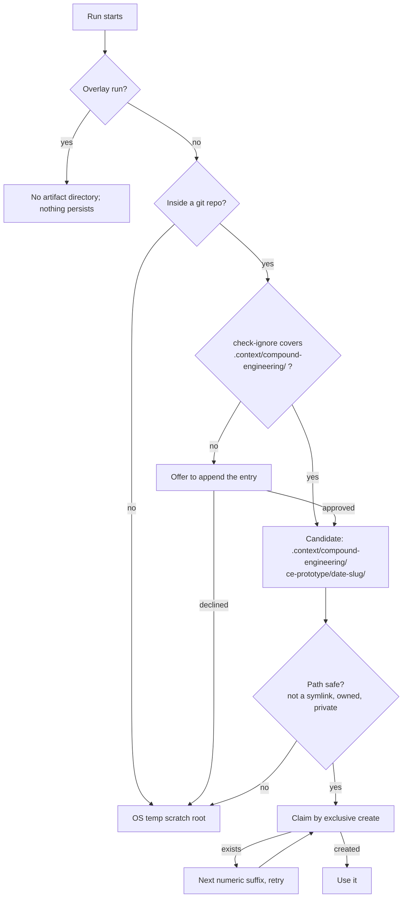

# Prototype Craft Floor and Durable Storage - Plan

## Goal Capsule

- **Objective:** Give `ce-prototype` a design-quality floor of its own for questions settled by seeing, and a storage default that keeps prototypes instead of leaving them in OS temp — plus the `ce-setup` step that makes that storage safe.
- **Authority hierarchy:** Requirements (R-IDs) govern behavior. Key Technical Decisions govern mechanism inside those requirements. Unit Approach fields carry unit-local detail only.
- **Execution profile:** Skill-prose and shell-script changes across two skills, with greppable mechanical guards. No runtime code paths outside `skills/ce-setup/scripts/check-health`.
- **Stop conditions:** Stop and ask if the craft floor cannot be authored without reusing wording from an external design tool, or if the storage default would require changing `scripts/light-webserver.js`.
- **Tail ownership:** Standalone run — the implementer owns commit and PR.

**ID gaps are deliberate.** R6-R15, R26-R31, KD1-KD3, KTD2, KTD4, KTD5, KTD10-KTD13, U4, and U6 were an optional hand-off to a third-party design skill, cut after review. IDs are not renumbered, so the gaps record what was removed.

---

## Product Contract

### Summary

`ce-prototype` gains a design-quality floor that fires on look-and-feel questions and a storage default that keeps prototypes in a gitignored in-repo directory. `ce-setup` gains the step that puts `.context/compound-engineering/` in the repo's `.gitignore`, which also repairs a claim `ce-optimize` already makes.

### Problem Frame

`ce-prototype` sizes fidelity to the question but says nothing about craft. On a question settled by seeing, that gap decides the outcome twice over: a variant judged through a broken render is a false negative, and a request for three distinct visual avenues reliably returns three renditions of one default aesthetic, so the user chooses between variations of a single idea while believing they chose between three.

Storage is a second, older gap. The skill tells the implementation that follows to read the prototype, then stores it under `/tmp` and admits survival is best-effort. The artifact it wants read later is the one it does not keep. Sibling skills default to OS temp because their artifacts are display-only sketches; a prototype is not.

### Key Decisions

- KD4. **Prototypes are kept by default.** (session-settled: user-directed — chosen over the OS-temp default the sibling skills use: losing wanted work costs more than deleting unwanted work.) Governs R16, R21.
- KD5. **Keeping does not mean committing.** (session-settled: user-directed — chosen over tracking prototypes in git: prototype code must not be promoted into the product.) Governs R17, R22.
- KD6. **The ignore entry covers the plugin's namespace, not `.context/` wholesale.** (session-settled: user-directed — chosen over ignoring the whole directory: the plugin does not own that name and a blanket rule could hide another tool's intentional content.) Governs R22, R23.
- KD7. **The craft discipline is authored into this skill rather than reached for in a third-party tool.** (session-settled: user-directed — chosen over an optional hand-off to an installed external design skill: that skill is built for interactive human use, and the parts worth having survive as method rather than as a dependency.) Governs R1, R34.

### Requirements

**Craft floor**

- R1. `ce-prototype` applies a design-quality floor on every run whose question is settled by seeing.
- R2. The rule for telling a seeing question from a driving one is stated once in `SKILL.md` itself. Only the floor's substance lives in the reference the skill loads.
- R3. The floor covers text contrast at WCAG AA thresholds, spacing rhythm, text measure, a legible type scale, interactive and empty states, visible keyboard focus, one authored motion moment rather than scattered effects, and control and error copy that names the action and the recovery.
- R4. On a wide seeing run, the avenues differ by organizing principle. A palette or typeface swap over one arrangement is one avenue, not two. This applies the existing wide-run rule to seeing questions rather than replacing it.
- R5. The floor never raises fidelity on a driving question.
- R34. The floor names the templated arrangements a generic result falls into and rejects them, so an avenue is judged on whether it is specific to this product rather than only on whether it is mechanically clean.
- R35. Each floor item applies to the dimensions the question actually puts in play. A placement question does not acquire a motion moment or an empty state because the floor names them.

**Storage**

- R16. A run's artifacts default to `.context/compound-engineering/ce-prototype/<date>-<slug>/`.
- R17. The run falls back to the existing OS-temp scratch root when `.context/compound-engineering/` is not covered by `.gitignore` and the user declines to add it, or when the run is not inside a git repository.
- R18. A directory name is claimed by exclusive creation, taking the next unused numeric suffix when creation reports the path exists. A run never writes into a directory another run created.
- R19. The run capsule and any end-of-run recap name the directory that was actually used.
- R20. An overlay run leaves nothing behind, unchanged from today.
- R21. The user can decline keeping on request. The skill does not try to detect throwaway intent on its own.
- R32. Nothing deletes a kept prototype. The directory is the user's to prune.
- R36. When one invocation covers more than one question, each question gets its own child directory under the run directory, and the capsule names each.
- R37. The in-repo run directory is created under the same safety discipline the OS-temp path already uses: refuse a symlinked path, verify ownership, create with a private umask, and restrict the mode. An unsafe path falls back to OS temp rather than proceeding.

**Setup and gitignore**

- R22. `ce-setup` offers to append `.context/compound-engineering/` to the repo-root `.gitignore` whether or not that directory exists yet. It appends only after approval and leaves unrelated `.gitignore` content untouched.
- R23. The coverage probe is `git check-ignore -q .context/compound-engineering/`, with the trailing slash, so an existing directory-only rule is honored before the directory exists.
- R24. `ce-prototype` runs the same probe and offer on its first write in a repository. This is the primary path to durable storage; a user who never prototypes never needs the entry.
- R25. The `ce-setup` health check reports uncovered scratch space as an informational note rather than a project issue, so a repository that has never used a scratch-producing skill does not read as unhealthy.
- R33. The ignore entry is one literal string, byte-identical everywhere it is written.

### Success Criteria

- A run whose question is a visual direction produces avenues a reader can tell apart from a description alone, not by comparing hex values.
- An avenue reads as specific to the product it was built for, not as a template the same agent would produce for any subject.
- Inside a git repository with the ignore entry accepted, a prototype built today is still openable next week without the user having saved it anywhere. Runs that fall back to OS temp stay best-effort, as they are today.

### Scope Boundaries

- Not changing what `ce-prototype` decides, how it classifies narrow versus wide, or how it drives a preview.
- Not changing `ce-brainstorm`'s visual probes, which keep their OS-temp default. See KTD6.
- Not migrating prototypes that already exist under the OS-temp root.
- Not exposing any of this through `.compound-engineering/config.yaml`.
- **No integration with a third-party design skill.** An optional hand-off was designed, prototyped, and cut: containing a tool that resolves its own project root and is built around interactive human gates could not be reduced to a claim the mechanism supports, and the parts worth having are the method this plan now carries natively.

#### Deferred to Follow-Up Work

- Discovering a prior run's capsule from a fresh session. Durable storage makes cross-session resume possible, but the discovery step is a new capability rather than part of this change.
- Offering, at the end of a wide seeing run, to take the question to an interactive design tool the user has installed. That is a hand-off to a human, not a nested call, and belongs to its own change if it is wanted.

### Open Questions

None blocking.

### Sources

- `skills/ce-prototype/SKILL.md:36` — the go-ahead composition point; `:38-45` — the existing wide-run divergence rule R4 specializes; `:51,55` — the fidelity fork R2 attaches to and the storage line R16 replaces; `:65` — the prototype is left for the implementation that follows to read.
- `skills/ce-prototype/references/preview.md` — carries the run root in its directory tree and in **both** executed blocks (`start`, and `status`/`stop`); all move in lockstep. Its scratch-root safety idiom is what R37 extends to the in-repo path.
- `skills/ce-brainstorm/references/visual-probes.md:150-162` — the opposite storage default, and the reason KTD6 records a deliberate divergence.
- `skills/ce-worktree/SKILL.md:45` — the `git check-ignore -q <path>/` probe and the trailing-slash gotcha behind R23; also self-serve-at-first-write precedent for KTD3, with `skills/ce-product-pulse/SKILL.md:132` and `skills/ce-sweep/references/interview.md:159`.
- `skills/ce-setup/SKILL.md:127-135` — Step 7, the ask-then-append shape R22 follows; `:71-77` is the project-issue list R25 deliberately does not join.
- `skills/ce-promote/references/spiral-cli.md:70` — names `ce-setup` canonical for the shared teammate-facing entry specifically.
- `skills/ce-optimize/SKILL.md:672` — asserts `.context/` is gitignored with nothing guaranteeing it; R22 makes the claim true. `:690` — the retention precedent R32 declines to follow.
- `tests/docs-root-rule-parity.test.ts` — the cross-skill string-parity pattern R33 reuses.
- `docs/solutions/skill-design/post-menu-routing-belongs-inline.md` — the measured inline/extracted/re-inlined result behind R2.
- `docs/plans/2026-08-12-003-feat-ce-prototype-skill-plan.md:54` — the founding decision that the skill's contract travels without a catalog of other tools; KD7 returns to it.

---

## Planning Contract

### Key Technical Decisions

- KTD1. **The seeing-versus-driving trigger stays inline; only the floor's substance is extracted.** `docs/solutions/skill-design/post-menu-routing-belongs-inline.md` measured 3/3 compliance inline, 0/5 extracted, 5/5 re-inlined for routing text. A summary stub inline is the worst of both — it suppresses the load without carrying the substance — so the inline text states the trigger and the load instruction and nothing else. Governs R1, R2.
- KTD3. **The ignore entry follows the house split: `ce-setup` owns the proactive offer, and the skill about to write owns the at-first-write offer.** This is convention, not an exception — `ce-worktree`, `ce-product-pulse`, and `ce-sweep` all self-serve at first write, and `ce-promote` names `ce-setup` canonical only for the shared teammate-facing entry. The hazard is two writers authoring two literals that both satisfy `check-ignore` but accumulate as separate lines, which R33 and its parity guard close. Governs R22, R24, R33.
- KTD6. **The storage default deliberately inverts `ce-brainstorm`'s.** Visual probes are display-only sketches whose durable artifact is the plan; a prototype is explicitly left for the implementation that follows to read. The two defaults differ because the artifacts differ. `ce-brainstorm` is not changed, and its existing opt-in `.context/` path becomes safe once U3 lands, the same spillover the `ce-optimize` fix gets. Governs R16.
- KTD7. **The capsule records the location and the design rationale in the run's own words.** The winning avenue's reasons are what the `ce-plan` or `ce-work` step the capsule exists to serve actually needs; a pointer to a directory is not enough on its own. Governs R19, R36.
- KTD8. **The craft-floor and trigger wording avoids the retired routing predicates.** `tests/skills/ce-prototype-protocol.test.ts` fails if any file under `skills/` contains `requires use, not inspection`, `inspection, not use`, `drive rather than look at`, or `substantial behavior or interaction`. The seeing-versus-driving trigger is the exact content that invites those phrasings. Governs R2, R3.
- KTD9. **The floor is authored fresh.** The founding plan forbids retaining recognizable wording from external prototype and design tooling; research enters as lessons, not as text. Threshold values that are public standards carry over as facts; phrasing does not. Governs R3, R34.
- KTD14. **No retention policy.** Kept prototypes accumulate in a gitignored directory the user can prune. Automatic deletion of user work is worse than disk use, and the exclusive-create rule means names never collide. Stated so a future reader knows it was considered. Governs R32.
- KTD15. **The floor is a per-dimension checklist, not a fixed build target.** Applying every item to every seeing run would inflate a placement question into a finished screen and contradict the skill's own rule that fidelity follows the dimension under test. The reference states which items a question's dimensions bring into play. Governs R5, R35.

### High-Level Technical Design

One shape carries this plan: how a run resolves where its artifacts go. It runs once per invocation, before anything is written.

### Assumptions

None load-bearing. Every mechanism this plan relies on is already used elsewhere in the repository.

### System-Wide Impact

- The `ce-setup` change is not scoped to prototypes. It covers the plugin's whole `.context/` namespace, so it also makes `ce-optimize`'s existing claim about gitignored scratch true in repositories that never added the entry by hand, and makes `ce-brainstorm`'s opt-in probe path safe.
- `skills/ce-prototype/scripts/light-webserver.js` is byte-identical to `ce-brainstorm`'s copy and `tests/compound-support-files.test.ts` enforces it. The storage change passes a different root to the server rather than changing it; if the server must change, both copies change together.
- `ce-prototype` stays model-invocable and `ce-setup` stays user-invoked. `tests/skill-conventions.test.ts` pins both.
- `ce-prototype` must not be added to `CONSUMER_SKILLS` in `tests/docs-root-rule-parity.test.ts`. Its `.context/` path is scratch storage, not a `docs_root`-governed artifact root.
- U3's new health-check line fires in every `ce-setup` test fixture that does not seed the entry. Because R25 makes it informational rather than a project issue, the existing `project issue(s) found` counts stay intact — but the healthy-path assertions that check for absent output need review.

### Risks & Dependencies

- The craft floor is prose an agent interprets, so its effect is measured behaviorally rather than proven by a guard. The Verification Contract carries that evaluation; the mechanical guards only prove the floor is present and reachable.

---

## Implementation Units

### U1. Craft floor with an inline trigger

- **Goal:** `ce-prototype` applies a design-quality floor on seeing questions, with the trigger inline and the substance in a loaded reference.
- **Requirements:** R1, R2, R3, R4, R5, R34, R35; KTD1, KTD8, KTD9, KTD15.
- **Dependencies:** none.
- **Files:**
  - `skills/ce-prototype/SKILL.md` (trigger and load instruction inside `## Right-size the prototype`, after the fidelity sentence and before the build line)
  - `skills/ce-prototype/references/craft-floor.md` (new)
  - `tests/skills/ce-prototype-protocol.test.ts`
- **Approach:**
  1. Add the inline trigger: how to tell a question settled by seeing from one settled by driving, and the instruction to load the reference when it is the former. State the trigger and the load only — no summary of the floor's content.
  2. Author `references/craft-floor.md` covering the R3 checklist, the R34 anti-generic rule, and the R4 divergence rule. Write R4 as an application of the existing wide-run "different mechanisms" rule at `SKILL.md:38-45`, citing it.
  3. State per R35 which items a question's dimensions bring into play, so a placement question is not inflated into a finished screen.
  4. Write the floor fresh; carry over only public threshold values.
  5. Keep the spine sentence and its derivation sentence untouched — the protocol test asserts both.
  6. Check the new prose against the four retired predicates before committing.
- **Patterns to follow:** the conditional-load line shape in `skills/ce-doc-review/SKILL.md:168` (condition first, then the backtick path, then what only lives there). Reference-file voice follows `skills/ce-brainstorm/references/visual-probes.md`.
- **Test scenarios:**
  - The floor names the WCAG AA thresholds for body and large text. Assert the rule positively and assert its inverted form is absent, following the bounded-sentence technique the `default substrate` test already uses, so a reversed statement fails.
  - `SKILL.md` states that a driving question does not load the floor.
  - The floor states the R34 anti-generic rule — an avenue is judged on specificity to the product, not only on mechanical cleanliness.
  - The floor states that items apply per dimension rather than to every seeing run.
  - The floor states the R4 avenue rule and cites the existing wide-run rule rather than restating it.
  - The spine still contains `do not fake the dimension being tested`, and the modality/fidelity/medium derivation sentence still matches its regex.
  - No file under `skills/` contains any of the four retired routing predicates. The existing guard is a live glob over `skills/**/*.md`, so new files are covered without changing the test.
- **Verification:** `bun test tests/skills/ce-prototype-protocol.test.ts` passes, and a cold read of `SKILL.md` alone tells an agent when to load the floor without revealing its contents. The existing sibling-reference and path-existence guards cover the new file automatically once it is named.

### U2. Durable storage default with fallbacks

- **Goal:** A run's artifacts default to a gitignored in-repo directory, falling back to OS temp when that is not safe or not possible.
- **Requirements:** R16, R17, R18, R19, R20, R21, R23, R24, R32, R33, R36, R37; KTD3, KTD6, KTD7, KTD14.
- **Dependencies:** none.
- **Files:**
  - `skills/ce-prototype/SKILL.md` (the storage line in `## Right-size the prototype`, and the capsule sentence in `## Apply or continue`)
  - `skills/ce-prototype/references/preview.md` (the directory tree **and both** executed blocks — `start`, and `status`/`stop` — which must derive the same run root)
  - `tests/skills/ce-prototype-protocol.test.ts`
- **Approach:**
  1. Replace the single storage path with the resolution order in the diagram: overlay, no-repo, ignore-covered, offer, path-safety, exclusive-create with suffix retry.
  2. Change `SKILL.md` and both executed blocks in `preview.md` in lockstep. The pidfile and the process match key off the run root, so updating only the `start` block leaves status and stop silently broken.
  3. Add the first-write probe and offer, reusing `ce-worktree`'s probe form including the trailing slash. Reuse the command, not its rationale prose — `ce-worktree` owns the explanation and three copies of it would drift.
  4. Extend the existing scratch-root safety idiom to the in-repo path per R37, falling back to OS temp when any check fails.
  5. Give each question in a multi-question invocation its own child directory, and have the capsule name each.
  6. Restate survival: the default location persists, the fallback keeps today's best-effort wording, an overlay run still leaves nothing, and nothing is deleted automatically.
  7. Have the capsule and recap name the directory used and carry the winning avenue's design reasons.
- **Patterns to follow:** the scratch-root safety idiom already in `references/preview.md` (symlink refusal, `umask 077`, ownership check, `chmod 700`).
- **Test scenarios:**
  - `SKILL.md` and `references/preview.md` both name `.context/compound-engineering/ce-prototype/` and neither still presents the OS-temp path as the default.
  - Both executed blocks in `preview.md` derive the same run root.
  - The probe appears with its trailing slash. A no-slash form fails the guard.
  - Both files still name the OS-temp scratch root as the fallback, so the declined, unsafe-path, and no-repo branches remain reachable.
  - The collision rule is stated as exclusive creation with suffix retry, not as a check-then-write.
  - The path-safety checks are stated for the in-repo directory, not only the temp one.
  - The overlay rule still states that nothing survives an overlay run.
  - The capsule instruction names the run directory and the per-question child directories.
  - The ignore literal in `SKILL.md` is byte-identical to the one in `skills/ce-setup/SKILL.md`, extracted and compared across files in the shape `tests/docs-root-rule-parity.test.ts` already uses.
- **Verification:** `bun test tests/skills/ce-prototype-protocol.test.ts` and `bun test tests/skills/ce-prototype-server.test.ts` pass; `tests/compound-support-files.test.ts` still reports the two `light-webserver.js` copies identical.

### U3. `ce-setup` gitignore step and health note

- **Goal:** `ce-setup` proactively offers the ignore entry and its health check reports when the entry is missing, without flagging an unused repository as unhealthy.
- **Requirements:** R22, R23, R25, R33; KTD3.
- **Dependencies:** none.
- **Files:**
  - `skills/ce-setup/SKILL.md` (a new step after Step 7)
  - `skills/ce-setup/scripts/check-health`
  - `tests/skills/ce-setup-check-health.test.ts`
- **Approach:**
  1. Add the step in Step 7's shape — condition, the exact entry, append only on approval, do not overwrite unrelated content. Unlike Step 7 it does not wait for the directory to exist.
  2. Add the probe to `check-health` emitting the literal `CE scratch space is not gitignored` as an informational line. Do not add it to the project-issue list or the issue count: the at-first-write offer in U2 is the primary remediation, and a repository that never prototypes needs no entry.
- **Patterns to follow:** `skills/ce-setup/SKILL.md:127-135` for the offer; `skills/ce-worktree/SKILL.md:45` for the probe form; the existing `check-health` informational lines for the reporting shape.
- **Test scenarios:**
  - A temp repo with no `.gitignore` emits `CE scratch space is not gitignored`.
  - That repo's `project issue(s) found` count is unchanged from today, and a repo with no other problems still reports healthy.
  - A temp repo whose `.gitignore` contains `.context/compound-engineering/` does not emit the string.
  - A temp repo whose `.gitignore` contains a broader `.context/` rule is treated as covered — the probe must not re-offer an entry that is already effective.
  - Approval appends exactly one line and leaves preexisting `.gitignore` content byte-identical.
- **Verification:** `bun test tests/skills/ce-setup-check-health.test.ts` passes, including the existing count and healthy-path assertions.

### U5. Documentation sync

- **Goal:** The skill docs describe the new behaviors.
- **Requirements:** R1, R16, R22.
- **Dependencies:** U1, U2, U3.
- **Files:**
  - `docs/skills/ce-prototype.md`
  - `docs/skills/ce-setup.md`
  - `docs/skills/README.md` and root `README.md` (only if a frontmatter description changes)
- **Approach:** Add the craft floor under `ce-prototype`'s "What Makes It Novel" section, next to the existing note on how finished a prototype gets. Add where prototypes are stored and when that falls back. In `ce-setup`, add a bullet to the solution list and a clause to the Reference table's Fix row. Touch the catalog rows only if a skill's frontmatter description actually changed.
- **Test scenarios:** none — documentation only. Test expectation: none -- no behavior changes in this unit.
- **Verification:** `bun run release:validate` passes, and both skill pages describe behavior that matches the shipped `SKILL.md` files.

---

## Verification Contract

| Gate | Command | Applies to |
|---|---|---|
| Full suite | `bun run test` | U1-U5 |
| Prototype guards | `bun test tests/skills/ce-prototype-protocol.test.ts` | U1, U2 |
| Ignore-literal parity | `bun test tests/skills/ce-prototype-protocol.test.ts` | U2, U3 |
| Prototype server | `bun test tests/skills/ce-prototype-server.test.ts` | U2 |
| Shared-asset parity | `bun test tests/compound-support-files.test.ts` | U2 |
| Setup health | `bun test tests/skills/ce-setup-check-health.test.ts` | U3 |
| Release metadata | `bun run release:validate` | U5 |
| Plugin schema | `bun run plugin:validate` | U1-U5 |

Behavioral evaluation is required and is not a CI gate. Use `skill-creator` on Claude and Codex for each of these. Plugin skill definitions cache at session start, so evaluate through `skill-creator` rather than by invoking the skill in the editing session.

1. A driving question does not load the craft floor; a seeing question does.
2. A narrow placement question does not acquire a motion moment or an empty state from the floor.
3. **The floor changes what gets built.** Run one wide seeing question and check that the returned avenues differ by organizing principle rather than by palette or typeface, and that no avenue reads as a template the same agent would produce for an unrelated subject. This is the only evaluation that tests the outcome the change exists for; the guards prove the floor is present, never that it works.

No skill count changes, so `tests/release-metadata.test.ts` needs no bump.

---

## Definition of Done

**Global**

- Every requirement above is implemented or explicitly deferred in Scope Boundaries.
- `bun run test`, `bun run release:validate`, and `bun run plugin:validate` pass.
- The three behavioral evaluations have been run and their outcomes recorded in the PR body.
- No prototype or experimental code from abandoned approaches remains in the diff.
- `git status` is clean apart from the intended changes.

**Per unit**

- U1 — the trigger reads correctly from `SKILL.md` alone, the reference carries the floor including the anti-generic and per-dimension rules, and no retired predicate appears anywhere under `skills/`.
- U2 — both files and both executed blocks name the new default and the fallback, the exclusive-create rule and the path-safety checks are stated, and the ignore literal matches `ce-setup`'s.
- U3 — `ce-setup` offers the entry proactively, the health check reports it informationally, and the existing issue counts are unchanged.
- U5 — both skill pages match shipped behavior.
