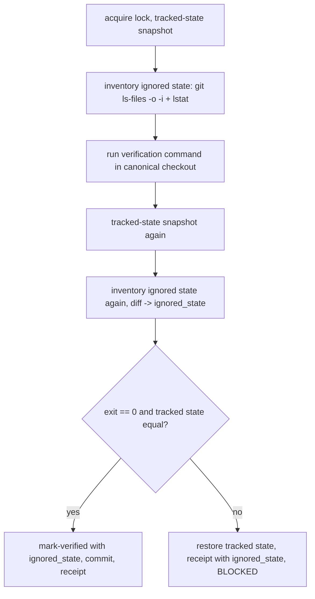

# Cross-Model Verification on Warm Checkouts - Plan

## Goal Capsule

- **Objective:** Make `ce-work`'s cross-model `integrate` and `verify-run` usable in a checkout that has dependencies installed, by replacing the byte-exact custody of git-ignored state with detection and disclosure.
- **Product authority:** GitHub issue #1300 and its full comment thread (the issue of record); PR #1302 (merged containment) and PR #1310 (closed tiered-custody attempt) as prior work; the maintainer's decisions in this brainstorm. Authority order: Product Contract Requirements on behavior; Planning Contract KTDs on mechanism; units carry only local deltas.
- **Execution profile:** `ce-work`, native engine; Standard depth; five units in dependency order (U1 first; U2 and U3 both depend only on U1; U4 and U5 after both U2 and U3).
- **Stop conditions:** Stop and surface if a settled decision proves infeasible (a tracked-state proof turns out to depend on ignored state, or the inventory cannot be built without following symlinks); if `bun run test` cannot pass without weakening an assertion in `tests/skills/ce-work-unit-workspace-*.test.ts` that protects tracked-state restoration; or if the change would alter native (non-cross-model) `ce-work` behavior.
- **Tail ownership:** The invoking pipeline (`lfg`) owns simplify, review, commit, PR, and CI.
- **Open blockers:** None. Deferred items are listed under Open Questions and resolved by the Planning Contract where the code answers them.
- **Product Contract preservation:** changed: R3, R5, R6, AE4 — R3 narrowed to entries the git ignored listing reports (empty ignored directories excluded), R5 reworded to name status-visible rollback provenance, R6 and AE4 aligned to that scope; no other product scope changed.

---

## Product Contract

### Summary

Cross-model verification keeps running in the user's canonical checkout, exactly where native `ce-work` units already run it. The controller keeps proving that HEAD, branch, index, and tracked tree are restored, and stops promising that git-ignored files are byte-identical afterward. It reports what verification did to ignored state instead of refusing at `init` when the inventory is large or contains symlinks.

### Problem Frame

The cross-model engine folds an external worker's transport commit into the canonical checkout, runs the authoritative verification command there, then commits or restores. To keep the checkout untouched it byte-copies every git-ignored file before verification and restores afterward, and refuses when the inventory exceeds 512 entries or 64 MiB or contains a symlink, directory entry, multi-link file, or foreign-owned file. #1302 moved that refusal to `init` and `prepare`.

Any checkout where the verification command can run has dependencies installed, and every mainstream layout breaks those rules: `node_modules/.bin` shims and `.venv/bin/python` are symlinks, and the entry count is thousands (this repository: 9,191 entries, 14 symlinks; reporters: 12k-60k). So the route is available only in checkouts where tests cannot run. Raising the caps does not help because the symlink refusal fires independently. Tiering ignored state into precious and regenerable classes in place (#1310) produced an unbounded tail of link-topology edge cases and was closed.

Nothing the state machine proves about the integrated commit depends on ignored files: the restore-equality proof, `matches_expected_apply`, and the post-verification check all read tracked state. The ignored-file snapshot is a courtesy to the user's environment, and native `ce-work` extends no such courtesy today.

### Key Decisions

- **Verify in the canonical checkout and drop byte-exact ignored-state custody, rather than move verification into a controller-owned worktree.** (session-settled: user-approved — chosen over a clean-worktree verification route: that route trades the custody problem for an undesigned dependency-bootstrap contract, while this option removes the blocker with the least new surface and matches native units.) Governs R1, R2, R3, R6.
- **Redesign rather than patch the existing custody.** (session-settled: user-directed — chosen over an env-overridable cap or in-place precious/regenerable tiering: caps still refuse on symlinks, and tiering did not converge in #1310.) Governs R1, R6.
- **Disclose ignored-state divergence truthfully instead of restoring it.** A receipt must never claim cleanup over state that was not restored. Governs R3, R4.
- **Leave ignored files that verification creates in place.** Deleting them undoes a warm-up step (an install-then-test command) on every unit; leaving them matches what native units do. Governs R5.
- **Clean-worktree verification stays available as a later opt-in.** Not scope here; recorded in Scope Boundaries so the deferral is visible.

### Requirements

**Availability**

- R1. Cross-model `init`, `prepare`, `integrate`, and `verify-run` must not refuse because of the size, count, or entry types of the canonical checkout's git-ignored inventory.
- R2. Verification must run in the canonical checkout under the same integration lock, clean-tree precondition, and tracked-state restoration proof that exist today.

**Ignored-state disclosure**

- R3. After verification, the controller must detect which pre-existing ignored entries changed or disappeared and which ignored entries were created, without copying file contents beforehand; an entry is anything the git ignored listing reports (files, symlinks, and directory entries such as nested repositories), so an empty ignored directory is not inventoried.
- R4. Every unit and plan-wide verification receipt must carry that ignored-state result as counts plus a bounded sample of paths, and must state plainly that ignored state was not restored; no field may read as a cleanup claim over divergent ignored state.
- R5. Ignored files created by verification remain in place and are reported under R4; under tracked-state rollback the controller deletes only status-visible (non-ignored) paths introduced by the fold or by the verification command, never inventoried ignored paths.

**Contract and documentation**

- R6. The cross-model contract documentation must state that verification runs in the canonical checkout, that ignored state is detected and disclosed rather than restored, that empty ignored directories are not inventoried, that this matches native units, and that `.env`-class files and local databases receive no protection from a misbehaving verification command.
- R7. A verification command that mutates ignored state must not by itself fail verification; verification outcome remains the command's exit status plus the tracked-state check.

### Key Flows

- F1. Warm-checkout integrate
  - **Trigger:** An external unit terminalizes and the host runs `integrate` in a checkout with dependencies installed.
  - **Steps:** Acquire the lock; fold the transport commit; record tracked-state and ignored-inventory metadata; run the verification command; compare tracked state and ignored inventory; commit or restore tracked state; write the receipt with the ignored-state result.
  - **Outcome:** The unit reaches its host-owned canonical commit; the receipt discloses any ignored-state divergence.
  - **Covered by:** R1, R2, R3, R4, R5, R7

- F2. Verification touches ignored inputs
  - **Trigger:** The verification command rewrites a pre-existing ignored file (a cache, a local database).
  - **Steps:** Verification exits; the controller detects the change under R3; the receipt names it under R4; verification outcome follows R7.
  - **Outcome:** The user learns exactly which ignored paths changed and that they were not restored.
  - **Covered by:** R3, R4, R7

### Acceptance Examples

- AE1. **Covers R1.** Given a checkout with more than 512 ignored entries including symlinks under `node_modules/.bin`, when the host runs `init` then `prepare`, then both succeed and neither reports an ignored-snapshot capability refusal.
- AE2. **Covers R2, R3, R4.** Given a warm checkout and a verification command that passes without touching ignored files, when `integrate` completes, then the unit is committed and the receipt reports zero changed, zero removed, zero created ignored paths.
- AE3. **Covers R3, R4, R7.** Given a verification command that overwrites one pre-existing ignored file and passes, when `integrate` completes, then the unit is committed and the receipt lists that path as changed and not restored.
- AE4. **Covers R5.** Given a verification command that creates an ignored directory tree containing files and passes, when `integrate` completes, then the tree remains on disk and the receipt lists its files as created.
- AE5. **Covers R2.** Given a verification command that fails, when `integrate` restores, then tracked state matches the recorded pre-fold state exactly and the receipt still carries the ignored-state result.
- AE6. **Covers R1, R6.** Given the contract documentation after this change, when a reader searches it for the ignored-snapshot capability probe or the entry and byte limits, then no such gate is described and the disclosure contract from R6 is present.

### Scope Boundaries

- Deferred for later: verification in a controller-owned worktree with a declared or derived dependency-setup step. Requires its own design of the bootstrap contract; the receipt fields from R4 should carry over unchanged if it lands.
- Deferred for later: any opt-in exact-custody tier for a small precious set of ignored paths.
- Not in scope: protecting `.env`-class files or local databases from the verification command; the plan states this as a non-guarantee under R6.
- Not in scope: changes to native `ce-work` verification behavior.

### Dependencies / Assumptions

- Native `ce-work` units already run verification in the active checkout with no ignored-state custody, so R6's parity claim holds today.
- The tracked-state proofs (`semantic_snapshot`, `matches_expected_apply`, restore equality) do not read ignored files, so removing the ignored snapshot does not weaken commit soundness.
- Existing tests in `tests/skills/ce-work-unit-workspace-verification.test.ts` and `tests/skills/ce-work-unit-workspace-transport.test.ts` assert the current refusal behavior and will be updated or replaced, not preserved.

### Outstanding Questions

- Resolved in planning: detection metadata and sample bound (KTD1, KTD3); directory-mode snapshot fate (KTD2); how status and resume expose the result (KTD3).
- Deferred to implementation: none. Empty ignored directories are out of the inventory by R3; nested repositories are recorded as the single directory entry git lists.

### Sources / Research

- GitHub issue #1300 and its comments (measurements from Bun, npm/Next.js, and Python/`uv` checkouts; the CoW and stat-manifest spikes).
- PR #1302 (`init`/`prepare` probe) and PR #1310 (closed tiered-custody attempt, including its review ledger of topology edge cases).
- `skills/ce-work/scripts/unit_workspace_ignored.py`, `skills/ce-work/scripts/unit_workspace_transaction.py`, `skills/ce-work/scripts/unit_workspace_integration.py`.
- `skills/ce-work/references/cross-model-execution.md` (contract to update under R6).
- `docs/plans/2026-07-15-002-feat-ce-work-cross-model-execution-plan.md`, assumption "Authoritative verification runs in the canonical host checkout" and R38 / KTD17.

---

## Planning Contract

### Key Technical Decisions

- KTD1. **Detect ignored-state divergence with a metadata inventory, not content copies.** Before and after verification, list ignored paths with `git ls-files --others --ignored --exclude-standard -z` and `lstat` each entry without following symlinks. Record per entry: entry type, size, `mtime_ns`, `st_ino`, `st_dev`, `st_nlink`, and mode; record `ctime_ns` too, but include it in the divergence verdict only when `os.name != "nt"` because Windows `ctime` is creation time. Any entry that cannot be inspected is recorded as `uninspectable`, never a refusal. Empty ignored directories do not appear in the listing and are not inventoried (R3); do not add `--directory`, which collapses populated directories into one entry. Two inventories diff into `changed`, `removed`, `created`. Governs R1, R3. Rationale: metadata is O(stat), needs no copy, and detects every accidental mutation the #1300 spike enumerated; symlinks and hardlinks are entries like any other. (session-settled: user-directed — chosen over env-overridable caps or in-place precious/regenerable tiering: caps still refuse on `.bin` and `.venv/bin` symlinks, and tiering did not converge in #1310.)
- KTD2. **Drop the whole-tree directory-mode snapshot and restore.** Remove `_directory_snapshot`, `_restore_directory_snapshot`, `_new_parent_directories`, and the `directory_state_changed` / `directory_restore_error` branches from both transactions; `canonical_state_changed` becomes `after != before` (tracked state only). Keep `_remove_owned_new_paths` for tracked-state rollback of fold-introduced, status-visible paths only. Governs R2, R5. Rationale: the walk visits every `node_modules` entry, exists only to serve ignored-state custody, and the tracked-tree proof already covers tracked content; git does not track directory modes.
- KTD3. **One `ignored_state` object, persisted wherever verification evidence lives.** Shape: `{ "before": <count>, "after": <count>, "changed": <count>, "removed": <count>, "created": <count>, "uninspectable": <count>, "sample": { "changed": [..], "removed": [..], "created": [..] }, "sample_limit": 20, "restored": false }`. Samples are sorted paths, at most 20 per list. It appears in the `verify-run` receipt (`doc["verifications"][*]`), in the unit's durable record via `mark-verified` (`unit["integration"]["verification"]["ignored_state"]`, a new optional argument), and in every `integrate` / `verify-run` return body, success or `BLOCKED`. Drop `cleaned: True` from the `UNIT_COMMITTED` body; `cleaned_paths` narrows to paths the controller removed or restored under tracked-state rollback and never lists ignored paths. `status` exposes the field by passing receipts through unchanged. Governs R4, R5. (session-settled: user-approved — chosen over a bare cleaned flag or silence: truthfulness is the only remaining guarantee about ignored state.)
- KTD4. **Delete the capability probe and its caps.** Remove `MAX_IGNORED_SNAPSHOT_ENTRIES`, `MAX_IGNORED_SNAPSHOT_BYTES`, `inspect_ignored_snapshot_capability`, `preflight_ignored_artifacts`, and `require_ignored_snapshot_capability`; remove the calls in `cmd_init` (`unit_workspace_state.py`) and `cmd_prepare` (`unit_workspace_jobs.py`); remove `_snapshot_ignored_artifacts`, `_restore_ignored_artifacts`, `_artifact_matches` from `unit_workspace_transaction.py`. `unit_workspace_ignored.py` keeps its filename and becomes the inventory module (`ignored_paths`, `artifact_path`, `inventory_ignored_state`, `diff_ignored_state`). Governs R1, R6. (session-settled: user-approved — chosen over a controller-owned verification worktree: that route trades custody for an undesigned dependency-bootstrap contract; verifying in the checkout matches native units.)
- KTD5. **Verification exit plus tracked-state equality decide the outcome; ignored divergence never does.** `verification_failed = verification_exit != 0 or after != before` stays as the sole gate in `cmd_integrate`; `_verify_run_locked` keeps its branch/HEAD and tracked-state restore paths. Governs R2, R7. (session-settled: user-approved — chosen over deleting verification-created ignored paths: deletion undoes an install-then-test warm-up every unit and diverges from native units.)

### High-Level Technical Design

The two transactions keep their fail-stop shape; only the ignored-state leg changes from copy/restore/delete to inventory/diff/report.

Directional guidance: the inventory function is pure (repo -> dict of path -> metadata tuple); the diff function is pure (before, after -> `ignored_state`). Both transactions call the same two functions.

### Assumptions

- The tracked-state proofs (`semantic_snapshot`, `status_paths`, `matches_expected_apply`, `reconcile_commit`) read no ignored files; verified by inspection in `unit_workspace_integration.py` and `unit_workspace_state.py`.
- Native `ce-work` units run verification in the active checkout with no ignored-state custody (`skills/ce-work/references/implementation-loop.md`).
- Windows is a supported target for these scripts; KTD1's `ctime` rule follows `docs/solutions/architecture-patterns/posix-process-supervision-on-native-windows.md`.
- Existing tests that assert refusal, restoration, or deletion of ignored state are replaced, not preserved (Dependencies / Assumptions in the Product Contract).
- Empty ignored directories are outside the inventory (R3). Chosen during pipeline-mode planning as the narrower scope: git cannot list them without collapsing populated directories, and an empty directory holds nothing verification can damage. Widen only if a consumer asks for it.

### Sources / Research

- `skills/ce-work/scripts/unit_workspace_ignored.py` (probe, caps), `unit_workspace_transaction.py` (`_verify_run_locked` ~L427-587, `cmd_integrate` ~L672-897, `_directory_snapshot` L72, `_remove_owned_new_paths` L54), `unit_workspace_state.py` L795-797, `unit_workspace_jobs.py` L98, `unit_workspace_integration.py` `cmd_mark_verified` L431.
- Tests: `tests/skills/ce-work-unit-workspace-verification.test.ts` (L48, L89, L110, L133, L146, L187, L227, L271), `tests/skills/ce-work-unit-workspace-transport.test.ts` (L927, L1017), harness `tests/skills/helpers/ce-work-workspace-harness.ts` (`makeRepo`, `init`, `ctl`, `ctlWithEnv`, `CE_WORK_TEST_FAULT`).
- Contract prose to change: `skills/ce-work/references/cross-model-execution.md` L89, L92, L98, L99; eval table `skills/ce-work/references/cross-model-work-eval.md` (E40 pattern).
- `docs/solutions/skill-design/sandbox-workers-must-not-write-linked-worktree-git-index.md` — host-owned snapshot framing to mirror in the contract prose.
- Grounding dossier: `/tmp/compound-engineering-501/ce-brainstorm/issue-1300-warm-verify/grounding.md` (scratch, may be gone).

---

## Implementation Units

### U1. Replace the custody module with an ignored-state inventory

- **Goal:** `unit_workspace_ignored.py` builds and diffs metadata inventories and no longer refuses anything.
- **Requirements:** R1, R3; KTD1, KTD4.
- **Dependencies:** none.
- **Files:** `skills/ce-work/scripts/unit_workspace_ignored.py`; new tests in `tests/skills/ce-work-unit-workspace-verification.test.ts` (direct-import style like the existing L110 test).
- **Approach:**
  1. Keep `ignored_paths` and `artifact_path`.
  2. Add `inventory_ignored_state(repo) -> dict[str, tuple]` per KTD1; symlinks recorded via `lstat` without following; unreadable entries recorded as `uninspectable`.
  3. Add `diff_ignored_state(before, after, sample_limit=20) -> dict` producing the KTD3 shape.
  4. Delete the caps, `inspect_ignored_snapshot_capability`, `preflight_ignored_artifacts`, `require_ignored_snapshot_capability`, and the offender-sample report.
- **Patterns to follow:** existing `lstat`/`O_NOFOLLOW` discipline in the same module; `Operational` only for path escape.
- **Test scenarios:**
  - Inventory of a repo with 600 ignored files, a `.bin/`-style symlink, and a hardlink pair returns 602 entries and raises nothing (Covers AE1 at module level).
  - Diff detects: content overwrite with size unchanged and mtime restored (ctime moves, POSIX only), chmod-only change, symlink retarget, deletion, creation of a nested file; each lands in the right bucket.
  - An empty ignored directory is absent from both inventories and produces no bucket entry; a nested git repository appears as one directory entry.
  - Sample lists cap at 20 with sorted paths and counts still exact above the cap.
  - An unreadable ignored subdirectory (mode 000, non-root) yields `uninspectable > 0` and no exception.
  - `ctime_ns` change alone counts as `changed` when `os.name != "nt"` (skip the assertion otherwise).
- **Verification:** `bun test tests/skills/ce-work-unit-workspace-verification.test.ts` passes for the new module tests; `python3 -c "import unit_workspace_ignored"` from `skills/ce-work/scripts` exposes no removed names.

### U2. Rewire both transactions to inventory, diff, and disclose

- **Goal:** `cmd_integrate` and `_verify_run_locked` stop copying, restoring, or deleting ignored state and emit `ignored_state` per KTD3.
- **Requirements:** R2, R3, R4, R5, R7; KTD2, KTD3, KTD4, KTD5; F1, F2.
- **Dependencies:** U1.
- **Files:** `skills/ce-work/scripts/unit_workspace_transaction.py`, `skills/ce-work/scripts/unit_workspace_integration.py` (`cmd_mark_verified` optional `--ignored-state` JSON argument), `skills/ce-work/scripts/unit-workspace.py` (add `--ignored-state`, JSON string, default `None`, to the `mark-verified` subparser so the CLI path and the in-process caller both supply the field), `tests/skills/ce-work-unit-workspace-verification.test.ts`, `tests/skills/ce-work-unit-workspace-transport.test.ts`.
- **Approach:**
  1. In both transactions replace preflight + snapshot with `inventory_ignored_state` before the command and `diff_ignored_state` after.
  2. Remove `_snapshot_ignored_artifacts`, `_restore_ignored_artifacts`, `_artifact_matches`, `_directory_snapshot`, `_restore_directory_snapshot`, `_new_parent_directories`, and their branches; keep `_remove_owned_new_paths` for `after_paths - before_paths` under tracked-state rollback only (KTD2).
  3. Include `ignored_state` in the `verify-run` receipt, in every return body, in the evidence digest input, and pass it to `mark-verified` so it lands on `unit["integration"]["verification"]`.
  4. Drop `cleaned: True`; narrow `cleaned_paths` per KTD3.
  5. Rewrite the tests at verification.test.ts L187, L227, L271 and transport.test.ts L927, L1017 to the new contract; delete assertions on directory-mode restore.
- **Execution note:** Rewrite the two transport tests first so they fail on the current byte-restore behavior, then change the transaction.
- **Patterns to follow:** existing receipt construction and `_record_run_verification_receipt`; `test_fault` hooks (`verify-run-before-receipt`, `before-canonical-commit`) stay.
- **Test scenarios:**
  - Covers AE2. Warm fixture, verification passes without touching ignored files: `UNIT_COMMITTED` body has `ignored_state.changed == 0`, `created == 0`, `removed == 0`, no `cleaned` key.
  - Covers AE3 / F2. Verification overwrites a pre-existing ignored file and passes: unit commits; body and `status` unit record list the path under `sample.changed`, `restored: false`; file content is the overwritten content.
  - Covers AE4. Verification creates `node_modules/.cache/x` and passes: tree remains on disk; `sample.created` lists it; `cleaned_paths` is empty.
  - Covers AE5. Verification exits 7 after mutating an ignored file and a tracked file: `BLOCKED`, tracked file restored, HEAD/status equal to pre-fold, `ignored_state` present in the failure body, ignored file left mutated.
  - `verify-run` receipt in `status` carries `ignored_state`; a second failing `verify-run` records it too.
  - Removing a pre-existing ignored directory that contains files during verification passes verification and reports those files under `removed` (replaces the L1017 restore assertion); an empty ignored directory removed during verification is not reported.
  - `canonical_state_changed` is false when only ignored state moved.
- **Verification:** `bun test tests/skills/ce-work-unit-workspace-verification.test.ts tests/skills/ce-work-unit-workspace-transport.test.ts` green; no `_directory_snapshot` reference remains in `skills/ce-work/scripts`.

### U3. Remove the capability probe from init and prepare

- **Goal:** `init` and `prepare` succeed on a warm checkout.
- **Requirements:** R1; KTD4.
- **Dependencies:** U1.
- **Files:** `skills/ce-work/scripts/unit_workspace_state.py` (L795-797), `skills/ce-work/scripts/unit_workspace_jobs.py` (L12, L98), `tests/skills/ce-work-unit-workspace-verification.test.ts` (L48, L89, L110, L133, L146).
- **Approach:** Delete the import and both calls and the explanatory comment; replace the four refusal tests with two pass-through tests.
- **Test scenarios:**
  - Covers AE1. `init` then `prepare` on a repo with 513 ignored files, a symlink, a hardlink pair, and a nested-git directory both succeed and create the run dir.
  - `prepare` still refuses on unrelated dirt (existing behavior unchanged).
- **Verification:** the two new tests pass; grep finds no `require_ignored_snapshot_capability` in `skills/`.

### U4. Update the cross-model contract prose

- **Goal:** Documentation states the disclosure contract from R6.
- **Requirements:** R6.
- **Dependencies:** U2, U3.
- **Files:** `skills/ce-work/references/cross-model-execution.md` (L89, L92, L98, L99), `skills/ce-work/references/cross-model-work-eval.md` (one eval row for the warm-checkout behavior), `docs/skills/ce-work.md` (only if it describes the probe; today it does not), `CONCEPTS.md` (`Warm checkout` entry already present; add nothing unless a new term appears).
- **Approach:** Replace probe/exact-snapshot sentences with: verification runs in the canonical checkout as native units do; ignored state is inventoried before and after and disclosed in `ignored_state`, never restored; empty ignored directories are not inventoried; `.env`-class files and local databases receive no protection; verification-created ignored files remain. Reword L98 so only tracked-state change fails reconciliation. Keep host-owned framing consistent with `docs/solutions/skill-design/sandbox-workers-must-not-write-linked-worktree-git-index.md`.
- **Test scenarios:** Covers AE6. A grep of `cross-model-execution.md` for `exact-snapshot`, `capability`, and `entry, byte` returns nothing; a grep for `ignored_state` finds the new contract paragraph. Add this as an assertion in an existing greppable-contract test only if one exists for this file (none found); otherwise verify manually.
- **Verification:** `bun run release:validate` passes; the contract reads consistently with the code.

### U5. Warm-checkout end-to-end regression fixture

- **Goal:** One test proves the full route on a warm checkout shape.
- **Requirements:** R1, R2, R4; AE1-AE5.
- **Dependencies:** U2, U3.
- **Files:** `tests/skills/ce-work-unit-workspace-verification.test.ts` (or a new `tests/skills/ce-work-unit-workspace-warm-checkout.test.ts` if the existing file approaches the suite's slow-file ceiling — measure first per `AGENTS.md`), harness `tests/skills/helpers/ce-work-workspace-harness.ts`.
- **Approach:** Build a scratch repo with `node_modules/`-shaped ignored inventory (>512 files, `.bin/` symlinks, one hardlink pair, ~1 MiB total) and drive `init -> prepare -> fake job -> integrate -> verify-run` with a verification command that reads and writes inside the ignored tree.
- **Test scenarios:**
  - Covers AE1-AE4. Route reaches `UNIT_COMMITTED` and `RUN_VERIFIED`; both bodies carry `ignored_state` with non-zero `changed`/`created` and truthful samples; ignored tree untouched by the controller.
  - Covers AE5. A failing variant leaves tracked state exactly pre-fold and reports `ignored_state`.
- **Verification:** the fixture passes under `bun run test` and runs in under the suite's per-test timeout without `setDefaultTimeout` beyond what sibling files use.

---

## Verification Contract

| Gate | Command | Applies to |
|---|---|---|
| Focused controller tests | `bun test tests/skills/ce-work-unit-workspace-verification.test.ts tests/skills/ce-work-unit-workspace-transport.test.ts` | U1, U2, U3, U5 |
| Full suite | `bun run test` | all units before commit |
| Release metadata | `bun run release:validate` | U4 |
| Plugin schema | `bun run plugin:validate` | U4 (skill content changed) |
| Manual probe | run the read-only inventory against this checkout: 9,191 ignored entries, 14 symlinks, no exception | U1 |

Behavioral skill evaluation: none required; the change is mechanical script behavior plus contract prose.

---

## Definition of Done

- All five units complete; `bun run test`, `bun run release:validate`, and `bun run plugin:validate` pass.
- No reference to `MAX_IGNORED_SNAPSHOT_*`, `require_ignored_snapshot_capability`, `_snapshot_ignored_artifacts`, or `_directory_snapshot` remains under `skills/ce-work/`.
- `init`, `prepare`, `integrate`, and `verify-run` succeed on this repository's own warm checkout shape (U5 fixture mirrors it).
- Every verification receipt and return body carries `ignored_state`; no body carries `cleaned: True`.
- Contract prose matches code (U4); the PR links #1300 and states the non-guarantee for `.env`-class files.
- Abandoned or experimental code from failed attempts is removed from the diff.
