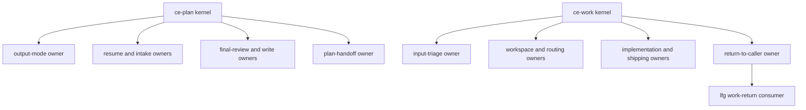
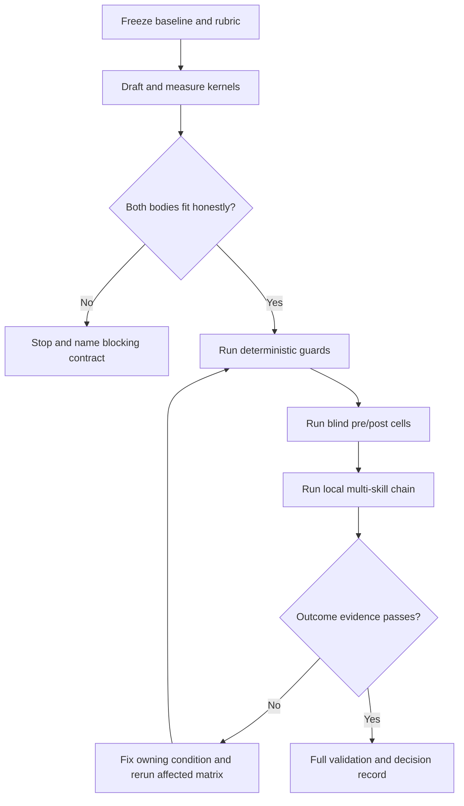

# Phase-Loaded Skill Kernels - Plan

## Goal Capsule

- **Objective:** `ce-plan` and `ce-work` satisfy the 8,000-byte CRLF-adjusted `SKILL.md` contract without losing routing, safety, artifact, delegation, or tail-ownership behavior.
- **Means:** Replace each monolithic body with one fail-closed phase-loaded kernel and move phase mechanics into mandatory point-of-use references (KTD1).
- **Authority:** User-settled requirements and issue #1482 outrank implementation convenience; current incident-backed behavior and producer/consumer contracts outrank byte savings.
- **Execution profile:** Contract-first skill refactor followed by deterministic validation, blind pre/post cross-host evaluation, and a local multi-skill `lfg` proof.
- **Stop conditions:** Stop a skill's migration if an honest kernel cannot fit under 8,000 bytes without moving an unread stop class or act-before-read condition. If exactly one skill fits, finish and evaluate that independent migration, remove only its budget exception, keep the blocked skill unchanged and over-budget, and record its blocking contract plus next decomposition seam. Stop an eval path rather than simulating success when its required harness or external boundary is unavailable.
- **Tail ownership:** This run implements and evaluates the plan. It does not push, open a PR, mutate issue #1482, or use a live GitHub canary without separate authorization.

---

## Product Contract

### Summary

Refactor `ce-plan` and `ce-work` into small always-loaded kernels whose ordered required reads make each phase's owning reference unavoidable before action. Preserve the public skill identities and cross-skill contracts, then prove behavior across entry paths and the `lfg` chain from durable outcomes rather than narrated intent.

### Problem Frame

The current CRLF-adjusted bodies are 31,069 bytes for `ce-plan` and 27,859 bytes for `ce-work`. Both remain explicit exceptions in `tests/codex-skill-prompt-budget.test.ts`, although 8,000 bytes is the standing precondition for a conformant emitted Agent Plugins package and a context-cost ceiling on every host.

Earlier restructures stopped because large handoff, input, and return contracts were treated as always-inline floors. Later evidence refined that assumption: a required read can preserve routing when the body requires it at the acting step, names what only the reference carries, and leaves no partial actionable path. The remaining work is therefore contract ownership and load order, not sentence compression.

### Key Decisions

- **The 8KB ceiling remains the acceptance bar.** (session-settled: user-directed — chosen over accepting a documented floor: an over-budget result cannot satisfy the portability contract.) Governs R1, R2, R12.
- **Behavioral evidence must match the breadth of the move.** (session-settled: user-directed — chosen over recognition-only pointer checks: routing, mutation, delegation, and return ownership can fail while a model still reports reading a file.) Governs R9-R11, R13.

### Requirements

#### Byte budget and architecture

- R1. `skills/ce-plan/SKILL.md` and `skills/ce-work/SKILL.md` must each be at most 8,000 CRLF-adjusted bytes after the change, with a target of at most 7,000 bytes so later correctness fixes retain headroom.
- R2. Both names must be removed from the shrink-only `OVER_BUDGET` set only after their measured bodies pass the bound.
- R3. The user-facing skills, activation contracts, artifact shapes, modes, and completion ownership must remain intact; this work must not split either skill.
- R3a. Preserve both skills' frontmatter descriptions byte-for-byte and include positive and adjacent-negative activation prompts in the baseline/worktree matrix.
- R4. Each body must retain its outcome, done condition, authority and tail boundaries, ordered phase spine, unread stop classes, and any condition whose step acts before a reference can load.
- R5. Every moved mechanism must have one owning reference that is required at the point of use before the governed decision, question, write, dispatch, menu render, selection action, shipping action, or return.
- R6. A required-read failure must stop safely. The kernel must not reconstruct the missing reference from memory or continue through a narrower substitute.
- R7. A body pointer must name what only the reference decides and what skipping it risks, without summarizing enough mechanics to suppress the read.

#### Behavior and cross-skill contracts

- R8. `ce-plan` must preserve direct planning, no-implementation behavior, output-mode resolution, artifact-root safety, resume/deepen/approach/domain routing, research and plan composition, unified-plan metadata, confidence/doc review, pipeline behavior, and every terminal handoff action.
- R9. `ce-plan` must load its handoff owner immediately before menu work and again before acting on a selection received after a user turn; rendering a menu must never count as firing the selected route.
- R10. `ce-work` must preserve recovery-first input classification, carrier validation, plan readiness and non-code routing, WIP protection, engine-before-write selection, worker/controller ownership, implementation evidence, the standalone review completion condition, and the caller-owned tail.
- R11. `ce-work` must load its return owner on entry to return-to-caller mode and immediately before emitting the envelope. Return-to-caller must never run standalone simplify, review, PR, CI, or babysit work.
- R12. The `ce-work` producer and `lfg` consumer must retain the same carrier order, statuses, route/model receipts, evidence conditions, recovery semantics, and terminal field set without relying on a plugin-root shared runtime file. Their parity test must also compare both views with one authoritative inventory so equal omissions cannot pass.
- R13. A required-read failure after partial planning or implementation state exists must preserve that state and return an explicit blocked result. The `ce-work` kernel owns the minimum fail-closed envelope as the narrow exception to R5's reference ownership: status, plan path, run ID when known, changed-state summary, blocker, and recovery path. For pipeline `ce-plan`, blocked status outranks artifact presence so `lfg` stops instead of retrying or advancing.
- R13a. These blocked forms apply only when a required phase owner cannot be read. `ce-plan` returns `status: blocked`, `artifact_path` when one exists, `phase`, `blocker`, and `recovery_path`; `ce-work` returns `status: blocked`, `plan_path`, `run_id` when known, `changed_state`, `blockers`, and `recovery_path`. Inventory and update only actual pipeline callers; generalized status or schema redesign is outside scope.

#### Verification and packaging

- R14. Deterministic tests must distinguish body-owned conditions, reference-owned mechanisms, and producer/consumer parity. A test migration must preserve the condition each historical pin protects rather than convert all assertions into whole-corpus greps.
- R15. Behavioral evaluation must compare the exact pre-change tree at `66ccf579f8c1ef2ccfc642c317ba53151eeb1ebb` with the current on-disk tree in fresh Claude, Codex, and Grok sessions where reachable.
- R16. The highest-risk `ce-plan` handoff and `ce-work` return/tail paths must run three symmetric baseline and post-change trials on Claude and Codex. Other entry paths run at least once per reachable host; any arm divergence triggers three trials on both arms before a pass or fail verdict. Single-trial agreement proves only deterministic-regression coverage.
- R17. Pass/fail must use produced artifacts, actual child or subprocess receipts, workspace and git state, structured returns, and external-boundary records. A claimed child or external action passes only when the callable boundary records an invocation receipt; narration and `FILES_READ` are diagnostic evidence only.
- R18. The evaluation must isolate the injected skill trees from installed copies and record every attempted but unreachable path as unexercised with its setup and reason.
- R19. All new references must survive the repository's converter/install packaging surfaces; source-tree reachability alone is insufficient.

### Success Criteria

- Both CRLF-adjusted bodies are at most 8,000 bytes and preferably at most 7,000 bytes.
- Focused contract tests, `bun run test`, `bun run release:validate`, and `bun run plugin:validate` pass.
- Blind pre/post runs show no decision-relevant regression across the full `ce-plan` and `ce-work` entry-path matrices.
- A fresh multi-skill run demonstrates `lfg -> ce-plan -> ce-work -> lfg` ordering and caller-owned stopping in a disposable no-remote repository.
- The eval report contains per-cell evidence, independent grading, failures and fixes, model/harness receipts, and explicit unexercised paths.

### Scope Boundaries

#### In scope

- Both skill bodies, their phase-owning references, load-time-aware tests, the `ce-work`/`lfg` seam, prompt-budget ratchet, eval scenarios, behavioral evidence, and the local size-design learning.

#### Deferred to Follow-Up Work

- A separately emitted Agent Plugins-conformant package, including removal or transformation of Claude-only frontmatter.
- A generated shared schema or parser for the `ce-work` return protocol unless implementation proves prose parity cannot be tested cleanly.
- Live GitHub PR creation and babysitting canary evidence; the local no-remote chain will mark that outer boundary unexercised unless separately authorized.

#### Outside this product's identity

- Splitting `ce-plan` or `ce-work` into user-visible phase skills.
- A plugin-root shared contract file that independently installed skill directories cannot resolve.
- Buying bytes through telegraphic prose, dropped invariants, or a blanket brevity instruction.

---

## Planning Contract

### Key Technical Decisions

- KTD1. **Use one fail-closed phase-loaded kernel per skill.** (session-settled: user-approved — chosen over split skills or accepting the floor: the reviewed evidence supports mandatory point-of-use ownership without changing the user lifecycle.) Each kernel names the sequence and stop conditions; references own phase mechanics. Emit-time decomposition is rejected because direct source-tree hosts also load these bodies, so the in-repo authoring surface itself must satisfy the bound.
- KTD2. **Load `ce-plan` through existing phase owners plus one output owner.** Create `references/output-mode.md` as the first unconditional owner for token parsing, config precedence, renderer selection, and artifact-root resolution. Expand `resume.md`, `final-review.md`, and `plan-handoff.md` only where they already own the acting step.
- KTD3. **Load `ce-work` through three new seam owners.** Create `references/input-triage.md`, `references/workspace-setup.md`, and `references/return-to-caller.md`. Existing execution, implementation, and shipping references retain their own mechanisms.
- KTD4. **Keep incident-backed predicates always loaded.** `ce-plan` remains incomplete until the handoff action fires. `ce-work` standalone shipping remains incomplete without a completed review receipt or owner-defined explicit skip, and caller mode never owns the standalone tail.
- KTD5. **Keep skill-local producer and consumer views with deterministic parity.** `ce-work` owns invocation parsing and return production. `lfg` owns carrier construction and return acceptance. Tests compare normalized facts and prove one-sided drift fails.
- KTD6. **Retarget pins by load time.** Body tests protect required-read order and unread stop conditions. Reference tests protect the moved mechanisms. Seam tests protect producer/consumer equality.
- KTD7. **Freeze the eval contract before changing behavior-bearing prose.** New issue-#1482 rows use `66ccf579f` as their scenario baseline instead of the older corpus-wide sweep ref. The same prompts and fixtures run blind against baseline and worktree arms.
- KTD8. **Treat live behavior and external mutation as separate evidence tiers.** Fresh-agent fake-boundary cells cover every route; live local dispatch covers nested skills, workers, artifacts, and commits; unauthorized GitHub writes remain explicitly unexercised.
- KTD9. **Make partial-state failures explicit protocol states.** A missing phase owner never erases an existing artifact or mutation and never permits success inference from that state. `ce-plan` emits a pipeline blocker that `lfg` treats as terminal; `ce-work` emits the minimum blocked recovery result when the full return owner cannot load.
- KTD10. **Load root rules early but resolve paths lazily.** `ce-plan` reads `output-mode.md` unconditionally, but it resolves repository/config/artifact roots only when a later route composes an artifact path. Answer-seeking and explicit-path routes must not acquire a premature repository dependency.

### High-Level Technical Design

#### Ownership topology



#### Fail-closed phase sequence

```mermaid
sequenceDiagram
  participant K as Kernel
  participant R as Owning reference
  participant A as Governed action
  K->>R: Required read at point of use
  alt Read succeeds
    R-->>K: Decision and mechanism
    K->>A: Act under loaded contract
  else Missing or unreadable
    K-->>A: Stop; do not reconstruct
  end
```

#### Validation lifecycle



### Sequencing

1. Freeze the baseline, pin inventory, eval prompts, grading rubric, and byte accounting before editing the skills.
2. Restructure `ce-plan` and its tests to establish the kernel pattern on the harder interactive handoff surface.
3. Restructure `ce-work`, then reconcile the `lfg` producer/consumer seam in the same semantic change.
4. Remove both budget exceptions only after deterministic ownership and packaging checks pass.
5. Run the full blind behavioral matrix, fix only generalized owning-condition defects, and rerun every affected scenario.
6. Run final repository validation and record the achieved architecture and evidence.

### Risks and Mitigations

- **Partial stubs suppress reads.** Keep pointers non-actionable and grade required-read ownership on the path that needs it.
- **A user turn drops menu context.** Require `plan-handoff.md` again before acting on a later selection and run a two-turn/compaction-shaped case.
- **Caller mode is parsed then forgotten.** Retain tail ownership in the `ce-work` kernel and require the return owner before the terminal envelope.
- **Review safety regresses.** Keep issue #1351's completion predicate inline while relocating receipt shapes and mechanics.
- **Strong models reconstruct missing rules.** Use isolated extracted skill trees and inspect transcripts plus durable outcomes.
- **Tests pass while packaging drops references.** Verify the converted/installed skill directories contain every kernel pointer target.
- **Eval authoring overfits the new prose.** Freeze tasks and grades before the first post run, include real historical failures, and use a separate grading pass.
- **A large entry reference restores context cost.** Keep ownership aligned to the earliest phase where content can change behavior instead of creating one replacement monolith.

### Assumptions

- All three host CLIs remain reachable for read-only cells; missing hosts are reported rather than silently substituted.
- No live GitHub mutation is authorized. The no-remote `lfg` path supplies local chain evidence, while PR and babysit behavior remains fake-boundary evidence.
- Existing skill behavior is the semantic baseline. This refactor does not intentionally introduce new user-visible modes, fields, or commands.

---

## Implementation Units

### U1. Freeze contracts and evaluation evidence

- **Goal:** Establish a falsifiable baseline before any prose ownership moves.
- **Requirements:** R4-R7, R12-R18; KTD6-KTD9.
- **Dependencies:** None.
- **Files:** `tests/skill-eval-cell/catalog.ts`, `tests/skill-eval-cell/catalog.test.ts`, `tests/skill-eval-cell/extract.ts`, `tests/skill-eval-cell/extract.test.ts`, `tests/skill-eval-cell/run.ts`, `tests/skill-eval-cell/hosts.ts`, `tests/skill-eval-cell/hosts.test.ts`, `tests/skill-eval-cell/path-shim.ts`, `tests/skill-eval-cell/path-shim.test.ts`, `tests/skill-eval-cell/grade.ts`, `tests/skill-eval-cell/grade.test.ts`, `tests/skill-eval-cell/pack.ts`, `tests/skill-eval-cell/scenarios.md`, `tests/skill-eval-cell/fixtures/requirements-only-plan/`, `tests/skill-eval-cell/fixtures/implementation-ready-plan/`, `tests/skill-eval-cell/fixtures/partial-plan/`, `tests/skill-eval-cell/fixtures/partial-work/`, `docs/plans/2026-08-21-phase-loaded-skill-kernels-eval-report.md`.
- **Approach:**
  1. Inventory every current body assertion and record whether it protects a body condition, a movable mechanism, incidental wording, or a cross-skill seam.
  2. Assert `skills/ce-plan/` and `skills/ce-work/` at `66ccf579f` are byte-identical to the working tree before edits; re-pin if not. Then add a scenario-level baseline ref consumed by `pack.ts` arm resolution so new rows compare that exact ref with `WORKTREE` without changing historical sweep rows.
  3. Add isolated multi-skill extraction/injection plus boundary-recorded receipts. Host and PATH shims must record child identity, arguments, injected source tree, exit state, and returned artifact; graders reject model-authored delegation trailers without those receipts.
  4. Support per-scenario omitted skill paths for early load failures. For late failures, seed a recoverable plan artifact or implementation state with run ID, commits, and controller receipts, then enter the later-turn/recovery seam with its terminal owner omitted.
  5. Add a deterministic read-count fault: the first owner read succeeds, then a boundary-recorded fixture action makes the second read fail after the plan write or implementation mutation. Do not approximate this with a statically missing file.
  6. Freeze a finite matrix with scenario IDs, hosts, pre/post trial counts, durable grades, per-cell retry limit, maximum cell count, corrective-rerun scope, and a terminal blocked rule. Parity claims use symmetric pre/post repetitions; extra post-only trials are labeled stability evidence.
  7. Add one temporary non-shipping Agent Plugins-conformant post-arm fixture. Record loader identity/version, absence of truncation warnings, and proof that the complete <=8KB kernel from the extracted tree drove the result; keep production emitted-package work deferred.
  8. Freeze the scenario prompts, expected durable evidence, high-risk repeat counts, and independent grading checklist before editing either skill.
  9. Record pre-change sizes and baseline run artifacts in the eval report.
- **Execution note:** Run baseline cells first. Do not tune prompts after seeing post-change output unless the same correction is applied to both arms and documented.
- **Patterns to follow:** `tests/skill-eval-cell/catalog.ts`, `docs/solutions/skill-design/paired-old-vs-new-injection-skill-evals.md`, `docs/solutions/skill-design/size-driven-skill-restructure.md`.
- **Test scenarios:**
  - A scenario-specific baseline ref selects `66ccf579f` while older catalog rows retain their existing refs.
  - A missing required-read path fails the post arm, while an unlisted optional read remains neutral.
  - Boundary receipts distinguish an actual nested skill or subprocess invocation from a narrated `DELEGATES_DISPATCHED` claim.
  - Early omission and seeded late-state omission fixtures reach distinct fail-closed paths without relying on timing races.
  - A controlled first-read-success/second-read-failure cell proves the late preservation contract.
  - The frozen matrix rejects asymmetric parity counts, an exceeded retry budget, and a post arm that cannot attest its temporary Agent Plugins loader.
  - A one-sided producer/consumer field mutation makes the parity guard fail.
  - Reusing an output directory cannot leak a deleted reference or prior workspace mutation into a later cell.
- **Verification:** The baseline artifacts, rubric, and byte measurements exist before skill edits; catalog and pack tests prove exact arm refs; harness tests prove isolated multi-skill injection, omission faults, and boundary receipts before any behavioral result can pass.

### U2. Restructure `ce-plan` into a phase-loaded kernel

- **Goal:** Reduce `ce-plan/SKILL.md` below the bound while preserving every planning and handoff route.
- **Requirements:** R1-R9, R13-R14, R19; KTD1, KTD2, KTD4, KTD6, KTD9.
- **Dependencies:** U1.
- **Files:** `skills/ce-plan/SKILL.md`, `skills/ce-plan/references/output-mode.md`, `skills/ce-plan/references/resume.md`, `skills/ce-plan/references/final-review.md`, `skills/ce-plan/references/plan-handoff.md`, `tests/skills/ce-plan-output-mode.test.ts`, `tests/skills/ce-plan-handoff-routing.test.ts`, `tests/skills/unified-plan-artifact-contract.test.ts`, `tests/reasoning-elevation-parity.test.ts`, `tests/docs-root-rule-parity.test.ts`, `tests/config-layers-rule-parity.test.ts`.
- **Approach:**
  1. Move output/config/root mechanics verbatim into `output-mode.md`, then require that file before any phase interpretation.
     Load the rule unconditionally but defer repo/config/root resolution until a route actually composes an artifact path.
  2. Reconcile resume, write, and handoff mechanics with their existing owners before deleting body duplicates.
  3. Restate the body as one outcome/done contract, compact interaction and artifact invariants, an ordered required-read spine, and fail-closed terminal conditions.
  4. Keep the exact `settled-decision-invalidated` stop token and the requirement to execute the selected handoff action before completion.
  5. Re-author body-placement tests around the protected condition and keep mechanism tests on the owning references.
  6. Give pipeline-mode reference failures an explicit blocked producer result that outranks an existing plan artifact. U4 owns `lfg` acceptance and retry suppression.
- **Execution note:** Relocate before restating. Measure CRLF bytes after every coherent block move; never compress sentences to recover the final bytes.
- **Patterns to follow:** `skills/ce-ideate/SKILL.md`, `skills/ce-ideate/references/output-mode.md`, `skills/lfg/SKILL.md`, `docs/solutions/skill-design/post-menu-routing-belongs-inline.md`.
- **Test scenarios:**
  - Explicit HTML, remembered preference, config-only HTML, unknown format, and pipeline-forced markdown resolve identically to baseline.
  - Fresh software, requirements-only enrichment, resume, deepen, approach-altitude, non-software, and answer-seeking inputs select the correct owner and terminal behavior.
  - No-repository answer-seeking and explicit-plan-path inputs do not trigger premature git, config, or artifact-root resolution.
  - Markdown and HTML plans retain required metadata, stable IDs, canonical paths, and native-format document review.
  - Every visible handoff choice fires its actual route with the plan path and host skill mechanism; conditional options remain conditional.
  - A later-turn selection reloads `plan-handoff.md` before action.
  - Missing `output-mode.md`, `resume.md`, `final-review.md`, or `plan-handoff.md` stops before its governed action.
  - A plan artifact followed by a missing handoff owner returns the blocked producer result; downstream `lfg` behavior is verified in U4.
- **Verification:** Focused tests pass, the body is at most 8,000 CRLF bytes, and a fresh reader finds no dense or meaning-shifted kernel sentence.

### U3. Restructure `ce-work` into a phase-loaded kernel

- **Goal:** Reduce `ce-work/SKILL.md` below the bound while preserving mutation safety, execution routing, review completion, and caller mode.
- **Requirements:** R1-R7, R10-R14, R19; KTD1, KTD3-KTD6, KTD9.
- **Dependencies:** U1.
- **Files:** `skills/ce-work/SKILL.md`, `skills/ce-work/references/input-triage.md`, `skills/ce-work/references/workspace-setup.md`, `skills/ce-work/references/return-to-caller.md`, `skills/ce-work/references/execution-engines.md`, `skills/ce-work/references/cross-model-execution.md`, `skills/ce-work/references/execution-strategy.md`, `skills/ce-work/references/implementation-loop.md`, `skills/ce-work/references/shipping-workflow.md`, `tests/skills/ce-work-outcome-spine.test.ts`, `tests/pipeline-review-contract.test.ts`, `tests/skills/unified-plan-artifact-contract.test.ts`, `tests/review-skill-contract.test.ts`, `tests/docs-root-rule-parity.test.ts`.
- **Approach:**
  1. Move Phase 0 parsing and discovery into `input-triage.md`; keep its result and tail ownership in the kernel.
  2. Move writable-checkout, branch, pre-work scope, and dirty-file collision mechanics into `workspace-setup.md`, required before any edit.
  3. Keep engine-before-write ordering in the kernel while moving controller locks and worker mechanics to their acting references.
  4. Preserve issue #1351 as one always-loaded standalone completion predicate; keep its receipt and fallback mechanics in `shipping-workflow.md`.
  5. Move the return grammar, envelope, evidence gate, recovery behavior, and no-PR mechanics into `return-to-caller.md`; require it again before return.
  6. Re-author tests by ownership and remove reference copies of conditions the body still owns.
  7. Preserve partial state on a late required-read failure and emit the minimum blocked recovery result when the full return owner is unavailable.
- **Execution note:** Treat malformed carriers, pre-existing WIP, post-controller locks, and return-tail exclusion as safety gates; characterize them before changing their placement.
- **Patterns to follow:** `skills/ce-work/references/work-intake.md`, `skills/ce-work/references/execution-engines.md`, `skills/ce-work/references/shipping-workflow.md`, issue #1351 regression guards.
- **Test scenarios:**
  - Standalone plan, bare prompt, requirements-only, non-code, blank discovery, and superseded-sibling paths classify correctly before writes.
  - Valid, malformed, duplicate, and out-of-order return carriers produce the baseline route or stop without mutation.
  - Safe-ID recovery does not redispatch, reimplement, repeat verification, mutate branches, or run a second tail.
  - Pre-existing WIP in an owned file blocks caller mode while preserving bytes, index, and commits.
  - Native, preferred external, required-unavailable, serial, and parallel engine paths preserve route and worker ownership.
  - Standalone review unavailability uses only an allowed explicit state and never substitutes mental self-review.
  - Caller mode returns all required evidence and receipts and performs no standalone tail action.
  - Missing `input-triage.md`, `workspace-setup.md`, or `return-to-caller.md` stops before its governed action.
  - Missing `return-to-caller.md` after implementation preserves changed files and commits, returns the minimum blocked fields, and does not run a standalone tail.
- **Verification:** Focused tests pass, the body is at most 8,000 CRLF bytes, and a fresh reader finds no dense or meaning-shifted kernel sentence.

### U4. Reconcile the `ce-work` and `lfg` seam

- **Goal:** Keep caller construction and return acceptance synchronized after the producer contract moves.
- **Requirements:** R11-R14, R17; KTD5, KTD6, KTD9.
- **Dependencies:** U2, U3.
- **Files:** `skills/ce-plan/references/plan-handoff.md`, `skills/ce-work/references/return-to-caller.md`, `skills/lfg/SKILL.md`, `skills/lfg/references/plan-brief.md`, `skills/lfg/references/stage-routing.md`, `skills/lfg/references/work-return.md`, `tests/pipeline-review-contract.test.ts`, `tests/skills/unified-plan-artifact-contract.test.ts`.
- **Approach:**
  1. Keep `ce-work` as the grammar and return producer and `lfg` as the invocation and acceptance consumer.
     Inventory every caller first; apply the missing-owner blocked forms only to that failure class and do not broaden the pipeline schema.
  2. Define the authoritative protocol inventory as a test-owned constant in `tests/pipeline-review-contract.test.ts`, updated first for an intentional protocol change. Compare both prose views with its normalized carrier order, statuses, fields, conditional verification evidence, retry identity, and stop semantics. Include the minimum missing-owner blocked fields from R13a and distinguish that valid reduced envelope from malformed or accidentally incomplete returns.
  3. Prove the test detects one-sided drift before trusting the green result.
  4. Add the compact `ce-plan` blocked-status precedence to `lfg` because artifact presence alone cannot distinguish a completed plan from a late phase-load failure.
- **Patterns to follow:** Existing `verification_evidence` seam tests in `tests/pipeline-review-contract.test.ts` and `skills/lfg/references/work-return.md`.
- **Test scenarios:**
  - Complete return advances exactly once.
  - `blocked`, `failed`, malformed, and missing-field returns stop before later pipeline stages.
  - The R13a reduced blocked envelope is accepted as blocked with its recovery path preserved rather than classified as malformed.
  - Missing verification evidence triggers one same-plan/same-binding recovery and never a second implementation.
  - Ordered fallback intent and requested/actual route receipts survive both sides.
  - A no-remote chain finishes local implementation without push, PR, or babysit.
  - A late `ce-plan` blocker wins over an existing artifact and prevents both the no-plan retry and `ce-work` dispatch.
- **Verification:** Parity is green in the real tree and demonstrably red under a one-sided fixture mutation; `lfg` remains under 8,000 CRLF bytes.

### U5. Ratchet packaging and deterministic validation

- **Goal:** Make the new ownership and byte contract mechanically enforceable across repository surfaces.
- **Requirements:** R1, R2, R14, R19; KTD6.
- **Dependencies:** U2, U4.
- **Files:** `tests/codex-skill-prompt-budget.test.ts`, `tests/skill-conventions.test.ts`, `tests/config-layers-rule-parity.test.ts`, `tests/docs-root-rule-parity.test.ts`, `tests/codex-converter.test.ts`, `tests/codex-writer.test.ts`, `tests/real-plugin-conversion.test.ts`, `docs/specs/agent-plugins.md`, `docs/solutions/skill-design/size-driven-skill-restructure.md`.
- **Approach:**
  1. Remove `ce-plan` and `ce-work` from `OVER_BUDGET` and make stale count wording count-neutral.
  2. Assert every kernel pointer resolves within its installed skill directory; extend the Codex converter/writer and real-plugin conversion fixtures so generated `ce-plan` and `ce-work` directories contain every new reference.
  3. Update parity owners for moved docs-root/config blocks.
  4. Record the phase-loaded ownership decision and achieved sizes while preserving the separate root-manifest limitation.
- **Execution note:** This unit is mechanical after the semantic owners are green; do not weaken behavior tests to make the ratchet pass.
- **Patterns to follow:** `tests/codex-skill-prompt-budget.test.ts`, converter tests that copy complete skill directories, and the achieved `lfg` entry in the size playbook.
- **Test scenarios:**
  - Either body over 8,000 bytes fails the budget guard.
  - A missing referenced file fails reachability or converter coverage.
  - Config/docs-root parity fails when one owner drifts.
  - Root `plugin.json` remains schema-less while the separately emitted package precondition improves.
- **Verification:** Focused mechanical suites, including generated-directory assertions in the Codex converter/writer and real-plugin conversion tests, pass before the full test suite, release validation, and plugin validation.

### U6. Run and reconcile the behavioral evaluation

- **Goal:** Demonstrate that the new load boundaries preserve behavior across hosts and nested skill ownership.
- **Requirements:** R8-R19; KTD7-KTD9.
- **Dependencies:** U2-U5.
- **Files:** `tests/skill-eval-cell/catalog.ts`, `tests/skill-eval-cell/extract.ts`, `tests/skill-eval-cell/run.ts`, `tests/skill-eval-cell/hosts.ts`, `tests/skill-eval-cell/path-shim.ts`, `tests/skill-eval-cell/grade.ts`, `tests/skill-eval-cell/pack.ts`, `tests/skill-eval-cell/scenarios.md`, `tests/skill-eval-cell/fixtures/partial-plan/`, `tests/skill-eval-cell/fixtures/partial-work/`, `docs/plans/2026-08-21-phase-loaded-skill-kernels-eval-report.md`, `docs/solutions/skill-design/size-driven-skill-restructure.md`.
- **Approach:**
  1. Run the frozen `ce-plan` and `ce-work` baseline/worktree matrices on Claude, Codex, and Grok where reachable, enforcing the declared cell and retry budget.
  2. Run symmetric pre/post repetitions for parity claims. Repeat the handoff selection and caller-return/tail post paths three times on Claude and Codex as separately labeled stability evidence.
  3. Grade from disk with the frozen rubric, then inspect every transcript for wasted or reconstructed paths hidden by a correct final answer. Require callable fake boundaries to write invocation receipts; do not accept route narration.
  4. Run a fresh local multi-skill `lfg` chain in a disposable no-remote repository and inspect ordered invocations, artifacts, commits, return acceptance, and stop position.
  5. Fix generalized owning-condition defects only; add any skipped real-failure path to the matrix before rerunning affected cells.
  6. Record unavailable routes and external boundaries as unexercised rather than passing.
  7. Measure total skill bytes read for representative full and early-exit baseline/post paths. Report the delta separately from the hard body-size contract so phase loading's context-cost claim is measured rather than inferred.
- **Execution note:** Behavioral evidence is the primary completion gate. A green `bun test` result cannot waive a failed or unexercised load-bearing path.
- **Patterns to follow:** `tests/skill-eval-cell/README.md`, `docs/solutions/skill-design/validate-skill-prose-behavior-with-cross-host-evals.md`, and the #1470/#1478 matrices summarized in `docs/solutions/skill-design/size-driven-skill-restructure.md`.
- **Test scenarios:**
  - All `ce-plan` cases from U2 across reachable hosts, with real artifact and route evidence.
  - All `ce-work` cases from U3 across reachable hosts, with workspace, git, worker/controller, and return evidence.
  - Positive and adjacent-negative activation prompts for both skills preserve baseline routing while their frontmatter descriptions remain byte-identical.
  - All `lfg` seam cases from U4, including the no-remote local chain.
  - Late missing-reference cases with partial state prove preservation, explicit blocked output, and no downstream dispatch.
  - A post-change run under the actual <=8KB body injection confirms no essential step depends on bytes beyond the bound.
  - A temporary Agent Plugins-conformant fixture records the exact loader/version and proves the extracted worktree kernel ran without truncation; this does not ship a new package surface.
- **Verification:** The report gives every row a pass, fail, or unexercised verdict with paths to evidence; all required rows pass before the work is called complete.

---

## Verification Contract

| Gate | Applies to | Done signal |
|---|---|---|
| Focused skill and seam tests | U1-U5 | All ownership, parity, artifact, review, and byte assertions pass. |
| `bun run test` | U2-U6 | The same full deterministic suite used by CI passes after any behavioral-eval fix. |
| `bun run release:validate` | U2-U6 | Plugin inventory and release metadata remain consistent after any behavioral-eval fix. |
| `bun run plugin:validate` | U2-U6 | Claude marketplace and plugin schemas remain valid after any behavioral-eval fix. |
| Blind baseline/worktree eval matrix | U6 | Each required `ce-plan` and `ce-work` path has artifact/action evidence on every reachable host. |
| High-risk repeat matrix | U6 | Three Claude and three Codex post runs pass for menu firing and caller return/tail ownership. |
| Fresh-reader comparison | U2, U3 | An independent reader finds no meaning drift or sentence that requires rereading. |
| Local multi-skill chain | U4, U6 | `lfg` invokes planning and work in order, consumes the return once, and stops before unauthorized remote work. |
| Eval report audit | U6 | Every attempted path is pass, fail, or unexercised; no missing cell is counted as green. |

---

## Definition of Done

- `ce-plan/SKILL.md` and `ce-work/SKILL.md` are each at most 8,000 CRLF-adjusted bytes with no sentence-compression workaround. Record both achieved sizes against the 7,000-byte headroom target and name any target miss.
- Every moved invariant has one owning reference, one point-of-use required read, and the correct body or reference test according to load time.
- The incident-backed completion predicates in KTD4 remain always loaded. WIP and controller mechanisms live in references that the kernels require before their governed edit or egress; no alternate actionable path can bypass those reads.
- The `ce-work`/`lfg` contract passes normalized parity and one-sided drift checks.
- Both names are removed from `OVER_BUDGET`; all referenced files survive supported packaging/conversion paths.
- The deterministic suite and release/plugin validation pass.
- The frozen behavioral matrix and high-risk repeats pass on every reachable required host, with durable evidence and independent grading.
- A disposable no-remote `lfg` chain proves nested skill ordering and caller-owned stopping; unauthorized GitHub boundaries are recorded as unexercised.
- The size-design learning records the new ownership model, achieved sizes, eval evidence, and remaining Agent Plugins packaging limitation.
- Dead-end drafts, temporary fixtures, leaked eval state, and abandoned duplicate contract text are absent from the final diff.
