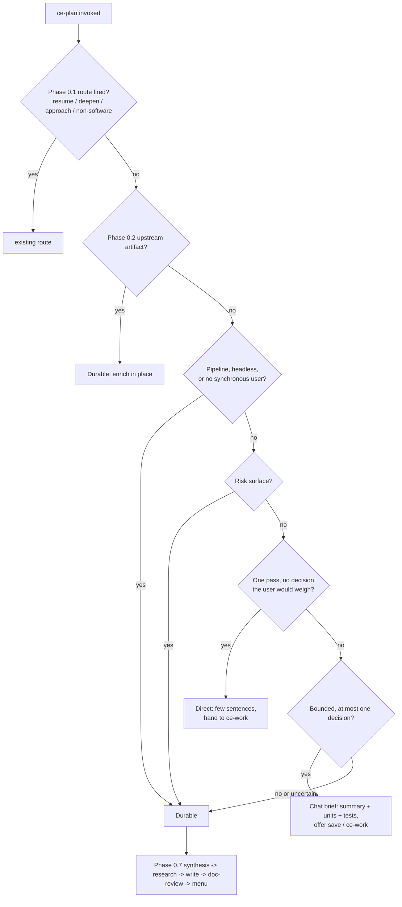

# Right-Size Skill Ceremony for Small Work - Plan

## Goal Capsule

- **Objective:** A small, well-specified request that reaches `ce-plan` or `ce-brainstorm` — by harness auto-trigger or explicit invocation — costs a few sentences in chat and no subagent, file, or document-review ceremony; a mechanical diff that reaches `ce-work` ships without a post-PR watch; Standard and Deep work keeps the workflow it has today.
- **Means:** A condition-shaped proportionality gate at each skill's intake, tier-selected output contracts in `ce-plan`, a chat-default Lightweight tier in `ce-brainstorm`, and a `babysit:off` pass from `ce-work`'s mechanical route (KTD1, KTD2, KTD5, KTD7).
- **Authority:** Session-settled decisions (Key Decisions below) outrank research convenience; the unified-plan artifact contract and pipeline consumer contracts (`lfg`, `ce-work` return envelope) outrank ceremony savings; the `ce-skill-work` authoring standard governs every prose edit under `skills/**`.
- **Execution profile:** One PR covering all three skills, docs, tests, and eval scenarios, with deterministic tests and one pre/post cross-host eval on the merged chain before merge. Edits under `skills/**` go through `ce-skill-work`.
- **Stop conditions:** Stop if a skill's gate cannot fit the 8,000-byte CRLF-adjusted kernel cap without moving an act-before-read condition out of the kernel; stop if an eval shows the Durable path regressed on any existing `ce-plan` scenario; stop and surface if a change would require a new token or frontmatter value on the unified-plan contract.
- **Tail ownership:** The PR ships through the normal commit/push/PR workflow; no direct merges. Follow-up work listed under Scope Boundaries is not part of this run.

---

## Product Contract

### Summary

Add a proportionality gate to `ce-plan`, `ce-brainstorm`, and `ce-work` that decides, before any research or subagent spend, whether the work needs this skill's durable deliverable. `ce-plan` gains three output contracts selected by that gate — Direct, Chat brief, Durable — with the Durable unified-plan floor unchanged. `ce-brainstorm`'s Lightweight tier defaults to chat with no file. `ce-work`'s mechanical route stops the post-PR watch by passing the callee's existing `babysit:off`. Skill descriptions on `ce-plan` and `ce-brainstorm` gain a small-change negative only if the activation eval shows a description-driven false trigger to block. The `ce-plan` and `ce-work` skill pages gain a recommended standing instruction that excludes the small change.

### Problem Frame

A user reports that every small change runs "the CE suite" and burns tokens, and that they constantly interrupt to say "just make the simple fix". The skills already classify work as Lightweight / Standard / Deep (`skills/ce-plan/references/intake.md` 0.6, `skills/ce-brainstorm/references/phase-0.md` 0.3) and already carry no-doc rules (`skills/ce-plan/references/plan-sections.md` "Decide whether a plan doc is warranted", `skills/ce-brainstorm/references/brainstorm-sections.md` "Decide whether a doc is warranted"). Those rules do not save anything: `ce-plan`'s sits in a Phase 5 reference after two always-on research subagents and says "bias toward producing a plan"; its kernel says "When directly invoked, always plan" and "incomplete until the Phase 5.4 menu is presented"; Lightweight depth changes section count, not the floor, confidence check, mandatory doc-review, or menu. `ce-brainstorm`'s Path A still proceeds to doc-write in the same turn. `ce-work`'s Trivial route skips only the task list and still hands a one-line PR to a default-on babysit watch. The harness auto-trigger contract is the `description`, and neither `ce-plan` nor `ce-brainstorm` names the small-change case as not theirs. A cross-model panel (Codex, Grok) independently confirmed this diagnosis and rejected thinning the implementation-ready contract as the fix.

### Key Decisions

- **The gate is a condition on the work's shape, never a size number.** (session-settled: user-approved — chosen over numeric file/line floors in skills: users cannot predict size, and the repo's auto-invoke guidance puts size floors in standing instructions, not skills.) Governs R1, R2, R12.
- **`ce-plan` selects one of three output contracts; the Durable unified-plan floor is not thinned.** (session-settled: user-approved — chosen over dropping Goal Capsule / Verification Contract / Definition of Done from Lightweight plans: `ce-work` and `lfg` read those fields, and a thinner file under the same readiness label lies to them.) Governs R3, R4, R5.
- **Description negatives land on `ce-brainstorm` and `ce-plan` only.** (session-settled: user-approved — chosen over also refusing small requests in `ce-work`/`ce-debug`: those must still fire on explicit small requests and be cheap.) Governs R8, R9.
- **No configuration knob for ceremony.** (session-settled: user-approved — chosen over a `ceremony:` / `min_tier` key: it turns a judgment problem into a setting the user must predict in advance; the existing `auto_babysit` and `plan_skip_scoping_confirm` keys are not extended.) Governs R13.
- **Activation is evaluated separately from execution, on Claude and Codex.** (session-settled: user-approved — chosen over a single-harness execution eval: a routing miss is not an execution failure, and prose ambiguity fails per model.) Governs R14, R15.
- **One PR for the whole change.** (session-settled: user-directed — chosen over one PR per skill: `ce-plan`'s chat brief and `ce-work`'s session-carried-brief consumer are one seam, and shipping the producer before the consumer leaves a window where "proceed" after a chat brief executes an unrelated plan; a single PR also makes the merged three-skill chain the thing that is evaluated.) Governs R15, R16.

### Requirements

**Entry gate (all three skills)**

- R1. Each of `ce-plan`, `ce-brainstorm`, and `ce-work` decides, before any subagent dispatch, engine resolution, or artifact setup, whether the request needs that skill's distinctive deliverable; the gate may ground itself with bounded inline reads of the surfaces the request names.
- R2. The gate's condition is stated once, as a condition with a safe failure direction: when the tier is still uncertain after those reads, take the heavier tier; when a bounded result later surfaces a decision the user would weigh, a risk surface, or multi-pass verification, the run upgrades to the heavier tier before emitting its result.
- R12. An explicit invocation never routes out of the skill; it may select any tier, and its smallest valid result is delivered in chat.

**`ce-plan` output contracts**

- R3. Direct: when the work can be stated, done, and verified in one pass with no decision the user would weigh, `ce-plan` states the change in a few sentences and offers the handoff to `ce-work` or the user in one line, invoking `ce-work` only on acceptance or under an orchestrator's implementation intent; no file, no subagent, no confidence check, no document review, no handoff menu.
- R4. Chat brief: when the work is bounded, carries at most one decision the user would weigh, and touches no risk surface, `ce-plan` delivers in chat a summary, implementation units, and test expectations; it runs no subagent, confidence check, document review, or handoff menu, and closes with a one-line offer to save or hand to `ce-work`.
- R5. Durable: the existing unified-plan path, unchanged in floor, metadata, document review, and handoff menu; a Lightweight-depth Durable plan skips the always-on local research subagents and grounds from bounded inline reads.
- R6. Pipeline and headless runs, any run where no synchronous user can act on chat output this turn, and any request whose wording asks for a plan, a plan file, or an output format select Durable (the word "plan" in the request is the pin; Codex read "write a plan for X" as a chat brief 6/6 when the pin named only a plan file).
- R7. A risk surface — authentication, payments, or migrations (the surfaces `skills/ce-work/references/work-intake.md`'s Large row already names) or any external-contract surface `skills/ce-plan/references/research.md` 1.4b names — selects Durable regardless of size.
- R10. A saved Chat brief is a plain markdown file under `<root>/plans/` without the unified-plan contract, following the approach-altitude persist shape.

**`ce-brainstorm` Lightweight tier**

- R8. Lightweight work ends in a chat paragraph with no file unless the dialogue produced decisions a downstream consumer needs in IDed form, or the user asks for a file.
- R9. The `ce-brainstorm` and `ce-plan` descriptions exclude the small, well-specified change only when the activation pre-arm shows a description-driven false trigger to block; `ce-brainstorm`'s existing negative ("already-specified work … with no product scope left to decide") already decides that case, and a negative the eval cannot show blocking anything is not added.

**`ce-work` mechanical route**

- R11. On the route that already records `Code review: skipped (mechanical diff)`, `ce-work` passes `babysit:off` to the shipping skill and records that it did; every other route is unchanged.
- R17. `ce-work` does not re-route a bare prompt that the same session's `ce-plan` already sized back to `ce-plan` or `ce-brainstorm`; it may re-size between its own Trivial and Small/Medium routes, and when implementation surfaces a decision the user would weigh, it stops before the write and asks or returns the finding.

**Docs, config, evidence**

- R13. No new configuration key is added; `skills/ce-setup/references/config-template.yaml` and `docs/skills/configuration.md` are untouched.
- R14. The PR carries deterministic tests for the greppable parts of each contract and updates every pinned string it changes.
- R15. The PR carries one pre/post eval on Claude and Codex, run on the merged three-skill chain, whose matrix separates activation (implicit trigger vs explicit invoke) from execution across trivial, small-one-decision, medium-clear, risky-small, and full-feature prompts, with an expected tier, expected output contract, and forbidden side effects stated per cell.
- R16. The change lands as one PR.
- R18. `docs/skills/ce-plan.md` and `docs/skills/ce-work.md` carry a recommended standing instruction, in the shape of `docs/skills/ce-compound.md` "Make Capture Automatic", whose activation condition excludes the small, well-specified change; no other page under `docs/skills/` recommends auto-invoking a planning or implementation skill today, so no existing block is edited.

### Acceptance Examples

- AE1. **Covers R1, R3, R12.** Given a user typing `/ce-plan fix the off-by-one in parser.ts` in an interactive session, when `ce-plan` runs, then it states the fix in chat within the first turn, dispatches no subagent, writes nothing under `<root>/plans/`, and does not print "Plan ready at".
- AE2. **Covers R4, R10.** Given `/ce-plan add a --json flag mirroring --yaml` on a repository where `--yaml` exists, when `ce-plan` runs, then chat contains a summary, two or more units, and test expectations; no file is written; the closing line offers save-or-`ce-work`; and "What would you like to do next?" does not appear.
- AE3. **Covers R7.** Given `/ce-plan change the session cookie flags` (two files, an auth surface), when `ce-plan` runs, then it writes a Durable plan and presents the handoff menu.
- AE4. **Covers R6.** Given `lfg` invoked with a trivial prompt, when `ce-plan` runs in pipeline mode, then it returns a written plan path with `artifact_readiness: implementation-ready`.
- AE5. **Covers R8.** Given `/ce-brainstorm should the save button get a tooltip or inline help`, when the dialogue resolves in one question, then the result is a chat paragraph, no file, and the handoff hides the `lfg` option.
- AE6. **Covers R11.** Given `ce-work` ships a dependency-bump diff, when it loads the shipping skill, then the arguments include `babysit:off` and no babysit run starts.
- AE7. **Covers R9.** Given a fresh Claude Code session with the plugin loaded and a user message "fix the typo in the error string in cli.ts", when the harness chooses skills, then neither `ce-plan` nor `ce-brainstorm` loads.
- AE8. **Covers R5.** Given a medium-clear feature request, when `ce-plan` runs Durable, then every existing `ce-plan` eval scenario passes unchanged.

### Scope Boundaries

- Out of scope: `ce-debug` and `ce-code-review` prose (both already carry fast paths); a ceremony configuration key; any change to the unified-plan artifact contract, its readiness values, or its frontmatter.
- In this run a behavior-bearing small fix that ships through `ce-work` still receives code review and the default post-PR watch; widening the no-watch condition is deferred (KTD7).

#### Deferred to Follow-Up Work

- Keying `ce-work`'s `babysit:off` on the small, low-risk, code-only condition (the `ce-code-review` lite-roster class) rather than the mechanical-diff class only — see KTD7's conflict call-out. A review finding that "mechanical diff" is a review label rather than proof a watch is unnecessary re-states this same deferral.
- Adding a size do-not-fire case to `skills/ce-commit-push-pr/references/apply-and-handoff.md` so callers need not pass `babysit:off`.
- A skill-dispatch observer for the eval cell (the `babysit:off` and no-re-planning rows can only grade narration or artifacts today; PR #1514 review thread).
- Fixing the stale `status: active` frontmatter on `docs/plans/2026-06-04-001-feat-ce-plan-approach-altitude-plan.md`.
- `ce-debug` on Codex: its description ("fix failing behavior") pulls an implicit typo fix into the diagnosis loop, and the trivial fast-path still asks the fix-choice question before a one-line edit (live session, 2026-08-22). The same proportionality condition belongs at `ce-debug`'s entry, stated once; out of this change's scope by the Scope Boundaries above.

### Outstanding Questions

- Deferred (non-blocking): whether the Direct tier should also cover `ce-brainstorm` (a product question answerable in one line with no file and no handoff menu) beyond what Phase 0's "neither" route already covers. Resolve during the `ce-brainstorm` PR's eval.

---

## Planning Contract

### Key Technical Decisions

- KTD1. **The gate lives in each kernel as an act-before-read condition; the output-contract mechanics live in a point-of-use reference.** (session-settled: user-approved — chosen over putting the whole mechanism in the kernel: CRLF-adjusted before this change, `ce-plan` is 7,042 bytes, `ce-work` 7,219, `ce-brainstorm` 7,034 against the 8,000-byte cap measured by `tests/codex-skill-prompt-budget.test.ts`, leaving under 1 KB each.) The gate text is about that size, so each kernel also moves one block that is not an act-before-read condition — `ce-plan`'s `## Task Visibility` and its subagent-boundary sentence are the first candidates — into the reference that owns it. The kernel states the condition once — evaluated inside intake at depth assessment (Phase 0.6), after depth and before the scoping synthesis — plus the safe direction and which reference owns each tier; intake points to that kernel condition and does not restate it. `references/output-contracts.md` (new, `ce-plan`) owns Direct and Chat brief composition, the saved-brief shape, and their done conditions. Diff reference against kernel before eval and delete any duplicate statement.
- KTD2. **The gate fires only in solo interactive invocation, after resume, deepen, approach-altitude, domain split, and upstream-source discovery.** Same guard shape as `intake.md` 0.7: no Phase 0.1 route fired, Phase 0.2 found no upstream artifact, Phase 0.4 stayed in `ce-plan`. Requirements-only enrichment never downgrades — the brainstorm already chose a file. In pipeline or headless context, or when the run is goal- or scheduler-driven, the tier is Durable (R6).
- KTD3. **`ce-plan` never implements; Direct is a planning outcome delivered in chat.** `SKILL.md` line 15 stands. "When directly invoked, always plan" is restated as: an explicit invocation never routes out and always produces a plan; the smallest valid plan is a few sentences in chat. The Mandatory Completion Contract names the Direct and Chat-brief terminal conditions beside the Phase 5.4 menu so neither tier is "incomplete" forever.
- KTD4. **Direct and Chat-brief hand off to `ce-work` as a bare prompt; no new carrier.** `ce-work`'s bare-prompt route and `source_kind: prompt` already exist. `input-triage.md`'s session-carried "proceed" resolution widens from "one current plan/spec path" to "one current plan/spec path or in-conversation brief accepted for this work" so "proceed" after a chat brief does not fall into blank-invocation discovery and pick up an unrelated plan. A Chat brief is self-contained (units and test expectations) so it survives as a prompt on every host.
- KTD5. **A saved Chat brief uses the approach-altitude persist shape.** Plain `.md` under `<root>/plans/`, no `artifact_contract`, `execution: code` unless the deliverable is non-code. `ce-work` reads it as a legacy plan; `lfg` rejects it, which is correct because `lfg` never enters the Chat tier. "Save" does not upgrade to Durable; a user who wants the floor re-invokes `ce-plan` on the brief.
- KTD6. **Lightweight Durable skips the always-on research subagents but keeps document review.** (session-settled: user-approved — chosen over also dropping document review on Lightweight. Conflict call-out: research found `ce-doc-review` is the only independent check left once research subagents are skipped, `docs/solutions/best-practices/ce-pipeline-end-to-end-learnings.md` records it catching contradictions PR review cannot, and `tests/pipeline-review-contract.test.ts` pins the literal "Document review is mandatory" in `SKILL.md`; the literal stays, scoped to the Durable tier. Small work that does not need a file is the Chat brief tier, so there is no separate "Lightweight file without review" tier to save.)
- KTD7. **`ce-work` passes the callee's documented `babysit:off` on its mechanical route; the do-not-fire condition stays owned by `ce-commit-push-pr`.** (session-settled: user-approved — chosen over editing `ce-commit-push-pr`'s do-not-fire list in this change: a delegating skill states the condition and uses the callee's documented argument rather than re-deriving the callee's mechanism. Conflict call-out: the mechanical-diff class excludes behavior-bearing one-line fixes, so the canonical Direct case — an off-by-one fix — still gets a babysit watch; widening the pass condition to the small, low-risk, code-only class is deferred.)
- KTD8. **Brainstorm summaries carrying a settled decision select Chat brief at minimum.** A `ce-brainstorm` Lightweight handoff passes the decision summary (`references/handoff.md` already does); `ce-plan`'s gate treats a summary with one or more settled decisions an implementer must honor as needing the brief's decisions line, and Direct only when it carries none. This does not force Durable.
- KTD9. **A description negative is added only against a demonstrated false trigger, and never as a case an existing negative already decides.** `ce-brainstorm`'s "Not for executing already-specified work … with no product scope left to decide" already covers the small change, so nothing is appended to it. `ce-plan`'s candidate clause — "Not for a small change already specified down to the files it touches and touching no risk surface; do that directly or with `ce-work`" — ships only when the activation pre-arm shows `ce-plan` loading implicitly on such a prompt; it names the risk exclusion so an implicit authentication or migration request would still reach the gate's Durable pin (R7). Both stay under the 1,024-character cap; no converter rewrites skill descriptions.
- KTD10. **Activation scenarios run in fresh host sessions; execution scenarios run in the eval cell.** The cell (`tests/skill-eval-cell/`) injects one skill and cannot observe auto-trigger; implicit rows run as a fresh `claude` / `codex` session with the plugin loaded, graded from the transcript for "skill loaded or not".

### High-Level Technical Design

### Assumptions

- The repo's `ce-skill-work` procedure (`.agents/skills/ce-skill-work/`) is invoked for each prose edit under `skills/**`; its validation contract, not this plan, decides the exact wording.
- The cross-host eval pack accepts new scenarios with `post_only: true` for behavior the pre-change tree lacks, and a `baseline_ref` for A/B rows (`tests/skill-eval-cell/catalog.ts`).

### Sequencing

One PR. U1–U5 can be built in any order; U3 follows U1/U2; U6 and U7 follow the skill units they document and evaluate. U5's session-carried-brief widening and U1's Chat brief land together so "proceed" after a brief never resolves to an unrelated plan.

---

## Implementation Units

### U1. `ce-plan` proportionality gate and output-contract reference

- **Goal:** `ce-plan` decides its output contract at intake and can finish in chat.
- **Requirements:** R1, R2, R3, R4, R5, R6, R7, R10, R12; KTD1, KTD2, KTD3, KTD5, KTD6, KTD8.
- **Dependencies:** none.
- **Files:** `skills/ce-plan/SKILL.md`; `skills/ce-plan/references/intake.md`; `skills/ce-plan/references/output-contracts.md` (new); `skills/ce-plan/references/research.md`; `skills/ce-plan/references/plan-sections.md`; `skills/ce-plan/references/final-review.md`; `skills/ce-plan/references/plan-handoff.md`.
- **Approach:**
  1. In `SKILL.md`, restate line 13 per KTD3; add the gate as one condition block stating that it is evaluated inside intake at Phase 0.6 (after depth, before the scoping synthesis), naming the three tiers, the bounded-read grounding and upgrade checkpoint (R1, R2), the safe direction, the pipeline/no-synchronous-user pin, and the risk-surface pin, and that Direct and Chat brief exit intake there to `references/output-contracts.md`; extend the Mandatory Completion Contract with the two chat-tier terminal conditions; keep "Document review is mandatory" and scope it to Durable.
  2. Create `references/output-contracts.md` owning: Direct composition and handoff line; Chat brief composition (summary, units with files and test expectations, at most one decisions line), the one-line save/`ce-work` offer, and its done condition; the saved-brief file shape (KTD5); the brainstorm-summary rule (KTD8).
  3. In `intake.md`, have 0.6 point at the kernel's gate condition without restating it, and make 0.7 fire only for Durable; in 0.4 replace the "suggest `ce-work` alongside planning" ask with the gate's Direct outcome so auto-trigger never produces a blocking question for a one-line fix.
  4. In `research.md` 1.1, condition the local research dispatch on depth: Lightweight Durable grounds from bounded inline reads and skips the two subagents; 1.4b reclassification still applies.
  5. In `plan-sections.md`, replace "Decide whether a plan doc is warranted at all" with a pointer to the gate, removing "Bias toward producing a plan"; keep the stress-test examples in `output-contracts.md` as the gate's worked cases only if they read as conditions, not a case list.
  6. In `final-review.md` and `plan-handoff.md`, no mechanism change; add the one sentence that these phases are Durable-only.
  7. Recover bytes per KTD1: move `## Task Visibility` (and the subagent-boundary sentence if still needed) into the reference that owns that behavior, with a one-line pointer.
  8. Diff `output-contracts.md` against `SKILL.md` and remove any rule stated twice; confirm `SKILL.md` stays under the cap.
- **Execution note:** Run `bun test tests/codex-skill-prompt-budget.test.ts` after every kernel edit; the headroom is under 1 KB.
- **Patterns to follow:** `references/approach-altitude.md` (chat-first, file-optional, persist marker); `intake.md` 0.7 guard shape; `docs/solutions/skill-design/size-driven-skill-restructure.md`.
- **Test scenarios:** see U3 (deterministic) and U7 (behavioral).
- **Verification:** kernel under cap; every reference named in `SKILL.md` exists; `bun run test` green.

### U2. `ce-plan` description negative

- **Goal:** Harnesses stop auto-triggering `ce-plan` on already-specified small changes, when the description is what triggers them.
- **Requirements:** R9; KTD9.
- **Dependencies:** U1 and the U7 activation pre-arm (the negative ships only when that arm shows a description-driven false trigger).
- **Files:** `skills/ce-plan/SKILL.md` (frontmatter only).
- **Approach:** Run the activation pre-arm first. Append the KTD9 clause only when a small or already-specified prompt implicitly loaded `ce-plan` or `ce-brainstorm` in a fresh session; otherwise leave both descriptions unchanged and record the observed trigger source in the eval report. Stay under 1,024 characters; do not touch legacy description strings in `src/utils/legacy-cleanup.ts`.
- **Patterns to follow:** `skills/ce-code-review/SKILL.md`, `skills/ce-ideate/SKILL.md` descriptions.
- **Test scenarios:** `tests/frontmatter.test.ts` and `tests/skill-conventions.test.ts` cap checks pass unchanged.
- **Verification:** `bun run release:validate` and `bun run plugin:validate` pass.

### U3. `ce-plan` deterministic test updates

- **Goal:** Tests pin the new contract and stop pinning the old one.
- **Requirements:** R14.
- **Dependencies:** U1, U2.
- **Files:** `tests/skills/ce-plan-handoff-routing.test.ts`; `tests/pipeline-review-contract.test.ts`; `tests/skills/unified-plan-artifact-contract.test.ts`; `tests/skills/ce-plan-output-mode.test.ts`.
- **Approach:** Audit each pin as keep / condition / drop. Keep: `## Mandatory Completion Contract` precedes `## Interaction Method`; exact "Plan ready at … What would you like to do next?" question; "Document review is mandatory" literal; 5.3.8 before 5.3.9. Add: `SKILL.md` names `references/output-contracts.md`; `output-contracts.md` states the no-`artifact_contract` rule for saved briefs; `plan-sections.md` no longer contains "Bias toward producing a plan"; `intake.md` 0.7 names its Durable-only guard. Pin the smallest falsifiable token in each case.
- **Test scenarios:**
  - Kernel names the output-contracts reference and the three tier names.
  - Saved-brief rule forbids `artifact_contract: ce-unified-plan/v1`.
  - "Bias toward producing a plan" absent from `plan-sections.md`.
  - All pre-existing kept pins still pass.
- **Verification:** `bun run test` green.

### U4. `ce-brainstorm` Lightweight chat default and description

- **Goal:** Lightweight brainstorms end in chat unless a file is earned.
- **Requirements:** R1, R2, R8, R9, R12; KTD1, KTD8, KTD9.
- **Dependencies:** none.
- **Files:** `skills/ce-brainstorm/SKILL.md`; `skills/ce-brainstorm/references/phase-0.md`; `skills/ce-brainstorm/references/synthesis-summary.md`; `skills/ce-brainstorm/references/brainstorm-sections.md`; `skills/ce-brainstorm/references/plan-write.md`; `skills/ce-brainstorm/references/handoff.md`; `tests/skills/unified-plan-artifact-contract.test.ts`; `tests/skills/ce-brainstorm-aggregation-check.test.ts`.
- **Approach:**
  1. `SKILL.md`: add the gate as an act-before-read step before the first reference read (KTD1), within the byte cap; merge the small-change negative into the existing description negative; restate line 61 so the artifact contract holds "when a file is written"; keep the Ready for Planning Check gate for the file path.
  2. `phase-0.md` 0.3: the tier classification states the Lightweight default (chat paragraph) and the file-earning condition (decisions a downstream consumer needs in IDed form, or a user request); 0.2's "if requirements are already clear" block cites it instead of restating.
  3. `synthesis-summary.md` Path A: announce-mode proceeds to the chat paragraph, and to doc-write only when the file condition holds.
  4. `brainstorm-sections.md` "Decide whether a doc is warranted": invert to no-file default; keep the bug-fix stress test as the worked case.
  5. `plan-write.md`: entry condition cites the same rule; Vocabulary Capture still runs on chat-only results.
  6. `handoff.md`: unchanged mechanism; confirm the `lfg` hide rule and the summary carrier already satisfy KTD8.
  7. Tests: keep the `artifact_readiness: requirements-only` and "Ready for Planning Check" pins; add a pin that the kernel carries the gate step and that `phase-0.md` states the Lightweight chat default.
- **Patterns to follow:** `SKILL.md` line 13's existing "no doc was written because the user needed only brief alignment" done clause; `docs/solutions/skill-design/prose-review-is-unbounded-answer-with-the-condition.md`.
- **Test scenarios:**
  - `phase-0.md` contains the Lightweight chat-default condition.
  - `brainstorm-sections.md` no longer states a doc-by-default trigger.
  - Description under 1,024 characters, single merged negative.
  - Existing artifact-contract and aggregation-check pins pass.
- **Verification:** kernel under cap; `bun run test` green.

### U5. `ce-work` mechanical route passes `babysit:off`; no bounce on sized prompts

- **Goal:** A mechanical diff ships without a babysit watch; a same-session sized prompt is executed, not re-planned.
- **Requirements:** R11, R17; KTD4, KTD7.
- **Dependencies:** U1 (the session-carried-brief widening lands with the Chat brief).
- **Files:** `skills/ce-work/SKILL.md`; `skills/ce-work/references/shipping-workflow.md`; `skills/ce-work/references/input-triage.md`; `skills/ce-work/references/work-intake.md`; `tests/skills/ce-work-outcome-spine.test.ts`; `tests/pipeline-review-contract.test.ts`.
- **Approach:**
  0. `SKILL.md`: add the gate as an act-before-read step before the first reference read or setup (KTD1), within the byte cap.
  1. `shipping-workflow.md` ship-handoff: when the run recorded `Code review: skipped (mechanical diff)`, include `babysit:off` in the `ce-commit-push-pr` arguments and name it in the PR-context list; one condition, no new skip class.
  2. `input-triage.md` session-carried resolution: widen "plan/spec path" to include an in-conversation brief accepted for this work; source kind is `prompt`.
  3. `work-intake.md` Large row: a bare prompt the same session's `ce-plan` already sized is not re-routed to `ce-plan`/`ce-brainstorm`; re-size only between Trivial and Small/Medium; when implementation surfaces a decision the user would weigh, stop before the write and ask or return the finding.
  4. Tests: pin the kernel gate step; pin that `shipping-workflow.md` names `babysit:off` under the mechanical condition; pin the no-re-route sentence in `work-intake.md`; leave `tests/commit-push-pr-contract.test.ts` untouched.
- **Patterns to follow:** `shipping-workflow.md`'s existing exact-phrase skip state; `docs/solutions/skill-design/skill-gates-state-conditions-not-prescribed-git-commands.md`.
- **Test scenarios:**
  - `shipping-workflow.md` contains `babysit:off` within the mechanical-diff condition.
  - `work-intake.md` contains the same-session no-re-route condition.
  - `tests/pipeline-review-contract.test.ts` code-review completion gate pins still pass.
- **Verification:** kernel under cap; `bun run test` green.

### U6. Docs: skill pages and standing-instruction size conditions

- **Goal:** User-facing docs describe the tiers and every auto-invoke recommendation carries a size condition.
- **Requirements:** R18.
- **Dependencies:** U1, U4, U5.
- **Files:** `docs/skills/ce-plan.md`; `docs/skills/ce-brainstorm.md`; `docs/skills/ce-work.md`; `docs/skills/README.md` (catalog row wording if it names the output); `README.md` inventory row wording if it names the output.
- **Approach:** `ce-plan.md` documents Direct / Chat brief / Durable, the save shape, and that confidence check, document review, and menu are Durable-only; `ce-brainstorm.md` documents the chat default; `ce-work.md` documents the mechanical `babysit:off` pass and the no-bounce rule. `ce-plan.md` and `ce-work.md` gain a "Make it automatic" section in the shape of `docs/skills/ce-compound.md` "Make Capture Automatic" whose standing instruction excludes the small, well-specified change (R18).
- **Test expectation:** none — documentation only.
- **Verification:** pages read consistently with the shipped prose; `docs/skills/ce-compound.md` and `ce-simplify-code.md` untouched.

### U7. Cross-host eval scenarios (activation and execution)

- **Goal:** The PR carries evidence, on the merged three-skill chain, that activation and execution behave as specified on Claude and Codex, and that the Durable path did not regress.
- **Requirements:** R14, R15; KTD10.
- **Dependencies:** U1–U5.
- **Files:** `tests/skill-eval-cell/catalog.ts`; `tests/skill-eval-cell/scenarios.md`; `tests/skill-eval-cell/fixtures/` (a small well-specified-change fixture on `tiny-lib`); one `docs/plans/` eval report (follow `docs/plans/2026-08-21-phase-loaded-skill-kernels-eval-report.md`); a runbook section in that report.
- **Approach:** Add execution rows to the catalog with `post_only: true` where the old tree lacks the behavior and `baseline_ref` for A/B; run implicit-activation rows as fresh host sessions graded from transcript. The runbook states, once: how each tree is loaded per host (Claude Code re-copies the local marketplace source at session start; Codex uses `bun run codex:dev -- local` from the worktree under test), how the pre arm checks out the baseline ref, how the transcript is captured, and what counts as "skill loaded" on each host. Each matrix cell states its expected activation, tier, output contract, and forbidden side effects. If the pre arm shows neither skill loads implicitly on any small prompt, record the description negatives as unverified and report the observed trigger source instead of claiming AE7 as evidence. Grade with `delegates`, `workspace_contains`, `must_include` / `must_exclude` on the ACTIONS trailer, and `files_read_post` for the required reference reads. Independent grader, pre/post, both hosts.
- **Test scenarios (rows):**
  - Covers AE1. `ce-plan`, explicit, trivial: `delegates: none`, no `docs/plans` write, must-exclude "Plan ready at".
  - Covers AE2. `ce-plan`, explicit, small-one-decision: `delegates: none`, no file, must-exclude "What would you like to do next", must-exclude `ce-doc-review`.
  - Covers AE3. `ce-plan`, explicit, risky-small: `workspace_contains` a plan file.
  - Covers AE8. `ce-plan`, explicit, medium-clear and full-feature: existing `ce-plan/no-implement` and handoff rows pass unchanged.
  - Covers AE4. `lfg/plan-first` plus a trivial-prompt variant: plan path returned.
  - Covers AE7. Fresh-session implicit: trivial and small-one-decision prompts load neither `ce-plan` nor `ce-brainstorm`; medium-clear prompt still loads `ce-plan`.
  - Covers AE5. `ce-brainstorm`, explicit, small product tweak: no file; handoff without `lfg`; `files_read_post` includes `references/phase-0.md`.
  - Covers AE6. `ce-work`, explicit, prompt = dependency bump with the push/PR shim blocking a real push: `must_include` "babysit:off" on the ACTIONS trailer, `must_exclude` any babysit start.
  - `ce-work`, explicit, prompt = chat brief from AE2: Small/Medium route, no route-back to `ce-plan`.
- **Verification:** every row passes post on both hosts on the merged chain; no pre-passing row fails post; one report committed with the PR.

---

## Verification Contract

| Check | Command | Applies to |
|---|---|---|
| Kernel byte cap | `bun test tests/codex-skill-prompt-budget.test.ts` | U1, U4, U5 |
| Full deterministic suite | `bun run test` | the PR |
| Plugin and marketplace consistency | `bun run release:validate` and `bun run plugin:validate` | U2, U4 |
| Behavioral eval, both hosts | `bun run test:skill-eval-pack -- --skill <name> --arm ab` plus fresh-session activation rows | U7 |
| Skill-authoring standard | `ce-skill-work` review mode on each `skills/**` diff | U1, U2, U4, U5 |

---

## Definition of Done

- Global: one PR open, green on CI, with its eval report; no `skills/**` kernel over the cap; no change to unified-plan contract values; `ce-skill-work` applied to every prose edit; abandoned drafts removed from the diff.
- U1–U2: AE1–AE4 and AE8 pass on both hosts.
- U3: `bun run test` green with the audited pins; `tests/pipeline-review-contract.test.ts` and `tests/skills/unified-plan-artifact-contract.test.ts` edited once for all three skills.
- U4: AE5 and AE7 (brainstorm rows) pass on both hosts.
- U5: AE6 passes; the chat-brief-to-`ce-work` row shows no route-back.
- U6: pages match shipped prose.
- U7: one report, independent grader, pre/post, merged chain.
