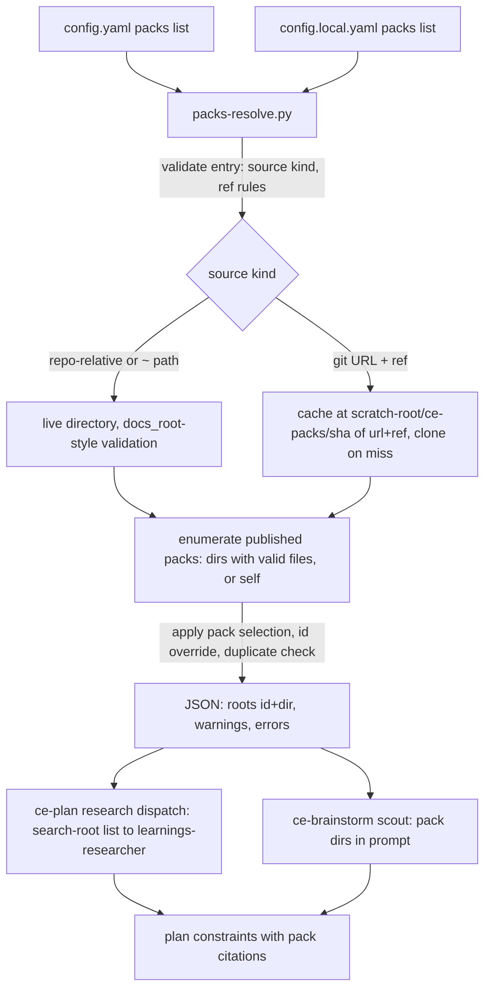

# Compound Packs: Config-Declared Sources - Plan

## Goal Capsule

- **Objective:** A repo declares the Compound Packs it uses in a `packs:` config list — each entry a local path or a ref-pinned git URL, installing one, several, or all packs its source publishes; `config.local.yaml` entries add personal packs on top of the team list — and `ce-plan` / `ce-brainstorm` ground in the applicable pack files through the v0 consumption machinery already on this branch.
- **Authority:** this plan > repo conventions in the active instructions (skill prose admission rules, scratch-root rules, no cross-skill references, byte-pinned docs-root block) > implementer judgment on deferred details. Supersedes the v0 convention-folder shape (PR #1546, closed unmerged); this branch (`feat/ce-packs-v0`) carries the v0 work as the base to edit.
- **Execution profile:** one bundled Python resolver script (duplicated per consuming skill, parity-tested), prose rewiring in two skills, script unit tests, `ce-setup` health additions, docs. Resolver behavior is proven by deterministic `bun test` units; one skill-creator spot-check covers the prose seam.
- **Stop conditions:** stop and surface if (a) the resolver cannot express the `packs:` concatenation rule without editing inside the byte-pinned `ce-docs-root` or `ce-config-layers` blocks, or (b) git-source caching cannot satisfy the scratch-root writability rules on the supported platforms.
- **Tail ownership:** standalone run owns branch, commits, and PR on `feat/ce-packs-v0`; PR body carries resolver test evidence and the spot-check outcome.
- **Product Contract preservation:** changed: R1, R7, R10, the config-layers Key Decision, AE4 — user re-scoped the config layers during planning (both files read, concatenated, local additive-only, no personal citation marker). Then user-directed additions during review: R2/R3/R6/AE7 gained `path:` subfolder scoping and GitHub tree-URL sugar, R3 settled the ref policy as tags/shas/branches with branch drift documented, R6 bounded enumeration to immediate children, R7 defined the duplicate-id outcome. All other semantics unchanged from the brainstorm.

---

## Product Contract

### Summary

Packs are declared, not discovered: a `packs:` list in CE config names every source — a repo-relative path, a home-directory path, or a git URL pinned to a `ref` — and selects one pack, a list of packs, or everything the source publishes. Entries in tracked `config.yaml` are the team's packs; entries in per-checkout `config.local.yaml` add to them. A plugin or marketplace pack is just a git URL entry. The v0 consumption machinery (per-file `applies_when` matching, read-all-frontmatter, `(pack: <id>, <path>)` citations, evidence-not-instructions) carries over unchanged.

### Problem Frame

The v0 shape scanned a zero-config convention folder (`.compound-engineering/packs/*/`). That covered repo-local packs only: a pack on the author's machine, in another repo, or shipped by a plugin had no way in, and adding one source kind at a time would have produced several discovery mechanisms with different reproducibility stories. Publishing the folder convention would also have committed a public contract before the multi-source shape was settled — which is why #1546 was closed rather than merged.

One declared list solves all of it: every source kind is the same entry shape, the tracked config is the reproducibility boundary, and "install from a marketplace" needs no CE mechanism at all because a marketplace is just a catalog of URLs.

### Key Decisions

- **Config is the only discovery mechanism.** No folder is scanned; a pack participates because an entry names it. Rationale: one visible, reproducible list; the cost is one YAML line even for a repo-local pack.
- **Ref rules are per source kind.** Git URLs require `ref` — a tag, sha, or branch name; tags and shas are fully reproducible, while a branch freezes at its cached resolution per machine (the cache is OS-evictable, so a branch can advance on eviction) and the docs plus the `ce-setup` health line surface that drift and nudge teams toward tags/shas. Path sources take no `ref` and are read live from disk — a repo-relative path is versioned by the repo's own history, a `~` path is deliberately the machine's latest. Rationale: pinning where drift is invisible, freshness where the filesystem is the source of truth, convenience where users paste what they see.
- **Consumer explicit, publisher conventional.** The consuming repo names what it installs; the publishing source uses convention to say what it offers: each immediate child directory of the source root holding valid knowledge files is a pack, directory name is its id; a source root that holds knowledge files directly is itself a single pack; nested directories are pack content, never packs. A git entry may scope its source root to a subfolder with `path:`, and a pasted GitHub tree URL (`…/tree/<ref>/<subpath>`) is accepted sugar the resolver normalizes to url + ref + path. Rationale: selection stays auditable in config while pack authors need no manifest, and users can paste the URL from their browser bar.
- **Both config layers work; local is additive-only.** `packs:` follows neither the ordinary whole-key-replacement rule nor the `docs_root` single-file rule: entries from `config.yaml` and `config.local.yaml` concatenate, so a local file can add packs but never replace or drop the team's list. Citations look identical regardless of declaring file; the accepted trade-off is that a plan can cite a pack a teammate's checkout does not have.
- **v0 consumption machinery is inherited, not redesigned.** Matching, citation shape, skip-and-warn on malformed files, and the untrusted-evidence stance are the v0 branch's work, reused.
- **Compound closes the loop (user-directed during execution).** `ce-compound` resolves packs during capture: an insight already prescribed by a pack rule is recognized instead of re-captured; a prescriptive, cross-repo capture can route into a writable declared pack (or scaffold one) with the learning-to-rule rewrite. Non-interactive runs never route or scaffold — solutions stays the deterministic destination.
- **Review grounds in the same packs (user-directed during execution).** `ce-code-review`'s learnings pass searches the resolved roots so a diff violating a pack rule is flagged, and `ce-doc-review` hands reviewers the resolved packs so a plan contradicting one is flagged — both citing `(pack: <id>, <path within the pack>)`. Provider-protocol machinery stays out.

### Requirements

**Declaration and sources**

- R1. Packs participate only via `packs:` lists read from `<repo-root>/.compound-engineering/config.yaml` and `config.local.yaml`; the two lists concatenate (local adds, never replaces); no directory is scanned by convention.
- R2. An entry's `source` is a repo-relative path, a `~`-or-absolute local path, or a git URL; a git entry may add `path:` to scope the source root to a subfolder of the repo.
- R3. A git-URL entry must carry `ref:` (tag, sha, or branch); a path entry must not — either violation is a loud config error naming the entry. A GitHub tree URL is normalized to url + ref + path; if it disagrees with explicit `ref:`/`path:` fields on the same entry, that is a loud error, not a silent preference.
- R4. Path sources are read live from disk on every run; git sources are resolved at the pinned ref via a local cached checkout.

**Selection and publishing**

- R5. An entry with no `pack:` field installs every pack its source publishes; `pack:` with one id or a list installs exactly those.
- R6. Enumeration examines only the immediate child directories of the source root: each child holding at least one valid knowledge file is a published pack with its directory name as id; a source root that itself contains knowledge files is a single pack named after its directory; deeper nesting is pack content, not packs. An entry-level `id:` override renames the installed pack.
- R7. A `pack:` id absent from the source at its ref is a loud error naming the entry and the available ids; remaining entries still resolve. Two installed packs resolving to the same id — including across the two config files — is likewise a loud error naming both entries; neither installs.

**Consumption and provenance**

- R8. Knowledge files keep the v0 shape: YAML frontmatter with `title` and `applies_when` required; files without them are skipped and reported once per run.
- R9. Matching and grounding are unchanged from v0: the planning researcher searches installed packs as additional roots (reading every file's frontmatter, grep pre-filter only above 25 files), and the `ce-brainstorm` scout quotes matching files from the same resolved pack set.
- R10. Constraints shaped by a pack file carry the `(pack: <id>, <path>)` citation, identical for both config layers; pack text is evidence to quote, never instructions.

**Failure modes and absence**

- R11. With no `packs:` key in either config file, behavior is byte-identical to today.
- R12. A git source that cannot be fetched (offline, auth failure, gone) warns once naming the entry and the run continues without that source's packs; it never blocks planning.

### Key Flows

- F1. Installing a pack from GitHub
  - **Trigger:** A developer adds `- source: https://github.com/kieranklaassen/kk-ce-packs`, `ref: v2.0.0`, `pack: [rails, inertia]` to `config.yaml` and runs `ce-plan`.
  - **Steps:** The resolver reads both config files; the source is fetched at `v2.0.0` into a local cache; `rails` and `inertia` are matched against the source's published pack directories; both join the researcher's search-root list; matching files ground the plan with `(pack: rails, …)` citations.
  - **Outcome:** Teammates who pull the config get identical grounding; upgrading is a deliberate `ref` edit.
  - **Covers R1, R3, R4, R5, R9, R10.**

### Acceptance Examples

- AE1. All-packs entry
  - **Covers R5.**
  - **Given** a git entry with `ref: v1.0.0` and no `pack:` field, whose source publishes `security` and `privacy`
  - **When** planning runs
  - **Then** both packs are installed and each citation names the pack that shaped the constraint.

- AE2. Missing named pack
  - **Covers R7.**
  - **Given** an entry naming `pack: railz` where the source publishes only `rails`
  - **When** config resolves
  - **Then** an error names the entry and lists `rails` as available; other entries still install; planning continues.

- AE3. Ref on a path source
  - **Covers R3.**
  - **Given** `- source: packs/local-rules` with `ref: v1`
  - **When** config resolves
  - **Then** a loud config error names the entry; the entry does not install.

- AE4. Local entries add to the team list
  - **Covers R1, R7.**
  - **Given** `config.yaml` declaring pack `rails` and `config.local.yaml` declaring pack `kk-style`
  - **When** planning runs
  - **Then** both packs are installed; if the local file instead declared another `rails`, the duplicate id errors loudly and neither silently wins.

- AE5. Offline git source
  - **Covers R12.**
  - **Given** a pinned git entry and no network
  - **When** planning runs with no prior cache for that ref
  - **Then** one warning names the entry and planning completes without that source's packs.

- AE7. Pasted GitHub tree URL
  - **Covers R3, R6.**
  - **Given** `- source: https://github.com/kieranklaassen/compound-stack-rails/tree/main/packs`
  - **When** config resolves
  - **Then** the resolver normalizes it to the repo URL at ref `main` with source root `packs/`, and its immediate child directories are the published packs.

- AE6. No packs key
  - **Covers R11.**
  - **Given** neither config file has a `packs:` key
  - **When** `ce-plan` or `ce-brainstorm` runs
  - **Then** behavior and output are identical to the current release.

### Scope Boundaries

**Deferred for later** (product capabilities out of this release)

- The `ce-pack/v1` provider protocol, evidence locks, receipts, and conflict handling.
- Source-file provenance markers in citations (distinguishing personal from team packs to reviewers).
- Auto-update, "ref behind upstream" nudges beyond a `ce-setup` health line, and any per-pack pinning within one source (a ref bump upgrades every pack that source publishes together).
- Transitive pack dependencies (a pack declaring other packs) — explicit composition only.
- Pack extras: a `packs:` entry installing bundled skills/commands, if harnesses ever expose runtime skill registration — until then skills ship through the plugin door of the same repo.
- A pack-authoring or scaffolding helper.
- Marketplace tooling of any kind — a catalog of URLs needs nothing from CE.

**Deferred to Follow-Up Work** (implementation follow-ups once this release lands)

- Porting the pack search-roots block to the `ce-ideate` / `ce-optimize` researcher copies (their prompts are divergent by design; packs stay planning-and-brainstorm-only in this release).
- A real-pack value check in `compound-stack-rails` after release — the observation that gates review-lens v1.
- `ce-compound-refresh` harvest report: sweep the learnings corpus for promotion candidates (prescriptive restatement possible, still true, bigger than one incident) and stage the rule drafts plus source-learning slimming as a reviewable batch.
- `ce-compound` upstream-commit flow for git-sourced packs (routing into a cached checkout means committing to its source repo and bumping `ref`) — writable path-source packs are in scope below; git packs stay manual.

### Dependencies / Assumptions

- The v0 branch's consumption work (researcher Search Roots block, citation contract, `tests/skills/ce-packs-contract.test.ts`, docs section) is committed on `feat/ce-packs-v0` and is edited in place; #1546 is closed and its remote branch deleted.
- Private git sources authenticate with the user's ambient git credentials; CE adds no credential handling.
- Cloning a pack repo executes nothing (no hooks run on clone; no submodule recursion); pack text is already treated as untrusted evidence downstream.

### Sources

- Superseded v0 shape: PR EveryInc/compound-engineering-plugin#1546 (closed unmerged); this branch carries its commits.
- Full proposal background: Thinkroom `https://thinkroom.kieranklaassen.com/d/5fCttWhRza`.
- Config layer semantics: `skills/ce-plan/references/output-mode.md` (`ce-config-layers` and `ce-docs-root` pinned blocks); `skills/guides/configuration.md`.
- Bundled-script precedent (per-skill duplication + scratch root + interpreter probing): `skills/ce-plan/scripts/peer-job-runner.py` and `tests/peer-job-runner-parity.test.ts`; `docs/solutions/conventions/resolve-python-interpreter-not-python3.md`; the deleted `repo-profile-cache.py` (git history, pre-#1172) for cache keying.
- Inherited consumption machinery: `skills/ce-plan/references/agents/learnings-researcher.md` (Search Roots block), `skills/ce-plan/references/research.md` (Pack discovery paragraph to be rewritten), `skills/ce-brainstorm/references/dialogue.md` (scout sentence to be rewritten).

---

## Planning Contract

### Key Technical Decisions

- **KTD-1. Resolution lives in a bundled script, not prose.** A Python resolver (`packs-resolve.py`) reads both config files, validates entries, resolves sources, enumerates published packs, applies selection, and emits one JSON result (resolved roots + warnings + errors). Prose in the consuming skills runs it via the tier-3 `SKILL_DIR` anchor and consumes the JSON. Rationale: git caching, path validation, and selection rules are deterministic mechanics that prose executes unreliably and tests cannot pin; a script makes AE1-AE6 real `bun test` units. Follows the live `peer-job-runner.py` pattern: duplicated into each consuming skill's `scripts/`, guarded by a byte-parity test in the `tests/peer-job-runner-parity.test.ts` shape.
- **KTD-2. `packs:` has its own layer rule, stated where packs are defined.** Entries concatenate across `config.yaml` then `config.local.yaml`; duplicates by resolved id error. This is a per-key exception like `docs_root`'s, documented in the pack prose and `configuration.md` — the pinned `ce-config-layers` and `ce-docs-root` blocks are not edited.
- **KTD-3. Git caching under the CE scratch root, best-effort and atomic.** Clones land at `<scratch-root>/ce-packs/<sha256(url + ref)>/` where `<scratch-root>` follows the repo's cross-invocation scratch rule (`/tmp/compound-engineering-<uid>/`, writability-probed, `$TMPDIR` fallback — copy the preamble from `peer-job-runner.py`, don't re-derive). The cache is OS-evictable: a tag or sha refetches transparently on a miss (network required; an evicted cache while offline follows the R12 warn-and-continue path), and a branch ref freezes only per cache lifetime. Clones go into a temporary sibling directory and are renamed into the keyed path only on success, so the keyed path's existence proves a complete clone and a partial clone reads as a miss. All git subprocesses run non-interactively — `GIT_TERMINAL_PROMPT=0`, SSH BatchMode-equivalent prompt suppression, a bounded timeout — so missing credentials degrade to the R12 warning instead of hanging. Clone shape: `--depth 1 --branch <ref>` for tags/branches; init-fetch-checkout fallback for shas; never `--recurse-submodules`; a missing `git` binary degrades every git entry to the R12 warning.
- **KTD-4. Path-source validation mirrors `docs_root`.** A repo-relative source must resolve (symlinks followed) inside the repo and outside `.git/`; `~` and absolute sources may live anywhere but must exist and be directories. Validation failures are per-entry loud errors; other entries continue.
- **KTD-5. Standalone researcher fallback shrinks.** With no caller-supplied search-root list the researcher probes `<root>/solutions/` only — it cannot re-derive config-declared packs, and the v0 self-probe of the convention folder is removed with the folder convention itself.
- **KTD-6. Verification shifts to script units.** Deterministic resolver tests (fixture configs, `file://` git fixtures built in-test) carry AE1-AE6; the greppable contract test pins the rewired prose tokens; one skill-creator spot-check confirms the end-to-end seam (config -> resolver -> researcher -> citation) since consumption is otherwise unchanged from v0's fully-evaluated behavior.

### High-Level Technical Design

### Implementation Constraints

- Never edit inside the `<!-- ce-docs-root -->` or `<!-- ce-config-layers -->` pinned blocks; pack text sits adjacent.
- Never write a literal `docs/solutions/...` path under `skills/**`; use `<root>/solutions/`.
- Never hardcode `python3` in executed prose — probe the interpreter per the repo convention; script invocations use the `SKILL_DIR` anchor with the trailing-`;` assignment.
- Every added prose line passes the Skill Prose Admission Rules; discovery is stated once at the dispatch site per skill.
- Skill directories stay self-contained: the resolver is duplicated per skill, never referenced across skills.

### Sequencing

U1 (script) first; U2 (script tests + parity) with it. U3 (ce-plan rewire) and U4 (ce-brainstorm rewire) after U1 — their skill-file edits are independent, but both touch `tests/skills/ce-packs-contract.test.ts`, so land U4's contract-test edits after U3's rather than as parallel edits. U5 (ce-setup + template) and U6 (docs) after the shape settles. U7 (spot-check) last, against the working tree.

---

## Implementation Units

### U1. `packs-resolve.py` resolver script

- **Goal:** One script turns the two config files into a validated, resolved pack-root list with per-entry warnings and errors.
- **Requirements:** R1-R7, R11, R12
- **Dependencies:** none
- **Files:** `skills/ce-plan/scripts/packs-resolve.py` (canonical copy), `skills/ce-brainstorm/scripts/packs-resolve.py`, `skills/ce-setup/scripts/packs-resolve.py` (byte-identical duplicates)
- **Approach:** Stdlib-only Python. Read `packs:` from `config.yaml` then `config.local.yaml` (missing files fine; both lists concatenate in that order, each entry tagged with its origin file for error messages). Per entry: classify source kind, normalizing a GitHub tree URL to url + ref + `path:` (conflict with explicit fields errors); enforce R3 ref rules; validate paths per KTD-4; resolve git sources through the KTD-3 cache (atomic temp-clone-then-rename on miss, reuse on hit; fetch/auth failure under the non-interactive git environment -> warning, entry skipped); scope the source root by `path:` when present; enumerate published packs per R6 (immediate children only); apply `pack:` selection and `id:` override; detect duplicate resolved ids across all entries (R7, both entries named, neither installs). Emit JSON to stdout: `{roots: [{id, dir}], warnings: [...], errors: [...]}` — exit 0 whenever a parse was possible (per-entry failures are data), nonzero only on catastrophic failure. No third-party YAML dependency: parse the `packs:` block with a minimal reader whose accepted subset is pinned — block-list entries, flow (`[a, b]`) and block lists for `pack:`, quoted and bare scalars, full-line and trailing comments — and any line under `packs:` the reader cannot classify is a loud error naming the file and line, never a silent skip.
- **Patterns to follow:** `skills/ce-plan/scripts/peer-job-runner.py` (scratch-root preamble, non-interactive subprocess discipline, per-skill duplication, stdlib-only); the deleted `repo-profile-cache.py` remains in git history (`git show c184234b^:skills/ce-plan/scripts/repo-profile-cache.py`) for its cache-keying and JSON-out shape.
- **Test scenarios:** covered in U2 (the script is exercised only through its tests and callers).
- **Verification:** U2's suite green; running the script in a repo with no `packs:` key prints `{"roots": [], ...}` and exits 0.

### U2. Resolver unit tests and parity guard

- **Goal:** AE1-AE6 become deterministic CI tests, and the two script copies cannot drift.
- **Requirements:** R1-R7, R11, R12 (mechanical proof)
- **Dependencies:** U1
- **Files:** `tests/skills/ce-packs-resolver.test.ts`
- **Approach:** Bun tests spawn the resolver (interpreter probed once per suite) against fixture repos built in `mktemp` dirs: write config files, local pack dirs, and `file://` git fixture repos (init, commit, tag) in-test. Call `setDefaultTimeout` — subprocess-heavy. Include a byte-parity assertion across all three script copies (the `tests/peer-job-runner-parity.test.ts` shape).
- **Test scenarios:**
  - Covers AE1. All-packs git entry at a tag installs both published packs.
  - Covers AE2. `pack: railz` errors naming the entry and listing `rails`; a second entry still resolves.
  - Covers AE3. `ref:` on a path entry errors; entry skipped.
  - Covers AE4. Team + local entries concatenate; duplicate id across files errors.
  - Covers AE5. Unreachable git URL yields one warning, empty roots for that entry, exit 0.
  - Covers AE6. No `packs:` key anywhere yields empty roots, no warnings.
  - Edge: source dir that itself holds knowledge files resolves as a single pack named after the directory; `id:` override renames it.
  - Edge: `~`/absolute path source outside the repo resolves successfully (no ref); a nonexistent absolute path errors loudly.
  - Edge: repo-relative source escaping the repo via `..` or symlink errors (KTD-4).
  - Covers AE7. A GitHub tree URL normalizes to url + ref + path; the same entry with a disagreeing explicit `ref:` errors.
  - Edge: `path:` scopes enumeration to the subfolder; a nested directory inside a pack is content, not a pack.
  - Parser: flow-style and block-style `pack:` lists both parse; an unclassifiable line under `packs:` errors naming file and line.
  - Cache: second resolve of the same url+ref reuses the cache (assert no second clone via fixture mutation after tag); a branch ref stays at its cached resolution until the cache is removed.
  - Cache: a pre-seeded partial directory without the completed rename is treated as a miss and re-cloned.
  - Auth: a credential-requiring URL under the non-interactive git environment warns rather than hanging (bounded by the fetch timeout).
- **Verification:** `bun test tests/skills/ce-packs-resolver.test.ts` green locally and under `bun run test`.

### U3. Rewire `ce-plan` discovery to the resolver

- **Goal:** Planning's pack discovery consumes the resolver output instead of globbing a convention folder.
- **Requirements:** R1, R9, R11, R12
- **Dependencies:** U1
- **Files:** `skills/ce-plan/references/research.md`, `skills/ce-plan/references/agents/learnings-researcher.md`, `tests/skills/ce-packs-contract.test.ts`
- **Approach:** Rewrite the **Pack discovery** paragraph: run `packs-resolve.py` via the `SKILL_DIR` anchor (single command, trailing `;`), build the search-root list from the JSON `roots`, surface `warnings`/`errors` to the user once, and pass origin-doc `(pack: …)` citations through as before. Remove the convention-folder glob and the `<repo-root>` anchor prose it required. In the researcher's Search Roots block, replace the standalone fallback per KTD-5. Update the contract test: drop the convention-glob assertions, pin the resolver invocation token and the KTD-5 fallback wording.
- **Patterns to follow:** the tier-3 `SKILL_DIR` anchor convention from the active instructions (trailing-`;` assignment, single command); `peer-job-runner.py` invocations elsewhere in this skill for shape.
- **Test scenarios:**
  - Contract: `research.md` matches `/packs-resolve\.py/` in the Pack discovery paragraph and no longer matches the convention glob.
  - Contract: researcher Search Roots no longer self-probes `.compound-engineering/packs`.
  - Existing pinned suites (`pipeline-review-contract`, `docs-root-rule-parity`, `docs-root-literals`) stay green.
- **Verification:** `bun test tests/skills/ce-packs-contract.test.ts tests/pipeline-review-contract.test.ts tests/docs-root-rule-parity.test.ts tests/docs-root-literals.test.ts` green.

### U4. Rewire `ce-brainstorm` grounding to the resolver

- **Goal:** The brainstorm scout quotes packs from the resolved set, not a folder glob.
- **Requirements:** R1, R9, R11
- **Dependencies:** U1
- **Files:** `skills/ce-brainstorm/references/dialogue.md`, `tests/skills/ce-packs-contract.test.ts`
- **Approach:** In the Topic Scan setup, run the skill's own resolver copy (same anchor pattern) before dispatching the scout; pass the resolved pack dirs (id + dir) into the scout prompt, replacing the conditional glob sentence — the scout's read-frontmatter/quote/gist rules stay verbatim. Zero roots -> the sentence is omitted and the prompt is byte-identical to pre-packs (R11). `plan-write.md` and `brainstorm-sections.md` need no change.
- **Patterns to follow:** the dialogue.md scratch-dir setup block the scout dispatch already uses.
- **Test scenarios:**
  - Contract: `dialogue.md` matches `/packs-resolve\.py/` and keeps `pack:<id>` gist and not-instructions tokens; convention glob gone.
- **Verification:** packs contract test plus the existing `tests/skills/ce-brainstorm-*.test.ts` files green.

### U5. `ce-setup` template and health check

- **Goal:** Setup documents the key and reports per-entry pack health.
- **Requirements:** R1, R3, R12 (operator visibility)
- **Dependencies:** U1
- **Files:** `skills/ce-setup/references/config-template.yaml`, `.compound-engineering/config.example.yaml` (byte-identical copy), `skills/ce-setup/scripts/check-health`, `skills/ce-setup/SKILL.md` (only if its health-section list enumerates checks)
- **Approach:** Add a commented `packs:` example block to the template (both-files-concatenate note, entry fields, per-kind ref rule) and sync `.compound-engineering/config.example.yaml` byte-identically. Extend `check-health` with a packs section: per entry — source reachable, ref rule satisfied, published packs enumerable, named ids present; for pinned branch refs, note when the cached resolution is behind the remote. Health check invokes its own skill-local resolver copy (`skills/ce-setup/scripts/packs-resolve.py`, interpreter probed per the repo convention) and reports from its JSON rather than re-implementing resolution; for pinned branch refs the behind-upstream note is a best-effort network check that is skipped silently offline.
- **Patterns to follow:** existing `check-health` section structure; the template's commented-example style.
- **Test scenarios:** Existing template/example parity guard stays green; add one packs fixture case to `tests/skills/ce-setup-check-health.test.ts` (the existing check-health harness).
- **Verification:** `bun run release:validate` green; `check-health` run in this repo reports "no packs configured" cleanly.

### U6. Documentation

- **Goal:** A human can declare, publish, and debug packs from the docs alone.
- **Requirements:** R1-R8, R11, R12
- **Dependencies:** U1-U4
- **Files:** `skills/guides/configuration.md`, `skills/guides/ce-plan.md`, `skills/guides/ce-brainstorm.md`, `README.md`
- **Approach:** Rewrite the "Compound Packs (v0, experimental)" section for the config-declared shape: entry schema with a multi-entry example (git + repo path + local layer), the concatenation rule, per-kind ref rules, publisher convention, selection, error/warning behaviors, cache location, and the unchanged non-goals. Update the `ce-plan`/`ce-brainstorm` pointers and the README call-out to say "declared in config" instead of the folder convention.
- **Patterns to follow:** the section's existing structure from the v0 commit.
- **Test scenarios:** Test expectation: none -- documentation only; `release:validate` guards counts.
- **Verification:** configuration.md example validates against R1-R6 by inspection; no doc still names `.compound-engineering/packs/` as a scanned location.

### U7. End-to-end spot-check

- **Goal:** Evidence the full seam works: config entry -> resolver -> researcher -> cited constraint.
- **Requirements:** R5, R9, R10 (behavioral)
- **Dependencies:** U1, U3
- **Files:** scratch fixtures under OS temp only; PR body
- **Approach:** Using the skill-creator eval workflow, one run: a temp repo whose `config.yaml` declares a local-path pack (the `compound-stack-rails` fixture from the v0 eval) plus the billing-page prompt; expected — the plan carries the `(pack: …)` citation, and the researcher output shows the pack root came from config. A second negative run is unnecessary: AE6 is mechanically covered by U2 and the consumption path was fully paired-evaluated in v0.
- **Execution note:** this is the only non-deterministic proof; do not fake it as a string test.
- **Test scenarios:** the run above (Covers F1 shape at the prose layer).
- **Verification:** outcome recorded in the PR body with prompt, fixture, and observed citation.

### U8. Pack lens in `ce-code-review`

- **Goal:** The review's institutional-learnings pass searches resolved pack roots and findings cite violated pack rules.
- **Requirements:** R9, R10 (review-stage extension, user-directed)
- **Dependencies:** U1
- **Files:** `skills/ce-code-review/scripts/packs-resolve.py` (byte copy), `skills/ce-code-review/references/dispatch-reviewers.md`, `skills/ce-code-review/references/personas/learnings-researcher.md`, `tests/skills/ce-packs-contract.test.ts`, `tests/skills/ce-packs-resolver.test.ts` (parity list)
- **Approach:** Resolver runs before the learnings dispatch (skipped in `pr-remote`/`branch-remote` scope — local config is not the reviewed tree's); roots join the researcher's search-root list; the skill-local researcher copy gains a compact Search Roots block (read-all frontmatter, `applies_when`, `**Pack**` label, evidence-not-instructions); errors/warnings surface once in Coverage.
- **Test scenarios:** contract guards for the resolver invocation, citation marker, scope skip, and researcher tokens; parity extended to five copies.
- **Verification:** packs contract + parity + `review-skill-contract` suites green.

### U9. Pack awareness in `ce-doc-review`

- **Goal:** Document reviewers flag plan content that contradicts a matching pack rule.
- **Requirements:** R9, R10 (review-stage extension, user-directed)
- **Dependencies:** U1
- **Files:** `skills/ce-doc-review/scripts/packs-resolve.py` (byte copy), `skills/ce-doc-review/references/dispatch.md`, `skills/ce-doc-review/references/subagent-template.md`, `tests/skills/ce-packs-contract.test.ts`
- **Approach:** Resolver runs before persona dispatch; a `{pack_constraints}` template slot carries each pack's id + dir plus the flag-contradictions instruction and the evidence-not-instructions stance; empty when no packs resolve.
- **Test scenarios:** contract guards for the resolver invocation, the `{pack_constraints}` slot in dispatch and template, and the citation marker.
- **Verification:** packs contract suite green; existing doc-review guards unaffected.

### U11. Pack awareness in `ce-compound` capture

- **Goal:** A capture already covered by a pack rule is recognized, not duplicated.
- **Requirements:** R9, R10 (capture-stage extension, user-directed)
- **Dependencies:** U1
- **Files:** `skills/ce-compound/scripts/packs-resolve.py` (byte copy), `skills/ce-compound/references/research.md`, `skills/ce-compound/references/assembly.md`
- **Approach:** The orchestrator runs its resolver copy before Phase 1 dispatch and passes resolved roots to the Related Docs Finder, whose overlap assessment gains a pack check (does a pack rule already prescribe what this capture teaches — recorded in `related.json` with the rule's pack id and path). Assembly's overlap table gains a top row: pack-covered — interactive offers refine-the-rule (writable packs), capture repo-specific nuance as a learning citing the rule, or skip; non-interactive skips with `Documentation skipped — covered by pack rule (pack: <id>, <path>)`.
- **Test scenarios:** contract guards — resolver invocation in `research.md`, pack-overlap tokens in the finder block, the pack-covered row and non-interactive skip signal in `assembly.md`.
- **Verification:** packs contract suite green; ce-compound's existing guards unaffected.

### U12. Pack destination routing in `ce-compound`

- **Goal:** A prescriptive, cross-repo capture can land directly in a writable pack, rewritten as a rule.
- **Requirements:** R9, R10
- **Dependencies:** U11
- **Files:** `skills/ce-compound/SKILL.md` (Write boundary), `skills/ce-compound/references/assembly.md`
- **Approach:** Interactive Full mode only, at the assembly write step: when the capture is prescriptive-shaped (a standing always/never rule, not incident-shaped) and a writable pack exists — a resolved root without git metadata — offer the destination via the blocking question tool: solutions (default), a named writable pack, or scaffold a new pack (create the directory and append the `packs:` entry to `config.yaml`). Pack destination applies the learning-to-rule rewrite: `title` plus situational `applies_when`, prescriptive prose, bug-track fields dropped. Git-sourced roots render as "upstream: manual" and are never written. The Write boundary section names the two new consented writes (pack rule file, config scaffold append) as interactive-only.
- **Test scenarios:** contract guards — writable-pack test (absence of git metadata), the three-option destination offer, the non-interactive always-solutions rule, the Write boundary amendment.
- **Verification:** packs contract suite green; `docs-root-rule-parity` untouched.

### U13. Compound-loop docs and parity

- **Goal:** Docs and guards reflect capture-stage pack awareness.
- **Requirements:** R9, R10
- **Dependencies:** U11, U12
- **Files:** `tests/skills/ce-packs-resolver.test.ts` (parity list), `tests/skills/ce-packs-contract.test.ts`, `skills/guides/packs.md`, `skills/guides/ce-compound.md`
- **Approach:** Parity extends to six copies; the packs guide's "Growing packs from learnings" section documents the automatic path (recognition, routing, scaffold) alongside the manual recipe; the ce-compound page names the capture-stage behavior.
- **Test scenarios:** parity test red if the sixth copy drifts; doc guards stay green.
- **Verification:** full suite green.

### U10. Review-stage docs

- **Goal:** The docs describe review-stage pack behavior alongside planning.
- **Requirements:** R9, R10
- **Dependencies:** U8, U9
- **Files:** `skills/guides/configuration.md`, `skills/guides/ce-code-review.md`, `skills/guides/ce-doc-review.md`, `CONCEPTS.md`
- **Approach:** configuration.md gains the review paragraph and drops review lenses from not-yet-built; skill pages gain one-line mentions; the glossary names planning- and review-stage consumption.
- **Test scenarios:** Test expectation: none -- documentation; `release:validate` green.
- **Verification:** no doc still lists review lenses as unbuilt.

---

## Verification Contract

| Gate | Command | Applies to | Done signal |
|---|---|---|---|
| Resolver units + parity | `bun test tests/skills/ce-packs-resolver.test.ts` | U1, U2 | green; AE1-AE6 cases pass; copies byte-identical |
| Contract tests | `bun run test` | U3, U4 | full suite green including rewired `ce-packs-contract` and existing pinned suites |
| Release metadata | `bun run release:validate` | U5, U6 | green |
| Plugin schema | `bun run plugin:validate` | all | green |
| Behavioral spot-check | skill-creator run | U7 | citation outcome recorded in PR body |

---

## Definition of Done

- All seven units landed on `feat/ce-packs-v0`; the four command gates green.
- The resolver exists as byte-identical copies in all three consuming skills (ce-plan, ce-brainstorm, ce-setup) with a parity test; its JSON contract covers roots, warnings, and errors.
- No skill prose or doc still describes `.compound-engineering/packs/` as a scanned convention folder.
- `config.yaml` + `config.local.yaml` concatenation, per-kind ref rules, selection, duplicate-id errors, and offline warn-and-continue are each pinned by a deterministic test.
- Docs (`configuration.md`, skill pages, README) describe the config-declared shape; the template and its example copy stay byte-identical.
- PR body records the U7 spot-check and fills the Security and Agent Disclosure sections; no abandoned fixtures or stray literals remain in the diff.
