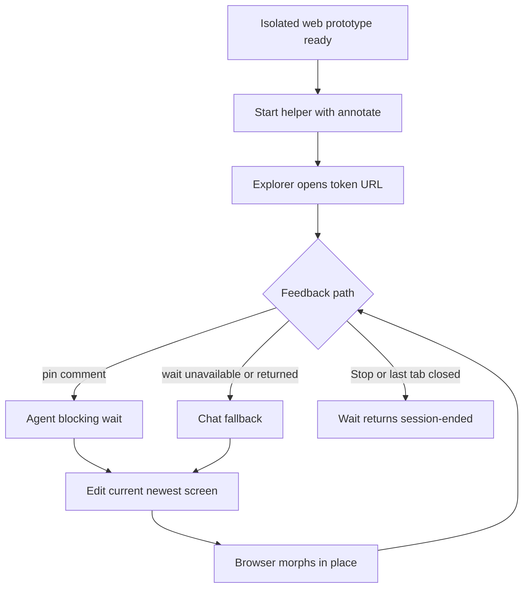
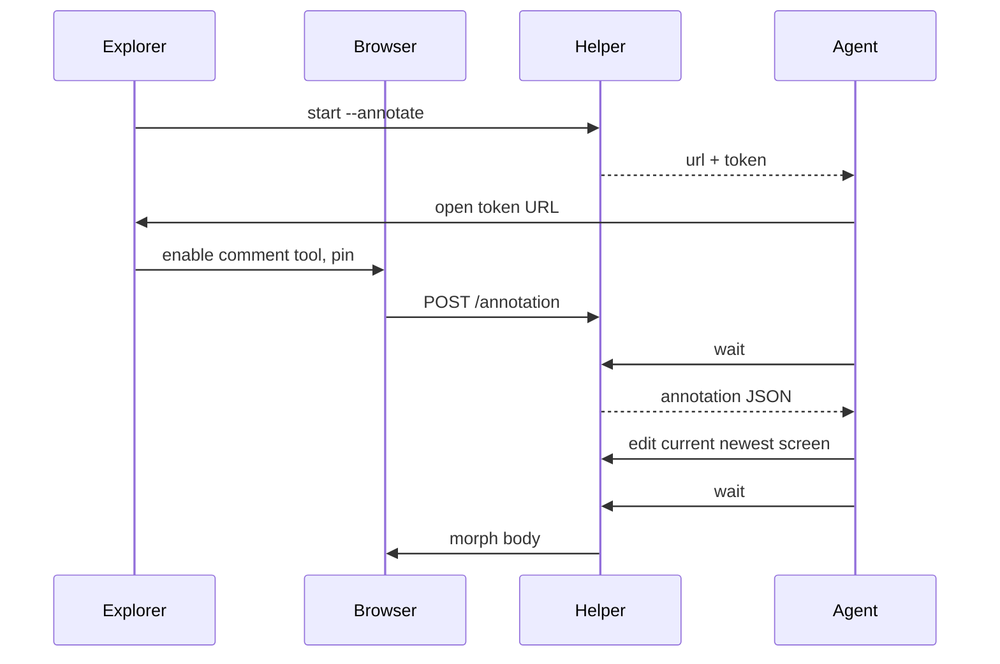
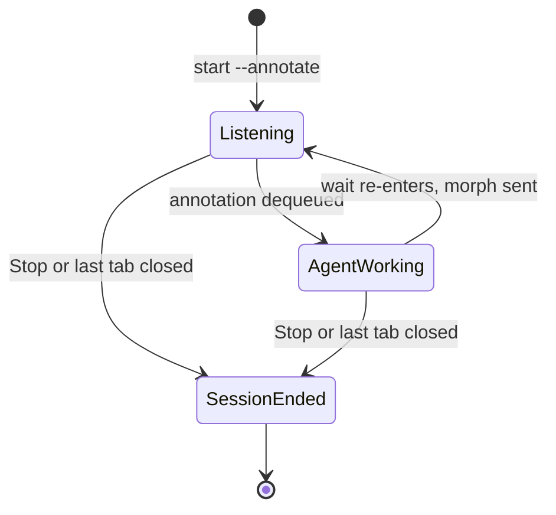
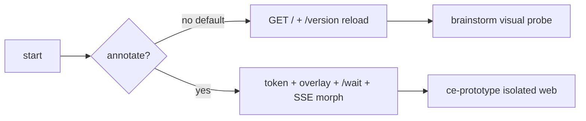

# Prototype Live Annotation - Plan

## Goal Capsule

- **Objective:** Explorers can pin a comment on a live element of an isolated-web `ce-prototype` preview and get the current screen revised in place without retyping the target in chat.
- **Means:** A napkin-inspired wait loop on the existing preview helper: visible comment-tool toggle, blocking `wait`, serve-time overlay, SSE morph.
- **Product authority:** The Product Contract below, bootstrapped from the request to add the live-annotation idea in [pelletencate/napkin](https://github.com/pelletencate/napkin) to CE prototype.
- **Authority hierarchy:** Product behavior is owned by the Requirements. Implementation mechanism is owned by the Key Technical Decisions. A unit overrides neither.
- **Execution profile:** Shared helper plus `ce-prototype` protocol and assets. Mechanical coverage in `bun test`. Annotation-loop judgment is a fresh-agent eval, not a CI matrix.
- **Stop conditions:** Stop if annotation chrome cannot stay off on a default brainstorm visual-probe start, or if the agent wake cannot be one blocking helper command (a prescribed multi-command curl loop is not an acceptable substitute).
- **Tail ownership:** LFG owns branch, commits, PR, and CI watch.
- **Open blockers:** None.

**Product Contract preservation:** new contract from `ce-plan-bootstrap`. No upstream requirements-only plan.

---

## Product Contract

### Summary

`ce-prototype` already serves a local preview and reloads when the newest screen changes. Feedback still has to be typed in chat. This work adds a browser-to-agent event path on isolated web runs so an explorer can pin a comment on a live element and the agent revises that screen in place. Brainstorm visual probes stay display-only. Chat remains a complete fallback.

### Problem Frame

Settling how something should work or feel requires experiencing the artifact, then iterating. Chat transcription loses the element the explorer meant. Napkin shows the missing primitive: a local server, a click overlay, a blocking wait the agent can run, and an in-place page update. CE already has the server and the reload. It does not have the event path. The founding prototype plan deferred that path on purpose. This plan supersedes that deferral for `ce-prototype` only.

### Key Decisions

- KD1. **Prototype-only live annotation.** Chosen over adding click-to-comment to brainstorm visual probes: probes stay cheap, display-only, and chat-authoritative. Governs R5, R6.
- KD2. **Borrow napkin's loop, not its kit.** Chosen over vendoring napkin or copying the hand-drawn Tailwind vocabulary: CE already owns fidelity and craft; the missing piece is the event path. Governs R9, R16.
- KD3. **Chat stays a complete fallback when wait cannot run.** Chosen over making the overlay the only feedback channel, and over claiming chat is concurrent with a blocking wait. Governs R4.
- KD4. **Annotation never ships or writes back.** Chosen over treating a pin as an apply: a comment is a tweak request against the current screen. Governs R8, R12.

### Actors

- A1. Explorer — the person experiencing the prototype and pinning comments or answering in chat.
- A2. `ce-prototype` — grounds, builds, waits for annotations or chat, revises the current screen, updates `decisions.md` when a choice settles.
- A3. Preview helper — serves the current screen, injects overlay only when annotation is on, queues comments, wakes the agent, morphs the page.
- A4. `ce-brainstorm` visual probe — unchanged consumer of the same helper bytes; annotation stays inert.

### Key Flows

- F1. Isolated web run: start annotate-enabled preview, open the token URL, pin a comment, agent wait returns the record, agent edits the current screen, browser morphs. Pins reattach when their selector still matches.
- F2. Chat fallback: wait is unavailable, failed, or has already returned. The explorer types in chat; the agent edits the current screen. An in-flight blocking wait does not read chat. Stop is how the explorer leaves the overlay loop for conversation.
- F3. Session end: explorer clicks the overlay Stop control or the last tab closes; the next wait returns a terminal session-ended status; agent stops the loop and does not invent further revisions.
- F4. Brainstorm visual probe: start without annotate; served HTML has no overlay, EventSource/morph stream, or annotation client; feedback stays in chat.

### Requirements

- R1. An isolated web `ce-prototype` run offers live annotation on the served preview: the explorer can mark an element and leave a comment without retyping the target in chat.
- R2. The skill-running agent can receive that comment as a structured record (comment, selector, text snippet, rect) without a host-specific interrupt.
- R3. After the agent revises the current newest screen, the open preview updates immediately. Pins reattach when their recorded selector still matches. A body-HTML morph resets in-page prototype state (flow position, client-rendered views, control state).
- R4. Chat remains a complete fallback when wait is unavailable, failed, or has already returned. An in-flight blocking wait does not read chat; Stop unblocks the agent for conversation.
- R5. A default `ce-brainstorm` visual-probe start does not inject overlay, EventSource/morph stream, or click-to-comment chrome.
- R6. Throwaway overlays and yielded non-web media stay chat-only. This plan does not add a product-tree event path.
- R7. Unattended, LFG, and `mode:pipeline` runs still refuse to start a preview or invent how the artifact should feel.
- R8. An annotation authorizes edits only inside this question's `screens/` directory. It never authorizes a product-tree commit, write-back, or apply.
- R9. Disk HTML stays the judged artifact. Overlay and morph client are injected at serve time and are not written into `screens/`.
- R10. When annotation is on, every annotation and wait route is gated by a per-run token. Remote `--host 0.0.0.0` with annotation on is still token-gated and still disclosed as serving the run directory.
- R11. `skills/ce-brainstorm/scripts/light-webserver.js` and `skills/ce-prototype/scripts/light-webserver.js` stay byte-identical.
- R12. `decisions.md` still updates only when the agent is confident a choice has settled. A pin is a tweak request until that confidence exists.
- R13. Stop or tab-close ends the wait loop with a terminal session-ended status. The agent does not keep polling after that.
- R14. An annotation POST counts as activity for idle timeout. Wait and `/version` do not.
- R15. Ordinary clicks that drive the prototype still drive it. Annotation uses a visible comment-tool toggle, not page-wide click-capture and not a modifier-click chord.
- R16. The napkin hand-drawn kit, Tailwind CDN vocabulary, `.napkin-session/`, and `docs/human/` export are not part of this product.

### Acceptance Examples

- AE1. Explorer pins "more padding above this heading" on an `h1`. The next wait returns that selector and comment. The agent edits a different region of the current newest screen. The open tab morphs; the pin reattaches because the heading selector still matches.
- AE2. Explorer uses the prototype's own controls with the comment tool off. Those clicks change prototype state and do not enqueue annotations. Covers F1 / R15.
- AE3. Helper start for a brainstorm probe omits annotate. Fetching `/` returns HTML with no EventSource/morph stream, overlay boot, or `/annotation` client. Covers F4 / R5.
- AE4. Wait is unreachable. The explorer types the same request in chat. The agent still revises the current screen. Covers R4.
- AE5. Explorer clicks Stop. The next wait returns session-ended. No further screen edit is invented. Covers F3 / R13.

### Success Criteria

- Isolated web prototype runs can iterate from in-page pins without chat transcription of the target.
- Brainstorm visual probes still look and behave as display-only.
- Helper copies remain byte-identical.
- Unattended runs still refuse.

### Scope Boundaries

**In scope**

- Isolated web `ce-prototype` previews.
- Shared helper annotate mode, wait command, token, morph, overlay assets under `skills/ce-prototype/`.
- Protocol and guide updates that reverse the v1 "feedback stays in chat" / "no event path" lines for prototype only.

**Out of scope**

- Napkin kit, Rough.js, Tailwind CDN component vocabulary, `docs/human/` PNG/HTML export.
- A new standalone skill.
- Live annotation on brainstorm visual probes.
- Live annotation on throwaway product-tree overlays or yielded native media.
- Host-native wake or MCP.
- Treating a pin as Product Contract apply.

### Deferred to Follow-Up Work

- Host-native interrupt so the agent wakes without a blocking wait command.
- Apply-on-overlay with a defined undo of product-tree edits.
- Batching several queued pins into one revision.
- Optional human-review export of a decorated snapshot.

### Sources

- User request naming [pelletencate/napkin](https://github.com/pelletencate/napkin) as the prior-art loop.
- `skills/ce-prototype/references/preview.md`, `skills/ce-prototype/SKILL.md`, `docs/guides/ce-prototype.md`.
- Founding deferral: `docs/plans/2026-08-12-003-feat-ce-prototype-skill-plan.md` U2 ("Do not add a browser-to-agent event bus").
- Byte-identical helper: `tests/compound-support-files.test.ts`.

---

## Planning Contract

### Assumptions

Headless LFG skipped scoping confirmation. These inferred bets are explicit:

- The user wants the napkin *loop* on CE prototype, not napkin's sketch aesthetic or a second skill.
- Brainstorm visual probes stay display-only unless a later product decision says otherwise.
- Overlay and yielded-medium runs stay chat-only in this change.
- One-at-a-time wait is enough; batching is follow-up.

### Key Technical Decisions

- KTD1. **Shared helper, annotate opt-in.** Both `light-webserver.js` copies gain annotate routes and a `wait` command. Default `start` stays event-inert. Prototype starts with annotate on. Chosen over a prototype-only fork (fails R11) and over vendoring napkin (fails isolation and R16). Governs R5, R11.
- KTD2. **Blocking `wait` subcommand is the agent wake.** `node light-webserver.js wait --root <dir>` is a client of the already-running server: it long-polls that server's `/wait` route, then prints JSON and exits. Exit 0 is an annotation, exit 1 is session-ended, exit 2 is error. Chosen over chat-as-wake (not immediate) and over a prescribed curl loop in skill prose (stop condition). Governs R2, R13.
- KTD3. **SSE morph when annotate is on; reload stays the default path.** Annotate mode injects a morph client and broadcasts body HTML over a token-gated Server-Sent Event stream implemented with `node:*` only — no npm `ws` dependency. Non-annotate starts keep `/version` full reload. A body morph resets in-page prototype state. Pins reattach only when the recorded selector still matches. Chosen over reload-only (drops in-browser-only pins), over WebSocket (this helper has no WS server and no `ws` dependency), and over replacing reload for brainstorm. Governs R3, R5.
- KTD4. **Revise the current newest screen in place during the annotation loop.** Do not mint a new numbered `00N-*.html` per pin. `/version` newest-wins and morph both target that file. Chosen over one-file-per-tweak (fights morph and pin identity). Governs R3.
- KTD5. **Per-run token when annotate is on.** Token is created at start with `crypto.randomUUID()`, written into `state/display-info.json`, required as a query or header on wait, annotation POST, session-end, and the SSE morph stream. URL handed to the explorer includes the token. Injected overlay HTML, JS, and CSS never embed the token; the overlay reads it only from that URL. Chosen over leaving the new write path unauthenticated, especially with `--host 0.0.0.0`. Governs R10.
- KTD6. **Serve-time overlay only.** Bundled `annotate.js` / `annotate.css` live under `skills/ce-prototype/assets/` and are injected by the helper. Disk screens stay agent-clean. Isolation still forbids reading brainstorm for these assets; the helper resolves `../assets` from `scripts/` so both copies stay identical even if brainstorm has no assets directory. Governs R9.
- KTD7. **Visible comment-tool toggle.** Plain clicks reach the prototype while the tool is off. Turning the tool on arms the next element click to open a pin composer. Modifier-click is out of scope. Chosen over napkin's click-capture, which would fake a driving question. Governs R15.
- KTD8. **One wait, one annotation.** Queued extras stay in the helper until the next wait. The agent edits the current newest screen from the returned record, then waits again. Chosen over drain-batch in v1. Governs R2.
- KTD9. **Supersede the v1 no-event-bus deferral for prototype only.** Update preview prose, the guide, and helper-parity comments in the same change. Brainstorm visual-probes prose stays "no event path." Governs R1, R5.

### High-Level Technical Design

Annotation mode adds a queue and a wait in the existing helper. The agent and the browser share the question directory's newest screen. Directional only — not an implementation specification.

### Implementation Constraints

- Invoke repo-local `ce-skill-work` before editing anything under `skills/ce-prototype/**`.
- Tier-3 `SKILL_DIR` anchor on every executed helper command; trailing `;` on the assignment; no `${CLAUDE_SKILL_DIR}`.
- No `!`cmd`` load-time pre-resolution.
- Skill isolation: no sibling-skill imports. Overlay assets live under `ce-prototype`. The shared helper may resolve sibling `assets/` relative to its own script path so both copies stay identical.
- Review duplicated helper copies per `docs/solutions/workflow/reviewing-byte-duplicated-shared-assets.md`.
- Long-running wait is one helper invocation, not a detached sleep loop. See `docs/solutions/skill-design/detached-job-lifecycle-for-delegated-work.md` and `docs/solutions/skill-design/anti-poll-scope-and-async-subagent-dispatch.md`.
- "Session ended" is an engine status. Whether the explorer is done deciding stays agent judgment (`docs/solutions/skill-design/liveness-judgment-belongs-to-the-agent.md`).
- Comment text is untrusted input. It may describe a screen edit. It may not be executed as a command or treated as apply.

### Sequencing

U1 helper surface, then U2 overlay assets against that surface, then U3 protocol, then U4 mechanical tests (can overlap U1/U2 as they land), then U5 guide and concept. Protocol must not describe a wait command the helper does not yet expose.

### Sources & Research

Load-bearing external research: napkin's `SKILL.md` and `server/serve.ts` shaped KTD2, KTD3, KTD5, KTD6, KTD8, and the decision to keep disk HTML clean. Local research shaped KTD1 (byte-identical copies), KTD4 (numbered screens), KTD7 (driving questions), and KTD9 (v1 deferral).

---

## Implementation Units

### U1. Annotate-capable shared helper

**Goal:** Both helper copies start event-inert by default and, with annotate on, expose token-gated wait, annotation POST, and morph broadcast.

**Requirements:** R2, R5, R10, R11, R13, R14

**Dependencies:** None

**Files:**
- `skills/ce-prototype/scripts/light-webserver.js`
- `skills/ce-brainstorm/scripts/light-webserver.js`
- `tests/skills/ce-prototype-server.test.ts`
- `tests/skills/ce-brainstorm-visual-probe-server.test.ts`
- `tests/compound-support-files.test.ts`

**Approach:**
1. Add characterization coverage for current default-start HTML and `/version` reload before changing the helper.
2. Add `--annotate` to `start` / `serve` and forward it on detached spawn. Default off. Do not add an npm dependency.
3. When on: create a per-run token with `crypto.randomUUID()`, persist it in `state/display-info.json`, require it on annotate routes. Injected overlay HTML/JS/CSS never embed the token; GET `/` without the token must not include the token string.
4. Add HTTP `GET /wait` on the running server (queue lives there). Add a `wait` CLI that long-polls that route using the token in `display-info.json` and prints one JSON record. Map HTTP 200/410/error onto exits 0/1/2.
5. POST `/annotation` enqueues; it counts as activity. Return 400 without throwing or enqueueing when the body is missing, empty, not JSON, or omits comment or selector. Wait and `/version` do not count as activity.
6. Add token-gated POST `/session/end` that unblocks wait with HTTP 410 and session-ended JSON. Treat zero remaining SSE clients after a short reconnect grace as the same terminal status (last tab closed, not a single refresh).
7. On annotate, inject overlay and an SSE morph client at serve time. On wait re-entry, broadcast morph of the current newest screen when mtime changed.
8. Keep default start HTML free of EventSource/morph stream, overlay boot, and annotation client so brainstorm tests stay green.
9. Update the parity-test comment: the helper now has an opt-in event path; copies still match.

**Patterns to follow:** Existing `containedRealPath`, pidfile, owner-pid, idle timer, and start/status/stop JSON. Napkin wait/queue semantics, not napkin's Bun/TS daemon or WebSocket.

**Test scenarios:**
- Default `start` then GET `/` yields HTML with no EventSource/morph stream, `/annotation` client, or overlay boot. Covers AE3.
- `start --annotate` writes a token into `display-info.json` and includes it in the printed URL.
- GET `/` without the token does not include the token string.
- POST `/annotation` without the token returns 401 and does not enqueue.
- GET `/wait` and the SSE morph stream without the token return 401 and neither dequeue nor attach.
- POST `/annotation` with a missing, empty, or non-JSON body, or without comment or selector, returns 400 and does not enqueue.
- POST `/annotation` with the token then `wait` exits 0 and prints comment, selector, textSnippet, and rect.
- POST `/session/end` with the token then `wait` exits 1 with session-ended JSON. Last-SSE-client close after grace does the same.
- Annotation POST resets idle timeout; `wait` and `/version` do not.
- Both helper files remain byte-identical.

**Verification:** Annotate-off brainstorm path stays clean. Annotate-on wait round-trip works. Copies match.

---

### U2. Serve-time annotation overlay

**Goal:** The explorer can pin a comment without stealing ordinary prototype clicks, and pins survive the morph.

**Requirements:** R1, R3, R9, R15

**Dependencies:** U1

**Files:**
- `skills/ce-prototype/assets/annotate.js`
- `skills/ce-prototype/assets/annotate.css`
- `skills/ce-prototype/scripts/light-webserver.js`
- `skills/ce-brainstorm/scripts/light-webserver.js`
- `tests/skills/ce-prototype-server.test.ts`

**Approach:**
1. Ship overlay assets only under `skills/ce-prototype/assets/`. The helper resolves `../assets` from `scripts/` so the brainstorm copy of the script stays identical even if brainstorm has no assets directory. New static routes use `containedRealPath` against the assets directory, not the skill root.
2. Inject those assets only when annotate is on. Never write them into `screens/`. Never embed the token in injected files.
3. Visible comment-tool toggle (KTD7). Plain clicks reach the prototype while the tool is off. Turning the tool on arms the next element click to open an inline pin composer (text field + submit). Submit is disabled while the comment is empty, shows in-flight until POST `/annotation` returns, and on failure keeps the text and a retry. Success leaves a pin marker.
4. Overlay Stop is available whenever annotate is on, remains clickable during AgentWorking, and POSTs `/session/end`. After click it shows an ended state. Covers AE5.
5. A submitted pin shows received/working until the next morph. Additional queued pins show as pending (KTD8).
6. Morph replaces body content and reattaches pins by selector. A pin whose selector no longer matches stays visible in a detached target-gone state.

**Patterns to follow:** Napkin Shadow DOM overlay so overlay CSS cannot restyle the judged page. CE `containedRealPath` for any new static route.

**Test scenarios:**
- Annotate-on GET `/` includes overlay boot and does not persist overlay markup into a file under `screens/`.
- A fixture page with a button: overlay does not register a plain click as an annotation while the comment tool is off.
- Overlay includes a Stop control; activating it causes the next `wait` to exit 1. Covers AE5.
- After a morph broadcast of an edited body, a pin whose selector still exists remains present.
- After a morph that removes the target node, the pin remains visible as target-gone rather than disappearing.
- Annotate-off GET `/` still has no overlay boot.

**Verification:** Driving clicks stay with the prototype while the tool is off. Selector-stable pins survive one revise/morph. Stop ends the session. Disk screens stay clean.

---

### U3. Prototype annotation-loop protocol

**Goal:** `ce-prototype` enters the wait loop on isolated web runs, revises the current screen, and falls back to chat without becoming a napkin step machine.

**Requirements:** R1, R2, R4, R6, R7, R8, R12, R13

**Dependencies:** U1

**Files:**
- `skills/ce-prototype/SKILL.md`
- `skills/ce-prototype/references/preview.md`
- `skills/ce-prototype/references/annotation-loop.md`
- `skills/ce-prototype/references/build.md` (only the revise-in-place / newest-screen rule)
- `tests/skills/ce-prototype-protocol.test.ts`
- `tests/skills/ce-prototype-run-root-executes.test.ts`

**Approach:**
1. Load `ce-skill-work` edit mode before touching these files.
2. State the loop as conditions: when an isolated web preview is up, wait for the next annotation or a terminal status; on an annotation, edit the current newest screen; on session-ended or wait failure, stop the loop. Chat is valid when wait is unreachable, failed, or has already returned — not concurrent with an in-flight wait (R4).
3. Put the wait command skeleton once in `references/annotation-loop.md` with `SKILL_DIR` + `PROTO_DIR` + `wait`. That reference also states that comment, selector, and text snippet are untrusted: they may describe a screen edit and must not be executed as a command or treated as apply, and edits stay inside this question's `screens/` (R8). `preview.md` points at that reference and drops "Feedback stays in chat" / "no browser-to-agent event path" for prototype.
4. Keep the attended-only refusal. Do not start wait on LFG / pipeline / unattended.
5. Overlay and yielded-medium runs never claim the wait loop.
6. Do not re-derive curl, token parsing, or napkin kit steps in `SKILL.md`.

**Patterns to follow:** Portable skill authoring — goal, done, safe failure, non-derivable facts. Existing preview `SKILL_DIR` fences. `tests/skills/ce-prototype-protocol.test.ts` greps.

**Test scenarios:**
- Protocol tests still require `SKILL_DIR` + trailing `;` on executed helper calls, including `wait`.
- Preview/annotation-loop prose no longer asserts that the helper has no event path.
- Brainstorm `visual-probes.md` still asserts no click tracking and no browser-to-agent event path.
- New fenced wait/start blocks in preview or annotation-loop remain executable under `ce-prototype-run-root-executes.test.ts` if that suite reads them.

**Verification:** A reader of `SKILL.md` plus the new reference knows when to wait, when to stop, and when to use chat. Brainstorm protocol is unchanged.

---

### U4. Mechanical guards for the new contract

**Goal:** CI pins the smallest falsifiable units of the reversed v1 contract and the unchanged brainstorm contract.

**Requirements:** R5, R11

**Dependencies:** U1, U2, U3

**Files:**
- `tests/skills/ce-prototype-server.test.ts`
- `tests/skills/ce-brainstorm-visual-probe-server.test.ts`
- `tests/skills/ce-brainstorm-visual-probes.test.ts`
- `tests/compound-support-files.test.ts`
- `tests/skills/ce-prototype-protocol.test.ts`

**Approach:**
1. Prefer widening existing server and protocol tests over new suites.
2. Pin tokens, exit codes, default-off injection, and byte identity — not whole skill bodies.
3. Keep brainstorm display-only greps (EventSource/morph stream, `events`, click/event ingestion) on the default start path. Extend those tests after U1–U3 land.

**Test scenarios:**
- Brainstorm visual-probe server test still fails if default-start HTML contains an EventSource/morph stream or an events client.
- Compound support files still fail if the two helpers differ.
- Prototype protocol test fails if annotation-loop executed shell omits the `SKILL_DIR` anchor.

**Verification:** Targeted `bun test` files listed above pass. Full `bun run test` is the merge gate.

---

### U5. Guide and concept

**Goal:** The user-facing prototype guide and `CONCEPTS.md` name live annotation without implying brainstorm probes have it.

**Requirements:** R1, R4, R5, R16

**Dependencies:** U3

**Files:**
- `docs/guides/ce-prototype.md`
- `docs/guides/README.md` (only if the catalog sentence must mention live annotation)
- `CONCEPTS.md`
- `README.md` (only if the grouped overview sentence for `ce-prototype` must change)

**Approach:**
1. Update "While you try the prototype" so pins and chat are both valid, and the agent revises in place.
2. Keep the FAQ distinction: visual probes remain display-only with chat feedback.
3. Add a `CONCEPTS.md` entry for live annotation as a named process on an experience prototype.
4. Do not bump skill counts. This is not a new skill.

**Test scenarios:**
- `Test expectation: none --` catalog and concept prose; `tests/release-metadata.test.ts` stays green if `README.md` skill-name inventory is untouched.

**Verification:** Guide and concept match the protocol. Release metadata still matches the skill inventory.

---

## Verification Contract

- Targeted: `bun test tests/skills/ce-prototype-server.test.ts tests/skills/ce-brainstorm-visual-probe-server.test.ts tests/compound-support-files.test.ts tests/skills/ce-prototype-protocol.test.ts tests/skills/ce-brainstorm-visual-probes.test.ts`
- Merge gate: `bun run test` (same suite as CI).
- `bun run release:validate` if skill inventory or marketplace counts change (not expected).
- Behavioral: a fresh-agent cell that starts an isolated web prototype, receives one pin via `wait`, edits the current screen, and does not claim wait on an unattended run. Not a CI job.

---

## Definition of Done

- Isolated web `ce-prototype` runs can pin, wait, revise, and morph per AE1–AE5.
- Default brainstorm visual-probe HTML stays event-inert.
- Helper copies are byte-identical.
- V1 "no event path" / "feedback stays in chat" lines are gone from prototype surfaces and remain on brainstorm probes.
- Overlay and yielded-medium runs still use chat.
- Unattended runs still refuse.
- Abandoned experimental helper or overlay code is not left in the diff.
- Mechanical tests above pass.

---

## System-Wide Impact

Explorers using `ce-prototype` gain in-page iteration. Brainstorm stays chat-authoritative. Any later change to the shared helper still lands in both skills. `--host 0.0.0.0` plus annotate is a reachable write path into the agent loop; the token and disclosure are the control, not a later hardening pass.

---

## Risks & Dependencies

| Risk | Mitigation |
|---|---|
| Annotate injection leaks into brainstorm | Default off; existing negative HTML tests stay on the default path |
| Body morph resets driven prototype state | Named in R3 and KTD3; not claimed as flow continuity |
| Byte-identical copies drift | Edit one file, copy, assert in `tests/compound-support-files.test.ts` |
| Reload drops pins | Morph on annotate path (KTD3) |
| Overlay steals driving clicks | Non-stealing trigger (KTD7) |
| Prompt injection via comment text | R8: screens-only edits; never apply |
| Codex `--foreground` occupies a terminal | `wait` is a separate later invocation, not a second server |
| Reviewers cite the founding no-event-bus plan | KTD9 + guide/protocol reversal in the same change |

---

## Documentation / Operational Notes

- User-facing loop description lives in `docs/guides/ce-prototype.md`.
- Protocol lives in `skills/ce-prototype/references/preview.md` and `references/annotation-loop.md`.
- Founding plan `docs/plans/2026-08-12-003-feat-ce-prototype-skill-plan.md` is historical; this plan is the supersession record.
