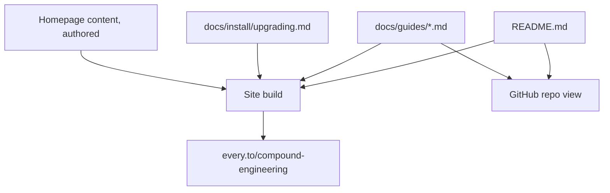
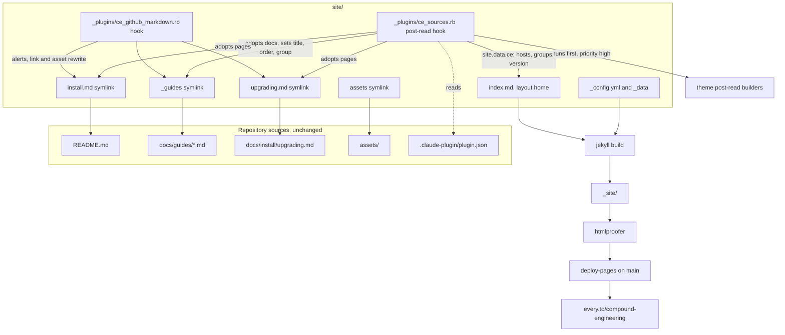

# Compound Engineering Docs Site - Plan

## Goal Capsule

- **Objective:** A developer evaluating or using Compound Engineering can read the install instructions, the skill catalog, and every skill guide on a fast, searchable website at `every.to/compound-engineering`, and what they read there is never behind what the repo says.
- **Means:** A Jekyll site under `site/` using the `jekyll-vitepress-theme` gem, adopting the repo's existing markdown through symlinks and a site-local plugin, deployed to GitHub Pages by a workflow on every merge to `main` (KTD1, KTD2, KTD5).
- **Product authority:** This plan owns the public docs site only. The plugin, the CLI, and the contributor docs are context, not scope. Product behavior is owned by the R-IDs below; implementation mechanism by the KTDs.
- **Execution profile:** Standard depth, six units, one PR. Config and packaging work; prefer build and rendered-output smoke checks over unit coverage except for the two Ruby plugin files, which get unit tests.
- **Stop conditions:** Stop and report if the theme cannot render a frontmatter-less collection document even after the adoption plugin (KTD2), if GitHub Pages refuses the workflow deployment, or if any change would require editing README.md or a guide page to make the site build (R5).
- **Tail ownership:** The implementer ships the PR. Two actions stay with a maintainer after merge: the Namecheap DNS records and switching the repository's Pages source to the workflow (see Dependencies).

---

## Product Contract

**Product Contract preservation:** restructured, no scope change. Outstanding Questions that were `Deferred to Planning` are resolved in place by KTD1 through KTD7 and removed; the alert-syntax and GIF assumptions under Dependencies are now owned by KTD3 and KTD6. No R, F, or AE changed meaning.

### Summary

Ship a public documentation site at `every.to/compound-engineering` with the look of rubyllm.com: a hero homepage with the install snippet, the core-loop demo, the supported hosts, and a skill grid, plus docs pages rendered from the README, the skill guides, configuration, packs, and upgrading pages exactly where they live in the repo today. The site builds and deploys automatically on every merge to `main` as a single, unversioned site.

### Problem Frame

The plugin's documentation is good but lives only as GitHub-rendered markdown: a long README, a 36-page guides folder, and an install page two directories deep. A developer landing from the every.to article or a marketplace listing gets a repository, not a product page, with no search, no sidebar, and no way to skim the 33 skills. GitHub Pages is already switched on for the repo and serves a 404, which is worse than nothing. The every.to guide already lives on that domain, and its edge proxy can reserve a path for the site.

### Key Decisions

- **End-user docs only at launch: install, catalog, guides, configuration, packs, upgrading.** Contributor docs, solutions, and host specs stay on GitHub. (session-settled: user-approved — chosen over publishing everything under docs/: solutions are written for agents and would double the maintenance surface.) Governs R1, R2.
- **The site is a build layer over the existing files; nothing is copied or moved.** (session-settled: user-approved — chosen over moving the guides into a site folder or syncing a generated copy: the README and guides are already the single home for skill descriptions and tests pin them there.) Governs R3, R4, R5.
- **Served at `every.to/compound-engineering` through every.to's edge proxy, built on GitHub Pages.** (session-settled: user-directed — chosen over the custom domain compound.engineer after the site was built: every.to's proxy reserves the path prefix, and the guide already lives on every.to.) Governs R10, R11.
- **Theme used as-is with brand tokens; homepage authored in rubyllm's funnel shape.** (session-settled: user-approved — chosen over a custom design layer: upgrades stay cheap and the theme already delivers the look.) Governs R6, R7, R8.
- **Single unversioned site tracking `main`.** (session-settled: user-approved — chosen over a stable/next switcher: the plugin releases continuously from main with no long-lived version branches.) Governs R9.
- **No analytics or telemetry on the site.** Consistent with the strategy's no-telemetry boundary; the theme's GitHub star counter is the only outside call. Governs R13.

### Requirements

**Content and source of truth**

- R1. The site publishes the README, every page under `docs/guides/`, and the upgrading page.
- R2. The site does not publish `docs/solutions`, `docs/specs`, `docs/plans`, `CONTRIBUTING.md`, or `docs/development.md`.
- R3. Every published page is rendered from the file at its current repo path; no second copy of any prose exists in the repo.
- R4. Links between published pages, and links to images under `assets/`, resolve on the site; links to unpublished repo files resolve to their GitHub URL.
- R5. Existing tests that pin README structure and skill counts pass unchanged, and no published source file needs a rewrite for the site to build.

**Homepage**

- R6. The homepage carries, in order: a hero with the tagline and the Claude Code install snippet, the core-loop demo, the list of supported hosts as stated in the README, a grid of all skills grouped as the guides catalog groups them, and a link to the every.to article.
- R7. The install section of the README is the site's Install page, so per-host instructions are written once.

**Docs pages**

- R8. Docs pages use the theme's sidebar, search, light and dark mode, edit-on-GitHub link, and last-updated stamp, styled with the Compound Engineering logo and a black-on-white palette.
- R9. The site shows the current plugin version from the plugin manifest and offers no version switcher.

**Build, deploy, and domain**

- R10. Every merge to `main` rebuilds and deploys the site; a pull request that breaks the site build fails CI before merge.
- R11. The site is served at `https://every.to/compound-engineering/`, with every link, asset, sitemap entry, and llms.txt entry carrying that prefix; the GitHub Pages build is the origin behind every.to's proxy.
- R12. A maintainer adds a skill guide by adding the markdown file; the site picks it up without a site-specific registration step.
- R13. The site loads no analytics, tracking, or third-party script beyond what the theme ships for search and the GitHub star count.

### Key Flows

- F1. Reader finds a skill
  - **Trigger:** A developer lands on the homepage from a link.
  - **Steps:** Scans the skill grid, opens a guide, uses the sidebar or search to move between guides, follows the Install link to the README-backed install page.
  - **Outcome:** They install the plugin without leaving the site.
  - **Covered by:** R1, R6, R7, R8
- F2. Maintainer changes docs
  - **Trigger:** A pull request edits a guide, the README, or adds a new skill with its guide page.
  - **Steps:** CI builds the site as part of the PR checks; on merge to `main` the deploy runs; the change is live within minutes.
  - **Outcome:** The site and the repo say the same thing with no manual publish step.
  - **Covered by:** R3, R5, R10, R12

### Acceptance Examples

- AE1. **Covers R4.** Given the README links to `docs/guides/ce-plan.md`, when that link is rendered on the site, then it opens the site's ce-plan guide page, not a GitHub URL.
- AE2. **Covers R4.** Given the README links to `docs/specs/omp.md`, which is unpublished, when rendered on the site, then it opens that file on GitHub.
- AE3. **Covers R5.** Given the release-metadata test slices the README between its "Skills at a glance" heading and its "Learn more" marker, when the site is added, then that test still passes and the README diff for the site change is empty.
- AE4. **Covers R7, R8.** Given the README uses GitHub alert syntax and raw HTML for the logo block, when rendered on the site, then the alert appears as a callout and the logo appears, with no raw markup visible.
- AE5. **Covers R10.** Given a PR introduces a guide with a broken relative link, when CI runs, then the site build step fails and the PR cannot merge.
- AE6. **Covers R12.** Given a new `skills/ce-example/` skill and `docs/guides/ce-example.md` are added, when merged, then the guide appears in the sidebar and the homepage grid with no site config change.

### Success Criteria

- A first-time visitor can go from the homepage to a completed install in one path without visiting GitHub.
- The site's look is recognisably the rubyllm.com family: sidebar, search, dark mode, callouts, code blocks, with Compound Engineering branding.
- A local build reproduces the deployed site with one command documented for contributors.

### Scope Boundaries

- Deferred for later: publishing `docs/solutions` as a browsable learnings section; a blog or changelog page; per-host install pages beyond what the README already carries; social preview images.
- Outside this work: versioned docs; a custom design system beyond theme tokens; any analytics; changes to the README's structure or the guides' prose to suit the site.

### Deferred to Follow-Up Work

- Adding a "Documentation" link to `every.to/compound-engineering` in the root README and in the guides catalog, once the proxy is live. Kept out of this PR so the README diff stays empty (AE3).
- A heading-sliced Install page that renders only the README's install sections, if the full README reads poorly as the Install page (KTD4 renders it whole).
- A lighter hero asset than the 1.1 MB core-loop GIF (KTD6 lazy-loads it).
- Excluding `site/` from plugin installs, if the install copiers or install size make that worthwhile.

### Dependencies / Assumptions

- every.to's edge proxy must forward `/compound-engineering/*` to the GitHub Pages origin, mapping the prefix to `/compound-engineering-plugin/`; the site is built with `baseurl: /compound-engineering` so no response rewriting is needed. Prerequisite outside this repo; the runbook lives in U6.
- The repository's GitHub Pages source is the legacy `main:/docs` branch build; a maintainer must switch it to "GitHub Actions" with no custom domain. Prerequisite, not a repo task; the workflow in U5 deploys nothing until this is done.
- Making the site build a merge blocker (R10) needs the new workflow's build job added to the `main` branch protection's required checks alongside `test`. Maintainer setting; the runbook in U6 names it.
- Assumption: the theme's `edit_link`, `last_updated`, and `github_star` features work on documents adopted by the U2 plugin exactly as on native documents; the adopted documents carry the same `relative_path` and data keys.

### Sources / Research

- rubyllm.com/next footer credits Jekyll with the VitePress theme; its `docs/_config.yml` uses `jekyll-vitepress-theme` with `jekyll-og-image` and `jekyll-redirect-from`, four content collections, brand colours, and Inter plus IBM Plex Mono. Its `docs/index.md` uses `layout: home` with `hero.logo`, `hero.text`, `hero.tagline`, `hero.actions`, and Liquid-driven sections in the body.
- `jekyll-vitepress-theme` 1.9.1 on RubyGems by Carmine Paolino, MIT, source github.com/crmne/jekyll-vitepress-theme. Docs at jekyll-vitepress.dev: getting-started (theme plus plugin entry, collections with `output: true` and `permalink: "/:name/"`, `_data/navigation.yml`, `_data/sidebar.yml`), configuration-reference (`jekyll_vitepress.branding`, `typography`, `tokens.light/dark`, `syntax`, `seo`, `llms`, `edit_link`, `last_updated`, `github_star`, `footer`, theme hooks `_includes/jekyll_vitepress/head_end.html` and `layout_end.html`), vitepress-parity (eight containers: info, note, tip, important, warning, danger, caution, details; Rouge highlighting; `_data/versions.yml`).
- Jekyll treats a collection file without YAML front matter as a static file, not a document; `jekyll-optional-front-matter` fixes this for pages only, which is why U2 adopts documents itself.
- GitHub Pages for this repo is enabled with a legacy build from `main:/docs` and serves 404 at everyinc.github.io/compound-engineering-plugin.
- `tests/release-metadata.test.ts` pins the README's skills section and three skill counts; `docs/guides/README.md` is the only home for skill descriptions and groups skills under H2 headings with one table row per skill.
- The repo already ships symlinks (`CLAUDE.md -> AGENTS.md`, `.claude/skills -> .agents/skills`), so symlinked source paths are an accepted pattern here, including on the Windows CI job that checks the tree out without following them.
- `STRATEGY.md` Boundaries: no telemetry, open source, curated hosts.
- Grounding dossier from this brainstorm: quotes with file and line pointers for the README links, guides links, tests, and CI constraints.

---

## Planning Contract

### Key Technical Decisions

- KTD1. **Jekyll source lives in `site/`, with the published sources reached by symlinks, not by pointing Jekyll at the repo root.** (session-settled: user-approved — chosen over a root-level `_config.yml` with a long exclude list: the theme needs an underscore collection directory for the sidebar, and a root source would have to exclude every other markdown tree in the repo.) `site/_guides -> ../docs/guides`, `site/assets -> ../assets`, `site/install.md -> ../README.md`, `site/upgrading.md -> ../docs/install/upgrading.md`. Governs R1, R2, R3.
- KTD2. **A site-local `:site, :post_read` hook adopts frontmatter-less sources as Jekyll documents and pages ahead of the theme's post-read builders.** Jekyll reads a collection file with no YAML front matter as a static file, so the plugin promotes every `_guides/*.md` file to a document and `install.md` / `upgrading.md` to pages, then fills `title` (from the first H1, backticks stripped), `permalink`, `layout`, `nav_order`, `parent`, and `last_updated_at` from the guides catalog and git. It must be a post-read hook, not a generator: the theme builds its sidebar tree, search index, sitemap, and `llms.txt` in its own `:site, :post_read` hook, and every generator runs after that phase, so documents added by a generator would never reach the sidebar or search. The plugin's hook registers with `priority: :high` so it runs before the theme's hook regardless of load order; re-invoking the theme's builders afterwards is not an option, because its sitemap and `llms.txt` builders return early when their output page already exists. This is the mechanism that keeps R5 true. Governs R3, R5, R12.
- KTD3. **A pre-render hook translates GitHub-flavoured markdown and repo-relative links into site terms.** Converts `> [!NOTE]`-style alerts into the theme's documented kramdown callout: drop the `[!TYPE]` line and append `{: .type }` to the blockquote, which the theme styles as a titled callout; adds `markdown="1"` to block-level HTML wrappers such as the README's centred `
` so kramdown renders the markdown inside them instead of printing it raw; rewrites `docs/guides/<name>.md` to `/guides/<name>/`, `docs/guides/README.md` to `/guides/`, `docs/install/upgrading.md` to `/upgrading/`, `README.md` (any `../` depth) to `/install/`, `./<name>.md` inside guides to `/guides/<name>/`, and `assets/...` to `/assets/...`; any other relative repo path becomes `https://github.com/EveryInc/compound-engineering-plugin/blob/main/<path>`. Chosen over `jekyll-relative-links`, which cannot see through the symlinked paths and does not handle assets or unpublished files. Governs R4, AE1, AE2, AE4.
- KTD4. **The README renders whole as the Install page at `/install/`.** Its first section is Install and the rest is useful overview; a heading-sliced page is deferred follow-up. Governs R7.
- KTD5. **One `pages.yml` workflow builds on pull requests and on pushes to `main`, and deploys only on `main` pushes, using `ruby/setup-ruby` with bundler cache, `bundle exec jekyll build`, `htmlproofer` for internal links, then `actions/upload-pages-artifact` and `actions/deploy-pages`.** Chosen over adding a job to `ci.yml`: Pages deployment needs `pages: write` and `id-token: write` permissions and a concurrency group that the test workflow should not carry, and the legacy Pages builder cannot run site-local plugins. Governs R10, R11, AE5.
- KTD6. **Homepage is an authored `site/index.md` with `layout: home`; its host list, skill grid, and version badge are Liquid over data the U2 plugin exposes at build time (`site.data.ce`), not hand-maintained lists.** Hosts come from the README's install H3 headings, skill groups from the catalog's H2 headings, version from `.claude-plugin/plugin.json`. The core-loop GIF is embedded below the fold with lazy loading. Governs R6, R9, AE6.
- KTD7. **No Google Fonts, no analytics, star counter on.** `typography.google_fonts_url: false` with a system font stack keeps every request first-party except the theme's GitHub star fetch; `seo`, `llms.txt`, sitemap, and `copy_page` stay on because they are static outputs. Governs R13.
- KTD8. **Edit link and last-updated come from the real source path and git, not the site-tree path and file mtime.** The theme's edit link substitutes `page.path`, which for an adopted guide is `_guides/<name>.md`, and its last-updated reads file mtime, which on a CI checkout is the checkout time. So the theme's `edit_link` is disabled and a `doc_footer_end.html` hook include renders the edit link from the `ce_source_path` the plugin sets; the plugin sets `last_updated_at` from `git log -1` on the real path, falling back to mtime when git is unavailable, and the workflow checks out full history. Governs R8.

### High-Level Technical Design

Build-time sequence: Jekyll reads the site and fires `:site, :post_read`; the plugin's high-priority hook promotes static markdown into documents and pages and publishes `site.data.ce` and `site.data.versions` before the theme's own post-read hook builds the sidebar, search index, sitemap, and llms files from them (KTD2); at render time the pre-render hook rewrites each adopted source's markdown just before Liquid and kramdown run (KTD3), and the theme renders. Nothing writes back to the repo.

### Assumptions

- The theme's sidebar builder reads `title`, `nav_order`, `parent`, `grand_parent`, and `collapsed` from `doc.data`, so plugin-set values behave like front matter, and it resolves `parent` by sibling-document title, which is why U2 inserts one synthetic document per catalog group. `has_children` is computed by the theme.
- The site is never built with Jekyll's `--safe` flag: safe mode filters symlinked entries and disables `_plugins/`, and both are load-bearing here.
- `htmlproofer` with external checks disabled is enough to prove R4 on every PR; external link rot is out of scope.
- The Windows CI job never runs Jekyll, so the symlinks under `site/` only need to resolve on Linux runners and Unix dev machines.
- The plugin root is the repo, so `site/` ships inside plugin installs the same way `docs/`, `tests/`, and `src/` already do; the four symlinks point inside the repo and the existing `CLAUDE.md` and `.claude/skills` symlinks show the install copiers tolerate that. Excluding `site/` from installs is follow-up work if install size becomes a concern.

### Sequencing

U1 first, then U2 and U3 in parallel (both are plugin files against the U1 scaffold), then U4 (needs `site.data.ce` from U2 and rewritten sources from U3), then U5, then U6. One PR.

---

## Implementation Units

### U1. Site scaffold and theme configuration

- **Goal:** A `site/` directory that builds with the theme and renders at least the authored homepage shell and the adopted sources once U2 lands.
- **Requirements:** R1, R2, R8, R9, R13; KTD1, KTD7.
- **Dependencies:** None.
- **Files:** `site/Gemfile`, `site/_config.yml`, `site/_data/navigation.yml`, `site/_data/sidebar.yml`, `site/_data/social_links.yml`, `site/CNAME`, `site/.gitignore`, symlinks `site/_guides`, `site/assets`, `site/install.md`, `site/upgrading.md`, `.gitignore` (root additions), `package.json` (`site:build`, `site:serve` scripts).
- **Approach:**
  1. Gemfile pins `jekyll` 4.x, `jekyll-vitepress-theme` at the current 1.9 line, `webrick`, and `html-proofer`.
  2. `_config.yml`: `theme` and `plugins` entries for the theme; `url: https://every.to` and `baseurl: /compound-engineering`; `collections.guides` with `output: true` and `permalink: "/guides/:name/"`; `defaults` giving every page and guide `layout: default`; `jekyll_vitepress.branding` with the logo from `/assets/logo.png` and site title "Compound Engineering"; `tokens.light` / `tokens.dark` for a black-on-white brand; `syntax` themes; `edit_link.enabled: false` (U2 renders its own per KTD8); `last_updated` and `github_star` on; `google_fonts_url: false`; `exclude` for `Gemfile*`, `vendor`, `README.md`, `test`, `Rakefile`.
  3. `_data/navigation.yml`: Guides, Install, GitHub. `_data/sidebar.yml`: one group for the `guides` collection. `_data/social_links.yml`: GitHub.
  4. No `CNAME` (the site has no custom domain). `site/.gitignore` for `_site`, `.jekyll-cache`, `vendor`; mirror those under `site/` in the root `.gitignore`.
  5. `package.json` scripts wrap `bundle exec jekyll build` and `serve` from `site/` so contributors use one command.
- **Execution note:** Packaging and config; prove it with a local `bundle exec jekyll build` that succeeds and a served homepage that shows the theme shell, before writing tests.
- **Patterns to follow:** the theme's getting-started config shape; rubyllm's `docs/_config.yml` for brand tokens and feature toggles; existing repo symlinks (`CLAUDE.md`, `.claude/skills`).
- **Test scenarios:** Test expectation: none for the config itself -- verified by the build in the Verification Contract. U5 adds a bun test that pins the symlink targets, the CNAME content, and the absence of analytics keys.
- **Verification:** `bundle exec jekyll build` in `site/` exits 0 and `_site/index.html` exists; `_site/` contains no `README.md` or `Gemfile`; symlinks resolve from a fresh clone on Linux.

### U2. Source-adoption post-read plugin

- **Goal:** The README, upgrading page, and every guide render as first-class Jekyll pages and documents without any front matter added to the sources, with titles, order, grouping, edit links, and last-updated dates derived from the catalog, the real source path, and git.
- **Requirements:** R3, R5, R8, R9, R12; KTD2, KTD6 (data half), KTD8; AE3, AE6.
- **Dependencies:** U1.
- **Files:** `site/_plugins/ce_sources.rb`, `site/_includes/jekyll_vitepress/doc_footer_end.html`, `site/test/test_ce_sources.rb`, `site/test/fixtures/` (a minimal catalog, README, guide set, and `plugin.json`), `site/Rakefile`.
- **Approach:**
  1. Register a `:site, :post_read` hook at `priority: :high`. For the `guides` collection, take every static file ending in `.md`, construct a `Jekyll::Document` for its path with the collection, call `read`, and move it from the collection's static files to its documents; also remove it from `site.static_files`, where Jekyll registers collection static files too, so no raw `.md` is copied into the output. For `install.md` and `upgrading.md`, build `Jekyll::Page` objects from the static files with permalinks `/install/` and `/upgrading/`, titles "Install" and "Upgrading", and append them to `site.pages`.
  2. Derive each guide's `title` from its first H1 with backticks removed; the catalog file gets title "Skill catalog" and permalink `/guides/`.
  3. Parse `docs/guides/README.md`: each H2 heading is a group; each table row in that section, in order, gives a guide's `nav_order`, its group, and its one-line description from the row's description cell. The theme resolves a document's `parent` only to a sibling document whose `title` matches, so the plugin inserts one synthetic document per group into the `guides` collection (title = the group heading, `nav_order` = group position, permalink `/guides/<group-slug>/`, content = that catalog section's intro and table) and sets each guide's `parent` to that title. The catalog page stays the collection's top entry.
  4. On every adopted document and page, set `ce_source_path` (the real repo-relative path, resolved through the symlink: `docs/guides/<name>.md`, `README.md`, `docs/install/upgrading.md`) and `last_updated_at` from `git log -1 --format=%cI` on that path, falling back to the file's mtime when git is unavailable or the path is untracked.
  5. Publish `site.data["ce"]`: `groups` (name, group page URL, and ordered guides each with title, one-line description, and URL), `hosts` (README H3 headings under `## Install` and `## More Install Options`, de-duplicated in order), and `version` from `.claude-plugin/plugin.json`; set `site.data["versions"]` to `{ current: "v<version>", items: [releases link] }`; the theme renders the version only as its version control and only when `items` is non-empty, so the releases link is the control's sole entry and no other version is listed (R9).
  6. Register the hook with `priority: :high` so adoption precedes the theme's post-read builders (KTD2); the integration test below proves the ordering rather than trusting it.
  7. `doc_footer_end.html` renders "Edit this page on GitHub" from `page.ce_source_path` when present; the theme's own `edit_link` stays disabled in `_config.yml` (KTD8).
  8. A guide present in the collection but absent from the catalog still renders, at the end of the sidebar, so a missing catalog row is a test failure in the existing suite rather than a hidden page.
- **Execution note:** Implement the parser and the promotion test-first against fixtures; the hook wiring and ordering are smoke-checked by the build, where the sidebar and `search.json` must list every guide.
- **Patterns to follow:** `jekyll-optional-front-matter`'s `page_from_static_file` for page promotion; Jekyll's `Collection#read_document` for constructing a document from a path; the theme's `lib/jekyll/vitepress_theme/hooks.rb` for the builder entry points and the data keys its sidebar reads.
- **Test scenarios:**
  - Happy path: a fixture collection of three frontmatter-less guides yields three documents with titles taken from their H1, backticks stripped.
  - Happy path: a fixture catalog with two H2 groups yields two synthetic group documents with the group titles and section content, orders guides by row order, sets each guide's `parent` to its group title and its `description` from the row, and assigns `nav_order` 1-based across the whole collection so the theme's sort is stable.
  - Happy path: `site.data.ce.hosts` from a fixture README equals the ordered, de-duplicated H3 headings under its two install sections.
  - Happy path: `site.data.ce.version` and `site.data.versions.current` derive from the `version` field of a fixture `plugin.json`.
  - Happy path: `ce_source_path` for a guide adopted through a symlinked collection is the real repo-relative path, not the `_guides/` path; for the install page it is `README.md` and for the upgrading page `docs/install/upgrading.md`.
  - Happy path: in a fixture git repo with one commit touching a guide, `last_updated_at` equals that commit's date; with git absent it equals the file mtime.
  - Edge case: a guide that is not in the catalog gets a `nav_order` after every catalogued guide and no `parent`.
  - Edge case: a guide whose first heading is not an H1 falls back to its filename as title.
  - Edge case: a fixture guide that already has front matter is left untouched (Jekyll reads it natively; the plugin does not double-adopt it).
  - Integration: after a fixture site build, the theme's generated sidebar data, `search.json`, `sitemap.xml`, and `llms.txt` list every adopted guide exactly once, and no raw `.md` file appears under the output's guides directory.
  - Integration: Covers AE6. Adding a fourth fixture guide plus a catalog row makes it appear in `groups` with no other change.
  - Integration: Covers AE3. The plugin never writes to any source path; the fixture tree hashes identical before and after a build.
- **Verification:** `bundle exec rake test` in `site/` passes; a local build renders `/guides/ce-plan/` with the sidebar title "ce-plan" nested under its catalog group, an edit link pointing at `docs/guides/ce-plan.md` on GitHub, and `/install/` with title "Install"; `_site/search.json` lists every guide.

### U3. GitHub-flavoured markdown compatibility hook

- **Goal:** Sources written for GitHub render correctly on the site: alerts become callouts, repo-relative links resolve to site pages or GitHub, and asset paths resolve.
- **Requirements:** R4; KTD3; AE1, AE2, AE4.
- **Dependencies:** U1.
- **Files:** `site/_plugins/ce_github_markdown.rb`, `site/test/test_ce_github_markdown.rb`.
- **Approach:**
  1. Register a `Jekyll::Hooks.register [:pages, :documents], :pre_render` hook that runs only for adopted sources (pages and guides, identified by the marker U2 sets).
  2. Alerts and HTML wrappers: rewrite a blockquote whose first line is `> [!NOTE]`, `[!TIP]`, `[!IMPORTANT]`, `[!WARNING]`, or `[!CAUTION]` into the theme's kramdown callout per KTD3 (remove the marker line, append `{: .<type> }` after the blockquote); add `markdown="1"` to any block-level `
` or `
` that contains markdown, leaving kramdown's site-wide `parse_block_html` off.
  3. Links: apply the path map from KTD3 to markdown links and to `href` / `src` attributes in inline HTML, preserving `#anchors` and query strings; leave absolute URLs and pure anchors untouched.
  4. Fallback: any remaining relative path that exists in the repo becomes the GitHub blob URL at `main`; a relative path that does not exist is left as is so `htmlproofer` fails the build (AE5).
- **Execution note:** Test-first on strings; the hook's Jekyll registration is smoke-checked by the build.
- **Patterns to follow:** the theme's callouts page (`{: .note }` on a blockquote) for the callout syntax; Jekyll hooks API; kramdown's `markdown="1"` block attribute.
- **Test scenarios:**
  - Happy path: Covers AE4. A `> [!IMPORTANT]` blockquote with two lines becomes the same two-line blockquote without the marker, followed by `{: .important }`.
  - Happy path: Covers AE4. The README's opening `
` block gains `markdown="1"`, so its H1, tagline, and badge links render as HTML, not literal text.
  - Happy path: Covers AE1. `[x](docs/guides/ce-plan.md)` becomes `[x](/guides/ce-plan/)`; `[x](docs/guides/README.md#the-core-loop)` becomes `[x](/guides/#the-core-loop)`.
  - Happy path: Covers AE2. `[x](docs/specs/omp.md)` becomes the GitHub blob URL for that path.
  - Happy path: `[x](../../README.md#install)` from the upgrading page becomes `[x](/install/#install)`; `[x](./ce-work.md)` inside a guide becomes `[x](/guides/ce-work/)`.
  - Happy path: `` becomes ``; a markdown image `` likewise.
  - Edge case: `https://...` links, `mailto:` links, and `#anchor`-only links are unchanged.
  - Edge case: a link inside a fenced code block is unchanged.
  - Error path: `[x](docs/nope.md)` where the file does not exist is left unchanged.
- **Verification:** `bundle exec rake test` passes; in a local build, `/install/` shows the logo image and a rendered callout, and its ce-plan link points at `/guides/ce-plan/`.

### U4. Homepage

- **Goal:** A rubyllm-style landing page: hero, install snippet, core-loop demo, hosts, grouped skill grid, and the article link.
- **Requirements:** R6, R8, R9, R13; KTD6, KTD7.
- **Dependencies:** U2, U3.
- **Files:** `site/index.md`, `site/_includes/jekyll_vitepress/head_end.html` (page-local CSS for the grid and demo sections), `site/_includes/ce/skill_grid.html`, `site/_includes/ce/hosts.html`.
- **Approach:**
  1. `index.md` front matter: `layout: home`, top-level `hero` with `name` "Compound Engineering", `text` and `tagline` from the README's first sentence, `logo` with `light` and `dark` paths and alt text, and `actions` "Get started" to `/install/` and "Browse skills" to `/guides/`; optional `features` cards for the loop's four steps, each linking its guide.
  2. Body, in R6's order: a code block with the Claude Code install commands (the same two lines the README shows); the core-loop GIF from `/assets/demo/compound-loop.gif` with `loading="lazy"`, descriptive alt text, and a caption; the hosts section iterating `site.data.ce.hosts` as a plain list of names; the skill grid iterating `site.data.ce.groups`, one heading per group and one card per skill showing the skill name and its one-line catalog description, the whole card a link to the guide with a visible focus and hover state from the theme's tokens; a closing section linking the every.to article and GitHub.
  3. The navbar version badge comes from `site.data.versions` set by U2; the hero repeats it as a small label from `site.data.ce.version`.
  4. Styling only through the theme's `head_end.html` hook and existing CSS tokens; no layout overrides.
- **Execution note:** Visual work; verify by serving locally and checking light and dark mode at desktop and phone widths.
- **Patterns to follow:** rubyllm's `docs/index.md` front matter and section structure; the theme's `_includes/home.html`, which reads `page.hero` and `page.features` at the page's top level.
- **Test scenarios:** Test expectation: none beyond the build -- content and styling. The U5 bun test asserts `index.md` has no hard-coded host or skill names, which is the drift guard for KTD6.
- **Verification:** Rendered `_site/index.html` contains all 33 guide links, every host from the README's install headings, the version string from `plugin.json`, and no `<script src=` from a host other than the site itself.

### U5. Pages workflow, link check, and scaffold tests

- **Goal:** Every PR builds and link-checks the site; every push to `main` deploys it; the scaffold's invariants are pinned in the bun suite.
- **Requirements:** R10, R11, R12, R13; KTD5; AE5.
- **Dependencies:** U1 through U4.
- **Files:** `.github/workflows/pages.yml`, `tests/site-scaffold.test.ts`.
- **Approach:**
  1. `pages.yml` triggers on `pull_request`, `push` to `main`, and `workflow_dispatch`. Job `build`: checkout with `fetch-depth: 0` so KTD8's git dates resolve, `ruby/setup-ruby` with `bundler-cache` and `working-directory: site`, `bundle exec rake test`, `bundle exec jekyll build --strict_front_matter`, `bundle exec htmlproofer _site --disable-external --allow-missing-href`, upload with `actions/upload-pages-artifact`. Job `deploy`: needs `build`, runs only when the event is a push to `main`, `permissions: pages: write, id-token: write`, `environment: github-pages`, `actions/deploy-pages`. A concurrency group cancels superseded deploys.
  2. `tests/site-scaffold.test.ts`: the four symlinks point at the expected repo paths; `_config.yml` sets `url: https://every.to` and `baseurl: /compound-engineering` and no `CNAME` exists; `site/_config.yml` contains no `google_analytics`, `gtag`, or `plausible` keys and sets `google_fonts_url: false`; `site/index.md` names no skill or host literally; every skill directory has a guide (already covered elsewhere, so cite rather than duplicate).
- **Execution note:** Prove the workflow on the PR itself; the deploy job is expected to skip on the PR and to fail on `main` until the maintainer switches the Pages source (Dependencies), which is acceptable and documented in U6.
- **Patterns to follow:** `ci.yml` step comments style; GitHub's starter Jekyll workflow for the artifact and deploy actions; `tests/release-metadata.test.ts` for reading repo files in tests.
- **Test scenarios:**
  - Happy path: the scaffold test passes on the current tree.
  - Error path: Covers AE5. In a temp copy, a guide with `[x](./missing.md)` makes `htmlproofer` exit non-zero (documented as a manual check in the PR, not automated, since the suite does not run Jekyll).
  - Edge case: the scaffold test fails if `site/index.md` gains a literal `ce-` skill name.
- **Verification:** The PR shows the `build` job green with the artifact uploaded and the `deploy` job skipped; `bun run test` passes including the new file.

### U6. Contributor docs and go-live runbook

- **Goal:** A contributor can build the site locally and a maintainer can complete the three settings actions this repo cannot perform.
- **Requirements:** Success Criteria (one documented local command); Dependencies.
- **Dependencies:** U5.
- **Files:** `docs/development.md`, `AGENTS.md` (Repo Surfaces list).
- **Approach:**
  1. `docs/development.md` gains a "Docs site" section: prerequisites (Ruby 3.3+, Bundler), `bun run site:build` and `bun run site:serve`, where sources come from, the rule that published sources are never edited for the site's sake, and how the plugin adopts them.
  2. The same section carries the go-live runbook: Pages source to "GitHub Actions" with no custom domain, the every.to proxy rule that maps `/compound-engineering/*` to the Pages origin, and adding the `build` check to branch protection.
  3. `AGENTS.md` Repo Surfaces gains one line for `site/` and `.github/workflows/pages.yml` so agents know the docs site is a surface; `CLAUDE.md` stays a symlink.
- **Patterns to follow:** existing `docs/development.md` sections; AGENTS.md list style.
- **Test scenarios:** Test expectation: none -- documentation.
- **Verification:** A fresh reader can run the documented command and reach a served site; `bun run release:validate` and `bun run plugin:validate` still pass after the AGENTS.md edit.

---

## Verification Contract

| Gate | Command | Applies to | Proves |
|---|---|---|---|
| Repo suite | `bun run test` | U5, U6 | Scaffold invariants, README pins unchanged (AE3) |
| Release metadata | `bun run release:validate` | U6 | Counts and manifests untouched |
| Plugin schema | `bun run plugin:validate` | U6 | `CLAUDE.md` symlink and manifests still valid |
| Plugin unit tests | `cd site && bundle exec rake test` | U2, U3 | Adoption, parsing, alert and link rewriting |
| Site build | `cd site && bundle exec jekyll build --strict_front_matter` | U1 to U4 | Theme renders all adopted sources |
| Link check | `cd site && bundle exec htmlproofer _site --disable-external --allow-missing-href` | U3, U5 | R4, AE1, AE2, AE5 |
| Rendered-output smoke | inspect `_site/index.html`, `_site/install/index.html`, `_site/guides/ce-plan/index.html` | U2 to U4 | R6, R7, R8, R9, AE4 |
| Workflow | `pages.yml` `build` job green on the PR | U5 | R10 |

Behavioral skill evaluation: none; this change touches no skill prose.

---

## Definition of Done

- All eight gates above pass on the PR; the `deploy` job is skipped on the PR and documented as blocked on the maintainer settings until they are done.
- `git diff main -- README.md docs/guides docs/install` is empty (R5, AE3).
- `_site/` contains pages for `/`, `/install/`, `/upgrading/`, `/guides/`, and every `docs/guides/*.md`, and nothing from `docs/solutions`, `docs/specs`, `docs/plans`, or any `SKILL.md` (R1, R2).
- No analytics keys, Google Fonts, or third-party scripts other than the theme's star fetch appear in `_site` (R13).
- `docs/development.md` carries the local build command and the go-live runbook; `AGENTS.md` lists the site surface (U6).
- No abandoned experiments remain: no unused plugin code, no leftover exclude rules, no second copy of any source prose.
