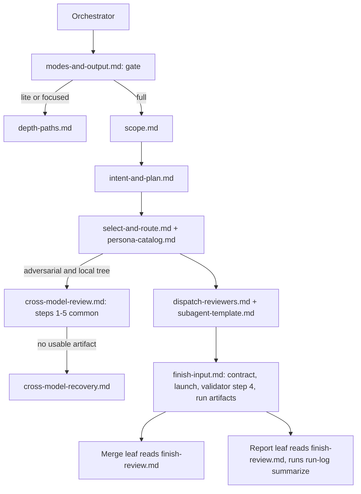

# Review Spine Cost and CI Floor - Plan

## Goal Capsule

- **Objective:** A full-path `ce-code-review` run costs what its stages need rather than what its reference library weighs, a CI workflow change gets the adversarial read it needs without the full roster, a large change in a language the helper cannot name is judged by what it does, and every run leaves per-stage cost facts a maintainer can tune thresholds from.
- **Means:** Load each reference at the step that acts on it and relocate failure-branch prose into files read only on that branch (KTD2); treat the CI path class as a lens floor (KTD1); replace the total-line backstop with a reported fact (KTD3); record stage events through a bundled script (KTD5).
- **Authority:** The user's direction in this session and the repository's skill-authoring standard (`AGENTS.md`, `docs/solutions/skill-design/portable-agent-skill-authoring.md`) govern. Where a unit's restatement and a test pin disagree, the pin is a decision to audit (keep, condition, or drop with its reason in the test), never a floor.
- **Stop conditions:** A relocated block cannot be found by the acting step on a fresh-agent eval on Claude or Codex. A contract test pin cannot be repointed without weakening the invariant it protects. The SKILL.md body cannot hold the acting-point read condition under the 8,000-byte bound without relocating another block.
- **Execution profile:** One PR on `tmchow/review-spine-cost`. Mechanical changes gated by `bun run test`; prose changes gated by fresh-agent eval cells on Claude and Codex; the delegation-bearing units also get one live full-path run per host.
- **Finish and ship:** `ce-work` implements; `lfg` ships.

---

## Product Contract

### Summary

Cut what a full-path review costs by loading each reference only at the step that acts on it and moving failure-branch prose into files read only on that branch. Route CI workflow changes to the focused path's adversarial read instead of the full spine. Replace the 400 total-line backstop with a helper fact the gate reads. Record per-stage cost in the run directory so `FULL_EXEC_LINE_MIN` and future thresholds come from measured runs.

### Problem Frame

PR #1719 made the depth gate decide by consequence. The measured run behind it (`docs/solutions/skill-design/review-cost-is-in-entering-the-spine-not-the-findings.md`) showed the cost of a full run is the spine itself: the orchestrator read about ten references in full before acting on any of them, re-read the finish references the leaves read again, and paid a growing context on every one of 68 turns. Three follow-ups were left open there, and a fourth arose during review of that PR.

First, the reference load. `finish-review.md` is 46KB and the orchestrator opens it only because Stage 5b step 4 lives inside it. `cross-model-review.md` is 36KB and is read in full on every full and focused run even though its recovery, quota, and hand-recovery branches are taken rarely. `modes-and-output.md` carries the lite and focused procedures that a full run never acts on. The eval behind issue #1482 showed Claude reads every reference a spine names as soon as it can, so a pointer visible early is followed early; savings depend on where the pointer sits, not only on the split.

Second, CI workflow changes. The helper's `ci` path class forces the full spine. What a CI change needs is the adversarial read, and the focused path already provides exactly that.

Third, the total-line backstop. PR #1719's review added `FULL_TOTAL_LINE_MIN = 400` to catch executable sources the extension list does not name. That is a number standing in for a judgment the gate already asks the agent to make, and the user asked to rely on agent reasoning instead.

Fourth, instrumentation. Issue #1703 asked for usage reporting and PR #1706 left it out. No script or reference records stage timing, turn counts, or token usage; the cross-model script writes `adversarial-codex-usage.json` on the Codex route only, and the job directory that holds peer elapsed time is deleted before the leaves run.

### Requirements

**Reference loading**

- R1. The orchestrator reads each reference when it enters the step that reference governs; a read made before that step does not satisfy the requirement, and a reference a run's path never reaches is never read.
- R2. The orchestrator never opens `finish-review.md` on the full path; the two things it acted on from that file (Stage 5b step 4 and the run-artifact list) are owned by the reference it already reads for the finish handoff.
- R3. The cross-model reference's failure branches (dispatch-infrastructure hand recovery, ran-but-no-usable-output, started-but-not-done, skip-reason classification, did-not-run fallback with replacement recipient, the maintainers' trust boundary) live in a file read only on a branch where the peer did not yield a usable artifact, whether Stage 3d's no-job-id start failure or Step 5's artifact read, and every other file that cites those branches points at their new owner.
- R4. The lite and focused procedures live in a file read only when the depth gate selects lite or focused; the gate itself stays in the reference read first.
- R5. Relocation moves blocks verbatim; no sentence is shortened or tightened to fit.
- R6. Every contract test pin on a relocated block is repointed to the block's new file or restated as a corpus grep with its reason in the test, and no pin is dropped without a recorded reason.

**Depth gate**

- R7. A CI workflow change (the helper's `ci` path class) can never take lite; it takes the focused path unless consequence or another floor sends it to full. Migrations and uncounted files remain full floors.
- R8. The helper reports changed lines it could count but could not classify as executable or test, keyed by extension, and the gate treats executable code the helper could not name as executable code for the consequence question. There is no total-line floor.
- R9. Coverage loss on CI changes is stated: a CI change on the focused path gets correctness plus one independent adversarial read, not the standards, testing, or security personas, unless its consequence is an auth, money, or public-contract boundary.

**Instrumentation**

- R10. Every run appends stage events (stage, start and end timestamps, reviewer count, candidate count, artifact bytes, and token counts when the host exposed them) to `<run-dir>/stages.jsonl` as the run progresses, so a killed run leaves parseable partial data.
- R11. The receipt writer folds a cost summary into `metadata.json` from those events plus any peer usage file, merging with the fields already there rather than overwriting them.
- R12. Token fields are optional and absent when the host exposes nothing; elapsed time, turns where countable, reviewer count, candidate count, and artifact bytes are the portable floor.

**Consumers**

- R13. `review.json`'s consumer-facing fields (`status`, `verdict`, `reviewers`, `findings`, `actionable_findings`, `coverage.depth`, `artifact_path`, `run_id`) are unchanged in name, type, and location.

### Key Decisions

- **A CI workflow change is a lens floor, not a depth floor.** Governs R7, R9. (session-settled: user-directed — chosen over keeping the `ci` class in `HARD_BLOCK_PATTERNS` forcing the full spine: the lens a silent-pass guard needs is the adversarial read, which the focused path already provides; the full roster adds cost without a lens the guard needs.)
- **No total-line floor; the helper reports what it could not classify and the agent judges.** Governs R8. (session-settled: user-directed — chosen over keeping `FULL_TOTAL_LINE_MIN = 400`: a count is a proxy for the consequence judgment the gate already asks, and the extension-list rounds on PR #1719 showed that proxies accrete exceptions.)

### Success Criteria

- On a fresh-agent full-path run on Claude and on Codex, the ordered tool trace shows `finish-review.md` opened only by the leaves, `cross-model-recovery.md` opened only on a branch where the peer yielded no usable artifact, and `depth-paths.md` never opened.
- On the same live full runs, the orchestrator's turn count is at or below the measured run's 68 and the reference bytes it reads are below the measured run's, on each host. The instrumentation must not spend what the split saves.
- On a fresh-agent focused-path run, `depth-paths.md` is opened after the gate declares focused and `select-and-route.md` is never opened; on a fresh-agent lite-path run, `depth-paths.md` is opened after the gate declares lite and no full-only reference opens.
- Every run directory holds a `stages.jsonl` and a `metadata.json` whose `cost` block a maintainer can read with `jq` without knowing the harness, and whose `status` says whether the run completed.

### Scope Boundaries

- `dispatch-reviewers.md` and `subagent-template.md` stay whole: their text is common-path or too interleaved to split without restating it.
- `scope.md`'s four entry branches stay in one file; a run acts on one, but the branch is chosen in the first paragraph and the file is read once.
- No consumer of `review.json` changes. Cost data is additive to `metadata.json` only.
- No language classifier or maintained extension map. The extension list and executable bit stay as the cheap first pass.

#### Deferred to Follow-Up Work

- Splitting `dispatch-reviewers.md`'s no-parallel-primitive, worktree-isolation, and pack-resolution blocks once a measured run shows the orchestrator paying for them.
- A threshold-tuning script that reads `metadata.json` cost blocks across runs. This PR produces the data; nothing consumes it yet.
- Peer-wait turn count. The cross-model reference already mandates slices up to 480 seconds with no interleaved status reads; the measured run still spent turns there. Instrumentation from this PR shows whether that is still true before any prose changes.

### Sources

- `docs/solutions/skill-design/review-cost-is-in-entering-the-spine-not-the-findings.md`: the measured per-stage token table and the three named follow-ups.
- `docs/solutions/skill-design/size-driven-skill-restructure.md`, "When a host front-loads the references": Claude read every Phase-5 owner at kernel load in the #1482 eval; the fix is the acting-point condition in the body plus pointers inside the branch text.
- `docs/solutions/skill-design/detached-job-lifecycle-for-delegated-work.md` and `requested-vs-verified-model-identity.md`: receipt fields published atomically in the job's own record; the pattern for stage facts.
- `docs/solutions/skill-design/subordinate-the-failing-shape-to-the-condition.md`: when relocating, state the condition, never truncate.
- `skills/ce-work/SKILL.md` line 18 and `skills/ce-plan/SKILL.md` line 39: the acting-point read sentence already in use by sibling skills.
- `tests/review-skill-contract.test.ts` `readCodeReviewRuntimeContract()` (lines 131 to 144): the file list the corpus pins read from.

---

## Planning Contract

### Key Technical Decisions

- KTD1. **The helper emits `silent_pass_classes` and the gate reads it as a lens floor.** `review-scope.py` moves `ci` out of `HARD_BLOCK_PATTERNS` into a `SILENT_PASS_PATTERNS` map whose matches are reported as `silent_pass_classes`; `hard_block_full` no longer includes them. The depth gate states one condition: a helper-named silent-pass class forbids lite, so the change takes at least the focused path, and consequence still decides focused versus full. `select-and-route.md`'s silent-pass paragraph stays as the full-spine rule for the adversarial lens. Instantiates the first Key Decision; cites R7, R9. (session-settled: user-directed — chosen over keeping the `ci` class in `HARD_BLOCK_PATTERNS` forcing the full spine: the lens a silent-pass guard needs is the adversarial read, which the focused path already provides.)
- KTD2. **Relocate blocks verbatim to the step that acts on them; put the acting-point condition in the body and each branch pointer inside the branch sentence.** `SKILL.md`'s spine sentence becomes the sibling skills' wording: read each reference when you enter the step it governs; a read made before that step does not satisfy it. A pointer to a branch-only file sits inside the sentence that decides the branch, never in a preamble or the spine, because a visible pointer is followed early on Claude. Prose is moved, never compressed. Cites R1, R3, R4, R5. (session-settled: user-approved — chosen over shortening or tightening reference prose: #1452 and #1456 showed compression drops invariants and inverts guards; relocation preserves them.)
- KTD3. **Drop `FULL_TOTAL_LINE_MIN`; the helper reports `unclassified_lines` by extension.** `size_band_for` returns to a single input, executable non-test lines against `FULL_EXEC_LINE_MIN`. The helper adds `unclassified_lines`, a map from extension (or `""` for none) to changed lines for files it counted but classified as neither executable nor test. The gate states that executable code the helper could not name is still executable code for the consequence question. Instantiates the second Key Decision; cites R8. (session-settled: user-directed — chosen over keeping the 400 total-line backstop: a count is a proxy for the judgment the gate already asks the agent to make.)
- KTD4. **Stage 5b step 4 and the run-artifact list are owned by `finish-input.md`; `finish-review.md` keeps the step number as a one-line pointer.** The validator launch, collection, bound, and infrastructure-failure classification move verbatim into `finish-input.md`'s existing "The validator (dispatch context)" section. `finish-review.md`'s Stage 5b list keeps item 4 as "run by the dispatch context as `references/finish-input.md` states", so numbering has one owner and leaf-side citations of steps 1 to 3 and 5 stay valid. The "Run artifacts" list moves the same way, with `modes-and-output.md`'s pointer following it. `finish-input.md` joins `readCodeReviewRuntimeContract()` so the moved pins keep reading the corpus. Cites R2, R6.
- KTD5. **Instrumentation is a bundled script that appends JSONL and merges a summary; each context writes its own events.** `scripts/run-log.py` gets two subcommands. `event` appends one line to `<run-dir>/stages.jsonl` per call: `--end <stage>` and `--start <stage>` may be given together so one call records a stage boundary, and each line carries an ISO timestamp plus optional `--reviewers`, `--candidates`, `--tokens`, `--note`, and, on the scope stage, the helper's facts (`exec_nontest_lines`, `changed_lines`, `size_band`, `unclassified_lines`) and the depth the gate chose. `summarize` reads the file, tolerates one truncated trailing line and records it as `truncated_events: 1`, computes per-stage elapsed seconds, artifact bytes from the run directory, the host name from the same attestation snippet the cross-model reference uses, folds `adversarial-<provider>-usage.json` when present, copies the scope facts into `cost.scope`, sets `cost.status` to `complete` when every started stage ended and the receipt stage is present and to `partial` otherwise, and merges the `cost` object into an existing `metadata.json` without touching its other fields. `summarize` runs after `metadata.json` has been written, as the last action before the report leaf returns (full) or the dispatch context emits the receipt (lite, focused); it is the only writer that touches `metadata.json` after the receipt write. The dispatch context writes one event call per stage boundary for Stages 1 through 4, the peer start and fold, and the validator launch and collection; the merge leaf writes its own merge event; the report leaf writes its report event; lite and focused write their events in the dispatch context. Token counts are passed only when the host handed them to the writer (a subagent completion notice on Claude Code, the peer usage file on Codex) and are absent otherwise. Cites R10, R11, R12.
- KTD6. **Finish leaves stay on the full path.** A ce-pov panel (Codex and Grok concurring) held that the split exists because a six-lens round exhausts the dispatch context before validation, not because two findings need a fresh merge; lite and focused already finish in the dispatch context. This plan changes what the orchestrator reads before the leaves, not whether they run. Cites R2.
- KTD7. **Coverage loss on CI changes is accepted and stated.** A CI change without an auth, money, or public-contract consequence gets correctness plus one independent adversarial read and no standards, testing, or security persona. The gate's existing auth boundary condition already sends a workflow change that handles credentials, tokens, or permissions to full; the guide and the depth-gate prose say so in one sentence. Cites R9.

### High-Level Technical Design

Which context reads which file after the change, on the full path:

Stage events by writer:

| Path | Dispatch context writes | Merge leaf writes | Report leaf writes |
|---|---|---|---|
| lite | `scope`, `review`, then `summarize` | none | none |
| focused | `scope`, `peer-start`, `review`, `peer-fold` (or `local-adversarial`), then `summarize` | none | none |
| full | `scope`, `select`, `peer-start`, `dispatch`, `peer-fold`, `validate` | `merge` | `report`, then `summarize` |

### Assumptions

- The Claude Code subagent completion notice carries a token count the orchestrator can pass to `run-log event --tokens`; Codex exposes nothing for local subagents and the peer usage file for the peer. Where neither holds, the event carries no `tokens` key.
- The helper's `unclassified_lines` needs no prose list to decide what counts as prose: it reports every counted file that is neither executable nor test, and the agent reading `.md` and `.yaml` keys treats them as what they are.

---

## Implementation Units

### U1. CI path class becomes a lens floor

- **Goal:** A staged `.github/workflows/ci.yml` change declares focused, not full, on both hosts, and every place that said CI forces full now says what it does.
- **Requirements:** R7, R9; KTD1, KTD7.
- **Dependencies:** none.
- **Files:** `skills/ce-code-review/scripts/review-scope.py`; `skills/ce-code-review/references/modes-and-output.md` (Review depth); `skills/ce-code-review/references/scope.md` (Stage 1b floor sentence); `skills/ce-code-review/references/select-and-route.md` (the silent-pass paragraph's parenthetical about CI); `docs/guides/ce-code-review.md`; `CONCEPTS.md` (Review depth); `tests/ce-code-review-mechanics.test.ts`; `tests/skill-eval-cell/catalog.ts` (`depth-gate-ci-full` row); `tests/skill-eval-cell/catalog.test.ts` (both allowlists).
- **Approach:**
  1. In the helper, add `SILENT_PASS_PATTERNS = {"ci": ...}` holding the current ci regex, remove `ci` from `HARD_BLOCK_PATTERNS`, and emit `silent_pass_classes` in both the complete and fail-closed result shapes.
  2. In the gate, add one condition after the floors: a helper-named silent-pass class forbids lite, so the run takes at least focused; consequence decides focused versus full as already written. Keep "focused never replaces a floor".
  3. Restate the guide's full-spine list and the glossary entry to match; state the coverage loss in the guide in one sentence.
  4. Flip the mechanics test to assert `silent_pass_classes` contains `ci`, `hard_block_full` is false, and migrations still force full.
  5. Rename the eval row to `depth-gate-ci-focused`, declare `focused`, update `why` and `pre_contract`, and update both allowlists in sorted position.
- **Patterns to follow:** the `size_band` restatement in PR #1719 (`fix(ce-code-review): size review depth by consequence`), which changed a floor's meaning in the helper, the gate prose, the guide, the glossary, the mechanics test, and the catalog row in one commit.
- **Test scenarios:**
  - A staged CI workflow file yields `silent_pass_classes: ["ci"]`, `hard_block_full: false`, `size_band: "small"`.
  - A staged migration file still yields `hard_block_full: true` with `hard_block_classes` containing `migrations`.
  - A run with an invalid base still fails closed with `hard_block_full: true` and an empty `silent_pass_classes`.
  - Eval cell: the CI fixture declares `DEPTH: focused` on Claude and Codex.
- **Verification:** `bun test tests/ce-code-review-mechanics.test.ts tests/review-skill-contract.test.ts tests/skill-eval-cell/catalog.test.ts` green; the renamed cell passes on both hosts.

### U2. Replace the total-line backstop with reported unclassified lines

- **Goal:** A 400-line change in an unlisted language is not floored by count; the helper tells the agent what it could not classify and the gate says how to judge it.
- **Requirements:** R8; KTD3.
- **Dependencies:** none (touches the same files as U1; land after U1 to keep the helper diff readable).
- **Files:** `skills/ce-code-review/scripts/review-scope.py`; `skills/ce-code-review/references/modes-and-output.md`; `skills/ce-code-review/references/scope.md`; `docs/guides/ce-code-review.md`; `docs/solutions/skill-design/review-cost-is-in-entering-the-spine-not-the-findings.md` (guidance item 2); `tests/ce-code-review-mechanics.test.ts`; `tests/review-skill-contract.test.ts` (the `FULL_EXEC_LINE_MIN` pin stays; add a pin that `FULL_TOTAL_LINE_MIN` is absent, with the reason); `tests/skill-eval-cell/catalog.ts` and a new fixture `tests/skill-eval-cell/fixtures/review-depth-unlisted-language`.
- **Approach:**
  1. Remove `FULL_TOTAL_LINE_MIN`; `size_band_for` takes executable non-test lines only. Add `unclassified_lines` as a map from lowercase extension (empty string for none) to changed lines, for counted files that matched neither the executable check nor `TEST_PATTERN`.
  2. In the gate's floor paragraph, drop the backstop clause; in the consequence paragraph add one sentence: executable code the helper could not name, visible in `unclassified_lines`, is executable code for this question.
  3. Update the guide's full-spine list, the Stage 1b sentence, and the learning doc's guidance item 2.
  4. Replace the backstop mechanics test with: a 400-line `model.R` yields `size_band: "small"` and `unclassified_lines: {".r": 400}`; a markdown-only change yields `unclassified_lines` with `.md` and `exec_nontest_lines: 0`.
  5. Add two eval cells: a 400-line R fixture that implements a rate limiter's token bucket (silent under load) must declare `focused` or `full`, never `lite`, on both hosts; a 400-line markdown-only fixture with the same reported `unclassified_lines` shape must declare `lite`, so the gate is shown reading what the lines are and not only that they exist.
- **Patterns to follow:** the `exec_nontest_lines` addition in the helper, which added a reported fact and a matching gate sentence.
- **Test scenarios:**
  - 400-line `model.R`: `exec_nontest_lines` 0, `size_band` small, `unclassified_lines` `{".r": 400}`, `hard_block_full` false.
  - 250-line `pkg/test_service.py`: unchanged from today, and `unclassified_lines` is empty.
  - Deleted file with a renamed display path still counts toward `unclassified_lines` under its resolved extension.
  - Eval cell: the R rate-limiter fixture declares focused or full on Claude and Codex.
  - Eval cell: the markdown-only control declares lite on Claude and Codex.
- **Verification:** mechanics and contract tests green; the new cell passes on both hosts and is added to both catalog allowlists.

### U3. Acting-point reads and an orchestrator that never opens finish-review.md

- **Goal:** The spine forbids early reads, and the full-path orchestrator's finish work is owned by the reference it already reads.
- **Requirements:** R1, R2, R6; KTD2, KTD4, KTD6.
- **Dependencies:** none.
- **Files:** `skills/ce-code-review/SKILL.md`; `skills/ce-code-review/references/finish-review.md`; `skills/ce-code-review/references/finish-input.md`; `skills/ce-code-review/references/cross-model-review.md` (receives the relocated peer-keys sentence); `skills/ce-code-review/references/modes-and-output.md` (the "Run artifacts" pointer); `skills/ce-code-review/references/dispatch-reviewers.md` (its finish-input pointer, if wording cites step 4); `tests/review-skill-contract.test.ts`; `tests/skills/cross-model-review-mode.test.ts`.
- **Approach:**
  1. Replace the spine's "Read each reference named below before doing that step's work" with the sibling wording, scoped to what the step acts on: read each reference when you enter the step whose own work it governs; a read made before that step does not satisfy it, and a reference you only hand to a leaf is not one you read. Rewrite step 7 so `references/finish-review.md` is named only as the file each leaf reads from disk, with the orchestrator's finish work stated as living in `references/finish-input.md`; the name stays so the spine-order pin holds, and that pin gets a comment recording that the finish reference appears as a leaf seed. The body is 7,877 CRLF-adjusted bytes today and the new sentence adds about 43, which crosses the plan's 7,900 headroom line, so relocate step 5's sentence "This pass's skip and target-selection keys are `cross_model_review_mode` and `cross_model_peer`. ... as the reference states." (306 bytes) verbatim into `references/cross-model-review.md`'s checkout-policy paragraph, which already owns those keys, and repoint the "ce-code-review body treats missing peer keys as the default auto route" pin in `tests/skills/cross-model-review-mode.test.ts` to that reference with a comment naming the move.
  2. Move Stage 5b step 4 verbatim from `finish-review.md` into `finish-input.md`'s "The validator (dispatch context)" section, and leave item 4 in `finish-review.md`'s list as a one-line pointer to that owner. Fix `finish-review.md` line 1's description of what the dispatch context runs to match.
  3. Move the "Run artifacts" list verbatim into `finish-input.md`; repoint `modes-and-output.md`'s "The full path's finish leaf adds the artifacts `references/finish-review.md` lists", `finish-review.md`'s own pointer at line 213, and its completion check at line 115 ("the run artifacts named at the end of this reference").
  4. Add `finish-input.md` to `readCodeReviewRuntimeContract()`. Repoint to `finish-input.md`, each with a comment naming the move: the step-4 regexes in the "Stage 5b validation pass dispatches conditionally" test, the "agent lifecycle rule from `references/dispatch-reviewers.md`" pin, the `- \`finish-input.json\`` run-artifact pin in the #1690 test, and the `adversarial-review-constraints.md` pin in the constraints test.
- **Patterns to follow:** `skills/ce-work/SKILL.md` line 18 for the sentence; `docs/solutions/skill-design/size-driven-skill-restructure.md` "Relocate before you delete" for the move order.
- **Test scenarios:**
  - `SKILL.md` matches the acting-point sentence and stays at or under 8,000 CRLF-adjusted bytes with at least 100 bytes of headroom.
  - The `cross-model-review-mode` test finds the peer-keys sentence in the cross-model reference and no longer in the body.
  - On the live full run in U7, the orchestrator's ordered tool trace on Claude and on Codex contains no read of `finish-review.md`.
  - `finish-review.md` still starts with `This reference runs across three contexts` and still contains Stage 5, 5b steps 1 to 3 and 5, 5c, and 6.
  - `finish-input.md` contains the validator launch text the old step-4 pins matched, and the run-artifact list.
  - The spine-order test still finds its seven reference names in order.
- **Verification:** `bun test tests/review-skill-contract.test.ts` green with every moved pin repointed and none dropped.

### U4. Split cross-model failure branches into cross-model-recovery.md

- **Goal:** A full or focused run reads the cross-model reference's common steps and opens the recovery file only when the artifact read yields nothing usable.
- **Requirements:** R3, R5, R6; KTD2.
- **Dependencies:** U3 (the acting-point sentence is what makes the branch pointer effective).
- **Files:** `skills/ce-code-review/references/cross-model-review.md`; new `skills/ce-code-review/references/cross-model-recovery.md`; `skills/ce-code-review/references/select-and-route.md` (Stage 3d's citations of the did-not-run fallback and in-process restore); `skills/ce-code-review/references/dispatch-reviewers.md` (its three cross-model citations); `skills/ce-code-review/references/modes-and-output.md` (the focused path's fallback sentence cites "any reason the cross-model reference names"); `skills/ce-code-review/references/depth-paths.md` once U5 lands; `tests/review-skill-contract.test.ts`; `tests/config-layers-rule-parity.test.ts` (unchanged if the config block stays in the main file).
- **Approach:**
  1. Move verbatim into the new file: Step 5's dispatch-infrastructure hand recovery, ran-but-no-usable-output, started-but-not-done, the skip-reason classification list, the did-not-run fallback with the replacement-recipient rule, and the Trust boundary section. Keep in the main file: run conditions, Steps 1 through 4 including the host attestation snippet, the `ce-config-layers` block, the Codex sandbox grant, the single-reap finish, and Step 5's verified read, receipt fields, empty-findings note, promotion rule, and cleanup.
  2. Write the pointer inside each sentence that enters a failure branch, and nowhere else: at Stage 3d's no-job-id start failure, and in Step 5 where the read's exit code or the job's terminal state is not `done` with an artifact. Each says: read `references/cross-model-recovery.md` and follow the branch that matches the observed state.
  3. Repoint every citation the research found: `select-and-route.md` Stage 3d (two sentences), `dispatch-reviewers.md` (lines that name the did-not-run fallback and rate-limit restore), and the focused path's fallback sentence.
  4. Repoint the six contract tests that iterate fixed file lists (`pairs`, `authScopeRefs`, `routeTokenPairs`, the skip-legibility and fold-in describes) so each reads the file that now owns its phrase; the host attestation regex keeps reading the main file.
- **Patterns to follow:** `skills/ce-babysit-pr/references/stack.md` line 15, a branch-only read named inside the branch condition.
- **Test scenarios:**
  - Every phrase the repointed tests match is found in exactly one of the two files.
  - `cross-model-review.md` no longer contains `Did-not-run fallback` and `cross-model-recovery.md` does.
  - The `ce-config-layers` parity test still passes against the main file.
  - Eval cell, recovery branch: a fixture run directory whose peer job ended `failed` with no artifact; the task stops after classifying the outcome; `files_read_post` requires `references/cross-model-recovery.md`.
  - Eval cell, happy branch: the peer artifact exists and is folded; the declared outcome is `folded`.
- **Verification:** contract tests green; both cells pass on Claude and Codex; the live run in U7 shows the recovery file unopened on a healthy peer.

### U5. Relocate the lite and focused procedures into depth-paths.md

- **Goal:** A full run reads the gate and nothing about lite or focused; a lite or focused run reads its procedure after the gate selects it.
- **Requirements:** R4, R5, R6; KTD2.
- **Dependencies:** U3.
- **Files:** `skills/ce-code-review/references/modes-and-output.md`; new `skills/ce-code-review/references/depth-paths.md`; `skills/ce-code-review/SKILL.md` (step 2's "Lite ends the run ... Focused ends it from this context too" sentence, which stays); `tests/review-skill-contract.test.ts`; `tests/skill-eval-cell/catalog.ts` and `catalog.test.ts` (the lite rows that run the criteria or plan check now require `references/depth-paths.md`).
- **Approach:**
  1. Move "### Lite path" and "### Focused path" verbatim into `depth-paths.md`. Leave in the gate a pointer inside the decision sentence: when lite or focused is selected, read `references/depth-paths.md` and run that path from this context. The JSON output format stays where it is; both files cite it.
  2. Repoint the pins on `### Focused path`, `Do not dispatch reviewers or finish leaves`, `one independent adversarial read`, and `never run both on the same brief` to `depth-paths.md`, and add `depth-paths.md` to `readCodeReviewRuntimeContract()`.
  3. Add `references/depth-paths.md` to `files_read_post` on `depth-gate-plan-lite`, `depth-gate-standards-violation`, and `depth-gate-standards-clean`, which run the lite procedure; leave the gate-only rows on `modes-and-output.md`.
- **Patterns to follow:** U4's pointer placement.
- **Test scenarios:**
  - `modes-and-output.md` keeps `## Review depth` and the `"depth": "lite | focused | full"` JSON line; it no longer contains `### Lite path`.
  - `depth-paths.md` contains both sections verbatim (a corpus grep for two distinctive sentences from each).
  - The three lite eval rows read `depth-paths.md` on both hosts; the gate-only rows still declare correctly without it.
- **Verification:** contract and catalog tests green; the three lite rows pass on Claude and Codex.

### U6. Stage cost instrumentation

- **Goal:** Every run leaves `stages.jsonl` and a `cost` block in `metadata.json` that a maintainer can inspect without knowing the harness.
- **Requirements:** R10, R11, R12, R13; KTD5.
- **Dependencies:** U3 (event call sites land in the references U3 reorganizes); U5 (`depth-paths.md` does not exist until U5 lands).
- **Files:** new `skills/ce-code-review/scripts/run-log.py`; `skills/ce-code-review/references/scope.md` (first event after the run directory exists); `skills/ce-code-review/references/select-and-route.md` (peer start); `skills/ce-code-review/references/dispatch-reviewers.md` (dispatch start and end, peer fold); `skills/ce-code-review/references/finish-input.md` (validator events; the leaf instructions for `merge`, `report`, and `summarize`); `skills/ce-code-review/references/depth-paths.md` (lite and focused events and `summarize`); `skills/ce-code-review/references/modes-and-output.md` ("Run artifacts": `stages.jsonl` and the `cost` block's fields); `docs/guides/ce-code-review.md` (one paragraph on what the run directory records); new `tests/ce-code-review-run-log.test.ts`.
- **Approach:**
  1. Write the script with `event` and `summarize` as KTD5 specifies. `event` is append-only with one JSON object per line and no locking beyond an atomic single write. `summarize` never fails the run: an unreadable file yields `cost: {"status": "unavailable", "reason": ...}`.
  2. The `cost` block: `status` (`complete` or `partial`), `host`, `scope` (the helper's facts and the chosen depth, from the scope event), `stages` (name, elapsed seconds, reviewers, candidates, tokens when present), `totals` (elapsed, reviewer count, candidate count, artifact bytes), `peer` (from the usage file when present), `truncated_events`.
  3. Place one `event` call inside the sentence that performs each stage transition, ending the previous stage and starting the next in that one call, using the skill's `SKILL_DIR` anchor and Python interpreter probe already used by the other bundled scripts, once per file as a parameterized recipe with stage names as deltas.
  4. Instruct each leaf to write its own event; instruct the report leaf and the lite and focused paths to run `summarize` after `metadata.json` is written, as the last action before returning or emitting the receipt, so the merge finds the existing fields and nothing overwrites the `cost` block afterwards.
- **Execution note:** Prove the script with tests before wiring the prose; the prose only names the call.
- **Patterns to follow:** `skills/ce-babysit-pr/scripts/pr-snapshot`'s `invocation_elapsed_seconds` (a bundled script emits facts; the model reasons over them); `scripts/findings-mechanics.py` for the interpreter probe and `SKILL_DIR` anchor recipe.
- **Test scenarios:**
  - Two `event` calls for one stage produce an `elapsed_seconds` within tolerance of the wall-clock gap.
  - `summarize` on a file whose last line is truncated reports `truncated_events: 1` and every complete stage.
  - `summarize` merges into a `metadata.json` that already has `run_id`, `branch`, `head_sha`, `verdict`, `completed_at` and leaves them unchanged.
  - One `event` call with `--end scope --start select` produces two lines and a correct elapsed for `scope`.
  - `summarize` on a file whose last stage has a start and no end reports `cost.status: partial`; a file with every stage ended and a report stage reports `complete`.
  - The scope event's helper facts appear under `cost.scope` unchanged.
  - `summarize` with an `adversarial-codex-usage.json` beside it copies its input and output token fields under `peer`.
  - `summarize` with no `stages.jsonl` writes `cost.status: unavailable` and exits 0.
  - Artifact bytes equal the sum of file sizes in the run directory excluding `jobs/`.
- **Verification:** the new test file green; a run on each host in U7 leaves a `cost` block with `host` set and, on Claude Code, at least one stage with `tokens`.

### U7. Fresh-agent evals and live runs

- **Goal:** Every behavior-bearing change above is graded on Claude and Codex from the on-disk skill, and the delegation-bearing ones on a real run.
- **Requirements:** R1, R3, R4, R7, R8, R10; Success Criteria.
- **Dependencies:** U1 through U6.
- **Files:** `tests/skill-eval-cell/catalog.ts`; `tests/skill-eval-cell/catalog.test.ts`; fixtures under `tests/skill-eval-cell/fixtures/`; a report at `docs/plans/2026-09-15-review-spine-cost-eval-report.md`.
- **Approach:**
  1. Gate-stop cells: `depth-gate-ci-focused` (U1), `depth-gate-unlisted-language` (U2), the three lite rows requiring `depth-paths.md` (U5), the recovery-branch and happy-branch fold-in cells (U4).
  2. Live runs: one full-path review and one focused-path review of a throwaway repository with a real peer, on Claude and on Codex launched under `env -u CLAUDECODE`, graded on the ordered tool trace (which files were read and when), the orchestrator's turn count against the measured 68, `stages.jsonl`, and `metadata.json`. Record the orchestrator's read order against Success Criteria; the focused run must show `cross-model-recovery.md` unopened when the peer folds.
  2b. Gate-stop cell for lite ordering: reuse the yaml-lite fixture with a task that stops after the gate and the first procedure read, graded on `files_read_post` containing `references/depth-paths.md` and the declared depth `lite`.
  3. Write the eval report in the shape of `docs/plans/2026-08-22-right-size-skill-ceremony-eval-report.md`: scenarios, hosts, pre and post behavior, what was unexercised.
- **Test scenarios:**
  - Each cell's `declared` or `files_read_post` grade passes on both hosts.
  - The live full run on each host opens `finish-review.md` only from the leaves and never opens `cross-model-recovery.md` when the peer folds.
  - The live run's `metadata.json` has a `cost` block with every stage the full path names.
- **Verification:** the pack reports pass for every row; the report is committed.

---

## Verification Contract

| Check | Command or evidence | Applies to |
|---|---|---|
| Mechanical contracts | `bun run test` | every unit |
| Release metadata | `bun run release:validate` | U1, U2 (guide and glossary), U6 (guide) |
| Plugin manifest | `bun run plugin:validate` | any unit that adds a file under `skills/ce-code-review/` |
| Gate-stop evals | `bun run test:skill-eval-pack -- --id <row> --arm post --hosts claude,codex` per row | U1, U2, U4, U5 |
| Live delegation eval | one full-path run per host on a throwaway repo, graded on tool trace and run-dir artifacts | U3, U4, U6 |
| Body bound | `SKILL.md` at or under 8,000 CRLF-adjusted bytes with 100 bytes headroom | U3 |

---

## Definition of Done

- Every requirement R1 through R13 is either implemented and covered by a test or eval named above, or recorded under Deferred to Follow-Up Work with its reason.
- No contract test pin was dropped without a comment naming why; every moved pin reads the file that now owns its phrase.
- `review.json`'s consumer fields are byte-for-byte the same names and types as before.
- The eval report is committed and names what could not be exercised.
- No experimental or abandoned code remains: a relocation that was tried and reverted leaves no orphan file, and no reference names a file that does not exist.
- Per unit: its Verification row is green and its test scenarios exist as tests or catalog rows.
