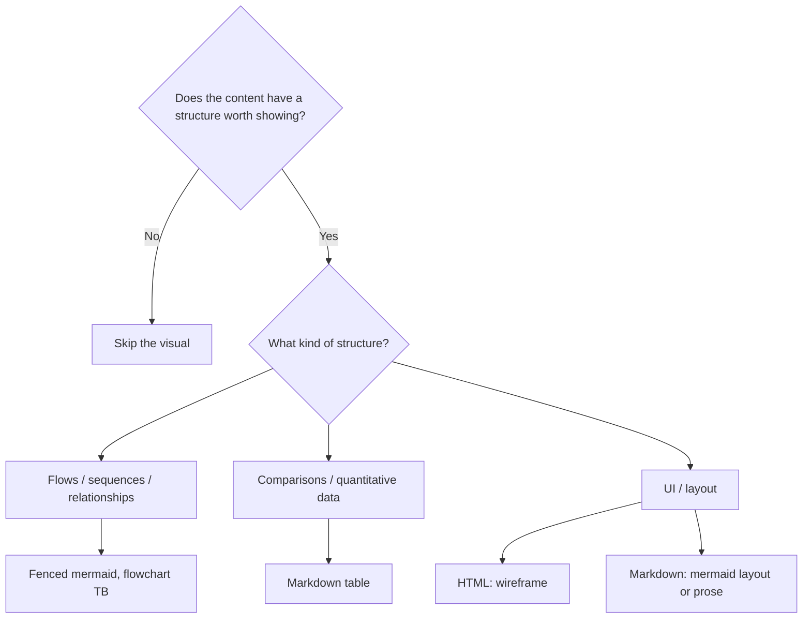

# Conditional visual aids in generated documents and PR descriptions

## Problem

AI-generated documents and PR descriptions default to prose-only output, even when the content -- multi-step workflows, behavioral mode comparisons, multi-participant interactions, dependency structures -- would be understood significantly faster with a visual aid. The gap is not "no diagrams." The gap is that there is no principled framework for deciding when a visual aid earns its place, which format to use, and how to calibrate for different output surfaces.

---

## Symptoms

- Readers mentally reconstruct workflows, dependency graphs, or mode differences from dense prose paragraphs
- Downstream consumers (`ce-plan` reading a brainstorm, reviewers reading a PR) create their own visual aids from scratch because the upstream document didn't include them
- Plans with 5+ implementation units and non-linear dependencies force readers to scan every unit's Dependencies field to reconstruct the execution graph
- System-Wide Impact sections naming multiple interacting surfaces read as a wall of prose when a component diagram would take seconds to scan
- PR descriptions for architecturally significant changes are text-only even though they were built from plans that contained visual aids
- Simple, linear documents include diagrams that add no comprehension value beyond restating the prose

---

## What Didn't Work

- **Always adding diagrams** -- treating visual aids as mandatory by depth classification, document length, or PR size produces noise. Reflexive diagram inclusion trains readers to skip them.
- **Never adding diagrams** -- prose-only output fails when content has branching flows, mode comparisons, or multi-participant interactions. Downstream consumers end up building the visuals themselves.
- **Gating on whether the author's prose already "reads clearly"** -- calling your own wording "clear enough" is the trap that quietly under-produces the visuals a reader actually uses. Decide on whether the *structure* exists, not on how polished the surrounding sentences feel.
- **Hand-drawn box-drawing / ASCII diagrams** -- they violate the repo's no-box-drawing-characters rule, clip in diffs and terminals, and read worse than mermaid or a table. Annotation density is not a reason to draw boxes.
- **Wrong diagram type for the content** -- using a flowchart when the value is a comparison (use a table) or a UI layout in markdown (use mermaid layout or prose; there is no inline-SVG wireframe in markdown).
- **Wrong abstraction level for the surface** -- code-level detail in a brainstorm diagram is premature. Product-level user flows in a plan's High-Level Technical Design miss the point. Oversized diagrams in a PR description slow down reviewers.
- **Size/depth as the trigger** -- gating visual aids on "Standard" or "Deep" depth classification, or on PR line count, produces false positives (long but simple docs get unwanted diagrams) and false negatives (short but complex docs get none).

---

## Solution: The Conditional Visual Aid Pattern

Visual aids are conditional on **content patterns** -- whether the content has a structure worth showing -- not on document size, depth classification, surface type, or how clear the surrounding prose feels.

A structure worth showing is **necessary, not sufficient**. Skip when there is nothing structural to show. When there is, the **surface's own threshold** still decides whether to draw it: a plan skips a one-paragraph approach that prose already carries; a PR includes a visual only when it is faster than prose for a reviewer who cannot get the shape from the diff. Prose stays complete either way: a diagram is an on-ramp, never a substitute. When diagram and prose disagree, **prose governs**.

### 1. Content-Pattern Triggers (Not Size/Depth Triggers)

Whether to include a visual aid depends on WHAT the content describes, not HOW MUCH content there is. A Lightweight brainstorm about a complex workflow may warrant a diagram; a Deep brainstorm about a straightforward feature may not.

| Content describes... | Visual aid type | Notes |
|---|---|---|
| Multi-step workflow or process with branching | Mermaid flowchart (`flowchart TB`) | Sequence, branches, decision points |
| 3+ behavioral modes, variants, or states | Markdown table | How modes differ across dimensions |
| 3+ interacting participants (roles, components, services) | Mermaid sequence or flowchart | Who talks to whom and in what order |
| Multiple competing approaches or alternatives | Markdown table | Side-by-side evaluation |
| 4+ units/stages with non-linear dependencies | Mermaid graph | Parallelism, fan-in/fan-out, blocking order |
| Data pipeline or transformation chain | Mermaid flowchart | Input/output transformations |
| State-heavy lifecycle | Mermaid state diagram | Transitions and guards |
| Before/after performance or behavioral changes | Markdown table | Structured quantitative comparison |
| UI / layout / screen flow | HTML wireframe, or mermaid layout / prose in markdown | Markdown has no inline-SVG wireframe |

**Why content patterns beat size thresholds:** Size correlates weakly with structural complexity. A 200-line brainstorm about a simple CRUD feature is structurally simple. A 50-line brainstorm about a multi-actor authorization workflow is structurally complex. Pattern-based triggers correctly distinguish these; size-based triggers don't.

**Skip when there is no structure to show:**
- A single-field add, a rename, or a one-line change -- a before/after of one changed line is decoration
- Content is simple and linear with no multi-step flows, mode comparisons, or multi-participant interactions
- Three or fewer items in a straight chain -- text is sufficient
- Diagram would be 3 nodes or fewer -- ceremony without comprehension benefit
- Visual describes detail at the wrong abstraction level for the surface
- Simple / rename / dep-bump PRs -- skip visual aids entirely

Do **not** skip because the author's surrounding sentences already "read clearly" — that judgment under-produces. Do skip when the surface threshold says the structure is already available (plan HTD: one-paragraph pattern application; PR: the diff already shows it). The shared trigger is structure; the surface table in §3 is authoritative for whether that structure still needs a visual.

### 2. Which Visual Aid to Choose

**Mermaid (default for flow, relationship, state, and architecture)**

- Best for: flows, dependency graphs, sequence diagrams, state diagrams, component diagrams
- Strengths: renders as SVG on GitHub; source text readable as fallback in email, Slack, terminal, diff views
- Use `TB` (top-to-bottom) so the diagram stays narrow in both SVG and source fallback
- HTML plans may use inline SVG for the same shapes (halo, contrast, label placement in the HTML rendering reference)

**Markdown tables (structured comparison data)**

- Best for: mode/variant comparisons (3+ modes), before/after data, decision matrices, approach evaluations, trade-offs
- Also the markdown stand-in for quantitative charts (bar/scatter) that HTML can draw natively

**Never hand-draw box-drawing or ASCII diagrams.** Annotation density does not justify them. Put the annotations in mermaid node labels, a table, a fenced code block, or the surrounding prose.

### 3. Surface-Specific Calibration

Each output surface has different reading patterns. The trigger bar and diagram density must adjust. There is no separate "Plan -- Readability (4.4)" phase; plan structure visuals live in High-Level Technical Design (3.4) or next to the units they illustrate.

| Surface | Reading pattern | Trigger bar | Abstraction level | Typical diagram size |
|---|---|---|---|---|
| Requirements (`ce-brainstorm` Visualizations) | Studied deeply | Structure worth showing | Conceptual/product-level: user flows, information flows, data-shape, wireframes for UI requirements | 5-20 nodes |
| Plan -- High-Level Technical Design (`ce-plan` 3.4) | Studied deeply | Architecture, sequencing, state, branching that prose doesn't carry well | Solution architecture: component interactions, data flow, state machines | 5-15 nodes |
| Plan -- unit technical design | Studied with the unit | Non-obvious unit approach | Directional, unit-local -- not a second HTD | Small |
| PR description (`ce-commit-push-pr`) | Scanned quickly | High -- only when faster than prose for a reviewer who still cannot get it from the diff | Change impact: what changed architecturally, what flows differently | 5-10 nodes |
| Explainer (`ce-explain`) | Studied in one sitting | Material shape | Architecture / lifecycle as mermaid; comparisons as tables | Proportionate |

Key distinctions:
- **Brainstorm**: conceptual level only. No implementation architecture, data schemas, or code structure unless the brainstorm itself is about those. A visual sits next to the Key Decision, Requirements group, or Flow it illustrates -- not in a "Diagrams" section.
- **Plan HTD**: describes *what's being built*. Skip when the approach is a one-paragraph pattern application that prose conveys. Plan diagrams are authoritative content alongside the prose, not "directional sketches" with hedging captions. Per-unit technical design, if present, stays concise and directional.
- **PR description**: highest bar. Content pattern decides, never size or file count. Derived from the branch diff, not copied from upstream plan/brainstorm artifacts. Prefer mermaid for architecture, a short code block for mechanics, a table for trade-offs. Navigation hints (which file to start in) only when the reviewer would start in the wrong place -- never a list of changed files.

### 4. Layout and Placement

**TB direction for mermaid.** Top-to-bottom diagrams stay narrow in both rendered SVG and source text fallback. This matters for GitHub PR views, side-by-side diffs, and email/Slack notifications where source text is all that renders.

**Mermaid source as text fallback.** Node labels stay concise so the fenced block is readable as text.

**Proportionality: 5-15 nodes typical.** Every node earns its place. Exceed 15 only when the content genuinely has that many meaningful steps. PR descriptions trend smaller (5-10).

**Inline at the point of relevance.** Workflow diagram after the concept it illustrates, not in a "Diagrams" appendix. A separate "Diagrams" section invites diagrams for diagrams' sake. Exception: substantial flows (>10 nodes) may warrant their own heading near the point of relevance.

**Post-generation accuracy check.** After generating any visual aid, verify it matches surrounding content -- correct sequence, no missing branches, no merged steps, no omitted participants.

---

## Why This Works

The conditional, content-pattern-based approach ties the inclusion decision to an observable property of the content itself, not to a proxy metric and not to the author's confidence in their prose. A short brainstorm about a complex multi-actor workflow gets a diagram (structure exists); a long brainstorm about a straightforward feature does not (no structure).

Surface-specific calibration keeps the same core principle -- "include when content patterns warrant it" -- while raising the bar and shrinking diagrams as reading shifts from deep study to quick scanning.

Format selection is mermaid, table, or prose (plus HTML wireframes). That matches the repo's no-box-drawing rule and the rendering references `ce-brainstorm`, `ce-plan`, `ce-commit-push-pr`, and `ce-explain` actually load.

The prose-is-authoritative invariant resolves the trust problem: when diagram and prose disagree, prose governs. IDed requirements, decisions, and acceptance examples stay complete without the diagram.

---

## Prevention

Concrete guidance for any skill that generates documents with visual aids:

1. **Use content-pattern triggers, not size/depth gates.** Map content patterns to visual aid types. Never gate on depth classification or line count.
2. **Trigger on structure, then apply the surface threshold.** Skip when there is nothing structural to show, or when that surface already carries the structure (plan prose, PR diff). Do not skip because the surrounding sentences already "read clearly."
3. **Pair every include rule with a skip rule.** Minimum skips: no structure, simple/linear content, wrong abstraction level, 3-node ceremony.
4. **Mermaid or table (or HTML wireframe); never box-drawing ASCII.** Put dense annotations in labels, tables, code blocks, or prose.
5. **Calibrate to the surface's reading pattern.** Studied surfaces get the standard bar; scanned surfaces (PR descriptions) get a higher bar and smaller diagrams.
6. **Specify the abstraction level.** "Conceptual level only -- not implementation architecture" is the brainstorm example. Plan HTD is solution architecture. PRs are change impact from the diff.
7. **Enforce prose-is-authoritative.** When visual aid and prose disagree, prose governs. Cross-skill invariant.
8. **Require a post-generation accuracy check.** Sequence, branches, participants match the surrounding content.
9. **Use TB direction for mermaid.** Layout constraint for cross-device compatibility.
10. **Place inline at point of relevance.** Never create a separate "Diagrams" section.
11. **Keep diagrams proportionate.** Every node earns its place. 5-15 nodes typical.

---

## Related Issues

- `docs/solutions/skill-design/git-workflow-skills-need-explicit-state-machines.md` -- related but distinct: covers `ce-commit-push-pr` state machine correctness, not output content quality
- GitHub issue #44 -- mermaid dark mode rendering, relevant when considering diagram styling
- PR #437 -- ce-brainstorm visual aids implementation
- PR #440 -- ce-plan visual aids implementation
- `docs/plans/2026-03-29-003-feat-pr-description-visual-aids-plan.md` -- PR-description visual aids plan
- `skills/ce-brainstorm/references/brainstorm-sections.md` -- "structure worth showing" / prose-clarity trap
- `skills/ce-plan/references/structure.md` -- HTD at 3.4; mermaid encouraged for relationships prose cannot carry
- `skills/ce-commit-push-pr/references/pr-description-writing.md` -- content pattern, mermaid, never box-drawing
- `skills/ce-explain/references/explainer-markdown.md` -- mermaid or prose; never ASCII diagrams
