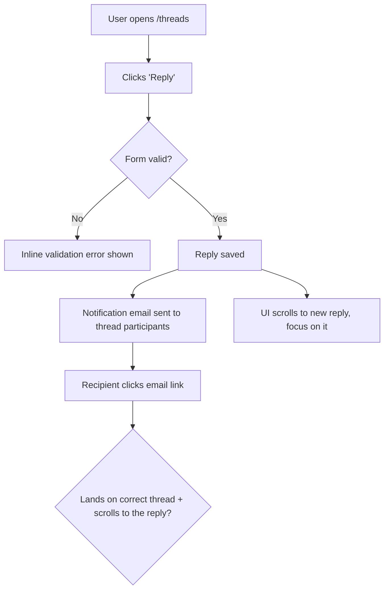

# Dogfood

Act as a QA engineer who dogfoods the **target JJ change stack** end-to-end: understand every change, test every change in a real browser as a user would, and fix what's broken — autonomously — until the target is genuinely ready.

Identify the actor as `ai:assistant` in machine-readable output and `AI Assistant` in prose.

This is **diff-scoped**, not whole-app exploration. You test what the target introduced or modified since its fork point with trunk.

## Use `agent-browser` Only For Browser Automation

This workflow drives the browser exclusively through the `agent-browser` CLI. Do not use Chrome MCP tools (`mcp__claude-in-chrome__*`), any browser MCP integration, or other built-in browser-control tools. If the platform offers multiple ways to control a browser, always choose `agent-browser`. Use the direct binary, never `npx agent-browser` (the direct binary uses the fast Rust client).

## Prerequisites

- A local dev server you can start (`bin/dev`, `rails server`, `npm run dev`, etc.).
- A JJ workspace for the repo under test (`jj root` must succeed). Use JJ for all repository reads and mutations; do not fall back to mutating Git commands.
- `agent-browser` installed. Check:

  ```bash
  command -v agent-browser >/dev/null 2>&1 && echo "Ready" || echo "NOT INSTALLED"
  ```

  If not installed, stop and tell the user to install `agent-browser` (run `/ce-setup` to print the current install command), then re-run this skill — this workflow cannot function without it.

## Reusing Skills

`ce-dogfood` is an orchestrator. Prefer delegating to the existing functional skills below over re-deriving their behavior:

| When | Skill | Why |
|------|-------|-----|
| Phase 0 isolation | `ce-worktree` | Run the dogfood in an isolated JJ workspace so the primary workspace stays untouched. |
| A failure's root cause is non-obvious | `ce-debug` | Systematic root-cause analysis instead of guess-and-check. |
| Finalizing each fix | `ce-commit` | Finalize the selected fix files as one JJ change. |
| A bug reveals a reusable lesson | `ce-compound` | Capture the learning so the team compounds knowledge. |

## Workflow

```
0. Scope        Resolve the target revision, get onto it (offer a workspace), never edit trunk
1. Analyze      Inspect the target stack and fork-point diff, understand every change
2. Map+Matrix   Map user flows as Mermaid flowcharts, then derive the test matrix as a task list
3. Serve        Detect port, start dev server, open agent-browser
4. Execute      Work the matrix one item at a time with agent-browser
5. Fix loop     On failure: fix -> add regression test -> finalize JJ change -> continue
6. Report       Write durable doc to docs/dogfood-reports/ (flows, matrix, fixes, learnings, verdict)
```

### Phase 0: Scope and Get on the Right Target

Parse the arguments you were invoked with: a PR number, a JJ bookmark/revision, or blank (use `@` in the current workspace). Strip `--port PORT` if present.

1. **Identify the target without moving `@` yet.** Resolve every JJ revset to exactly one revision and save its full commit ID as the stable `TARGET_TIP`; an absent, conflicted, or multi-revision target is a blocker, not permission to guess. Do not retain a bookmark name as `TARGET_TIP`, because that bookmark will move after fixes.
   - **PR number:** the target remains the PR. Carry the number through isolation and reporting. Resolve the GitHub repository from a configured remote listed by `jj git remote list`, validate its `owner/repo` identity, then read metadata with `gh pr view <number> --repo <validated-owner/repo> --json baseRefName,headRefName,headRefOid,isCrossRepository`. Require `headRefOid` to be a 40-character hexadecimal object ID. Before using `headRefName`, require a nonempty slash-separated GitHub head-ref shape containing only ASCII letters, digits, `.`, `_`, `/`, and `-`: no empty component, component beginning or ending `.`, component ending `.lock`, `..`, or `@{`, and the whole name must not begin `-` or end `/`. Reject invalid metadata rather than interpolating it. Use only the validated `headRefOid` as the stable target commit ID and resolve content with `exactly(commit_id(<validated-headRefOid>), 1)` after fetch or attachment; never resolve content from `headRefName` or a remote bookmark. GitHub and `.github` remain valid product/forge surfaces. Let `ce-worktree` fetch and resolve the PR when isolating, then independently verify the validated object ID. For in-place work, fetch with the exact JJ string pattern `jj git fetch --remote "<existing-remote>" --branch "exact:\"<validated-headRefName>\""`, then resolve the validated object ID. Do not pass a bare head name or a glob pattern. If no existing remote exposes a cross-repository head, stop and offer isolation instead of adding a remote or mutating repository state.
   - **Bookmark/revision:** resolve the supplied JJ symbol or revset. A supplied local bookmark is also the bookmark to advance after fixes; a remote bookmark such as `feature@origin` or an arbitrary change/commit ID is not.
   - **Blank:** resolve the current workspace's `@` as `TARGET_TIP`. Record a non-trunk local bookmark pointing there only if it is unambiguous; otherwise record no target bookmark. Do not invent an "active bookmark" — JJ has no current-bookmark concept.
2. **Refuse to run on trunk for bookmark/revision or blank targets.** Resolve `trunk()` and the target with `exactly(..., 1)`. If the target is `trunk()`, or it is only an empty working-copy change directly on trunk with no content diff, stop — there is nothing to dogfood. A PR uses its declared base and remains independently diffable.
3. **Decide isolation by what you're testing; let `ce-worktree` own the workspace mechanics.** Do not re-derive workspace detection or creation here — `ce-worktree` handles existing-isolation detection, the harness-native tool, and attaching to a ref. The only call this skill makes is *whether to ask for isolation at all*:
   - **Blank / current-workspace target:** do **not** isolate. Preserve its commit ID as `TARGET_TIP`, then run `jj new "$TARGET_TIP"` so report updates and new fixes accumulate in a dedicated child change rather than rewriting the submitted target.
   - **A PR or different named bookmark/revision:** offer isolation (platform's blocking question tool). On **yes**, invoke `ce-worktree` to attach a JJ workspace to that target and continue only in the returned workspace. On **no**, run `jj status`; if `@` contains unfinalized content, confirm before leaving it, then use `jj new "$TARGET_TIP"` to create a fresh working-copy change on the resolved target. Do not `jj edit` the target revision, because subsequent fixes should be new changes rather than rewrites of the submitted work.
4. **Establish target identity after placement.** Keep the saved commit ID as `TARGET_TIP`; do not silently redefine it as `@`. Ensure `@` is an empty, dedicated child of `TARGET_TIP`, creating one with `jj new "$TARGET_TIP"` if the workspace attachment did not. Record the workspace (`jj workspace list`), target label, PR number if any, unambiguous local target bookmark if any, and both change ID and commit ID from `jj log -r "$TARGET_TIP" --no-graph -T 'change_id.short() ++ " " ++ commit_id.short()'`. Keep commit IDs because GitHub identifies PR revisions by object ID; use change IDs for stable JJ identity across rewrites.
5. **Resume if a prior run exists.** Look for an existing report at `docs/dogfood-reports/*-<target-slug>-dogfood.md` (see the target-slug rule under Resumability). If one is found with unfinished scenarios, ask whether to resume it or start fresh. To resume, re-hydrate the task list from its matrix: `Pass`/`Fixed`/`Skipped` stay done; `Pending` and `in_progress` become the remaining auto-runnable work. The two `Blocked` states are **not** auto-runnable — `Blocked (needs human verify)` and `Blocked (human decision)` are waiting on a person, so surface them to the user and ask how to proceed rather than silently re-queuing them.

### Resumability (stop and return at any point)

This workflow is designed to be interrupted and resumed. Two pieces of state make that safe:

- **The task list** (the harness's task tool — `TaskCreate`/`TaskUpdate` on Claude Code, `update_plan` on Codex, or the equivalent elsewhere) is the live to-do — one task per matrix scenario. Mark each `in_progress` when you start it and `completed` only when it genuinely passes.
- **The report doc** at `docs/dogfood-reports/<YYYY-MM-DD>-<target-slug>-dogfood.md` is the durable checkpoint that survives across sessions. Derive `<target-slug>` from `pr-<number>` for a PR, the bookmark/revision label for a named target, or `TARGET_TIP`'s change ID for a blank target; lowercase it and collapse every run of non-alphanumeric characters (slashes included) to one `-` (e.g. `feature/Foo_Bar` -> `feature-foo-bar`). **Create it as soon as the matrix exists (end of Phase 2) by instantiating `references/dogfood-report-template.md`** (read that template now if you haven't) so the checkpoint carries the template-owned section shape from the start — then fill in every scenario at `Pending`, and **update it incrementally** — after each scenario is judged and after each fix change is finalized — not only at the end. An interrupted run must leave a template-shaped checkpoint, not a bare matrix.

Because tasks are session-scoped but the report doc is on disk, the report is the source of truth for resuming. Always keep the two in sync so a later run (or a teammate) can pick up exactly where this one stopped.

### Phase 1: Analyze Changes

Resolve the comparison tip once. For a PR, use its declared `baseRefName` as a local or remote JJ bookmark after `jj git fetch`; otherwise use JJ's configured `trunk()`. Require exactly one comparison tip and refuse `root()` fallback: that usually means trunk discovery failed. Then inspect both the target-only revision history and the net tree diff from the fork point. The fork point preserves the target's divergence scope even when trunk advanced after the stack diverged.

```bash
TRUNK='trunk()' # For a PR, replace with its resolved base bookmark/revset.
jj log -r "exactly($TRUNK, 1)" --no-graph -T 'change_id.short() ++ " " ++ commit_id.short() ++ "\n"'
BASE="exactly(fork_point($TRUNK | @), 1)"

jj log -r "$TRUNK..@"                         # target-only history
jj diff --from "$BASE" --to @ --name-only     # what changed
jj diff --from "$BASE" --to @                 # how it changed
```

Build a mental model of every change: new features, modified behavior, new routes/views/components, touched data flows. Note anything that produces user-visible behavior — that is what the matrix must cover.

**Ground in the product's personas and vision.** Look for persona and vision context so flows can be judged from real users' eyes, not just "does it work." Check, in order: `STRATEGY.md` (its "Who it's for" section names the primary persona and their job-to-be-done), `VISION.md`, and any persona docs (e.g. `docs/personas/`, `PERSONAS.md`). Capture the 1-3 primary personas and what each cares about. If none exist, infer a reasonable primary persona from the product and the diff, and say so in the report.

### Phase 2: Map the Flows, Then Build the Matrix

Do not jump straight to a flat list of pages. First **understand the user flows the diff touches**, then derive the matrix from them. A matrix built without a flow model tests pages in isolation and misses the journey — the email that "sends" but lands in the wrong thread.

#### 2a. Map the user flows (required)

For every user-visible change, trace the **complete journey** end to end and draw it. Map each flow as a **Mermaid `flowchart`** so the journey is explicit and reviewable before any testing happens — entry point, each user action, branch points (success / validation error / empty / permission-denied), side effects (emails, jobs, notifications), and the true end state.

> Email example: it's not enough that "an email sends." Does it go to the *right* recipient? When the user clicks through, does the app land on and scroll to the *right* message? Does the content make sense? Does the whole flow align with the product's vision and UX? The flowchart must carry the click-through and its destination, not stop at "email sent."



Produce one flowchart per distinct journey, scaled to the diff: a one-route or copy-only change gets a single small flowchart, a multi-step feature gets several. Cover the happy path **and** the branch points (error, empty, boundary, permission). Mapping the flows before the matrix is never skipped — these diagrams ARE the understanding; they become the spine of the matrix and belong in the final report.

#### 2b. Derive the matrix from the flows

Walk each flowchart and turn every node and branch into one or more test scenarios. Read `references/test-matrix-taxonomy.md` for the full set of dimensions (journeys, functional checks, experiential checks, edge/error/empty states, accessibility, responsiveness). Cover both **functional** ("does it work?") and **experiential** ("does it feel right and align with the product?").

Map changed files to concrete routes (views -> their pages, components -> pages rendering them, layouts -> all pages, stylesheets -> visual regression on key pages) and attach those routes to the flows that exercise them.

**Load the matrix as a task list** (the harness's task tool, as above), one task per scenario, so progress is tracked and nothing is skipped. Order tasks by flow, following the flowcharts, not by file.

### Phase 3: Detect Port and Start the Dev Server

Determine the port (priority: explicit `--port` > a port explicitly stated in your in-context project instructions > `package.json` dev script > `.env*` `PORT=` > default `3000`). If a server is already listening on it, reuse it. Otherwise start the project's dev command (`bin/dev`, `rails server`, `npm run dev`, etc.) in the background and poll the port until it accepts connections before opening the browser. This skill is hands-off, so start the server automatically without asking — do not block on a confirmation. Resolve the workspace root with `jj workspace root`, falling back to the current directory outside JJ; ensure `.tmp/` is present in the repository's `.gitignore` without replacing existing entries, refuse `.tmp` when it is a symlink or non-directory, and create `<resolved-root>/.tmp/ce-dogfood/screenshots/`.

```bash
agent-browser open "http://localhost:${PORT}"
agent-browser snapshot -i
```

### Phase 4: Execute the Matrix

Work the task list **one item at a time**. For each scenario, mark the task `in_progress`, then:

1. **Document** what you're testing (the journey and the expected outcome).
2. **Drive it** with agent-browser — navigate, snapshot for interactive refs, click, fill, submit, follow the journey to its real end state:

   ```bash
   agent-browser open "http://localhost:${PORT}/<route>"
   agent-browser snapshot -i
   agent-browser click @e1
   agent-browser fill @e2 "value"
   agent-browser screenshot "<resolved-root>/.tmp/ce-dogfood/screenshots/<scenario>.png"
   agent-browser errors      # check console/page errors
   ```

   Write transient screenshots to `<resolved-root>/.tmp/ce-dogfood/screenshots/`. Only copy a screenshot into the report's location if you intend to embed it in the final report.

3. **Judge** both correctness and experience: right data, right destination, sensible content, no console errors, and does it feel aligned with the product?
4. **Walk it as each persona.** Re-run the journey in your head from each primary persona's perspective (from Phase 1) and ask where they'd feel a **paper cut** — a small friction that wouldn't fail a functional test but degrades the experience: a confusing label, an extra click, an unexpected jump, a slow-feeling step, missing feedback, copy that doesn't match how that persona thinks. A scenario can be functionally `Pass` yet still carry paper cuts. Note each paper cut, which persona feels it, and its severity.
5. **Record** pass/fail plus any paper cuts, with specifics. Mark the task `completed` only when it genuinely passes. Paper cuts do not block a `Pass`, but a **sharp** paper cut (one severe enough to fix now) is routed into the Phase 5 fix loop just like a failure — apply the same auto-fix-vs-escalate judgment to it. Log the rest in the report.

**External-interaction flows** (OAuth, real email delivery, payments, SMS) can't be fully driven headlessly — pause, ask the user to verify that leg, and mark the scenario `Blocked (needs human verify)` until they confirm. Then continue.

### Phase 5: Fix Loop (Autonomous)

When a scenario fails — or a passing scenario carries a sharp paper cut worth fixing now — **fix it and prove it**, but first decide whether the fix is yours to make autonomously or a human's to decide.

**Judge the size of the fix before touching code.** Auto-fix when the change is small, well-understood, and low-risk: a clear bug with an obvious correct fix, contained to a few files, no schema/architecture/product trade-off. **Do not auto-fix** when the change is large or ambiguous — it requires an architectural or schema decision, changes product behavior or UX intent, spans many files, has plausible competing solutions, or you're not confident the "right" answer is unambiguous. Forcing a big judgment call autonomously is worse than escalating it.

**For autonomous fixes:**

1. Investigate the root cause. If it's non-obvious, use `ce-debug`.
2. Apply the fix in the code.
3. **Add an automated regression test** that fails before the fix and passes after, so the bug can't return. This is the default for behavioral and code bugs. When an automated test is genuinely impractical — a pure copy, spacing, or visual fix with no behavioral assertion to make — substitute a documented browser-replay or screenshot check and **state in the report why no automated test was meaningful**. Do not invent a hollow test just to satisfy the step.
4. Finalize the fix with a clear description using `ce-commit`. At this real commit site: Based on https://go.dev/wiki/CommitMessage and on past commit messages that you can see in `git log`, compose commit messages adherent to the present standards. Repository-local instructions and syntax visible in `git log` always win; apply Go guidance only when compatible. Derive the message syntax dynamically; do not impose fixed prefixes, types, scopes, subjects, templates, or examples. Preserve the fix's user-visible intent, and keep one logical fix per JJ change. Do not add creator attribution, generated-by footers, or other non-project identity metadata. The report checkpoint is also changing in `@`, so direct `ce-commit` to finalize only the code and regression-test filesets for this fix; JJ's path-selective commit leaves the unselected report update in the fresh working-copy change on top. Verify with `jj diff -r @- --name-only` and `jj diff -r @ --name-only`: the finalized fix must contain its implementation/test files but not the dogfood report, while the report remains in `@`. If files overlap or selection is ambiguous, stop and split deliberately instead of mixing unrelated report churn into the fix.
5. Capture the finalized revision from the skill result (normally `@-`) and record both `change_id.short()` and `commit_id.short()` with `jj log`.
6. If a local target bookmark was recorded in Phase 0, advance that specific bookmark to the finalized fix with `jj bookmark advance <bookmark> --to <fix-revision>`. Bookmarks do not follow newly created JJ changes automatically. Never advance trunk, create a bookmark for an anonymous target, or move a remote bookmark directly.
7. Do **not** push. Dogfood leaves fixes local. A later publishing workflow may use `jj git push --bookmark <bookmark>`, which publishes the JJ bookmark to its forge ref and performs JJ's remote safety checks.
8. Re-run the failing scenario in the browser to confirm it now passes; then continue the matrix.
9. If the bug carried a reusable lesson, capture it with `ce-compound`.

**For changes too big to make autonomously:** do not implement. Record it in the report's **Decisions for a human** section with: what's broken, why it's not a safe autonomous fix, the options you see (with trade-offs), and your recommendation. Mark the scenario `Blocked (human decision)` in the matrix, then continue with the rest. Never make a large, irreversible, or product-altering change just to clear a matrix item.

Keep iterating until every task is `completed` or in a terminal `Blocked` state — `Blocked (human decision)` (escalated here) or `Blocked (needs human verify)` (set in Phase 4 for external-interaction legs). Both are terminal for the loop: they wait on a person, so do not re-queue them. Re-test anything a fix might have affected (watch for regressions in adjacent journeys).

**Before declaring the target ready, run the project's automated test suite once** (the new regression tests plus everything that already exists). Discover the test command from the project's active instructions and conventions already in your context — do not assume a specific runner. Record the result in the report; a green matrix with a red suite is not "ready."

### Phase 6: Write the Report Artifact

The report doc was created at the end of Phase 2 and updated incrementally throughout (see Resumability). When the matrix is green (or every remaining item is explicitly blocked), **finalize** it at `docs/dogfood-reports/<YYYY-MM-DD>-<target-slug>-dogfood.md` in the repo under test, then surface a short summary in chat with the file path.

**Finalize against `references/dogfood-report-template.md`** — the same template the Phase 2 checkpoint was instantiated from, which owns the required sections and what each must carry. Confirm every template-owned section is present and complete; do not reconstruct the section list from memory, as that drifts from the template. Carry forward the cross-phase obligations this skill produced: target/base/fork-point identity, the Mermaid flowcharts from Phase 2a, a matrix row per scenario with its JJ change ID and commit ID, each fix's root cause and the regression test added (or why none was meaningful), paper cuts attributed by persona, learnings worth feeding to `ce-compound`, and a final readiness verdict that records the Phase 5 automated-suite result and whether the target bookmark contains every finalized fix.
