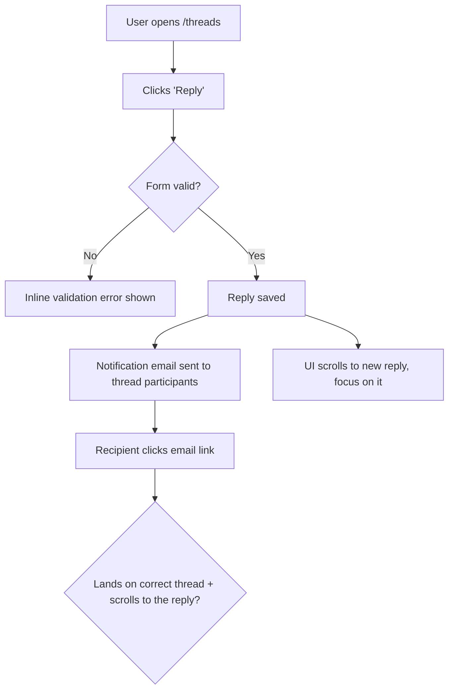

# Dogfood

Act as a QA engineer who dogfoods the **active JJ change stack** end-to-end: understand every change, test every change in a real browser as a user would, and fix what's broken — autonomously — until the stack is genuinely ready.

This is **diff-scoped**, not whole-app exploration. You test what *this change stack* introduced or modified versus the trunk.

## Use `agent-browser` Only For Browser Automation

This workflow drives the browser exclusively through the `agent-browser` CLI. Do not use Chrome MCP tools (`mcp__claude-in-chrome__*`), any browser MCP integration, or other built-in browser-control tools. If the platform offers multiple ways to control a browser, always choose `agent-browser`. Use the direct binary, never `npx agent-browser` (the direct binary uses the fast Rust client).

## Prerequisites

- A local dev server you can start (`bin/dev`, `rails server`, `npm run dev`, etc.).
- `agent-browser` installed. Check:

  ```bash
  command -v agent-browser >/dev/null 2>&1 && echo "Ready" || echo "NOT INSTALLED"
  ```

  If not installed, stop and tell the user to install `agent-browser` (run `/ce-setup` to print the current install command), then re-run this skill — this workflow cannot function without it.

## Reusing Skills

`ce-dogfood` is an orchestrator. Prefer delegating to existing skills over re-deriving their behavior:

| When | Skill | Why |
|------|-------|-----|
| Phase 0 isolation | `ce-worktree` | Run the dogfood in an isolated JJ workspace so the primary workspace stays clean. |
| A failure's root cause is non-obvious | `ce-debug` | Systematic root-cause analysis instead of guess-and-check. |
| Recording each fix as a JJ change | `ce-commit` | Keep each independently verifiable fix in its own change. |
| A bug reveals a reusable lesson | `ce-compound` | Capture the learning so the team compounds knowledge. |

## Workflow

```
0. Scope        Pick the stack, edit it (offer a workspace), never touch the trunk
1. Analyze      Diff the change stack vs trunk, understand every change
2. Map+Matrix   Map user flows as Mermaid flowcharts, then derive the test matrix as a task list
3. Serve        Detect port, start dev server, open agent-browser
4. Execute      Work the matrix one item at a time with agent-browser
5. Fix loop     On failure: fix -> add regression test -> record a JJ change -> continue
6. Report       Write durable doc to docs/dogfood-reports/ (flows, matrix, fixes, learnings, verdict)
```

### Phase 0: Scope and Edit the Right Change Stack

Parse `$ARGUMENTS`: a PR number, a bookmark name, or blank (use the current change stack ending at `@`). Strip `--port PORT` if present.

1. **Identify the target — keep PR identity; do not edit another revision yet.**
   - **PR number:** the target *is the PR* — carry the number through every later step (trunk check, isolation, revision selection). Read its head and base metadata with `gh pr view`; do **not** reduce it to a bare bookmark name because a fork PR's head can have the same name as an unrelated local bookmark. Do not edit it yet.
   - **Bookmark name:** the target is the revision at that local or remote bookmark. Use `jj bookmark list --all-remotes` to resolve it unambiguously.
   - **Blank:** the target is the current change stack ending at `@`.
2. **Refresh and inspect JJ state.** Run `jj git fetch` before resolving remote bookmarks, then use `jj status`, `jj log`, and `jj bookmark list --all-remotes` to identify the target revision and trunk. For a PR, use its `gh` metadata to select the correct fetched remote bookmark, including the contributor's remote for a fork; keep the PR number as its identity.
3. **Refuse to run without changes relative to trunk — bookmark/blank targets only.** If a *bookmark or blank* target resolves to trunk or `TRUNK..TARGET` is empty, stop — there is no diff to dogfood. A **PR is always diffable** against its declared base, so this check never rejects a PR merely because its head bookmark happens to be named `main` or `master`.
4. **Decide isolation by what you're testing; let `ce-worktree` own the JJ workspace mechanics.** Do not re-derive workspace detection or creation here — `ce-worktree` handles existing-isolation detection, the harness-native tool, and `jj workspace` operations, then reports its decision. The only decision this skill makes is whether to ask for isolation:
   - **Blank / current-stack target:** do **not** isolate — dogfood in place. You are already editing the stack under test, and fixes belong on top of it. If this is already a secondary JJ workspace, continue there.
   - **A PR or a different named bookmark:** offer isolation with the platform's blocking question tool. On **yes**, invoke `ce-worktree` for that exact target and act on its verdict. On **no**, confirm before replacing a non-empty working-copy change, then use `jj new <target-revision>` to create and edit a new working-copy change on the target in the current workspace. JJ has no active bookmark and no staging area; do not use checkout, switch, worktree, add, or staging workflows.
5. **Resume if a prior run exists.** Look for an existing report at `docs/dogfood-reports/*-<target-slug>-dogfood.md` (see the target-slug rule under Resumability). If one is found with unfinished scenarios, ask whether to resume it or start fresh. To resume, re-hydrate the task list from its matrix: `Pass`/`Fixed`/`Skipped` stay done; `Pending` and `in_progress` become the remaining auto-runnable work. The two `Blocked` states are **not** auto-runnable — `Blocked (needs human verify)` and `Blocked (human decision)` are waiting on a person, so surface them to the user and ask how to proceed rather than silently re-queuing them.

### Resumability (stop and return at any point)

This workflow is designed to be interrupted and resumed. Two pieces of state make that safe:

- **The task list** (the harness's task tool — `TaskCreate`/`TaskUpdate` on Claude Code, `update_plan` on Codex, or the equivalent elsewhere) is the live to-do — one task per matrix scenario. Mark each `in_progress` when you start it and `completed` only when it genuinely passes.
- **The report doc** at `docs/dogfood-reports/<YYYY-MM-DD>-<target-slug>-dogfood.md` is the durable checkpoint that survives across sessions. `<target-slug>` is the bookmark name, PR identifier, or current change ID lowercased with every run of non-alphanumeric characters collapsed to a single `-`. **Create it as soon as the matrix exists (end of Phase 2) by instantiating `references/dogfood-report-template.md`** (read that template now if you haven't) so the checkpoint carries the template-owned section shape from the start — then fill in every scenario at `Pending`, and **update it incrementally** after each scenario is judged and after each fix is recorded as a JJ change, not only at the end. An interrupted run must leave a template-shaped checkpoint, not a bare matrix.

Because tasks are session-scoped but the report doc is on disk, the report is the source of truth for resuming. Always keep the two in sync so a later run (or a teammate) can pick up exactly where this one stopped.

### Phase 1: Analyze Changes

Derive the trunk revision once, then read the complete JJ change stack and diff against it. First use `trunk()` only when JJ validates it. Otherwise resolve the GitHub base repository and default bookmark with `gh`, normalize its `owner/repo` identity and every URL from `jj git remote list` to the same canonical form, and require exactly one matching remote before using `<default-bookmark>@<base-remote>`. Treat zero matches as unable to resolve trunk and multiple matches as explicit ambiguity; never guess `main`, `master`, `origin`, or the first remote. For a fork PR, this base-repository match is only for the diff base: retain the contributor head remote selected in Phase 0 for the target. Set `TARGET` to the revision selected in Phase 0 (`@` for a blank target).

```bash
# Resolve once: a non-root trunk(), or the uniquely matched GitHub base remote.
TRUNK_COMMIT=$(jj log -r 'trunk() & ~root()' --no-graph -T 'commit_id ++ "\n"' 2>/dev/null || true)
if [ -n "$TRUNK_COMMIT" ] && [ "$(printf '%s\n' "$TRUNK_COMMIT" | wc -l | tr -d ' ')" -eq 1 ]; then
  TRUNK='trunk()'
else
  canonical_github_repo() {
    value=${1%.git}
    case "$value" in
      https://github.com/*) value=${value#https://github.com/} ;;
      http://github.com/*) value=${value#http://github.com/} ;;
      git@github.com:*) value=${value#git@github.com:} ;;
      ssh://git@github.com/*) value=${value#ssh://git@github.com/} ;;
      *) return 1 ;;
    esac
    printf '%s\n' "$value" | tr '[:upper:]' '[:lower:]'
  }

  if [ -n "${PR_NUMBER:-}" ]; then
    PR_URL=$(gh pr view "$PR_NUMBER" --json url -q .url) || exit 1
    BASE_REPO=${PR_URL#https://github.com/}
    BASE_REPO=${BASE_REPO%%/pull/*}
  else
    BASE_REPO=$(gh repo view --json nameWithOwner -q .nameWithOwner) || exit 1
  fi
  BASE_REPO=$(printf '%s\n' "$BASE_REPO" | tr '[:upper:]' '[:lower:]')
  DEFAULT=$(gh repo view "$BASE_REPO" --json defaultBranchRef -q .defaultBranchRef.name) || exit 1

  MATCHING_REMOTES=()
  while read -r remote url; do
    normalized=$(canonical_github_repo "$url") || continue
    [ "$normalized" = "$BASE_REPO" ] && MATCHING_REMOTES+=("$remote")
  done < <(jj git remote list)
  case ${#MATCHING_REMOTES[@]} in
    1) BASE_REMOTE=${MATCHING_REMOTES[0]} ;;
    0) echo "No JJ remote matches GitHub base $BASE_REPO" >&2; exit 1 ;;
    *) echo "Multiple JJ remotes match GitHub base $BASE_REPO: ${MATCHING_REMOTES[*]}" >&2; exit 1 ;;
  esac
  jj git fetch --remote "$BASE_REMOTE" --branch "$DEFAULT"
  TRUNK="$DEFAULT@$BASE_REMOTE"
  jj log -r "$TRUNK" --no-graph -T 'commit_id' >/dev/null 2>&1 || { echo "Unable to resolve the trunk bookmark" >&2; exit 1; }
fi
TARGET=${TARGET:-@}

jj status
jj bookmark list --all-remotes
jj log -r "$TRUNK..$TARGET"            # change stack and descriptions
jj diff --from "$TRUNK" --to "$TARGET" --summary
jj diff --from "$TRUNK" --to "$TARGET"
```

Build a mental model of every change: new features, modified behavior, new routes/views/components, touched data flows. Note anything that produces user-visible behavior — that is what the matrix must cover.

**Ground in the product's personas and vision.** Look for persona and vision context so flows can be judged from real users' eyes, not just "does it work." Check, in order: `STRATEGY.md` (its "Who it's for" section names the primary persona and their job-to-be-done), `VISION.md`, and any persona docs (e.g. `docs/personas/`, `PERSONAS.md`). Capture the 1-3 primary personas and what each cares about. If none exist, infer a reasonable primary persona from the product and the diff, and say so in the report.

### Phase 2: Map the Flows, Then Build the Matrix

Do not jump straight to a flat list of pages. First **understand the user flows the diff touches**, then derive the matrix from them. A matrix built without a flow model tests pages in isolation and misses the journey — the email that "sends" but lands in the wrong thread.

#### 2a. Map the user flows (required)

For every user-visible change, trace the **complete journey** end to end and draw it. Map each flow as a **Mermaid `flowchart`** so the journey is explicit and reviewable before any testing happens — entry point, each user action, branch points (success / validation error / empty / permission-denied), side effects (emails, jobs, notifications), and the true end state.

> Email example: it's not enough that "an email sends." Does it go to the *right* recipient? When the user clicks through, does the app land on and scroll to the *right* message? Does the content make sense? Does the whole flow align with the product's vision and UX? The flowchart must carry the click-through and its destination, not stop at "email sent."



Produce one flowchart per distinct journey, scaled to the diff: a one-route or copy-only change gets a single small flowchart, a multi-step feature gets several. Cover the happy path **and** the branch points (error, empty, boundary, permission). Mapping the flows before the matrix is never skipped — these diagrams ARE the understanding; they become the spine of the matrix and belong in the final report.

#### 2b. Derive the matrix from the flows

Walk each flowchart and turn every node and branch into one or more test scenarios. Read `references/test-matrix-taxonomy.md` for the full set of dimensions (journeys, functional checks, experiential checks, edge/error/empty states, accessibility, responsiveness). Cover both **functional** ("does it work?") and **experiential** ("does it feel right and align with the product?").

Map changed files to concrete routes (views -> their pages, components -> pages rendering them, layouts -> all pages, stylesheets -> visual regression on key pages) and attach those routes to the flows that exercise them.

**Load the matrix as a task list** (the harness's task tool, as above), one task per scenario, so progress is tracked and nothing is skipped. Order tasks by flow, following the flowcharts, not by file.

### Phase 3: Detect Port and Start the Dev Server

Determine the port (priority: explicit `--port` > a port explicitly stated in your in-context project instructions > `package.json` dev script > `.env*` `PORT=` > default `3000`). If a server is already listening on it, reuse it. Otherwise start the project's dev command (`bin/dev`, `rails server`, `npm run dev`, etc.) in the background and poll the port until it accepts connections before opening the browser. This skill is hands-off, so start the server automatically without asking — do not block on a confirmation.

```bash
agent-browser open "http://localhost:${PORT}"
agent-browser snapshot -i
```

### Phase 4: Execute the Matrix

Work the task list **one item at a time**. For each scenario, mark the task `in_progress`, then:

1. **Document** what you're testing (the journey and the expected outcome).
2. **Drive it** with agent-browser — navigate, snapshot for interactive refs, click, fill, submit, follow the journey to its real end state:

   ```bash
   agent-browser open "http://localhost:${PORT}/<route>"
   agent-browser snapshot -i
   agent-browser click @e1
   agent-browser fill @e2 "value"
   WORKSPACE_ROOT=$(jj workspace root 2>/dev/null || pwd)
    mkdir -p "$WORKSPACE_ROOT/.tmp/dogfood/screenshots"
    agent-browser screenshot "$WORKSPACE_ROOT/.tmp/dogfood/screenshots/<scenario>.png"
   agent-browser errors      # check console/page errors
   ```

   Write transient screenshots under `$(jj workspace root)/.tmp/dogfood/`; when no JJ repository is available, use `$(pwd)/.tmp/dogfood/`. Ensure the repository's ignore rules exclude `.tmp/` before creating files there; because JJ snapshots working-copy files automatically and has no staging area, use `jj file untrack` if `.tmp` was already tracked. Only copy a screenshot into the report's location if you intend to embed it in the final report.

3. **Judge** both correctness and experience: right data, right destination, sensible content, no console errors, and does it feel aligned with the product?
4. **Walk it as each persona.** Re-run the journey in your head from each primary persona's perspective (from Phase 1) and ask where they'd feel a **paper cut** — a small friction that wouldn't fail a functional test but degrades the experience: a confusing label, an extra click, an unexpected jump, a slow-feeling step, missing feedback, copy that doesn't match how that persona thinks. A scenario can be functionally `Pass` yet still carry paper cuts. Note each paper cut, which persona feels it, and its severity.
5. **Record** pass/fail plus any paper cuts, with specifics. Mark the task `completed` only when it genuinely passes. Paper cuts do not block a `Pass`, but a **sharp** paper cut (one severe enough to fix now) is routed into the Phase 5 fix loop just like a failure — apply the same auto-fix-vs-escalate judgment to it. Log the rest in the report.

**External-interaction flows** (OAuth, real email delivery, payments, SMS) can't be fully driven headlessly — pause, ask the user to verify that leg, and mark the scenario `Blocked (needs human verify)` until they confirm. Then continue.

### Phase 5: Fix Loop (Autonomous)

When a scenario fails — or a passing scenario carries a sharp paper cut worth fixing now — **fix it and prove it**, but first decide whether the fix is yours to make autonomously or a human's to decide.

**Judge the size of the fix before touching code.** Auto-fix when the change is small, well-understood, and low-risk: a clear bug with an obvious correct fix, contained to a few files, no schema/architecture/product trade-off. **Do not auto-fix** when the change is large or ambiguous — it requires an architectural or schema decision, changes product behavior or UX intent, spans many files, has plausible competing solutions, or you're not confident the "right" answer is unambiguous. Forcing a big judgment call autonomously is worse than escalating it.

**For autonomous fixes:**

1. Investigate the root cause. Use `jj file annotate <path>` when line history or ownership is relevant. If the cause is non-obvious, use `ce-debug`.
2. Apply the fix in the code.
3. **Add an automated regression test** that fails before the fix and passes after, so the bug can't return. This is the default for behavioral and code bugs. When an automated test is genuinely impractical — a pure copy, spacing, or visual fix with no behavioral assertion to make — substitute a documented browser-replay or screenshot check and **state in the report why no automated test was meaningful**. Do not invent a hollow test just to satisfy the step.
4. Record one logical fix as one JJ change with `ce-commit`; do not stage files because JJ automatically snapshots the working copy.

   Based on https://go.dev/wiki/CommitMessage and on past commit messages that you can see in `git log`, compose commit messages adherent to the present standards.

   The project's active runtime-local instructions and the commit-message style visible in actual `git log` take precedence over the Go guidance. Do not impose any fixed syntax, message, prefix, type, scope, subject/body shape, template, or example. If a bookmark must follow the completed fix, set it with `jj bookmark set <bookmark> -r @-` after `ce-commit`, and use `jj git push` only when the user has separately requested publishing.
5. Re-run the failing scenario in the browser to confirm it now passes; then continue the matrix.
6. If the bug carried a reusable lesson, capture it with `ce-compound`.

**For changes too big to make autonomously:** do not implement. Record it in the report's **Decisions for a human** section with: what's broken, why it's not a safe autonomous fix, the options you see (with trade-offs), and your recommendation. Mark the scenario `Blocked (human decision)` in the matrix, then continue with the rest. Never make a large, irreversible, or product-altering change just to clear a matrix item.

Keep iterating until every task is `completed` or in a terminal `Blocked` state — `Blocked (human decision)` (escalated here) or `Blocked (needs human verify)` (set in Phase 4 for external-interaction legs). Both are terminal for the loop: they wait on a person, so do not re-queue them. Re-test anything a fix might have affected (watch for regressions in adjacent journeys).

**Before declaring the change stack ready, run the project's automated test suite once** (the new regression tests plus everything that already exists). Discover the test command from the project's active instructions and conventions already in your context — do not assume a specific runner. Record the result in the report; a green matrix with a red suite is not "ready."

### Phase 6: Write the Report Artifact

The report doc was created at the end of Phase 2 and updated incrementally throughout (see Resumability). When the matrix is green (or every remaining item is explicitly blocked), **finalize** it at `docs/dogfood-reports/<YYYY-MM-DD>-<target-slug>-dogfood.md` in the repo under test, then surface a short summary in chat with the file path.

**Finalize against `references/dogfood-report-template.md`** — the same template the Phase 2 checkpoint was instantiated from, which owns the required sections and what each must carry. Confirm every template-owned section is present and complete; do not reconstruct the section list from memory, as that drifts from the template. Carry forward the cross-phase obligations this skill produced: the Mermaid flowcharts from Phase 2a, a matrix row per scenario with its JJ change ID, each fix's root cause and the regression test added (or why none was meaningful), paper cuts attributed by persona, learnings worth feeding to `ce-compound`, and a final readiness verdict that records the Phase 5 automated-suite result.
