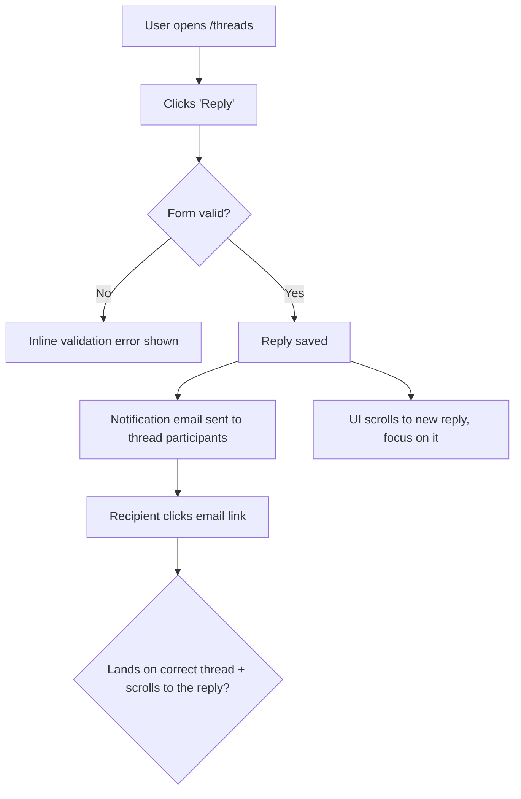

# Dogfood

Act as a QA engineer who dogfoods the **active JJ change stack** end-to-end: understand every change, test every change in a real browser as a user would, and fix what's broken — autonomously — until the stack is genuinely ready.

This is **diff-scoped**, not whole-app exploration. Test the cumulative tree diff from the trunk through the target revision, including working-copy changes when the target is `@`.

## Use `agent-browser` Only For Browser Automation

This workflow drives the browser exclusively through the `agent-browser` CLI. Do not use Chrome MCP tools (`mcp__claude-in-chrome__*`), any browser MCP integration, or other built-in browser-control tools. If the platform offers multiple ways to control a browser, always choose `agent-browser`. Use the direct binary, never `npx agent-browser` (the direct binary uses the fast Rust client).

## Prerequisites

**User-runnable invocation rendering.** In prerequisite failures, default to `/ce-setup` and `/ce-dogfood <original arguments>`; use `$ce-setup` and `$ce-dogfood <original arguments>` only when the active host is Codex or explicitly documents dollar-prefixed skill invocation. Render only each invocation as inline code and output one form only.

- A local dev server you can start (`bin/dev`, `rails server`, `npm run dev`, etc.).
- `agent-browser` installed. Check:

  ```bash
  command -v agent-browser >/dev/null 2>&1 && echo "Ready" || echo "NOT INSTALLED"
  ```

  If not installed, stop and tell the user to install `agent-browser`: print the rendered `ce-setup` invocation for the current install command, followed by the rendered `ce-dogfood <original arguments>` invocation to retry. This workflow cannot function without it.

## Artifact Root

This skill writes dogfood reports under `<root>/dogfood-reports/`. Resolve `<root>` when you first compose a `<root>/` path (per the block below), never before you need it. A write to `<root>/...` and a read of `<root>/solutions/` both count as composing a `<root>/` path, so either one triggers resolution; only a run that touches no `<root>/` path at all -- a scratch-only or no-repo flow -- skips it.

<!-- ce-docs-root:start -->
**Resolve the artifact root `<root>` before composing any artifact path.**

- **Read** `docs_root` from `<workspace-root>/.rocketclaw/config.local.yaml`, then `config.yaml`; first non-empty value wins (`<workspace-root>` = `jj workspace root`). Unset -> `<root>` is `docs`, exactly as before.
- **Validate** a set value: a workspace-relative directory whose real, symlink-resolved path stays inside the workspace and is neither the workspace root nor under `.jj/` or `.git/`. Otherwise stop with an error naming `docs_root` and the value -- never fall back to `docs`.
- **Use** `<root>` as the sole artifact location: create it if absent, compose each path as `<root>/<subdir>` with this skill's own subdirectory, and never also read `docs`.
<!-- ce-docs-root:end -->

## Reusing RocketClaw Skills

`ce-dogfood` is an orchestrator. Prefer delegating to existing skills over re-deriving their behavior:

| When | Skill | Why |
|------|-------|-----|
| Phase 0 isolation | `ce-worktree` | Run the dogfood in an isolated JJ workspace so other workspaces stay clean. |
| A failure's root cause is non-obvious | `ce-debug` | Systematic root-cause analysis instead of guess-and-check. |
| Recording each fix | `ce-commit` | Consistent, well-scoped JJ changes and descriptions. Based on https://go.dev/wiki/CommitMessage and on past commit messages that you can see in `git log`, compose commit messages adherent to the present standards. The mandated sentence's `git log` wording is not an operational instruction; inspect history with `jj log`. The project's active instructions and change-description syntax inferred from `jj log` take precedence. Preserve every semantic content requirement stated here while adapting syntax to runtime conventions. Apply compatible Go guidance only to quality, clarity, and structure; do not impose any fixed prefix, type, scope, subject, body, layout, template, or example. |
| A bug reveals a reusable lesson | `ce-compound` | Capture the learning so the team compounds knowledge. |

## Workflow

```
0. Scope        Pick the target, get onto it (offer a workspace), never edit the trunk
1. Analyze      Diff the target stack vs trunk, understand every change
2. Map+Matrix   Map user flows as Mermaid flowcharts, then derive the test matrix as a task list
3. Serve        Detect port, start dev server, open agent-browser
4. Execute      Work the matrix one item at a time with agent-browser
5. Fix loop     On failure: fix -> add regression test -> record a JJ change -> continue
6. Report       Write durable doc to <root>/dogfood-reports/ (flows, matrix, fixes, learnings, verdict)
```

### Phase 0: Scope and Get on the Right Revision

Parse the arguments you were invoked with: a PR number, a JJ bookmark/change/revision, or blank (use the current change stack ending at `@`). Strip `--port PORT` if present.

1. **Identify the target; retain PR identity and do not move the working copy yet.**
   - **PR number:** the target remains the PR through base detection, isolation, and revision resolution. Read its metadata with `gh pr view <number> --json headRefName,headRefOid,baseRefName,baseRepository,headRepository,isCrossRepository`; retain the head object ID, declared base, and both repository identities. Match each GitHub repository independently to normalized URLs from `jj git remote list`; remote names are configuration, never assumed. Do not reduce a fork PR to a bare bookmark because its head can be named `main` or `master`.
   - **Bookmark/change/revision:** resolve it with `jj log -r '<target>'`; retain both the user's selector and the resolved change ID.
   - **Blank:** the target is the current change stack ending at `@`.
2. **Refuse an empty target stack.** After resolving the trunk in Phase 1, use the revset `<trunk>..<target>` to verify that a bookmark/change/revision or blank target contains changes beyond the trunk. Stop when it does not. A PR remains diffable against its declared base, so never reject the rendered `ce-dogfood <number>` invocation merely because its head bookmark is named `main`.
3. **Decide isolation by what is being tested.**
   - **Blank/current-stack target:** do **not** isolate. Dogfood in place so fixes extend the stack under test. An already-isolated workspace is fine.
   - **A PR or another bookmark/change/revision:** offer isolation with the platform's blocking question tool. On **yes**, invoke `ce-worktree` for that exact target and continue at the isolated JJ workspace it reports; never switch another workspace.
   - **When the user declines isolation:** stay in the current JJ workspace. Inspect `jj status` and `jj log -r '@|@-'` before moving. Existing unrelated work must remain in its current change with its description and parentage intact; if it cannot be distinguished or preserved safely, stop and ask the user. Resolve a missing same-repository PR head with `jj git fetch --remote <head-remote> --branch <head-bookmark>`, where `<head-remote>` is the configured remote matched to the GitHub head repository. For a fork PR, use the GitHub metadata to construct its repository URL, reuse the matching configured remote when present, or add a uniquely named remote with `jj git remote add` when absent; then run `jj git fetch --remote <head-remote> --branch <head-bookmark>` and resolve the retained head object ID with `jj log`. Use `jj edit <target-revision>` only when intentionally continuing that exact change; otherwise use `jj new <target-revision>` so dogfood fixes are child changes. Confirm with `jj status` and `jj log` that `@` has the intended parent and that safeguarded work still exists. Do not use checkout, switch, or another VCS's workspace operations, and do not use a hosting CLI checkout shortcut.
4. **Resume if a prior run exists.** Look for an existing report at `<root>/dogfood-reports/*-<target-slug>-dogfood.md` (see the target-slug rule under Resumability). If one is found with unfinished scenarios, ask whether to resume it or start fresh. To resume, re-hydrate the task list from its matrix: `Pass`/`Fixed`/`Skipped` stay done; `Pending` and `in_progress` become the remaining auto-runnable work. The two `Blocked` states are **not** auto-runnable — `Blocked (needs human verify)` and `Blocked (human decision)` are waiting on a person, so surface them to the user and ask how to proceed rather than silently re-queuing them.

### Resumability (stop and return at any point)

This workflow is designed to be interrupted and resumed. Two pieces of state make that safe:

- **The task list** (the harness's task capability, using its provider namespace where required) is the live to-do — one task per matrix scenario. Mark each `in_progress` when you start it and `completed` only when it genuinely passes.
- **The report doc** at `<root>/dogfood-reports/<YYYY-MM-DD>-<target-slug>-dogfood.md` is the durable checkpoint that survives across sessions. Derive `<target-slug>` from the PR number, bookmark, or change ID: lowercase it and collapse every run of non-alphanumeric characters to one `-`. **Create it as soon as the matrix exists (end of Phase 2) by instantiating `references/dogfood-report-template.md`** (read that template now if you haven't) so the checkpoint carries the template-owned section shape from the start — then fill in every scenario at `Pending`, and **update it incrementally** after each scenario is judged and after each fix is recorded, not only at the end. An interrupted run must leave a template-shaped checkpoint, not a bare matrix.

Because tasks are session-scoped but the report doc is on disk, the report is the source of truth for resuming. Always keep the two in sync so a later run (or a teammate) can pick up exactly where this one stopped.

### Phase 1: Analyze Changes

Derive the trunk revision once, then read the cumulative tree diff from its common ancestor with the target through the target. This preserves triple-dot diff scope when the trunk has advanced. Do not hard-code `main`; repositories may use another default bookmark. Before using the command below, set `BASE_REMOTE` to the configured JJ remote matched to the PR's GitHub base repository; without a PR, match the GitHub repository selected by `gh repo view` to `jj git remote list`. Leave it empty only when no configured remote matches and a local trunk revision is sufficient.

```bash
# Resolve the trunk to an existing JJ revision. Prefer the PR's declared base,
# then GitHub's default name, then common names. Local bookmarks use `<name>`;
# remote bookmarks use `<name>@<base-remote>`, where the remote matches the
# GitHub base repository or the configured repository selected at runtime.
DEFAULT="${PR_BASE:-$(gh repo view --json defaultBranchRef -q .defaultBranchRef.name 2>/dev/null)}"
TRUNK=""
for cand in "$DEFAULT" main master; do
  [ -n "$cand" ] || continue
  if jj log -r "$cand" --no-graph -T 'commit_id ++ "\n"' >/dev/null 2>&1; then
    TRUNK=$cand; break
  elif [ -n "$BASE_REMOTE" ] && jj log -r "$cand@$BASE_REMOTE" --no-graph -T 'commit_id ++ "\n"' >/dev/null 2>&1; then
    TRUNK="$cand@$BASE_REMOTE"; break
  fi
done
[ -n "$TRUNK" ] || { printf '%s\n' 'Unable to resolve the trunk revision'; exit 1; }
TARGET="${TARGET_REVISION:-@}"
BASE="fork_point($TRUNK | $TARGET)"

jj log -r "$TRUNK..$TARGET"                    # revisions in the target stack
jj diff --from "$BASE" --to "$TARGET" --summary   # what changed
jj diff --from "$BASE" --to "$TARGET"             # how it changed
```

Build a mental model of every change: new features, modified behavior, new routes/views/components, touched data flows. Note anything that produces user-visible behavior — that is what the matrix must cover.

### Phase 2: Map the Flows, Then Build the Matrix

Do not jump straight to a flat list of pages. First **understand the user flows the diff touches**, then derive the matrix from them. A matrix built without a flow model tests pages in isolation and misses the journey — the email that "sends" but lands in the wrong thread.

#### 2a. Map the user flows (required)

For every user-visible change, trace the **complete journey** end to end and draw it. Map each flow as a **Mermaid `flowchart`** so the journey is explicit and reviewable before any testing happens — entry point, each user action, branch points (success / validation error / empty / permission-denied), side effects (emails, jobs, notifications), and the true end state.

It is not enough that an email sends. Verify the recipient, content, click-through destination, and focused or scrolled-to item. The flowchart must carry the click-through and its destination, not stop at "email sent."


```mermaid
flowchart TD
    A[User opens /threads] --> B[Clicks 'Reply']
    B --> C{Form valid?}
    C -->|No| D[Inline validation error shown]
    C -->|Yes| E[Reply saved]
    E --> F[Notification email sent to thread participants]
    E --> G[UI scrolls to new reply, focus on it]
    F --> H[Recipient clicks email link]
    H --> I{Lands on correct thread + scrolls to the reply?}
```

Produce one flowchart per distinct journey, scaled to the diff: a one-route or copy-only change gets a single small flowchart, a multi-step feature gets several. Cover the happy path **and** the branch points (error, empty, boundary, permission). Mapping the flows before the matrix is never skipped — these diagrams ARE the understanding; they become the spine of the matrix and belong in the final report.

#### 2b. Derive the matrix from the flows

Walk each flowchart and turn every node and branch into one or more test scenarios. Read `references/test-matrix-taxonomy.md` for the full set of dimensions (journeys, functional checks, experiential checks, edge/error/empty states, accessibility, responsiveness). Cover both **functional** ("does it work?") and **experiential** ("does it feel coherent with the existing UX?").

Map changed files to concrete routes (views -> their pages, components -> pages rendering them, layouts -> all pages, stylesheets -> visual regression on key pages) and attach those routes to the flows that exercise them.

**Load the matrix as a task list** (the harness's task tool, as above), one task per scenario, so progress is tracked and nothing is skipped. Order tasks by flow, following the flowcharts, not by file.

### Phase 3: Detect Port and Start the Dev Server

Determine the port (priority: explicit `--port` > a port explicitly stated in your in-context project instructions > `package.json` dev script > `.env*` `PORT=` > default `3000`). If a server is already listening on it, reuse it. Otherwise start the project's dev command (`bin/dev`, `rails server`, `npm run dev`, etc.) in the background and poll the port until it accepts connections before opening the browser. This skill is hands-off, so start the server automatically without asking — do not block on a confirmation.

```bash
agent-browser open "http://localhost:${PORT}"
agent-browser snapshot -i
```

### Phase 4: Execute the Matrix

Work the task list **one item at a time**. For each scenario, mark the task `in_progress`, then:

1. **Document** what you're testing (the journey and the expected outcome).
2. **Drive it** with agent-browser — navigate, snapshot for interactive refs, click, fill, submit, follow the journey to its real end state:

   ```bash
   agent-browser open "http://localhost:${PORT}/<route>"
   agent-browser snapshot -i
   agent-browser click @e1
   agent-browser fill @e2 "value"
   make_local_scratch() {
     local root="$1" path
     SCRATCH_DIR="$root/.tmp/rocketclaw/ce-dogfood/$RUN_ID"
     case "$SCRATCH_DIR" in
       "$root"/.tmp/rocketclaw/ce-dogfood/*) ;;
       *) return 1 ;;
     esac
     for path in "$root/.tmp" "$root/.tmp/rocketclaw" "$root/.tmp/rocketclaw/ce-dogfood" "$SCRATCH_DIR"; do
       [ ! -L "$path" ] || return 1
     done
     (umask 077 && mkdir -p "$SCRATCH_DIR") || return 1
   }
   RUN_ID="$(date -u +%Y%m%dT%H%M%SZ)-$$"
   WORKSPACE_ROOT="$(jj workspace root 2>/dev/null)" || WORKSPACE_ROOT=""
   LOCAL_ROOT="${WORKSPACE_ROOT:-$(pwd -P)}"
   SCRATCH_DIR=""
   make_local_scratch "$LOCAL_ROOT" || {
     printf '%s\n' 'Unable to create workspace-local .tmp/rocketclaw/ce-dogfood scratch space' >&2
     exit 1
   }
   agent-browser screenshot "$SCRATCH_DIR/<scenario>.png"
   agent-browser errors      # check console/page errors
   ```

   Write transient screenshots under `$(jj workspace root)/.tmp/rocketclaw/ce-dogfood/<run-id>/`. If there is no JJ repository, use `<current-directory>/.tmp/rocketclaw/ce-dogfood/<run-id>/`. Reject symlinked path components, never use OS-global temporary storage, and verify with `jj status` that the scratch path remains excluded from the working-copy change. If it appears, remove the scratch directory and stop rather than alter ignore rules. Only copy a screenshot into the report's location if it belongs in the final report.

3. **Judge** both correctness and experience: right data, right destination, sensible content, no console errors, and coherence with the existing UX.
4. **Record** pass/fail plus any paper cuts, with specifics. Mark the task `completed` only when it genuinely passes. Paper cuts do not block a `Pass`, but a **sharp** paper cut (one severe enough to fix now) is routed into the Phase 5 fix loop just like a failure — apply the same auto-fix-vs-escalate judgment to it. Log the rest in the report.

**External-interaction flows** (OAuth, real email delivery, payments, SMS) can't be fully driven headlessly — pause, ask the user to verify that leg, and mark the scenario `Blocked (needs human verify)` until they confirm. Then continue.

### Phase 5: Fix Loop (Autonomous)

When a scenario fails — or a passing scenario carries a sharp paper cut worth fixing now — **fix it and prove it**, but first decide whether the fix is yours to make autonomously or a human's to decide.

**Judge the size of the fix before touching code.** Auto-fix when the change is small, well-understood, and low-risk: a clear bug with an obvious correct fix, contained to a few files, with no schema, architecture, behavior, or UX trade-off. **Do not auto-fix** when the change is large or ambiguous — it requires an architectural or schema decision, changes intended behavior or UX, spans many files, has plausible competing solutions, or you're not confident the "right" answer is unambiguous. Forcing a big judgment call autonomously is worse than escalating it.

**For autonomous fixes:**

1. Investigate the root cause. If it's non-obvious, use `ce-debug`.
2. Apply the fix in the code.
3. **Add an automated regression test** that fails before the fix and passes after, so the bug can't return. This is the default for behavioral and code bugs. When an automated test is genuinely impractical — a pure copy, spacing, or visual fix with no behavioral assertion to make — substitute a documented browser-replay or screenshot check and **state in the report why no automated test was meaningful**. Do not invent a hollow test just to satisfy the step.
4. Record the fix as one logical JJ change with a clear description (use `ce-commit`). Based on https://go.dev/wiki/CommitMessage and on past commit messages that you can see in `git log`, compose commit messages adherent to the present standards. The mandated sentence's `git log` wording is not an operational instruction; inspect history with `jj log`. The project's active instructions and change-description syntax inferred from `jj log` take precedence. Preserve every semantic content requirement stated here while adapting syntax to runtime conventions. Apply compatible Go guidance only to quality, clarity, and structure; do not impose any fixed prefix, type, scope, subject, body, layout, template, or example.
5. Re-run the failing scenario in the browser to confirm it now passes; then continue the matrix.
6. If the bug carried a reusable lesson, capture it with `ce-compound`.

**For changes too big to make autonomously:** do not implement. Record it in the report's **Decisions for a human** section with: what's broken, why it's not a safe autonomous fix, the options you see (with trade-offs), and your recommendation. Mark the scenario `Blocked (human decision)` in the matrix, then continue with the rest. Never make a large, irreversible, or intent-altering change just to clear a matrix item.

Keep iterating until every task is `completed` or in a terminal `Blocked` state — `Blocked (human decision)` (escalated here) or `Blocked (needs human verify)` (set in Phase 4 for external-interaction legs). Both are terminal for the loop: they wait on a person, so do not re-queue them. Re-test anything a fix might have affected (watch for regressions in adjacent journeys).

**Before declaring the stack ready, run the project's automated test suite once** (the new regression tests plus everything that already exists). Discover the test command from the project's active instructions and conventions already in your context — do not assume a specific runner. Record the result in the report; a green matrix with a red suite is not "ready."

### Phase 6: Write the Report Artifact

The report doc was created at the end of Phase 2 and updated incrementally throughout (see Resumability). When the matrix is green (or every remaining item is explicitly blocked), **finalize** it at `<root>/dogfood-reports/<YYYY-MM-DD>-<target-slug>-dogfood.md` in the workspace under test, then surface a short summary in chat with the file path.

**Finalize against `references/dogfood-report-template.md`** — the same template the Phase 2 checkpoint was instantiated from, which owns the required sections and what each must carry. Confirm every template-owned section is present and complete; do not reconstruct the section list from memory, as that drifts from the template. Carry forward the cross-phase obligations this skill produced: the Mermaid flowcharts from Phase 2a, a matrix row per scenario with its JJ change ID, each fix's root cause and the regression test added (or why none was meaningful), paper cuts, learnings worth feeding to `ce-compound`, and a final readiness verdict that records the Phase 5 automated-suite result.
