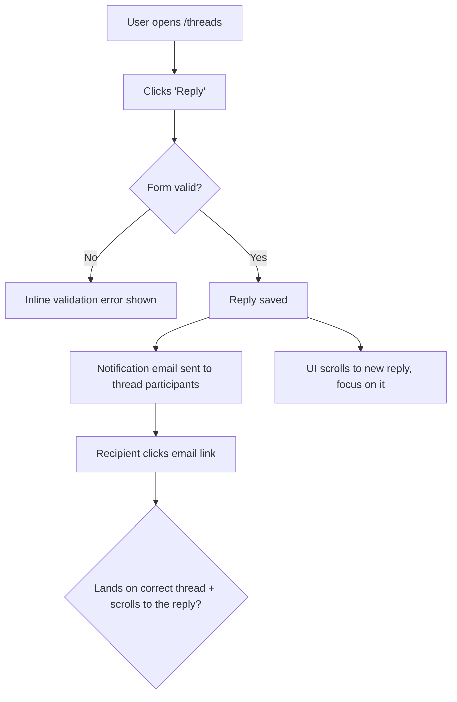

# Dogfood phases 0-6

Required read before Phase 0. Full detail for every phase; the skill body carries the outcome, the boundaries, the phase order, and the terminal states.

### Phase 0: Scope and Select the Right Change

Parse the arguments you were invoked with: a PR number, a bookmark name, or blank (use the current JJ change). Strip `--port PORT` if present.

1. **Identify the target without moving the working copy.**
   - **PR number:** keep the PR number as the target identity through base selection and isolation. Read its operational provider refs with `gh pr view <number> --json headRefName,headRefOid,baseRefName,baseRefOid,isCrossRepository`; do not reduce a fork PR to its head ref name.
   - **Bookmark name:** resolve that local or remote bookmark as the target revision.
   - **Blank:** use the current working-copy change `@` and derive its stable change ID for the report slug.
2. **Refuse a non-PR target with no revisions beyond trunk.** Resolve the repository's default provider ref with `gh repo view --json defaultBranchRef -q .defaultBranchRef.name`, then resolve the matching local bookmark or `<name>@origin` remote bookmark with JJ. A PR remains diffable through its base and head object IDs even when either provider ref is named `main`.
3. **Isolate without moving the primary JJ workspace.** A blank or already-current target runs in place. For a PR or another named bookmark, offer isolation with the platform's blocking question capability. Route the request through `ce-worktree` when it supports JJ; otherwise create a sibling workspace with `jj workspace add -r <target> <destination>` and work in that workspace. If isolation is declined, create a new working-copy change on the target with `jj new <target>`; JJ preserves the previous change. For a PR whose object IDs are not present locally, use `gh pr checkout <number>` only inside an isolated colocated workspace, then run `jj git import` before resolving the target in JJ. If no such workspace is available, stop with the unresolved PR object instead of moving the primary workspace.
4. **Resume if a prior run exists.** Look for an existing report at `<root>/dogfood-reports/*-<target-slug>-dogfood.md` (see the target-slug rule under Resumability). If one is found with unfinished scenarios, ask whether to resume it or start fresh. To resume, re-hydrate the task list from its matrix: `Pass`/`Fixed`/`Skipped` stay done; `Pending` and `in_progress` become the remaining auto-runnable work. The two `Blocked` states are **not** auto-runnable — `Blocked (needs human verify)` and `Blocked (human decision)` are waiting on a person, so surface them to the user and ask how to proceed rather than silently re-queuing them.

### Resumability (stop and return at any point)

This workflow is designed to be interrupted and resumed. Two pieces of state make that safe:

- **The task list** (the harness's task tool — `TaskCreate`/`TaskUpdate` on Claude Code, `update_plan` on Codex, or the equivalent elsewhere) is the live to-do — one task per matrix scenario. Mark each `in_progress` when you start it and `completed` only when it genuinely passes.
- **The report doc** at `<root>/dogfood-reports/<YYYY-MM-DD>-<target-slug>-dogfood.md` is the durable checkpoint that survives across sessions. `<target-slug>` is the PR number, bookmark name, or current stable change ID lowercased with every run of non-alphanumeric characters collapsed to a single `-`. **Create it as soon as the matrix exists (end of Phase 2) by instantiating `references/dogfood-report-template.md`** (read that template now if you haven't) so the checkpoint carries the template-owned section shape from the start — then fill in every scenario at `Pending`, and **update it incrementally** after each scenario is judged and each fix is finalized. An interrupted run must leave a template-shaped checkpoint, not a bare matrix.

Because tasks are session-scoped but the report doc is on disk, the report is the source of truth for resuming. Always keep the two in sync so a later run (or a teammate) can pick up exactly where this one stopped.

### Phase 1: Analyze Changes

Derive the trunk revision once, then read the full target change against it. Do not hard-code a bookmark name; resolve the runtime repository's default provider ref and use the corresponding JJ bookmark.

Use `gh pr view`'s `baseRefOid` for a PR base. Otherwise use `gh repo view`'s `defaultBranchRef.name`, preferring the corresponding local JJ bookmark and then `<name>@origin`; refresh remote bookmarks with `jj git fetch --remote origin` when the expected provider ref is absent. Stop with the unresolved ref instead of guessing a trunk.

```bash
jj diff --from <trunk-revision> --to <target-revision> --name-only
jj diff --from <trunk-revision> --to <target-revision>
```

Build a mental model of every change: new features, modified behavior, new routes/views/components, touched data flows. Note anything that produces user-visible behavior — that is what the matrix must cover.

**Ground in the product's personas and vision.** Look for persona and vision context so flows can be judged from real users' eyes, not just "does it work." Check, in order: `STRATEGY.md` (its "Users" section — "Who it's for" in older files — names the primary persona and their job-to-be-done), `PRODUCT.md` (its "Users" section), `VISION.md`, and any persona docs (e.g. `<root>/personas/`, `PERSONAS.md`). Capture the 1-3 primary personas and what each cares about. If none exist, infer a reasonable primary persona from the product and the diff, and say so in the report.

### Phase 2: Map the Flows, Then Build the Matrix

Do not jump straight to a flat list of pages. First **understand the user flows the diff touches**, then derive the matrix from them. A matrix built without a flow model tests pages in isolation and misses the journey — the email that "sends" but lands in the wrong thread.

#### 2a. Map the user flows (required)

For every user-visible change, trace the **complete journey** end to end and draw it. Map each flow as a **Mermaid `flowchart`** so the journey is explicit and reviewable before any testing happens — entry point, each user action, branch points (success / validation error / empty / permission-denied), side effects (emails, jobs, notifications), and the true end state.

> Email example: it's not enough that "an email sends." Does it go to the *right* recipient? When the user clicks through, does the app land on and scroll to the *right* message? Does the content make sense? Does the whole flow align with the product's vision and UX? The flowchart must carry the click-through and its destination, not stop at "email sent."



Produce one flowchart per distinct journey, scaled to the diff: a one-route or copy-only change gets a single small flowchart, a multi-step feature gets several. Cover the happy path **and** the branch points (error, empty, boundary, permission). Mapping the flows before the matrix is never skipped — these diagrams ARE the understanding; they become the spine of the matrix and belong in the final report.

#### 2b. Derive the matrix from the flows

Walk each flowchart and turn every node and branch into one or more test scenarios. Read `references/test-matrix-taxonomy.md` for the full set of dimensions (journeys, functional checks, experiential checks, edge/error/empty states, accessibility, responsiveness). Cover both **functional** ("does it work?") and **experiential** ("does it feel right and align with the product?").

Map changed files to concrete routes (views -> their pages, components -> pages rendering them, layouts -> all pages, stylesheets -> visual regression on key pages) and attach those routes to the flows that exercise them.

**Load the matrix as a task list** (the harness's task tool, as above), one task per scenario, so progress is tracked and nothing is skipped. Order tasks by flow, following the flowcharts, not by file.

### Phase 3: Detect Port and Start the Dev Server

Determine the port (priority: explicit `--port` > a port explicitly stated in your in-context project instructions > `package.json` dev script > `.env*` `PORT=` > default `3000`). If a server is already listening on it, reuse it. Otherwise start the project's dev command (`bin/dev`, `rails server`, `npm run dev`, etc.) in the background and poll the port until it accepts connections before opening the browser. This skill is hands-off, so start the server automatically without asking — do not block on a confirmation.

```bash
agent-browser open "http://localhost:${PORT}"
agent-browser snapshot -i
```

### Phase 4: Execute the Matrix

Work the task list **one item at a time**. For each scenario, mark the task `in_progress`, then:

1. **Document** what you're testing (the journey and the expected outcome).
2. **Drive it** with agent-browser — navigate, snapshot for interactive refs, click, fill, submit, follow the journey to its real end state:

   ```bash
   agent-browser open "http://localhost:${PORT}/<route>"
   agent-browser snapshot -i
   agent-browser click @e1
   agent-browser fill @e2 "value"
   WORKSPACE_ROOT="$(jj workspace root 2>/dev/null)" || WORKSPACE_ROOT="."
   SCRATCH_DIR="$WORKSPACE_ROOT/.tmp/rocketclaw/dogfood/<run-id>"
   mkdir -p "$SCRATCH_DIR"
   agent-browser screenshot "$SCRATCH_DIR/<scenario>.png"
   agent-browser errors      # check console/page errors
   ```

   Write transient screenshots under the current JJ workspace's `.tmp/rocketclaw/dogfood/<run-id>/`. If `jj workspace root` is unavailable, use the local `./.tmp/rocketclaw/dogfood/<run-id>/` path. Only copy a screenshot into the report's location if you intend to embed it in the final report.

3. **Judge** both correctness and experience: right data, right destination, sensible content, no console errors, and does it feel aligned with the product?
4. **Walk it as each persona.** Re-run the journey in your head from each primary persona's perspective (from Phase 1) and ask where they'd feel a **paper cut** — a small friction that wouldn't fail a functional test but degrades the experience: a confusing label, an extra click, an unexpected jump, a slow-feeling step, missing feedback, copy that doesn't match how that persona thinks. A scenario can be functionally `Pass` yet still carry paper cuts. Note each paper cut, which persona feels it, and its severity.
5. **Record** pass/fail plus any paper cuts, with specifics. Mark the task `completed` only when it genuinely passes. Paper cuts do not block a `Pass`, but a **sharp** paper cut (one severe enough to fix now) is routed into the Phase 5 fix loop just like a failure — apply the same auto-fix-vs-escalate judgment to it. Log the rest in the report.

**External-interaction flows** (OAuth, real email delivery, payments, SMS) can't be fully driven headlessly — pause, ask the user to verify that leg, and mark the scenario `Blocked (needs human verify)` until they confirm. Then continue.

### Phase 5: Fix Loop (Autonomous)

When a scenario fails — or a passing scenario carries a sharp paper cut worth fixing now — **fix it and prove it**, but first decide whether the fix is yours to make autonomously or a human's to decide.

**Judge the size of the fix before touching code.** Auto-fix when the change is small, well-understood, and low-risk: a clear bug with an obvious correct fix, contained to a few files, no schema/architecture/product trade-off. **Do not auto-fix** when the change is large or ambiguous — it requires an architectural or schema decision, changes product behavior or UX intent, spans many files, has plausible competing solutions, or you're not confident the "right" answer is unambiguous. Forcing a big judgment call autonomously is worse than escalating it.

**For autonomous fixes:**

1. Investigate the root cause. If it's non-obvious, use `ce-debug`.
2. Apply the fix in the code.
3. **Add an automated regression test** that fails before the fix and passes after, so the bug can't return. This is the default for behavioral and code bugs. When an automated test is genuinely impractical — a pure copy, spacing, or visual fix with no behavioral assertion to make — substitute a documented browser-replay or screenshot check and **state in the report why no automated test was meaningful**. Do not invent a hollow test just to satisfy the step.
4. Finalize the fix as one logical JJ change with a clear description, using `ce-commit` for the routed operation. Based on https://go.dev/wiki/CommitMessage and on past commit messages that you can see in `git log`, compose commit messages adherent to the present standards. The runtime project's syntax and conventions win; apply Go quality guidance only where compatible, without imposing a fixed syntax or template.
5. Re-run the failing scenario in the browser to confirm it now passes; then continue the matrix.
6. If the bug carried a reusable lesson, capture it with `ce-compound`.

**For changes too big to make autonomously:** do not implement. Record it in the report's **Decisions for a human** section with: what's broken, why it's not a safe autonomous fix, the options you see (with trade-offs), and your recommendation. Mark the scenario `Blocked (human decision)` in the matrix, then continue with the rest. Never make a large, irreversible, or product-altering change just to clear a matrix item.

Keep iterating until every task is `completed` or in a terminal `Blocked` state — `Blocked (human decision)` (escalated here) or `Blocked (needs human verify)` (set in Phase 4 for external-interaction legs). Both are terminal for the loop: they wait on a person, so do not re-queue them. Re-test anything a fix might have affected (watch for regressions in adjacent journeys).

**Before declaring the target change ready, run the project's automated test suite once** (the new regression tests plus everything that already exists). Discover the test command from the project's active instructions and conventions already in your context — do not assume a specific runner. Record the result in the report; a green matrix with a red suite is not "ready."

### Phase 6: Write the Report Artifact

The report doc was created at the end of Phase 2 and updated incrementally throughout (see Resumability). When the matrix is green (or every remaining item is explicitly blocked), **finalize** it at `<root>/dogfood-reports/<YYYY-MM-DD>-<target-slug>-dogfood.md` in the repo under test, then surface a short summary in chat with the file path.

**Finalize against `references/dogfood-report-template.md`** — the same template the Phase 2 checkpoint was instantiated from, which owns the required sections and what each must carry. Confirm every template-owned section is present and complete; do not reconstruct the section list from memory, as that drifts from the template. Carry forward the cross-phase obligations this skill produced: the Mermaid flowcharts from Phase 2a, a matrix row per scenario with its JJ change ID, each fix's root cause and the regression test added (or why none was meaningful), paper cuts attributed by persona, learnings worth feeding to `ce-compound`, and a final readiness verdict that records the Phase 5 automated-suite result.
