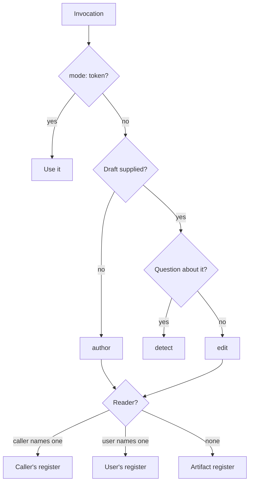

# ce-noslop writing skill - Plan

## Goal Capsule

- **Objective:** Prose the plugin produces, in chat and in artifacts, reads without AI tells and is understood on the first read, and a user can hand the agent any text and get the same result.
- **Means:** One skill, `ce-noslop`, that sibling skills invoke at their composition point and users invoke on demand (KTD1, KTD2).
- **Authority:** The session decisions recorded as Key Decisions and labeled KTDs outrank research defaults. Repo conventions in the active instructions outrank both where they conflict on mechanics.
- **Execution profile:** Seven units, one PR. Invoke `ce-skill-work` before creating or editing any file under `skills/`. Tests change in the same commit as the prose they pin.
- **Stop conditions:** Stop and surface if the kernel cannot state author mode under 4 KB without a word list, if a sibling's removed block turns out to carry a domain rule its own tests pin, or if the cross-host eval shows a sibling writing worse prose after consolidation.
- **Tail ownership:** The invoking pipeline owns simplify, review, commit, PR, and CI.

---

## Product Contract

### Summary

Add `ce-noslop`, a skill with two goals of equal weight: the writing carries no AI tells, and a person understands it on the first read, technical writing included. Sibling skills that compose prose invoke it where they write, and their duplicated generic style blocks are removed. A standing instruction, offered by `ce-setup`, covers the agent's own chat replies. Users invoke it directly to edit, detect, or draft.

### Problem Frame

The plugin already fights machine-sounding prose, but in scattered copies that drift on their own. Three near-identical Simplified Technical English blocks live in the PR-writing, review-finishing, and document-review references. Two near-identical prose-economy blocks live in the plan and brainstorm section contracts. `ce-promote` carries the only AI-tell strip list and `ce-resolve-pr-feedback` the only natural-voice rule. Nothing covers chat narration. Older plans cite an "AGENTS.md writing-style rules" section that no longer exists, which is how the copies came to be.

Absent everywhere: any rule about em dashes, "not X but Y" framing, colon reveals, setup-reversal copy, interpretive metadiscourse, chatbot closers, or sycophancy. Those are the tells that remain in current frontier output after the 2023-era vocabulary was trained out. Structure gives AI prose away more reliably than vocabulary now.

### Key Decisions

- **Siblings invoke the skill; no copied floor files.** (session-settled: user-directed — chosen over byte-identical copies with a parity test: skill-to-skill invocation is the sanctioned sharing mechanism; the file-reference ban covers path traversal only.) Governs R7, R8.
- **The skill stays model-invokable; the description carries the restraint.** (session-settled: user-directed — chosen over the per-host opt-out flags: an empirical run on Claude Code, Codex, and Grok showed the flags block sibling invocation on every host.) Governs R2, R7.
- **Understandability is an equal goal with removing tells.** (session-settled: user-directed — chosen over a tells-only editor: technical writing that is free of tells but still dense has failed.) Governs R1, R4.
- **Rules, not a state machine.** (session-settled: user-directed — chosen over a scrubbing procedure: the kernel states conditions and the catalog states numbered rules; neither prescribes an edit sequence.) Governs R4, R5.
- **No external skill or project is named in this plan, the commits, or the PR.** (session-settled: user-directed.) Governs R14.

### Requirements

**Skill shape**

- R1. `ce-noslop` is a user-facing, model-invokable skill under `skills/ce-noslop/` whose `SKILL.md` kernel stays under 4 KB and is enough on its own for author mode.
- R2. The description names the mechanism first and states the trigger as a condition on the work, not a universal must-apply rule, so the skill fires when a user or sibling names it or hands it text to fix, and not on every prose-shaped prompt.
- R3. Three modes, chosen from a `mode:` token or inferred from the request: **author** (no draft; constraints load and the caller writes; the skill drafts only when handed content), **edit** (a draft, pasted or a file; rewrite and return), **detect** (name each pattern with the quoted line and a short fix; no rewrite). No token and no draft means author; an imperative on a draft means edit; a question about a draft means detect.
- R4. The kernel states tests, not words: mechanism (what the thing does, not how it feels), portability (could it move to another project unchanged), actor (who does the verb), one idea per sentence, density (several tells in one passage, not one), decision first, and the reader test (someone without the document or code open can act on it).
- R5. `references/patterns.md` holds the rule catalog as a numbered list with stable numbers that other skills may cite; a removed rule leaves a gap. It covers content, language, style, chat artifacts, filler, jargon, and plain speech, each rule one or two sentences with the fix.
- R6. Three registers, keyed on who reads the result and stated as conditions: agent reporting to the user (lead with the outcome, no acknowledgements, no offers of more help, nothing about the agent's process), repo or team artifact (neutral, match the surrounding document's idiom, no first person), the user's own writing (preserve voice, minimum effective edit). No stated reader and no caller context means the artifact register. A caller's own interaction contract wins over a register rule.

**Distribution**

- R7. Each sibling in the consolidation set invokes `ce-noslop` in author mode at the point where it composes prose, stated as one line at that point. The set: `ce-commit-push-pr`, `ce-code-review`, `ce-plan`, `ce-brainstorm`, `ce-promote`, `ce-resolve-pr-feedback`.
- R8. Each sibling that owns a presentation contract gains a one-line pointer and keeps its contract intact: `ce-doc-review`'s rendering floor, `ce-pov`'s output economy, `ce-babysit-pr`'s report rules.
- R9. The generic blocks named in the Problem Frame are deleted from the consolidation set. Domain rules stay: commit subject form, the PR value-first lead and tracker-ID wording, requirement and unit sentence shape, review severity vocabulary, per-channel register in `ce-promote`, the `needs-human` reply example in `ce-resolve-pr-feedback`, and `ce-explain`'s audience voice block.
- R10. `ce-setup` offers a standing instruction for chat replies as a new step beside its compounding-directive offer, inserted verbatim from a bundled asset, skipped when the instruction file already carries one in any wording.

**Safety**

- R11. Never add a fact, number, name, quote, or citation the source or caller did not supply, and never drop a claim. A repeated edit on the same text is a no-op.
- R12. Never touch code blocks, quoted text, frontmatter, link targets, identifiers, or a token a caller's contract requires, unless the user names that content as the thing to fix. When nothing editable remains, say so instead of returning the input silently.
- R13. Edit mode returns the rewritten text and a one-line summary of what changed. It writes a named file in place only when the user asks for that.

**Inventory**

- R14. The change ships with `docs/guides/ce-noslop.md`, a catalog row in `docs/guides/README.md`, the root `README.md` group row and its three count bumps, the skill-count bump in `tests/release-metadata.test.ts`, and no mention of any external skill or project.

### Success Criteria

- A PR body composed by `ce-commit-push-pr` after this change reads at least as well as before to an independent grader on Claude Code, Codex, and Grok, with every claim preserved.
- A dense technical paragraph handed to edit mode comes back with shorter sentences and every claim intact.
- A draft with one em dash and one triad comes back unchanged.

### Scope Boundaries

- The `markdown-rendering.md` and `html-rendering.md` triplets stay as they are. They are rendering contracts, not prose rules.
- `ce-explain`'s duplicated voice block stays; it is an audience rule.
- The skill never says whether text was AI-written.

#### Deferred to Follow-Up Work

- Invocation points in `ce-handoff`, `ce-compound`, `ce-ideate`, `ce-strategy`, and `ce-explain` artifacts.
- A parity test that catches a sibling re-growing a local style block.

### Open Questions

- Deferred: whether a non-English draft gets the catalog or only the kernel tests. Default: kernel tests apply to any language; catalog rules fire only on English.

---

## Planning Contract

### Key Technical Decisions

- KTD1. **Invocation, not copies.** Siblings invoke `ce-noslop` through the harness skill mechanism (Claude Code Skill tool; Codex and Grok read the catalog-listed SKILL.md). (session-settled: user-directed — chosen over byte-identical reference copies: invocation is how `lfg`, `ce-work`, and `ce-debug` already reach `ce-simplify-code`, and it keeps one source with no fan-out.) Cost: one small kernel joins the combined skill budget per composing run, which is why R1 caps it.
- KTD2. **No opt-out flags.** No `disable-model-invocation`, no `policy.allow_implicit_invocation: false`, no `agents/openai.yaml` policy block. (session-settled: user-directed — chosen over explicit-invoke-only: measured on 2026-09-07, the flags make the target unreachable from a sibling on all three hosts.) Restraint comes from R2's description condition.
- KTD3. **Kernel plus one catalog.** `SKILL.md` carries modes, registers, the seven tests, and the safety invariants. `references/patterns.md` carries the numbered catalog and is read in edit and detect mode, or when author mode meets a passage the tests alone do not settle. A second reference for registers is not needed; they fit in the kernel.
- KTD4. **Author mode is silent constraints.** When a sibling invokes the skill with no draft, the skill loads and the caller keeps writing under its own contract. The skill drafts text itself only when handed content and asked to write. This keeps every domain rule with its owner.
- KTD5. **Standing instruction owned by `ce-setup`.** The chat register cannot be enforced by a skill that is not in context, so the always-on path is an instruction file line, offered the way the compounding directive is offered, from `skills/ce-setup/assets/`.
- KTD6. **Test pins move with the prose.** `tests/commit-push-pr-contract.test.ts` pins the STE substrings being removed; `tests/skills/unified-plan-artifact-contract.test.ts` slices on the `## Prose economy` heading; `tests/review-skill-contract.test.ts` pins "do not paste file contents". The heading and the pinned domain lines stay; the STE pin becomes an invocation-presence pin.

### High-Level Technical Design

Mode and register resolution, the one part of the kernel with branching:

Distribution after the change: six composing skills invoke `ce-noslop`; three presentation-contract skills point at it; `ce-setup` writes the chat instruction; the user invokes it directly for edit and detect.

### Assumptions

- The Codex per-skill 8000-byte injection and the Claude Code 25,000-token combined budget are the only size bounds that matter; a 4 KB kernel clears both with room.
- `ce-skill-work`'s description rules are the repo's current standard for R2.

---

## Implementation Units

### U1. Create the skill

- **Goal:** `skills/ce-noslop/` exists with a kernel, a catalog, and a description that fires on the right work.
- **Requirements:** R1, R2, R3, R4, R5, R6, R11, R12, R13. KTD2, KTD3, KTD4.
- **Dependencies:** none.
- **Files:** `skills/ce-noslop/SKILL.md`, `skills/ce-noslop/references/patterns.md`.
- **Approach:**
  1. Model the kernel on the smallest shipped skills with a references dir (`skills/ce-polish/SKILL.md`, `skills/ce-test-xcode/SKILL.md`): frontmatter, one-paragraph outcome, Done, Boundaries, then the modes, registers, tests, and invariants.
  2. Write the description per `ce-skill-work`: sentence one names the mechanism (a writing floor that removes AI tells and makes prose understandable), then one "Use when" per branch (a skill or user names it; text handed over to fix or check), then a "Use `ce-promote` for" or "Not for" only where the same words fire a sibling. No "always apply" clause.
  3. Write `patterns.md` as numbered rules with the fix in the same line, grouped by content, language, style, chat artifacts, filler, jargon, plain speech. Include the inline-header nuance: a bold lead-in followed by new detail stays; a label that restates its line is the tell. Include the false-positive floor: one device alone is not a finding.
  4. Keep the kernel free of word lists; the tests in R4 do that work.
- **Patterns to follow:** `skills/ce-compound/SKILL.md` for `mode:` token parsing with inferred-intent fallback.
- **Test scenarios:**
  - Kernel byte size is under 4096 after CRLF adjustment.
  - Frontmatter has `name` and `description` only, plus `argument-hint`; no `disable-model-invocation`, no `policy` key.
  - Description contains no "always" and names both mechanism halves.
  - `patterns.md` rule numbers are contiguous or gap-only, never renumbered.
- **Verification:** `bun run test` passes the new and existing skill-convention suites; the description reads as a condition, not a catalog.

### U2. Mechanical guards

- **Goal:** The kernel bound, the invocation points, and the removed blocks are enforced by `bun test`.
- **Requirements:** R1, R7, R8, R9. KTD6.
- **Dependencies:** U1.
- **Files:** `tests/skills/ce-noslop-contract.test.ts` (new), `tests/commit-push-pr-contract.test.ts`, `tests/skills/unified-plan-artifact-contract.test.ts`, `tests/review-skill-contract.test.ts`.
- **Approach:**
  1. New suite: kernel size; every R7 sibling file contains an invocation of `ce-noslop` at its composition point; every R8 file contains the pointer; none of the removed STE or strip-list substrings survive in the R9 files.
  2. Replace the STE substring pin in the PR-writing test with the invocation-presence pin.
  3. Leave the `## Prose economy` heading slice and the "do not paste file contents" pin as they are; U3 keeps those lines.
- **Patterns to follow:** `tests/skills/ce-doc-review-rendering-floor.test.ts` for surface-references-floor assertions; `tests/codex-skill-prompt-budget.test.ts` for CRLF-adjusted byte checks.
- **Test scenarios:**
  - A sibling with its invocation line removed fails the suite.
  - A kernel padded past 4096 bytes fails.
  - The old STE paragraph restored in `pr-description-writing.md` fails.
- **Verification:** `bun run test` green with the new file listed in the run.

### U3. Consolidate sibling prose rules

- **Goal:** The six composing skills invoke `ce-noslop` and carry only domain rules; the three presentation-contract skills point at it.
- **Requirements:** R7, R8, R9. KTD1, KTD4, KTD6.
- **Dependencies:** U1.
- **Files:** `skills/ce-commit-push-pr/references/pr-description-writing.md`, `skills/ce-code-review/references/finish-review.md`, `skills/ce-plan/references/plan-sections.md`, `skills/ce-brainstorm/references/brainstorm-sections.md`, `skills/ce-promote/SKILL.md`, `skills/ce-resolve-pr-feedback/references/evaluation-rubric.md`, `skills/ce-doc-review/references/rendering-floor.md`, `skills/ce-pov/references/method.md`, `skills/ce-babysit-pr/references/report.md`.
- **Approach:**
  1. In each R7 file, replace the generic block with one line at the composition point: invoke `ce-noslop` in author mode, then write under the file's own remaining rules. Keep the domain lines R9 names.
  2. In `plan-sections.md` and `brainstorm-sections.md`, keep the `## Prose economy` heading and the plan-specific rules (requirement and unit shape, resolve in place, one owner per rule); remove the STE and hedge-list paragraphs.
  3. In `ce-promote`, keep per-channel register and hook rules; drop the strip list.
  4. In the R8 files, add the pointer and change nothing else.
  5. Invoke `ce-skill-work` in edit mode for every file; provenance-check each removed line against tests and `docs/solutions/` before deleting.
- **Patterns to follow:** the way `lfg` names `ce-simplify-code` at its step (`skills/lfg/SKILL.md`).
- **Test scenarios:**
  - Covered by U2's suite plus existing pins: `bun run test` after the edit.
  - Each edited file still passes `tests/skill-shell-safety.test.ts` and the Codex byte bound.
- **Verification:** U2 suite green; a read of each edited composition point shows one invocation line and no orphaned rule fragments.

### U4. Standing-instruction offer in ce-setup

- **Goal:** `ce-setup` offers the chat-register instruction the same way it offers the compounding directive.
- **Requirements:** R10. KTD5.
- **Dependencies:** U1.
- **Files:** `skills/ce-setup/references/repo-fixes.md`, `skills/ce-setup/assets/noslop-directive.md` (new), `tests/ce-setup-instruction-file-offers.test.ts`, `docs/guides/ce-setup.md`.
- **Approach:**
  1. Add a step beside the compounding-directive step: preview placement, semantic already-present check, verbatim insert from the asset, skip when the instruction file is absent.
  2. The asset text keys on the boundary (a user-facing report, summary, or handoff about to be written), names the exclusions (code, config, verbatim quotes, text the user asked to post as written), and says to invoke `ce-noslop` in author mode or, when the skill is unavailable, to apply its tests from memory of the description.
- **Patterns to follow:** the compounding-directive step and `assets/compounding-directive.md`.
- **Test scenarios:**
  - The asset text is pinned byte-for-byte by the offers test, as the compounding directive is.
  - An instruction file that already invokes `ce-noslop` at a report boundary, in different wording, is skipped.
  - An instruction file without one gets the offer.
- **Verification:** `bun run test` green; `docs/guides/ce-setup.md` lists the new offer in its fix table.

### U5. Documentation and inventory

- **Goal:** The skill is discoverable and the count tests pass.
- **Requirements:** R14.
- **Dependencies:** U1.
- **Files:** `docs/guides/ce-noslop.md` (new), `docs/guides/README.md`, `README.md`, `tests/release-metadata.test.ts`.
- **Approach:**
  1. Guide page in the shape of the existing ones: purpose, the two goals, modes and registers, when to use, chain position, a "Make It Automatic" section that shows the `ce-setup` offer and the verbatim instruction.
  2. Catalog row under the utilities category; root README group row; the three count strings go from 33 to 34.
- **Patterns to follow:** `docs/guides/ce-simplify-code.md` for the automatic section; `docs/guides/ce-polish.md` for page shape.
- **Test scenarios:** Test expectation: none -- inventory is pinned by `tests/release-metadata.test.ts`, which fails on a missing name or stale count.
- **Verification:** `bun run release:validate` and `bun run test` green.

### U6. Behavioral eval

- **Goal:** The skill and the consolidated siblings write acceptable prose on Claude Code, Codex, and Grok.
- **Requirements:** R2, R3, R6, R11, R12; Success Criteria.
- **Dependencies:** U1, U3.
- **Files:** `tests/skill-eval-cell/scenarios.md`, `tests/skill-eval-cell/fixtures/noslop-drafts/` (new).
- **Approach:**
  1. Activation fixtures: a positive ("fix this paragraph"), an adjacent negative (a request to write code comments), an explicit invoke.
  2. Restraint: one em dash and one triad, expected unchanged. Fact preservation: a paragraph with four numbers, all present after. Understandability: a dense technical paragraph, shorter sentences, every claim intact. Register: a PR body must come back without first person.
  3. Live delegation with real dispatch: `ce-commit-push-pr` PR body, `ce-code-review` finding prose, `ce-plan` chat synthesis, and one `lfg` chain, before and after, graded by an independent reader on the artifact. Record context cost on the `lfg` run.
  4. Run each on the three hosts with `bun run test:skill-eval-pack -- --skill ce-noslop --arm ab`.
- **Execution note:** Run the pre-change arm from a ref before U3 lands so the comparison is real.
- **Patterns to follow:** existing rows in `scenarios.md`; `docs/solutions/skill-design/paired-old-vs-new-injection-skill-evals.md`.
- **Test scenarios:** the fixtures above are the scenarios; each is a `scenarios.md` row with its pre-contract description.
- **Verification:** Results recorded in the PR; no sibling scores lower after consolidation; activation fires on the positive and explicit cases and not on the adjacent negative.

### U7. Capture the invocation-flag learning

- **Goal:** The measured fact that opt-out flags block sibling invocation on every host is a tracked learning.
- **Requirements:** KTD2.
- **Dependencies:** none.
- **Files:** `docs/solutions/skill-design/` (one new file, named by `ce-compound`).
- **Approach:** Invoke `ce-compound` with `mode:non-interactive` and the evidence: the six-run matrix, the Claude Code doc statement, the Codex catalog behavior, the Grok catalog behavior, and the consequence for any skill a sibling must reach.
- **Test scenarios:** Test expectation: none -- documentation unit.
- **Verification:** The file exists with frontmatter that `tests/` accepts and is linked from the plan's Sources.

---

## Verification Contract

| Gate | Command | Applies to | Done signal |
|---|---|---|---|
| Unit and contract suite | `bun run test` | U1-U5 | green, new suite present in output |
| Release metadata | `bun run release:validate` | U5 | green |
| Plugin schema | `bun run plugin:validate` | U1 | green with `--strict` |
| Cross-host eval | `bun run test:skill-eval-pack -- --skill ce-noslop --arm ab` | U6 | results recorded in the PR on three hosts |

---

## Definition of Done

- Every unit's verification met.
- The kernel is under 4 KB and carries no opt-out flag.
- No removed block survives in any sibling and no sibling lost a domain rule.
- The guide, catalog row, README rows, and counts are updated.
- The eval ran on Claude Code, Codex, and Grok with no sibling regressing.
- No commit, plan text, or PR description names an external skill or project.
- No experimental or abandoned code remains in the diff.

---

## Sources

- Duplicated blocks: `skills/ce-commit-push-pr/references/pr-description-writing.md:14`, `skills/ce-code-review/references/finish-review.md:105`, `skills/ce-doc-review/references/rendering-floor.md:23-27`, `skills/ce-plan/references/plan-sections.md:320`, `skills/ce-brainstorm/references/brainstorm-sections.md:97`.
- Size bounds and their provenance: `tests/codex-skill-prompt-budget.test.ts:1-45`, `docs/solutions/skill-design/size-driven-skill-restructure.md`.
- Shared-contract precedent: `docs/solutions/skill-design/multi-surface-output-needs-a-shared-rendering-floor.md`.
- Standing-instruction authoring: `docs/solutions/skill-design/authoring-auto-invoke-standing-instructions.md`; the `ce-setup` offer step in `skills/ce-setup/references/repo-fixes.md`.
- Invocation-flag measurement, 2026-09-07: six headless runs, one caller and one target skill per arm, on `claude -p`, `codex exec`, and `grok --prompt-file`; open target reached on all three, locked target refused or absent from the catalog on all three.
